# camt.066.001.02

```mermaid
classDiagram
    class Hiperspace.Edge {
        # From  : Hiperspace.Node
        # To  : Hiperspace.Node
        # TypeName  : String
        + Name  : String
    }
    class ISO20022.Camt066001.AccountIdentification4Choice {
        + Othr  : ISO20022.Camt066001.GenericAccountIdentification1
        + IBAN  : String
    }
    ISO20022.Camt066001.AccountIdentification4Choice *-- ISO20022.Camt066001.GenericAccountIdentification1
    class ISO20022.Camt066001.AccountSchemeName1Choice {
        + Prtry  : String
        + Cd  : String
    }
    class ISO20022.Camt066001.ActiveCurrencyAndAmount {
        + Value  : Decimal
        + Ccy  : String
    }
    class ISO20022.Camt066001.AddressType2Code {
        DLVY = 1
        MLTO = 2
        BIZZ = 3
        HOME = 4
        PBOX = 5
        ADDR = 6
    }
    class ISO20022.Camt066001.AddressType3Choice {
        + Prtry  : ISO20022.Camt066001.GenericIdentification30
        + Cd  : String
    }
    ISO20022.Camt066001.AddressType3Choice *-- ISO20022.Camt066001.GenericIdentification30
    class ISO20022.Camt066001.Amount2Choice {
        + AmtWthCcy  : ISO20022.Camt066001.ActiveCurrencyAndAmount
        + AmtWthtCcy  : Decimal
    }
    ISO20022.Camt066001.Amount2Choice *-- ISO20022.Camt066001.ActiveCurrencyAndAmount
    class ISO20022.Camt066001.AmountAndDirection5 {
        + CdtDbt  : String
        + Amt  : ISO20022.Camt066001.ActiveCurrencyAndAmount
    }
    ISO20022.Camt066001.AmountAndDirection5 *-- ISO20022.Camt066001.ActiveCurrencyAndAmount
    class ISO20022.Camt066001.AmountAndQuantityBreakdown1 {
        + CshSubBalTp  : ISO20022.Camt066001.GenericIdentification30
        + LotQty  : ISO20022.Camt066001.FinancialInstrumentQuantity1Choice
        + LotAmt  : ISO20022.Camt066001.AmountAndDirection5
        + LotNb  : ISO20022.Camt066001.GenericIdentification37
    }
    ISO20022.Camt066001.AmountAndQuantityBreakdown1 *-- ISO20022.Camt066001.GenericIdentification30
    ISO20022.Camt066001.AmountAndQuantityBreakdown1 *-- ISO20022.Camt066001.FinancialInstrumentQuantity1Choice
    ISO20022.Camt066001.AmountAndQuantityBreakdown1 *-- ISO20022.Camt066001.AmountAndDirection5
    ISO20022.Camt066001.AmountAndQuantityBreakdown1 *-- ISO20022.Camt066001.GenericIdentification37
    class ISO20022.Camt066001.BranchAndFinancialInstitutionIdentification8 {
        + BrnchId  : ISO20022.Camt066001.BranchData5
        + FinInstnId  : ISO20022.Camt066001.FinancialInstitutionIdentification23
    }
    ISO20022.Camt066001.BranchAndFinancialInstitutionIdentification8 *-- ISO20022.Camt066001.BranchData5
    ISO20022.Camt066001.BranchAndFinancialInstitutionIdentification8 *-- ISO20022.Camt066001.FinancialInstitutionIdentification23
    class ISO20022.Camt066001.BranchData5 {
        + PstlAdr  : ISO20022.Camt066001.PostalAddress27
        + Nm  : String
        + LEI  : String
        + Id  : String
    }
    ISO20022.Camt066001.BranchData5 *-- ISO20022.Camt066001.PostalAddress27
    class ISO20022.Camt066001.CashAccount40 {
        + Prxy  : ISO20022.Camt066001.ProxyAccountIdentification1
        + Nm  : String
        + Ccy  : String
        + Tp  : ISO20022.Camt066001.CashAccountType2Choice
        + Id  : ISO20022.Camt066001.AccountIdentification4Choice
    }
    ISO20022.Camt066001.CashAccount40 *-- ISO20022.Camt066001.ProxyAccountIdentification1
    ISO20022.Camt066001.CashAccount40 *-- ISO20022.Camt066001.CashAccountType2Choice
    ISO20022.Camt066001.CashAccount40 *-- ISO20022.Camt066001.AccountIdentification4Choice
    class ISO20022.Camt066001.CashAccountType2Choice {
        + Prtry  : String
        + Cd  : String
    }
    class ISO20022.Camt066001.CashBalanceType3Choice {
        + Prtry  : ISO20022.Camt066001.GenericIdentification30
        + Cd  : String
    }
    ISO20022.Camt066001.CashBalanceType3Choice *-- ISO20022.Camt066001.GenericIdentification30
    class ISO20022.Camt066001.CashSubBalanceTypeAndQuantityBreakdown3 {
        + QtyBrkdwn  : global::System.Collections.Generic.List~ISO20022.Camt066001.AmountAndQuantityBreakdown1~
        + Tp  : ISO20022.Camt066001.CashBalanceType3Choice
    }
    ISO20022.Camt066001.CashSubBalanceTypeAndQuantityBreakdown3 *-- ISO20022.Camt066001.AmountAndQuantityBreakdown1
    ISO20022.Camt066001.CashSubBalanceTypeAndQuantityBreakdown3 *-- ISO20022.Camt066001.CashBalanceType3Choice
    class ISO20022.Camt066001.ClearingSystemIdentification2Choice {
        + Prtry  : String
        + Cd  : String
    }
    class ISO20022.Camt066001.ClearingSystemMemberIdentification2 {
        + MmbId  : String
        + ClrSysId  : ISO20022.Camt066001.ClearingSystemIdentification2Choice
    }
    ISO20022.Camt066001.ClearingSystemMemberIdentification2 *-- ISO20022.Camt066001.ClearingSystemIdentification2Choice
    class ISO20022.Camt066001.CopyDuplicate1Code {
        DUPL = 1
        COPY = 2
        CODU = 3
    }
    class ISO20022.Camt066001.CreditDebitCode {
        DBIT = 1
        CRDT = 2
    }
    class ISO20022.Camt066001.DateAndDateTime2Choice {
        + DtTm  : DateTime
        + Dt  : DateTime
    }
    class ISO20022.Camt066001.DocumentNumber5Choice {
        + PrtryNb  : ISO20022.Camt066001.GenericIdentification36
        + LngNb  : String
        + ShrtNb  : String
    }
    ISO20022.Camt066001.DocumentNumber5Choice *-- ISO20022.Camt066001.GenericIdentification36
    class ISO20022.Camt066001.FinancialIdentificationSchemeName1Choice {
        + Prtry  : String
        + Cd  : String
    }
    class ISO20022.Camt066001.FinancialInstitutionIdentification23 {
        + Othr  : ISO20022.Camt066001.GenericFinancialIdentification1
        + PstlAdr  : ISO20022.Camt066001.PostalAddress27
        + Nm  : String
        + LEI  : String
        + ClrSysMmbId  : ISO20022.Camt066001.ClearingSystemMemberIdentification2
        + BICFI  : String
    }
    ISO20022.Camt066001.FinancialInstitutionIdentification23 *-- ISO20022.Camt066001.GenericFinancialIdentification1
    ISO20022.Camt066001.FinancialInstitutionIdentification23 *-- ISO20022.Camt066001.PostalAddress27
    ISO20022.Camt066001.FinancialInstitutionIdentification23 *-- ISO20022.Camt066001.ClearingSystemMemberIdentification2
    class ISO20022.Camt066001.FinancialInstrumentQuantity1Choice {
        + AmtsdVal  : Decimal
        + FaceAmt  : Decimal
        + Unit  : Decimal
    }
    class ISO20022.Camt066001.GenericAccountIdentification1 {
        + Issr  : String
        + SchmeNm  : ISO20022.Camt066001.AccountSchemeName1Choice
        + Id  : String
    }
    ISO20022.Camt066001.GenericAccountIdentification1 *-- ISO20022.Camt066001.AccountSchemeName1Choice
    class ISO20022.Camt066001.GenericFinancialIdentification1 {
        + Issr  : String
        + SchmeNm  : ISO20022.Camt066001.FinancialIdentificationSchemeName1Choice
        + Id  : String
    }
    ISO20022.Camt066001.GenericFinancialIdentification1 *-- ISO20022.Camt066001.FinancialIdentificationSchemeName1Choice
    class ISO20022.Camt066001.GenericIdentification30 {
        + SchmeNm  : String
        + Issr  : String
        + Id  : String
    }
    class ISO20022.Camt066001.GenericIdentification36 {
        + SchmeNm  : String
        + Issr  : String
        + Id  : String
    }
    class ISO20022.Camt066001.GenericIdentification37 {
        + Issr  : String
        + Id  : String
    }
    class ISO20022.Camt066001.IntraBalance5 {
        + InstrPrcgAddtlDtls  : String
        + Prty  : ISO20022.Camt066001.PriorityNumeric4Choice
        + CshSubBalId  : ISO20022.Camt066001.GenericIdentification37
        + BalTo  : ISO20022.Camt066001.CashSubBalanceTypeAndQuantityBreakdown3
        + BalFr  : ISO20022.Camt066001.CashSubBalanceTypeAndQuantityBreakdown3
        + SttlmDt  : ISO20022.Camt066001.DateAndDateTime2Choice
        + SttlmAmt  : ISO20022.Camt066001.Amount2Choice
    }
    ISO20022.Camt066001.IntraBalance5 *-- ISO20022.Camt066001.PriorityNumeric4Choice
    ISO20022.Camt066001.IntraBalance5 *-- ISO20022.Camt066001.GenericIdentification37
    ISO20022.Camt066001.IntraBalance5 *-- ISO20022.Camt066001.CashSubBalanceTypeAndQuantityBreakdown3
    ISO20022.Camt066001.IntraBalance5 *-- ISO20022.Camt066001.CashSubBalanceTypeAndQuantityBreakdown3
    ISO20022.Camt066001.IntraBalance5 *-- ISO20022.Camt066001.DateAndDateTime2Choice
    ISO20022.Camt066001.IntraBalance5 *-- ISO20022.Camt066001.Amount2Choice
    class ISO20022.Camt066001.IntraBalanceMovementInstructionV02 {
        + SplmtryData  : global::System.Collections.Generic.List~ISO20022.Camt066001.SupplementaryData1~
        + IntraBal  : ISO20022.Camt066001.IntraBalance5
        + CshAcctSvcr  : ISO20022.Camt066001.BranchAndFinancialInstitutionIdentification8
        + CshAcctOwnr  : ISO20022.Camt066001.SystemPartyIdentification8
        + CshAcct  : ISO20022.Camt066001.CashAccount40
        + Lnkgs  : global::System.Collections.Generic.List~ISO20022.Camt066001.Linkages57~
        + NbCounts  : ISO20022.Camt066001.NumberCount1Choice
        + CorpActnEvtId  : String
        + Id  : ISO20022.Camt066001.TransactionAndDocumentIdentification6
    }
    ISO20022.Camt066001.IntraBalanceMovementInstructionV02 *-- ISO20022.Camt066001.SupplementaryData1
    ISO20022.Camt066001.IntraBalanceMovementInstructionV02 *-- ISO20022.Camt066001.IntraBalance5
    ISO20022.Camt066001.IntraBalanceMovementInstructionV02 *-- ISO20022.Camt066001.BranchAndFinancialInstitutionIdentification8
    ISO20022.Camt066001.IntraBalanceMovementInstructionV02 *-- ISO20022.Camt066001.SystemPartyIdentification8
    ISO20022.Camt066001.IntraBalanceMovementInstructionV02 *-- ISO20022.Camt066001.CashAccount40
    ISO20022.Camt066001.IntraBalanceMovementInstructionV02 *-- ISO20022.Camt066001.Linkages57
    ISO20022.Camt066001.IntraBalanceMovementInstructionV02 *-- ISO20022.Camt066001.NumberCount1Choice
    ISO20022.Camt066001.IntraBalanceMovementInstructionV02 *-- ISO20022.Camt066001.TransactionAndDocumentIdentification6
    class ISO20022.Camt066001.Linkages57 {
        + RefOwnr  : ISO20022.Camt066001.PartyIdentification127Choice
        + Ref  : ISO20022.Camt066001.References34Choice
        + MsgNb  : ISO20022.Camt066001.DocumentNumber5Choice
        + PrcgPos  : ISO20022.Camt066001.ProcessingPosition7Choice
    }
    ISO20022.Camt066001.Linkages57 *-- ISO20022.Camt066001.PartyIdentification127Choice
    ISO20022.Camt066001.Linkages57 *-- ISO20022.Camt066001.References34Choice
    ISO20022.Camt066001.Linkages57 *-- ISO20022.Camt066001.DocumentNumber5Choice
    ISO20022.Camt066001.Linkages57 *-- ISO20022.Camt066001.ProcessingPosition7Choice
    class ISO20022.Camt066001.NameAndAddress5 {
        + Adr  : ISO20022.Camt066001.PostalAddress1
        + Nm  : String
    }
    ISO20022.Camt066001.NameAndAddress5 *-- ISO20022.Camt066001.PostalAddress1
    class ISO20022.Camt066001.NumberCount1Choice {
        + TtlNb  : ISO20022.Camt066001.TotalNumber1
        + CurInstrNb  : String
    }
    ISO20022.Camt066001.NumberCount1Choice *-- ISO20022.Camt066001.TotalNumber1
    class ISO20022.Camt066001.PartyIdentification120Choice {
        + NmAndAdr  : ISO20022.Camt066001.NameAndAddress5
        + PrtryId  : ISO20022.Camt066001.GenericIdentification36
        + AnyBIC  : String
    }
    ISO20022.Camt066001.PartyIdentification120Choice *-- ISO20022.Camt066001.NameAndAddress5
    ISO20022.Camt066001.PartyIdentification120Choice *-- ISO20022.Camt066001.GenericIdentification36
    class ISO20022.Camt066001.PartyIdentification127Choice {
        + PrtryId  : ISO20022.Camt066001.GenericIdentification36
        + AnyBIC  : String
    }
    ISO20022.Camt066001.PartyIdentification127Choice *-- ISO20022.Camt066001.GenericIdentification36
    class ISO20022.Camt066001.PartyIdentification136 {
        + LEI  : String
        + Id  : ISO20022.Camt066001.PartyIdentification120Choice
    }
    ISO20022.Camt066001.PartyIdentification136 *-- ISO20022.Camt066001.PartyIdentification120Choice
    class ISO20022.Camt066001.PostalAddress1 {
        + Ctry  : String
        + CtrySubDvsn  : String
        + TwnNm  : String
        + PstCd  : String
        + BldgNb  : String
        + StrtNm  : String
        + AdrLine  : global::System.Collections.Generic.List~String~
        + AdrTp  : String
    }
    class ISO20022.Camt066001.PostalAddress27 {
        + AdrLine  : global::System.Collections.Generic.List~String~
        + Ctry  : String
        + CtrySubDvsn  : String
        + DstrctNm  : String
        + TwnLctnNm  : String
        + TwnNm  : String
        + PstCd  : String
        + Room  : String
        + PstBx  : String
        + UnitNb  : String
        + Flr  : String
        + BldgNm  : String
        + BldgNb  : String
        + StrtNm  : String
        + SubDept  : String
        + Dept  : String
        + CareOf  : String
        + AdrTp  : ISO20022.Camt066001.AddressType3Choice
    }
    ISO20022.Camt066001.PostalAddress27 *-- ISO20022.Camt066001.AddressType3Choice
    class ISO20022.Camt066001.PriorityNumeric4Choice {
        + Prtry  : ISO20022.Camt066001.GenericIdentification30
        + Nmrc  : String
    }
    ISO20022.Camt066001.PriorityNumeric4Choice *-- ISO20022.Camt066001.GenericIdentification30
    class ISO20022.Camt066001.ProcessingPosition3Code {
        INFO = 1
        BEFO = 2
        WITH = 3
        AFTE = 4
    }
    class ISO20022.Camt066001.ProcessingPosition7Choice {
        + Prtry  : ISO20022.Camt066001.GenericIdentification30
        + Cd  : String
    }
    ISO20022.Camt066001.ProcessingPosition7Choice *-- ISO20022.Camt066001.GenericIdentification30
    class ISO20022.Camt066001.ProxyAccountIdentification1 {
        + Id  : String
        + Tp  : ISO20022.Camt066001.ProxyAccountType1Choice
    }
    ISO20022.Camt066001.ProxyAccountIdentification1 *-- ISO20022.Camt066001.ProxyAccountType1Choice
    class ISO20022.Camt066001.ProxyAccountType1Choice {
        + Prtry  : String
        + Cd  : String
    }
    class ISO20022.Camt066001.References34Choice {
        + OthrTxId  : String
        + PoolId  : String
        + MktInfrstrctrTxId  : String
        + AcctSvcrTxId  : String
        + IntraBalMvmntId  : String
        + IntraPosMvmntId  : String
        + SctiesSttlmTxId  : String
    }
    class ISO20022.Camt066001.SupplementaryData1 {
        + Envlp  : ISO20022.Camt066001.SupplementaryDataEnvelope1
        + PlcAndNm  : String
    }
    ISO20022.Camt066001.SupplementaryData1 *-- ISO20022.Camt066001.SupplementaryDataEnvelope1
    class ISO20022.Camt066001.SupplementaryDataEnvelope1 {
    }
    class ISO20022.Camt066001.SystemPartyIdentification8 {
        + RspnsblPtyId  : ISO20022.Camt066001.PartyIdentification136
        + Id  : ISO20022.Camt066001.PartyIdentification136
    }
    ISO20022.Camt066001.SystemPartyIdentification8 *-- ISO20022.Camt066001.PartyIdentification136
    ISO20022.Camt066001.SystemPartyIdentification8 *-- ISO20022.Camt066001.PartyIdentification136
    class ISO20022.Camt066001.TotalNumber1 {
        + TtlOfLkdInstrs  : String
        + CurInstrNb  : String
    }
    class ISO20022.Camt066001.TransactionAndDocumentIdentification6 {
        + MsgRcpt  : ISO20022.Camt066001.PartyIdentification136
        + MsgOrgtr  : ISO20022.Camt066001.PartyIdentification136
        + CpyDplct  : String
        + CreDtTm  : ISO20022.Camt066001.DateAndDateTime2Choice
        + DocId  : String
        + TxId  : String
    }
    ISO20022.Camt066001.TransactionAndDocumentIdentification6 *-- ISO20022.Camt066001.PartyIdentification136
    ISO20022.Camt066001.TransactionAndDocumentIdentification6 *-- ISO20022.Camt066001.PartyIdentification136
    ISO20022.Camt066001.TransactionAndDocumentIdentification6 *-- ISO20022.Camt066001.DateAndDateTime2Choice
    class Hiperspace.Node {
        # SKey  : String
        + TypeName  : String
        + Name  : String
        + Froms (From = this) : Hiperspace.Edge
        + Tos (To = this) : Hiperspace.Edge
    }
```

> The tables below contain descriptions of the members of each Element. 
> The first column indicates the type of the member:
> A ‘#’ indicates that the field is a key to the element, and a ‘+’ indicates that the field is a value.
> The ‘*’ column contains a description for the element member.  
> The ‘@’ column contains any properties for the member.
> The ‘=’ column contains calculated values; or in the case of an enum, the serialized value.

---

## View Hiperspace.Edge
edge between nodes

| |Name|Type|*|@|=|
|-|-|-|-|-|-|
|#|From|Hiperspace.Node||||
|#|To|Hiperspace.Node||||
|#|TypeName|String||||
|+|Name|String||||

---

## Value ISO20022.Camt066001.AccountIdentification4Choice

| |Name|Type|*|@|=|
|-|-|-|-|-|-|
|+|Othr|ISO20022.Camt066001.GenericAccountIdentification1||XmlElement()||
|+|IBAN|String||XmlElement()||
||Validation|Some(String)||XmlIgnore(), JsonIgnore()|validation(validElement(Othr),validPattern("""IBAN""",IBAN,"""[A-Z]{2,2}[0-9]{2,2}[a-zA-Z0-9]{1,30}"""),validChoice(Othr,IBAN))|

---

## Value ISO20022.Camt066001.AccountSchemeName1Choice

| |Name|Type|*|@|=|
|-|-|-|-|-|-|
|+|Prtry|String||XmlElement()||
|+|Cd|String||XmlElement()||
||Validation|Some(String)||XmlIgnore(), JsonIgnore()|validation(validChoice(Prtry,Cd))|

---

## Value ISO20022.Camt066001.ActiveCurrencyAndAmount

| |Name|Type|*|@|=|
|-|-|-|-|-|-|
|+|Value|Decimal||XmlElement()||
|+|Ccy|String||XmlAttribute()||
||Validation|Some(String)||XmlIgnore(), JsonIgnore()|validation(validRequired("""Value""",Value),validRequired("""Ccy""",Ccy),validPattern("""Ccy""",Ccy,"""[A-Z]{3,3}"""))|

---

## Enum ISO20022.Camt066001.AddressType2Code

| |Name|Type|*|@|=|
|-|-|-|-|-|-|
||DLVY|Int32||XmlEnum("""DLVY""")|1|
||MLTO|Int32||XmlEnum("""MLTO""")|2|
||BIZZ|Int32||XmlEnum("""BIZZ""")|3|
||HOME|Int32||XmlEnum("""HOME""")|4|
||PBOX|Int32||XmlEnum("""PBOX""")|5|
||ADDR|Int32||XmlEnum("""ADDR""")|6|

---

## Value ISO20022.Camt066001.AddressType3Choice

| |Name|Type|*|@|=|
|-|-|-|-|-|-|
|+|Prtry|ISO20022.Camt066001.GenericIdentification30||XmlElement()||
|+|Cd|String||XmlElement()||
||Validation|Some(String)||XmlIgnore(), JsonIgnore()|validation(validElement(Prtry),validChoice(Prtry,Cd))|

---

## Value ISO20022.Camt066001.Amount2Choice

| |Name|Type|*|@|=|
|-|-|-|-|-|-|
|+|AmtWthCcy|ISO20022.Camt066001.ActiveCurrencyAndAmount||XmlElement()||
|+|AmtWthtCcy|Decimal||XmlElement()||
||Validation|Some(String)||XmlIgnore(), JsonIgnore()|validation(validElement(AmtWthCcy),validChoice(AmtWthCcy,AmtWthtCcy))|

---

## Value ISO20022.Camt066001.AmountAndDirection5

| |Name|Type|*|@|=|
|-|-|-|-|-|-|
|+|CdtDbt|String||XmlElement()||
|+|Amt|ISO20022.Camt066001.ActiveCurrencyAndAmount||XmlElement()||
||Validation|Some(String)||XmlIgnore(), JsonIgnore()|validation(validElement(Amt))|

---

## Value ISO20022.Camt066001.AmountAndQuantityBreakdown1

| |Name|Type|*|@|=|
|-|-|-|-|-|-|
|+|CshSubBalTp|ISO20022.Camt066001.GenericIdentification30||XmlElement()||
|+|LotQty|ISO20022.Camt066001.FinancialInstrumentQuantity1Choice||XmlElement()||
|+|LotAmt|ISO20022.Camt066001.AmountAndDirection5||XmlElement()||
|+|LotNb|ISO20022.Camt066001.GenericIdentification37||XmlElement()||
||Validation|Some(String)||XmlIgnore(), JsonIgnore()|validation(validElement(CshSubBalTp),validElement(LotQty),validElement(LotAmt),validElement(LotNb))|

---

## Value ISO20022.Camt066001.BranchAndFinancialInstitutionIdentification8

| |Name|Type|*|@|=|
|-|-|-|-|-|-|
|+|BrnchId|ISO20022.Camt066001.BranchData5||XmlElement()||
|+|FinInstnId|ISO20022.Camt066001.FinancialInstitutionIdentification23||XmlElement()||
||Validation|Some(String)||XmlIgnore(), JsonIgnore()|validation(validElement(BrnchId),validElement(FinInstnId))|

---

## Value ISO20022.Camt066001.BranchData5

| |Name|Type|*|@|=|
|-|-|-|-|-|-|
|+|PstlAdr|ISO20022.Camt066001.PostalAddress27||XmlElement()||
|+|Nm|String||XmlElement()||
|+|LEI|String||XmlElement()||
|+|Id|String||XmlElement()||
||Validation|Some(String)||XmlIgnore(), JsonIgnore()|validation(validElement(PstlAdr),validPattern("""LEI""",LEI,"""[A-Z0-9]{18,18}[0-9]{2,2}"""))|

---

## Value ISO20022.Camt066001.CashAccount40

| |Name|Type|*|@|=|
|-|-|-|-|-|-|
|+|Prxy|ISO20022.Camt066001.ProxyAccountIdentification1||XmlElement()||
|+|Nm|String||XmlElement()||
|+|Ccy|String||XmlElement()||
|+|Tp|ISO20022.Camt066001.CashAccountType2Choice||XmlElement()||
|+|Id|ISO20022.Camt066001.AccountIdentification4Choice||XmlElement()||
||Validation|Some(String)||XmlIgnore(), JsonIgnore()|validation(validElement(Prxy),validPattern("""Ccy""",Ccy,"""[A-Z]{3,3}"""),validElement(Tp),validElement(Id))|

---

## Value ISO20022.Camt066001.CashAccountType2Choice

| |Name|Type|*|@|=|
|-|-|-|-|-|-|
|+|Prtry|String||XmlElement()||
|+|Cd|String||XmlElement()||
||Validation|Some(String)||XmlIgnore(), JsonIgnore()|validation(validChoice(Prtry,Cd))|

---

## Value ISO20022.Camt066001.CashBalanceType3Choice

| |Name|Type|*|@|=|
|-|-|-|-|-|-|
|+|Prtry|ISO20022.Camt066001.GenericIdentification30||XmlElement()||
|+|Cd|String||XmlElement()||
||Validation|Some(String)||XmlIgnore(), JsonIgnore()|validation(validElement(Prtry),validChoice(Prtry,Cd))|

---

## Value ISO20022.Camt066001.CashSubBalanceTypeAndQuantityBreakdown3

| |Name|Type|*|@|=|
|-|-|-|-|-|-|
|+|QtyBrkdwn|global::System.Collections.Generic.List<ISO20022.Camt066001.AmountAndQuantityBreakdown1>||XmlElement()||
|+|Tp|ISO20022.Camt066001.CashBalanceType3Choice||XmlElement()||
||Validation|Some(String)||XmlIgnore(), JsonIgnore()|validation(validList("""QtyBrkdwn""",QtyBrkdwn),validElement(QtyBrkdwn),validElement(Tp))|

---

## Value ISO20022.Camt066001.ClearingSystemIdentification2Choice

| |Name|Type|*|@|=|
|-|-|-|-|-|-|
|+|Prtry|String||XmlElement()||
|+|Cd|String||XmlElement()||
||Validation|Some(String)||XmlIgnore(), JsonIgnore()|validation(validChoice(Prtry,Cd))|

---

## Value ISO20022.Camt066001.ClearingSystemMemberIdentification2

| |Name|Type|*|@|=|
|-|-|-|-|-|-|
|+|MmbId|String||XmlElement()||
|+|ClrSysId|ISO20022.Camt066001.ClearingSystemIdentification2Choice||XmlElement()||
||Validation|Some(String)||XmlIgnore(), JsonIgnore()|validation(validElement(ClrSysId))|

---

## Enum ISO20022.Camt066001.CopyDuplicate1Code

| |Name|Type|*|@|=|
|-|-|-|-|-|-|
||DUPL|Int32||XmlEnum("""DUPL""")|1|
||COPY|Int32||XmlEnum("""COPY""")|2|
||CODU|Int32||XmlEnum("""CODU""")|3|

---

## Enum ISO20022.Camt066001.CreditDebitCode

| |Name|Type|*|@|=|
|-|-|-|-|-|-|
||DBIT|Int32||XmlEnum("""DBIT""")|1|
||CRDT|Int32||XmlEnum("""CRDT""")|2|

---

## Value ISO20022.Camt066001.DateAndDateTime2Choice

| |Name|Type|*|@|=|
|-|-|-|-|-|-|
|+|DtTm|DateTime||XmlElement()||
|+|Dt|DateTime||XmlElement()||
||Validation|Some(String)||XmlIgnore(), JsonIgnore()|validation(validChoice(DtTm,Dt))|

---

## Type ISO20022.Camt066001.Document

| |Name|Type|*|@|=|
|-|-|-|-|-|-|
|+|IntraBalMvmntInstr|ISO20022.Camt066001.IntraBalanceMovementInstructionV02||XmlElement()||
||Validation|Some(String)||XmlIgnore(), JsonIgnore()|validation(validElement(IntraBalMvmntInstr))|

---

## Value ISO20022.Camt066001.DocumentNumber5Choice

| |Name|Type|*|@|=|
|-|-|-|-|-|-|
|+|PrtryNb|ISO20022.Camt066001.GenericIdentification36||XmlElement()||
|+|LngNb|String||XmlElement()||
|+|ShrtNb|String||XmlElement()||
||Validation|Some(String)||XmlIgnore(), JsonIgnore()|validation(validElement(PrtryNb),validPattern("""LngNb""",LngNb,"""[a-z]{4}\.[0-9]{3}\.[0-9]{3}\.[0-9]{2}"""),validPattern("""ShrtNb""",ShrtNb,"""[0-9]{3}"""),validChoice(PrtryNb,LngNb,ShrtNb))|

---

## Value ISO20022.Camt066001.FinancialIdentificationSchemeName1Choice

| |Name|Type|*|@|=|
|-|-|-|-|-|-|
|+|Prtry|String||XmlElement()||
|+|Cd|String||XmlElement()||
||Validation|Some(String)||XmlIgnore(), JsonIgnore()|validation(validChoice(Prtry,Cd))|

---

## Value ISO20022.Camt066001.FinancialInstitutionIdentification23

| |Name|Type|*|@|=|
|-|-|-|-|-|-|
|+|Othr|ISO20022.Camt066001.GenericFinancialIdentification1||XmlElement()||
|+|PstlAdr|ISO20022.Camt066001.PostalAddress27||XmlElement()||
|+|Nm|String||XmlElement()||
|+|LEI|String||XmlElement()||
|+|ClrSysMmbId|ISO20022.Camt066001.ClearingSystemMemberIdentification2||XmlElement()||
|+|BICFI|String||XmlElement()||
||Validation|Some(String)||XmlIgnore(), JsonIgnore()|validation(validElement(Othr),validElement(PstlAdr),validPattern("""LEI""",LEI,"""[A-Z0-9]{18,18}[0-9]{2,2}"""),validElement(ClrSysMmbId),validPattern("""BICFI""",BICFI,"""[A-Z0-9]{4,4}[A-Z]{2,2}[A-Z0-9]{2,2}([A-Z0-9]{3,3}){0,1}"""))|

---

## Value ISO20022.Camt066001.FinancialInstrumentQuantity1Choice

| |Name|Type|*|@|=|
|-|-|-|-|-|-|
|+|AmtsdVal|Decimal||XmlElement()||
|+|FaceAmt|Decimal||XmlElement()||
|+|Unit|Decimal||XmlElement()||
||Validation|Some(String)||XmlIgnore(), JsonIgnore()|validation(validChoice(AmtsdVal,FaceAmt,Unit))|

---

## Value ISO20022.Camt066001.GenericAccountIdentification1

| |Name|Type|*|@|=|
|-|-|-|-|-|-|
|+|Issr|String||XmlElement()||
|+|SchmeNm|ISO20022.Camt066001.AccountSchemeName1Choice||XmlElement()||
|+|Id|String||XmlElement()||
||Validation|Some(String)||XmlIgnore(), JsonIgnore()|validation(validElement(SchmeNm))|

---

## Value ISO20022.Camt066001.GenericFinancialIdentification1

| |Name|Type|*|@|=|
|-|-|-|-|-|-|
|+|Issr|String||XmlElement()||
|+|SchmeNm|ISO20022.Camt066001.FinancialIdentificationSchemeName1Choice||XmlElement()||
|+|Id|String||XmlElement()||
||Validation|Some(String)||XmlIgnore(), JsonIgnore()|validation(validElement(SchmeNm))|

---

## Value ISO20022.Camt066001.GenericIdentification30

| |Name|Type|*|@|=|
|-|-|-|-|-|-|
|+|SchmeNm|String||XmlElement()||
|+|Issr|String||XmlElement()||
|+|Id|String||XmlElement()||
||Validation|Some(String)||XmlIgnore(), JsonIgnore()|validation(validPattern("""Id""",Id,"""[a-zA-Z0-9]{4}"""))|

---

## Value ISO20022.Camt066001.GenericIdentification36

| |Name|Type|*|@|=|
|-|-|-|-|-|-|
|+|SchmeNm|String||XmlElement()||
|+|Issr|String||XmlElement()||
|+|Id|String||XmlElement()||
||Validation|Some(String)||XmlIgnore(), JsonIgnore()|""|

---

## Value ISO20022.Camt066001.GenericIdentification37

| |Name|Type|*|@|=|
|-|-|-|-|-|-|
|+|Issr|String||XmlElement()||
|+|Id|String||XmlElement()||
||Validation|Some(String)||XmlIgnore(), JsonIgnore()|""|

---

## Value ISO20022.Camt066001.IntraBalance5

| |Name|Type|*|@|=|
|-|-|-|-|-|-|
|+|InstrPrcgAddtlDtls|String||XmlElement()||
|+|Prty|ISO20022.Camt066001.PriorityNumeric4Choice||XmlElement()||
|+|CshSubBalId|ISO20022.Camt066001.GenericIdentification37||XmlElement()||
|+|BalTo|ISO20022.Camt066001.CashSubBalanceTypeAndQuantityBreakdown3||XmlElement()||
|+|BalFr|ISO20022.Camt066001.CashSubBalanceTypeAndQuantityBreakdown3||XmlElement()||
|+|SttlmDt|ISO20022.Camt066001.DateAndDateTime2Choice||XmlElement()||
|+|SttlmAmt|ISO20022.Camt066001.Amount2Choice||XmlElement()||
||Validation|Some(String)||XmlIgnore(), JsonIgnore()|validation(validElement(Prty),validElement(CshSubBalId),validElement(BalTo),validElement(BalFr),validElement(SttlmDt),validElement(SttlmAmt))|

---

## Aspect ISO20022.Camt066001.IntraBalanceMovementInstructionV02

| |Name|Type|*|@|=|
|-|-|-|-|-|-|
|+|SplmtryData|global::System.Collections.Generic.List<ISO20022.Camt066001.SupplementaryData1>||XmlElement()||
|+|IntraBal|ISO20022.Camt066001.IntraBalance5||XmlElement()||
|+|CshAcctSvcr|ISO20022.Camt066001.BranchAndFinancialInstitutionIdentification8||XmlElement()||
|+|CshAcctOwnr|ISO20022.Camt066001.SystemPartyIdentification8||XmlElement()||
|+|CshAcct|ISO20022.Camt066001.CashAccount40||XmlElement()||
|+|Lnkgs|global::System.Collections.Generic.List<ISO20022.Camt066001.Linkages57>||XmlElement()||
|+|NbCounts|ISO20022.Camt066001.NumberCount1Choice||XmlElement()||
|+|CorpActnEvtId|String||XmlElement()||
|+|Id|ISO20022.Camt066001.TransactionAndDocumentIdentification6||XmlElement()||
||Validation|Some(String)||XmlIgnore(), JsonIgnore()|validation(validList("""SplmtryData""",SplmtryData),validElement(SplmtryData),validElement(IntraBal),validElement(CshAcctSvcr),validElement(CshAcctOwnr),validElement(CshAcct),validList("""Lnkgs""",Lnkgs),validElement(Lnkgs),validElement(NbCounts),validElement(Id))|

---

## Value ISO20022.Camt066001.Linkages57

| |Name|Type|*|@|=|
|-|-|-|-|-|-|
|+|RefOwnr|ISO20022.Camt066001.PartyIdentification127Choice||XmlElement()||
|+|Ref|ISO20022.Camt066001.References34Choice||XmlElement()||
|+|MsgNb|ISO20022.Camt066001.DocumentNumber5Choice||XmlElement()||
|+|PrcgPos|ISO20022.Camt066001.ProcessingPosition7Choice||XmlElement()||
||Validation|Some(String)||XmlIgnore(), JsonIgnore()|validation(validElement(RefOwnr),validElement(Ref),validElement(MsgNb),validElement(PrcgPos))|

---

## Value ISO20022.Camt066001.NameAndAddress5

| |Name|Type|*|@|=|
|-|-|-|-|-|-|
|+|Adr|ISO20022.Camt066001.PostalAddress1||XmlElement()||
|+|Nm|String||XmlElement()||
||Validation|Some(String)||XmlIgnore(), JsonIgnore()|validation(validElement(Adr))|

---

## Value ISO20022.Camt066001.NumberCount1Choice

| |Name|Type|*|@|=|
|-|-|-|-|-|-|
|+|TtlNb|ISO20022.Camt066001.TotalNumber1||XmlElement()||
|+|CurInstrNb|String||XmlElement()||
||Validation|Some(String)||XmlIgnore(), JsonIgnore()|validation(validElement(TtlNb),validPattern("""CurInstrNb""",CurInstrNb,"""[0-9]{3}"""),validChoice(TtlNb,CurInstrNb))|

---

## Value ISO20022.Camt066001.PartyIdentification120Choice

| |Name|Type|*|@|=|
|-|-|-|-|-|-|
|+|NmAndAdr|ISO20022.Camt066001.NameAndAddress5||XmlElement()||
|+|PrtryId|ISO20022.Camt066001.GenericIdentification36||XmlElement()||
|+|AnyBIC|String||XmlElement()||
||Validation|Some(String)||XmlIgnore(), JsonIgnore()|validation(validElement(NmAndAdr),validElement(PrtryId),validPattern("""AnyBIC""",AnyBIC,"""[A-Z0-9]{4,4}[A-Z]{2,2}[A-Z0-9]{2,2}([A-Z0-9]{3,3}){0,1}"""),validChoice(NmAndAdr,PrtryId,AnyBIC))|

---

## Value ISO20022.Camt066001.PartyIdentification127Choice

| |Name|Type|*|@|=|
|-|-|-|-|-|-|
|+|PrtryId|ISO20022.Camt066001.GenericIdentification36||XmlElement()||
|+|AnyBIC|String||XmlElement()||
||Validation|Some(String)||XmlIgnore(), JsonIgnore()|validation(validElement(PrtryId),validPattern("""AnyBIC""",AnyBIC,"""[A-Z0-9]{4,4}[A-Z]{2,2}[A-Z0-9]{2,2}([A-Z0-9]{3,3}){0,1}"""),validChoice(PrtryId,AnyBIC))|

---

## Value ISO20022.Camt066001.PartyIdentification136

| |Name|Type|*|@|=|
|-|-|-|-|-|-|
|+|LEI|String||XmlElement()||
|+|Id|ISO20022.Camt066001.PartyIdentification120Choice||XmlElement()||
||Validation|Some(String)||XmlIgnore(), JsonIgnore()|validation(validPattern("""LEI""",LEI,"""[A-Z0-9]{18,18}[0-9]{2,2}"""),validElement(Id))|

---

## Value ISO20022.Camt066001.PostalAddress1

| |Name|Type|*|@|=|
|-|-|-|-|-|-|
|+|Ctry|String||XmlElement()||
|+|CtrySubDvsn|String||XmlElement()||
|+|TwnNm|String||XmlElement()||
|+|PstCd|String||XmlElement()||
|+|BldgNb|String||XmlElement()||
|+|StrtNm|String||XmlElement()||
|+|AdrLine|global::System.Collections.Generic.List<String>||XmlElement()||
|+|AdrTp|String||XmlElement()||
||Validation|Some(String)||XmlIgnore(), JsonIgnore()|validation(validPattern("""Ctry""",Ctry,"""[A-Z]{2,2}"""),validListMax("""AdrLine""",AdrLine,5))|

---

## Value ISO20022.Camt066001.PostalAddress27

| |Name|Type|*|@|=|
|-|-|-|-|-|-|
|+|AdrLine|global::System.Collections.Generic.List<String>||XmlElement()||
|+|Ctry|String||XmlElement()||
|+|CtrySubDvsn|String||XmlElement()||
|+|DstrctNm|String||XmlElement()||
|+|TwnLctnNm|String||XmlElement()||
|+|TwnNm|String||XmlElement()||
|+|PstCd|String||XmlElement()||
|+|Room|String||XmlElement()||
|+|PstBx|String||XmlElement()||
|+|UnitNb|String||XmlElement()||
|+|Flr|String||XmlElement()||
|+|BldgNm|String||XmlElement()||
|+|BldgNb|String||XmlElement()||
|+|StrtNm|String||XmlElement()||
|+|SubDept|String||XmlElement()||
|+|Dept|String||XmlElement()||
|+|CareOf|String||XmlElement()||
|+|AdrTp|ISO20022.Camt066001.AddressType3Choice||XmlElement()||
||Validation|Some(String)||XmlIgnore(), JsonIgnore()|validation(validListMax("""AdrLine""",AdrLine,7),validPattern("""Ctry""",Ctry,"""[A-Z]{2,2}"""),validElement(AdrTp))|

---

## Value ISO20022.Camt066001.PriorityNumeric4Choice

| |Name|Type|*|@|=|
|-|-|-|-|-|-|
|+|Prtry|ISO20022.Camt066001.GenericIdentification30||XmlElement()||
|+|Nmrc|String||XmlElement()||
||Validation|Some(String)||XmlIgnore(), JsonIgnore()|validation(validElement(Prtry),validPattern("""Nmrc""",Nmrc,"""[0-9]{4}"""),validChoice(Prtry,Nmrc))|

---

## Enum ISO20022.Camt066001.ProcessingPosition3Code

| |Name|Type|*|@|=|
|-|-|-|-|-|-|
||INFO|Int32||XmlEnum("""INFO""")|1|
||BEFO|Int32||XmlEnum("""BEFO""")|2|
||WITH|Int32||XmlEnum("""WITH""")|3|
||AFTE|Int32||XmlEnum("""AFTE""")|4|

---

## Value ISO20022.Camt066001.ProcessingPosition7Choice

| |Name|Type|*|@|=|
|-|-|-|-|-|-|
|+|Prtry|ISO20022.Camt066001.GenericIdentification30||XmlElement()||
|+|Cd|String||XmlElement()||
||Validation|Some(String)||XmlIgnore(), JsonIgnore()|validation(validElement(Prtry),validChoice(Prtry,Cd))|

---

## Value ISO20022.Camt066001.ProxyAccountIdentification1

| |Name|Type|*|@|=|
|-|-|-|-|-|-|
|+|Id|String||XmlElement()||
|+|Tp|ISO20022.Camt066001.ProxyAccountType1Choice||XmlElement()||
||Validation|Some(String)||XmlIgnore(), JsonIgnore()|validation(validElement(Tp))|

---

## Value ISO20022.Camt066001.ProxyAccountType1Choice

| |Name|Type|*|@|=|
|-|-|-|-|-|-|
|+|Prtry|String||XmlElement()||
|+|Cd|String||XmlElement()||
||Validation|Some(String)||XmlIgnore(), JsonIgnore()|validation(validChoice(Prtry,Cd))|

---

## Value ISO20022.Camt066001.References34Choice

| |Name|Type|*|@|=|
|-|-|-|-|-|-|
|+|OthrTxId|String||XmlElement()||
|+|PoolId|String||XmlElement()||
|+|MktInfrstrctrTxId|String||XmlElement()||
|+|AcctSvcrTxId|String||XmlElement()||
|+|IntraBalMvmntId|String||XmlElement()||
|+|IntraPosMvmntId|String||XmlElement()||
|+|SctiesSttlmTxId|String||XmlElement()||
||Validation|Some(String)||XmlIgnore(), JsonIgnore()|validation(validChoice(OthrTxId,PoolId,MktInfrstrctrTxId,AcctSvcrTxId,IntraBalMvmntId,IntraPosMvmntId,SctiesSttlmTxId))|

---

## Value ISO20022.Camt066001.SupplementaryData1

| |Name|Type|*|@|=|
|-|-|-|-|-|-|
|+|Envlp|ISO20022.Camt066001.SupplementaryDataEnvelope1||XmlElement()||
|+|PlcAndNm|String||XmlElement()||
||Validation|Some(String)||XmlIgnore(), JsonIgnore()|validation(validElement(Envlp))|

---

## Value ISO20022.Camt066001.SupplementaryDataEnvelope1

| |Name|Type|*|@|=|
|-|-|-|-|-|-|
||Validation|Some(String)||XmlIgnore(), JsonIgnore()|""|

---

## Value ISO20022.Camt066001.SystemPartyIdentification8

| |Name|Type|*|@|=|
|-|-|-|-|-|-|
|+|RspnsblPtyId|ISO20022.Camt066001.PartyIdentification136||XmlElement()||
|+|Id|ISO20022.Camt066001.PartyIdentification136||XmlElement()||
||Validation|Some(String)||XmlIgnore(), JsonIgnore()|validation(validElement(RspnsblPtyId),validElement(Id))|

---

## Value ISO20022.Camt066001.TotalNumber1

| |Name|Type|*|@|=|
|-|-|-|-|-|-|
|+|TtlOfLkdInstrs|String||XmlElement()||
|+|CurInstrNb|String||XmlElement()||
||Validation|Some(String)||XmlIgnore(), JsonIgnore()|validation(validPattern("""TtlOfLkdInstrs""",TtlOfLkdInstrs,"""[0-9]{3}"""),validPattern("""CurInstrNb""",CurInstrNb,"""[0-9]{3}"""))|

---

## Value ISO20022.Camt066001.TransactionAndDocumentIdentification6

| |Name|Type|*|@|=|
|-|-|-|-|-|-|
|+|MsgRcpt|ISO20022.Camt066001.PartyIdentification136||XmlElement()||
|+|MsgOrgtr|ISO20022.Camt066001.PartyIdentification136||XmlElement()||
|+|CpyDplct|String||XmlElement()||
|+|CreDtTm|ISO20022.Camt066001.DateAndDateTime2Choice||XmlElement()||
|+|DocId|String||XmlElement()||
|+|TxId|String||XmlElement()||
||Validation|Some(String)||XmlIgnore(), JsonIgnore()|validation(validElement(MsgRcpt),validElement(MsgOrgtr),validElement(CreDtTm))|

---

## View Hiperspace.Node
node in a graph view of data

| |Name|Type|*|@|=|
|-|-|-|-|-|-|
|#|SKey|String||||
|+|TypeName|String||||
|+|Name|String||||
||Froms|Hiperspace.Edge|||From = this|
||Tos|Hiperspace.Edge|||To = this|

