# camt.069.001.05

```mermaid
classDiagram
    class Hiperspace.Edge {
        # From  : Hiperspace.Node
        # To  : Hiperspace.Node
        # TypeName  : String
        + Name  : String
    }
    class ISO20022.Camt069001.AccountIdentification4Choice {
        + Othr  : ISO20022.Camt069001.GenericAccountIdentification1
        + IBAN  : String
    }
    ISO20022.Camt069001.AccountIdentification4Choice *-- ISO20022.Camt069001.GenericAccountIdentification1
    class ISO20022.Camt069001.AccountSchemeName1Choice {
        + Prtry  : String
        + Cd  : String
    }
    class ISO20022.Camt069001.AddressType2Code {
        DLVY = 1
        MLTO = 2
        BIZZ = 3
        HOME = 4
        PBOX = 5
        ADDR = 6
    }
    class ISO20022.Camt069001.AddressType3Choice {
        + Prtry  : ISO20022.Camt069001.GenericIdentification30
        + Cd  : String
    }
    ISO20022.Camt069001.AddressType3Choice *-- ISO20022.Camt069001.GenericIdentification30
    class ISO20022.Camt069001.BranchAndFinancialInstitutionIdentification8 {
        + BrnchId  : ISO20022.Camt069001.BranchData5
        + FinInstnId  : ISO20022.Camt069001.FinancialInstitutionIdentification23
    }
    ISO20022.Camt069001.BranchAndFinancialInstitutionIdentification8 *-- ISO20022.Camt069001.BranchData5
    ISO20022.Camt069001.BranchAndFinancialInstitutionIdentification8 *-- ISO20022.Camt069001.FinancialInstitutionIdentification23
    class ISO20022.Camt069001.BranchData5 {
        + PstlAdr  : ISO20022.Camt069001.PostalAddress27
        + Nm  : String
        + LEI  : String
        + Id  : String
    }
    ISO20022.Camt069001.BranchData5 *-- ISO20022.Camt069001.PostalAddress27
    class ISO20022.Camt069001.CashAccount40 {
        + Prxy  : ISO20022.Camt069001.ProxyAccountIdentification1
        + Nm  : String
        + Ccy  : String
        + Tp  : ISO20022.Camt069001.CashAccountType2Choice
        + Id  : ISO20022.Camt069001.AccountIdentification4Choice
    }
    ISO20022.Camt069001.CashAccount40 *-- ISO20022.Camt069001.ProxyAccountIdentification1
    ISO20022.Camt069001.CashAccount40 *-- ISO20022.Camt069001.CashAccountType2Choice
    ISO20022.Camt069001.CashAccount40 *-- ISO20022.Camt069001.AccountIdentification4Choice
    class ISO20022.Camt069001.CashAccountType2Choice {
        + Prtry  : String
        + Cd  : String
    }
    class ISO20022.Camt069001.ClearingSystemIdentification2Choice {
        + Prtry  : String
        + Cd  : String
    }
    class ISO20022.Camt069001.ClearingSystemMemberIdentification2 {
        + MmbId  : String
        + ClrSysId  : ISO20022.Camt069001.ClearingSystemIdentification2Choice
    }
    ISO20022.Camt069001.ClearingSystemMemberIdentification2 *-- ISO20022.Camt069001.ClearingSystemIdentification2Choice
    class ISO20022.Camt069001.DatePeriod2 {
        + ToDt  : DateTime
        + FrDt  : DateTime
    }
    class ISO20022.Camt069001.DatePeriod2Choice {
        + FrToDt  : ISO20022.Camt069001.DatePeriod2
        + ToDt  : DateTime
        + FrDt  : DateTime
    }
    ISO20022.Camt069001.DatePeriod2Choice *-- ISO20022.Camt069001.DatePeriod2
    class ISO20022.Camt069001.FinancialIdentificationSchemeName1Choice {
        + Prtry  : String
        + Cd  : String
    }
    class ISO20022.Camt069001.FinancialInstitutionIdentification23 {
        + Othr  : ISO20022.Camt069001.GenericFinancialIdentification1
        + PstlAdr  : ISO20022.Camt069001.PostalAddress27
        + Nm  : String
        + LEI  : String
        + ClrSysMmbId  : ISO20022.Camt069001.ClearingSystemMemberIdentification2
        + BICFI  : String
    }
    ISO20022.Camt069001.FinancialInstitutionIdentification23 *-- ISO20022.Camt069001.GenericFinancialIdentification1
    ISO20022.Camt069001.FinancialInstitutionIdentification23 *-- ISO20022.Camt069001.PostalAddress27
    ISO20022.Camt069001.FinancialInstitutionIdentification23 *-- ISO20022.Camt069001.ClearingSystemMemberIdentification2
    class ISO20022.Camt069001.GenericAccountIdentification1 {
        + Issr  : String
        + SchmeNm  : ISO20022.Camt069001.AccountSchemeName1Choice
        + Id  : String
    }
    ISO20022.Camt069001.GenericAccountIdentification1 *-- ISO20022.Camt069001.AccountSchemeName1Choice
    class ISO20022.Camt069001.GenericFinancialIdentification1 {
        + Issr  : String
        + SchmeNm  : ISO20022.Camt069001.FinancialIdentificationSchemeName1Choice
        + Id  : String
    }
    ISO20022.Camt069001.GenericFinancialIdentification1 *-- ISO20022.Camt069001.FinancialIdentificationSchemeName1Choice
    class ISO20022.Camt069001.GenericIdentification1 {
        + Issr  : String
        + SchmeNm  : String
        + Id  : String
    }
    class ISO20022.Camt069001.GenericIdentification30 {
        + SchmeNm  : String
        + Issr  : String
        + Id  : String
    }
    class ISO20022.Camt069001.GetStandingOrderV05 {
        + SplmtryData  : global::System.Collections.Generic.List~ISO20022.Camt069001.SupplementaryData1~
        + StgOrdrQryDef  : ISO20022.Camt069001.StandingOrderQuery5
        + MsgHdr  : ISO20022.Camt069001.MessageHeader4
    }
    ISO20022.Camt069001.GetStandingOrderV05 *-- ISO20022.Camt069001.SupplementaryData1
    ISO20022.Camt069001.GetStandingOrderV05 *-- ISO20022.Camt069001.StandingOrderQuery5
    ISO20022.Camt069001.GetStandingOrderV05 *-- ISO20022.Camt069001.MessageHeader4
    class ISO20022.Camt069001.MessageHeader4 {
        + ReqTp  : ISO20022.Camt069001.RequestType3Choice
        + CreDtTm  : DateTime
        + MsgId  : String
    }
    ISO20022.Camt069001.MessageHeader4 *-- ISO20022.Camt069001.RequestType3Choice
    class ISO20022.Camt069001.PostalAddress27 {
        + AdrLine  : global::System.Collections.Generic.List~String~
        + Ctry  : String
        + CtrySubDvsn  : String
        + DstrctNm  : String
        + TwnLctnNm  : String
        + TwnNm  : String
        + PstCd  : String
        + Room  : String
        + PstBx  : String
        + UnitNb  : String
        + Flr  : String
        + BldgNm  : String
        + BldgNb  : String
        + StrtNm  : String
        + SubDept  : String
        + Dept  : String
        + CareOf  : String
        + AdrTp  : ISO20022.Camt069001.AddressType3Choice
    }
    ISO20022.Camt069001.PostalAddress27 *-- ISO20022.Camt069001.AddressType3Choice
    class ISO20022.Camt069001.ProxyAccountIdentification1 {
        + Id  : String
        + Tp  : ISO20022.Camt069001.ProxyAccountType1Choice
    }
    ISO20022.Camt069001.ProxyAccountIdentification1 *-- ISO20022.Camt069001.ProxyAccountType1Choice
    class ISO20022.Camt069001.ProxyAccountType1Choice {
        + Prtry  : String
        + Cd  : String
    }
    class ISO20022.Camt069001.QueryType2Code {
        DELD = 1
        MODF = 2
        CHNG = 3
        ALLL = 4
    }
    class ISO20022.Camt069001.RequestType3Choice {
        + Prtry  : ISO20022.Camt069001.GenericIdentification1
        + Cd  : String
    }
    ISO20022.Camt069001.RequestType3Choice *-- ISO20022.Camt069001.GenericIdentification1
    class ISO20022.Camt069001.StandingOrderCriteria5 {
        + RtrCrit  : ISO20022.Camt069001.StandingOrderReturnCriteria1
        + SchCrit  : global::System.Collections.Generic.List~ISO20022.Camt069001.StandingOrderSearchCriteria5~
        + NewQryNm  : String
    }
    ISO20022.Camt069001.StandingOrderCriteria5 *-- ISO20022.Camt069001.StandingOrderReturnCriteria1
    ISO20022.Camt069001.StandingOrderCriteria5 *-- ISO20022.Camt069001.StandingOrderSearchCriteria5
    class ISO20022.Camt069001.StandingOrderCriteria5Choice {
        + NewCrit  : ISO20022.Camt069001.StandingOrderCriteria5
        + QryNm  : String
    }
    ISO20022.Camt069001.StandingOrderCriteria5Choice *-- ISO20022.Camt069001.StandingOrderCriteria5
    class ISO20022.Camt069001.StandingOrderQuery5 {
        + StgOrdrCrit  : ISO20022.Camt069001.StandingOrderCriteria5Choice
        + QryTp  : String
    }
    ISO20022.Camt069001.StandingOrderQuery5 *-- ISO20022.Camt069001.StandingOrderCriteria5Choice
    class ISO20022.Camt069001.StandingOrderQueryType1Code {
        SWLS = 1
        SLSL = 2
        TAPS = 3
        SDTL = 4
        SLST = 5
    }
    class ISO20022.Camt069001.StandingOrderReturnCriteria1 {
        + ZeroSweepInd  : String
        + TtlAmtInd  : String
        + LkSetOrdrSeqInd  : String
        + LkSetOrdrIdInd  : String
        + LkSetIdInd  : String
        + VldToInd  : String
        + VldtyFrInd  : String
        + ExctnTpInd  : String
        + FrqcyInd  : String
        + AssoctdPoolAcct  : String
        + CdtrAcctInd  : String
        + DbtrAcctInd  : String
        + CcyInd  : String
        + RspnsblPtyInd  : String
        + SysMmbInd  : String
        + TpInd  : String
        + StgOrdrIdInd  : String
    }
    class ISO20022.Camt069001.StandingOrderSearchCriteria5 {
        + ZeroSweepInd  : String
        + LkSetOrdrSeq  : Decimal
        + LkSetOrdrId  : String
        + LkSetId  : String
        + AssoctdPoolAcct  : ISO20022.Camt069001.AccountIdentification4Choice
        + RspnsblPty  : ISO20022.Camt069001.BranchAndFinancialInstitutionIdentification8
        + SysMmb  : ISO20022.Camt069001.BranchAndFinancialInstitutionIdentification8
        + VldtyPrd  : ISO20022.Camt069001.DatePeriod2Choice
        + Ccy  : String
        + Acct  : ISO20022.Camt069001.CashAccount40
        + Tp  : ISO20022.Camt069001.StandingOrderType1Choice
        + StgOrdrId  : String
        + KeyAttrbtsInd  : String
    }
    ISO20022.Camt069001.StandingOrderSearchCriteria5 *-- ISO20022.Camt069001.AccountIdentification4Choice
    ISO20022.Camt069001.StandingOrderSearchCriteria5 *-- ISO20022.Camt069001.BranchAndFinancialInstitutionIdentification8
    ISO20022.Camt069001.StandingOrderSearchCriteria5 *-- ISO20022.Camt069001.BranchAndFinancialInstitutionIdentification8
    ISO20022.Camt069001.StandingOrderSearchCriteria5 *-- ISO20022.Camt069001.DatePeriod2Choice
    ISO20022.Camt069001.StandingOrderSearchCriteria5 *-- ISO20022.Camt069001.CashAccount40
    ISO20022.Camt069001.StandingOrderSearchCriteria5 *-- ISO20022.Camt069001.StandingOrderType1Choice
    class ISO20022.Camt069001.StandingOrderType1Choice {
        + Prtry  : ISO20022.Camt069001.GenericIdentification1
        + Cd  : String
    }
    ISO20022.Camt069001.StandingOrderType1Choice *-- ISO20022.Camt069001.GenericIdentification1
    class ISO20022.Camt069001.StandingOrderType1Code {
        PSTO = 1
        USTO = 2
    }
    class ISO20022.Camt069001.SupplementaryData1 {
        + Envlp  : ISO20022.Camt069001.SupplementaryDataEnvelope1
        + PlcAndNm  : String
    }
    ISO20022.Camt069001.SupplementaryData1 *-- ISO20022.Camt069001.SupplementaryDataEnvelope1
    class ISO20022.Camt069001.SupplementaryDataEnvelope1 {
    }
    class Hiperspace.Node {
        # SKey  : String
        + TypeName  : String
        + Name  : String
        + Froms (From = this) : Hiperspace.Edge
        + Tos (To = this) : Hiperspace.Edge
    }
```

> The tables below contain descriptions of the members of each Element. 
> The first column indicates the type of the member:
> A ‘#’ indicates that the field is a key to the element, and a ‘+’ indicates that the field is a value.
> The ‘*’ column contains a description for the element member.  
> The ‘@’ column contains any properties for the member.
> The ‘=’ column contains calculated values; or in the case of an enum, the serialized value.

---

## View Hiperspace.Edge
edge between nodes

| |Name|Type|*|@|=|
|-|-|-|-|-|-|
|#|From|Hiperspace.Node||||
|#|To|Hiperspace.Node||||
|#|TypeName|String||||
|+|Name|String||||

---

## Value ISO20022.Camt069001.AccountIdentification4Choice

| |Name|Type|*|@|=|
|-|-|-|-|-|-|
|+|Othr|ISO20022.Camt069001.GenericAccountIdentification1||XmlElement()||
|+|IBAN|String||XmlElement()||
||Validation|Some(String)||XmlIgnore(), JsonIgnore()|validation(validElement(Othr),validPattern("""IBAN""",IBAN,"""[A-Z]{2,2}[0-9]{2,2}[a-zA-Z0-9]{1,30}"""),validChoice(Othr,IBAN))|

---

## Value ISO20022.Camt069001.AccountSchemeName1Choice

| |Name|Type|*|@|=|
|-|-|-|-|-|-|
|+|Prtry|String||XmlElement()||
|+|Cd|String||XmlElement()||
||Validation|Some(String)||XmlIgnore(), JsonIgnore()|validation(validChoice(Prtry,Cd))|

---

## Enum ISO20022.Camt069001.AddressType2Code

| |Name|Type|*|@|=|
|-|-|-|-|-|-|
||DLVY|Int32||XmlEnum("""DLVY""")|1|
||MLTO|Int32||XmlEnum("""MLTO""")|2|
||BIZZ|Int32||XmlEnum("""BIZZ""")|3|
||HOME|Int32||XmlEnum("""HOME""")|4|
||PBOX|Int32||XmlEnum("""PBOX""")|5|
||ADDR|Int32||XmlEnum("""ADDR""")|6|

---

## Value ISO20022.Camt069001.AddressType3Choice

| |Name|Type|*|@|=|
|-|-|-|-|-|-|
|+|Prtry|ISO20022.Camt069001.GenericIdentification30||XmlElement()||
|+|Cd|String||XmlElement()||
||Validation|Some(String)||XmlIgnore(), JsonIgnore()|validation(validElement(Prtry),validChoice(Prtry,Cd))|

---

## Value ISO20022.Camt069001.BranchAndFinancialInstitutionIdentification8

| |Name|Type|*|@|=|
|-|-|-|-|-|-|
|+|BrnchId|ISO20022.Camt069001.BranchData5||XmlElement()||
|+|FinInstnId|ISO20022.Camt069001.FinancialInstitutionIdentification23||XmlElement()||
||Validation|Some(String)||XmlIgnore(), JsonIgnore()|validation(validElement(BrnchId),validElement(FinInstnId))|

---

## Value ISO20022.Camt069001.BranchData5

| |Name|Type|*|@|=|
|-|-|-|-|-|-|
|+|PstlAdr|ISO20022.Camt069001.PostalAddress27||XmlElement()||
|+|Nm|String||XmlElement()||
|+|LEI|String||XmlElement()||
|+|Id|String||XmlElement()||
||Validation|Some(String)||XmlIgnore(), JsonIgnore()|validation(validElement(PstlAdr),validPattern("""LEI""",LEI,"""[A-Z0-9]{18,18}[0-9]{2,2}"""))|

---

## Value ISO20022.Camt069001.CashAccount40

| |Name|Type|*|@|=|
|-|-|-|-|-|-|
|+|Prxy|ISO20022.Camt069001.ProxyAccountIdentification1||XmlElement()||
|+|Nm|String||XmlElement()||
|+|Ccy|String||XmlElement()||
|+|Tp|ISO20022.Camt069001.CashAccountType2Choice||XmlElement()||
|+|Id|ISO20022.Camt069001.AccountIdentification4Choice||XmlElement()||
||Validation|Some(String)||XmlIgnore(), JsonIgnore()|validation(validElement(Prxy),validPattern("""Ccy""",Ccy,"""[A-Z]{3,3}"""),validElement(Tp),validElement(Id))|

---

## Value ISO20022.Camt069001.CashAccountType2Choice

| |Name|Type|*|@|=|
|-|-|-|-|-|-|
|+|Prtry|String||XmlElement()||
|+|Cd|String||XmlElement()||
||Validation|Some(String)||XmlIgnore(), JsonIgnore()|validation(validChoice(Prtry,Cd))|

---

## Value ISO20022.Camt069001.ClearingSystemIdentification2Choice

| |Name|Type|*|@|=|
|-|-|-|-|-|-|
|+|Prtry|String||XmlElement()||
|+|Cd|String||XmlElement()||
||Validation|Some(String)||XmlIgnore(), JsonIgnore()|validation(validChoice(Prtry,Cd))|

---

## Value ISO20022.Camt069001.ClearingSystemMemberIdentification2

| |Name|Type|*|@|=|
|-|-|-|-|-|-|
|+|MmbId|String||XmlElement()||
|+|ClrSysId|ISO20022.Camt069001.ClearingSystemIdentification2Choice||XmlElement()||
||Validation|Some(String)||XmlIgnore(), JsonIgnore()|validation(validElement(ClrSysId))|

---

## Value ISO20022.Camt069001.DatePeriod2

| |Name|Type|*|@|=|
|-|-|-|-|-|-|
|+|ToDt|DateTime||XmlElement()||
|+|FrDt|DateTime||XmlElement()||
||Validation|Some(String)||XmlIgnore(), JsonIgnore()|""|

---

## Value ISO20022.Camt069001.DatePeriod2Choice

| |Name|Type|*|@|=|
|-|-|-|-|-|-|
|+|FrToDt|ISO20022.Camt069001.DatePeriod2||XmlElement()||
|+|ToDt|DateTime||XmlElement()||
|+|FrDt|DateTime||XmlElement()||
||Validation|Some(String)||XmlIgnore(), JsonIgnore()|validation(validElement(FrToDt),validChoice(FrToDt,ToDt,FrDt))|

---

## Type ISO20022.Camt069001.Document

| |Name|Type|*|@|=|
|-|-|-|-|-|-|
|+|GetStgOrdr|ISO20022.Camt069001.GetStandingOrderV05||XmlElement()||
||Validation|Some(String)||XmlIgnore(), JsonIgnore()|validation(validElement(GetStgOrdr))|

---

## Value ISO20022.Camt069001.FinancialIdentificationSchemeName1Choice

| |Name|Type|*|@|=|
|-|-|-|-|-|-|
|+|Prtry|String||XmlElement()||
|+|Cd|String||XmlElement()||
||Validation|Some(String)||XmlIgnore(), JsonIgnore()|validation(validChoice(Prtry,Cd))|

---

## Value ISO20022.Camt069001.FinancialInstitutionIdentification23

| |Name|Type|*|@|=|
|-|-|-|-|-|-|
|+|Othr|ISO20022.Camt069001.GenericFinancialIdentification1||XmlElement()||
|+|PstlAdr|ISO20022.Camt069001.PostalAddress27||XmlElement()||
|+|Nm|String||XmlElement()||
|+|LEI|String||XmlElement()||
|+|ClrSysMmbId|ISO20022.Camt069001.ClearingSystemMemberIdentification2||XmlElement()||
|+|BICFI|String||XmlElement()||
||Validation|Some(String)||XmlIgnore(), JsonIgnore()|validation(validElement(Othr),validElement(PstlAdr),validPattern("""LEI""",LEI,"""[A-Z0-9]{18,18}[0-9]{2,2}"""),validElement(ClrSysMmbId),validPattern("""BICFI""",BICFI,"""[A-Z0-9]{4,4}[A-Z]{2,2}[A-Z0-9]{2,2}([A-Z0-9]{3,3}){0,1}"""))|

---

## Value ISO20022.Camt069001.GenericAccountIdentification1

| |Name|Type|*|@|=|
|-|-|-|-|-|-|
|+|Issr|String||XmlElement()||
|+|SchmeNm|ISO20022.Camt069001.AccountSchemeName1Choice||XmlElement()||
|+|Id|String||XmlElement()||
||Validation|Some(String)||XmlIgnore(), JsonIgnore()|validation(validElement(SchmeNm))|

---

## Value ISO20022.Camt069001.GenericFinancialIdentification1

| |Name|Type|*|@|=|
|-|-|-|-|-|-|
|+|Issr|String||XmlElement()||
|+|SchmeNm|ISO20022.Camt069001.FinancialIdentificationSchemeName1Choice||XmlElement()||
|+|Id|String||XmlElement()||
||Validation|Some(String)||XmlIgnore(), JsonIgnore()|validation(validElement(SchmeNm))|

---

## Value ISO20022.Camt069001.GenericIdentification1

| |Name|Type|*|@|=|
|-|-|-|-|-|-|
|+|Issr|String||XmlElement()||
|+|SchmeNm|String||XmlElement()||
|+|Id|String||XmlElement()||
||Validation|Some(String)||XmlIgnore(), JsonIgnore()|""|

---

## Value ISO20022.Camt069001.GenericIdentification30

| |Name|Type|*|@|=|
|-|-|-|-|-|-|
|+|SchmeNm|String||XmlElement()||
|+|Issr|String||XmlElement()||
|+|Id|String||XmlElement()||
||Validation|Some(String)||XmlIgnore(), JsonIgnore()|validation(validPattern("""Id""",Id,"""[a-zA-Z0-9]{4}"""))|

---

## Aspect ISO20022.Camt069001.GetStandingOrderV05

| |Name|Type|*|@|=|
|-|-|-|-|-|-|
|+|SplmtryData|global::System.Collections.Generic.List<ISO20022.Camt069001.SupplementaryData1>||XmlElement()||
|+|StgOrdrQryDef|ISO20022.Camt069001.StandingOrderQuery5||XmlElement()||
|+|MsgHdr|ISO20022.Camt069001.MessageHeader4||XmlElement()||
||Validation|Some(String)||XmlIgnore(), JsonIgnore()|validation(validList("""SplmtryData""",SplmtryData),validElement(SplmtryData),validElement(StgOrdrQryDef),validElement(MsgHdr))|

---

## Value ISO20022.Camt069001.MessageHeader4

| |Name|Type|*|@|=|
|-|-|-|-|-|-|
|+|ReqTp|ISO20022.Camt069001.RequestType3Choice||XmlElement()||
|+|CreDtTm|DateTime||XmlElement()||
|+|MsgId|String||XmlElement()||
||Validation|Some(String)||XmlIgnore(), JsonIgnore()|validation(validElement(ReqTp))|

---

## Value ISO20022.Camt069001.PostalAddress27

| |Name|Type|*|@|=|
|-|-|-|-|-|-|
|+|AdrLine|global::System.Collections.Generic.List<String>||XmlElement()||
|+|Ctry|String||XmlElement()||
|+|CtrySubDvsn|String||XmlElement()||
|+|DstrctNm|String||XmlElement()||
|+|TwnLctnNm|String||XmlElement()||
|+|TwnNm|String||XmlElement()||
|+|PstCd|String||XmlElement()||
|+|Room|String||XmlElement()||
|+|PstBx|String||XmlElement()||
|+|UnitNb|String||XmlElement()||
|+|Flr|String||XmlElement()||
|+|BldgNm|String||XmlElement()||
|+|BldgNb|String||XmlElement()||
|+|StrtNm|String||XmlElement()||
|+|SubDept|String||XmlElement()||
|+|Dept|String||XmlElement()||
|+|CareOf|String||XmlElement()||
|+|AdrTp|ISO20022.Camt069001.AddressType3Choice||XmlElement()||
||Validation|Some(String)||XmlIgnore(), JsonIgnore()|validation(validListMax("""AdrLine""",AdrLine,7),validPattern("""Ctry""",Ctry,"""[A-Z]{2,2}"""),validElement(AdrTp))|

---

## Value ISO20022.Camt069001.ProxyAccountIdentification1

| |Name|Type|*|@|=|
|-|-|-|-|-|-|
|+|Id|String||XmlElement()||
|+|Tp|ISO20022.Camt069001.ProxyAccountType1Choice||XmlElement()||
||Validation|Some(String)||XmlIgnore(), JsonIgnore()|validation(validElement(Tp))|

---

## Value ISO20022.Camt069001.ProxyAccountType1Choice

| |Name|Type|*|@|=|
|-|-|-|-|-|-|
|+|Prtry|String||XmlElement()||
|+|Cd|String||XmlElement()||
||Validation|Some(String)||XmlIgnore(), JsonIgnore()|validation(validChoice(Prtry,Cd))|

---

## Enum ISO20022.Camt069001.QueryType2Code

| |Name|Type|*|@|=|
|-|-|-|-|-|-|
||DELD|Int32||XmlEnum("""DELD""")|1|
||MODF|Int32||XmlEnum("""MODF""")|2|
||CHNG|Int32||XmlEnum("""CHNG""")|3|
||ALLL|Int32||XmlEnum("""ALLL""")|4|

---

## Value ISO20022.Camt069001.RequestType3Choice

| |Name|Type|*|@|=|
|-|-|-|-|-|-|
|+|Prtry|ISO20022.Camt069001.GenericIdentification1||XmlElement()||
|+|Cd|String||XmlElement()||
||Validation|Some(String)||XmlIgnore(), JsonIgnore()|validation(validElement(Prtry),validChoice(Prtry,Cd))|

---

## Value ISO20022.Camt069001.StandingOrderCriteria5

| |Name|Type|*|@|=|
|-|-|-|-|-|-|
|+|RtrCrit|ISO20022.Camt069001.StandingOrderReturnCriteria1||XmlElement()||
|+|SchCrit|global::System.Collections.Generic.List<ISO20022.Camt069001.StandingOrderSearchCriteria5>||XmlElement()||
|+|NewQryNm|String||XmlElement()||
||Validation|Some(String)||XmlIgnore(), JsonIgnore()|validation(validElement(RtrCrit),validList("""SchCrit""",SchCrit),validElement(SchCrit))|

---

## Value ISO20022.Camt069001.StandingOrderCriteria5Choice

| |Name|Type|*|@|=|
|-|-|-|-|-|-|
|+|NewCrit|ISO20022.Camt069001.StandingOrderCriteria5||XmlElement()||
|+|QryNm|String||XmlElement()||
||Validation|Some(String)||XmlIgnore(), JsonIgnore()|validation(validElement(NewCrit),validChoice(NewCrit,QryNm))|

---

## Value ISO20022.Camt069001.StandingOrderQuery5

| |Name|Type|*|@|=|
|-|-|-|-|-|-|
|+|StgOrdrCrit|ISO20022.Camt069001.StandingOrderCriteria5Choice||XmlElement()||
|+|QryTp|String||XmlElement()||
||Validation|Some(String)||XmlIgnore(), JsonIgnore()|validation(validElement(StgOrdrCrit))|

---

## Enum ISO20022.Camt069001.StandingOrderQueryType1Code

| |Name|Type|*|@|=|
|-|-|-|-|-|-|
||SWLS|Int32||XmlEnum("""SWLS""")|1|
||SLSL|Int32||XmlEnum("""SLSL""")|2|
||TAPS|Int32||XmlEnum("""TAPS""")|3|
||SDTL|Int32||XmlEnum("""SDTL""")|4|
||SLST|Int32||XmlEnum("""SLST""")|5|

---

## Value ISO20022.Camt069001.StandingOrderReturnCriteria1

| |Name|Type|*|@|=|
|-|-|-|-|-|-|
|+|ZeroSweepInd|String||XmlElement()||
|+|TtlAmtInd|String||XmlElement()||
|+|LkSetOrdrSeqInd|String||XmlElement()||
|+|LkSetOrdrIdInd|String||XmlElement()||
|+|LkSetIdInd|String||XmlElement()||
|+|VldToInd|String||XmlElement()||
|+|VldtyFrInd|String||XmlElement()||
|+|ExctnTpInd|String||XmlElement()||
|+|FrqcyInd|String||XmlElement()||
|+|AssoctdPoolAcct|String||XmlElement()||
|+|CdtrAcctInd|String||XmlElement()||
|+|DbtrAcctInd|String||XmlElement()||
|+|CcyInd|String||XmlElement()||
|+|RspnsblPtyInd|String||XmlElement()||
|+|SysMmbInd|String||XmlElement()||
|+|TpInd|String||XmlElement()||
|+|StgOrdrIdInd|String||XmlElement()||
||Validation|Some(String)||XmlIgnore(), JsonIgnore()|""|

---

## Value ISO20022.Camt069001.StandingOrderSearchCriteria5

| |Name|Type|*|@|=|
|-|-|-|-|-|-|
|+|ZeroSweepInd|String||XmlElement()||
|+|LkSetOrdrSeq|Decimal||XmlElement()||
|+|LkSetOrdrId|String||XmlElement()||
|+|LkSetId|String||XmlElement()||
|+|AssoctdPoolAcct|ISO20022.Camt069001.AccountIdentification4Choice||XmlElement()||
|+|RspnsblPty|ISO20022.Camt069001.BranchAndFinancialInstitutionIdentification8||XmlElement()||
|+|SysMmb|ISO20022.Camt069001.BranchAndFinancialInstitutionIdentification8||XmlElement()||
|+|VldtyPrd|ISO20022.Camt069001.DatePeriod2Choice||XmlElement()||
|+|Ccy|String||XmlElement()||
|+|Acct|ISO20022.Camt069001.CashAccount40||XmlElement()||
|+|Tp|ISO20022.Camt069001.StandingOrderType1Choice||XmlElement()||
|+|StgOrdrId|String||XmlElement()||
|+|KeyAttrbtsInd|String||XmlElement()||
||Validation|Some(String)||XmlIgnore(), JsonIgnore()|validation(validElement(AssoctdPoolAcct),validElement(RspnsblPty),validElement(SysMmb),validElement(VldtyPrd),validPattern("""Ccy""",Ccy,"""[A-Z]{3,3}"""),validElement(Acct),validElement(Tp))|

---

## Value ISO20022.Camt069001.StandingOrderType1Choice

| |Name|Type|*|@|=|
|-|-|-|-|-|-|
|+|Prtry|ISO20022.Camt069001.GenericIdentification1||XmlElement()||
|+|Cd|String||XmlElement()||
||Validation|Some(String)||XmlIgnore(), JsonIgnore()|validation(validElement(Prtry),validChoice(Prtry,Cd))|

---

## Enum ISO20022.Camt069001.StandingOrderType1Code

| |Name|Type|*|@|=|
|-|-|-|-|-|-|
||PSTO|Int32||XmlEnum("""PSTO""")|1|
||USTO|Int32||XmlEnum("""USTO""")|2|

---

## Value ISO20022.Camt069001.SupplementaryData1

| |Name|Type|*|@|=|
|-|-|-|-|-|-|
|+|Envlp|ISO20022.Camt069001.SupplementaryDataEnvelope1||XmlElement()||
|+|PlcAndNm|String||XmlElement()||
||Validation|Some(String)||XmlIgnore(), JsonIgnore()|validation(validElement(Envlp))|

---

## Value ISO20022.Camt069001.SupplementaryDataEnvelope1

| |Name|Type|*|@|=|
|-|-|-|-|-|-|
||Validation|Some(String)||XmlIgnore(), JsonIgnore()|""|

---

## View Hiperspace.Node
node in a graph view of data

| |Name|Type|*|@|=|
|-|-|-|-|-|-|
|#|SKey|String||||
|+|TypeName|String||||
|+|Name|String||||
||Froms|Hiperspace.Edge|||From = this|
||Tos|Hiperspace.Edge|||To = this|

