# camt.080.001.02

```mermaid
classDiagram
    class Hiperspace.Edge {
        # From  : Hiperspace.Node
        # To  : Hiperspace.Node
        # TypeName  : String
        + Name  : String
    }
    class ISO20022.Camt080001.AccountIdentification4Choice {
        + Othr  : ISO20022.Camt080001.GenericAccountIdentification1
        + IBAN  : String
    }
    ISO20022.Camt080001.AccountIdentification4Choice *-- ISO20022.Camt080001.GenericAccountIdentification1
    class ISO20022.Camt080001.AccountIdentificationSearchCriteria2Choice {
        + NCTTxt  : String
        + CTTxt  : String
        + EQ  : ISO20022.Camt080001.AccountIdentification4Choice
    }
    ISO20022.Camt080001.AccountIdentificationSearchCriteria2Choice *-- ISO20022.Camt080001.AccountIdentification4Choice
    class ISO20022.Camt080001.AccountSchemeName1Choice {
        + Prtry  : String
        + Cd  : String
    }
    class ISO20022.Camt080001.AddressType2Code {
        DLVY = 1
        MLTO = 2
        BIZZ = 3
        HOME = 4
        PBOX = 5
        ADDR = 6
    }
    class ISO20022.Camt080001.AddressType3Choice {
        + Prtry  : ISO20022.Camt080001.GenericIdentification30
        + Cd  : String
    }
    ISO20022.Camt080001.AddressType3Choice *-- ISO20022.Camt080001.GenericIdentification30
    class ISO20022.Camt080001.BranchAndFinancialInstitutionIdentification8 {
        + BrnchId  : ISO20022.Camt080001.BranchData5
        + FinInstnId  : ISO20022.Camt080001.FinancialInstitutionIdentification23
    }
    ISO20022.Camt080001.BranchAndFinancialInstitutionIdentification8 *-- ISO20022.Camt080001.BranchData5
    ISO20022.Camt080001.BranchAndFinancialInstitutionIdentification8 *-- ISO20022.Camt080001.FinancialInstitutionIdentification23
    class ISO20022.Camt080001.BranchData5 {
        + PstlAdr  : ISO20022.Camt080001.PostalAddress27
        + Nm  : String
        + LEI  : String
        + Id  : String
    }
    ISO20022.Camt080001.BranchData5 *-- ISO20022.Camt080001.PostalAddress27
    class ISO20022.Camt080001.ClearingSystemIdentification2Choice {
        + Prtry  : String
        + Cd  : String
    }
    class ISO20022.Camt080001.ClearingSystemMemberIdentification2 {
        + MmbId  : String
        + ClrSysId  : ISO20022.Camt080001.ClearingSystemIdentification2Choice
    }
    ISO20022.Camt080001.ClearingSystemMemberIdentification2 *-- ISO20022.Camt080001.ClearingSystemIdentification2Choice
    class ISO20022.Camt080001.CopyDuplicate1Code {
        DUPL = 1
        COPY = 2
        CODU = 3
    }
    class ISO20022.Camt080001.DateAndDateTime2Choice {
        + DtTm  : DateTime
        + Dt  : DateTime
    }
    class ISO20022.Camt080001.DateAndDateTimeSearch5Choice {
        + DtTm  : ISO20022.Camt080001.DateTimeSearch2Choice
        + Dt  : ISO20022.Camt080001.DatePeriodSearch1Choice
    }
    ISO20022.Camt080001.DateAndDateTimeSearch5Choice *-- ISO20022.Camt080001.DateTimeSearch2Choice
    ISO20022.Camt080001.DateAndDateTimeSearch5Choice *-- ISO20022.Camt080001.DatePeriodSearch1Choice
    class ISO20022.Camt080001.DatePeriod2 {
        + ToDt  : DateTime
        + FrDt  : DateTime
    }
    class ISO20022.Camt080001.DatePeriodSearch1Choice {
        + NEQDt  : DateTime
        + EQDt  : DateTime
        + FrToDt  : ISO20022.Camt080001.DatePeriod2
        + ToDt  : DateTime
        + FrDt  : DateTime
    }
    ISO20022.Camt080001.DatePeriodSearch1Choice *-- ISO20022.Camt080001.DatePeriod2
    class ISO20022.Camt080001.DateTimePeriod1 {
        + ToDtTm  : DateTime
        + FrDtTm  : DateTime
    }
    class ISO20022.Camt080001.DateTimeSearch2Choice {
        + NEQDtTm  : DateTime
        + EQDtTm  : DateTime
        + FrToDtTm  : ISO20022.Camt080001.DateTimePeriod1
        + ToDtTm  : DateTime
        + FrDtTm  : DateTime
    }
    ISO20022.Camt080001.DateTimeSearch2Choice *-- ISO20022.Camt080001.DateTimePeriod1
    class ISO20022.Camt080001.DocumentIdentification51 {
        + MsgRcpt  : ISO20022.Camt080001.PartyIdentification136
        + MsgOrgtr  : ISO20022.Camt080001.PartyIdentification136
        + CpyDplct  : String
        + CreDtTm  : ISO20022.Camt080001.DateAndDateTime2Choice
        + Id  : String
    }
    ISO20022.Camt080001.DocumentIdentification51 *-- ISO20022.Camt080001.PartyIdentification136
    ISO20022.Camt080001.DocumentIdentification51 *-- ISO20022.Camt080001.PartyIdentification136
    ISO20022.Camt080001.DocumentIdentification51 *-- ISO20022.Camt080001.DateAndDateTime2Choice
    class ISO20022.Camt080001.FinancialIdentificationSchemeName1Choice {
        + Prtry  : String
        + Cd  : String
    }
    class ISO20022.Camt080001.FinancialInstitutionIdentification23 {
        + Othr  : ISO20022.Camt080001.GenericFinancialIdentification1
        + PstlAdr  : ISO20022.Camt080001.PostalAddress27
        + Nm  : String
        + LEI  : String
        + ClrSysMmbId  : ISO20022.Camt080001.ClearingSystemMemberIdentification2
        + BICFI  : String
    }
    ISO20022.Camt080001.FinancialInstitutionIdentification23 *-- ISO20022.Camt080001.GenericFinancialIdentification1
    ISO20022.Camt080001.FinancialInstitutionIdentification23 *-- ISO20022.Camt080001.PostalAddress27
    ISO20022.Camt080001.FinancialInstitutionIdentification23 *-- ISO20022.Camt080001.ClearingSystemMemberIdentification2
    class ISO20022.Camt080001.GenericAccountIdentification1 {
        + Issr  : String
        + SchmeNm  : ISO20022.Camt080001.AccountSchemeName1Choice
        + Id  : String
    }
    ISO20022.Camt080001.GenericAccountIdentification1 *-- ISO20022.Camt080001.AccountSchemeName1Choice
    class ISO20022.Camt080001.GenericFinancialIdentification1 {
        + Issr  : String
        + SchmeNm  : ISO20022.Camt080001.FinancialIdentificationSchemeName1Choice
        + Id  : String
    }
    ISO20022.Camt080001.GenericFinancialIdentification1 *-- ISO20022.Camt080001.FinancialIdentificationSchemeName1Choice
    class ISO20022.Camt080001.GenericIdentification30 {
        + SchmeNm  : String
        + Issr  : String
        + Id  : String
    }
    class ISO20022.Camt080001.GenericIdentification36 {
        + SchmeNm  : String
        + Issr  : String
        + Id  : String
    }
    class ISO20022.Camt080001.IntraBalanceMovementModificationQueryV02 {
        + SplmtryData  : global::System.Collections.Generic.List~ISO20022.Camt080001.SupplementaryData1~
        + QryDef  : ISO20022.Camt080001.IntraBalanceQueryDefinition12
        + Id  : ISO20022.Camt080001.DocumentIdentification51
    }
    ISO20022.Camt080001.IntraBalanceMovementModificationQueryV02 *-- ISO20022.Camt080001.SupplementaryData1
    ISO20022.Camt080001.IntraBalanceMovementModificationQueryV02 *-- ISO20022.Camt080001.IntraBalanceQueryDefinition12
    ISO20022.Camt080001.IntraBalanceMovementModificationQueryV02 *-- ISO20022.Camt080001.DocumentIdentification51
    class ISO20022.Camt080001.IntraBalanceQueryCriteria12 {
        + CreDtTm  : ISO20022.Camt080001.DateAndDateTimeSearch5Choice
        + MsgOrgtr  : global::System.Collections.Generic.List~ISO20022.Camt080001.SystemPartyIdentification8~
        + CshAcctSvcr  : ISO20022.Camt080001.BranchAndFinancialInstitutionIdentification8
        + CshAcctOwnr  : global::System.Collections.Generic.List~ISO20022.Camt080001.SystemPartyIdentification8~
        + CshAcct  : global::System.Collections.Generic.List~ISO20022.Camt080001.AccountIdentificationSearchCriteria2Choice~
        + PrcgSts  : global::System.Collections.Generic.List~ISO20022.Camt080001.ModificationProcessingStatus9Choice~
        + ModReqId  : global::System.Collections.Generic.List~String~
    }
    ISO20022.Camt080001.IntraBalanceQueryCriteria12 *-- ISO20022.Camt080001.DateAndDateTimeSearch5Choice
    ISO20022.Camt080001.IntraBalanceQueryCriteria12 *-- ISO20022.Camt080001.SystemPartyIdentification8
    ISO20022.Camt080001.IntraBalanceQueryCriteria12 *-- ISO20022.Camt080001.BranchAndFinancialInstitutionIdentification8
    ISO20022.Camt080001.IntraBalanceQueryCriteria12 *-- ISO20022.Camt080001.SystemPartyIdentification8
    ISO20022.Camt080001.IntraBalanceQueryCriteria12 *-- ISO20022.Camt080001.AccountIdentificationSearchCriteria2Choice
    ISO20022.Camt080001.IntraBalanceQueryCriteria12 *-- ISO20022.Camt080001.ModificationProcessingStatus9Choice
    class ISO20022.Camt080001.IntraBalanceQueryDefinition12 {
        + SchCrit  : ISO20022.Camt080001.IntraBalanceQueryCriteria12
        + QryTp  : String
    }
    ISO20022.Camt080001.IntraBalanceQueryDefinition12 *-- ISO20022.Camt080001.IntraBalanceQueryCriteria12
    class ISO20022.Camt080001.ModificationProcessingStatus1Code {
        REPR = 1
        MODP = 2
        DEND = 3
        MODC = 4
        REJT = 5
        PACK = 6
    }
    class ISO20022.Camt080001.ModificationProcessingStatus9Choice {
        + Prtry  : ISO20022.Camt080001.GenericIdentification30
        + Cd  : String
    }
    ISO20022.Camt080001.ModificationProcessingStatus9Choice *-- ISO20022.Camt080001.GenericIdentification30
    class ISO20022.Camt080001.MovementResponseType1Code {
        STTS = 1
        FULL = 2
    }
    class ISO20022.Camt080001.NameAndAddress5 {
        + Adr  : ISO20022.Camt080001.PostalAddress1
        + Nm  : String
    }
    ISO20022.Camt080001.NameAndAddress5 *-- ISO20022.Camt080001.PostalAddress1
    class ISO20022.Camt080001.PartyIdentification120Choice {
        + NmAndAdr  : ISO20022.Camt080001.NameAndAddress5
        + PrtryId  : ISO20022.Camt080001.GenericIdentification36
        + AnyBIC  : String
    }
    ISO20022.Camt080001.PartyIdentification120Choice *-- ISO20022.Camt080001.NameAndAddress5
    ISO20022.Camt080001.PartyIdentification120Choice *-- ISO20022.Camt080001.GenericIdentification36
    class ISO20022.Camt080001.PartyIdentification136 {
        + LEI  : String
        + Id  : ISO20022.Camt080001.PartyIdentification120Choice
    }
    ISO20022.Camt080001.PartyIdentification136 *-- ISO20022.Camt080001.PartyIdentification120Choice
    class ISO20022.Camt080001.PostalAddress1 {
        + Ctry  : String
        + CtrySubDvsn  : String
        + TwnNm  : String
        + PstCd  : String
        + BldgNb  : String
        + StrtNm  : String
        + AdrLine  : global::System.Collections.Generic.List~String~
        + AdrTp  : String
    }
    class ISO20022.Camt080001.PostalAddress27 {
        + AdrLine  : global::System.Collections.Generic.List~String~
        + Ctry  : String
        + CtrySubDvsn  : String
        + DstrctNm  : String
        + TwnLctnNm  : String
        + TwnNm  : String
        + PstCd  : String
        + Room  : String
        + PstBx  : String
        + UnitNb  : String
        + Flr  : String
        + BldgNm  : String
        + BldgNb  : String
        + StrtNm  : String
        + SubDept  : String
        + Dept  : String
        + CareOf  : String
        + AdrTp  : ISO20022.Camt080001.AddressType3Choice
    }
    ISO20022.Camt080001.PostalAddress27 *-- ISO20022.Camt080001.AddressType3Choice
    class ISO20022.Camt080001.SupplementaryData1 {
        + Envlp  : ISO20022.Camt080001.SupplementaryDataEnvelope1
        + PlcAndNm  : String
    }
    ISO20022.Camt080001.SupplementaryData1 *-- ISO20022.Camt080001.SupplementaryDataEnvelope1
    class ISO20022.Camt080001.SupplementaryDataEnvelope1 {
    }
    class ISO20022.Camt080001.SystemPartyIdentification8 {
        + RspnsblPtyId  : ISO20022.Camt080001.PartyIdentification136
        + Id  : ISO20022.Camt080001.PartyIdentification136
    }
    ISO20022.Camt080001.SystemPartyIdentification8 *-- ISO20022.Camt080001.PartyIdentification136
    ISO20022.Camt080001.SystemPartyIdentification8 *-- ISO20022.Camt080001.PartyIdentification136
    class Hiperspace.Node {
        # SKey  : String
        + TypeName  : String
        + Name  : String
        + Froms (From = this) : Hiperspace.Edge
        + Tos (To = this) : Hiperspace.Edge
    }
```

> The tables below contain descriptions of the members of each Element. 
> The first column indicates the type of the member:
> A ‘#’ indicates that the field is a key to the element, and a ‘+’ indicates that the field is a value.
> The ‘*’ column contains a description for the element member.  
> The ‘@’ column contains any properties for the member.
> The ‘=’ column contains calculated values; or in the case of an enum, the serialized value.

---

## View Hiperspace.Edge
edge between nodes

| |Name|Type|*|@|=|
|-|-|-|-|-|-|
|#|From|Hiperspace.Node||||
|#|To|Hiperspace.Node||||
|#|TypeName|String||||
|+|Name|String||||

---

## Value ISO20022.Camt080001.AccountIdentification4Choice

| |Name|Type|*|@|=|
|-|-|-|-|-|-|
|+|Othr|ISO20022.Camt080001.GenericAccountIdentification1||XmlElement()||
|+|IBAN|String||XmlElement()||
||Validation|Some(String)||XmlIgnore(), JsonIgnore()|validation(validElement(Othr),validPattern("""IBAN""",IBAN,"""[A-Z]{2,2}[0-9]{2,2}[a-zA-Z0-9]{1,30}"""),validChoice(Othr,IBAN))|

---

## Value ISO20022.Camt080001.AccountIdentificationSearchCriteria2Choice

| |Name|Type|*|@|=|
|-|-|-|-|-|-|
|+|NCTTxt|String||XmlElement()||
|+|CTTxt|String||XmlElement()||
|+|EQ|ISO20022.Camt080001.AccountIdentification4Choice||XmlElement()||
||Validation|Some(String)||XmlIgnore(), JsonIgnore()|validation(validElement(EQ),validChoice(NCTTxt,CTTxt,EQ))|

---

## Value ISO20022.Camt080001.AccountSchemeName1Choice

| |Name|Type|*|@|=|
|-|-|-|-|-|-|
|+|Prtry|String||XmlElement()||
|+|Cd|String||XmlElement()||
||Validation|Some(String)||XmlIgnore(), JsonIgnore()|validation(validChoice(Prtry,Cd))|

---

## Enum ISO20022.Camt080001.AddressType2Code

| |Name|Type|*|@|=|
|-|-|-|-|-|-|
||DLVY|Int32||XmlEnum("""DLVY""")|1|
||MLTO|Int32||XmlEnum("""MLTO""")|2|
||BIZZ|Int32||XmlEnum("""BIZZ""")|3|
||HOME|Int32||XmlEnum("""HOME""")|4|
||PBOX|Int32||XmlEnum("""PBOX""")|5|
||ADDR|Int32||XmlEnum("""ADDR""")|6|

---

## Value ISO20022.Camt080001.AddressType3Choice

| |Name|Type|*|@|=|
|-|-|-|-|-|-|
|+|Prtry|ISO20022.Camt080001.GenericIdentification30||XmlElement()||
|+|Cd|String||XmlElement()||
||Validation|Some(String)||XmlIgnore(), JsonIgnore()|validation(validElement(Prtry),validChoice(Prtry,Cd))|

---

## Value ISO20022.Camt080001.BranchAndFinancialInstitutionIdentification8

| |Name|Type|*|@|=|
|-|-|-|-|-|-|
|+|BrnchId|ISO20022.Camt080001.BranchData5||XmlElement()||
|+|FinInstnId|ISO20022.Camt080001.FinancialInstitutionIdentification23||XmlElement()||
||Validation|Some(String)||XmlIgnore(), JsonIgnore()|validation(validElement(BrnchId),validElement(FinInstnId))|

---

## Value ISO20022.Camt080001.BranchData5

| |Name|Type|*|@|=|
|-|-|-|-|-|-|
|+|PstlAdr|ISO20022.Camt080001.PostalAddress27||XmlElement()||
|+|Nm|String||XmlElement()||
|+|LEI|String||XmlElement()||
|+|Id|String||XmlElement()||
||Validation|Some(String)||XmlIgnore(), JsonIgnore()|validation(validElement(PstlAdr),validPattern("""LEI""",LEI,"""[A-Z0-9]{18,18}[0-9]{2,2}"""))|

---

## Value ISO20022.Camt080001.ClearingSystemIdentification2Choice

| |Name|Type|*|@|=|
|-|-|-|-|-|-|
|+|Prtry|String||XmlElement()||
|+|Cd|String||XmlElement()||
||Validation|Some(String)||XmlIgnore(), JsonIgnore()|validation(validChoice(Prtry,Cd))|

---

## Value ISO20022.Camt080001.ClearingSystemMemberIdentification2

| |Name|Type|*|@|=|
|-|-|-|-|-|-|
|+|MmbId|String||XmlElement()||
|+|ClrSysId|ISO20022.Camt080001.ClearingSystemIdentification2Choice||XmlElement()||
||Validation|Some(String)||XmlIgnore(), JsonIgnore()|validation(validElement(ClrSysId))|

---

## Enum ISO20022.Camt080001.CopyDuplicate1Code

| |Name|Type|*|@|=|
|-|-|-|-|-|-|
||DUPL|Int32||XmlEnum("""DUPL""")|1|
||COPY|Int32||XmlEnum("""COPY""")|2|
||CODU|Int32||XmlEnum("""CODU""")|3|

---

## Value ISO20022.Camt080001.DateAndDateTime2Choice

| |Name|Type|*|@|=|
|-|-|-|-|-|-|
|+|DtTm|DateTime||XmlElement()||
|+|Dt|DateTime||XmlElement()||
||Validation|Some(String)||XmlIgnore(), JsonIgnore()|validation(validChoice(DtTm,Dt))|

---

## Value ISO20022.Camt080001.DateAndDateTimeSearch5Choice

| |Name|Type|*|@|=|
|-|-|-|-|-|-|
|+|DtTm|ISO20022.Camt080001.DateTimeSearch2Choice||XmlElement()||
|+|Dt|ISO20022.Camt080001.DatePeriodSearch1Choice||XmlElement()||
||Validation|Some(String)||XmlIgnore(), JsonIgnore()|validation(validElement(DtTm),validElement(Dt),validChoice(DtTm,Dt))|

---

## Value ISO20022.Camt080001.DatePeriod2

| |Name|Type|*|@|=|
|-|-|-|-|-|-|
|+|ToDt|DateTime||XmlElement()||
|+|FrDt|DateTime||XmlElement()||
||Validation|Some(String)||XmlIgnore(), JsonIgnore()|""|

---

## Value ISO20022.Camt080001.DatePeriodSearch1Choice

| |Name|Type|*|@|=|
|-|-|-|-|-|-|
|+|NEQDt|DateTime||XmlElement()||
|+|EQDt|DateTime||XmlElement()||
|+|FrToDt|ISO20022.Camt080001.DatePeriod2||XmlElement()||
|+|ToDt|DateTime||XmlElement()||
|+|FrDt|DateTime||XmlElement()||
||Validation|Some(String)||XmlIgnore(), JsonIgnore()|validation(validElement(FrToDt),validChoice(NEQDt,EQDt,FrToDt,ToDt,FrDt))|

---

## Value ISO20022.Camt080001.DateTimePeriod1

| |Name|Type|*|@|=|
|-|-|-|-|-|-|
|+|ToDtTm|DateTime||XmlElement()||
|+|FrDtTm|DateTime||XmlElement()||
||Validation|Some(String)||XmlIgnore(), JsonIgnore()|""|

---

## Value ISO20022.Camt080001.DateTimeSearch2Choice

| |Name|Type|*|@|=|
|-|-|-|-|-|-|
|+|NEQDtTm|DateTime||XmlElement()||
|+|EQDtTm|DateTime||XmlElement()||
|+|FrToDtTm|ISO20022.Camt080001.DateTimePeriod1||XmlElement()||
|+|ToDtTm|DateTime||XmlElement()||
|+|FrDtTm|DateTime||XmlElement()||
||Validation|Some(String)||XmlIgnore(), JsonIgnore()|validation(validElement(FrToDtTm),validChoice(NEQDtTm,EQDtTm,FrToDtTm,ToDtTm,FrDtTm))|

---

## Type ISO20022.Camt080001.Document

| |Name|Type|*|@|=|
|-|-|-|-|-|-|
|+|IntraBalMvmntModQry|ISO20022.Camt080001.IntraBalanceMovementModificationQueryV02||XmlElement()||
||Validation|Some(String)||XmlIgnore(), JsonIgnore()|validation(validElement(IntraBalMvmntModQry))|

---

## Value ISO20022.Camt080001.DocumentIdentification51

| |Name|Type|*|@|=|
|-|-|-|-|-|-|
|+|MsgRcpt|ISO20022.Camt080001.PartyIdentification136||XmlElement()||
|+|MsgOrgtr|ISO20022.Camt080001.PartyIdentification136||XmlElement()||
|+|CpyDplct|String||XmlElement()||
|+|CreDtTm|ISO20022.Camt080001.DateAndDateTime2Choice||XmlElement()||
|+|Id|String||XmlElement()||
||Validation|Some(String)||XmlIgnore(), JsonIgnore()|validation(validElement(MsgRcpt),validElement(MsgOrgtr),validElement(CreDtTm))|

---

## Value ISO20022.Camt080001.FinancialIdentificationSchemeName1Choice

| |Name|Type|*|@|=|
|-|-|-|-|-|-|
|+|Prtry|String||XmlElement()||
|+|Cd|String||XmlElement()||
||Validation|Some(String)||XmlIgnore(), JsonIgnore()|validation(validChoice(Prtry,Cd))|

---

## Value ISO20022.Camt080001.FinancialInstitutionIdentification23

| |Name|Type|*|@|=|
|-|-|-|-|-|-|
|+|Othr|ISO20022.Camt080001.GenericFinancialIdentification1||XmlElement()||
|+|PstlAdr|ISO20022.Camt080001.PostalAddress27||XmlElement()||
|+|Nm|String||XmlElement()||
|+|LEI|String||XmlElement()||
|+|ClrSysMmbId|ISO20022.Camt080001.ClearingSystemMemberIdentification2||XmlElement()||
|+|BICFI|String||XmlElement()||
||Validation|Some(String)||XmlIgnore(), JsonIgnore()|validation(validElement(Othr),validElement(PstlAdr),validPattern("""LEI""",LEI,"""[A-Z0-9]{18,18}[0-9]{2,2}"""),validElement(ClrSysMmbId),validPattern("""BICFI""",BICFI,"""[A-Z0-9]{4,4}[A-Z]{2,2}[A-Z0-9]{2,2}([A-Z0-9]{3,3}){0,1}"""))|

---

## Value ISO20022.Camt080001.GenericAccountIdentification1

| |Name|Type|*|@|=|
|-|-|-|-|-|-|
|+|Issr|String||XmlElement()||
|+|SchmeNm|ISO20022.Camt080001.AccountSchemeName1Choice||XmlElement()||
|+|Id|String||XmlElement()||
||Validation|Some(String)||XmlIgnore(), JsonIgnore()|validation(validElement(SchmeNm))|

---

## Value ISO20022.Camt080001.GenericFinancialIdentification1

| |Name|Type|*|@|=|
|-|-|-|-|-|-|
|+|Issr|String||XmlElement()||
|+|SchmeNm|ISO20022.Camt080001.FinancialIdentificationSchemeName1Choice||XmlElement()||
|+|Id|String||XmlElement()||
||Validation|Some(String)||XmlIgnore(), JsonIgnore()|validation(validElement(SchmeNm))|

---

## Value ISO20022.Camt080001.GenericIdentification30

| |Name|Type|*|@|=|
|-|-|-|-|-|-|
|+|SchmeNm|String||XmlElement()||
|+|Issr|String||XmlElement()||
|+|Id|String||XmlElement()||
||Validation|Some(String)||XmlIgnore(), JsonIgnore()|validation(validPattern("""Id""",Id,"""[a-zA-Z0-9]{4}"""))|

---

## Value ISO20022.Camt080001.GenericIdentification36

| |Name|Type|*|@|=|
|-|-|-|-|-|-|
|+|SchmeNm|String||XmlElement()||
|+|Issr|String||XmlElement()||
|+|Id|String||XmlElement()||
||Validation|Some(String)||XmlIgnore(), JsonIgnore()|""|

---

## Aspect ISO20022.Camt080001.IntraBalanceMovementModificationQueryV02

| |Name|Type|*|@|=|
|-|-|-|-|-|-|
|+|SplmtryData|global::System.Collections.Generic.List<ISO20022.Camt080001.SupplementaryData1>||XmlElement()||
|+|QryDef|ISO20022.Camt080001.IntraBalanceQueryDefinition12||XmlElement()||
|+|Id|ISO20022.Camt080001.DocumentIdentification51||XmlElement()||
||Validation|Some(String)||XmlIgnore(), JsonIgnore()|validation(validList("""SplmtryData""",SplmtryData),validElement(SplmtryData),validElement(QryDef),validElement(Id))|

---

## Value ISO20022.Camt080001.IntraBalanceQueryCriteria12

| |Name|Type|*|@|=|
|-|-|-|-|-|-|
|+|CreDtTm|ISO20022.Camt080001.DateAndDateTimeSearch5Choice||XmlElement()||
|+|MsgOrgtr|global::System.Collections.Generic.List<ISO20022.Camt080001.SystemPartyIdentification8>||XmlElement()||
|+|CshAcctSvcr|ISO20022.Camt080001.BranchAndFinancialInstitutionIdentification8||XmlElement()||
|+|CshAcctOwnr|global::System.Collections.Generic.List<ISO20022.Camt080001.SystemPartyIdentification8>||XmlElement()||
|+|CshAcct|global::System.Collections.Generic.List<ISO20022.Camt080001.AccountIdentificationSearchCriteria2Choice>||XmlElement()||
|+|PrcgSts|global::System.Collections.Generic.List<ISO20022.Camt080001.ModificationProcessingStatus9Choice>||XmlElement()||
|+|ModReqId|global::System.Collections.Generic.List<String>||XmlElement()||
||Validation|Some(String)||XmlIgnore(), JsonIgnore()|validation(validElement(CreDtTm),validList("""MsgOrgtr""",MsgOrgtr),validElement(MsgOrgtr),validElement(CshAcctSvcr),validList("""CshAcctOwnr""",CshAcctOwnr),validElement(CshAcctOwnr),validList("""CshAcct""",CshAcct),validElement(CshAcct),validList("""PrcgSts""",PrcgSts),validElement(PrcgSts))|

---

## Value ISO20022.Camt080001.IntraBalanceQueryDefinition12

| |Name|Type|*|@|=|
|-|-|-|-|-|-|
|+|SchCrit|ISO20022.Camt080001.IntraBalanceQueryCriteria12||XmlElement()||
|+|QryTp|String||XmlElement()||
||Validation|Some(String)||XmlIgnore(), JsonIgnore()|validation(validElement(SchCrit))|

---

## Enum ISO20022.Camt080001.ModificationProcessingStatus1Code

| |Name|Type|*|@|=|
|-|-|-|-|-|-|
||REPR|Int32||XmlEnum("""REPR""")|1|
||MODP|Int32||XmlEnum("""MODP""")|2|
||DEND|Int32||XmlEnum("""DEND""")|3|
||MODC|Int32||XmlEnum("""MODC""")|4|
||REJT|Int32||XmlEnum("""REJT""")|5|
||PACK|Int32||XmlEnum("""PACK""")|6|

---

## Value ISO20022.Camt080001.ModificationProcessingStatus9Choice

| |Name|Type|*|@|=|
|-|-|-|-|-|-|
|+|Prtry|ISO20022.Camt080001.GenericIdentification30||XmlElement()||
|+|Cd|String||XmlElement()||
||Validation|Some(String)||XmlIgnore(), JsonIgnore()|validation(validElement(Prtry),validChoice(Prtry,Cd))|

---

## Enum ISO20022.Camt080001.MovementResponseType1Code

| |Name|Type|*|@|=|
|-|-|-|-|-|-|
||STTS|Int32||XmlEnum("""STTS""")|1|
||FULL|Int32||XmlEnum("""FULL""")|2|

---

## Value ISO20022.Camt080001.NameAndAddress5

| |Name|Type|*|@|=|
|-|-|-|-|-|-|
|+|Adr|ISO20022.Camt080001.PostalAddress1||XmlElement()||
|+|Nm|String||XmlElement()||
||Validation|Some(String)||XmlIgnore(), JsonIgnore()|validation(validElement(Adr))|

---

## Value ISO20022.Camt080001.PartyIdentification120Choice

| |Name|Type|*|@|=|
|-|-|-|-|-|-|
|+|NmAndAdr|ISO20022.Camt080001.NameAndAddress5||XmlElement()||
|+|PrtryId|ISO20022.Camt080001.GenericIdentification36||XmlElement()||
|+|AnyBIC|String||XmlElement()||
||Validation|Some(String)||XmlIgnore(), JsonIgnore()|validation(validElement(NmAndAdr),validElement(PrtryId),validPattern("""AnyBIC""",AnyBIC,"""[A-Z0-9]{4,4}[A-Z]{2,2}[A-Z0-9]{2,2}([A-Z0-9]{3,3}){0,1}"""),validChoice(NmAndAdr,PrtryId,AnyBIC))|

---

## Value ISO20022.Camt080001.PartyIdentification136

| |Name|Type|*|@|=|
|-|-|-|-|-|-|
|+|LEI|String||XmlElement()||
|+|Id|ISO20022.Camt080001.PartyIdentification120Choice||XmlElement()||
||Validation|Some(String)||XmlIgnore(), JsonIgnore()|validation(validPattern("""LEI""",LEI,"""[A-Z0-9]{18,18}[0-9]{2,2}"""),validElement(Id))|

---

## Value ISO20022.Camt080001.PostalAddress1

| |Name|Type|*|@|=|
|-|-|-|-|-|-|
|+|Ctry|String||XmlElement()||
|+|CtrySubDvsn|String||XmlElement()||
|+|TwnNm|String||XmlElement()||
|+|PstCd|String||XmlElement()||
|+|BldgNb|String||XmlElement()||
|+|StrtNm|String||XmlElement()||
|+|AdrLine|global::System.Collections.Generic.List<String>||XmlElement()||
|+|AdrTp|String||XmlElement()||
||Validation|Some(String)||XmlIgnore(), JsonIgnore()|validation(validPattern("""Ctry""",Ctry,"""[A-Z]{2,2}"""),validListMax("""AdrLine""",AdrLine,5))|

---

## Value ISO20022.Camt080001.PostalAddress27

| |Name|Type|*|@|=|
|-|-|-|-|-|-|
|+|AdrLine|global::System.Collections.Generic.List<String>||XmlElement()||
|+|Ctry|String||XmlElement()||
|+|CtrySubDvsn|String||XmlElement()||
|+|DstrctNm|String||XmlElement()||
|+|TwnLctnNm|String||XmlElement()||
|+|TwnNm|String||XmlElement()||
|+|PstCd|String||XmlElement()||
|+|Room|String||XmlElement()||
|+|PstBx|String||XmlElement()||
|+|UnitNb|String||XmlElement()||
|+|Flr|String||XmlElement()||
|+|BldgNm|String||XmlElement()||
|+|BldgNb|String||XmlElement()||
|+|StrtNm|String||XmlElement()||
|+|SubDept|String||XmlElement()||
|+|Dept|String||XmlElement()||
|+|CareOf|String||XmlElement()||
|+|AdrTp|ISO20022.Camt080001.AddressType3Choice||XmlElement()||
||Validation|Some(String)||XmlIgnore(), JsonIgnore()|validation(validListMax("""AdrLine""",AdrLine,7),validPattern("""Ctry""",Ctry,"""[A-Z]{2,2}"""),validElement(AdrTp))|

---

## Value ISO20022.Camt080001.SupplementaryData1

| |Name|Type|*|@|=|
|-|-|-|-|-|-|
|+|Envlp|ISO20022.Camt080001.SupplementaryDataEnvelope1||XmlElement()||
|+|PlcAndNm|String||XmlElement()||
||Validation|Some(String)||XmlIgnore(), JsonIgnore()|validation(validElement(Envlp))|

---

## Value ISO20022.Camt080001.SupplementaryDataEnvelope1

| |Name|Type|*|@|=|
|-|-|-|-|-|-|
||Validation|Some(String)||XmlIgnore(), JsonIgnore()|""|

---

## Value ISO20022.Camt080001.SystemPartyIdentification8

| |Name|Type|*|@|=|
|-|-|-|-|-|-|
|+|RspnsblPtyId|ISO20022.Camt080001.PartyIdentification136||XmlElement()||
|+|Id|ISO20022.Camt080001.PartyIdentification136||XmlElement()||
||Validation|Some(String)||XmlIgnore(), JsonIgnore()|validation(validElement(RspnsblPtyId),validElement(Id))|

---

## View Hiperspace.Node
node in a graph view of data

| |Name|Type|*|@|=|
|-|-|-|-|-|-|
|#|SKey|String||||
|+|TypeName|String||||
|+|Name|String||||
||Froms|Hiperspace.Edge|||From = this|
||Tos|Hiperspace.Edge|||To = this|

