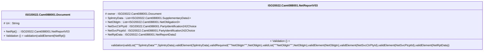

# camt.088.001.03-physical

> The tables below contain descriptions of the members of each Element. 
> The first column indicates the type of the member:
> A ‘#’ indicates that the field is a key to the element, and a ‘+’ indicates that the field is a value.
> The ‘*’ column contains a description for the element member.  
> The ‘@’ column contains any properties for the member.
> The ‘=’ column contains calculated values; or in the case of an enum, the serialized value.

---

## EntityImpl ISO20022.Camt088001.Document

| |Name|Type|*|@|=|
|-|-|-|-|-|-|
|#|Uri|String||XmlIgnore(), JsonIgnore()||
|+|NetRpt|ISO20022.Camt088001.NetReportV03||XmlElement()||
||Validation|Some(String)||XmlIgnore(), JsonIgnore()|validation(validElement(NetRpt))|

---

## AspectImpl ISO20022.Camt088001.NetReportV03

| |Name|Type|*|@|=|
|-|-|-|-|-|-|
|#|owner|ISO20022.Camt088001.Document||||
|+|SplmtryData|List<ISO20022.Camt088001.SupplementaryData1>||XmlElement()||
|+|NetOblgtn|List<ISO20022.Camt088001.NetObligation3>||XmlElement()||
|+|NetSvcCtrPtyId|ISO20022.Camt088001.PartyIdentification242Choice||XmlElement()||
|+|NetSvcPtcptId|ISO20022.Camt088001.PartyIdentification242Choice||XmlElement()||
|+|NetRptData|ISO20022.Camt088001.NetReportData2||XmlElement()||
||Validation|Some(String)||XmlIgnore(), JsonIgnore()|validation(validList("""SplmtryData""",SplmtryData),validElement(SplmtryData),validRequired("""NetOblgtn""",NetOblgtn),validList("""NetOblgtn""",NetOblgtn),validElement(NetOblgtn),validElement(NetSvcCtrPtyId),validElement(NetSvcPtcptId),validElement(NetRptData))|

