# camt.088.001.03

```mermaid
classDiagram
    class Hiperspace.Edge {
        # From  : Hiperspace.Node
        # To  : Hiperspace.Node
        # TypeName  : String
        + Name  : String
    }
    class ISO20022.Camt088001.ActiveCurrencyAndAmount {
        + Value  : Decimal
        + Ccy  : String
    }
    class ISO20022.Camt088001.AddressType2Code {
        DLVY = 1
        MLTO = 2
        BIZZ = 3
        HOME = 4
        PBOX = 5
        ADDR = 6
    }
    class ISO20022.Camt088001.ClearingSystemIdentification2Choice {
        + Prtry  : String
        + Cd  : String
    }
    class ISO20022.Camt088001.NameAndAddress8 {
        + AltrntvIdr  : global::System.Collections.Generic.List~String~
        + Adr  : ISO20022.Camt088001.PostalAddress1
        + Nm  : String
    }
    ISO20022.Camt088001.NameAndAddress8 *-- ISO20022.Camt088001.PostalAddress1
    class ISO20022.Camt088001.NetObligation3 {
        + TxsNb  : String
        + PmtClrCentr  : String
        + CtrPtySttlmInstrs  : ISO20022.Camt088001.SettlementParties120
        + NetSvcCtrPtyId  : ISO20022.Camt088001.PartyIdentification242Choice
        + CtrPtyNetgId  : ISO20022.Camt088001.NettingIdentification2Choice
        + OblgtnDrctn  : String
        + PtcptNetgId  : ISO20022.Camt088001.NettingIdentification2Choice
        + Amt  : ISO20022.Camt088001.ActiveCurrencyAndAmount
        + OblgtnId  : String
    }
    ISO20022.Camt088001.NetObligation3 *-- ISO20022.Camt088001.SettlementParties120
    ISO20022.Camt088001.NetObligation3 *-- ISO20022.Camt088001.PartyIdentification242Choice
    ISO20022.Camt088001.NetObligation3 *-- ISO20022.Camt088001.NettingIdentification2Choice
    ISO20022.Camt088001.NetObligation3 *-- ISO20022.Camt088001.NettingIdentification2Choice
    ISO20022.Camt088001.NetObligation3 *-- ISO20022.Camt088001.ActiveCurrencyAndAmount
    class ISO20022.Camt088001.NetReportData2 {
        + MsgPgntn  : ISO20022.Camt088001.Pagination1
        + NetSvcTp  : String
        + NetRptSvcr  : ISO20022.Camt088001.PartyIdentification242Choice
        + RptTp  : String
        + ValDt  : DateTime
        + RptDt  : DateTime
        + NetgCutOffTm  : DateTime
        + CreDtTm  : DateTime
        + MsgId  : String
    }
    ISO20022.Camt088001.NetReportData2 *-- ISO20022.Camt088001.Pagination1
    ISO20022.Camt088001.NetReportData2 *-- ISO20022.Camt088001.PartyIdentification242Choice
    class ISO20022.Camt088001.NetReportV03 {
        + SplmtryData  : global::System.Collections.Generic.List~ISO20022.Camt088001.SupplementaryData1~
        + NetOblgtn  : global::System.Collections.Generic.List~ISO20022.Camt088001.NetObligation3~
        + NetSvcCtrPtyId  : ISO20022.Camt088001.PartyIdentification242Choice
        + NetSvcPtcptId  : ISO20022.Camt088001.PartyIdentification242Choice
        + NetRptData  : ISO20022.Camt088001.NetReportData2
    }
    ISO20022.Camt088001.NetReportV03 *-- ISO20022.Camt088001.SupplementaryData1
    ISO20022.Camt088001.NetReportV03 *-- ISO20022.Camt088001.NetObligation3
    ISO20022.Camt088001.NetReportV03 *-- ISO20022.Camt088001.PartyIdentification242Choice
    ISO20022.Camt088001.NetReportV03 *-- ISO20022.Camt088001.PartyIdentification242Choice
    ISO20022.Camt088001.NetReportV03 *-- ISO20022.Camt088001.NetReportData2
    class ISO20022.Camt088001.NettingIdentification2Choice {
        + NetgGrpId  : String
        + TradPty  : ISO20022.Camt088001.PartyIdentification242Choice
    }
    ISO20022.Camt088001.NettingIdentification2Choice *-- ISO20022.Camt088001.PartyIdentification242Choice
    class ISO20022.Camt088001.Pagination1 {
        + LastPgInd  : String
        + PgNb  : String
    }
    class ISO20022.Camt088001.PartyIdentification242Choice {
        + PtyId  : ISO20022.Camt088001.PartyIdentification266
        + AnyBIC  : ISO20022.Camt088001.PartyIdentification265
        + NmAndAdr  : ISO20022.Camt088001.NameAndAddress8
    }
    ISO20022.Camt088001.PartyIdentification242Choice *-- ISO20022.Camt088001.PartyIdentification266
    ISO20022.Camt088001.PartyIdentification242Choice *-- ISO20022.Camt088001.PartyIdentification265
    ISO20022.Camt088001.PartyIdentification242Choice *-- ISO20022.Camt088001.NameAndAddress8
    class ISO20022.Camt088001.PartyIdentification265 {
        + AltrntvIdr  : global::System.Collections.Generic.List~String~
        + AnyBIC  : String
    }
    class ISO20022.Camt088001.PartyIdentification266 {
        + LglNttyIdr  : String
        + ClrSysId  : ISO20022.Camt088001.ClearingSystemIdentification2Choice
        + Adr  : String
        + AcctNb  : String
        + AnyBIC  : ISO20022.Camt088001.PartyIdentification265
        + PtyNm  : String
    }
    ISO20022.Camt088001.PartyIdentification266 *-- ISO20022.Camt088001.ClearingSystemIdentification2Choice
    ISO20022.Camt088001.PartyIdentification266 *-- ISO20022.Camt088001.PartyIdentification265
    class ISO20022.Camt088001.PaymentReceipt1Code {
        NONE = 1
        RECE = 2
        PAYM = 3
    }
    class ISO20022.Camt088001.PostalAddress1 {
        + Ctry  : String
        + CtrySubDvsn  : String
        + TwnNm  : String
        + PstCd  : String
        + BldgNb  : String
        + StrtNm  : String
        + AdrLine  : global::System.Collections.Generic.List~String~
        + AdrTp  : String
    }
    class ISO20022.Camt088001.SettlementParties120 {
        + BnfcryInstn  : ISO20022.Camt088001.PartyIdentification242Choice
        + RcvgAgt  : ISO20022.Camt088001.PartyIdentification242Choice
        + Intrmy  : ISO20022.Camt088001.PartyIdentification242Choice
        + DlvryAgt  : ISO20022.Camt088001.PartyIdentification242Choice
    }
    ISO20022.Camt088001.SettlementParties120 *-- ISO20022.Camt088001.PartyIdentification242Choice
    ISO20022.Camt088001.SettlementParties120 *-- ISO20022.Camt088001.PartyIdentification242Choice
    ISO20022.Camt088001.SettlementParties120 *-- ISO20022.Camt088001.PartyIdentification242Choice
    ISO20022.Camt088001.SettlementParties120 *-- ISO20022.Camt088001.PartyIdentification242Choice
    class ISO20022.Camt088001.SupplementaryData1 {
        + Envlp  : ISO20022.Camt088001.SupplementaryDataEnvelope1
        + PlcAndNm  : String
    }
    ISO20022.Camt088001.SupplementaryData1 *-- ISO20022.Camt088001.SupplementaryDataEnvelope1
    class ISO20022.Camt088001.SupplementaryDataEnvelope1 {
    }
    class Hiperspace.Node {
        # SKey  : String
        + TypeName  : String
        + Name  : String
        + Froms (From = this) : Hiperspace.Edge
        + Tos (To = this) : Hiperspace.Edge
    }
```

> The tables below contain descriptions of the members of each Element. 
> The first column indicates the type of the member:
> A ‘#’ indicates that the field is a key to the element, and a ‘+’ indicates that the field is a value.
> The ‘*’ column contains a description for the element member.  
> The ‘@’ column contains any properties for the member.
> The ‘=’ column contains calculated values; or in the case of an enum, the serialized value.

---

## View Hiperspace.Edge
edge between nodes

| |Name|Type|*|@|=|
|-|-|-|-|-|-|
|#|From|Hiperspace.Node||||
|#|To|Hiperspace.Node||||
|#|TypeName|String||||
|+|Name|String||||

---

## Value ISO20022.Camt088001.ActiveCurrencyAndAmount

| |Name|Type|*|@|=|
|-|-|-|-|-|-|
|+|Value|Decimal||XmlElement()||
|+|Ccy|String||XmlAttribute()||
||Validation|Some(String)||XmlIgnore(), JsonIgnore()|validation(validRequired("""Value""",Value),validRequired("""Ccy""",Ccy),validPattern("""Ccy""",Ccy,"""[A-Z]{3,3}"""))|

---

## Enum ISO20022.Camt088001.AddressType2Code

| |Name|Type|*|@|=|
|-|-|-|-|-|-|
||DLVY|Int32||XmlEnum("""DLVY""")|1|
||MLTO|Int32||XmlEnum("""MLTO""")|2|
||BIZZ|Int32||XmlEnum("""BIZZ""")|3|
||HOME|Int32||XmlEnum("""HOME""")|4|
||PBOX|Int32||XmlEnum("""PBOX""")|5|
||ADDR|Int32||XmlEnum("""ADDR""")|6|

---

## Value ISO20022.Camt088001.ClearingSystemIdentification2Choice

| |Name|Type|*|@|=|
|-|-|-|-|-|-|
|+|Prtry|String||XmlElement()||
|+|Cd|String||XmlElement()||
||Validation|Some(String)||XmlIgnore(), JsonIgnore()|validation(validChoice(Prtry,Cd))|

---

## Type ISO20022.Camt088001.Document

| |Name|Type|*|@|=|
|-|-|-|-|-|-|
|+|NetRpt|ISO20022.Camt088001.NetReportV03||XmlElement()||
||Validation|Some(String)||XmlIgnore(), JsonIgnore()|validation(validElement(NetRpt))|

---

## Value ISO20022.Camt088001.NameAndAddress8

| |Name|Type|*|@|=|
|-|-|-|-|-|-|
|+|AltrntvIdr|global::System.Collections.Generic.List<String>||XmlElement()||
|+|Adr|ISO20022.Camt088001.PostalAddress1||XmlElement()||
|+|Nm|String||XmlElement()||
||Validation|Some(String)||XmlIgnore(), JsonIgnore()|validation(validListMax("""AltrntvIdr""",AltrntvIdr,10),validElement(Adr))|

---

## Value ISO20022.Camt088001.NetObligation3

| |Name|Type|*|@|=|
|-|-|-|-|-|-|
|+|TxsNb|String||XmlElement()||
|+|PmtClrCentr|String||XmlElement()||
|+|CtrPtySttlmInstrs|ISO20022.Camt088001.SettlementParties120||XmlElement()||
|+|NetSvcCtrPtyId|ISO20022.Camt088001.PartyIdentification242Choice||XmlElement()||
|+|CtrPtyNetgId|ISO20022.Camt088001.NettingIdentification2Choice||XmlElement()||
|+|OblgtnDrctn|String||XmlElement()||
|+|PtcptNetgId|ISO20022.Camt088001.NettingIdentification2Choice||XmlElement()||
|+|Amt|ISO20022.Camt088001.ActiveCurrencyAndAmount||XmlElement()||
|+|OblgtnId|String||XmlElement()||
||Validation|Some(String)||XmlIgnore(), JsonIgnore()|validation(validPattern("""TxsNb""",TxsNb,"""[0-9]{1,10}"""),validPattern("""PmtClrCentr""",PmtClrCentr,"""[A-Z]{2,2}"""),validElement(CtrPtySttlmInstrs),validElement(NetSvcCtrPtyId),validElement(CtrPtyNetgId),validElement(PtcptNetgId),validElement(Amt))|

---

## Value ISO20022.Camt088001.NetReportData2

| |Name|Type|*|@|=|
|-|-|-|-|-|-|
|+|MsgPgntn|ISO20022.Camt088001.Pagination1||XmlElement()||
|+|NetSvcTp|String||XmlElement()||
|+|NetRptSvcr|ISO20022.Camt088001.PartyIdentification242Choice||XmlElement()||
|+|RptTp|String||XmlElement()||
|+|ValDt|DateTime||XmlElement()||
|+|RptDt|DateTime||XmlElement()||
|+|NetgCutOffTm|DateTime||XmlElement()||
|+|CreDtTm|DateTime||XmlElement()||
|+|MsgId|String||XmlElement()||
||Validation|Some(String)||XmlIgnore(), JsonIgnore()|validation(validElement(MsgPgntn),validElement(NetRptSvcr))|

---

## Aspect ISO20022.Camt088001.NetReportV03

| |Name|Type|*|@|=|
|-|-|-|-|-|-|
|+|SplmtryData|global::System.Collections.Generic.List<ISO20022.Camt088001.SupplementaryData1>||XmlElement()||
|+|NetOblgtn|global::System.Collections.Generic.List<ISO20022.Camt088001.NetObligation3>||XmlElement()||
|+|NetSvcCtrPtyId|ISO20022.Camt088001.PartyIdentification242Choice||XmlElement()||
|+|NetSvcPtcptId|ISO20022.Camt088001.PartyIdentification242Choice||XmlElement()||
|+|NetRptData|ISO20022.Camt088001.NetReportData2||XmlElement()||
||Validation|Some(String)||XmlIgnore(), JsonIgnore()|validation(validList("""SplmtryData""",SplmtryData),validElement(SplmtryData),validRequired("""NetOblgtn""",NetOblgtn),validList("""NetOblgtn""",NetOblgtn),validElement(NetOblgtn),validElement(NetSvcCtrPtyId),validElement(NetSvcPtcptId),validElement(NetRptData))|

---

## Value ISO20022.Camt088001.NettingIdentification2Choice

| |Name|Type|*|@|=|
|-|-|-|-|-|-|
|+|NetgGrpId|String||XmlElement()||
|+|TradPty|ISO20022.Camt088001.PartyIdentification242Choice||XmlElement()||
||Validation|Some(String)||XmlIgnore(), JsonIgnore()|validation(validElement(TradPty),validChoice(NetgGrpId,TradPty))|

---

## Value ISO20022.Camt088001.Pagination1

| |Name|Type|*|@|=|
|-|-|-|-|-|-|
|+|LastPgInd|String||XmlElement()||
|+|PgNb|String||XmlElement()||
||Validation|Some(String)||XmlIgnore(), JsonIgnore()|validation(validPattern("""PgNb""",PgNb,"""[0-9]{1,5}"""))|

---

## Value ISO20022.Camt088001.PartyIdentification242Choice

| |Name|Type|*|@|=|
|-|-|-|-|-|-|
|+|PtyId|ISO20022.Camt088001.PartyIdentification266||XmlElement()||
|+|AnyBIC|ISO20022.Camt088001.PartyIdentification265||XmlElement()||
|+|NmAndAdr|ISO20022.Camt088001.NameAndAddress8||XmlElement()||
||Validation|Some(String)||XmlIgnore(), JsonIgnore()|validation(validElement(PtyId),validElement(AnyBIC),validElement(NmAndAdr),validChoice(PtyId,AnyBIC,NmAndAdr))|

---

## Value ISO20022.Camt088001.PartyIdentification265

| |Name|Type|*|@|=|
|-|-|-|-|-|-|
|+|AltrntvIdr|global::System.Collections.Generic.List<String>||XmlElement()||
|+|AnyBIC|String||XmlElement()||
||Validation|Some(String)||XmlIgnore(), JsonIgnore()|validation(validListMax("""AltrntvIdr""",AltrntvIdr,10),validPattern("""AnyBIC""",AnyBIC,"""[A-Z0-9]{4,4}[A-Z]{2,2}[A-Z0-9]{2,2}([A-Z0-9]{3,3}){0,1}"""))|

---

## Value ISO20022.Camt088001.PartyIdentification266

| |Name|Type|*|@|=|
|-|-|-|-|-|-|
|+|LglNttyIdr|String||XmlElement()||
|+|ClrSysId|ISO20022.Camt088001.ClearingSystemIdentification2Choice||XmlElement()||
|+|Adr|String||XmlElement()||
|+|AcctNb|String||XmlElement()||
|+|AnyBIC|ISO20022.Camt088001.PartyIdentification265||XmlElement()||
|+|PtyNm|String||XmlElement()||
||Validation|Some(String)||XmlIgnore(), JsonIgnore()|validation(validPattern("""LglNttyIdr""",LglNttyIdr,"""[A-Z0-9]{18,18}[0-9]{2,2}"""),validElement(ClrSysId),validElement(AnyBIC))|

---

## Enum ISO20022.Camt088001.PaymentReceipt1Code

| |Name|Type|*|@|=|
|-|-|-|-|-|-|
||NONE|Int32||XmlEnum("""NONE""")|1|
||RECE|Int32||XmlEnum("""RECE""")|2|
||PAYM|Int32||XmlEnum("""PAYM""")|3|

---

## Value ISO20022.Camt088001.PostalAddress1

| |Name|Type|*|@|=|
|-|-|-|-|-|-|
|+|Ctry|String||XmlElement()||
|+|CtrySubDvsn|String||XmlElement()||
|+|TwnNm|String||XmlElement()||
|+|PstCd|String||XmlElement()||
|+|BldgNb|String||XmlElement()||
|+|StrtNm|String||XmlElement()||
|+|AdrLine|global::System.Collections.Generic.List<String>||XmlElement()||
|+|AdrTp|String||XmlElement()||
||Validation|Some(String)||XmlIgnore(), JsonIgnore()|validation(validPattern("""Ctry""",Ctry,"""[A-Z]{2,2}"""),validListMax("""AdrLine""",AdrLine,5))|

---

## Value ISO20022.Camt088001.SettlementParties120

| |Name|Type|*|@|=|
|-|-|-|-|-|-|
|+|BnfcryInstn|ISO20022.Camt088001.PartyIdentification242Choice||XmlElement()||
|+|RcvgAgt|ISO20022.Camt088001.PartyIdentification242Choice||XmlElement()||
|+|Intrmy|ISO20022.Camt088001.PartyIdentification242Choice||XmlElement()||
|+|DlvryAgt|ISO20022.Camt088001.PartyIdentification242Choice||XmlElement()||
||Validation|Some(String)||XmlIgnore(), JsonIgnore()|validation(validElement(BnfcryInstn),validElement(RcvgAgt),validElement(Intrmy),validElement(DlvryAgt))|

---

## Value ISO20022.Camt088001.SupplementaryData1

| |Name|Type|*|@|=|
|-|-|-|-|-|-|
|+|Envlp|ISO20022.Camt088001.SupplementaryDataEnvelope1||XmlElement()||
|+|PlcAndNm|String||XmlElement()||
||Validation|Some(String)||XmlIgnore(), JsonIgnore()|validation(validElement(Envlp))|

---

## Value ISO20022.Camt088001.SupplementaryDataEnvelope1

| |Name|Type|*|@|=|
|-|-|-|-|-|-|
||Validation|Some(String)||XmlIgnore(), JsonIgnore()|""|

---

## View Hiperspace.Node
node in a graph view of data

| |Name|Type|*|@|=|
|-|-|-|-|-|-|
|#|SKey|String||||
|+|TypeName|String||||
|+|Name|String||||
||Froms|Hiperspace.Edge|||From = this|
||Tos|Hiperspace.Edge|||To = this|

