# camt.101.001.02

```mermaid
classDiagram
    class Hiperspace.Edge {
        # From  : Hiperspace.Node
        # To  : Hiperspace.Node
        # TypeName  : String
        + Name  : String
    }
    class ISO20022.Camt101001.AccountIdentification4Choice {
        + Othr  : ISO20022.Camt101001.GenericAccountIdentification1
        + IBAN  : String
    }
    ISO20022.Camt101001.AccountIdentification4Choice *-- ISO20022.Camt101001.GenericAccountIdentification1
    class ISO20022.Camt101001.AccountSchemeName1Choice {
        + Prtry  : String
        + Cd  : String
    }
    class ISO20022.Camt101001.ActiveCurrencyAndAmount {
        + Value  : Decimal
        + Ccy  : String
    }
    class ISO20022.Camt101001.AddressType2Code {
        DLVY = 1
        MLTO = 2
        BIZZ = 3
        HOME = 4
        PBOX = 5
        ADDR = 6
    }
    class ISO20022.Camt101001.AddressType3Choice {
        + Prtry  : ISO20022.Camt101001.GenericIdentification30
        + Cd  : String
    }
    ISO20022.Camt101001.AddressType3Choice *-- ISO20022.Camt101001.GenericIdentification30
    class ISO20022.Camt101001.Amount2Choice {
        + AmtWthCcy  : ISO20022.Camt101001.ActiveCurrencyAndAmount
        + AmtWthtCcy  : Decimal
    }
    ISO20022.Camt101001.Amount2Choice *-- ISO20022.Camt101001.ActiveCurrencyAndAmount
    class ISO20022.Camt101001.BranchAndFinancialInstitutionIdentification8 {
        + BrnchId  : ISO20022.Camt101001.BranchData5
        + FinInstnId  : ISO20022.Camt101001.FinancialInstitutionIdentification23
    }
    ISO20022.Camt101001.BranchAndFinancialInstitutionIdentification8 *-- ISO20022.Camt101001.BranchData5
    ISO20022.Camt101001.BranchAndFinancialInstitutionIdentification8 *-- ISO20022.Camt101001.FinancialInstitutionIdentification23
    class ISO20022.Camt101001.BranchData5 {
        + PstlAdr  : ISO20022.Camt101001.PostalAddress27
        + Nm  : String
        + LEI  : String
        + Id  : String
    }
    ISO20022.Camt101001.BranchData5 *-- ISO20022.Camt101001.PostalAddress27
    class ISO20022.Camt101001.ClearingSystemIdentification2Choice {
        + Prtry  : String
        + Cd  : String
    }
    class ISO20022.Camt101001.ClearingSystemMemberIdentification2 {
        + MmbId  : String
        + ClrSysId  : ISO20022.Camt101001.ClearingSystemIdentification2Choice
    }
    ISO20022.Camt101001.ClearingSystemMemberIdentification2 *-- ISO20022.Camt101001.ClearingSystemIdentification2Choice
    class ISO20022.Camt101001.CreateLimitV02 {
        + SplmtryData  : global::System.Collections.Generic.List~ISO20022.Camt101001.SupplementaryData1~
        + LmtData  : global::System.Collections.Generic.List~ISO20022.Camt101001.LimitStructure6~
        + MsgHdr  : ISO20022.Camt101001.MessageHeader1
    }
    ISO20022.Camt101001.CreateLimitV02 *-- ISO20022.Camt101001.SupplementaryData1
    ISO20022.Camt101001.CreateLimitV02 *-- ISO20022.Camt101001.LimitStructure6
    ISO20022.Camt101001.CreateLimitV02 *-- ISO20022.Camt101001.MessageHeader1
    class ISO20022.Camt101001.CreditDebitCode {
        DBIT = 1
        CRDT = 2
    }
    class ISO20022.Camt101001.DateAndDateTime2Choice {
        + DtTm  : DateTime
        + Dt  : DateTime
    }
    class ISO20022.Camt101001.FinancialIdentificationSchemeName1Choice {
        + Prtry  : String
        + Cd  : String
    }
    class ISO20022.Camt101001.FinancialInstitutionIdentification23 {
        + Othr  : ISO20022.Camt101001.GenericFinancialIdentification1
        + PstlAdr  : ISO20022.Camt101001.PostalAddress27
        + Nm  : String
        + LEI  : String
        + ClrSysMmbId  : ISO20022.Camt101001.ClearingSystemMemberIdentification2
        + BICFI  : String
    }
    ISO20022.Camt101001.FinancialInstitutionIdentification23 *-- ISO20022.Camt101001.GenericFinancialIdentification1
    ISO20022.Camt101001.FinancialInstitutionIdentification23 *-- ISO20022.Camt101001.PostalAddress27
    ISO20022.Camt101001.FinancialInstitutionIdentification23 *-- ISO20022.Camt101001.ClearingSystemMemberIdentification2
    class ISO20022.Camt101001.GenericAccountIdentification1 {
        + Issr  : String
        + SchmeNm  : ISO20022.Camt101001.AccountSchemeName1Choice
        + Id  : String
    }
    ISO20022.Camt101001.GenericAccountIdentification1 *-- ISO20022.Camt101001.AccountSchemeName1Choice
    class ISO20022.Camt101001.GenericFinancialIdentification1 {
        + Issr  : String
        + SchmeNm  : ISO20022.Camt101001.FinancialIdentificationSchemeName1Choice
        + Id  : String
    }
    ISO20022.Camt101001.GenericFinancialIdentification1 *-- ISO20022.Camt101001.FinancialIdentificationSchemeName1Choice
    class ISO20022.Camt101001.GenericIdentification30 {
        + SchmeNm  : String
        + Issr  : String
        + Id  : String
    }
    class ISO20022.Camt101001.LimitIdentification8 {
        + AcctId  : ISO20022.Camt101001.AccountIdentification4Choice
        + AcctOwnr  : ISO20022.Camt101001.BranchAndFinancialInstitutionIdentification8
        + Tp  : ISO20022.Camt101001.LimitType1Choice
        + BilLmtCtrPtyId  : ISO20022.Camt101001.BranchAndFinancialInstitutionIdentification8
        + SysId  : ISO20022.Camt101001.SystemIdentification2Choice
    }
    ISO20022.Camt101001.LimitIdentification8 *-- ISO20022.Camt101001.AccountIdentification4Choice
    ISO20022.Camt101001.LimitIdentification8 *-- ISO20022.Camt101001.BranchAndFinancialInstitutionIdentification8
    ISO20022.Camt101001.LimitIdentification8 *-- ISO20022.Camt101001.LimitType1Choice
    ISO20022.Camt101001.LimitIdentification8 *-- ISO20022.Camt101001.BranchAndFinancialInstitutionIdentification8
    ISO20022.Camt101001.LimitIdentification8 *-- ISO20022.Camt101001.SystemIdentification2Choice
    class ISO20022.Camt101001.LimitStructure6 {
        + CdtDbtInd  : String
        + Amt  : ISO20022.Camt101001.Amount2Choice
        + StartDtTm  : ISO20022.Camt101001.DateAndDateTime2Choice
        + LmtId  : ISO20022.Camt101001.LimitIdentification8
    }
    ISO20022.Camt101001.LimitStructure6 *-- ISO20022.Camt101001.Amount2Choice
    ISO20022.Camt101001.LimitStructure6 *-- ISO20022.Camt101001.DateAndDateTime2Choice
    ISO20022.Camt101001.LimitStructure6 *-- ISO20022.Camt101001.LimitIdentification8
    class ISO20022.Camt101001.LimitType1Choice {
        + Prtry  : String
        + Cd  : String
    }
    class ISO20022.Camt101001.LimitType3Code {
        EXGT = 1
        ACOL = 2
        UCDT = 3
        TDLF = 4
        TDLC = 5
        SPLF = 6
        SPLC = 7
        DIDB = 8
        GLBL = 9
        INBI = 10
        NELI = 11
        DISC = 12
        MAND = 13
        BILI = 14
        MULT = 15
    }
    class ISO20022.Camt101001.MarketInfrastructureIdentification1Choice {
        + Prtry  : String
        + Cd  : String
    }
    class ISO20022.Camt101001.MessageHeader1 {
        + CreDtTm  : DateTime
        + MsgId  : String
    }
    class ISO20022.Camt101001.PostalAddress27 {
        + AdrLine  : global::System.Collections.Generic.List~String~
        + Ctry  : String
        + CtrySubDvsn  : String
        + DstrctNm  : String
        + TwnLctnNm  : String
        + TwnNm  : String
        + PstCd  : String
        + Room  : String
        + PstBx  : String
        + UnitNb  : String
        + Flr  : String
        + BldgNm  : String
        + BldgNb  : String
        + StrtNm  : String
        + SubDept  : String
        + Dept  : String
        + CareOf  : String
        + AdrTp  : ISO20022.Camt101001.AddressType3Choice
    }
    ISO20022.Camt101001.PostalAddress27 *-- ISO20022.Camt101001.AddressType3Choice
    class ISO20022.Camt101001.SupplementaryData1 {
        + Envlp  : ISO20022.Camt101001.SupplementaryDataEnvelope1
        + PlcAndNm  : String
    }
    ISO20022.Camt101001.SupplementaryData1 *-- ISO20022.Camt101001.SupplementaryDataEnvelope1
    class ISO20022.Camt101001.SupplementaryDataEnvelope1 {
    }
    class ISO20022.Camt101001.SystemIdentification2Choice {
        + Ctry  : String
        + MktInfrstrctrId  : ISO20022.Camt101001.MarketInfrastructureIdentification1Choice
    }
    ISO20022.Camt101001.SystemIdentification2Choice *-- ISO20022.Camt101001.MarketInfrastructureIdentification1Choice
    class Hiperspace.Node {
        # SKey  : String
        + TypeName  : String
        + Name  : String
        + Froms (From = this) : Hiperspace.Edge
        + Tos (To = this) : Hiperspace.Edge
    }
```

> The tables below contain descriptions of the members of each Element. 
> The first column indicates the type of the member:
> A ‘#’ indicates that the field is a key to the element, and a ‘+’ indicates that the field is a value.
> The ‘*’ column contains a description for the element member.  
> The ‘@’ column contains any properties for the member.
> The ‘=’ column contains calculated values; or in the case of an enum, the serialized value.

---

## View Hiperspace.Edge
edge between nodes

| |Name|Type|*|@|=|
|-|-|-|-|-|-|
|#|From|Hiperspace.Node||||
|#|To|Hiperspace.Node||||
|#|TypeName|String||||
|+|Name|String||||

---

## Value ISO20022.Camt101001.AccountIdentification4Choice

| |Name|Type|*|@|=|
|-|-|-|-|-|-|
|+|Othr|ISO20022.Camt101001.GenericAccountIdentification1||XmlElement()||
|+|IBAN|String||XmlElement()||
||Validation|Some(String)||XmlIgnore(), JsonIgnore()|validation(validElement(Othr),validPattern("""IBAN""",IBAN,"""[A-Z]{2,2}[0-9]{2,2}[a-zA-Z0-9]{1,30}"""),validChoice(Othr,IBAN))|

---

## Value ISO20022.Camt101001.AccountSchemeName1Choice

| |Name|Type|*|@|=|
|-|-|-|-|-|-|
|+|Prtry|String||XmlElement()||
|+|Cd|String||XmlElement()||
||Validation|Some(String)||XmlIgnore(), JsonIgnore()|validation(validChoice(Prtry,Cd))|

---

## Value ISO20022.Camt101001.ActiveCurrencyAndAmount

| |Name|Type|*|@|=|
|-|-|-|-|-|-|
|+|Value|Decimal||XmlElement()||
|+|Ccy|String||XmlAttribute()||
||Validation|Some(String)||XmlIgnore(), JsonIgnore()|validation(validRequired("""Value""",Value),validRequired("""Ccy""",Ccy),validPattern("""Ccy""",Ccy,"""[A-Z]{3,3}"""))|

---

## Enum ISO20022.Camt101001.AddressType2Code

| |Name|Type|*|@|=|
|-|-|-|-|-|-|
||DLVY|Int32||XmlEnum("""DLVY""")|1|
||MLTO|Int32||XmlEnum("""MLTO""")|2|
||BIZZ|Int32||XmlEnum("""BIZZ""")|3|
||HOME|Int32||XmlEnum("""HOME""")|4|
||PBOX|Int32||XmlEnum("""PBOX""")|5|
||ADDR|Int32||XmlEnum("""ADDR""")|6|

---

## Value ISO20022.Camt101001.AddressType3Choice

| |Name|Type|*|@|=|
|-|-|-|-|-|-|
|+|Prtry|ISO20022.Camt101001.GenericIdentification30||XmlElement()||
|+|Cd|String||XmlElement()||
||Validation|Some(String)||XmlIgnore(), JsonIgnore()|validation(validElement(Prtry),validChoice(Prtry,Cd))|

---

## Value ISO20022.Camt101001.Amount2Choice

| |Name|Type|*|@|=|
|-|-|-|-|-|-|
|+|AmtWthCcy|ISO20022.Camt101001.ActiveCurrencyAndAmount||XmlElement()||
|+|AmtWthtCcy|Decimal||XmlElement()||
||Validation|Some(String)||XmlIgnore(), JsonIgnore()|validation(validElement(AmtWthCcy),validChoice(AmtWthCcy,AmtWthtCcy))|

---

## Value ISO20022.Camt101001.BranchAndFinancialInstitutionIdentification8

| |Name|Type|*|@|=|
|-|-|-|-|-|-|
|+|BrnchId|ISO20022.Camt101001.BranchData5||XmlElement()||
|+|FinInstnId|ISO20022.Camt101001.FinancialInstitutionIdentification23||XmlElement()||
||Validation|Some(String)||XmlIgnore(), JsonIgnore()|validation(validElement(BrnchId),validElement(FinInstnId))|

---

## Value ISO20022.Camt101001.BranchData5

| |Name|Type|*|@|=|
|-|-|-|-|-|-|
|+|PstlAdr|ISO20022.Camt101001.PostalAddress27||XmlElement()||
|+|Nm|String||XmlElement()||
|+|LEI|String||XmlElement()||
|+|Id|String||XmlElement()||
||Validation|Some(String)||XmlIgnore(), JsonIgnore()|validation(validElement(PstlAdr),validPattern("""LEI""",LEI,"""[A-Z0-9]{18,18}[0-9]{2,2}"""))|

---

## Value ISO20022.Camt101001.ClearingSystemIdentification2Choice

| |Name|Type|*|@|=|
|-|-|-|-|-|-|
|+|Prtry|String||XmlElement()||
|+|Cd|String||XmlElement()||
||Validation|Some(String)||XmlIgnore(), JsonIgnore()|validation(validChoice(Prtry,Cd))|

---

## Value ISO20022.Camt101001.ClearingSystemMemberIdentification2

| |Name|Type|*|@|=|
|-|-|-|-|-|-|
|+|MmbId|String||XmlElement()||
|+|ClrSysId|ISO20022.Camt101001.ClearingSystemIdentification2Choice||XmlElement()||
||Validation|Some(String)||XmlIgnore(), JsonIgnore()|validation(validElement(ClrSysId))|

---

## Aspect ISO20022.Camt101001.CreateLimitV02

| |Name|Type|*|@|=|
|-|-|-|-|-|-|
|+|SplmtryData|global::System.Collections.Generic.List<ISO20022.Camt101001.SupplementaryData1>||XmlElement()||
|+|LmtData|global::System.Collections.Generic.List<ISO20022.Camt101001.LimitStructure6>||XmlElement()||
|+|MsgHdr|ISO20022.Camt101001.MessageHeader1||XmlElement()||
||Validation|Some(String)||XmlIgnore(), JsonIgnore()|validation(validList("""SplmtryData""",SplmtryData),validElement(SplmtryData),validRequired("""LmtData""",LmtData),validList("""LmtData""",LmtData),validElement(LmtData),validElement(MsgHdr))|

---

## Enum ISO20022.Camt101001.CreditDebitCode

| |Name|Type|*|@|=|
|-|-|-|-|-|-|
||DBIT|Int32||XmlEnum("""DBIT""")|1|
||CRDT|Int32||XmlEnum("""CRDT""")|2|

---

## Value ISO20022.Camt101001.DateAndDateTime2Choice

| |Name|Type|*|@|=|
|-|-|-|-|-|-|
|+|DtTm|DateTime||XmlElement()||
|+|Dt|DateTime||XmlElement()||
||Validation|Some(String)||XmlIgnore(), JsonIgnore()|validation(validChoice(DtTm,Dt))|

---

## Type ISO20022.Camt101001.Document

| |Name|Type|*|@|=|
|-|-|-|-|-|-|
|+|CretLmt|ISO20022.Camt101001.CreateLimitV02||XmlElement()||
||Validation|Some(String)||XmlIgnore(), JsonIgnore()|validation(validElement(CretLmt))|

---

## Value ISO20022.Camt101001.FinancialIdentificationSchemeName1Choice

| |Name|Type|*|@|=|
|-|-|-|-|-|-|
|+|Prtry|String||XmlElement()||
|+|Cd|String||XmlElement()||
||Validation|Some(String)||XmlIgnore(), JsonIgnore()|validation(validChoice(Prtry,Cd))|

---

## Value ISO20022.Camt101001.FinancialInstitutionIdentification23

| |Name|Type|*|@|=|
|-|-|-|-|-|-|
|+|Othr|ISO20022.Camt101001.GenericFinancialIdentification1||XmlElement()||
|+|PstlAdr|ISO20022.Camt101001.PostalAddress27||XmlElement()||
|+|Nm|String||XmlElement()||
|+|LEI|String||XmlElement()||
|+|ClrSysMmbId|ISO20022.Camt101001.ClearingSystemMemberIdentification2||XmlElement()||
|+|BICFI|String||XmlElement()||
||Validation|Some(String)||XmlIgnore(), JsonIgnore()|validation(validElement(Othr),validElement(PstlAdr),validPattern("""LEI""",LEI,"""[A-Z0-9]{18,18}[0-9]{2,2}"""),validElement(ClrSysMmbId),validPattern("""BICFI""",BICFI,"""[A-Z0-9]{4,4}[A-Z]{2,2}[A-Z0-9]{2,2}([A-Z0-9]{3,3}){0,1}"""))|

---

## Value ISO20022.Camt101001.GenericAccountIdentification1

| |Name|Type|*|@|=|
|-|-|-|-|-|-|
|+|Issr|String||XmlElement()||
|+|SchmeNm|ISO20022.Camt101001.AccountSchemeName1Choice||XmlElement()||
|+|Id|String||XmlElement()||
||Validation|Some(String)||XmlIgnore(), JsonIgnore()|validation(validElement(SchmeNm))|

---

## Value ISO20022.Camt101001.GenericFinancialIdentification1

| |Name|Type|*|@|=|
|-|-|-|-|-|-|
|+|Issr|String||XmlElement()||
|+|SchmeNm|ISO20022.Camt101001.FinancialIdentificationSchemeName1Choice||XmlElement()||
|+|Id|String||XmlElement()||
||Validation|Some(String)||XmlIgnore(), JsonIgnore()|validation(validElement(SchmeNm))|

---

## Value ISO20022.Camt101001.GenericIdentification30

| |Name|Type|*|@|=|
|-|-|-|-|-|-|
|+|SchmeNm|String||XmlElement()||
|+|Issr|String||XmlElement()||
|+|Id|String||XmlElement()||
||Validation|Some(String)||XmlIgnore(), JsonIgnore()|validation(validPattern("""Id""",Id,"""[a-zA-Z0-9]{4}"""))|

---

## Value ISO20022.Camt101001.LimitIdentification8

| |Name|Type|*|@|=|
|-|-|-|-|-|-|
|+|AcctId|ISO20022.Camt101001.AccountIdentification4Choice||XmlElement()||
|+|AcctOwnr|ISO20022.Camt101001.BranchAndFinancialInstitutionIdentification8||XmlElement()||
|+|Tp|ISO20022.Camt101001.LimitType1Choice||XmlElement()||
|+|BilLmtCtrPtyId|ISO20022.Camt101001.BranchAndFinancialInstitutionIdentification8||XmlElement()||
|+|SysId|ISO20022.Camt101001.SystemIdentification2Choice||XmlElement()||
||Validation|Some(String)||XmlIgnore(), JsonIgnore()|validation(validElement(AcctId),validElement(AcctOwnr),validElement(Tp),validElement(BilLmtCtrPtyId),validElement(SysId))|

---

## Value ISO20022.Camt101001.LimitStructure6

| |Name|Type|*|@|=|
|-|-|-|-|-|-|
|+|CdtDbtInd|String||XmlElement()||
|+|Amt|ISO20022.Camt101001.Amount2Choice||XmlElement()||
|+|StartDtTm|ISO20022.Camt101001.DateAndDateTime2Choice||XmlElement()||
|+|LmtId|ISO20022.Camt101001.LimitIdentification8||XmlElement()||
||Validation|Some(String)||XmlIgnore(), JsonIgnore()|validation(validElement(Amt),validElement(StartDtTm),validElement(LmtId))|

---

## Value ISO20022.Camt101001.LimitType1Choice

| |Name|Type|*|@|=|
|-|-|-|-|-|-|
|+|Prtry|String||XmlElement()||
|+|Cd|String||XmlElement()||
||Validation|Some(String)||XmlIgnore(), JsonIgnore()|validation(validChoice(Prtry,Cd))|

---

## Enum ISO20022.Camt101001.LimitType3Code

| |Name|Type|*|@|=|
|-|-|-|-|-|-|
||EXGT|Int32||XmlEnum("""EXGT""")|1|
||ACOL|Int32||XmlEnum("""ACOL""")|2|
||UCDT|Int32||XmlEnum("""UCDT""")|3|
||TDLF|Int32||XmlEnum("""TDLF""")|4|
||TDLC|Int32||XmlEnum("""TDLC""")|5|
||SPLF|Int32||XmlEnum("""SPLF""")|6|
||SPLC|Int32||XmlEnum("""SPLC""")|7|
||DIDB|Int32||XmlEnum("""DIDB""")|8|
||GLBL|Int32||XmlEnum("""GLBL""")|9|
||INBI|Int32||XmlEnum("""INBI""")|10|
||NELI|Int32||XmlEnum("""NELI""")|11|
||DISC|Int32||XmlEnum("""DISC""")|12|
||MAND|Int32||XmlEnum("""MAND""")|13|
||BILI|Int32||XmlEnum("""BILI""")|14|
||MULT|Int32||XmlEnum("""MULT""")|15|

---

## Value ISO20022.Camt101001.MarketInfrastructureIdentification1Choice

| |Name|Type|*|@|=|
|-|-|-|-|-|-|
|+|Prtry|String||XmlElement()||
|+|Cd|String||XmlElement()||
||Validation|Some(String)||XmlIgnore(), JsonIgnore()|validation(validChoice(Prtry,Cd))|

---

## Value ISO20022.Camt101001.MessageHeader1

| |Name|Type|*|@|=|
|-|-|-|-|-|-|
|+|CreDtTm|DateTime||XmlElement()||
|+|MsgId|String||XmlElement()||
||Validation|Some(String)||XmlIgnore(), JsonIgnore()|""|

---

## Value ISO20022.Camt101001.PostalAddress27

| |Name|Type|*|@|=|
|-|-|-|-|-|-|
|+|AdrLine|global::System.Collections.Generic.List<String>||XmlElement()||
|+|Ctry|String||XmlElement()||
|+|CtrySubDvsn|String||XmlElement()||
|+|DstrctNm|String||XmlElement()||
|+|TwnLctnNm|String||XmlElement()||
|+|TwnNm|String||XmlElement()||
|+|PstCd|String||XmlElement()||
|+|Room|String||XmlElement()||
|+|PstBx|String||XmlElement()||
|+|UnitNb|String||XmlElement()||
|+|Flr|String||XmlElement()||
|+|BldgNm|String||XmlElement()||
|+|BldgNb|String||XmlElement()||
|+|StrtNm|String||XmlElement()||
|+|SubDept|String||XmlElement()||
|+|Dept|String||XmlElement()||
|+|CareOf|String||XmlElement()||
|+|AdrTp|ISO20022.Camt101001.AddressType3Choice||XmlElement()||
||Validation|Some(String)||XmlIgnore(), JsonIgnore()|validation(validListMax("""AdrLine""",AdrLine,7),validPattern("""Ctry""",Ctry,"""[A-Z]{2,2}"""),validElement(AdrTp))|

---

## Value ISO20022.Camt101001.SupplementaryData1

| |Name|Type|*|@|=|
|-|-|-|-|-|-|
|+|Envlp|ISO20022.Camt101001.SupplementaryDataEnvelope1||XmlElement()||
|+|PlcAndNm|String||XmlElement()||
||Validation|Some(String)||XmlIgnore(), JsonIgnore()|validation(validElement(Envlp))|

---

## Value ISO20022.Camt101001.SupplementaryDataEnvelope1

| |Name|Type|*|@|=|
|-|-|-|-|-|-|
||Validation|Some(String)||XmlIgnore(), JsonIgnore()|""|

---

## Value ISO20022.Camt101001.SystemIdentification2Choice

| |Name|Type|*|@|=|
|-|-|-|-|-|-|
|+|Ctry|String||XmlElement()||
|+|MktInfrstrctrId|ISO20022.Camt101001.MarketInfrastructureIdentification1Choice||XmlElement()||
||Validation|Some(String)||XmlIgnore(), JsonIgnore()|validation(validPattern("""Ctry""",Ctry,"""[A-Z]{2,2}"""),validElement(MktInfrstrctrId),validChoice(Ctry,MktInfrstrctrId))|

---

## View Hiperspace.Node
node in a graph view of data

| |Name|Type|*|@|=|
|-|-|-|-|-|-|
|#|SKey|String||||
|+|TypeName|String||||
|+|Name|String||||
||Froms|Hiperspace.Edge|||From = this|
||Tos|Hiperspace.Edge|||To = this|

