# canm.001.001.04

```mermaid
classDiagram
    class Hiperspace.Edge {
        # From  : Hiperspace.Node
        # To  : Hiperspace.Node
        # TypeName  : String
        + Name  : String
    }
    class ISO20022.Canm001001.AdditionalData1 {
        + Val  : String
        + Tp  : String
    }
    class ISO20022.Canm001001.AdditionalData2 {
        + Dtls  : global::System.Collections.Generic.List~ISO20022.Canm001001.AdditionalData1~
        + Tp  : String
    }
    ISO20022.Canm001001.AdditionalData2 *-- ISO20022.Canm001001.AdditionalData1
    class ISO20022.Canm001001.AdditionalFee3 {
        + Desc  : String
        + OthrAssgnr  : String
        + Assgnr  : String
        + RcncltnFctvXchgRate  : Decimal
        + RcncltnCcy  : String
        + RcncltnAmt  : Decimal
        + Ccy  : String
        + Amt  : Decimal
        + CdtDbt  : String
        + Dscrptr  : String
        + Prgm  : String
        + OthrTp  : String
        + Tp  : String
    }
    class ISO20022.Canm001001.BatchManagementInformation1 {
        + MsgChcksmInptVal  : String
        + MsgSeqNb  : String
        + BtchId  : String
        + ColltnId  : String
    }
    class ISO20022.Canm001001.ContentInformationType41 {
        + MAC  : String
        + MACData  : ISO20022.Canm001001.MACData1
    }
    ISO20022.Canm001001.ContentInformationType41 *-- ISO20022.Canm001001.MACData1
    class ISO20022.Canm001001.CreditDebit3Code {
        DBIT = 1
        CRDT = 2
    }
    class ISO20022.Canm001001.GenericIdentification183 {
        + ShrtNm  : String
        + Ctry  : String
        + Assgnr  : String
        + OthrTp  : String
        + Tp  : String
        + Id  : String
    }
    class ISO20022.Canm001001.Header71 {
        + Tracblt  : global::System.Collections.Generic.List~ISO20022.Canm001001.Traceability10~
        + TracData  : global::System.Collections.Generic.List~ISO20022.Canm001001.AdditionalData1~
        + RcptPty  : ISO20022.Canm001001.GenericIdentification183
        + InitgPty  : ISO20022.Canm001001.GenericIdentification183
        + BtchMgmtInf  : ISO20022.Canm001001.BatchManagementInformation1
        + CreDtTm  : DateTime
        + ReTrnsmssnCntr  : String
        + XchgId  : String
        + PrtcolVrsn  : String
        + MsgFctn  : String
    }
    ISO20022.Canm001001.Header71 *-- ISO20022.Canm001001.Traceability10
    ISO20022.Canm001001.Header71 *-- ISO20022.Canm001001.AdditionalData1
    ISO20022.Canm001001.Header71 *-- ISO20022.Canm001001.GenericIdentification183
    ISO20022.Canm001001.Header71 *-- ISO20022.Canm001001.GenericIdentification183
    ISO20022.Canm001001.Header71 *-- ISO20022.Canm001001.BatchManagementInformation1
    class ISO20022.Canm001001.Jurisdiction2 {
        + DmstQlfctn  : String
        + DmstInd  : String
    }
    class ISO20022.Canm001001.MACData1 {
        + InitlstnVctr  : String
        + PddgMtd  : String
        + KeyIndx  : String
        + KeyPrtcn  : String
        + KeyLngth  : String
        + Algo  : String
        + DrvdInf  : String
        + KeySetIdr  : String
        + Ctrl  : String
    }
    class ISO20022.Canm001001.NetworkManagementInitiationV04 {
        + SctyTrlr  : ISO20022.Canm001001.ContentInformationType41
        + SplmtryData  : global::System.Collections.Generic.List~ISO20022.Canm001001.SupplementaryData1~
        + OrgnlRspnCd  : String
        + PrcgRslt  : ISO20022.Canm001001.ProcessingResult26
        + AddtlData  : global::System.Collections.Generic.List~ISO20022.Canm001001.AdditionalData2~
        + TxDesc  : String
        + Rcncltn  : ISO20022.Canm001001.Reconciliation4
        + AddtlFee  : global::System.Collections.Generic.List~ISO20022.Canm001001.AdditionalFee3~
        + SttlmSvc  : ISO20022.Canm001001.SettlementService6
        + Jursdctn  : ISO20022.Canm001001.Jurisdiction2
        + LifeCyclId  : String
        + RtrvlRefNb  : String
        + TrnsmssnDtTm  : DateTime
        + SysTracAudtNb  : String
        + MaxNbOfMsgs  : Decimal
        + NbOfMsgs  : Decimal
        + Prgrmm  : ISO20022.Canm001001.ProgrammeMode5
        + AltrnMsgRsn  : global::System.Collections.Generic.List~String~
        + MsgRsn  : global::System.Collections.Generic.List~String~
        + OthrNtwkMgmtTp  : String
        + NtwkMgmtTp  : String
        + Hdr  : ISO20022.Canm001001.Header71
    }
    ISO20022.Canm001001.NetworkManagementInitiationV04 *-- ISO20022.Canm001001.ContentInformationType41
    ISO20022.Canm001001.NetworkManagementInitiationV04 *-- ISO20022.Canm001001.SupplementaryData1
    ISO20022.Canm001001.NetworkManagementInitiationV04 *-- ISO20022.Canm001001.ProcessingResult26
    ISO20022.Canm001001.NetworkManagementInitiationV04 *-- ISO20022.Canm001001.AdditionalData2
    ISO20022.Canm001001.NetworkManagementInitiationV04 *-- ISO20022.Canm001001.Reconciliation4
    ISO20022.Canm001001.NetworkManagementInitiationV04 *-- ISO20022.Canm001001.AdditionalFee3
    ISO20022.Canm001001.NetworkManagementInitiationV04 *-- ISO20022.Canm001001.SettlementService6
    ISO20022.Canm001001.NetworkManagementInitiationV04 *-- ISO20022.Canm001001.Jurisdiction2
    ISO20022.Canm001001.NetworkManagementInitiationV04 *-- ISO20022.Canm001001.ProgrammeMode5
    ISO20022.Canm001001.NetworkManagementInitiationV04 *-- ISO20022.Canm001001.Header71
    class ISO20022.Canm001001.NetworkManagementType1Code {
        ERBI = 1
        DRBI = 2
        SYCL = 3
        IART = 4
        SPIN = 5
        MOSB = 6
        TSUN = 7
        DSFW = 8
        SGNN = 9
        SGNF = 10
        OTHP = 11
        OTHN = 12
        ESFW = 13
        ECTS = 14
    }
    class ISO20022.Canm001001.PartyType17Code {
        AGNT = 1
        CISP = 2
        CISS = 3
        ACQP = 4
        ACQR = 5
        OTHP = 6
        OTHN = 7
    }
    class ISO20022.Canm001001.PartyType18Code {
        AGNT = 1
        CSCH = 2
        CISS = 3
        ACQR = 4
    }
    class ISO20022.Canm001001.PartyType26Code {
        OTHP = 1
        OTHN = 2
        AGNT = 3
        DLIS = 4
        CISS = 5
        ICCA = 6
        ACQR = 7
        ACCP = 8
    }
    class ISO20022.Canm001001.PartyType32Code {
        OTHP = 1
        OTHN = 2
        ISUR = 3
        AGNT = 4
        ACQR = 5
    }
    class ISO20022.Canm001001.PartyType9Code {
        SCHP = 1
        CSCH = 2
        CISP = 3
        CISS = 4
        ACQP = 5
        ACQR = 6
    }
    class ISO20022.Canm001001.ProcessingResult26 {
        + AddtlInf  : global::System.Collections.Generic.List~ISO20022.Canm001001.AdditionalData1~
        + RspnCd  : String
        + RspnSrcShrtNm  : String
        + RspnSrcCtry  : String
        + RspnSrcAssgnr  : String
        + RspnSrcOthrTp  : String
        + RspnSrcTp  : String
        + RspnSrcId  : String
    }
    ISO20022.Canm001001.ProcessingResult26 *-- ISO20022.Canm001001.AdditionalData1
    class ISO20022.Canm001001.ProgrammeMode5 {
        + AddtlId  : global::System.Collections.Generic.List~ISO20022.Canm001001.AdditionalData1~
        + ApldId  : String
    }
    ISO20022.Canm001001.ProgrammeMode5 *-- ISO20022.Canm001001.AdditionalData1
    class ISO20022.Canm001001.Reconciliation4 {
        + ChckptRef  : String
        + Dt  : DateTime
        + Id  : String
    }
    class ISO20022.Canm001001.SettlementService6 {
        + AddtlInf  : global::System.Collections.Generic.List~ISO20022.Canm001001.AdditionalData1~
        + RptgNttyId  : String
        + RptgNttyTp  : String
        + CutOffTm  : DateTime
        + Prd  : String
        + Tm  : DateTime
        + Dt  : DateTime
        + Dfrrd  : String
        + ReqdDt  : DateTime
        + Id  : String
        + Tp  : String
    }
    ISO20022.Canm001001.SettlementService6 *-- ISO20022.Canm001001.AdditionalData1
    class ISO20022.Canm001001.SupplementaryData1 {
        + Envlp  : ISO20022.Canm001001.SupplementaryDataEnvelope1
        + PlcAndNm  : String
    }
    ISO20022.Canm001001.SupplementaryData1 *-- ISO20022.Canm001001.SupplementaryDataEnvelope1
    class ISO20022.Canm001001.SupplementaryDataEnvelope1 {
    }
    class ISO20022.Canm001001.Traceability10 {
        + DtTmOut  : DateTime
        + DtTmIn  : DateTime
        + ShrtNm  : String
        + Ctry  : String
        + Assgnr  : String
        + OthrTp  : String
        + Tp  : String
        + Id  : String
    }
    class ISO20022.Canm001001.TypeOfAmount21Code {
        MNIF = 1
        MXIF = 2
        CSIF = 3
        FEEA = 4
        OTHP = 5
        OTHN = 6
        FEEP = 7
        INTC = 8
    }
    class Hiperspace.Node {
        # SKey  : String
        + TypeName  : String
        + Name  : String
        + Froms (From = this) : Hiperspace.Edge
        + Tos (To = this) : Hiperspace.Edge
    }
```

> The tables below contain descriptions of the members of each Element. 
> The first column indicates the type of the member:
> A ‘#’ indicates that the field is a key to the element, and a ‘+’ indicates that the field is a value.
> The ‘*’ column contains a description for the element member.  
> The ‘@’ column contains any properties for the member.
> The ‘=’ column contains calculated values; or in the case of an enum, the serialized value.

---

## View Hiperspace.Edge
edge between nodes

| |Name|Type|*|@|=|
|-|-|-|-|-|-|
|#|From|Hiperspace.Node||||
|#|To|Hiperspace.Node||||
|#|TypeName|String||||
|+|Name|String||||

---

## Value ISO20022.Canm001001.AdditionalData1

| |Name|Type|*|@|=|
|-|-|-|-|-|-|
|+|Val|String||XmlElement()||
|+|Tp|String||XmlElement()||
||Validation|Some(String)||XmlIgnore(), JsonIgnore()|""|

---

## Value ISO20022.Canm001001.AdditionalData2

| |Name|Type|*|@|=|
|-|-|-|-|-|-|
|+|Dtls|global::System.Collections.Generic.List<ISO20022.Canm001001.AdditionalData1>||XmlElement()||
|+|Tp|String||XmlElement()||
||Validation|Some(String)||XmlIgnore(), JsonIgnore()|validation(validList("""Dtls""",Dtls),validElement(Dtls))|

---

## Value ISO20022.Canm001001.AdditionalFee3

| |Name|Type|*|@|=|
|-|-|-|-|-|-|
|+|Desc|String||XmlElement()||
|+|OthrAssgnr|String||XmlElement()||
|+|Assgnr|String||XmlElement()||
|+|RcncltnFctvXchgRate|Decimal||XmlElement()||
|+|RcncltnCcy|String||XmlElement()||
|+|RcncltnAmt|Decimal||XmlElement()||
|+|Ccy|String||XmlElement()||
|+|Amt|Decimal||XmlElement()||
|+|CdtDbt|String||XmlElement()||
|+|Dscrptr|String||XmlElement()||
|+|Prgm|String||XmlElement()||
|+|OthrTp|String||XmlElement()||
|+|Tp|String||XmlElement()||
||Validation|Some(String)||XmlIgnore(), JsonIgnore()|validation(validPattern("""RcncltnCcy""",RcncltnCcy,"""[0-9]{3,3}"""),validPattern("""Ccy""",Ccy,"""[0-9]{3,3}"""))|

---

## Value ISO20022.Canm001001.BatchManagementInformation1

| |Name|Type|*|@|=|
|-|-|-|-|-|-|
|+|MsgChcksmInptVal|String||XmlElement()||
|+|MsgSeqNb|String||XmlElement()||
|+|BtchId|String||XmlElement()||
|+|ColltnId|String||XmlElement()||
||Validation|Some(String)||XmlIgnore(), JsonIgnore()|validation(validPattern("""MsgSeqNb""",MsgSeqNb,"""[0-9]{1,15}"""))|

---

## Value ISO20022.Canm001001.ContentInformationType41

| |Name|Type|*|@|=|
|-|-|-|-|-|-|
|+|MAC|String||XmlElement()||
|+|MACData|ISO20022.Canm001001.MACData1||XmlElement()||
||Validation|Some(String)||XmlIgnore(), JsonIgnore()|validation(validPattern("""MAC""",MAC,"""([0-9A-F][0-9A-F]){1,8}"""),validElement(MACData))|

---

## Enum ISO20022.Canm001001.CreditDebit3Code

| |Name|Type|*|@|=|
|-|-|-|-|-|-|
||DBIT|Int32||XmlEnum("""DBIT""")|1|
||CRDT|Int32||XmlEnum("""CRDT""")|2|

---

## Type ISO20022.Canm001001.Document

| |Name|Type|*|@|=|
|-|-|-|-|-|-|
|+|NtwkMgmtInitn|ISO20022.Canm001001.NetworkManagementInitiationV04||XmlElement()||
||Validation|Some(String)||XmlIgnore(), JsonIgnore()|validation(validElement(NtwkMgmtInitn))|

---

## Value ISO20022.Canm001001.GenericIdentification183

| |Name|Type|*|@|=|
|-|-|-|-|-|-|
|+|ShrtNm|String||XmlElement()||
|+|Ctry|String||XmlElement()||
|+|Assgnr|String||XmlElement()||
|+|OthrTp|String||XmlElement()||
|+|Tp|String||XmlElement()||
|+|Id|String||XmlElement()||
||Validation|Some(String)||XmlIgnore(), JsonIgnore()|validation(validPattern("""Ctry""",Ctry,"""[A-Z]{2,3}"""))|

---

## Value ISO20022.Canm001001.Header71

| |Name|Type|*|@|=|
|-|-|-|-|-|-|
|+|Tracblt|global::System.Collections.Generic.List<ISO20022.Canm001001.Traceability10>||XmlElement()||
|+|TracData|global::System.Collections.Generic.List<ISO20022.Canm001001.AdditionalData1>||XmlElement()||
|+|RcptPty|ISO20022.Canm001001.GenericIdentification183||XmlElement()||
|+|InitgPty|ISO20022.Canm001001.GenericIdentification183||XmlElement()||
|+|BtchMgmtInf|ISO20022.Canm001001.BatchManagementInformation1||XmlElement()||
|+|CreDtTm|DateTime||XmlElement()||
|+|ReTrnsmssnCntr|String||XmlElement()||
|+|XchgId|String||XmlElement()||
|+|PrtcolVrsn|String||XmlElement()||
|+|MsgFctn|String||XmlElement()||
||Validation|Some(String)||XmlIgnore(), JsonIgnore()|validation(validList("""Tracblt""",Tracblt),validElement(Tracblt),validList("""TracData""",TracData),validElement(TracData),validElement(RcptPty),validElement(InitgPty),validElement(BtchMgmtInf),validPattern("""ReTrnsmssnCntr""",ReTrnsmssnCntr,"""[0-9]{1,3}"""))|

---

## Value ISO20022.Canm001001.Jurisdiction2

| |Name|Type|*|@|=|
|-|-|-|-|-|-|
|+|DmstQlfctn|String||XmlElement()||
|+|DmstInd|String||XmlElement()||
||Validation|Some(String)||XmlIgnore(), JsonIgnore()|""|

---

## Value ISO20022.Canm001001.MACData1

| |Name|Type|*|@|=|
|-|-|-|-|-|-|
|+|InitlstnVctr|String||XmlElement()||
|+|PddgMtd|String||XmlElement()||
|+|KeyIndx|String||XmlElement()||
|+|KeyPrtcn|String||XmlElement()||
|+|KeyLngth|String||XmlElement()||
|+|Algo|String||XmlElement()||
|+|DrvdInf|String||XmlElement()||
|+|KeySetIdr|String||XmlElement()||
|+|Ctrl|String||XmlElement()||
||Validation|Some(String)||XmlIgnore(), JsonIgnore()|validation(validPattern("""InitlstnVctr""",InitlstnVctr,"""([0-9A-F][0-9A-F]){1,32}"""),validPattern("""PddgMtd""",PddgMtd,"""[0-9]{1,2}"""),validPattern("""KeyIndx""",KeyIndx,"""[0-9]{1,5}"""),validPattern("""KeyPrtcn""",KeyPrtcn,"""[0-9]{1,2}"""),validPattern("""KeyLngth""",KeyLngth,"""[0-9]{1,4}"""),validPattern("""Algo""",Algo,"""[0-9]{1,2}"""),validPattern("""DrvdInf""",DrvdInf,"""([0-9A-F][0-9A-F]){1,32}"""),validPattern("""KeySetIdr""",KeySetIdr,"""[0-9]{1,8}"""),validPattern("""Ctrl""",Ctrl,"""([0-9A-F][0-9A-F]){1}"""))|

---

## Aspect ISO20022.Canm001001.NetworkManagementInitiationV04

| |Name|Type|*|@|=|
|-|-|-|-|-|-|
|+|SctyTrlr|ISO20022.Canm001001.ContentInformationType41||XmlElement()||
|+|SplmtryData|global::System.Collections.Generic.List<ISO20022.Canm001001.SupplementaryData1>||XmlElement()||
|+|OrgnlRspnCd|String||XmlElement()||
|+|PrcgRslt|ISO20022.Canm001001.ProcessingResult26||XmlElement()||
|+|AddtlData|global::System.Collections.Generic.List<ISO20022.Canm001001.AdditionalData2>||XmlElement()||
|+|TxDesc|String||XmlElement()||
|+|Rcncltn|ISO20022.Canm001001.Reconciliation4||XmlElement()||
|+|AddtlFee|global::System.Collections.Generic.List<ISO20022.Canm001001.AdditionalFee3>||XmlElement()||
|+|SttlmSvc|ISO20022.Canm001001.SettlementService6||XmlElement()||
|+|Jursdctn|ISO20022.Canm001001.Jurisdiction2||XmlElement()||
|+|LifeCyclId|String||XmlElement()||
|+|RtrvlRefNb|String||XmlElement()||
|+|TrnsmssnDtTm|DateTime||XmlElement()||
|+|SysTracAudtNb|String||XmlElement()||
|+|MaxNbOfMsgs|Decimal||XmlElement()||
|+|NbOfMsgs|Decimal||XmlElement()||
|+|Prgrmm|ISO20022.Canm001001.ProgrammeMode5||XmlElement()||
|+|AltrnMsgRsn|global::System.Collections.Generic.List<String>||XmlElement()||
|+|MsgRsn|global::System.Collections.Generic.List<String>||XmlElement()||
|+|OthrNtwkMgmtTp|String||XmlElement()||
|+|NtwkMgmtTp|String||XmlElement()||
|+|Hdr|ISO20022.Canm001001.Header71||XmlElement()||
||Validation|Some(String)||XmlIgnore(), JsonIgnore()|validation(validElement(SctyTrlr),validList("""SplmtryData""",SplmtryData),validElement(SplmtryData),validPattern("""OrgnlRspnCd""",OrgnlRspnCd,"""[0-9A-Z]{2,2}"""),validElement(PrcgRslt),validList("""AddtlData""",AddtlData),validElement(AddtlData),validElement(Rcncltn),validList("""AddtlFee""",AddtlFee),validElement(AddtlFee),validElement(SttlmSvc),validElement(Jursdctn),validPattern("""SysTracAudtNb""",SysTracAudtNb,"""[0-9]{1,12}"""),validElement(Prgrmm),validPattern("""MsgRsn""",MsgRsn,"""[0-9]{4,4}"""),validElement(Hdr))|

---

## Enum ISO20022.Canm001001.NetworkManagementType1Code

| |Name|Type|*|@|=|
|-|-|-|-|-|-|
||ERBI|Int32||XmlEnum("""ERBI""")|1|
||DRBI|Int32||XmlEnum("""DRBI""")|2|
||SYCL|Int32||XmlEnum("""SYCL""")|3|
||IART|Int32||XmlEnum("""IART""")|4|
||SPIN|Int32||XmlEnum("""SPIN""")|5|
||MOSB|Int32||XmlEnum("""MOSB""")|6|
||TSUN|Int32||XmlEnum("""TSUN""")|7|
||DSFW|Int32||XmlEnum("""DSFW""")|8|
||SGNN|Int32||XmlEnum("""SGNN""")|9|
||SGNF|Int32||XmlEnum("""SGNF""")|10|
||OTHP|Int32||XmlEnum("""OTHP""")|11|
||OTHN|Int32||XmlEnum("""OTHN""")|12|
||ESFW|Int32||XmlEnum("""ESFW""")|13|
||ECTS|Int32||XmlEnum("""ECTS""")|14|

---

## Enum ISO20022.Canm001001.PartyType17Code

| |Name|Type|*|@|=|
|-|-|-|-|-|-|
||AGNT|Int32||XmlEnum("""AGNT""")|1|
||CISP|Int32||XmlEnum("""CISP""")|2|
||CISS|Int32||XmlEnum("""CISS""")|3|
||ACQP|Int32||XmlEnum("""ACQP""")|4|
||ACQR|Int32||XmlEnum("""ACQR""")|5|
||OTHP|Int32||XmlEnum("""OTHP""")|6|
||OTHN|Int32||XmlEnum("""OTHN""")|7|

---

## Enum ISO20022.Canm001001.PartyType18Code

| |Name|Type|*|@|=|
|-|-|-|-|-|-|
||AGNT|Int32||XmlEnum("""AGNT""")|1|
||CSCH|Int32||XmlEnum("""CSCH""")|2|
||CISS|Int32||XmlEnum("""CISS""")|3|
||ACQR|Int32||XmlEnum("""ACQR""")|4|

---

## Enum ISO20022.Canm001001.PartyType26Code

| |Name|Type|*|@|=|
|-|-|-|-|-|-|
||OTHP|Int32||XmlEnum("""OTHP""")|1|
||OTHN|Int32||XmlEnum("""OTHN""")|2|
||AGNT|Int32||XmlEnum("""AGNT""")|3|
||DLIS|Int32||XmlEnum("""DLIS""")|4|
||CISS|Int32||XmlEnum("""CISS""")|5|
||ICCA|Int32||XmlEnum("""ICCA""")|6|
||ACQR|Int32||XmlEnum("""ACQR""")|7|
||ACCP|Int32||XmlEnum("""ACCP""")|8|

---

## Enum ISO20022.Canm001001.PartyType32Code

| |Name|Type|*|@|=|
|-|-|-|-|-|-|
||OTHP|Int32||XmlEnum("""OTHP""")|1|
||OTHN|Int32||XmlEnum("""OTHN""")|2|
||ISUR|Int32||XmlEnum("""ISUR""")|3|
||AGNT|Int32||XmlEnum("""AGNT""")|4|
||ACQR|Int32||XmlEnum("""ACQR""")|5|

---

## Enum ISO20022.Canm001001.PartyType9Code

| |Name|Type|*|@|=|
|-|-|-|-|-|-|
||SCHP|Int32||XmlEnum("""SCHP""")|1|
||CSCH|Int32||XmlEnum("""CSCH""")|2|
||CISP|Int32||XmlEnum("""CISP""")|3|
||CISS|Int32||XmlEnum("""CISS""")|4|
||ACQP|Int32||XmlEnum("""ACQP""")|5|
||ACQR|Int32||XmlEnum("""ACQR""")|6|

---

## Value ISO20022.Canm001001.ProcessingResult26

| |Name|Type|*|@|=|
|-|-|-|-|-|-|
|+|AddtlInf|global::System.Collections.Generic.List<ISO20022.Canm001001.AdditionalData1>||XmlElement()||
|+|RspnCd|String||XmlElement()||
|+|RspnSrcShrtNm|String||XmlElement()||
|+|RspnSrcCtry|String||XmlElement()||
|+|RspnSrcAssgnr|String||XmlElement()||
|+|RspnSrcOthrTp|String||XmlElement()||
|+|RspnSrcTp|String||XmlElement()||
|+|RspnSrcId|String||XmlElement()||
||Validation|Some(String)||XmlIgnore(), JsonIgnore()|validation(validList("""AddtlInf""",AddtlInf),validElement(AddtlInf),validPattern("""RspnCd""",RspnCd,"""[0-9A-Z]{2,2}"""),validPattern("""RspnSrcCtry""",RspnSrcCtry,"""[A-Z]{2,3}"""))|

---

## Value ISO20022.Canm001001.ProgrammeMode5

| |Name|Type|*|@|=|
|-|-|-|-|-|-|
|+|AddtlId|global::System.Collections.Generic.List<ISO20022.Canm001001.AdditionalData1>||XmlElement()||
|+|ApldId|String||XmlElement()||
||Validation|Some(String)||XmlIgnore(), JsonIgnore()|validation(validList("""AddtlId""",AddtlId),validElement(AddtlId))|

---

## Value ISO20022.Canm001001.Reconciliation4

| |Name|Type|*|@|=|
|-|-|-|-|-|-|
|+|ChckptRef|String||XmlElement()||
|+|Dt|DateTime||XmlElement()||
|+|Id|String||XmlElement()||
||Validation|Some(String)||XmlIgnore(), JsonIgnore()|""|

---

## Value ISO20022.Canm001001.SettlementService6

| |Name|Type|*|@|=|
|-|-|-|-|-|-|
|+|AddtlInf|global::System.Collections.Generic.List<ISO20022.Canm001001.AdditionalData1>||XmlElement()||
|+|RptgNttyId|String||XmlElement()||
|+|RptgNttyTp|String||XmlElement()||
|+|CutOffTm|DateTime||XmlElement()||
|+|Prd|String||XmlElement()||
|+|Tm|DateTime||XmlElement()||
|+|Dt|DateTime||XmlElement()||
|+|Dfrrd|String||XmlElement()||
|+|ReqdDt|DateTime||XmlElement()||
|+|Id|String||XmlElement()||
|+|Tp|String||XmlElement()||
||Validation|Some(String)||XmlIgnore(), JsonIgnore()|validation(validList("""AddtlInf""",AddtlInf),validElement(AddtlInf))|

---

## Value ISO20022.Canm001001.SupplementaryData1

| |Name|Type|*|@|=|
|-|-|-|-|-|-|
|+|Envlp|ISO20022.Canm001001.SupplementaryDataEnvelope1||XmlElement()||
|+|PlcAndNm|String||XmlElement()||
||Validation|Some(String)||XmlIgnore(), JsonIgnore()|validation(validElement(Envlp))|

---

## Value ISO20022.Canm001001.SupplementaryDataEnvelope1

| |Name|Type|*|@|=|
|-|-|-|-|-|-|
||Validation|Some(String)||XmlIgnore(), JsonIgnore()|""|

---

## Value ISO20022.Canm001001.Traceability10

| |Name|Type|*|@|=|
|-|-|-|-|-|-|
|+|DtTmOut|DateTime||XmlElement()||
|+|DtTmIn|DateTime||XmlElement()||
|+|ShrtNm|String||XmlElement()||
|+|Ctry|String||XmlElement()||
|+|Assgnr|String||XmlElement()||
|+|OthrTp|String||XmlElement()||
|+|Tp|String||XmlElement()||
|+|Id|String||XmlElement()||
||Validation|Some(String)||XmlIgnore(), JsonIgnore()|validation(validPattern("""Ctry""",Ctry,"""[A-Z]{2,3}"""))|

---

## Enum ISO20022.Canm001001.TypeOfAmount21Code

| |Name|Type|*|@|=|
|-|-|-|-|-|-|
||MNIF|Int32||XmlEnum("""MNIF""")|1|
||MXIF|Int32||XmlEnum("""MXIF""")|2|
||CSIF|Int32||XmlEnum("""CSIF""")|3|
||FEEA|Int32||XmlEnum("""FEEA""")|4|
||OTHP|Int32||XmlEnum("""OTHP""")|5|
||OTHN|Int32||XmlEnum("""OTHN""")|6|
||FEEP|Int32||XmlEnum("""FEEP""")|7|
||INTC|Int32||XmlEnum("""INTC""")|8|

---

## View Hiperspace.Node
node in a graph view of data

| |Name|Type|*|@|=|
|-|-|-|-|-|-|
|#|SKey|String||||
|+|TypeName|String||||
|+|Name|String||||
||Froms|Hiperspace.Edge|||From = this|
||Tos|Hiperspace.Edge|||To = this|

