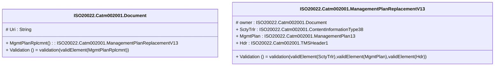

# catm.002.001.13-physical

> The tables below contain descriptions of the members of each Element. 
> The first column indicates the type of the member:
> A ‘#’ indicates that the field is a key to the element, and a ‘+’ indicates that the field is a value.
> The ‘*’ column contains a description for the element member.  
> The ‘@’ column contains any properties for the member.
> The ‘=’ column contains calculated values; or in the case of an enum, the serialized value.

---

## EntityImpl ISO20022.Catm002001.Document

| |Name|Type|*|@|=|
|-|-|-|-|-|-|
|#|Uri|String||XmlIgnore(), JsonIgnore()||
|+|MgmtPlanRplcmnt|ISO20022.Catm002001.ManagementPlanReplacementV13||XmlElement()||
||Validation|Some(String)||XmlIgnore(), JsonIgnore()|validation(validElement(MgmtPlanRplcmnt))|

---

## AspectImpl ISO20022.Catm002001.ManagementPlanReplacementV13

| |Name|Type|*|@|=|
|-|-|-|-|-|-|
|#|owner|ISO20022.Catm002001.Document||||
|+|SctyTrlr|ISO20022.Catm002001.ContentInformationType38||XmlElement()||
|+|MgmtPlan|ISO20022.Catm002001.ManagementPlan13||XmlElement()||
|+|Hdr|ISO20022.Catm002001.TMSHeader1||XmlElement()||
||Validation|Some(String)||XmlIgnore(), JsonIgnore()|validation(validElement(SctyTrlr),validElement(MgmtPlan),validElement(Hdr))|

