# catp.005.001.02

```mermaid
classDiagram
    class Hiperspace.Edge {
        # From  : Hiperspace.Node
        # To  : Hiperspace.Node
        # TypeName  : String
        + Name  : String
    }
    class ISO20022.Catp005001.ATMCommand4Code {
        RPTC = 1
        SNDM = 2
        DISC = 3
        CCNT = 4
        CFGT = 5
        ASTS = 6
        ABAL = 7
    }
    class ISO20022.Catp005001.ATMCommand7 {
        + CmdParams  : ISO20022.Catp005001.ATMCommandParameters1Choice
        + CmdId  : ISO20022.Catp005001.ATMCommandIdentification1
        + DtTm  : DateTime
        + Urgcy  : String
        + Tp  : String
    }
    ISO20022.Catp005001.ATMCommand7 *-- ISO20022.Catp005001.ATMCommandParameters1Choice
    ISO20022.Catp005001.ATMCommand7 *-- ISO20022.Catp005001.ATMCommandIdentification1
    class ISO20022.Catp005001.ATMCommandIdentification1 {
        + Prcr  : String
        + Ref  : String
        + Orgn  : String
    }
    class ISO20022.Catp005001.ATMCommandParameters1Choice {
        + ReqrdCfgtnParam  : ISO20022.Catp005001.ATMConfigurationParameter1
        + XpctdMsgFctn  : String
        + ATMReqrdGblSts  : String
    }
    ISO20022.Catp005001.ATMCommandParameters1Choice *-- ISO20022.Catp005001.ATMConfigurationParameter1
    class ISO20022.Catp005001.ATMConfigurationParameter1 {
        + Vrsn  : String
        + Tp  : String
    }
    class ISO20022.Catp005001.ATMMessageFunction2 {
        + HstSvcCd  : String
        + ATMSvcCd  : String
        + Fctn  : String
    }
    class ISO20022.Catp005001.ATMReject2 {
        + MsgInErr  : String
        + Cmd  : global::System.Collections.Generic.List~ISO20022.Catp005001.ATMCommand7~
        + AddtlInf  : String
        + RjctRsn  : String
        + RjctInitrId  : String
    }
    ISO20022.Catp005001.ATMReject2 *-- ISO20022.Catp005001.ATMCommand7
    class ISO20022.Catp005001.ATMRejectV02 {
        + ATMRjct  : ISO20022.Catp005001.ATMReject2
        + Hdr  : ISO20022.Catp005001.Header33
    }
    ISO20022.Catp005001.ATMRejectV02 *-- ISO20022.Catp005001.ATMReject2
    ISO20022.Catp005001.ATMRejectV02 *-- ISO20022.Catp005001.Header33
    class ISO20022.Catp005001.ATMStatus1Code {
        OUTS = 1
        INSV = 2
    }
    class ISO20022.Catp005001.DataSetCategory7Code {
        MNOC = 1
        LOCC = 2
        AMNT = 3
        OEXR = 4
        CPRC = 5
        CRAP = 6
        APPR = 7
        ATMP = 8
        ATMC = 9
    }
    class ISO20022.Catp005001.GenericIdentification77 {
        + ShrtNm  : String
        + Ctry  : String
        + Issr  : String
        + Tp  : String
        + Id  : String
    }
    class ISO20022.Catp005001.Header33 {
        + Tracblt  : global::System.Collections.Generic.List~ISO20022.Catp005001.Traceability4~
        + PrcStat  : String
        + RcptPty  : String
        + InitgPty  : String
        + CreDtTm  : DateTime
        + XchgId  : String
        + PrtcolVrsn  : String
        + MsgFctn  : ISO20022.Catp005001.ATMMessageFunction2
    }
    ISO20022.Catp005001.Header33 *-- ISO20022.Catp005001.Traceability4
    ISO20022.Catp005001.Header33 *-- ISO20022.Catp005001.ATMMessageFunction2
    class ISO20022.Catp005001.MessageFunction11Code {
        RPTC = 1
        TRFP = 2
        TRFQ = 3
        EXPV = 4
        EXPK = 5
        DPSP = 6
        DPSQ = 7
        DPSV = 8
        DPSK = 9
        SSTS = 10
        SKSC = 11
        DSEC = 12
        CSEC = 13
        TMOP = 14
        H2AQ = 15
        H2AP = 16
        INQC = 17
        WITP = 18
        WITQ = 19
        WITK = 20
        WITV = 21
        RJAP = 22
        RJAQ = 23
        PINP = 24
        PINQ = 25
        KYAP = 26
        KYAQ = 27
        INQP = 28
        INQQ = 29
        GSTS = 30
        DIAP = 31
        DIAQ = 32
        DVCC = 33
        ACMD = 34
        CMPD = 35
        CMPA = 36
        BALN = 37
    }
    class ISO20022.Catp005001.MessageFunction8Code {
        SSTS = 1
        KEYQ = 2
        INQC = 3
        DSEC = 4
        GSTS = 5
        BALN = 6
    }
    class ISO20022.Catp005001.PartyType12Code {
        OATM = 1
        ITAG = 2
        HSTG = 3
        DLIS = 4
        CISP = 5
        ATMG = 6
        ACQR = 7
    }
    class ISO20022.Catp005001.RejectReason1Code {
        MSGT = 1
        VERS = 2
        DPMG = 3
        RCPP = 4
        INTP = 5
        SECU = 6
        PARS = 7
        IMSG = 8
        UNPR = 9
    }
    class ISO20022.Catp005001.TMSContactLevel2Code {
        ENCS = 1
        DTIM = 2
        CRIT = 3
        ASAP = 4
    }
    class ISO20022.Catp005001.Traceability4 {
        + TracDtTmOut  : DateTime
        + TracDtTmIn  : DateTime
        + SeqNb  : String
        + RlayId  : ISO20022.Catp005001.GenericIdentification77
    }
    ISO20022.Catp005001.Traceability4 *-- ISO20022.Catp005001.GenericIdentification77
    class Hiperspace.Node {
        # SKey  : String
        + TypeName  : String
        + Name  : String
        + Froms (From = this) : Hiperspace.Edge
        + Tos (To = this) : Hiperspace.Edge
    }
```

> The tables below contain descriptions of the members of each Element. 
> The first column indicates the type of the member:
> A ‘#’ indicates that the field is a key to the element, and a ‘+’ indicates that the field is a value.
> The ‘*’ column contains a description for the element member.  
> The ‘@’ column contains any properties for the member.
> The ‘=’ column contains calculated values; or in the case of an enum, the serialized value.

---

## View Hiperspace.Edge
edge between nodes

| |Name|Type|*|@|=|
|-|-|-|-|-|-|
|#|From|Hiperspace.Node||||
|#|To|Hiperspace.Node||||
|#|TypeName|String||||
|+|Name|String||||

---

## Enum ISO20022.Catp005001.ATMCommand4Code

| |Name|Type|*|@|=|
|-|-|-|-|-|-|
||RPTC|Int32||XmlEnum("""RPTC""")|1|
||SNDM|Int32||XmlEnum("""SNDM""")|2|
||DISC|Int32||XmlEnum("""DISC""")|3|
||CCNT|Int32||XmlEnum("""CCNT""")|4|
||CFGT|Int32||XmlEnum("""CFGT""")|5|
||ASTS|Int32||XmlEnum("""ASTS""")|6|
||ABAL|Int32||XmlEnum("""ABAL""")|7|

---

## Value ISO20022.Catp005001.ATMCommand7

| |Name|Type|*|@|=|
|-|-|-|-|-|-|
|+|CmdParams|ISO20022.Catp005001.ATMCommandParameters1Choice||XmlElement()||
|+|CmdId|ISO20022.Catp005001.ATMCommandIdentification1||XmlElement()||
|+|DtTm|DateTime||XmlElement()||
|+|Urgcy|String||XmlElement()||
|+|Tp|String||XmlElement()||
||Validation|Some(String)||XmlIgnore(), JsonIgnore()|validation(validElement(CmdParams),validElement(CmdId))|

---

## Value ISO20022.Catp005001.ATMCommandIdentification1

| |Name|Type|*|@|=|
|-|-|-|-|-|-|
|+|Prcr|String||XmlElement()||
|+|Ref|String||XmlElement()||
|+|Orgn|String||XmlElement()||
||Validation|Some(String)||XmlIgnore(), JsonIgnore()|""|

---

## Value ISO20022.Catp005001.ATMCommandParameters1Choice

| |Name|Type|*|@|=|
|-|-|-|-|-|-|
|+|ReqrdCfgtnParam|ISO20022.Catp005001.ATMConfigurationParameter1||XmlElement()||
|+|XpctdMsgFctn|String||XmlElement()||
|+|ATMReqrdGblSts|String||XmlElement()||
||Validation|Some(String)||XmlIgnore(), JsonIgnore()|validation(validElement(ReqrdCfgtnParam),validChoice(ReqrdCfgtnParam,XpctdMsgFctn,ATMReqrdGblSts))|

---

## Value ISO20022.Catp005001.ATMConfigurationParameter1

| |Name|Type|*|@|=|
|-|-|-|-|-|-|
|+|Vrsn|String||XmlElement()||
|+|Tp|String||XmlElement()||
||Validation|Some(String)||XmlIgnore(), JsonIgnore()|""|

---

## Value ISO20022.Catp005001.ATMMessageFunction2

| |Name|Type|*|@|=|
|-|-|-|-|-|-|
|+|HstSvcCd|String||XmlElement()||
|+|ATMSvcCd|String||XmlElement()||
|+|Fctn|String||XmlElement()||
||Validation|Some(String)||XmlIgnore(), JsonIgnore()|""|

---

## Value ISO20022.Catp005001.ATMReject2

| |Name|Type|*|@|=|
|-|-|-|-|-|-|
|+|MsgInErr|String||XmlElement()||
|+|Cmd|global::System.Collections.Generic.List<ISO20022.Catp005001.ATMCommand7>||XmlElement()||
|+|AddtlInf|String||XmlElement()||
|+|RjctRsn|String||XmlElement()||
|+|RjctInitrId|String||XmlElement()||
||Validation|Some(String)||XmlIgnore(), JsonIgnore()|validation(validList("""Cmd""",Cmd),validElement(Cmd))|

---

## Aspect ISO20022.Catp005001.ATMRejectV02

| |Name|Type|*|@|=|
|-|-|-|-|-|-|
|+|ATMRjct|ISO20022.Catp005001.ATMReject2||XmlElement()||
|+|Hdr|ISO20022.Catp005001.Header33||XmlElement()||
||Validation|Some(String)||XmlIgnore(), JsonIgnore()|validation(validElement(ATMRjct),validElement(Hdr))|

---

## Enum ISO20022.Catp005001.ATMStatus1Code

| |Name|Type|*|@|=|
|-|-|-|-|-|-|
||OUTS|Int32||XmlEnum("""OUTS""")|1|
||INSV|Int32||XmlEnum("""INSV""")|2|

---

## Enum ISO20022.Catp005001.DataSetCategory7Code

| |Name|Type|*|@|=|
|-|-|-|-|-|-|
||MNOC|Int32||XmlEnum("""MNOC""")|1|
||LOCC|Int32||XmlEnum("""LOCC""")|2|
||AMNT|Int32||XmlEnum("""AMNT""")|3|
||OEXR|Int32||XmlEnum("""OEXR""")|4|
||CPRC|Int32||XmlEnum("""CPRC""")|5|
||CRAP|Int32||XmlEnum("""CRAP""")|6|
||APPR|Int32||XmlEnum("""APPR""")|7|
||ATMP|Int32||XmlEnum("""ATMP""")|8|
||ATMC|Int32||XmlEnum("""ATMC""")|9|

---

## Type ISO20022.Catp005001.Document

| |Name|Type|*|@|=|
|-|-|-|-|-|-|
|+|ATMRjct|ISO20022.Catp005001.ATMRejectV02||XmlElement()||
||Validation|Some(String)||XmlIgnore(), JsonIgnore()|validation(validElement(ATMRjct))|

---

## Value ISO20022.Catp005001.GenericIdentification77

| |Name|Type|*|@|=|
|-|-|-|-|-|-|
|+|ShrtNm|String||XmlElement()||
|+|Ctry|String||XmlElement()||
|+|Issr|String||XmlElement()||
|+|Tp|String||XmlElement()||
|+|Id|String||XmlElement()||
||Validation|Some(String)||XmlIgnore(), JsonIgnore()|validation(validPattern("""Ctry""",Ctry,"""[a-zA-Z]{2,3}"""))|

---

## Value ISO20022.Catp005001.Header33

| |Name|Type|*|@|=|
|-|-|-|-|-|-|
|+|Tracblt|global::System.Collections.Generic.List<ISO20022.Catp005001.Traceability4>||XmlElement()||
|+|PrcStat|String||XmlElement()||
|+|RcptPty|String||XmlElement()||
|+|InitgPty|String||XmlElement()||
|+|CreDtTm|DateTime||XmlElement()||
|+|XchgId|String||XmlElement()||
|+|PrtcolVrsn|String||XmlElement()||
|+|MsgFctn|ISO20022.Catp005001.ATMMessageFunction2||XmlElement()||
||Validation|Some(String)||XmlIgnore(), JsonIgnore()|validation(validList("""Tracblt""",Tracblt),validElement(Tracblt),validPattern("""XchgId""",XchgId,"""[0-9]{1,3}"""),validElement(MsgFctn))|

---

## Enum ISO20022.Catp005001.MessageFunction11Code

| |Name|Type|*|@|=|
|-|-|-|-|-|-|
||RPTC|Int32||XmlEnum("""RPTC""")|1|
||TRFP|Int32||XmlEnum("""TRFP""")|2|
||TRFQ|Int32||XmlEnum("""TRFQ""")|3|
||EXPV|Int32||XmlEnum("""EXPV""")|4|
||EXPK|Int32||XmlEnum("""EXPK""")|5|
||DPSP|Int32||XmlEnum("""DPSP""")|6|
||DPSQ|Int32||XmlEnum("""DPSQ""")|7|
||DPSV|Int32||XmlEnum("""DPSV""")|8|
||DPSK|Int32||XmlEnum("""DPSK""")|9|
||SSTS|Int32||XmlEnum("""SSTS""")|10|
||SKSC|Int32||XmlEnum("""SKSC""")|11|
||DSEC|Int32||XmlEnum("""DSEC""")|12|
||CSEC|Int32||XmlEnum("""CSEC""")|13|
||TMOP|Int32||XmlEnum("""TMOP""")|14|
||H2AQ|Int32||XmlEnum("""H2AQ""")|15|
||H2AP|Int32||XmlEnum("""H2AP""")|16|
||INQC|Int32||XmlEnum("""INQC""")|17|
||WITP|Int32||XmlEnum("""WITP""")|18|
||WITQ|Int32||XmlEnum("""WITQ""")|19|
||WITK|Int32||XmlEnum("""WITK""")|20|
||WITV|Int32||XmlEnum("""WITV""")|21|
||RJAP|Int32||XmlEnum("""RJAP""")|22|
||RJAQ|Int32||XmlEnum("""RJAQ""")|23|
||PINP|Int32||XmlEnum("""PINP""")|24|
||PINQ|Int32||XmlEnum("""PINQ""")|25|
||KYAP|Int32||XmlEnum("""KYAP""")|26|
||KYAQ|Int32||XmlEnum("""KYAQ""")|27|
||INQP|Int32||XmlEnum("""INQP""")|28|
||INQQ|Int32||XmlEnum("""INQQ""")|29|
||GSTS|Int32||XmlEnum("""GSTS""")|30|
||DIAP|Int32||XmlEnum("""DIAP""")|31|
||DIAQ|Int32||XmlEnum("""DIAQ""")|32|
||DVCC|Int32||XmlEnum("""DVCC""")|33|
||ACMD|Int32||XmlEnum("""ACMD""")|34|
||CMPD|Int32||XmlEnum("""CMPD""")|35|
||CMPA|Int32||XmlEnum("""CMPA""")|36|
||BALN|Int32||XmlEnum("""BALN""")|37|

---

## Enum ISO20022.Catp005001.MessageFunction8Code

| |Name|Type|*|@|=|
|-|-|-|-|-|-|
||SSTS|Int32||XmlEnum("""SSTS""")|1|
||KEYQ|Int32||XmlEnum("""KEYQ""")|2|
||INQC|Int32||XmlEnum("""INQC""")|3|
||DSEC|Int32||XmlEnum("""DSEC""")|4|
||GSTS|Int32||XmlEnum("""GSTS""")|5|
||BALN|Int32||XmlEnum("""BALN""")|6|

---

## Enum ISO20022.Catp005001.PartyType12Code

| |Name|Type|*|@|=|
|-|-|-|-|-|-|
||OATM|Int32||XmlEnum("""OATM""")|1|
||ITAG|Int32||XmlEnum("""ITAG""")|2|
||HSTG|Int32||XmlEnum("""HSTG""")|3|
||DLIS|Int32||XmlEnum("""DLIS""")|4|
||CISP|Int32||XmlEnum("""CISP""")|5|
||ATMG|Int32||XmlEnum("""ATMG""")|6|
||ACQR|Int32||XmlEnum("""ACQR""")|7|

---

## Enum ISO20022.Catp005001.RejectReason1Code

| |Name|Type|*|@|=|
|-|-|-|-|-|-|
||MSGT|Int32||XmlEnum("""MSGT""")|1|
||VERS|Int32||XmlEnum("""VERS""")|2|
||DPMG|Int32||XmlEnum("""DPMG""")|3|
||RCPP|Int32||XmlEnum("""RCPP""")|4|
||INTP|Int32||XmlEnum("""INTP""")|5|
||SECU|Int32||XmlEnum("""SECU""")|6|
||PARS|Int32||XmlEnum("""PARS""")|7|
||IMSG|Int32||XmlEnum("""IMSG""")|8|
||UNPR|Int32||XmlEnum("""UNPR""")|9|

---

## Enum ISO20022.Catp005001.TMSContactLevel2Code

| |Name|Type|*|@|=|
|-|-|-|-|-|-|
||ENCS|Int32||XmlEnum("""ENCS""")|1|
||DTIM|Int32||XmlEnum("""DTIM""")|2|
||CRIT|Int32||XmlEnum("""CRIT""")|3|
||ASAP|Int32||XmlEnum("""ASAP""")|4|

---

## Value ISO20022.Catp005001.Traceability4

| |Name|Type|*|@|=|
|-|-|-|-|-|-|
|+|TracDtTmOut|DateTime||XmlElement()||
|+|TracDtTmIn|DateTime||XmlElement()||
|+|SeqNb|String||XmlElement()||
|+|RlayId|ISO20022.Catp005001.GenericIdentification77||XmlElement()||
||Validation|Some(String)||XmlIgnore(), JsonIgnore()|validation(validElement(RlayId))|

---

## View Hiperspace.Node
node in a graph view of data

| |Name|Type|*|@|=|
|-|-|-|-|-|-|
|#|SKey|String||||
|+|TypeName|String||||
|+|Name|String||||
||Froms|Hiperspace.Edge|||From = this|
||Tos|Hiperspace.Edge|||To = this|

