# colr.001.001.02

```mermaid
classDiagram
    class Hiperspace.Edge {
        # From  : Hiperspace.Node
        # To  : Hiperspace.Node
        # TypeName  : String
        + Name  : String
    }
    class ISO20022.Colr001001.AccountIdentification4Choice {
        + Othr  : ISO20022.Colr001001.GenericAccountIdentification1
        + IBAN  : String
    }
    ISO20022.Colr001001.AccountIdentification4Choice *-- ISO20022.Colr001001.GenericAccountIdentification1
    class ISO20022.Colr001001.AccountSchemeName1Choice {
        + Prtry  : String
        + Cd  : String
    }
    class ISO20022.Colr001001.AddressType2Code {
        DLVY = 1
        MLTO = 2
        BIZZ = 3
        HOME = 4
        PBOX = 5
        ADDR = 6
    }
    class ISO20022.Colr001001.AddressType3Choice {
        + Prtry  : ISO20022.Colr001001.GenericIdentification30
        + Cd  : String
    }
    ISO20022.Colr001001.AddressType3Choice *-- ISO20022.Colr001001.GenericIdentification30
    class ISO20022.Colr001001.BranchAndFinancialInstitutionIdentification8 {
        + BrnchId  : ISO20022.Colr001001.BranchData5
        + FinInstnId  : ISO20022.Colr001001.FinancialInstitutionIdentification23
    }
    ISO20022.Colr001001.BranchAndFinancialInstitutionIdentification8 *-- ISO20022.Colr001001.BranchData5
    ISO20022.Colr001001.BranchAndFinancialInstitutionIdentification8 *-- ISO20022.Colr001001.FinancialInstitutionIdentification23
    class ISO20022.Colr001001.BranchData5 {
        + PstlAdr  : ISO20022.Colr001001.PostalAddress27
        + Nm  : String
        + LEI  : String
        + Id  : String
    }
    ISO20022.Colr001001.BranchData5 *-- ISO20022.Colr001001.PostalAddress27
    class ISO20022.Colr001001.ClearingSystemIdentification2Choice {
        + Prtry  : String
        + Cd  : String
    }
    class ISO20022.Colr001001.ClearingSystemMemberIdentification2 {
        + MmbId  : String
        + ClrSysId  : ISO20022.Colr001001.ClearingSystemIdentification2Choice
    }
    ISO20022.Colr001001.ClearingSystemMemberIdentification2 *-- ISO20022.Colr001001.ClearingSystemIdentification2Choice
    class ISO20022.Colr001001.CollateralValueCriteria4 {
        + RtrCrit  : ISO20022.Colr001001.CollateralValueReturnCriteria1
        + SchCrit  : ISO20022.Colr001001.CollateralValueSearchCriteria4
        + QryNm  : String
    }
    ISO20022.Colr001001.CollateralValueCriteria4 *-- ISO20022.Colr001001.CollateralValueReturnCriteria1
    ISO20022.Colr001001.CollateralValueCriteria4 *-- ISO20022.Colr001001.CollateralValueSearchCriteria4
    class ISO20022.Colr001001.CollateralValueCriteriaDefinition4Choice {
        + NewCrit  : ISO20022.Colr001001.CollateralValueCriteria4
        + QryNm  : String
    }
    ISO20022.Colr001001.CollateralValueCriteriaDefinition4Choice *-- ISO20022.Colr001001.CollateralValueCriteria4
    class ISO20022.Colr001001.CollateralValueQueryV02 {
        + SplmtryData  : global::System.Collections.Generic.List~ISO20022.Colr001001.SupplementaryData1~
        + CollValQryDef  : ISO20022.Colr001001.CollateralValueCriteriaDefinition4Choice
        + MsgHdr  : ISO20022.Colr001001.MessageHeader3
    }
    ISO20022.Colr001001.CollateralValueQueryV02 *-- ISO20022.Colr001001.SupplementaryData1
    ISO20022.Colr001001.CollateralValueQueryV02 *-- ISO20022.Colr001001.CollateralValueCriteriaDefinition4Choice
    ISO20022.Colr001001.CollateralValueQueryV02 *-- ISO20022.Colr001001.MessageHeader3
    class ISO20022.Colr001001.CollateralValueReturnCriteria1 {
        + Scties  : String
        + SctiesAcctInd  : String
        + TtlCollValtnInd  : String
        + SctiesAcctSvcrInd  : String
        + SctiesAcctOwnrInd  : String
        + CshAcctSvcrInd  : String
        + CshAcctOwnrInd  : String
    }
    class ISO20022.Colr001001.CollateralValueSearchCriteria4 {
        + SctiesAcctSvcr  : ISO20022.Colr001001.PartyIdentification136
        + SctiesAcctOwnr  : ISO20022.Colr001001.SystemPartyIdentification8
        + FinInstrmId  : global::System.Collections.Generic.List~ISO20022.Colr001001.SecurityIdentification19~
        + CshAcctSvcr  : ISO20022.Colr001001.BranchAndFinancialInstitutionIdentification8
        + CshAcctOwnr  : ISO20022.Colr001001.SystemPartyIdentification8
        + Ccy  : global::System.Collections.Generic.List~String~
        + CshAcctId  : ISO20022.Colr001001.AccountIdentification4Choice
    }
    ISO20022.Colr001001.CollateralValueSearchCriteria4 *-- ISO20022.Colr001001.PartyIdentification136
    ISO20022.Colr001001.CollateralValueSearchCriteria4 *-- ISO20022.Colr001001.SystemPartyIdentification8
    ISO20022.Colr001001.CollateralValueSearchCriteria4 *-- ISO20022.Colr001001.SecurityIdentification19
    ISO20022.Colr001001.CollateralValueSearchCriteria4 *-- ISO20022.Colr001001.BranchAndFinancialInstitutionIdentification8
    ISO20022.Colr001001.CollateralValueSearchCriteria4 *-- ISO20022.Colr001001.SystemPartyIdentification8
    ISO20022.Colr001001.CollateralValueSearchCriteria4 *-- ISO20022.Colr001001.AccountIdentification4Choice
    class ISO20022.Colr001001.FinancialIdentificationSchemeName1Choice {
        + Prtry  : String
        + Cd  : String
    }
    class ISO20022.Colr001001.FinancialInstitutionIdentification23 {
        + Othr  : ISO20022.Colr001001.GenericFinancialIdentification1
        + PstlAdr  : ISO20022.Colr001001.PostalAddress27
        + Nm  : String
        + LEI  : String
        + ClrSysMmbId  : ISO20022.Colr001001.ClearingSystemMemberIdentification2
        + BICFI  : String
    }
    ISO20022.Colr001001.FinancialInstitutionIdentification23 *-- ISO20022.Colr001001.GenericFinancialIdentification1
    ISO20022.Colr001001.FinancialInstitutionIdentification23 *-- ISO20022.Colr001001.PostalAddress27
    ISO20022.Colr001001.FinancialInstitutionIdentification23 *-- ISO20022.Colr001001.ClearingSystemMemberIdentification2
    class ISO20022.Colr001001.GenericAccountIdentification1 {
        + Issr  : String
        + SchmeNm  : ISO20022.Colr001001.AccountSchemeName1Choice
        + Id  : String
    }
    ISO20022.Colr001001.GenericAccountIdentification1 *-- ISO20022.Colr001001.AccountSchemeName1Choice
    class ISO20022.Colr001001.GenericFinancialIdentification1 {
        + Issr  : String
        + SchmeNm  : ISO20022.Colr001001.FinancialIdentificationSchemeName1Choice
        + Id  : String
    }
    ISO20022.Colr001001.GenericFinancialIdentification1 *-- ISO20022.Colr001001.FinancialIdentificationSchemeName1Choice
    class ISO20022.Colr001001.GenericIdentification1 {
        + Issr  : String
        + SchmeNm  : String
        + Id  : String
    }
    class ISO20022.Colr001001.GenericIdentification30 {
        + SchmeNm  : String
        + Issr  : String
        + Id  : String
    }
    class ISO20022.Colr001001.GenericIdentification36 {
        + SchmeNm  : String
        + Issr  : String
        + Id  : String
    }
    class ISO20022.Colr001001.IdentificationSource3Choice {
        + Prtry  : String
        + Cd  : String
    }
    class ISO20022.Colr001001.MessageHeader3 {
        + QryNm  : String
        + OrgnlBizQry  : ISO20022.Colr001001.OriginalBusinessQuery1
        + ReqTp  : ISO20022.Colr001001.RequestType2Choice
        + CreDtTm  : DateTime
        + MsgId  : String
    }
    ISO20022.Colr001001.MessageHeader3 *-- ISO20022.Colr001001.OriginalBusinessQuery1
    ISO20022.Colr001001.MessageHeader3 *-- ISO20022.Colr001001.RequestType2Choice
    class ISO20022.Colr001001.NameAndAddress5 {
        + Adr  : ISO20022.Colr001001.PostalAddress1
        + Nm  : String
    }
    ISO20022.Colr001001.NameAndAddress5 *-- ISO20022.Colr001001.PostalAddress1
    class ISO20022.Colr001001.OriginalBusinessQuery1 {
        + CreDtTm  : DateTime
        + MsgNmId  : String
        + MsgId  : String
    }
    class ISO20022.Colr001001.OtherIdentification1 {
        + Tp  : ISO20022.Colr001001.IdentificationSource3Choice
        + Sfx  : String
        + Id  : String
    }
    ISO20022.Colr001001.OtherIdentification1 *-- ISO20022.Colr001001.IdentificationSource3Choice
    class ISO20022.Colr001001.PartyIdentification120Choice {
        + NmAndAdr  : ISO20022.Colr001001.NameAndAddress5
        + PrtryId  : ISO20022.Colr001001.GenericIdentification36
        + AnyBIC  : String
    }
    ISO20022.Colr001001.PartyIdentification120Choice *-- ISO20022.Colr001001.NameAndAddress5
    ISO20022.Colr001001.PartyIdentification120Choice *-- ISO20022.Colr001001.GenericIdentification36
    class ISO20022.Colr001001.PartyIdentification136 {
        + LEI  : String
        + Id  : ISO20022.Colr001001.PartyIdentification120Choice
    }
    ISO20022.Colr001001.PartyIdentification136 *-- ISO20022.Colr001001.PartyIdentification120Choice
    class ISO20022.Colr001001.PostalAddress1 {
        + Ctry  : String
        + CtrySubDvsn  : String
        + TwnNm  : String
        + PstCd  : String
        + BldgNb  : String
        + StrtNm  : String
        + AdrLine  : global::System.Collections.Generic.List~String~
        + AdrTp  : String
    }
    class ISO20022.Colr001001.PostalAddress27 {
        + AdrLine  : global::System.Collections.Generic.List~String~
        + Ctry  : String
        + CtrySubDvsn  : String
        + DstrctNm  : String
        + TwnLctnNm  : String
        + TwnNm  : String
        + PstCd  : String
        + Room  : String
        + PstBx  : String
        + UnitNb  : String
        + Flr  : String
        + BldgNm  : String
        + BldgNb  : String
        + StrtNm  : String
        + SubDept  : String
        + Dept  : String
        + CareOf  : String
        + AdrTp  : ISO20022.Colr001001.AddressType3Choice
    }
    ISO20022.Colr001001.PostalAddress27 *-- ISO20022.Colr001001.AddressType3Choice
    class ISO20022.Colr001001.RequestType1Code {
        RT05 = 1
        RT04 = 2
        RT03 = 3
        RT02 = 4
        RT01 = 5
    }
    class ISO20022.Colr001001.RequestType2Choice {
        + Prtry  : ISO20022.Colr001001.GenericIdentification1
        + Enqry  : String
        + PmtCtrl  : String
    }
    ISO20022.Colr001001.RequestType2Choice *-- ISO20022.Colr001001.GenericIdentification1
    class ISO20022.Colr001001.RequestType2Code {
        RT15 = 1
        RT14 = 2
        RT13 = 3
        RT12 = 4
        RT11 = 5
    }
    class ISO20022.Colr001001.SecurityIdentification19 {
        + Desc  : String
        + OthrId  : global::System.Collections.Generic.List~ISO20022.Colr001001.OtherIdentification1~
        + ISIN  : String
    }
    ISO20022.Colr001001.SecurityIdentification19 *-- ISO20022.Colr001001.OtherIdentification1
    class ISO20022.Colr001001.SupplementaryData1 {
        + Envlp  : ISO20022.Colr001001.SupplementaryDataEnvelope1
        + PlcAndNm  : String
    }
    ISO20022.Colr001001.SupplementaryData1 *-- ISO20022.Colr001001.SupplementaryDataEnvelope1
    class ISO20022.Colr001001.SupplementaryDataEnvelope1 {
    }
    class ISO20022.Colr001001.SystemPartyIdentification8 {
        + RspnsblPtyId  : ISO20022.Colr001001.PartyIdentification136
        + Id  : ISO20022.Colr001001.PartyIdentification136
    }
    ISO20022.Colr001001.SystemPartyIdentification8 *-- ISO20022.Colr001001.PartyIdentification136
    ISO20022.Colr001001.SystemPartyIdentification8 *-- ISO20022.Colr001001.PartyIdentification136
    class Hiperspace.Node {
        # SKey  : String
        + TypeName  : String
        + Name  : String
        + Froms (From = this) : Hiperspace.Edge
        + Tos (To = this) : Hiperspace.Edge
    }
```

> The tables below contain descriptions of the members of each Element. 
> The first column indicates the type of the member:
> A ‘#’ indicates that the field is a key to the element, and a ‘+’ indicates that the field is a value.
> The ‘*’ column contains a description for the element member.  
> The ‘@’ column contains any properties for the member.
> The ‘=’ column contains calculated values; or in the case of an enum, the serialized value.

---

## View Hiperspace.Edge
edge between nodes

| |Name|Type|*|@|=|
|-|-|-|-|-|-|
|#|From|Hiperspace.Node||||
|#|To|Hiperspace.Node||||
|#|TypeName|String||||
|+|Name|String||||

---

## Value ISO20022.Colr001001.AccountIdentification4Choice

| |Name|Type|*|@|=|
|-|-|-|-|-|-|
|+|Othr|ISO20022.Colr001001.GenericAccountIdentification1||XmlElement()||
|+|IBAN|String||XmlElement()||
||Validation|Some(String)||XmlIgnore(), JsonIgnore()|validation(validElement(Othr),validPattern("""IBAN""",IBAN,"""[A-Z]{2,2}[0-9]{2,2}[a-zA-Z0-9]{1,30}"""),validChoice(Othr,IBAN))|

---

## Value ISO20022.Colr001001.AccountSchemeName1Choice

| |Name|Type|*|@|=|
|-|-|-|-|-|-|
|+|Prtry|String||XmlElement()||
|+|Cd|String||XmlElement()||
||Validation|Some(String)||XmlIgnore(), JsonIgnore()|validation(validChoice(Prtry,Cd))|

---

## Enum ISO20022.Colr001001.AddressType2Code

| |Name|Type|*|@|=|
|-|-|-|-|-|-|
||DLVY|Int32||XmlEnum("""DLVY""")|1|
||MLTO|Int32||XmlEnum("""MLTO""")|2|
||BIZZ|Int32||XmlEnum("""BIZZ""")|3|
||HOME|Int32||XmlEnum("""HOME""")|4|
||PBOX|Int32||XmlEnum("""PBOX""")|5|
||ADDR|Int32||XmlEnum("""ADDR""")|6|

---

## Value ISO20022.Colr001001.AddressType3Choice

| |Name|Type|*|@|=|
|-|-|-|-|-|-|
|+|Prtry|ISO20022.Colr001001.GenericIdentification30||XmlElement()||
|+|Cd|String||XmlElement()||
||Validation|Some(String)||XmlIgnore(), JsonIgnore()|validation(validElement(Prtry),validChoice(Prtry,Cd))|

---

## Value ISO20022.Colr001001.BranchAndFinancialInstitutionIdentification8

| |Name|Type|*|@|=|
|-|-|-|-|-|-|
|+|BrnchId|ISO20022.Colr001001.BranchData5||XmlElement()||
|+|FinInstnId|ISO20022.Colr001001.FinancialInstitutionIdentification23||XmlElement()||
||Validation|Some(String)||XmlIgnore(), JsonIgnore()|validation(validElement(BrnchId),validElement(FinInstnId))|

---

## Value ISO20022.Colr001001.BranchData5

| |Name|Type|*|@|=|
|-|-|-|-|-|-|
|+|PstlAdr|ISO20022.Colr001001.PostalAddress27||XmlElement()||
|+|Nm|String||XmlElement()||
|+|LEI|String||XmlElement()||
|+|Id|String||XmlElement()||
||Validation|Some(String)||XmlIgnore(), JsonIgnore()|validation(validElement(PstlAdr),validPattern("""LEI""",LEI,"""[A-Z0-9]{18,18}[0-9]{2,2}"""))|

---

## Value ISO20022.Colr001001.ClearingSystemIdentification2Choice

| |Name|Type|*|@|=|
|-|-|-|-|-|-|
|+|Prtry|String||XmlElement()||
|+|Cd|String||XmlElement()||
||Validation|Some(String)||XmlIgnore(), JsonIgnore()|validation(validChoice(Prtry,Cd))|

---

## Value ISO20022.Colr001001.ClearingSystemMemberIdentification2

| |Name|Type|*|@|=|
|-|-|-|-|-|-|
|+|MmbId|String||XmlElement()||
|+|ClrSysId|ISO20022.Colr001001.ClearingSystemIdentification2Choice||XmlElement()||
||Validation|Some(String)||XmlIgnore(), JsonIgnore()|validation(validElement(ClrSysId))|

---

## Value ISO20022.Colr001001.CollateralValueCriteria4

| |Name|Type|*|@|=|
|-|-|-|-|-|-|
|+|RtrCrit|ISO20022.Colr001001.CollateralValueReturnCriteria1||XmlElement()||
|+|SchCrit|ISO20022.Colr001001.CollateralValueSearchCriteria4||XmlElement()||
|+|QryNm|String||XmlElement()||
||Validation|Some(String)||XmlIgnore(), JsonIgnore()|validation(validElement(RtrCrit),validElement(SchCrit))|

---

## Value ISO20022.Colr001001.CollateralValueCriteriaDefinition4Choice

| |Name|Type|*|@|=|
|-|-|-|-|-|-|
|+|NewCrit|ISO20022.Colr001001.CollateralValueCriteria4||XmlElement()||
|+|QryNm|String||XmlElement()||
||Validation|Some(String)||XmlIgnore(), JsonIgnore()|validation(validElement(NewCrit),validChoice(NewCrit,QryNm))|

---

## Aspect ISO20022.Colr001001.CollateralValueQueryV02

| |Name|Type|*|@|=|
|-|-|-|-|-|-|
|+|SplmtryData|global::System.Collections.Generic.List<ISO20022.Colr001001.SupplementaryData1>||XmlElement()||
|+|CollValQryDef|ISO20022.Colr001001.CollateralValueCriteriaDefinition4Choice||XmlElement()||
|+|MsgHdr|ISO20022.Colr001001.MessageHeader3||XmlElement()||
||Validation|Some(String)||XmlIgnore(), JsonIgnore()|validation(validList("""SplmtryData""",SplmtryData),validElement(SplmtryData),validElement(CollValQryDef),validElement(MsgHdr))|

---

## Value ISO20022.Colr001001.CollateralValueReturnCriteria1

| |Name|Type|*|@|=|
|-|-|-|-|-|-|
|+|Scties|String||XmlElement()||
|+|SctiesAcctInd|String||XmlElement()||
|+|TtlCollValtnInd|String||XmlElement()||
|+|SctiesAcctSvcrInd|String||XmlElement()||
|+|SctiesAcctOwnrInd|String||XmlElement()||
|+|CshAcctSvcrInd|String||XmlElement()||
|+|CshAcctOwnrInd|String||XmlElement()||
||Validation|Some(String)||XmlIgnore(), JsonIgnore()|""|

---

## Value ISO20022.Colr001001.CollateralValueSearchCriteria4

| |Name|Type|*|@|=|
|-|-|-|-|-|-|
|+|SctiesAcctSvcr|ISO20022.Colr001001.PartyIdentification136||XmlElement()||
|+|SctiesAcctOwnr|ISO20022.Colr001001.SystemPartyIdentification8||XmlElement()||
|+|FinInstrmId|global::System.Collections.Generic.List<ISO20022.Colr001001.SecurityIdentification19>||XmlElement()||
|+|CshAcctSvcr|ISO20022.Colr001001.BranchAndFinancialInstitutionIdentification8||XmlElement()||
|+|CshAcctOwnr|ISO20022.Colr001001.SystemPartyIdentification8||XmlElement()||
|+|Ccy|global::System.Collections.Generic.List<String>||XmlElement()||
|+|CshAcctId|ISO20022.Colr001001.AccountIdentification4Choice||XmlElement()||
||Validation|Some(String)||XmlIgnore(), JsonIgnore()|validation(validElement(SctiesAcctSvcr),validElement(SctiesAcctOwnr),validList("""FinInstrmId""",FinInstrmId),validElement(FinInstrmId),validElement(CshAcctSvcr),validElement(CshAcctOwnr),validPattern("""Ccy""",Ccy,"""[A-Z]{3,3}"""),validElement(CshAcctId))|

---

## Type ISO20022.Colr001001.Document

| |Name|Type|*|@|=|
|-|-|-|-|-|-|
|+|CollValQry|ISO20022.Colr001001.CollateralValueQueryV02||XmlElement()||
||Validation|Some(String)||XmlIgnore(), JsonIgnore()|validation(validElement(CollValQry))|

---

## Value ISO20022.Colr001001.FinancialIdentificationSchemeName1Choice

| |Name|Type|*|@|=|
|-|-|-|-|-|-|
|+|Prtry|String||XmlElement()||
|+|Cd|String||XmlElement()||
||Validation|Some(String)||XmlIgnore(), JsonIgnore()|validation(validChoice(Prtry,Cd))|

---

## Value ISO20022.Colr001001.FinancialInstitutionIdentification23

| |Name|Type|*|@|=|
|-|-|-|-|-|-|
|+|Othr|ISO20022.Colr001001.GenericFinancialIdentification1||XmlElement()||
|+|PstlAdr|ISO20022.Colr001001.PostalAddress27||XmlElement()||
|+|Nm|String||XmlElement()||
|+|LEI|String||XmlElement()||
|+|ClrSysMmbId|ISO20022.Colr001001.ClearingSystemMemberIdentification2||XmlElement()||
|+|BICFI|String||XmlElement()||
||Validation|Some(String)||XmlIgnore(), JsonIgnore()|validation(validElement(Othr),validElement(PstlAdr),validPattern("""LEI""",LEI,"""[A-Z0-9]{18,18}[0-9]{2,2}"""),validElement(ClrSysMmbId),validPattern("""BICFI""",BICFI,"""[A-Z0-9]{4,4}[A-Z]{2,2}[A-Z0-9]{2,2}([A-Z0-9]{3,3}){0,1}"""))|

---

## Value ISO20022.Colr001001.GenericAccountIdentification1

| |Name|Type|*|@|=|
|-|-|-|-|-|-|
|+|Issr|String||XmlElement()||
|+|SchmeNm|ISO20022.Colr001001.AccountSchemeName1Choice||XmlElement()||
|+|Id|String||XmlElement()||
||Validation|Some(String)||XmlIgnore(), JsonIgnore()|validation(validElement(SchmeNm))|

---

## Value ISO20022.Colr001001.GenericFinancialIdentification1

| |Name|Type|*|@|=|
|-|-|-|-|-|-|
|+|Issr|String||XmlElement()||
|+|SchmeNm|ISO20022.Colr001001.FinancialIdentificationSchemeName1Choice||XmlElement()||
|+|Id|String||XmlElement()||
||Validation|Some(String)||XmlIgnore(), JsonIgnore()|validation(validElement(SchmeNm))|

---

## Value ISO20022.Colr001001.GenericIdentification1

| |Name|Type|*|@|=|
|-|-|-|-|-|-|
|+|Issr|String||XmlElement()||
|+|SchmeNm|String||XmlElement()||
|+|Id|String||XmlElement()||
||Validation|Some(String)||XmlIgnore(), JsonIgnore()|""|

---

## Value ISO20022.Colr001001.GenericIdentification30

| |Name|Type|*|@|=|
|-|-|-|-|-|-|
|+|SchmeNm|String||XmlElement()||
|+|Issr|String||XmlElement()||
|+|Id|String||XmlElement()||
||Validation|Some(String)||XmlIgnore(), JsonIgnore()|validation(validPattern("""Id""",Id,"""[a-zA-Z0-9]{4}"""))|

---

## Value ISO20022.Colr001001.GenericIdentification36

| |Name|Type|*|@|=|
|-|-|-|-|-|-|
|+|SchmeNm|String||XmlElement()||
|+|Issr|String||XmlElement()||
|+|Id|String||XmlElement()||
||Validation|Some(String)||XmlIgnore(), JsonIgnore()|""|

---

## Value ISO20022.Colr001001.IdentificationSource3Choice

| |Name|Type|*|@|=|
|-|-|-|-|-|-|
|+|Prtry|String||XmlElement()||
|+|Cd|String||XmlElement()||
||Validation|Some(String)||XmlIgnore(), JsonIgnore()|validation(validChoice(Prtry,Cd))|

---

## Value ISO20022.Colr001001.MessageHeader3

| |Name|Type|*|@|=|
|-|-|-|-|-|-|
|+|QryNm|String||XmlElement()||
|+|OrgnlBizQry|ISO20022.Colr001001.OriginalBusinessQuery1||XmlElement()||
|+|ReqTp|ISO20022.Colr001001.RequestType2Choice||XmlElement()||
|+|CreDtTm|DateTime||XmlElement()||
|+|MsgId|String||XmlElement()||
||Validation|Some(String)||XmlIgnore(), JsonIgnore()|validation(validElement(OrgnlBizQry),validElement(ReqTp))|

---

## Value ISO20022.Colr001001.NameAndAddress5

| |Name|Type|*|@|=|
|-|-|-|-|-|-|
|+|Adr|ISO20022.Colr001001.PostalAddress1||XmlElement()||
|+|Nm|String||XmlElement()||
||Validation|Some(String)||XmlIgnore(), JsonIgnore()|validation(validElement(Adr))|

---

## Value ISO20022.Colr001001.OriginalBusinessQuery1

| |Name|Type|*|@|=|
|-|-|-|-|-|-|
|+|CreDtTm|DateTime||XmlElement()||
|+|MsgNmId|String||XmlElement()||
|+|MsgId|String||XmlElement()||
||Validation|Some(String)||XmlIgnore(), JsonIgnore()|""|

---

## Value ISO20022.Colr001001.OtherIdentification1

| |Name|Type|*|@|=|
|-|-|-|-|-|-|
|+|Tp|ISO20022.Colr001001.IdentificationSource3Choice||XmlElement()||
|+|Sfx|String||XmlElement()||
|+|Id|String||XmlElement()||
||Validation|Some(String)||XmlIgnore(), JsonIgnore()|validation(validElement(Tp))|

---

## Value ISO20022.Colr001001.PartyIdentification120Choice

| |Name|Type|*|@|=|
|-|-|-|-|-|-|
|+|NmAndAdr|ISO20022.Colr001001.NameAndAddress5||XmlElement()||
|+|PrtryId|ISO20022.Colr001001.GenericIdentification36||XmlElement()||
|+|AnyBIC|String||XmlElement()||
||Validation|Some(String)||XmlIgnore(), JsonIgnore()|validation(validElement(NmAndAdr),validElement(PrtryId),validPattern("""AnyBIC""",AnyBIC,"""[A-Z0-9]{4,4}[A-Z]{2,2}[A-Z0-9]{2,2}([A-Z0-9]{3,3}){0,1}"""),validChoice(NmAndAdr,PrtryId,AnyBIC))|

---

## Value ISO20022.Colr001001.PartyIdentification136

| |Name|Type|*|@|=|
|-|-|-|-|-|-|
|+|LEI|String||XmlElement()||
|+|Id|ISO20022.Colr001001.PartyIdentification120Choice||XmlElement()||
||Validation|Some(String)||XmlIgnore(), JsonIgnore()|validation(validPattern("""LEI""",LEI,"""[A-Z0-9]{18,18}[0-9]{2,2}"""),validElement(Id))|

---

## Value ISO20022.Colr001001.PostalAddress1

| |Name|Type|*|@|=|
|-|-|-|-|-|-|
|+|Ctry|String||XmlElement()||
|+|CtrySubDvsn|String||XmlElement()||
|+|TwnNm|String||XmlElement()||
|+|PstCd|String||XmlElement()||
|+|BldgNb|String||XmlElement()||
|+|StrtNm|String||XmlElement()||
|+|AdrLine|global::System.Collections.Generic.List<String>||XmlElement()||
|+|AdrTp|String||XmlElement()||
||Validation|Some(String)||XmlIgnore(), JsonIgnore()|validation(validPattern("""Ctry""",Ctry,"""[A-Z]{2,2}"""),validListMax("""AdrLine""",AdrLine,5))|

---

## Value ISO20022.Colr001001.PostalAddress27

| |Name|Type|*|@|=|
|-|-|-|-|-|-|
|+|AdrLine|global::System.Collections.Generic.List<String>||XmlElement()||
|+|Ctry|String||XmlElement()||
|+|CtrySubDvsn|String||XmlElement()||
|+|DstrctNm|String||XmlElement()||
|+|TwnLctnNm|String||XmlElement()||
|+|TwnNm|String||XmlElement()||
|+|PstCd|String||XmlElement()||
|+|Room|String||XmlElement()||
|+|PstBx|String||XmlElement()||
|+|UnitNb|String||XmlElement()||
|+|Flr|String||XmlElement()||
|+|BldgNm|String||XmlElement()||
|+|BldgNb|String||XmlElement()||
|+|StrtNm|String||XmlElement()||
|+|SubDept|String||XmlElement()||
|+|Dept|String||XmlElement()||
|+|CareOf|String||XmlElement()||
|+|AdrTp|ISO20022.Colr001001.AddressType3Choice||XmlElement()||
||Validation|Some(String)||XmlIgnore(), JsonIgnore()|validation(validListMax("""AdrLine""",AdrLine,7),validPattern("""Ctry""",Ctry,"""[A-Z]{2,2}"""),validElement(AdrTp))|

---

## Enum ISO20022.Colr001001.RequestType1Code

| |Name|Type|*|@|=|
|-|-|-|-|-|-|
||RT05|Int32||XmlEnum("""RT05""")|1|
||RT04|Int32||XmlEnum("""RT04""")|2|
||RT03|Int32||XmlEnum("""RT03""")|3|
||RT02|Int32||XmlEnum("""RT02""")|4|
||RT01|Int32||XmlEnum("""RT01""")|5|

---

## Value ISO20022.Colr001001.RequestType2Choice

| |Name|Type|*|@|=|
|-|-|-|-|-|-|
|+|Prtry|ISO20022.Colr001001.GenericIdentification1||XmlElement()||
|+|Enqry|String||XmlElement()||
|+|PmtCtrl|String||XmlElement()||
||Validation|Some(String)||XmlIgnore(), JsonIgnore()|validation(validElement(Prtry),validChoice(Prtry,Enqry,PmtCtrl))|

---

## Enum ISO20022.Colr001001.RequestType2Code

| |Name|Type|*|@|=|
|-|-|-|-|-|-|
||RT15|Int32||XmlEnum("""RT15""")|1|
||RT14|Int32||XmlEnum("""RT14""")|2|
||RT13|Int32||XmlEnum("""RT13""")|3|
||RT12|Int32||XmlEnum("""RT12""")|4|
||RT11|Int32||XmlEnum("""RT11""")|5|

---

## Value ISO20022.Colr001001.SecurityIdentification19

| |Name|Type|*|@|=|
|-|-|-|-|-|-|
|+|Desc|String||XmlElement()||
|+|OthrId|global::System.Collections.Generic.List<ISO20022.Colr001001.OtherIdentification1>||XmlElement()||
|+|ISIN|String||XmlElement()||
||Validation|Some(String)||XmlIgnore(), JsonIgnore()|validation(validList("""OthrId""",OthrId),validElement(OthrId),validPattern("""ISIN""",ISIN,"""[A-Z]{2,2}[A-Z0-9]{9,9}[0-9]{1,1}"""))|

---

## Value ISO20022.Colr001001.SupplementaryData1

| |Name|Type|*|@|=|
|-|-|-|-|-|-|
|+|Envlp|ISO20022.Colr001001.SupplementaryDataEnvelope1||XmlElement()||
|+|PlcAndNm|String||XmlElement()||
||Validation|Some(String)||XmlIgnore(), JsonIgnore()|validation(validElement(Envlp))|

---

## Value ISO20022.Colr001001.SupplementaryDataEnvelope1

| |Name|Type|*|@|=|
|-|-|-|-|-|-|
||Validation|Some(String)||XmlIgnore(), JsonIgnore()|""|

---

## Value ISO20022.Colr001001.SystemPartyIdentification8

| |Name|Type|*|@|=|
|-|-|-|-|-|-|
|+|RspnsblPtyId|ISO20022.Colr001001.PartyIdentification136||XmlElement()||
|+|Id|ISO20022.Colr001001.PartyIdentification136||XmlElement()||
||Validation|Some(String)||XmlIgnore(), JsonIgnore()|validation(validElement(RspnsblPtyId),validElement(Id))|

---

## View Hiperspace.Node
node in a graph view of data

| |Name|Type|*|@|=|
|-|-|-|-|-|-|
|#|SKey|String||||
|+|TypeName|String||||
|+|Name|String||||
||Froms|Hiperspace.Edge|||From = this|
||Tos|Hiperspace.Edge|||To = this|

