# colr.003.001.05-physical

```mermaid
classDiagram
    class ISO20022.Colr003001.Document {
        # Uri  : String
        + MrgnCallReq () : ISO20022.Colr003001.MarginCallRequestV05
        + Validation () = validation(validElement(MrgnCallReq))
    }
    class ISO20022.Colr003001.MarginCallRequestV05 {
        # owner  : ISO20022.Colr003001.Document
        + SplmtryData  : List~ISO20022.Colr003001.SupplementaryData1~
        + MrgnCallDtls  : List~ISO20022.Colr003001.MarginCall3~
        + XpctdCollDueToB  : ISO20022.Colr003001.ExpectedCollateral2Choice
        + XpctdCollDueToA  : ISO20022.Colr003001.ExpectedCollateral2Choice
        + RqrmntDtlsDueToB  : ISO20022.Colr003001.MarginRequirement1Choice
        + RqrmntDtlsDueToA  : ISO20022.Colr003001.MarginRequirement1Choice
        + MrgnDtlsDueToB  : ISO20022.Colr003001.MarginCall1
        + MrgnDtlsDueToA  : ISO20022.Colr003001.MarginCall1
        + MrgnCallRslt  : ISO20022.Colr003001.MarginCallResult3
        + Agrmt  : ISO20022.Colr003001.Agreement4
        + Oblgtn  : ISO20022.Colr003001.Obligation9
        + TxId  : String
        + Validation () = validation(validList("""SplmtryData""",SplmtryData),validElement(SplmtryData),validList("""MrgnCallDtls""",MrgnCallDtls),validElement(MrgnCallDtls),validElement(XpctdCollDueToB),validElement(XpctdCollDueToA),validElement(RqrmntDtlsDueToB),validElement(RqrmntDtlsDueToA),validElement(MrgnDtlsDueToB),validElement(MrgnDtlsDueToA),validElement(MrgnCallRslt),validElement(Agrmt),validElement(Oblgtn))
    }
```

> The tables below contain descriptions of the members of each Element. 
> The first column indicates the type of the member:
> A ‘#’ indicates that the field is a key to the element, and a ‘+’ indicates that the field is a value.
> The ‘*’ column contains a description for the element member.  
> The ‘@’ column contains any properties for the member.
> The ‘=’ column contains calculated values; or in the case of an enum, the serialized value.

---

## EntityImpl ISO20022.Colr003001.Document

| |Name|Type|*|@|=|
|-|-|-|-|-|-|
|#|Uri|String||XmlIgnore(), JsonIgnore()||
|+|MrgnCallReq|ISO20022.Colr003001.MarginCallRequestV05||XmlElement()||
||Validation|Some(String)||XmlIgnore(), JsonIgnore()|validation(validElement(MrgnCallReq))|

---

## AspectImpl ISO20022.Colr003001.MarginCallRequestV05

| |Name|Type|*|@|=|
|-|-|-|-|-|-|
|#|owner|ISO20022.Colr003001.Document||||
|+|SplmtryData|List<ISO20022.Colr003001.SupplementaryData1>||XmlElement()||
|+|MrgnCallDtls|List<ISO20022.Colr003001.MarginCall3>||XmlElement()||
|+|XpctdCollDueToB|ISO20022.Colr003001.ExpectedCollateral2Choice||XmlElement()||
|+|XpctdCollDueToA|ISO20022.Colr003001.ExpectedCollateral2Choice||XmlElement()||
|+|RqrmntDtlsDueToB|ISO20022.Colr003001.MarginRequirement1Choice||XmlElement()||
|+|RqrmntDtlsDueToA|ISO20022.Colr003001.MarginRequirement1Choice||XmlElement()||
|+|MrgnDtlsDueToB|ISO20022.Colr003001.MarginCall1||XmlElement()||
|+|MrgnDtlsDueToA|ISO20022.Colr003001.MarginCall1||XmlElement()||
|+|MrgnCallRslt|ISO20022.Colr003001.MarginCallResult3||XmlElement()||
|+|Agrmt|ISO20022.Colr003001.Agreement4||XmlElement()||
|+|Oblgtn|ISO20022.Colr003001.Obligation9||XmlElement()||
|+|TxId|String||XmlElement()||
||Validation|Some(String)||XmlIgnore(), JsonIgnore()|validation(validList("""SplmtryData""",SplmtryData),validElement(SplmtryData),validList("""MrgnCallDtls""",MrgnCallDtls),validElement(MrgnCallDtls),validElement(XpctdCollDueToB),validElement(XpctdCollDueToA),validElement(RqrmntDtlsDueToB),validElement(RqrmntDtlsDueToA),validElement(MrgnDtlsDueToB),validElement(MrgnDtlsDueToA),validElement(MrgnCallRslt),validElement(Agrmt),validElement(Oblgtn))|

