# colr.004.001.05

```mermaid
classDiagram
    class Hiperspace.Edge {
        # From  : Hiperspace.Node
        # To  : Hiperspace.Node
        # TypeName  : String
        + Name  : String
    }
    class ISO20022.Colr004001.ActiveCurrencyAndAmount {
        + Value  : Decimal
        + Ccy  : String
    }
    class ISO20022.Colr004001.AggregatedIndependentAmount1 {
        + OthrAmt  : global::System.Collections.Generic.List~ISO20022.Colr004001.IndependentAmount2~
        + NetOpnPos  : ISO20022.Colr004001.IndependentAmount1
        + ValAtRsk  : ISO20022.Colr004001.IndependentAmount1
        + Trad  : ISO20022.Colr004001.IndependentAmount1
    }
    ISO20022.Colr004001.AggregatedIndependentAmount1 *-- ISO20022.Colr004001.IndependentAmount2
    ISO20022.Colr004001.AggregatedIndependentAmount1 *-- ISO20022.Colr004001.IndependentAmount1
    ISO20022.Colr004001.AggregatedIndependentAmount1 *-- ISO20022.Colr004001.IndependentAmount1
    ISO20022.Colr004001.AggregatedIndependentAmount1 *-- ISO20022.Colr004001.IndependentAmount1
    class ISO20022.Colr004001.AgreedAmount1 {
        + SgrtdIndpdntAmt  : ISO20022.Colr004001.Amount1
        + VartnMrgnAmt  : ISO20022.Colr004001.Amount1
    }
    ISO20022.Colr004001.AgreedAmount1 *-- ISO20022.Colr004001.Amount1
    ISO20022.Colr004001.AgreedAmount1 *-- ISO20022.Colr004001.Amount1
    class ISO20022.Colr004001.AgreedAmount1Choice {
        + SgrtdIndpdntAmt  : ISO20022.Colr004001.Amount1
        + AgrdAmtDtls  : ISO20022.Colr004001.AgreedAmount1
    }
    ISO20022.Colr004001.AgreedAmount1Choice *-- ISO20022.Colr004001.Amount1
    ISO20022.Colr004001.AgreedAmount1Choice *-- ISO20022.Colr004001.AgreedAmount1
    class ISO20022.Colr004001.Agreement4 {
        + AgrmtFrmwk  : ISO20022.Colr004001.AgreementFramework1Choice
        + BaseCcy  : String
        + AgrmtDt  : DateTime
        + AgrmtId  : String
        + AgrmtDtls  : String
    }
    ISO20022.Colr004001.Agreement4 *-- ISO20022.Colr004001.AgreementFramework1Choice
    class ISO20022.Colr004001.AgreementFramework1Choice {
        + PrtryId  : ISO20022.Colr004001.GenericIdentification30
        + AgrmtFrmwk  : String
    }
    ISO20022.Colr004001.AgreementFramework1Choice *-- ISO20022.Colr004001.GenericIdentification30
    class ISO20022.Colr004001.AgreementFramework1Code {
        NONR = 1
        ISDA = 2
        DERV = 3
        BBAA = 4
        FBAA = 5
    }
    class ISO20022.Colr004001.Amount1 {
        + AddtlInf  : String
        + MrgnCallReqId  : String
        + AgrdAmt  : ISO20022.Colr004001.ActiveCurrencyAndAmount
    }
    ISO20022.Colr004001.Amount1 *-- ISO20022.Colr004001.ActiveCurrencyAndAmount
    class ISO20022.Colr004001.BlockChainAddressWallet5 {
        + Nm  : String
        + Tp  : ISO20022.Colr004001.CollateralAccountIdentificationType3Choice
        + Id  : String
    }
    ISO20022.Colr004001.BlockChainAddressWallet5 *-- ISO20022.Colr004001.CollateralAccountIdentificationType3Choice
    class ISO20022.Colr004001.Collateral1 {
        + SgrtdIndpdntAmt  : ISO20022.Colr004001.MarginCollateral1
        + VartnMrgn  : ISO20022.Colr004001.MarginCollateral1
    }
    ISO20022.Colr004001.Collateral1 *-- ISO20022.Colr004001.MarginCollateral1
    ISO20022.Colr004001.Collateral1 *-- ISO20022.Colr004001.MarginCollateral1
    class ISO20022.Colr004001.CollateralAccount3 {
        + Nm  : String
        + Tp  : ISO20022.Colr004001.CollateralAccountIdentificationType3Choice
        + Id  : String
    }
    ISO20022.Colr004001.CollateralAccount3 *-- ISO20022.Colr004001.CollateralAccountIdentificationType3Choice
    class ISO20022.Colr004001.CollateralAccountIdentificationType3Choice {
        + Prtry  : ISO20022.Colr004001.GenericIdentification36
        + Tp  : String
    }
    ISO20022.Colr004001.CollateralAccountIdentificationType3Choice *-- ISO20022.Colr004001.GenericIdentification36
    class ISO20022.Colr004001.CollateralAccountType1Code {
        DFLT = 1
        MGIN = 2
        LIPR = 3
        CLIE = 4
        HOUS = 5
    }
    class ISO20022.Colr004001.CollateralBalance1Choice {
        + SgrtdIndpdntAmt  : ISO20022.Colr004001.MarginCollateral1
        + CollDtls  : ISO20022.Colr004001.Collateral1
        + TtlColl  : ISO20022.Colr004001.ActiveCurrencyAndAmount
    }
    ISO20022.Colr004001.CollateralBalance1Choice *-- ISO20022.Colr004001.MarginCollateral1
    ISO20022.Colr004001.CollateralBalance1Choice *-- ISO20022.Colr004001.Collateral1
    ISO20022.Colr004001.CollateralBalance1Choice *-- ISO20022.Colr004001.ActiveCurrencyAndAmount
    class ISO20022.Colr004001.DateAndDateTime2Choice {
        + DtTm  : DateTime
        + Dt  : DateTime
    }
    class ISO20022.Colr004001.ExposureConventionType1Code {
        NET1 = 1
        GROS = 2
    }
    class ISO20022.Colr004001.ExposureType11Code {
        SHSL = 1
        REPO = 2
        TRBD = 3
        EQUI = 4
        CCPC = 5
        UDMS = 6
        TRCP = 7
        TBAS = 8
        SWPT = 9
        SCIE = 10
        SCIR = 11
        SLEB = 12
        SCRP = 13
        SBSC = 14
        SLOA = 15
        RVPO = 16
        OTCD = 17
        LIQU = 18
        OPTN = 19
        FUTR = 20
        FORW = 21
        FORX = 22
        FIXI = 23
        EXPT = 24
        EXTD = 25
        EQUS = 26
        EQPT = 27
        CRPR = 28
        CCIR = 29
        CRSP = 30
        CRTL = 31
        CRDS = 32
        COMM = 33
        CBCO = 34
        PAYM = 35
        BFWD = 36
    }
    class ISO20022.Colr004001.GenericIdentification30 {
        + SchmeNm  : String
        + Issr  : String
        + Id  : String
    }
    class ISO20022.Colr004001.GenericIdentification36 {
        + SchmeNm  : String
        + Issr  : String
        + Id  : String
    }
    class ISO20022.Colr004001.IndependentAmount1 {
        + Cnvntn  : String
        + Amt  : ISO20022.Colr004001.ActiveCurrencyAndAmount
    }
    ISO20022.Colr004001.IndependentAmount1 *-- ISO20022.Colr004001.ActiveCurrencyAndAmount
    class ISO20022.Colr004001.IndependentAmount2 {
        + Cnvntn  : String
        + Amt  : ISO20022.Colr004001.ActiveCurrencyAndAmount
        + Desc  : String
    }
    ISO20022.Colr004001.IndependentAmount2 *-- ISO20022.Colr004001.ActiveCurrencyAndAmount
    class ISO20022.Colr004001.IndependentAmountConventionType1Code {
        SEGR = 1
        NATR = 2
        NBTR = 3
    }
    class ISO20022.Colr004001.Margin1 {
        + SgrtdIndpdntAmtMrgn  : ISO20022.Colr004001.SegregatedIndependentAmountMargin1
        + VartnMrgn  : ISO20022.Colr004001.VariationMargin1
    }
    ISO20022.Colr004001.Margin1 *-- ISO20022.Colr004001.SegregatedIndependentAmountMargin1
    ISO20022.Colr004001.Margin1 *-- ISO20022.Colr004001.VariationMargin1
    class ISO20022.Colr004001.MarginCall1 {
        + CollBal  : ISO20022.Colr004001.CollateralBalance1Choice
        + MrgnTerms  : ISO20022.Colr004001.MarginTerms1Choice
        + IndpdntAmtPtyB  : ISO20022.Colr004001.AggregatedIndependentAmount1
        + IndpdntAmtPtyA  : ISO20022.Colr004001.AggregatedIndependentAmount1
        + XpsrCnvntn  : String
        + XpsdAmtPtyB  : ISO20022.Colr004001.ActiveCurrencyAndAmount
        + XpsdAmtPtyA  : ISO20022.Colr004001.ActiveCurrencyAndAmount
    }
    ISO20022.Colr004001.MarginCall1 *-- ISO20022.Colr004001.CollateralBalance1Choice
    ISO20022.Colr004001.MarginCall1 *-- ISO20022.Colr004001.MarginTerms1Choice
    ISO20022.Colr004001.MarginCall1 *-- ISO20022.Colr004001.AggregatedIndependentAmount1
    ISO20022.Colr004001.MarginCall1 *-- ISO20022.Colr004001.AggregatedIndependentAmount1
    ISO20022.Colr004001.MarginCall1 *-- ISO20022.Colr004001.ActiveCurrencyAndAmount
    ISO20022.Colr004001.MarginCall1 *-- ISO20022.Colr004001.ActiveCurrencyAndAmount
    class ISO20022.Colr004001.MarginCallResponse1Code {
        RANT = 1
        NVDA = 2
    }
    class ISO20022.Colr004001.MarginCallResponseV05 {
        + SplmtryData  : global::System.Collections.Generic.List~ISO20022.Colr004001.SupplementaryData1~
        + RspnDtls  : ISO20022.Colr004001.Response1
        + AgrdAmtDueToB  : ISO20022.Colr004001.AgreedAmount1Choice
        + AgrdAmtDueToA  : ISO20022.Colr004001.AgreedAmount1Choice
        + MrgnDtlsDueToB  : ISO20022.Colr004001.MarginCall1
        + MrgnDtlsDueToA  : ISO20022.Colr004001.MarginCall1
        + Agrmt  : ISO20022.Colr004001.Agreement4
        + Oblgtn  : ISO20022.Colr004001.Obligation9
        + TxId  : String
    }
    ISO20022.Colr004001.MarginCallResponseV05 *-- ISO20022.Colr004001.SupplementaryData1
    ISO20022.Colr004001.MarginCallResponseV05 *-- ISO20022.Colr004001.Response1
    ISO20022.Colr004001.MarginCallResponseV05 *-- ISO20022.Colr004001.AgreedAmount1Choice
    ISO20022.Colr004001.MarginCallResponseV05 *-- ISO20022.Colr004001.AgreedAmount1Choice
    ISO20022.Colr004001.MarginCallResponseV05 *-- ISO20022.Colr004001.MarginCall1
    ISO20022.Colr004001.MarginCallResponseV05 *-- ISO20022.Colr004001.MarginCall1
    ISO20022.Colr004001.MarginCallResponseV05 *-- ISO20022.Colr004001.Agreement4
    ISO20022.Colr004001.MarginCallResponseV05 *-- ISO20022.Colr004001.Obligation9
    class ISO20022.Colr004001.MarginCollateral1 {
        + InTrnstToPtyB  : ISO20022.Colr004001.ActiveCurrencyAndAmount
        + InTrnstToPtyA  : ISO20022.Colr004001.ActiveCurrencyAndAmount
        + PrrAgrdToPtyB  : ISO20022.Colr004001.ActiveCurrencyAndAmount
        + PrrAgrdToPtyA  : ISO20022.Colr004001.ActiveCurrencyAndAmount
        + HeldByPtyB  : ISO20022.Colr004001.ActiveCurrencyAndAmount
        + HeldByPtyA  : ISO20022.Colr004001.ActiveCurrencyAndAmount
    }
    ISO20022.Colr004001.MarginCollateral1 *-- ISO20022.Colr004001.ActiveCurrencyAndAmount
    ISO20022.Colr004001.MarginCollateral1 *-- ISO20022.Colr004001.ActiveCurrencyAndAmount
    ISO20022.Colr004001.MarginCollateral1 *-- ISO20022.Colr004001.ActiveCurrencyAndAmount
    ISO20022.Colr004001.MarginCollateral1 *-- ISO20022.Colr004001.ActiveCurrencyAndAmount
    ISO20022.Colr004001.MarginCollateral1 *-- ISO20022.Colr004001.ActiveCurrencyAndAmount
    ISO20022.Colr004001.MarginCollateral1 *-- ISO20022.Colr004001.ActiveCurrencyAndAmount
    class ISO20022.Colr004001.MarginTerms1Choice {
        + SgrtdIndpdntAmtMrgn  : ISO20022.Colr004001.SegregatedIndependentAmountMargin1
        + MrgnDtls  : ISO20022.Colr004001.Margin1
    }
    ISO20022.Colr004001.MarginTerms1Choice *-- ISO20022.Colr004001.SegregatedIndependentAmountMargin1
    ISO20022.Colr004001.MarginTerms1Choice *-- ISO20022.Colr004001.Margin1
    class ISO20022.Colr004001.NameAndAddress6 {
        + Adr  : ISO20022.Colr004001.PostalAddress2
        + Nm  : String
    }
    ISO20022.Colr004001.NameAndAddress6 *-- ISO20022.Colr004001.PostalAddress2
    class ISO20022.Colr004001.Obligation9 {
        + ValtnDt  : ISO20022.Colr004001.DateAndDateTime2Choice
        + XpsrTp  : String
        + BlckChainAdrOrWllt  : ISO20022.Colr004001.BlockChainAddressWallet5
        + CollAcctId  : ISO20022.Colr004001.CollateralAccount3
        + SvcgPtyB  : ISO20022.Colr004001.PartyIdentification178Choice
        + PtyB  : ISO20022.Colr004001.PartyIdentification178Choice
        + SvcgPtyA  : ISO20022.Colr004001.PartyIdentification178Choice
        + PtyA  : ISO20022.Colr004001.PartyIdentification178Choice
    }
    ISO20022.Colr004001.Obligation9 *-- ISO20022.Colr004001.DateAndDateTime2Choice
    ISO20022.Colr004001.Obligation9 *-- ISO20022.Colr004001.BlockChainAddressWallet5
    ISO20022.Colr004001.Obligation9 *-- ISO20022.Colr004001.CollateralAccount3
    ISO20022.Colr004001.Obligation9 *-- ISO20022.Colr004001.PartyIdentification178Choice
    ISO20022.Colr004001.Obligation9 *-- ISO20022.Colr004001.PartyIdentification178Choice
    ISO20022.Colr004001.Obligation9 *-- ISO20022.Colr004001.PartyIdentification178Choice
    ISO20022.Colr004001.Obligation9 *-- ISO20022.Colr004001.PartyIdentification178Choice
    class ISO20022.Colr004001.PartyIdentification178Choice {
        + NmAndAdr  : ISO20022.Colr004001.NameAndAddress6
        + PrtryId  : ISO20022.Colr004001.GenericIdentification36
        + AnyBIC  : String
    }
    ISO20022.Colr004001.PartyIdentification178Choice *-- ISO20022.Colr004001.NameAndAddress6
    ISO20022.Colr004001.PartyIdentification178Choice *-- ISO20022.Colr004001.GenericIdentification36
    class ISO20022.Colr004001.PostalAddress2 {
        + Ctry  : String
        + CtrySubDvsn  : String
        + TwnNm  : String
        + PstCdId  : String
        + StrtNm  : String
    }
    class ISO20022.Colr004001.Response1 {
        + Desc  : String
        + RspnTpDtls  : global::System.Collections.Generic.List~ISO20022.Colr004001.ResponseType1Choice~
    }
    ISO20022.Colr004001.Response1 *-- ISO20022.Colr004001.ResponseType1Choice
    class ISO20022.Colr004001.ResponseType1Choice {
        + Prtry  : ISO20022.Colr004001.GenericIdentification30
        + Cd  : String
    }
    ISO20022.Colr004001.ResponseType1Choice *-- ISO20022.Colr004001.GenericIdentification30
    class ISO20022.Colr004001.RoundingMethod1Code {
        CLSR = 1
        NONE = 2
        DRUP = 3
        DRDW = 4
    }
    class ISO20022.Colr004001.SegregatedIndependentAmountMargin1 {
        + RndgMtd  : String
        + RndgAmt  : ISO20022.Colr004001.ActiveCurrencyAndAmount
        + MinTrfAmt  : ISO20022.Colr004001.ActiveCurrencyAndAmount
    }
    ISO20022.Colr004001.SegregatedIndependentAmountMargin1 *-- ISO20022.Colr004001.ActiveCurrencyAndAmount
    ISO20022.Colr004001.SegregatedIndependentAmountMargin1 *-- ISO20022.Colr004001.ActiveCurrencyAndAmount
    class ISO20022.Colr004001.SupplementaryData1 {
        + Envlp  : ISO20022.Colr004001.SupplementaryDataEnvelope1
        + PlcAndNm  : String
    }
    ISO20022.Colr004001.SupplementaryData1 *-- ISO20022.Colr004001.SupplementaryDataEnvelope1
    class ISO20022.Colr004001.SupplementaryDataEnvelope1 {
    }
    class ISO20022.Colr004001.ThresholdType1Code {
        UNSE = 1
        SECU = 2
    }
    class ISO20022.Colr004001.VariationMargin1 {
        + RndgMtd  : String
        + RndgAmt  : ISO20022.Colr004001.ActiveCurrencyAndAmount
        + MinTrfAmt  : ISO20022.Colr004001.ActiveCurrencyAndAmount
        + ThrshldTp  : String
        + ThrshldAmt  : ISO20022.Colr004001.ActiveCurrencyAndAmount
    }
    ISO20022.Colr004001.VariationMargin1 *-- ISO20022.Colr004001.ActiveCurrencyAndAmount
    ISO20022.Colr004001.VariationMargin1 *-- ISO20022.Colr004001.ActiveCurrencyAndAmount
    ISO20022.Colr004001.VariationMargin1 *-- ISO20022.Colr004001.ActiveCurrencyAndAmount
    class Hiperspace.Node {
        # SKey  : String
        + TypeName  : String
        + Name  : String
        + Froms (From = this) : Hiperspace.Edge
        + Tos (To = this) : Hiperspace.Edge
    }
```

> The tables below contain descriptions of the members of each Element. 
> The first column indicates the type of the member:
> A ‘#’ indicates that the field is a key to the element, and a ‘+’ indicates that the field is a value.
> The ‘*’ column contains a description for the element member.  
> The ‘@’ column contains any properties for the member.
> The ‘=’ column contains calculated values; or in the case of an enum, the serialized value.

---

## View Hiperspace.Edge
edge between nodes

| |Name|Type|*|@|=|
|-|-|-|-|-|-|
|#|From|Hiperspace.Node||||
|#|To|Hiperspace.Node||||
|#|TypeName|String||||
|+|Name|String||||

---

## Value ISO20022.Colr004001.ActiveCurrencyAndAmount

| |Name|Type|*|@|=|
|-|-|-|-|-|-|
|+|Value|Decimal||XmlElement()||
|+|Ccy|String||XmlAttribute()||
||Validation|Some(String)||XmlIgnore(), JsonIgnore()|validation(validRequired("""Value""",Value),validRequired("""Ccy""",Ccy),validPattern("""Ccy""",Ccy,"""[A-Z]{3,3}"""))|

---

## Value ISO20022.Colr004001.AggregatedIndependentAmount1

| |Name|Type|*|@|=|
|-|-|-|-|-|-|
|+|OthrAmt|global::System.Collections.Generic.List<ISO20022.Colr004001.IndependentAmount2>||XmlElement()||
|+|NetOpnPos|ISO20022.Colr004001.IndependentAmount1||XmlElement()||
|+|ValAtRsk|ISO20022.Colr004001.IndependentAmount1||XmlElement()||
|+|Trad|ISO20022.Colr004001.IndependentAmount1||XmlElement()||
||Validation|Some(String)||XmlIgnore(), JsonIgnore()|validation(validList("""OthrAmt""",OthrAmt),validElement(OthrAmt),validElement(NetOpnPos),validElement(ValAtRsk),validElement(Trad))|

---

## Value ISO20022.Colr004001.AgreedAmount1

| |Name|Type|*|@|=|
|-|-|-|-|-|-|
|+|SgrtdIndpdntAmt|ISO20022.Colr004001.Amount1||XmlElement()||
|+|VartnMrgnAmt|ISO20022.Colr004001.Amount1||XmlElement()||
||Validation|Some(String)||XmlIgnore(), JsonIgnore()|validation(validElement(SgrtdIndpdntAmt),validElement(VartnMrgnAmt))|

---

## Value ISO20022.Colr004001.AgreedAmount1Choice

| |Name|Type|*|@|=|
|-|-|-|-|-|-|
|+|SgrtdIndpdntAmt|ISO20022.Colr004001.Amount1||XmlElement()||
|+|AgrdAmtDtls|ISO20022.Colr004001.AgreedAmount1||XmlElement()||
||Validation|Some(String)||XmlIgnore(), JsonIgnore()|validation(validElement(SgrtdIndpdntAmt),validElement(AgrdAmtDtls),validChoice(SgrtdIndpdntAmt,AgrdAmtDtls))|

---

## Value ISO20022.Colr004001.Agreement4

| |Name|Type|*|@|=|
|-|-|-|-|-|-|
|+|AgrmtFrmwk|ISO20022.Colr004001.AgreementFramework1Choice||XmlElement()||
|+|BaseCcy|String||XmlElement()||
|+|AgrmtDt|DateTime||XmlElement()||
|+|AgrmtId|String||XmlElement()||
|+|AgrmtDtls|String||XmlElement()||
||Validation|Some(String)||XmlIgnore(), JsonIgnore()|validation(validElement(AgrmtFrmwk),validPattern("""BaseCcy""",BaseCcy,"""[A-Z]{3,3}"""))|

---

## Value ISO20022.Colr004001.AgreementFramework1Choice

| |Name|Type|*|@|=|
|-|-|-|-|-|-|
|+|PrtryId|ISO20022.Colr004001.GenericIdentification30||XmlElement()||
|+|AgrmtFrmwk|String||XmlElement()||
||Validation|Some(String)||XmlIgnore(), JsonIgnore()|validation(validElement(PrtryId),validChoice(PrtryId,AgrmtFrmwk))|

---

## Enum ISO20022.Colr004001.AgreementFramework1Code

| |Name|Type|*|@|=|
|-|-|-|-|-|-|
||NONR|Int32||XmlEnum("""NONR""")|1|
||ISDA|Int32||XmlEnum("""ISDA""")|2|
||DERV|Int32||XmlEnum("""DERV""")|3|
||BBAA|Int32||XmlEnum("""BBAA""")|4|
||FBAA|Int32||XmlEnum("""FBAA""")|5|

---

## Value ISO20022.Colr004001.Amount1

| |Name|Type|*|@|=|
|-|-|-|-|-|-|
|+|AddtlInf|String||XmlElement()||
|+|MrgnCallReqId|String||XmlElement()||
|+|AgrdAmt|ISO20022.Colr004001.ActiveCurrencyAndAmount||XmlElement()||
||Validation|Some(String)||XmlIgnore(), JsonIgnore()|validation(validElement(AgrdAmt))|

---

## Value ISO20022.Colr004001.BlockChainAddressWallet5

| |Name|Type|*|@|=|
|-|-|-|-|-|-|
|+|Nm|String||XmlElement()||
|+|Tp|ISO20022.Colr004001.CollateralAccountIdentificationType3Choice||XmlElement()||
|+|Id|String||XmlElement()||
||Validation|Some(String)||XmlIgnore(), JsonIgnore()|validation(validElement(Tp))|

---

## Value ISO20022.Colr004001.Collateral1

| |Name|Type|*|@|=|
|-|-|-|-|-|-|
|+|SgrtdIndpdntAmt|ISO20022.Colr004001.MarginCollateral1||XmlElement()||
|+|VartnMrgn|ISO20022.Colr004001.MarginCollateral1||XmlElement()||
||Validation|Some(String)||XmlIgnore(), JsonIgnore()|validation(validElement(SgrtdIndpdntAmt),validElement(VartnMrgn))|

---

## Value ISO20022.Colr004001.CollateralAccount3

| |Name|Type|*|@|=|
|-|-|-|-|-|-|
|+|Nm|String||XmlElement()||
|+|Tp|ISO20022.Colr004001.CollateralAccountIdentificationType3Choice||XmlElement()||
|+|Id|String||XmlElement()||
||Validation|Some(String)||XmlIgnore(), JsonIgnore()|validation(validElement(Tp))|

---

## Value ISO20022.Colr004001.CollateralAccountIdentificationType3Choice

| |Name|Type|*|@|=|
|-|-|-|-|-|-|
|+|Prtry|ISO20022.Colr004001.GenericIdentification36||XmlElement()||
|+|Tp|String||XmlElement()||
||Validation|Some(String)||XmlIgnore(), JsonIgnore()|validation(validElement(Prtry),validChoice(Prtry,Tp))|

---

## Enum ISO20022.Colr004001.CollateralAccountType1Code

| |Name|Type|*|@|=|
|-|-|-|-|-|-|
||DFLT|Int32||XmlEnum("""DFLT""")|1|
||MGIN|Int32||XmlEnum("""MGIN""")|2|
||LIPR|Int32||XmlEnum("""LIPR""")|3|
||CLIE|Int32||XmlEnum("""CLIE""")|4|
||HOUS|Int32||XmlEnum("""HOUS""")|5|

---

## Value ISO20022.Colr004001.CollateralBalance1Choice

| |Name|Type|*|@|=|
|-|-|-|-|-|-|
|+|SgrtdIndpdntAmt|ISO20022.Colr004001.MarginCollateral1||XmlElement()||
|+|CollDtls|ISO20022.Colr004001.Collateral1||XmlElement()||
|+|TtlColl|ISO20022.Colr004001.ActiveCurrencyAndAmount||XmlElement()||
||Validation|Some(String)||XmlIgnore(), JsonIgnore()|validation(validElement(SgrtdIndpdntAmt),validElement(CollDtls),validElement(TtlColl),validChoice(SgrtdIndpdntAmt,CollDtls,TtlColl))|

---

## Value ISO20022.Colr004001.DateAndDateTime2Choice

| |Name|Type|*|@|=|
|-|-|-|-|-|-|
|+|DtTm|DateTime||XmlElement()||
|+|Dt|DateTime||XmlElement()||
||Validation|Some(String)||XmlIgnore(), JsonIgnore()|validation(validChoice(DtTm,Dt))|

---

## Type ISO20022.Colr004001.Document

| |Name|Type|*|@|=|
|-|-|-|-|-|-|
|+|MrgnCallRspn|ISO20022.Colr004001.MarginCallResponseV05||XmlElement()||
||Validation|Some(String)||XmlIgnore(), JsonIgnore()|validation(validElement(MrgnCallRspn))|

---

## Enum ISO20022.Colr004001.ExposureConventionType1Code

| |Name|Type|*|@|=|
|-|-|-|-|-|-|
||NET1|Int32||XmlEnum("""NET1""")|1|
||GROS|Int32||XmlEnum("""GROS""")|2|

---

## Enum ISO20022.Colr004001.ExposureType11Code

| |Name|Type|*|@|=|
|-|-|-|-|-|-|
||SHSL|Int32||XmlEnum("""SHSL""")|1|
||REPO|Int32||XmlEnum("""REPO""")|2|
||TRBD|Int32||XmlEnum("""TRBD""")|3|
||EQUI|Int32||XmlEnum("""EQUI""")|4|
||CCPC|Int32||XmlEnum("""CCPC""")|5|
||UDMS|Int32||XmlEnum("""UDMS""")|6|
||TRCP|Int32||XmlEnum("""TRCP""")|7|
||TBAS|Int32||XmlEnum("""TBAS""")|8|
||SWPT|Int32||XmlEnum("""SWPT""")|9|
||SCIE|Int32||XmlEnum("""SCIE""")|10|
||SCIR|Int32||XmlEnum("""SCIR""")|11|
||SLEB|Int32||XmlEnum("""SLEB""")|12|
||SCRP|Int32||XmlEnum("""SCRP""")|13|
||SBSC|Int32||XmlEnum("""SBSC""")|14|
||SLOA|Int32||XmlEnum("""SLOA""")|15|
||RVPO|Int32||XmlEnum("""RVPO""")|16|
||OTCD|Int32||XmlEnum("""OTCD""")|17|
||LIQU|Int32||XmlEnum("""LIQU""")|18|
||OPTN|Int32||XmlEnum("""OPTN""")|19|
||FUTR|Int32||XmlEnum("""FUTR""")|20|
||FORW|Int32||XmlEnum("""FORW""")|21|
||FORX|Int32||XmlEnum("""FORX""")|22|
||FIXI|Int32||XmlEnum("""FIXI""")|23|
||EXPT|Int32||XmlEnum("""EXPT""")|24|
||EXTD|Int32||XmlEnum("""EXTD""")|25|
||EQUS|Int32||XmlEnum("""EQUS""")|26|
||EQPT|Int32||XmlEnum("""EQPT""")|27|
||CRPR|Int32||XmlEnum("""CRPR""")|28|
||CCIR|Int32||XmlEnum("""CCIR""")|29|
||CRSP|Int32||XmlEnum("""CRSP""")|30|
||CRTL|Int32||XmlEnum("""CRTL""")|31|
||CRDS|Int32||XmlEnum("""CRDS""")|32|
||COMM|Int32||XmlEnum("""COMM""")|33|
||CBCO|Int32||XmlEnum("""CBCO""")|34|
||PAYM|Int32||XmlEnum("""PAYM""")|35|
||BFWD|Int32||XmlEnum("""BFWD""")|36|

---

## Value ISO20022.Colr004001.GenericIdentification30

| |Name|Type|*|@|=|
|-|-|-|-|-|-|
|+|SchmeNm|String||XmlElement()||
|+|Issr|String||XmlElement()||
|+|Id|String||XmlElement()||
||Validation|Some(String)||XmlIgnore(), JsonIgnore()|validation(validPattern("""Id""",Id,"""[a-zA-Z0-9]{4}"""))|

---

## Value ISO20022.Colr004001.GenericIdentification36

| |Name|Type|*|@|=|
|-|-|-|-|-|-|
|+|SchmeNm|String||XmlElement()||
|+|Issr|String||XmlElement()||
|+|Id|String||XmlElement()||
||Validation|Some(String)||XmlIgnore(), JsonIgnore()|""|

---

## Value ISO20022.Colr004001.IndependentAmount1

| |Name|Type|*|@|=|
|-|-|-|-|-|-|
|+|Cnvntn|String||XmlElement()||
|+|Amt|ISO20022.Colr004001.ActiveCurrencyAndAmount||XmlElement()||
||Validation|Some(String)||XmlIgnore(), JsonIgnore()|validation(validElement(Amt))|

---

## Value ISO20022.Colr004001.IndependentAmount2

| |Name|Type|*|@|=|
|-|-|-|-|-|-|
|+|Cnvntn|String||XmlElement()||
|+|Amt|ISO20022.Colr004001.ActiveCurrencyAndAmount||XmlElement()||
|+|Desc|String||XmlElement()||
||Validation|Some(String)||XmlIgnore(), JsonIgnore()|validation(validElement(Amt))|

---

## Enum ISO20022.Colr004001.IndependentAmountConventionType1Code

| |Name|Type|*|@|=|
|-|-|-|-|-|-|
||SEGR|Int32||XmlEnum("""SEGR""")|1|
||NATR|Int32||XmlEnum("""NATR""")|2|
||NBTR|Int32||XmlEnum("""NBTR""")|3|

---

## Value ISO20022.Colr004001.Margin1

| |Name|Type|*|@|=|
|-|-|-|-|-|-|
|+|SgrtdIndpdntAmtMrgn|ISO20022.Colr004001.SegregatedIndependentAmountMargin1||XmlElement()||
|+|VartnMrgn|ISO20022.Colr004001.VariationMargin1||XmlElement()||
||Validation|Some(String)||XmlIgnore(), JsonIgnore()|validation(validElement(SgrtdIndpdntAmtMrgn),validElement(VartnMrgn))|

---

## Value ISO20022.Colr004001.MarginCall1

| |Name|Type|*|@|=|
|-|-|-|-|-|-|
|+|CollBal|ISO20022.Colr004001.CollateralBalance1Choice||XmlElement()||
|+|MrgnTerms|ISO20022.Colr004001.MarginTerms1Choice||XmlElement()||
|+|IndpdntAmtPtyB|ISO20022.Colr004001.AggregatedIndependentAmount1||XmlElement()||
|+|IndpdntAmtPtyA|ISO20022.Colr004001.AggregatedIndependentAmount1||XmlElement()||
|+|XpsrCnvntn|String||XmlElement()||
|+|XpsdAmtPtyB|ISO20022.Colr004001.ActiveCurrencyAndAmount||XmlElement()||
|+|XpsdAmtPtyA|ISO20022.Colr004001.ActiveCurrencyAndAmount||XmlElement()||
||Validation|Some(String)||XmlIgnore(), JsonIgnore()|validation(validElement(CollBal),validElement(MrgnTerms),validElement(IndpdntAmtPtyB),validElement(IndpdntAmtPtyA),validElement(XpsdAmtPtyB),validElement(XpsdAmtPtyA))|

---

## Enum ISO20022.Colr004001.MarginCallResponse1Code

| |Name|Type|*|@|=|
|-|-|-|-|-|-|
||RANT|Int32||XmlEnum("""RANT""")|1|
||NVDA|Int32||XmlEnum("""NVDA""")|2|

---

## Aspect ISO20022.Colr004001.MarginCallResponseV05

| |Name|Type|*|@|=|
|-|-|-|-|-|-|
|+|SplmtryData|global::System.Collections.Generic.List<ISO20022.Colr004001.SupplementaryData1>||XmlElement()||
|+|RspnDtls|ISO20022.Colr004001.Response1||XmlElement()||
|+|AgrdAmtDueToB|ISO20022.Colr004001.AgreedAmount1Choice||XmlElement()||
|+|AgrdAmtDueToA|ISO20022.Colr004001.AgreedAmount1Choice||XmlElement()||
|+|MrgnDtlsDueToB|ISO20022.Colr004001.MarginCall1||XmlElement()||
|+|MrgnDtlsDueToA|ISO20022.Colr004001.MarginCall1||XmlElement()||
|+|Agrmt|ISO20022.Colr004001.Agreement4||XmlElement()||
|+|Oblgtn|ISO20022.Colr004001.Obligation9||XmlElement()||
|+|TxId|String||XmlElement()||
||Validation|Some(String)||XmlIgnore(), JsonIgnore()|validation(validList("""SplmtryData""",SplmtryData),validElement(SplmtryData),validElement(RspnDtls),validElement(AgrdAmtDueToB),validElement(AgrdAmtDueToA),validElement(MrgnDtlsDueToB),validElement(MrgnDtlsDueToA),validElement(Agrmt),validElement(Oblgtn))|

---

## Value ISO20022.Colr004001.MarginCollateral1

| |Name|Type|*|@|=|
|-|-|-|-|-|-|
|+|InTrnstToPtyB|ISO20022.Colr004001.ActiveCurrencyAndAmount||XmlElement()||
|+|InTrnstToPtyA|ISO20022.Colr004001.ActiveCurrencyAndAmount||XmlElement()||
|+|PrrAgrdToPtyB|ISO20022.Colr004001.ActiveCurrencyAndAmount||XmlElement()||
|+|PrrAgrdToPtyA|ISO20022.Colr004001.ActiveCurrencyAndAmount||XmlElement()||
|+|HeldByPtyB|ISO20022.Colr004001.ActiveCurrencyAndAmount||XmlElement()||
|+|HeldByPtyA|ISO20022.Colr004001.ActiveCurrencyAndAmount||XmlElement()||
||Validation|Some(String)||XmlIgnore(), JsonIgnore()|validation(validElement(InTrnstToPtyB),validElement(InTrnstToPtyA),validElement(PrrAgrdToPtyB),validElement(PrrAgrdToPtyA),validElement(HeldByPtyB),validElement(HeldByPtyA))|

---

## Value ISO20022.Colr004001.MarginTerms1Choice

| |Name|Type|*|@|=|
|-|-|-|-|-|-|
|+|SgrtdIndpdntAmtMrgn|ISO20022.Colr004001.SegregatedIndependentAmountMargin1||XmlElement()||
|+|MrgnDtls|ISO20022.Colr004001.Margin1||XmlElement()||
||Validation|Some(String)||XmlIgnore(), JsonIgnore()|validation(validElement(SgrtdIndpdntAmtMrgn),validElement(MrgnDtls),validChoice(SgrtdIndpdntAmtMrgn,MrgnDtls))|

---

## Value ISO20022.Colr004001.NameAndAddress6

| |Name|Type|*|@|=|
|-|-|-|-|-|-|
|+|Adr|ISO20022.Colr004001.PostalAddress2||XmlElement()||
|+|Nm|String||XmlElement()||
||Validation|Some(String)||XmlIgnore(), JsonIgnore()|validation(validElement(Adr))|

---

## Value ISO20022.Colr004001.Obligation9

| |Name|Type|*|@|=|
|-|-|-|-|-|-|
|+|ValtnDt|ISO20022.Colr004001.DateAndDateTime2Choice||XmlElement()||
|+|XpsrTp|String||XmlElement()||
|+|BlckChainAdrOrWllt|ISO20022.Colr004001.BlockChainAddressWallet5||XmlElement()||
|+|CollAcctId|ISO20022.Colr004001.CollateralAccount3||XmlElement()||
|+|SvcgPtyB|ISO20022.Colr004001.PartyIdentification178Choice||XmlElement()||
|+|PtyB|ISO20022.Colr004001.PartyIdentification178Choice||XmlElement()||
|+|SvcgPtyA|ISO20022.Colr004001.PartyIdentification178Choice||XmlElement()||
|+|PtyA|ISO20022.Colr004001.PartyIdentification178Choice||XmlElement()||
||Validation|Some(String)||XmlIgnore(), JsonIgnore()|validation(validElement(ValtnDt),validElement(BlckChainAdrOrWllt),validElement(CollAcctId),validElement(SvcgPtyB),validElement(PtyB),validElement(SvcgPtyA),validElement(PtyA))|

---

## Value ISO20022.Colr004001.PartyIdentification178Choice

| |Name|Type|*|@|=|
|-|-|-|-|-|-|
|+|NmAndAdr|ISO20022.Colr004001.NameAndAddress6||XmlElement()||
|+|PrtryId|ISO20022.Colr004001.GenericIdentification36||XmlElement()||
|+|AnyBIC|String||XmlElement()||
||Validation|Some(String)||XmlIgnore(), JsonIgnore()|validation(validElement(NmAndAdr),validElement(PrtryId),validPattern("""AnyBIC""",AnyBIC,"""[A-Z0-9]{4,4}[A-Z]{2,2}[A-Z0-9]{2,2}([A-Z0-9]{3,3}){0,1}"""),validChoice(NmAndAdr,PrtryId,AnyBIC))|

---

## Value ISO20022.Colr004001.PostalAddress2

| |Name|Type|*|@|=|
|-|-|-|-|-|-|
|+|Ctry|String||XmlElement()||
|+|CtrySubDvsn|String||XmlElement()||
|+|TwnNm|String||XmlElement()||
|+|PstCdId|String||XmlElement()||
|+|StrtNm|String||XmlElement()||
||Validation|Some(String)||XmlIgnore(), JsonIgnore()|validation(validPattern("""Ctry""",Ctry,"""[A-Z]{2,2}"""))|

---

## Value ISO20022.Colr004001.Response1

| |Name|Type|*|@|=|
|-|-|-|-|-|-|
|+|Desc|String||XmlElement()||
|+|RspnTpDtls|global::System.Collections.Generic.List<ISO20022.Colr004001.ResponseType1Choice>||XmlElement()||
||Validation|Some(String)||XmlIgnore(), JsonIgnore()|validation(validRequired("""RspnTpDtls""",RspnTpDtls),validList("""RspnTpDtls""",RspnTpDtls),validElement(RspnTpDtls))|

---

## Value ISO20022.Colr004001.ResponseType1Choice

| |Name|Type|*|@|=|
|-|-|-|-|-|-|
|+|Prtry|ISO20022.Colr004001.GenericIdentification30||XmlElement()||
|+|Cd|String||XmlElement()||
||Validation|Some(String)||XmlIgnore(), JsonIgnore()|validation(validElement(Prtry),validChoice(Prtry,Cd))|

---

## Enum ISO20022.Colr004001.RoundingMethod1Code

| |Name|Type|*|@|=|
|-|-|-|-|-|-|
||CLSR|Int32||XmlEnum("""CLSR""")|1|
||NONE|Int32||XmlEnum("""NONE""")|2|
||DRUP|Int32||XmlEnum("""DRUP""")|3|
||DRDW|Int32||XmlEnum("""DRDW""")|4|

---

## Value ISO20022.Colr004001.SegregatedIndependentAmountMargin1

| |Name|Type|*|@|=|
|-|-|-|-|-|-|
|+|RndgMtd|String||XmlElement()||
|+|RndgAmt|ISO20022.Colr004001.ActiveCurrencyAndAmount||XmlElement()||
|+|MinTrfAmt|ISO20022.Colr004001.ActiveCurrencyAndAmount||XmlElement()||
||Validation|Some(String)||XmlIgnore(), JsonIgnore()|validation(validElement(RndgAmt),validElement(MinTrfAmt))|

---

## Value ISO20022.Colr004001.SupplementaryData1

| |Name|Type|*|@|=|
|-|-|-|-|-|-|
|+|Envlp|ISO20022.Colr004001.SupplementaryDataEnvelope1||XmlElement()||
|+|PlcAndNm|String||XmlElement()||
||Validation|Some(String)||XmlIgnore(), JsonIgnore()|validation(validElement(Envlp))|

---

## Value ISO20022.Colr004001.SupplementaryDataEnvelope1

| |Name|Type|*|@|=|
|-|-|-|-|-|-|
||Validation|Some(String)||XmlIgnore(), JsonIgnore()|""|

---

## Enum ISO20022.Colr004001.ThresholdType1Code

| |Name|Type|*|@|=|
|-|-|-|-|-|-|
||UNSE|Int32||XmlEnum("""UNSE""")|1|
||SECU|Int32||XmlEnum("""SECU""")|2|

---

## Value ISO20022.Colr004001.VariationMargin1

| |Name|Type|*|@|=|
|-|-|-|-|-|-|
|+|RndgMtd|String||XmlElement()||
|+|RndgAmt|ISO20022.Colr004001.ActiveCurrencyAndAmount||XmlElement()||
|+|MinTrfAmt|ISO20022.Colr004001.ActiveCurrencyAndAmount||XmlElement()||
|+|ThrshldTp|String||XmlElement()||
|+|ThrshldAmt|ISO20022.Colr004001.ActiveCurrencyAndAmount||XmlElement()||
||Validation|Some(String)||XmlIgnore(), JsonIgnore()|validation(validElement(RndgAmt),validElement(MinTrfAmt),validElement(ThrshldAmt))|

---

## View Hiperspace.Node
node in a graph view of data

| |Name|Type|*|@|=|
|-|-|-|-|-|-|
|#|SKey|String||||
|+|TypeName|String||||
|+|Name|String||||
||Froms|Hiperspace.Edge|||From = this|
||Tos|Hiperspace.Edge|||To = this|

