# colr.005.001.06

```mermaid
classDiagram
    class Hiperspace.Edge {
        # From  : Hiperspace.Node
        # To  : Hiperspace.Node
        # TypeName  : String
        + Name  : String
    }
    class ISO20022.Colr005001.ActiveOrHistoricCurrencyAndAmount {
        + Value  : Decimal
        + Ccy  : String
    }
    class ISO20022.Colr005001.BlockChainAddressWallet5 {
        + Nm  : String
        + Tp  : ISO20022.Colr005001.CollateralAccountIdentificationType3Choice
        + Id  : String
    }
    ISO20022.Colr005001.BlockChainAddressWallet5 *-- ISO20022.Colr005001.CollateralAccountIdentificationType3Choice
    class ISO20022.Colr005001.ClosingDate4Choice {
        + Cd  : ISO20022.Colr005001.Date3Choice
        + Dt  : ISO20022.Colr005001.DateAndDateTime2Choice
    }
    ISO20022.Colr005001.ClosingDate4Choice *-- ISO20022.Colr005001.Date3Choice
    ISO20022.Colr005001.ClosingDate4Choice *-- ISO20022.Colr005001.DateAndDateTime2Choice
    class ISO20022.Colr005001.CollateralAccount3 {
        + Nm  : String
        + Tp  : ISO20022.Colr005001.CollateralAccountIdentificationType3Choice
        + Id  : String
    }
    ISO20022.Colr005001.CollateralAccount3 *-- ISO20022.Colr005001.CollateralAccountIdentificationType3Choice
    class ISO20022.Colr005001.CollateralAccountIdentificationType3Choice {
        + Prtry  : ISO20022.Colr005001.GenericIdentification36
        + Tp  : String
    }
    ISO20022.Colr005001.CollateralAccountIdentificationType3Choice *-- ISO20022.Colr005001.GenericIdentification36
    class ISO20022.Colr005001.CollateralAccountType1Code {
        DFLT = 1
        MGIN = 2
        LIPR = 3
        CLIE = 4
        HOUS = 5
    }
    class ISO20022.Colr005001.CollateralCancellationReason1 {
        + CxlRsnCd  : ISO20022.Colr005001.CollateralCancellationType1Choice
        + AddtlInf  : String
    }
    ISO20022.Colr005001.CollateralCancellationReason1 *-- ISO20022.Colr005001.CollateralCancellationType1Choice
    class ISO20022.Colr005001.CollateralCancellationType1Choice {
        + Prtry  : ISO20022.Colr005001.GenericIdentification30
        + Cd  : String
    }
    ISO20022.Colr005001.CollateralCancellationType1Choice *-- ISO20022.Colr005001.GenericIdentification30
    class ISO20022.Colr005001.CollateralManagementCancellationReason1Code {
        PNSU = 1
        PRER = 2
    }
    class ISO20022.Colr005001.CollateralManagementCancellationRequestV06 {
        + SplmtryData  : global::System.Collections.Generic.List~ISO20022.Colr005001.SupplementaryData1~
        + CxlRsn  : ISO20022.Colr005001.CollateralCancellationReason1
        + Oblgtn  : ISO20022.Colr005001.Obligation8
        + Ref  : ISO20022.Colr005001.Reference3Choice
    }
    ISO20022.Colr005001.CollateralManagementCancellationRequestV06 *-- ISO20022.Colr005001.SupplementaryData1
    ISO20022.Colr005001.CollateralManagementCancellationRequestV06 *-- ISO20022.Colr005001.CollateralCancellationReason1
    ISO20022.Colr005001.CollateralManagementCancellationRequestV06 *-- ISO20022.Colr005001.Obligation8
    ISO20022.Colr005001.CollateralManagementCancellationRequestV06 *-- ISO20022.Colr005001.Reference3Choice
    class ISO20022.Colr005001.CollateralRole1Code {
        TAKE = 1
        GIVE = 2
    }
    class ISO20022.Colr005001.CollateralTransactionType1Choice {
        + Prtry  : ISO20022.Colr005001.GenericIdentification30
        + Cd  : String
    }
    ISO20022.Colr005001.CollateralTransactionType1Choice *-- ISO20022.Colr005001.GenericIdentification30
    class ISO20022.Colr005001.CollateralTransactionType1Code {
        TERM = 1
        RATA = 2
        PADJ = 3
        MADJ = 4
        INIT = 5
        DBVT = 6
        DADJ = 7
        CADJ = 8
        CDTA = 9
        AADJ = 10
    }
    class ISO20022.Colr005001.Date3Choice {
        + Prtry  : ISO20022.Colr005001.GenericIdentification30
        + Cd  : String
    }
    ISO20022.Colr005001.Date3Choice *-- ISO20022.Colr005001.GenericIdentification30
    class ISO20022.Colr005001.DateAndDateTime2Choice {
        + DtTm  : DateTime
        + Dt  : DateTime
    }
    class ISO20022.Colr005001.DateType2Code {
        OPEN = 1
    }
    class ISO20022.Colr005001.ExposureType11Code {
        SHSL = 1
        REPO = 2
        TRBD = 3
        EQUI = 4
        CCPC = 5
        UDMS = 6
        TRCP = 7
        TBAS = 8
        SWPT = 9
        SCIE = 10
        SCIR = 11
        SLEB = 12
        SCRP = 13
        SBSC = 14
        SLOA = 15
        RVPO = 16
        OTCD = 17
        LIQU = 18
        OPTN = 19
        FUTR = 20
        FORW = 21
        FORX = 22
        FIXI = 23
        EXPT = 24
        EXTD = 25
        EQUS = 26
        EQPT = 27
        CRPR = 28
        CCIR = 29
        CRSP = 30
        CRTL = 31
        CRDS = 32
        COMM = 33
        CBCO = 34
        PAYM = 35
        BFWD = 36
    }
    class ISO20022.Colr005001.ExposureType21Choice {
        + Prtry  : ISO20022.Colr005001.GenericIdentification30
        + Cd  : String
    }
    ISO20022.Colr005001.ExposureType21Choice *-- ISO20022.Colr005001.GenericIdentification30
    class ISO20022.Colr005001.GenericIdentification30 {
        + SchmeNm  : String
        + Issr  : String
        + Id  : String
    }
    class ISO20022.Colr005001.GenericIdentification36 {
        + SchmeNm  : String
        + Issr  : String
        + Id  : String
    }
    class ISO20022.Colr005001.NameAndAddress6 {
        + Adr  : ISO20022.Colr005001.PostalAddress2
        + Nm  : String
    }
    ISO20022.Colr005001.NameAndAddress6 *-- ISO20022.Colr005001.PostalAddress2
    class ISO20022.Colr005001.Obligation8 {
        + SttlmPrc  : ISO20022.Colr005001.GenericIdentification30
        + ReqdExctnDt  : ISO20022.Colr005001.DateAndDateTime2Choice
        + ClsgDt  : ISO20022.Colr005001.ClosingDate4Choice
        + ValtnDt  : ISO20022.Colr005001.DateAndDateTime2Choice
        + XpsrAmt  : ISO20022.Colr005001.ActiveOrHistoricCurrencyAndAmount
        + CollSd  : String
        + CollTxTp  : ISO20022.Colr005001.CollateralTransactionType1Choice
        + XpsrTp  : ISO20022.Colr005001.ExposureType21Choice
        + BlckChainAdrOrWllt  : ISO20022.Colr005001.BlockChainAddressWallet5
        + CollAcctId  : ISO20022.Colr005001.CollateralAccount3
        + SvcgPtyB  : ISO20022.Colr005001.PartyIdentification178Choice
        + PtyB  : ISO20022.Colr005001.PartyIdentification178Choice
        + SvcgPtyA  : ISO20022.Colr005001.PartyIdentification178Choice
        + PtyA  : ISO20022.Colr005001.PartyIdentification178Choice
    }
    ISO20022.Colr005001.Obligation8 *-- ISO20022.Colr005001.GenericIdentification30
    ISO20022.Colr005001.Obligation8 *-- ISO20022.Colr005001.DateAndDateTime2Choice
    ISO20022.Colr005001.Obligation8 *-- ISO20022.Colr005001.ClosingDate4Choice
    ISO20022.Colr005001.Obligation8 *-- ISO20022.Colr005001.DateAndDateTime2Choice
    ISO20022.Colr005001.Obligation8 *-- ISO20022.Colr005001.ActiveOrHistoricCurrencyAndAmount
    ISO20022.Colr005001.Obligation8 *-- ISO20022.Colr005001.CollateralTransactionType1Choice
    ISO20022.Colr005001.Obligation8 *-- ISO20022.Colr005001.ExposureType21Choice
    ISO20022.Colr005001.Obligation8 *-- ISO20022.Colr005001.BlockChainAddressWallet5
    ISO20022.Colr005001.Obligation8 *-- ISO20022.Colr005001.CollateralAccount3
    ISO20022.Colr005001.Obligation8 *-- ISO20022.Colr005001.PartyIdentification178Choice
    ISO20022.Colr005001.Obligation8 *-- ISO20022.Colr005001.PartyIdentification178Choice
    ISO20022.Colr005001.Obligation8 *-- ISO20022.Colr005001.PartyIdentification178Choice
    ISO20022.Colr005001.Obligation8 *-- ISO20022.Colr005001.PartyIdentification178Choice
    class ISO20022.Colr005001.PartyIdentification178Choice {
        + NmAndAdr  : ISO20022.Colr005001.NameAndAddress6
        + PrtryId  : ISO20022.Colr005001.GenericIdentification36
        + AnyBIC  : String
    }
    ISO20022.Colr005001.PartyIdentification178Choice *-- ISO20022.Colr005001.NameAndAddress6
    ISO20022.Colr005001.PartyIdentification178Choice *-- ISO20022.Colr005001.GenericIdentification36
    class ISO20022.Colr005001.PostalAddress2 {
        + Ctry  : String
        + CtrySubDvsn  : String
        + TwnNm  : String
        + PstCdId  : String
        + StrtNm  : String
    }
    class ISO20022.Colr005001.Reference3Choice {
        + TrptyAgtSvcPrvdrCollTxId  : String
        + TrptyAgtSvcPrvdrCollInstrId  : String
        + MrgnCallRspnId  : String
        + MrgnCallReqId  : String
        + IntrstPmtStmtId  : String
        + IntrstPmtRspnId  : String
        + IntrstPmtReqId  : String
        + DsptNtfctnId  : String
        + CmonTxId  : String
        + CollSbstitnRspnId  : String
        + CollSbstitnReqId  : String
        + CollSbstitnConfId  : String
        + CollPrpslRspnId  : String
        + CollPrpslId  : String
        + ClntCollTxId  : String
        + ClntCollInstrId  : String
    }
    class ISO20022.Colr005001.SupplementaryData1 {
        + Envlp  : ISO20022.Colr005001.SupplementaryDataEnvelope1
        + PlcAndNm  : String
    }
    ISO20022.Colr005001.SupplementaryData1 *-- ISO20022.Colr005001.SupplementaryDataEnvelope1
    class ISO20022.Colr005001.SupplementaryDataEnvelope1 {
    }
    class Hiperspace.Node {
        # SKey  : String
        + TypeName  : String
        + Name  : String
        + Froms (From = this) : Hiperspace.Edge
        + Tos (To = this) : Hiperspace.Edge
    }
```

> The tables below contain descriptions of the members of each Element. 
> The first column indicates the type of the member:
> A ‘#’ indicates that the field is a key to the element, and a ‘+’ indicates that the field is a value.
> The ‘*’ column contains a description for the element member.  
> The ‘@’ column contains any properties for the member.
> The ‘=’ column contains calculated values; or in the case of an enum, the serialized value.

---

## View Hiperspace.Edge
edge between nodes

| |Name|Type|*|@|=|
|-|-|-|-|-|-|
|#|From|Hiperspace.Node||||
|#|To|Hiperspace.Node||||
|#|TypeName|String||||
|+|Name|String||||

---

## Value ISO20022.Colr005001.ActiveOrHistoricCurrencyAndAmount

| |Name|Type|*|@|=|
|-|-|-|-|-|-|
|+|Value|Decimal||XmlElement()||
|+|Ccy|String||XmlAttribute()||
||Validation|Some(String)||XmlIgnore(), JsonIgnore()|validation(validRequired("""Value""",Value),validRequired("""Ccy""",Ccy),validPattern("""Ccy""",Ccy,"""[A-Z]{3,3}"""))|

---

## Value ISO20022.Colr005001.BlockChainAddressWallet5

| |Name|Type|*|@|=|
|-|-|-|-|-|-|
|+|Nm|String||XmlElement()||
|+|Tp|ISO20022.Colr005001.CollateralAccountIdentificationType3Choice||XmlElement()||
|+|Id|String||XmlElement()||
||Validation|Some(String)||XmlIgnore(), JsonIgnore()|validation(validElement(Tp))|

---

## Value ISO20022.Colr005001.ClosingDate4Choice

| |Name|Type|*|@|=|
|-|-|-|-|-|-|
|+|Cd|ISO20022.Colr005001.Date3Choice||XmlElement()||
|+|Dt|ISO20022.Colr005001.DateAndDateTime2Choice||XmlElement()||
||Validation|Some(String)||XmlIgnore(), JsonIgnore()|validation(validElement(Cd),validElement(Dt),validChoice(Cd,Dt))|

---

## Value ISO20022.Colr005001.CollateralAccount3

| |Name|Type|*|@|=|
|-|-|-|-|-|-|
|+|Nm|String||XmlElement()||
|+|Tp|ISO20022.Colr005001.CollateralAccountIdentificationType3Choice||XmlElement()||
|+|Id|String||XmlElement()||
||Validation|Some(String)||XmlIgnore(), JsonIgnore()|validation(validElement(Tp))|

---

## Value ISO20022.Colr005001.CollateralAccountIdentificationType3Choice

| |Name|Type|*|@|=|
|-|-|-|-|-|-|
|+|Prtry|ISO20022.Colr005001.GenericIdentification36||XmlElement()||
|+|Tp|String||XmlElement()||
||Validation|Some(String)||XmlIgnore(), JsonIgnore()|validation(validElement(Prtry),validChoice(Prtry,Tp))|

---

## Enum ISO20022.Colr005001.CollateralAccountType1Code

| |Name|Type|*|@|=|
|-|-|-|-|-|-|
||DFLT|Int32||XmlEnum("""DFLT""")|1|
||MGIN|Int32||XmlEnum("""MGIN""")|2|
||LIPR|Int32||XmlEnum("""LIPR""")|3|
||CLIE|Int32||XmlEnum("""CLIE""")|4|
||HOUS|Int32||XmlEnum("""HOUS""")|5|

---

## Value ISO20022.Colr005001.CollateralCancellationReason1

| |Name|Type|*|@|=|
|-|-|-|-|-|-|
|+|CxlRsnCd|ISO20022.Colr005001.CollateralCancellationType1Choice||XmlElement()||
|+|AddtlInf|String||XmlElement()||
||Validation|Some(String)||XmlIgnore(), JsonIgnore()|validation(validElement(CxlRsnCd))|

---

## Value ISO20022.Colr005001.CollateralCancellationType1Choice

| |Name|Type|*|@|=|
|-|-|-|-|-|-|
|+|Prtry|ISO20022.Colr005001.GenericIdentification30||XmlElement()||
|+|Cd|String||XmlElement()||
||Validation|Some(String)||XmlIgnore(), JsonIgnore()|validation(validElement(Prtry),validChoice(Prtry,Cd))|

---

## Enum ISO20022.Colr005001.CollateralManagementCancellationReason1Code

| |Name|Type|*|@|=|
|-|-|-|-|-|-|
||PNSU|Int32||XmlEnum("""PNSU""")|1|
||PRER|Int32||XmlEnum("""PRER""")|2|

---

## Aspect ISO20022.Colr005001.CollateralManagementCancellationRequestV06

| |Name|Type|*|@|=|
|-|-|-|-|-|-|
|+|SplmtryData|global::System.Collections.Generic.List<ISO20022.Colr005001.SupplementaryData1>||XmlElement()||
|+|CxlRsn|ISO20022.Colr005001.CollateralCancellationReason1||XmlElement()||
|+|Oblgtn|ISO20022.Colr005001.Obligation8||XmlElement()||
|+|Ref|ISO20022.Colr005001.Reference3Choice||XmlElement()||
||Validation|Some(String)||XmlIgnore(), JsonIgnore()|validation(validList("""SplmtryData""",SplmtryData),validElement(SplmtryData),validElement(CxlRsn),validElement(Oblgtn),validElement(Ref))|

---

## Enum ISO20022.Colr005001.CollateralRole1Code

| |Name|Type|*|@|=|
|-|-|-|-|-|-|
||TAKE|Int32||XmlEnum("""TAKE""")|1|
||GIVE|Int32||XmlEnum("""GIVE""")|2|

---

## Value ISO20022.Colr005001.CollateralTransactionType1Choice

| |Name|Type|*|@|=|
|-|-|-|-|-|-|
|+|Prtry|ISO20022.Colr005001.GenericIdentification30||XmlElement()||
|+|Cd|String||XmlElement()||
||Validation|Some(String)||XmlIgnore(), JsonIgnore()|validation(validElement(Prtry),validChoice(Prtry,Cd))|

---

## Enum ISO20022.Colr005001.CollateralTransactionType1Code

| |Name|Type|*|@|=|
|-|-|-|-|-|-|
||TERM|Int32||XmlEnum("""TERM""")|1|
||RATA|Int32||XmlEnum("""RATA""")|2|
||PADJ|Int32||XmlEnum("""PADJ""")|3|
||MADJ|Int32||XmlEnum("""MADJ""")|4|
||INIT|Int32||XmlEnum("""INIT""")|5|
||DBVT|Int32||XmlEnum("""DBVT""")|6|
||DADJ|Int32||XmlEnum("""DADJ""")|7|
||CADJ|Int32||XmlEnum("""CADJ""")|8|
||CDTA|Int32||XmlEnum("""CDTA""")|9|
||AADJ|Int32||XmlEnum("""AADJ""")|10|

---

## Value ISO20022.Colr005001.Date3Choice

| |Name|Type|*|@|=|
|-|-|-|-|-|-|
|+|Prtry|ISO20022.Colr005001.GenericIdentification30||XmlElement()||
|+|Cd|String||XmlElement()||
||Validation|Some(String)||XmlIgnore(), JsonIgnore()|validation(validElement(Prtry),validChoice(Prtry,Cd))|

---

## Value ISO20022.Colr005001.DateAndDateTime2Choice

| |Name|Type|*|@|=|
|-|-|-|-|-|-|
|+|DtTm|DateTime||XmlElement()||
|+|Dt|DateTime||XmlElement()||
||Validation|Some(String)||XmlIgnore(), JsonIgnore()|validation(validChoice(DtTm,Dt))|

---

## Enum ISO20022.Colr005001.DateType2Code

| |Name|Type|*|@|=|
|-|-|-|-|-|-|
||OPEN|Int32||XmlEnum("""OPEN""")|1|

---

## Type ISO20022.Colr005001.Document

| |Name|Type|*|@|=|
|-|-|-|-|-|-|
|+|CollMgmtCxlReq|ISO20022.Colr005001.CollateralManagementCancellationRequestV06||XmlElement()||
||Validation|Some(String)||XmlIgnore(), JsonIgnore()|validation(validElement(CollMgmtCxlReq))|

---

## Enum ISO20022.Colr005001.ExposureType11Code

| |Name|Type|*|@|=|
|-|-|-|-|-|-|
||SHSL|Int32||XmlEnum("""SHSL""")|1|
||REPO|Int32||XmlEnum("""REPO""")|2|
||TRBD|Int32||XmlEnum("""TRBD""")|3|
||EQUI|Int32||XmlEnum("""EQUI""")|4|
||CCPC|Int32||XmlEnum("""CCPC""")|5|
||UDMS|Int32||XmlEnum("""UDMS""")|6|
||TRCP|Int32||XmlEnum("""TRCP""")|7|
||TBAS|Int32||XmlEnum("""TBAS""")|8|
||SWPT|Int32||XmlEnum("""SWPT""")|9|
||SCIE|Int32||XmlEnum("""SCIE""")|10|
||SCIR|Int32||XmlEnum("""SCIR""")|11|
||SLEB|Int32||XmlEnum("""SLEB""")|12|
||SCRP|Int32||XmlEnum("""SCRP""")|13|
||SBSC|Int32||XmlEnum("""SBSC""")|14|
||SLOA|Int32||XmlEnum("""SLOA""")|15|
||RVPO|Int32||XmlEnum("""RVPO""")|16|
||OTCD|Int32||XmlEnum("""OTCD""")|17|
||LIQU|Int32||XmlEnum("""LIQU""")|18|
||OPTN|Int32||XmlEnum("""OPTN""")|19|
||FUTR|Int32||XmlEnum("""FUTR""")|20|
||FORW|Int32||XmlEnum("""FORW""")|21|
||FORX|Int32||XmlEnum("""FORX""")|22|
||FIXI|Int32||XmlEnum("""FIXI""")|23|
||EXPT|Int32||XmlEnum("""EXPT""")|24|
||EXTD|Int32||XmlEnum("""EXTD""")|25|
||EQUS|Int32||XmlEnum("""EQUS""")|26|
||EQPT|Int32||XmlEnum("""EQPT""")|27|
||CRPR|Int32||XmlEnum("""CRPR""")|28|
||CCIR|Int32||XmlEnum("""CCIR""")|29|
||CRSP|Int32||XmlEnum("""CRSP""")|30|
||CRTL|Int32||XmlEnum("""CRTL""")|31|
||CRDS|Int32||XmlEnum("""CRDS""")|32|
||COMM|Int32||XmlEnum("""COMM""")|33|
||CBCO|Int32||XmlEnum("""CBCO""")|34|
||PAYM|Int32||XmlEnum("""PAYM""")|35|
||BFWD|Int32||XmlEnum("""BFWD""")|36|

---

## Value ISO20022.Colr005001.ExposureType21Choice

| |Name|Type|*|@|=|
|-|-|-|-|-|-|
|+|Prtry|ISO20022.Colr005001.GenericIdentification30||XmlElement()||
|+|Cd|String||XmlElement()||
||Validation|Some(String)||XmlIgnore(), JsonIgnore()|validation(validElement(Prtry),validChoice(Prtry,Cd))|

---

## Value ISO20022.Colr005001.GenericIdentification30

| |Name|Type|*|@|=|
|-|-|-|-|-|-|
|+|SchmeNm|String||XmlElement()||
|+|Issr|String||XmlElement()||
|+|Id|String||XmlElement()||
||Validation|Some(String)||XmlIgnore(), JsonIgnore()|validation(validPattern("""Id""",Id,"""[a-zA-Z0-9]{4}"""))|

---

## Value ISO20022.Colr005001.GenericIdentification36

| |Name|Type|*|@|=|
|-|-|-|-|-|-|
|+|SchmeNm|String||XmlElement()||
|+|Issr|String||XmlElement()||
|+|Id|String||XmlElement()||
||Validation|Some(String)||XmlIgnore(), JsonIgnore()|""|

---

## Value ISO20022.Colr005001.NameAndAddress6

| |Name|Type|*|@|=|
|-|-|-|-|-|-|
|+|Adr|ISO20022.Colr005001.PostalAddress2||XmlElement()||
|+|Nm|String||XmlElement()||
||Validation|Some(String)||XmlIgnore(), JsonIgnore()|validation(validElement(Adr))|

---

## Value ISO20022.Colr005001.Obligation8

| |Name|Type|*|@|=|
|-|-|-|-|-|-|
|+|SttlmPrc|ISO20022.Colr005001.GenericIdentification30||XmlElement()||
|+|ReqdExctnDt|ISO20022.Colr005001.DateAndDateTime2Choice||XmlElement()||
|+|ClsgDt|ISO20022.Colr005001.ClosingDate4Choice||XmlElement()||
|+|ValtnDt|ISO20022.Colr005001.DateAndDateTime2Choice||XmlElement()||
|+|XpsrAmt|ISO20022.Colr005001.ActiveOrHistoricCurrencyAndAmount||XmlElement()||
|+|CollSd|String||XmlElement()||
|+|CollTxTp|ISO20022.Colr005001.CollateralTransactionType1Choice||XmlElement()||
|+|XpsrTp|ISO20022.Colr005001.ExposureType21Choice||XmlElement()||
|+|BlckChainAdrOrWllt|ISO20022.Colr005001.BlockChainAddressWallet5||XmlElement()||
|+|CollAcctId|ISO20022.Colr005001.CollateralAccount3||XmlElement()||
|+|SvcgPtyB|ISO20022.Colr005001.PartyIdentification178Choice||XmlElement()||
|+|PtyB|ISO20022.Colr005001.PartyIdentification178Choice||XmlElement()||
|+|SvcgPtyA|ISO20022.Colr005001.PartyIdentification178Choice||XmlElement()||
|+|PtyA|ISO20022.Colr005001.PartyIdentification178Choice||XmlElement()||
||Validation|Some(String)||XmlIgnore(), JsonIgnore()|validation(validElement(SttlmPrc),validElement(ReqdExctnDt),validElement(ClsgDt),validElement(ValtnDt),validElement(XpsrAmt),validElement(CollTxTp),validElement(XpsrTp),validElement(BlckChainAdrOrWllt),validElement(CollAcctId),validElement(SvcgPtyB),validElement(PtyB),validElement(SvcgPtyA),validElement(PtyA))|

---

## Value ISO20022.Colr005001.PartyIdentification178Choice

| |Name|Type|*|@|=|
|-|-|-|-|-|-|
|+|NmAndAdr|ISO20022.Colr005001.NameAndAddress6||XmlElement()||
|+|PrtryId|ISO20022.Colr005001.GenericIdentification36||XmlElement()||
|+|AnyBIC|String||XmlElement()||
||Validation|Some(String)||XmlIgnore(), JsonIgnore()|validation(validElement(NmAndAdr),validElement(PrtryId),validPattern("""AnyBIC""",AnyBIC,"""[A-Z0-9]{4,4}[A-Z]{2,2}[A-Z0-9]{2,2}([A-Z0-9]{3,3}){0,1}"""),validChoice(NmAndAdr,PrtryId,AnyBIC))|

---

## Value ISO20022.Colr005001.PostalAddress2

| |Name|Type|*|@|=|
|-|-|-|-|-|-|
|+|Ctry|String||XmlElement()||
|+|CtrySubDvsn|String||XmlElement()||
|+|TwnNm|String||XmlElement()||
|+|PstCdId|String||XmlElement()||
|+|StrtNm|String||XmlElement()||
||Validation|Some(String)||XmlIgnore(), JsonIgnore()|validation(validPattern("""Ctry""",Ctry,"""[A-Z]{2,2}"""))|

---

## Value ISO20022.Colr005001.Reference3Choice

| |Name|Type|*|@|=|
|-|-|-|-|-|-|
|+|TrptyAgtSvcPrvdrCollTxId|String||XmlElement()||
|+|TrptyAgtSvcPrvdrCollInstrId|String||XmlElement()||
|+|MrgnCallRspnId|String||XmlElement()||
|+|MrgnCallReqId|String||XmlElement()||
|+|IntrstPmtStmtId|String||XmlElement()||
|+|IntrstPmtRspnId|String||XmlElement()||
|+|IntrstPmtReqId|String||XmlElement()||
|+|DsptNtfctnId|String||XmlElement()||
|+|CmonTxId|String||XmlElement()||
|+|CollSbstitnRspnId|String||XmlElement()||
|+|CollSbstitnReqId|String||XmlElement()||
|+|CollSbstitnConfId|String||XmlElement()||
|+|CollPrpslRspnId|String||XmlElement()||
|+|CollPrpslId|String||XmlElement()||
|+|ClntCollTxId|String||XmlElement()||
|+|ClntCollInstrId|String||XmlElement()||
||Validation|Some(String)||XmlIgnore(), JsonIgnore()|validation(validChoice(TrptyAgtSvcPrvdrCollTxId,TrptyAgtSvcPrvdrCollInstrId,MrgnCallRspnId,MrgnCallReqId,IntrstPmtStmtId,IntrstPmtRspnId,IntrstPmtReqId,DsptNtfctnId,CmonTxId,CollSbstitnRspnId,CollSbstitnReqId,CollSbstitnConfId,CollPrpslRspnId,CollPrpslId,ClntCollTxId,ClntCollInstrId))|

---

## Value ISO20022.Colr005001.SupplementaryData1

| |Name|Type|*|@|=|
|-|-|-|-|-|-|
|+|Envlp|ISO20022.Colr005001.SupplementaryDataEnvelope1||XmlElement()||
|+|PlcAndNm|String||XmlElement()||
||Validation|Some(String)||XmlIgnore(), JsonIgnore()|validation(validElement(Envlp))|

---

## Value ISO20022.Colr005001.SupplementaryDataEnvelope1

| |Name|Type|*|@|=|
|-|-|-|-|-|-|
||Validation|Some(String)||XmlIgnore(), JsonIgnore()|""|

---

## View Hiperspace.Node
node in a graph view of data

| |Name|Type|*|@|=|
|-|-|-|-|-|-|
|#|SKey|String||||
|+|TypeName|String||||
|+|Name|String||||
||Froms|Hiperspace.Edge|||From = this|
||Tos|Hiperspace.Edge|||To = this|

