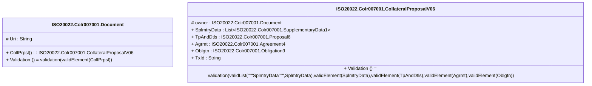

# colr.007.001.06-physical

> The tables below contain descriptions of the members of each Element. 
> The first column indicates the type of the member:
> A ‘#’ indicates that the field is a key to the element, and a ‘+’ indicates that the field is a value.
> The ‘*’ column contains a description for the element member.  
> The ‘@’ column contains any properties for the member.
> The ‘=’ column contains calculated values; or in the case of an enum, the serialized value.

---

## EntityImpl ISO20022.Colr007001.Document

| |Name|Type|*|@|=|
|-|-|-|-|-|-|
|#|Uri|String||XmlIgnore(), JsonIgnore()||
|+|CollPrpsl|ISO20022.Colr007001.CollateralProposalV06||XmlElement()||
||Validation|Some(String)||XmlIgnore(), JsonIgnore()|validation(validElement(CollPrpsl))|

---

## AspectImpl ISO20022.Colr007001.CollateralProposalV06

| |Name|Type|*|@|=|
|-|-|-|-|-|-|
|#|owner|ISO20022.Colr007001.Document||||
|+|SplmtryData|List<ISO20022.Colr007001.SupplementaryData1>||XmlElement()||
|+|TpAndDtls|ISO20022.Colr007001.Proposal6||XmlElement()||
|+|Agrmt|ISO20022.Colr007001.Agreement4||XmlElement()||
|+|Oblgtn|ISO20022.Colr007001.Obligation9||XmlElement()||
|+|TxId|String||XmlElement()||
||Validation|Some(String)||XmlIgnore(), JsonIgnore()|validation(validList("""SplmtryData""",SplmtryData),validElement(SplmtryData),validElement(TpAndDtls),validElement(Agrmt),validElement(Oblgtn))|

