# colr.009.001.05

```mermaid
classDiagram
    class Hiperspace.Edge {
        # From  : Hiperspace.Node
        # To  : Hiperspace.Node
        # TypeName  : String
        + Name  : String
    }
    class ISO20022.Colr009001.ActiveCurrencyAndAmount {
        + Value  : Decimal
        + Ccy  : String
    }
    class ISO20022.Colr009001.BlockChainAddressWallet5 {
        + Nm  : String
        + Tp  : ISO20022.Colr009001.CollateralAccountIdentificationType3Choice
        + Id  : String
    }
    ISO20022.Colr009001.BlockChainAddressWallet5 *-- ISO20022.Colr009001.CollateralAccountIdentificationType3Choice
    class ISO20022.Colr009001.CollateralAccount3 {
        + Nm  : String
        + Tp  : ISO20022.Colr009001.CollateralAccountIdentificationType3Choice
        + Id  : String
    }
    ISO20022.Colr009001.CollateralAccount3 *-- ISO20022.Colr009001.CollateralAccountIdentificationType3Choice
    class ISO20022.Colr009001.CollateralAccountIdentificationType3Choice {
        + Prtry  : ISO20022.Colr009001.GenericIdentification36
        + Tp  : String
    }
    ISO20022.Colr009001.CollateralAccountIdentificationType3Choice *-- ISO20022.Colr009001.GenericIdentification36
    class ISO20022.Colr009001.CollateralAccountType1Code {
        DFLT = 1
        MGIN = 2
        LIPR = 3
        CLIE = 4
        HOUS = 5
    }
    class ISO20022.Colr009001.DateAndDateTime2Choice {
        + DtTm  : DateTime
        + Dt  : DateTime
    }
    class ISO20022.Colr009001.Dispute1 {
        + DsptDt  : DateTime
        + DsptdAmt  : ISO20022.Colr009001.ActiveCurrencyAndAmount
        + MrgnCallReqId  : String
    }
    ISO20022.Colr009001.Dispute1 *-- ISO20022.Colr009001.ActiveCurrencyAndAmount
    class ISO20022.Colr009001.DisputeNotification2 {
        + SgrtdIndpdntAmtDspt  : ISO20022.Colr009001.SegregatedIndependentAmountDispute2
        + VartnMrgnDspt  : ISO20022.Colr009001.VariationMarginDispute1
    }
    ISO20022.Colr009001.DisputeNotification2 *-- ISO20022.Colr009001.SegregatedIndependentAmountDispute2
    ISO20022.Colr009001.DisputeNotification2 *-- ISO20022.Colr009001.VariationMarginDispute1
    class ISO20022.Colr009001.DisputeNotification2Choice {
        + SgrtdIndpdntAmtDsptDtls  : ISO20022.Colr009001.SegregatedIndependentAmountDispute2
        + DsptNtfctnDtls  : ISO20022.Colr009001.DisputeNotification2
    }
    ISO20022.Colr009001.DisputeNotification2Choice *-- ISO20022.Colr009001.SegregatedIndependentAmountDispute2
    ISO20022.Colr009001.DisputeNotification2Choice *-- ISO20022.Colr009001.DisputeNotification2
    class ISO20022.Colr009001.DisputeResolutionType1Choice {
        + PrtryId  : ISO20022.Colr009001.GenericIdentification30
        + Cd  : String
    }
    ISO20022.Colr009001.DisputeResolutionType1Choice *-- ISO20022.Colr009001.GenericIdentification30
    class ISO20022.Colr009001.DisputeResolutionType1Code {
        RESA = 1
        REVF = 2
        RERO = 3
        RMTA = 4
        RECO = 5
    }
    class ISO20022.Colr009001.DisputeResolutionType2Choice {
        + PrtryId  : ISO20022.Colr009001.GenericIdentification30
        + Cd  : String
    }
    ISO20022.Colr009001.DisputeResolutionType2Choice *-- ISO20022.Colr009001.GenericIdentification30
    class ISO20022.Colr009001.DisputeResolutionType2Code {
        RNIA = 1
        REVF = 2
        RERO = 3
        RMTA = 4
        RETH = 5
        REEX = 6
        RECO = 7
    }
    class ISO20022.Colr009001.ExposureType11Code {
        SHSL = 1
        REPO = 2
        TRBD = 3
        EQUI = 4
        CCPC = 5
        UDMS = 6
        TRCP = 7
        TBAS = 8
        SWPT = 9
        SCIE = 10
        SCIR = 11
        SLEB = 12
        SCRP = 13
        SBSC = 14
        SLOA = 15
        RVPO = 16
        OTCD = 17
        LIQU = 18
        OPTN = 19
        FUTR = 20
        FORW = 21
        FORX = 22
        FIXI = 23
        EXPT = 24
        EXTD = 25
        EQUS = 26
        EQPT = 27
        CRPR = 28
        CCIR = 29
        CRSP = 30
        CRTL = 31
        CRDS = 32
        COMM = 33
        CBCO = 34
        PAYM = 35
        BFWD = 36
    }
    class ISO20022.Colr009001.GenericIdentification30 {
        + SchmeNm  : String
        + Issr  : String
        + Id  : String
    }
    class ISO20022.Colr009001.GenericIdentification36 {
        + SchmeNm  : String
        + Issr  : String
        + Id  : String
    }
    class ISO20022.Colr009001.MarginCallDisputeNotificationV05 {
        + SplmtryData  : global::System.Collections.Generic.List~ISO20022.Colr009001.SupplementaryData1~
        + DsptNtfctn  : ISO20022.Colr009001.DisputeNotification2Choice
        + Oblgtn  : ISO20022.Colr009001.Obligation9
        + TxId  : String
    }
    ISO20022.Colr009001.MarginCallDisputeNotificationV05 *-- ISO20022.Colr009001.SupplementaryData1
    ISO20022.Colr009001.MarginCallDisputeNotificationV05 *-- ISO20022.Colr009001.DisputeNotification2Choice
    ISO20022.Colr009001.MarginCallDisputeNotificationV05 *-- ISO20022.Colr009001.Obligation9
    class ISO20022.Colr009001.NameAndAddress6 {
        + Adr  : ISO20022.Colr009001.PostalAddress2
        + Nm  : String
    }
    ISO20022.Colr009001.NameAndAddress6 *-- ISO20022.Colr009001.PostalAddress2
    class ISO20022.Colr009001.Obligation9 {
        + ValtnDt  : ISO20022.Colr009001.DateAndDateTime2Choice
        + XpsrTp  : String
        + BlckChainAdrOrWllt  : ISO20022.Colr009001.BlockChainAddressWallet5
        + CollAcctId  : ISO20022.Colr009001.CollateralAccount3
        + SvcgPtyB  : ISO20022.Colr009001.PartyIdentification178Choice
        + PtyB  : ISO20022.Colr009001.PartyIdentification178Choice
        + SvcgPtyA  : ISO20022.Colr009001.PartyIdentification178Choice
        + PtyA  : ISO20022.Colr009001.PartyIdentification178Choice
    }
    ISO20022.Colr009001.Obligation9 *-- ISO20022.Colr009001.DateAndDateTime2Choice
    ISO20022.Colr009001.Obligation9 *-- ISO20022.Colr009001.BlockChainAddressWallet5
    ISO20022.Colr009001.Obligation9 *-- ISO20022.Colr009001.CollateralAccount3
    ISO20022.Colr009001.Obligation9 *-- ISO20022.Colr009001.PartyIdentification178Choice
    ISO20022.Colr009001.Obligation9 *-- ISO20022.Colr009001.PartyIdentification178Choice
    ISO20022.Colr009001.Obligation9 *-- ISO20022.Colr009001.PartyIdentification178Choice
    ISO20022.Colr009001.Obligation9 *-- ISO20022.Colr009001.PartyIdentification178Choice
    class ISO20022.Colr009001.PartyIdentification178Choice {
        + NmAndAdr  : ISO20022.Colr009001.NameAndAddress6
        + PrtryId  : ISO20022.Colr009001.GenericIdentification36
        + AnyBIC  : String
    }
    ISO20022.Colr009001.PartyIdentification178Choice *-- ISO20022.Colr009001.NameAndAddress6
    ISO20022.Colr009001.PartyIdentification178Choice *-- ISO20022.Colr009001.GenericIdentification36
    class ISO20022.Colr009001.PostalAddress2 {
        + Ctry  : String
        + CtrySubDvsn  : String
        + TwnNm  : String
        + PstCdId  : String
        + StrtNm  : String
    }
    class ISO20022.Colr009001.SegregatedIndependentAmountDispute2 {
        + DsptRsltnTp1Chc  : global::System.Collections.Generic.List~ISO20022.Colr009001.DisputeResolutionType1Choice~
        + DsptDtls  : ISO20022.Colr009001.Dispute1
    }
    ISO20022.Colr009001.SegregatedIndependentAmountDispute2 *-- ISO20022.Colr009001.DisputeResolutionType1Choice
    ISO20022.Colr009001.SegregatedIndependentAmountDispute2 *-- ISO20022.Colr009001.Dispute1
    class ISO20022.Colr009001.SupplementaryData1 {
        + Envlp  : ISO20022.Colr009001.SupplementaryDataEnvelope1
        + PlcAndNm  : String
    }
    ISO20022.Colr009001.SupplementaryData1 *-- ISO20022.Colr009001.SupplementaryDataEnvelope1
    class ISO20022.Colr009001.SupplementaryDataEnvelope1 {
    }
    class ISO20022.Colr009001.VariationMarginDispute1 {
        + RsltnTpDtls  : global::System.Collections.Generic.List~ISO20022.Colr009001.DisputeResolutionType2Choice~
        + DsptDtls  : ISO20022.Colr009001.Dispute1
    }
    ISO20022.Colr009001.VariationMarginDispute1 *-- ISO20022.Colr009001.DisputeResolutionType2Choice
    ISO20022.Colr009001.VariationMarginDispute1 *-- ISO20022.Colr009001.Dispute1
    class Hiperspace.Node {
        # SKey  : String
        + TypeName  : String
        + Name  : String
        + Froms (From = this) : Hiperspace.Edge
        + Tos (To = this) : Hiperspace.Edge
    }
```

> The tables below contain descriptions of the members of each Element. 
> The first column indicates the type of the member:
> A ‘#’ indicates that the field is a key to the element, and a ‘+’ indicates that the field is a value.
> The ‘*’ column contains a description for the element member.  
> The ‘@’ column contains any properties for the member.
> The ‘=’ column contains calculated values; or in the case of an enum, the serialized value.

---

## View Hiperspace.Edge
edge between nodes

| |Name|Type|*|@|=|
|-|-|-|-|-|-|
|#|From|Hiperspace.Node||||
|#|To|Hiperspace.Node||||
|#|TypeName|String||||
|+|Name|String||||

---

## Value ISO20022.Colr009001.ActiveCurrencyAndAmount

| |Name|Type|*|@|=|
|-|-|-|-|-|-|
|+|Value|Decimal||XmlElement()||
|+|Ccy|String||XmlAttribute()||
||Validation|Some(String)||XmlIgnore(), JsonIgnore()|validation(validRequired("""Value""",Value),validRequired("""Ccy""",Ccy),validPattern("""Ccy""",Ccy,"""[A-Z]{3,3}"""))|

---

## Value ISO20022.Colr009001.BlockChainAddressWallet5

| |Name|Type|*|@|=|
|-|-|-|-|-|-|
|+|Nm|String||XmlElement()||
|+|Tp|ISO20022.Colr009001.CollateralAccountIdentificationType3Choice||XmlElement()||
|+|Id|String||XmlElement()||
||Validation|Some(String)||XmlIgnore(), JsonIgnore()|validation(validElement(Tp))|

---

## Value ISO20022.Colr009001.CollateralAccount3

| |Name|Type|*|@|=|
|-|-|-|-|-|-|
|+|Nm|String||XmlElement()||
|+|Tp|ISO20022.Colr009001.CollateralAccountIdentificationType3Choice||XmlElement()||
|+|Id|String||XmlElement()||
||Validation|Some(String)||XmlIgnore(), JsonIgnore()|validation(validElement(Tp))|

---

## Value ISO20022.Colr009001.CollateralAccountIdentificationType3Choice

| |Name|Type|*|@|=|
|-|-|-|-|-|-|
|+|Prtry|ISO20022.Colr009001.GenericIdentification36||XmlElement()||
|+|Tp|String||XmlElement()||
||Validation|Some(String)||XmlIgnore(), JsonIgnore()|validation(validElement(Prtry),validChoice(Prtry,Tp))|

---

## Enum ISO20022.Colr009001.CollateralAccountType1Code

| |Name|Type|*|@|=|
|-|-|-|-|-|-|
||DFLT|Int32||XmlEnum("""DFLT""")|1|
||MGIN|Int32||XmlEnum("""MGIN""")|2|
||LIPR|Int32||XmlEnum("""LIPR""")|3|
||CLIE|Int32||XmlEnum("""CLIE""")|4|
||HOUS|Int32||XmlEnum("""HOUS""")|5|

---

## Value ISO20022.Colr009001.DateAndDateTime2Choice

| |Name|Type|*|@|=|
|-|-|-|-|-|-|
|+|DtTm|DateTime||XmlElement()||
|+|Dt|DateTime||XmlElement()||
||Validation|Some(String)||XmlIgnore(), JsonIgnore()|validation(validChoice(DtTm,Dt))|

---

## Value ISO20022.Colr009001.Dispute1

| |Name|Type|*|@|=|
|-|-|-|-|-|-|
|+|DsptDt|DateTime||XmlElement()||
|+|DsptdAmt|ISO20022.Colr009001.ActiveCurrencyAndAmount||XmlElement()||
|+|MrgnCallReqId|String||XmlElement()||
||Validation|Some(String)||XmlIgnore(), JsonIgnore()|validation(validElement(DsptdAmt))|

---

## Value ISO20022.Colr009001.DisputeNotification2

| |Name|Type|*|@|=|
|-|-|-|-|-|-|
|+|SgrtdIndpdntAmtDspt|ISO20022.Colr009001.SegregatedIndependentAmountDispute2||XmlElement()||
|+|VartnMrgnDspt|ISO20022.Colr009001.VariationMarginDispute1||XmlElement()||
||Validation|Some(String)||XmlIgnore(), JsonIgnore()|validation(validElement(SgrtdIndpdntAmtDspt),validElement(VartnMrgnDspt))|

---

## Value ISO20022.Colr009001.DisputeNotification2Choice

| |Name|Type|*|@|=|
|-|-|-|-|-|-|
|+|SgrtdIndpdntAmtDsptDtls|ISO20022.Colr009001.SegregatedIndependentAmountDispute2||XmlElement()||
|+|DsptNtfctnDtls|ISO20022.Colr009001.DisputeNotification2||XmlElement()||
||Validation|Some(String)||XmlIgnore(), JsonIgnore()|validation(validElement(SgrtdIndpdntAmtDsptDtls),validElement(DsptNtfctnDtls),validChoice(SgrtdIndpdntAmtDsptDtls,DsptNtfctnDtls))|

---

## Value ISO20022.Colr009001.DisputeResolutionType1Choice

| |Name|Type|*|@|=|
|-|-|-|-|-|-|
|+|PrtryId|ISO20022.Colr009001.GenericIdentification30||XmlElement()||
|+|Cd|String||XmlElement()||
||Validation|Some(String)||XmlIgnore(), JsonIgnore()|validation(validElement(PrtryId),validChoice(PrtryId,Cd))|

---

## Enum ISO20022.Colr009001.DisputeResolutionType1Code

| |Name|Type|*|@|=|
|-|-|-|-|-|-|
||RESA|Int32||XmlEnum("""RESA""")|1|
||REVF|Int32||XmlEnum("""REVF""")|2|
||RERO|Int32||XmlEnum("""RERO""")|3|
||RMTA|Int32||XmlEnum("""RMTA""")|4|
||RECO|Int32||XmlEnum("""RECO""")|5|

---

## Value ISO20022.Colr009001.DisputeResolutionType2Choice

| |Name|Type|*|@|=|
|-|-|-|-|-|-|
|+|PrtryId|ISO20022.Colr009001.GenericIdentification30||XmlElement()||
|+|Cd|String||XmlElement()||
||Validation|Some(String)||XmlIgnore(), JsonIgnore()|validation(validElement(PrtryId),validChoice(PrtryId,Cd))|

---

## Enum ISO20022.Colr009001.DisputeResolutionType2Code

| |Name|Type|*|@|=|
|-|-|-|-|-|-|
||RNIA|Int32||XmlEnum("""RNIA""")|1|
||REVF|Int32||XmlEnum("""REVF""")|2|
||RERO|Int32||XmlEnum("""RERO""")|3|
||RMTA|Int32||XmlEnum("""RMTA""")|4|
||RETH|Int32||XmlEnum("""RETH""")|5|
||REEX|Int32||XmlEnum("""REEX""")|6|
||RECO|Int32||XmlEnum("""RECO""")|7|

---

## Type ISO20022.Colr009001.Document

| |Name|Type|*|@|=|
|-|-|-|-|-|-|
|+|MrgnCallDsptNtfctn|ISO20022.Colr009001.MarginCallDisputeNotificationV05||XmlElement()||
||Validation|Some(String)||XmlIgnore(), JsonIgnore()|validation(validElement(MrgnCallDsptNtfctn))|

---

## Enum ISO20022.Colr009001.ExposureType11Code

| |Name|Type|*|@|=|
|-|-|-|-|-|-|
||SHSL|Int32||XmlEnum("""SHSL""")|1|
||REPO|Int32||XmlEnum("""REPO""")|2|
||TRBD|Int32||XmlEnum("""TRBD""")|3|
||EQUI|Int32||XmlEnum("""EQUI""")|4|
||CCPC|Int32||XmlEnum("""CCPC""")|5|
||UDMS|Int32||XmlEnum("""UDMS""")|6|
||TRCP|Int32||XmlEnum("""TRCP""")|7|
||TBAS|Int32||XmlEnum("""TBAS""")|8|
||SWPT|Int32||XmlEnum("""SWPT""")|9|
||SCIE|Int32||XmlEnum("""SCIE""")|10|
||SCIR|Int32||XmlEnum("""SCIR""")|11|
||SLEB|Int32||XmlEnum("""SLEB""")|12|
||SCRP|Int32||XmlEnum("""SCRP""")|13|
||SBSC|Int32||XmlEnum("""SBSC""")|14|
||SLOA|Int32||XmlEnum("""SLOA""")|15|
||RVPO|Int32||XmlEnum("""RVPO""")|16|
||OTCD|Int32||XmlEnum("""OTCD""")|17|
||LIQU|Int32||XmlEnum("""LIQU""")|18|
||OPTN|Int32||XmlEnum("""OPTN""")|19|
||FUTR|Int32||XmlEnum("""FUTR""")|20|
||FORW|Int32||XmlEnum("""FORW""")|21|
||FORX|Int32||XmlEnum("""FORX""")|22|
||FIXI|Int32||XmlEnum("""FIXI""")|23|
||EXPT|Int32||XmlEnum("""EXPT""")|24|
||EXTD|Int32||XmlEnum("""EXTD""")|25|
||EQUS|Int32||XmlEnum("""EQUS""")|26|
||EQPT|Int32||XmlEnum("""EQPT""")|27|
||CRPR|Int32||XmlEnum("""CRPR""")|28|
||CCIR|Int32||XmlEnum("""CCIR""")|29|
||CRSP|Int32||XmlEnum("""CRSP""")|30|
||CRTL|Int32||XmlEnum("""CRTL""")|31|
||CRDS|Int32||XmlEnum("""CRDS""")|32|
||COMM|Int32||XmlEnum("""COMM""")|33|
||CBCO|Int32||XmlEnum("""CBCO""")|34|
||PAYM|Int32||XmlEnum("""PAYM""")|35|
||BFWD|Int32||XmlEnum("""BFWD""")|36|

---

## Value ISO20022.Colr009001.GenericIdentification30

| |Name|Type|*|@|=|
|-|-|-|-|-|-|
|+|SchmeNm|String||XmlElement()||
|+|Issr|String||XmlElement()||
|+|Id|String||XmlElement()||
||Validation|Some(String)||XmlIgnore(), JsonIgnore()|validation(validPattern("""Id""",Id,"""[a-zA-Z0-9]{4}"""))|

---

## Value ISO20022.Colr009001.GenericIdentification36

| |Name|Type|*|@|=|
|-|-|-|-|-|-|
|+|SchmeNm|String||XmlElement()||
|+|Issr|String||XmlElement()||
|+|Id|String||XmlElement()||
||Validation|Some(String)||XmlIgnore(), JsonIgnore()|""|

---

## Aspect ISO20022.Colr009001.MarginCallDisputeNotificationV05

| |Name|Type|*|@|=|
|-|-|-|-|-|-|
|+|SplmtryData|global::System.Collections.Generic.List<ISO20022.Colr009001.SupplementaryData1>||XmlElement()||
|+|DsptNtfctn|ISO20022.Colr009001.DisputeNotification2Choice||XmlElement()||
|+|Oblgtn|ISO20022.Colr009001.Obligation9||XmlElement()||
|+|TxId|String||XmlElement()||
||Validation|Some(String)||XmlIgnore(), JsonIgnore()|validation(validList("""SplmtryData""",SplmtryData),validElement(SplmtryData),validElement(DsptNtfctn),validElement(Oblgtn))|

---

## Value ISO20022.Colr009001.NameAndAddress6

| |Name|Type|*|@|=|
|-|-|-|-|-|-|
|+|Adr|ISO20022.Colr009001.PostalAddress2||XmlElement()||
|+|Nm|String||XmlElement()||
||Validation|Some(String)||XmlIgnore(), JsonIgnore()|validation(validElement(Adr))|

---

## Value ISO20022.Colr009001.Obligation9

| |Name|Type|*|@|=|
|-|-|-|-|-|-|
|+|ValtnDt|ISO20022.Colr009001.DateAndDateTime2Choice||XmlElement()||
|+|XpsrTp|String||XmlElement()||
|+|BlckChainAdrOrWllt|ISO20022.Colr009001.BlockChainAddressWallet5||XmlElement()||
|+|CollAcctId|ISO20022.Colr009001.CollateralAccount3||XmlElement()||
|+|SvcgPtyB|ISO20022.Colr009001.PartyIdentification178Choice||XmlElement()||
|+|PtyB|ISO20022.Colr009001.PartyIdentification178Choice||XmlElement()||
|+|SvcgPtyA|ISO20022.Colr009001.PartyIdentification178Choice||XmlElement()||
|+|PtyA|ISO20022.Colr009001.PartyIdentification178Choice||XmlElement()||
||Validation|Some(String)||XmlIgnore(), JsonIgnore()|validation(validElement(ValtnDt),validElement(BlckChainAdrOrWllt),validElement(CollAcctId),validElement(SvcgPtyB),validElement(PtyB),validElement(SvcgPtyA),validElement(PtyA))|

---

## Value ISO20022.Colr009001.PartyIdentification178Choice

| |Name|Type|*|@|=|
|-|-|-|-|-|-|
|+|NmAndAdr|ISO20022.Colr009001.NameAndAddress6||XmlElement()||
|+|PrtryId|ISO20022.Colr009001.GenericIdentification36||XmlElement()||
|+|AnyBIC|String||XmlElement()||
||Validation|Some(String)||XmlIgnore(), JsonIgnore()|validation(validElement(NmAndAdr),validElement(PrtryId),validPattern("""AnyBIC""",AnyBIC,"""[A-Z0-9]{4,4}[A-Z]{2,2}[A-Z0-9]{2,2}([A-Z0-9]{3,3}){0,1}"""),validChoice(NmAndAdr,PrtryId,AnyBIC))|

---

## Value ISO20022.Colr009001.PostalAddress2

| |Name|Type|*|@|=|
|-|-|-|-|-|-|
|+|Ctry|String||XmlElement()||
|+|CtrySubDvsn|String||XmlElement()||
|+|TwnNm|String||XmlElement()||
|+|PstCdId|String||XmlElement()||
|+|StrtNm|String||XmlElement()||
||Validation|Some(String)||XmlIgnore(), JsonIgnore()|validation(validPattern("""Ctry""",Ctry,"""[A-Z]{2,2}"""))|

---

## Value ISO20022.Colr009001.SegregatedIndependentAmountDispute2

| |Name|Type|*|@|=|
|-|-|-|-|-|-|
|+|DsptRsltnTp1Chc|global::System.Collections.Generic.List<ISO20022.Colr009001.DisputeResolutionType1Choice>||XmlElement()||
|+|DsptDtls|ISO20022.Colr009001.Dispute1||XmlElement()||
||Validation|Some(String)||XmlIgnore(), JsonIgnore()|validation(validList("""DsptRsltnTp1Chc""",DsptRsltnTp1Chc),validElement(DsptRsltnTp1Chc),validElement(DsptDtls))|

---

## Value ISO20022.Colr009001.SupplementaryData1

| |Name|Type|*|@|=|
|-|-|-|-|-|-|
|+|Envlp|ISO20022.Colr009001.SupplementaryDataEnvelope1||XmlElement()||
|+|PlcAndNm|String||XmlElement()||
||Validation|Some(String)||XmlIgnore(), JsonIgnore()|validation(validElement(Envlp))|

---

## Value ISO20022.Colr009001.SupplementaryDataEnvelope1

| |Name|Type|*|@|=|
|-|-|-|-|-|-|
||Validation|Some(String)||XmlIgnore(), JsonIgnore()|""|

---

## Value ISO20022.Colr009001.VariationMarginDispute1

| |Name|Type|*|@|=|
|-|-|-|-|-|-|
|+|RsltnTpDtls|global::System.Collections.Generic.List<ISO20022.Colr009001.DisputeResolutionType2Choice>||XmlElement()||
|+|DsptDtls|ISO20022.Colr009001.Dispute1||XmlElement()||
||Validation|Some(String)||XmlIgnore(), JsonIgnore()|validation(validList("""RsltnTpDtls""",RsltnTpDtls),validElement(RsltnTpDtls),validElement(DsptDtls))|

---

## View Hiperspace.Node
node in a graph view of data

| |Name|Type|*|@|=|
|-|-|-|-|-|-|
|#|SKey|String||||
|+|TypeName|String||||
|+|Name|String||||
||Froms|Hiperspace.Edge|||From = this|
||Tos|Hiperspace.Edge|||To = this|

