# colr.023.001.01-physical

```mermaid
classDiagram
    class ISO20022.Colr023001.Document {
        # Uri  : String
        + TrptyCollStsAdvc () : ISO20022.Colr023001.TripartyCollateralStatusAdviceV01
        + Validation () = validation(validElement(TrptyCollStsAdvc))
    }
    class ISO20022.Colr023001.TripartyCollateralStatusAdviceV01 {
        # owner  : ISO20022.Colr023001.Document
        + SplmtryData  : List~ISO20022.Colr023001.SupplementaryData1~
        + CshMvmnt  : List~ISO20022.Colr023001.CashMovement7~
        + SctiesMvmnt  : List~ISO20022.Colr023001.SecuritiesMovement8~
        + DealTxDt  : ISO20022.Colr023001.CollateralDate2
        + DealTxDtls  : ISO20022.Colr023001.DealTransactionDetails7
        + CollPties  : ISO20022.Colr023001.CollateralParties8
        + GnlParams  : ISO20022.Colr023001.CollateralParameters13
        + CollSts  : ISO20022.Colr023001.CollateralStatus3Choice
        + SttlmSts  : ISO20022.Colr023001.SettlementStatus27Choice
        + AllcnSts  : ISO20022.Colr023001.AllocationStatus1Choice
        + Pgntn  : ISO20022.Colr023001.Pagination1
        + TxInstrId  : ISO20022.Colr023001.TransactionIdentifications46
        + Validation () = validation(validList("""SplmtryData""",SplmtryData),validElement(SplmtryData),validList("""CshMvmnt""",CshMvmnt),validElement(CshMvmnt),validList("""SctiesMvmnt""",SctiesMvmnt),validElement(SctiesMvmnt),validElement(DealTxDt),validElement(DealTxDtls),validElement(CollPties),validElement(GnlParams),validElement(CollSts),validElement(SttlmSts),validElement(AllcnSts),validElement(Pgntn),validElement(TxInstrId))
    }
```

> The tables below contain descriptions of the members of each Element. 
> The first column indicates the type of the member:
> A ‘#’ indicates that the field is a key to the element, and a ‘+’ indicates that the field is a value.
> The ‘*’ column contains a description for the element member.  
> The ‘@’ column contains any properties for the member.
> The ‘=’ column contains calculated values; or in the case of an enum, the serialized value.

---

## EntityImpl ISO20022.Colr023001.Document

| |Name|Type|*|@|=|
|-|-|-|-|-|-|
|#|Uri|String||XmlIgnore(), JsonIgnore()||
|+|TrptyCollStsAdvc|ISO20022.Colr023001.TripartyCollateralStatusAdviceV01||XmlElement()||
||Validation|Some(String)||XmlIgnore(), JsonIgnore()|validation(validElement(TrptyCollStsAdvc))|

---

## AspectImpl ISO20022.Colr023001.TripartyCollateralStatusAdviceV01

| |Name|Type|*|@|=|
|-|-|-|-|-|-|
|#|owner|ISO20022.Colr023001.Document||||
|+|SplmtryData|List<ISO20022.Colr023001.SupplementaryData1>||XmlElement()||
|+|CshMvmnt|List<ISO20022.Colr023001.CashMovement7>||XmlElement()||
|+|SctiesMvmnt|List<ISO20022.Colr023001.SecuritiesMovement8>||XmlElement()||
|+|DealTxDt|ISO20022.Colr023001.CollateralDate2||XmlElement()||
|+|DealTxDtls|ISO20022.Colr023001.DealTransactionDetails7||XmlElement()||
|+|CollPties|ISO20022.Colr023001.CollateralParties8||XmlElement()||
|+|GnlParams|ISO20022.Colr023001.CollateralParameters13||XmlElement()||
|+|CollSts|ISO20022.Colr023001.CollateralStatus3Choice||XmlElement()||
|+|SttlmSts|ISO20022.Colr023001.SettlementStatus27Choice||XmlElement()||
|+|AllcnSts|ISO20022.Colr023001.AllocationStatus1Choice||XmlElement()||
|+|Pgntn|ISO20022.Colr023001.Pagination1||XmlElement()||
|+|TxInstrId|ISO20022.Colr023001.TransactionIdentifications46||XmlElement()||
||Validation|Some(String)||XmlIgnore(), JsonIgnore()|validation(validList("""SplmtryData""",SplmtryData),validElement(SplmtryData),validList("""CshMvmnt""",CshMvmnt),validElement(CshMvmnt),validList("""SctiesMvmnt""",SctiesMvmnt),validElement(SctiesMvmnt),validElement(DealTxDt),validElement(DealTxDtls),validElement(CollPties),validElement(GnlParams),validElement(CollSts),validElement(SttlmSts),validElement(AllcnSts),validElement(Pgntn),validElement(TxInstrId))|

