# colr.024.001.01

```mermaid
classDiagram
    class Hiperspace.Edge {
        # From  : Hiperspace.Node
        # To  : Hiperspace.Node
        # TypeName  : String
        + Name  : String
    }
    class ISO20022.Colr024001.ActiveCurrencyAndAmount {
        + Value  : Decimal
        + Ccy  : String
    }
    class ISO20022.Colr024001.ActiveOrHistoricCurrencyAndAmount {
        + Value  : Decimal
        + Ccy  : String
    }
    class ISO20022.Colr024001.AddressType2Code {
        DLVY = 1
        MLTO = 2
        BIZZ = 3
        HOME = 4
        PBOX = 5
        ADDR = 6
    }
    class ISO20022.Colr024001.AlternatePartyIdentification7 {
        + AltrnId  : String
        + Ctry  : String
        + IdTp  : ISO20022.Colr024001.IdentificationType42Choice
    }
    ISO20022.Colr024001.AlternatePartyIdentification7 *-- ISO20022.Colr024001.IdentificationType42Choice
    class ISO20022.Colr024001.AmountAndDirection49 {
        + FXDtls  : ISO20022.Colr024001.ForeignExchangeTerms23
        + OrgnlCcyAndOrdrdAmt  : ISO20022.Colr024001.ActiveOrHistoricCurrencyAndAmount
        + CdtDbtInd  : String
        + Amt  : ISO20022.Colr024001.ActiveCurrencyAndAmount
    }
    ISO20022.Colr024001.AmountAndDirection49 *-- ISO20022.Colr024001.ForeignExchangeTerms23
    ISO20022.Colr024001.AmountAndDirection49 *-- ISO20022.Colr024001.ActiveOrHistoricCurrencyAndAmount
    ISO20022.Colr024001.AmountAndDirection49 *-- ISO20022.Colr024001.ActiveCurrencyAndAmount
    class ISO20022.Colr024001.BlockChainAddressWallet3 {
        + Nm  : String
        + Tp  : ISO20022.Colr024001.GenericIdentification30
        + Id  : String
    }
    ISO20022.Colr024001.BlockChainAddressWallet3 *-- ISO20022.Colr024001.GenericIdentification30
    class ISO20022.Colr024001.CollateralParties8 {
        + TrptyAgt  : ISO20022.Colr024001.PartyIdentification136
        + ClntPtyB  : ISO20022.Colr024001.PartyIdentificationAndAccount193
        + PtyB  : ISO20022.Colr024001.PartyIdentificationAndAccount203
        + ClntPtyA  : ISO20022.Colr024001.PartyIdentificationAndAccount193
        + PtyA  : ISO20022.Colr024001.PartyIdentificationAndAccount202
    }
    ISO20022.Colr024001.CollateralParties8 *-- ISO20022.Colr024001.PartyIdentification136
    ISO20022.Colr024001.CollateralParties8 *-- ISO20022.Colr024001.PartyIdentificationAndAccount193
    ISO20022.Colr024001.CollateralParties8 *-- ISO20022.Colr024001.PartyIdentificationAndAccount203
    ISO20022.Colr024001.CollateralParties8 *-- ISO20022.Colr024001.PartyIdentificationAndAccount193
    ISO20022.Colr024001.CollateralParties8 *-- ISO20022.Colr024001.PartyIdentificationAndAccount202
    class ISO20022.Colr024001.CollateralRole1Code {
        TAKE = 1
        GIVE = 2
    }
    class ISO20022.Colr024001.CollateralTransactionType1Choice {
        + Prtry  : ISO20022.Colr024001.GenericIdentification30
        + Cd  : String
    }
    ISO20022.Colr024001.CollateralTransactionType1Choice *-- ISO20022.Colr024001.GenericIdentification30
    class ISO20022.Colr024001.CollateralTransactionType1Code {
        TERM = 1
        RATA = 2
        PADJ = 3
        MADJ = 4
        INIT = 5
        DBVT = 6
        DADJ = 7
        CADJ = 8
        CDTA = 9
        AADJ = 10
    }
    class ISO20022.Colr024001.CreditDebitCode {
        DBIT = 1
        CRDT = 2
    }
    class ISO20022.Colr024001.DateAndDateTime2Choice {
        + DtTm  : DateTime
        + Dt  : DateTime
    }
    class ISO20022.Colr024001.ExposureType14Code {
        MGLD = 1
        SHSL = 2
        REPO = 3
        TRBD = 4
        EQUI = 5
        CCPC = 6
        UDMS = 7
        TRCP = 8
        TBAS = 9
        SWPT = 10
        SCIE = 11
        SCIR = 12
        SLEB = 13
        SCRP = 14
        SBSC = 15
        SLOA = 16
        RVPO = 17
        OTCD = 18
        LIQU = 19
        OPTN = 20
        FUTR = 21
        FORW = 22
        FORX = 23
        FIXI = 24
        EXPT = 25
        EXTD = 26
        EQUS = 27
        EQPT = 28
        CRPR = 29
        CCIR = 30
        CRSP = 31
        CRTL = 32
        CRDS = 33
        COMM = 34
        CBCO = 35
        PAYM = 36
        BFWD = 37
    }
    class ISO20022.Colr024001.ExposureType23Choice {
        + Prtry  : ISO20022.Colr024001.GenericIdentification30
        + Cd  : String
    }
    ISO20022.Colr024001.ExposureType23Choice *-- ISO20022.Colr024001.GenericIdentification30
    class ISO20022.Colr024001.ForeignExchangeTerms23 {
        + RsltgAmt  : ISO20022.Colr024001.ActiveCurrencyAndAmount
        + XchgRate  : Decimal
        + QtdCcy  : String
        + UnitCcy  : String
    }
    ISO20022.Colr024001.ForeignExchangeTerms23 *-- ISO20022.Colr024001.ActiveCurrencyAndAmount
    class ISO20022.Colr024001.GenericIdentification1 {
        + Issr  : String
        + SchmeNm  : String
        + Id  : String
    }
    class ISO20022.Colr024001.GenericIdentification30 {
        + SchmeNm  : String
        + Issr  : String
        + Id  : String
    }
    class ISO20022.Colr024001.GenericIdentification36 {
        + SchmeNm  : String
        + Issr  : String
        + Id  : String
    }
    class ISO20022.Colr024001.IdentificationType42Choice {
        + Prtry  : ISO20022.Colr024001.GenericIdentification30
        + Cd  : String
    }
    ISO20022.Colr024001.IdentificationType42Choice *-- ISO20022.Colr024001.GenericIdentification30
    class ISO20022.Colr024001.NameAndAddress5 {
        + Adr  : ISO20022.Colr024001.PostalAddress1
        + Nm  : String
    }
    ISO20022.Colr024001.NameAndAddress5 *-- ISO20022.Colr024001.PostalAddress1
    class ISO20022.Colr024001.PartyIdentification120Choice {
        + NmAndAdr  : ISO20022.Colr024001.NameAndAddress5
        + PrtryId  : ISO20022.Colr024001.GenericIdentification36
        + AnyBIC  : String
    }
    ISO20022.Colr024001.PartyIdentification120Choice *-- ISO20022.Colr024001.NameAndAddress5
    ISO20022.Colr024001.PartyIdentification120Choice *-- ISO20022.Colr024001.GenericIdentification36
    class ISO20022.Colr024001.PartyIdentification136 {
        + LEI  : String
        + Id  : ISO20022.Colr024001.PartyIdentification120Choice
    }
    ISO20022.Colr024001.PartyIdentification136 *-- ISO20022.Colr024001.PartyIdentification120Choice
    class ISO20022.Colr024001.PartyIdentificationAndAccount193 {
        + AltrnId  : ISO20022.Colr024001.AlternatePartyIdentification7
        + LEI  : String
        + Id  : ISO20022.Colr024001.PartyIdentification120Choice
    }
    ISO20022.Colr024001.PartyIdentificationAndAccount193 *-- ISO20022.Colr024001.AlternatePartyIdentification7
    ISO20022.Colr024001.PartyIdentificationAndAccount193 *-- ISO20022.Colr024001.PartyIdentification120Choice
    class ISO20022.Colr024001.PartyIdentificationAndAccount202 {
        + PtyCpcty  : ISO20022.Colr024001.TradingPartyCapacity5Choice
        + AcctOwnr  : ISO20022.Colr024001.PartyIdentification136
        + BlckChainAdrOrWllt  : ISO20022.Colr024001.BlockChainAddressWallet3
        + SfkpgAcct  : ISO20022.Colr024001.SecuritiesAccount19
        + AltrnId  : ISO20022.Colr024001.AlternatePartyIdentification7
        + LEI  : String
        + Id  : ISO20022.Colr024001.PartyIdentification120Choice
    }
    ISO20022.Colr024001.PartyIdentificationAndAccount202 *-- ISO20022.Colr024001.TradingPartyCapacity5Choice
    ISO20022.Colr024001.PartyIdentificationAndAccount202 *-- ISO20022.Colr024001.PartyIdentification136
    ISO20022.Colr024001.PartyIdentificationAndAccount202 *-- ISO20022.Colr024001.BlockChainAddressWallet3
    ISO20022.Colr024001.PartyIdentificationAndAccount202 *-- ISO20022.Colr024001.SecuritiesAccount19
    ISO20022.Colr024001.PartyIdentificationAndAccount202 *-- ISO20022.Colr024001.AlternatePartyIdentification7
    ISO20022.Colr024001.PartyIdentificationAndAccount202 *-- ISO20022.Colr024001.PartyIdentification120Choice
    class ISO20022.Colr024001.PartyIdentificationAndAccount203 {
        + PtyCpcty  : ISO20022.Colr024001.TradingPartyCapacity5Choice
        + BlckChainAdrOrWllt  : ISO20022.Colr024001.BlockChainAddressWallet3
        + SfkpgAcct  : ISO20022.Colr024001.SecuritiesAccount19
        + AltrnId  : ISO20022.Colr024001.AlternatePartyIdentification7
        + LEI  : String
        + Id  : ISO20022.Colr024001.PartyIdentification120Choice
    }
    ISO20022.Colr024001.PartyIdentificationAndAccount203 *-- ISO20022.Colr024001.TradingPartyCapacity5Choice
    ISO20022.Colr024001.PartyIdentificationAndAccount203 *-- ISO20022.Colr024001.BlockChainAddressWallet3
    ISO20022.Colr024001.PartyIdentificationAndAccount203 *-- ISO20022.Colr024001.SecuritiesAccount19
    ISO20022.Colr024001.PartyIdentificationAndAccount203 *-- ISO20022.Colr024001.AlternatePartyIdentification7
    ISO20022.Colr024001.PartyIdentificationAndAccount203 *-- ISO20022.Colr024001.PartyIdentification120Choice
    class ISO20022.Colr024001.PostalAddress1 {
        + Ctry  : String
        + CtrySubDvsn  : String
        + TwnNm  : String
        + PstCd  : String
        + BldgNb  : String
        + StrtNm  : String
        + AdrLine  : global::System.Collections.Generic.List~String~
        + AdrTp  : String
    }
    class ISO20022.Colr024001.SecuritiesAccount19 {
        + Nm  : String
        + Tp  : ISO20022.Colr024001.GenericIdentification30
        + Id  : String
    }
    ISO20022.Colr024001.SecuritiesAccount19 *-- ISO20022.Colr024001.GenericIdentification30
    class ISO20022.Colr024001.SupplementaryData1 {
        + Envlp  : ISO20022.Colr024001.SupplementaryDataEnvelope1
        + PlcAndNm  : String
    }
    ISO20022.Colr024001.SupplementaryData1 *-- ISO20022.Colr024001.SupplementaryDataEnvelope1
    class ISO20022.Colr024001.SupplementaryDataEnvelope1 {
    }
    class ISO20022.Colr024001.TradingCapacity7Code {
        PRIN = 1
        AGEN = 2
    }
    class ISO20022.Colr024001.TradingPartyCapacity5Choice {
        + Prtry  : ISO20022.Colr024001.GenericIdentification30
        + Cd  : String
    }
    ISO20022.Colr024001.TradingPartyCapacity5Choice *-- ISO20022.Colr024001.GenericIdentification30
    class ISO20022.Colr024001.TransactionIdentifications44 {
        + CmonTxId  : String
        + CtrPtyCollTxId  : String
        + CtrPtyCollInstrId  : String
        + ClntCollTxId  : String
        + ClntCollInstrId  : String
        + TrptyAgtSvcPrvdrCollTxId  : String
        + TrptyAgtSvcPrvdrCollInstrId  : String
    }
    class ISO20022.Colr024001.TripartyCollateralAllegementNotificationCancellationAdviceV01 {
        + SplmtryData  : ISO20022.Colr024001.SupplementaryData1
        + ReqdExctnDt  : ISO20022.Colr024001.DateAndDateTime2Choice
        + TxAmt  : ISO20022.Colr024001.AmountAndDirection49
        + CollPties  : ISO20022.Colr024001.CollateralParties8
        + ElgbltySetPrfl  : ISO20022.Colr024001.GenericIdentification1
        + CollSd  : String
        + XpsrTp  : ISO20022.Colr024001.ExposureType23Choice
        + CollTxTp  : ISO20022.Colr024001.CollateralTransactionType1Choice
        + TxInstrId  : ISO20022.Colr024001.TransactionIdentifications44
    }
    ISO20022.Colr024001.TripartyCollateralAllegementNotificationCancellationAdviceV01 *-- ISO20022.Colr024001.SupplementaryData1
    ISO20022.Colr024001.TripartyCollateralAllegementNotificationCancellationAdviceV01 *-- ISO20022.Colr024001.DateAndDateTime2Choice
    ISO20022.Colr024001.TripartyCollateralAllegementNotificationCancellationAdviceV01 *-- ISO20022.Colr024001.AmountAndDirection49
    ISO20022.Colr024001.TripartyCollateralAllegementNotificationCancellationAdviceV01 *-- ISO20022.Colr024001.CollateralParties8
    ISO20022.Colr024001.TripartyCollateralAllegementNotificationCancellationAdviceV01 *-- ISO20022.Colr024001.GenericIdentification1
    ISO20022.Colr024001.TripartyCollateralAllegementNotificationCancellationAdviceV01 *-- ISO20022.Colr024001.ExposureType23Choice
    ISO20022.Colr024001.TripartyCollateralAllegementNotificationCancellationAdviceV01 *-- ISO20022.Colr024001.CollateralTransactionType1Choice
    ISO20022.Colr024001.TripartyCollateralAllegementNotificationCancellationAdviceV01 *-- ISO20022.Colr024001.TransactionIdentifications44
    class ISO20022.Colr024001.TypeOfIdentification1Code {
        TXID = 1
        FIIN = 2
        DRLC = 3
        CORP = 4
        CHTY = 5
        CCPT = 6
        ARNU = 7
    }
    class Hiperspace.Node {
        # SKey  : String
        + TypeName  : String
        + Name  : String
        + Froms (From = this) : Hiperspace.Edge
        + Tos (To = this) : Hiperspace.Edge
    }
```

> The tables below contain descriptions of the members of each Element. 
> The first column indicates the type of the member:
> A ‘#’ indicates that the field is a key to the element, and a ‘+’ indicates that the field is a value.
> The ‘*’ column contains a description for the element member.  
> The ‘@’ column contains any properties for the member.
> The ‘=’ column contains calculated values; or in the case of an enum, the serialized value.

---

## View Hiperspace.Edge
edge between nodes

| |Name|Type|*|@|=|
|-|-|-|-|-|-|
|#|From|Hiperspace.Node||||
|#|To|Hiperspace.Node||||
|#|TypeName|String||||
|+|Name|String||||

---

## Value ISO20022.Colr024001.ActiveCurrencyAndAmount

| |Name|Type|*|@|=|
|-|-|-|-|-|-|
|+|Value|Decimal||XmlElement()||
|+|Ccy|String||XmlAttribute()||
||Validation|Some(String)||XmlIgnore(), JsonIgnore()|validation(validRequired("""Value""",Value),validRequired("""Ccy""",Ccy),validPattern("""Ccy""",Ccy,"""[A-Z]{3,3}"""))|

---

## Value ISO20022.Colr024001.ActiveOrHistoricCurrencyAndAmount

| |Name|Type|*|@|=|
|-|-|-|-|-|-|
|+|Value|Decimal||XmlElement()||
|+|Ccy|String||XmlAttribute()||
||Validation|Some(String)||XmlIgnore(), JsonIgnore()|validation(validRequired("""Value""",Value),validRequired("""Ccy""",Ccy),validPattern("""Ccy""",Ccy,"""[A-Z]{3,3}"""))|

---

## Enum ISO20022.Colr024001.AddressType2Code

| |Name|Type|*|@|=|
|-|-|-|-|-|-|
||DLVY|Int32||XmlEnum("""DLVY""")|1|
||MLTO|Int32||XmlEnum("""MLTO""")|2|
||BIZZ|Int32||XmlEnum("""BIZZ""")|3|
||HOME|Int32||XmlEnum("""HOME""")|4|
||PBOX|Int32||XmlEnum("""PBOX""")|5|
||ADDR|Int32||XmlEnum("""ADDR""")|6|

---

## Value ISO20022.Colr024001.AlternatePartyIdentification7

| |Name|Type|*|@|=|
|-|-|-|-|-|-|
|+|AltrnId|String||XmlElement()||
|+|Ctry|String||XmlElement()||
|+|IdTp|ISO20022.Colr024001.IdentificationType42Choice||XmlElement()||
||Validation|Some(String)||XmlIgnore(), JsonIgnore()|validation(validPattern("""Ctry""",Ctry,"""[A-Z]{2,2}"""),validElement(IdTp))|

---

## Value ISO20022.Colr024001.AmountAndDirection49

| |Name|Type|*|@|=|
|-|-|-|-|-|-|
|+|FXDtls|ISO20022.Colr024001.ForeignExchangeTerms23||XmlElement()||
|+|OrgnlCcyAndOrdrdAmt|ISO20022.Colr024001.ActiveOrHistoricCurrencyAndAmount||XmlElement()||
|+|CdtDbtInd|String||XmlElement()||
|+|Amt|ISO20022.Colr024001.ActiveCurrencyAndAmount||XmlElement()||
||Validation|Some(String)||XmlIgnore(), JsonIgnore()|validation(validElement(FXDtls),validElement(OrgnlCcyAndOrdrdAmt),validElement(Amt))|

---

## Value ISO20022.Colr024001.BlockChainAddressWallet3

| |Name|Type|*|@|=|
|-|-|-|-|-|-|
|+|Nm|String||XmlElement()||
|+|Tp|ISO20022.Colr024001.GenericIdentification30||XmlElement()||
|+|Id|String||XmlElement()||
||Validation|Some(String)||XmlIgnore(), JsonIgnore()|validation(validElement(Tp))|

---

## Value ISO20022.Colr024001.CollateralParties8

| |Name|Type|*|@|=|
|-|-|-|-|-|-|
|+|TrptyAgt|ISO20022.Colr024001.PartyIdentification136||XmlElement()||
|+|ClntPtyB|ISO20022.Colr024001.PartyIdentificationAndAccount193||XmlElement()||
|+|PtyB|ISO20022.Colr024001.PartyIdentificationAndAccount203||XmlElement()||
|+|ClntPtyA|ISO20022.Colr024001.PartyIdentificationAndAccount193||XmlElement()||
|+|PtyA|ISO20022.Colr024001.PartyIdentificationAndAccount202||XmlElement()||
||Validation|Some(String)||XmlIgnore(), JsonIgnore()|validation(validElement(TrptyAgt),validElement(ClntPtyB),validElement(PtyB),validElement(ClntPtyA),validElement(PtyA))|

---

## Enum ISO20022.Colr024001.CollateralRole1Code

| |Name|Type|*|@|=|
|-|-|-|-|-|-|
||TAKE|Int32||XmlEnum("""TAKE""")|1|
||GIVE|Int32||XmlEnum("""GIVE""")|2|

---

## Value ISO20022.Colr024001.CollateralTransactionType1Choice

| |Name|Type|*|@|=|
|-|-|-|-|-|-|
|+|Prtry|ISO20022.Colr024001.GenericIdentification30||XmlElement()||
|+|Cd|String||XmlElement()||
||Validation|Some(String)||XmlIgnore(), JsonIgnore()|validation(validElement(Prtry),validChoice(Prtry,Cd))|

---

## Enum ISO20022.Colr024001.CollateralTransactionType1Code

| |Name|Type|*|@|=|
|-|-|-|-|-|-|
||TERM|Int32||XmlEnum("""TERM""")|1|
||RATA|Int32||XmlEnum("""RATA""")|2|
||PADJ|Int32||XmlEnum("""PADJ""")|3|
||MADJ|Int32||XmlEnum("""MADJ""")|4|
||INIT|Int32||XmlEnum("""INIT""")|5|
||DBVT|Int32||XmlEnum("""DBVT""")|6|
||DADJ|Int32||XmlEnum("""DADJ""")|7|
||CADJ|Int32||XmlEnum("""CADJ""")|8|
||CDTA|Int32||XmlEnum("""CDTA""")|9|
||AADJ|Int32||XmlEnum("""AADJ""")|10|

---

## Enum ISO20022.Colr024001.CreditDebitCode

| |Name|Type|*|@|=|
|-|-|-|-|-|-|
||DBIT|Int32||XmlEnum("""DBIT""")|1|
||CRDT|Int32||XmlEnum("""CRDT""")|2|

---

## Value ISO20022.Colr024001.DateAndDateTime2Choice

| |Name|Type|*|@|=|
|-|-|-|-|-|-|
|+|DtTm|DateTime||XmlElement()||
|+|Dt|DateTime||XmlElement()||
||Validation|Some(String)||XmlIgnore(), JsonIgnore()|validation(validChoice(DtTm,Dt))|

---

## Type ISO20022.Colr024001.Document

| |Name|Type|*|@|=|
|-|-|-|-|-|-|
|+|TrptyCollAllgmtNtfctnCxlAdvc|ISO20022.Colr024001.TripartyCollateralAllegementNotificationCancellationAdviceV01||XmlElement()||
||Validation|Some(String)||XmlIgnore(), JsonIgnore()|validation(validElement(TrptyCollAllgmtNtfctnCxlAdvc))|

---

## Enum ISO20022.Colr024001.ExposureType14Code

| |Name|Type|*|@|=|
|-|-|-|-|-|-|
||MGLD|Int32||XmlEnum("""MGLD""")|1|
||SHSL|Int32||XmlEnum("""SHSL""")|2|
||REPO|Int32||XmlEnum("""REPO""")|3|
||TRBD|Int32||XmlEnum("""TRBD""")|4|
||EQUI|Int32||XmlEnum("""EQUI""")|5|
||CCPC|Int32||XmlEnum("""CCPC""")|6|
||UDMS|Int32||XmlEnum("""UDMS""")|7|
||TRCP|Int32||XmlEnum("""TRCP""")|8|
||TBAS|Int32||XmlEnum("""TBAS""")|9|
||SWPT|Int32||XmlEnum("""SWPT""")|10|
||SCIE|Int32||XmlEnum("""SCIE""")|11|
||SCIR|Int32||XmlEnum("""SCIR""")|12|
||SLEB|Int32||XmlEnum("""SLEB""")|13|
||SCRP|Int32||XmlEnum("""SCRP""")|14|
||SBSC|Int32||XmlEnum("""SBSC""")|15|
||SLOA|Int32||XmlEnum("""SLOA""")|16|
||RVPO|Int32||XmlEnum("""RVPO""")|17|
||OTCD|Int32||XmlEnum("""OTCD""")|18|
||LIQU|Int32||XmlEnum("""LIQU""")|19|
||OPTN|Int32||XmlEnum("""OPTN""")|20|
||FUTR|Int32||XmlEnum("""FUTR""")|21|
||FORW|Int32||XmlEnum("""FORW""")|22|
||FORX|Int32||XmlEnum("""FORX""")|23|
||FIXI|Int32||XmlEnum("""FIXI""")|24|
||EXPT|Int32||XmlEnum("""EXPT""")|25|
||EXTD|Int32||XmlEnum("""EXTD""")|26|
||EQUS|Int32||XmlEnum("""EQUS""")|27|
||EQPT|Int32||XmlEnum("""EQPT""")|28|
||CRPR|Int32||XmlEnum("""CRPR""")|29|
||CCIR|Int32||XmlEnum("""CCIR""")|30|
||CRSP|Int32||XmlEnum("""CRSP""")|31|
||CRTL|Int32||XmlEnum("""CRTL""")|32|
||CRDS|Int32||XmlEnum("""CRDS""")|33|
||COMM|Int32||XmlEnum("""COMM""")|34|
||CBCO|Int32||XmlEnum("""CBCO""")|35|
||PAYM|Int32||XmlEnum("""PAYM""")|36|
||BFWD|Int32||XmlEnum("""BFWD""")|37|

---

## Value ISO20022.Colr024001.ExposureType23Choice

| |Name|Type|*|@|=|
|-|-|-|-|-|-|
|+|Prtry|ISO20022.Colr024001.GenericIdentification30||XmlElement()||
|+|Cd|String||XmlElement()||
||Validation|Some(String)||XmlIgnore(), JsonIgnore()|validation(validElement(Prtry),validChoice(Prtry,Cd))|

---

## Value ISO20022.Colr024001.ForeignExchangeTerms23

| |Name|Type|*|@|=|
|-|-|-|-|-|-|
|+|RsltgAmt|ISO20022.Colr024001.ActiveCurrencyAndAmount||XmlElement()||
|+|XchgRate|Decimal||XmlElement()||
|+|QtdCcy|String||XmlElement()||
|+|UnitCcy|String||XmlElement()||
||Validation|Some(String)||XmlIgnore(), JsonIgnore()|validation(validElement(RsltgAmt),validPattern("""QtdCcy""",QtdCcy,"""[A-Z]{3,3}"""),validPattern("""UnitCcy""",UnitCcy,"""[A-Z]{3,3}"""))|

---

## Value ISO20022.Colr024001.GenericIdentification1

| |Name|Type|*|@|=|
|-|-|-|-|-|-|
|+|Issr|String||XmlElement()||
|+|SchmeNm|String||XmlElement()||
|+|Id|String||XmlElement()||
||Validation|Some(String)||XmlIgnore(), JsonIgnore()|""|

---

## Value ISO20022.Colr024001.GenericIdentification30

| |Name|Type|*|@|=|
|-|-|-|-|-|-|
|+|SchmeNm|String||XmlElement()||
|+|Issr|String||XmlElement()||
|+|Id|String||XmlElement()||
||Validation|Some(String)||XmlIgnore(), JsonIgnore()|validation(validPattern("""Id""",Id,"""[a-zA-Z0-9]{4}"""))|

---

## Value ISO20022.Colr024001.GenericIdentification36

| |Name|Type|*|@|=|
|-|-|-|-|-|-|
|+|SchmeNm|String||XmlElement()||
|+|Issr|String||XmlElement()||
|+|Id|String||XmlElement()||
||Validation|Some(String)||XmlIgnore(), JsonIgnore()|""|

---

## Value ISO20022.Colr024001.IdentificationType42Choice

| |Name|Type|*|@|=|
|-|-|-|-|-|-|
|+|Prtry|ISO20022.Colr024001.GenericIdentification30||XmlElement()||
|+|Cd|String||XmlElement()||
||Validation|Some(String)||XmlIgnore(), JsonIgnore()|validation(validElement(Prtry),validChoice(Prtry,Cd))|

---

## Value ISO20022.Colr024001.NameAndAddress5

| |Name|Type|*|@|=|
|-|-|-|-|-|-|
|+|Adr|ISO20022.Colr024001.PostalAddress1||XmlElement()||
|+|Nm|String||XmlElement()||
||Validation|Some(String)||XmlIgnore(), JsonIgnore()|validation(validElement(Adr))|

---

## Value ISO20022.Colr024001.PartyIdentification120Choice

| |Name|Type|*|@|=|
|-|-|-|-|-|-|
|+|NmAndAdr|ISO20022.Colr024001.NameAndAddress5||XmlElement()||
|+|PrtryId|ISO20022.Colr024001.GenericIdentification36||XmlElement()||
|+|AnyBIC|String||XmlElement()||
||Validation|Some(String)||XmlIgnore(), JsonIgnore()|validation(validElement(NmAndAdr),validElement(PrtryId),validPattern("""AnyBIC""",AnyBIC,"""[A-Z0-9]{4,4}[A-Z]{2,2}[A-Z0-9]{2,2}([A-Z0-9]{3,3}){0,1}"""),validChoice(NmAndAdr,PrtryId,AnyBIC))|

---

## Value ISO20022.Colr024001.PartyIdentification136

| |Name|Type|*|@|=|
|-|-|-|-|-|-|
|+|LEI|String||XmlElement()||
|+|Id|ISO20022.Colr024001.PartyIdentification120Choice||XmlElement()||
||Validation|Some(String)||XmlIgnore(), JsonIgnore()|validation(validPattern("""LEI""",LEI,"""[A-Z0-9]{18,18}[0-9]{2,2}"""),validElement(Id))|

---

## Value ISO20022.Colr024001.PartyIdentificationAndAccount193

| |Name|Type|*|@|=|
|-|-|-|-|-|-|
|+|AltrnId|ISO20022.Colr024001.AlternatePartyIdentification7||XmlElement()||
|+|LEI|String||XmlElement()||
|+|Id|ISO20022.Colr024001.PartyIdentification120Choice||XmlElement()||
||Validation|Some(String)||XmlIgnore(), JsonIgnore()|validation(validElement(AltrnId),validPattern("""LEI""",LEI,"""[A-Z0-9]{18,18}[0-9]{2,2}"""),validElement(Id))|

---

## Value ISO20022.Colr024001.PartyIdentificationAndAccount202

| |Name|Type|*|@|=|
|-|-|-|-|-|-|
|+|PtyCpcty|ISO20022.Colr024001.TradingPartyCapacity5Choice||XmlElement()||
|+|AcctOwnr|ISO20022.Colr024001.PartyIdentification136||XmlElement()||
|+|BlckChainAdrOrWllt|ISO20022.Colr024001.BlockChainAddressWallet3||XmlElement()||
|+|SfkpgAcct|ISO20022.Colr024001.SecuritiesAccount19||XmlElement()||
|+|AltrnId|ISO20022.Colr024001.AlternatePartyIdentification7||XmlElement()||
|+|LEI|String||XmlElement()||
|+|Id|ISO20022.Colr024001.PartyIdentification120Choice||XmlElement()||
||Validation|Some(String)||XmlIgnore(), JsonIgnore()|validation(validElement(PtyCpcty),validElement(AcctOwnr),validElement(BlckChainAdrOrWllt),validElement(SfkpgAcct),validElement(AltrnId),validPattern("""LEI""",LEI,"""[A-Z0-9]{18,18}[0-9]{2,2}"""),validElement(Id))|

---

## Value ISO20022.Colr024001.PartyIdentificationAndAccount203

| |Name|Type|*|@|=|
|-|-|-|-|-|-|
|+|PtyCpcty|ISO20022.Colr024001.TradingPartyCapacity5Choice||XmlElement()||
|+|BlckChainAdrOrWllt|ISO20022.Colr024001.BlockChainAddressWallet3||XmlElement()||
|+|SfkpgAcct|ISO20022.Colr024001.SecuritiesAccount19||XmlElement()||
|+|AltrnId|ISO20022.Colr024001.AlternatePartyIdentification7||XmlElement()||
|+|LEI|String||XmlElement()||
|+|Id|ISO20022.Colr024001.PartyIdentification120Choice||XmlElement()||
||Validation|Some(String)||XmlIgnore(), JsonIgnore()|validation(validElement(PtyCpcty),validElement(BlckChainAdrOrWllt),validElement(SfkpgAcct),validElement(AltrnId),validPattern("""LEI""",LEI,"""[A-Z0-9]{18,18}[0-9]{2,2}"""),validElement(Id))|

---

## Value ISO20022.Colr024001.PostalAddress1

| |Name|Type|*|@|=|
|-|-|-|-|-|-|
|+|Ctry|String||XmlElement()||
|+|CtrySubDvsn|String||XmlElement()||
|+|TwnNm|String||XmlElement()||
|+|PstCd|String||XmlElement()||
|+|BldgNb|String||XmlElement()||
|+|StrtNm|String||XmlElement()||
|+|AdrLine|global::System.Collections.Generic.List<String>||XmlElement()||
|+|AdrTp|String||XmlElement()||
||Validation|Some(String)||XmlIgnore(), JsonIgnore()|validation(validPattern("""Ctry""",Ctry,"""[A-Z]{2,2}"""),validListMax("""AdrLine""",AdrLine,5))|

---

## Value ISO20022.Colr024001.SecuritiesAccount19

| |Name|Type|*|@|=|
|-|-|-|-|-|-|
|+|Nm|String||XmlElement()||
|+|Tp|ISO20022.Colr024001.GenericIdentification30||XmlElement()||
|+|Id|String||XmlElement()||
||Validation|Some(String)||XmlIgnore(), JsonIgnore()|validation(validElement(Tp))|

---

## Value ISO20022.Colr024001.SupplementaryData1

| |Name|Type|*|@|=|
|-|-|-|-|-|-|
|+|Envlp|ISO20022.Colr024001.SupplementaryDataEnvelope1||XmlElement()||
|+|PlcAndNm|String||XmlElement()||
||Validation|Some(String)||XmlIgnore(), JsonIgnore()|validation(validElement(Envlp))|

---

## Value ISO20022.Colr024001.SupplementaryDataEnvelope1

| |Name|Type|*|@|=|
|-|-|-|-|-|-|
||Validation|Some(String)||XmlIgnore(), JsonIgnore()|""|

---

## Enum ISO20022.Colr024001.TradingCapacity7Code

| |Name|Type|*|@|=|
|-|-|-|-|-|-|
||PRIN|Int32||XmlEnum("""PRIN""")|1|
||AGEN|Int32||XmlEnum("""AGEN""")|2|

---

## Value ISO20022.Colr024001.TradingPartyCapacity5Choice

| |Name|Type|*|@|=|
|-|-|-|-|-|-|
|+|Prtry|ISO20022.Colr024001.GenericIdentification30||XmlElement()||
|+|Cd|String||XmlElement()||
||Validation|Some(String)||XmlIgnore(), JsonIgnore()|validation(validElement(Prtry),validChoice(Prtry,Cd))|

---

## Value ISO20022.Colr024001.TransactionIdentifications44

| |Name|Type|*|@|=|
|-|-|-|-|-|-|
|+|CmonTxId|String||XmlElement()||
|+|CtrPtyCollTxId|String||XmlElement()||
|+|CtrPtyCollInstrId|String||XmlElement()||
|+|ClntCollTxId|String||XmlElement()||
|+|ClntCollInstrId|String||XmlElement()||
|+|TrptyAgtSvcPrvdrCollTxId|String||XmlElement()||
|+|TrptyAgtSvcPrvdrCollInstrId|String||XmlElement()||
||Validation|Some(String)||XmlIgnore(), JsonIgnore()|""|

---

## Aspect ISO20022.Colr024001.TripartyCollateralAllegementNotificationCancellationAdviceV01

| |Name|Type|*|@|=|
|-|-|-|-|-|-|
|+|SplmtryData|ISO20022.Colr024001.SupplementaryData1||XmlElement()||
|+|ReqdExctnDt|ISO20022.Colr024001.DateAndDateTime2Choice||XmlElement()||
|+|TxAmt|ISO20022.Colr024001.AmountAndDirection49||XmlElement()||
|+|CollPties|ISO20022.Colr024001.CollateralParties8||XmlElement()||
|+|ElgbltySetPrfl|ISO20022.Colr024001.GenericIdentification1||XmlElement()||
|+|CollSd|String||XmlElement()||
|+|XpsrTp|ISO20022.Colr024001.ExposureType23Choice||XmlElement()||
|+|CollTxTp|ISO20022.Colr024001.CollateralTransactionType1Choice||XmlElement()||
|+|TxInstrId|ISO20022.Colr024001.TransactionIdentifications44||XmlElement()||
||Validation|Some(String)||XmlIgnore(), JsonIgnore()|validation(validElement(SplmtryData),validElement(ReqdExctnDt),validElement(TxAmt),validElement(CollPties),validElement(ElgbltySetPrfl),validElement(XpsrTp),validElement(CollTxTp),validElement(TxInstrId))|

---

## Enum ISO20022.Colr024001.TypeOfIdentification1Code

| |Name|Type|*|@|=|
|-|-|-|-|-|-|
||TXID|Int32||XmlEnum("""TXID""")|1|
||FIIN|Int32||XmlEnum("""FIIN""")|2|
||DRLC|Int32||XmlEnum("""DRLC""")|3|
||CORP|Int32||XmlEnum("""CORP""")|4|
||CHTY|Int32||XmlEnum("""CHTY""")|5|
||CCPT|Int32||XmlEnum("""CCPT""")|6|
||ARNU|Int32||XmlEnum("""ARNU""")|7|

---

## View Hiperspace.Node
node in a graph view of data

| |Name|Type|*|@|=|
|-|-|-|-|-|-|
|#|SKey|String||||
|+|TypeName|String||||
|+|Name|String||||
||Froms|Hiperspace.Edge|||From = this|
||Tos|Hiperspace.Edge|||To = this|

