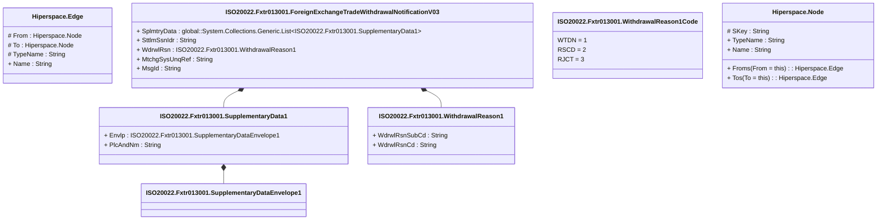

# fxtr.013.001.03

> The tables below contain descriptions of the members of each Element. 
> The first column indicates the type of the member:
> A ‘#’ indicates that the field is a key to the element, and a ‘+’ indicates that the field is a value.
> The ‘*’ column contains a description for the element member.  
> The ‘@’ column contains any properties for the member.
> The ‘=’ column contains calculated values; or in the case of an enum, the serialized value.

---

## View Hiperspace.Edge
edge between nodes

| |Name|Type|*|@|=|
|-|-|-|-|-|-|
|#|From|Hiperspace.Node||||
|#|To|Hiperspace.Node||||
|#|TypeName|String||||
|+|Name|String||||

---

## Type ISO20022.Fxtr013001.Document

| |Name|Type|*|@|=|
|-|-|-|-|-|-|
|+|FXTradWdrwlNtfctn|ISO20022.Fxtr013001.ForeignExchangeTradeWithdrawalNotificationV03||XmlElement()||
||Validation|Some(String)||XmlIgnore(), JsonIgnore()|validation(validElement(FXTradWdrwlNtfctn))|

---

## Aspect ISO20022.Fxtr013001.ForeignExchangeTradeWithdrawalNotificationV03

| |Name|Type|*|@|=|
|-|-|-|-|-|-|
|+|SplmtryData|global::System.Collections.Generic.List<ISO20022.Fxtr013001.SupplementaryData1>||XmlElement()||
|+|SttlmSsnIdr|String||XmlElement()||
|+|WdrwlRsn|ISO20022.Fxtr013001.WithdrawalReason1||XmlElement()||
|+|MtchgSysUnqRef|String||XmlElement()||
|+|MsgId|String||XmlElement()||
||Validation|Some(String)||XmlIgnore(), JsonIgnore()|validation(validList("""SplmtryData""",SplmtryData),validElement(SplmtryData),validPattern("""SttlmSsnIdr""",SttlmSsnIdr,"""[a-zA-Z0-9]{4}"""),validElement(WdrwlRsn))|

---

## Value ISO20022.Fxtr013001.SupplementaryData1

| |Name|Type|*|@|=|
|-|-|-|-|-|-|
|+|Envlp|ISO20022.Fxtr013001.SupplementaryDataEnvelope1||XmlElement()||
|+|PlcAndNm|String||XmlElement()||
||Validation|Some(String)||XmlIgnore(), JsonIgnore()|validation(validElement(Envlp))|

---

## Value ISO20022.Fxtr013001.SupplementaryDataEnvelope1

| |Name|Type|*|@|=|
|-|-|-|-|-|-|
||Validation|Some(String)||XmlIgnore(), JsonIgnore()|""|

---

## Value ISO20022.Fxtr013001.WithdrawalReason1

| |Name|Type|*|@|=|
|-|-|-|-|-|-|
|+|WdrwlRsnSubCd|String||XmlElement()||
|+|WdrwlRsnCd|String||XmlElement()||
||Validation|Some(String)||XmlIgnore(), JsonIgnore()|""|

---

## Enum ISO20022.Fxtr013001.WithdrawalReason1Code

| |Name|Type|*|@|=|
|-|-|-|-|-|-|
||WTDN|Int32||XmlEnum("""WTDN""")|1|
||RSCD|Int32||XmlEnum("""RSCD""")|2|
||RJCT|Int32||XmlEnum("""RJCT""")|3|

---

## View Hiperspace.Node
node in a graph view of data

| |Name|Type|*|@|=|
|-|-|-|-|-|-|
|#|SKey|String||||
|+|TypeName|String||||
|+|Name|String||||
||Froms|Hiperspace.Edge|||From = this|
||Tos|Hiperspace.Edge|||To = this|

