# fxtr.014.001.06-physical

```mermaid
classDiagram
    class ISO20022.Fxtr014001.Document {
        # Uri  : String
        + FXTradInstr () : ISO20022.Fxtr014001.ForeignExchangeTradeInstructionV06
        + Validation () = validation(validElement(FXTradInstr))
    }
    class ISO20022.Fxtr014001.ForeignExchangeTradeInstructionV06 {
        # owner  : ISO20022.Fxtr014001.Document
        + SplmtryData  : List~ISO20022.Fxtr014001.SupplementaryData1~
        + PstTradEvt  : ISO20022.Fxtr014001.PostTradeEvent1
        + RgltryRptg  : ISO20022.Fxtr014001.RegulatoryReporting8
        + OptnlGnlInf  : ISO20022.Fxtr014001.GeneralInformation9
        + CtrPtySdSttlmInstrs  : ISO20022.Fxtr014001.SettlementParties120
        + TradgSdSttlmInstrs  : ISO20022.Fxtr014001.SettlementParties120
        + NDFConds  : ISO20022.Fxtr014001.NonDeliverableForwardConditions1
        + AgrdRate  : ISO20022.Fxtr014001.AgreedRate3
        + TradAmts  : ISO20022.Fxtr014001.AmountsAndValueDate8
        + CtrPtySdId  : ISO20022.Fxtr014001.TradePartyIdentification8
        + TradgSdId  : ISO20022.Fxtr014001.TradePartyIdentification8
        + TradInf  : ISO20022.Fxtr014001.TradeAgreement14
        + Validation () = validation(validList("""SplmtryData""",SplmtryData),validElement(SplmtryData),validElement(PstTradEvt),validElement(RgltryRptg),validElement(OptnlGnlInf),validElement(CtrPtySdSttlmInstrs),validElement(TradgSdSttlmInstrs),validElement(NDFConds),validElement(AgrdRate),validElement(TradAmts),validElement(CtrPtySdId),validElement(TradgSdId),validElement(TradInf))
    }
```

> The tables below contain descriptions of the members of each Element. 
> The first column indicates the type of the member:
> A ‘#’ indicates that the field is a key to the element, and a ‘+’ indicates that the field is a value.
> The ‘*’ column contains a description for the element member.  
> The ‘@’ column contains any properties for the member.
> The ‘=’ column contains calculated values; or in the case of an enum, the serialized value.

---

## EntityImpl ISO20022.Fxtr014001.Document

| |Name|Type|*|@|=|
|-|-|-|-|-|-|
|#|Uri|String||XmlIgnore(), JsonIgnore()||
|+|FXTradInstr|ISO20022.Fxtr014001.ForeignExchangeTradeInstructionV06||XmlElement()||
||Validation|Some(String)||XmlIgnore(), JsonIgnore()|validation(validElement(FXTradInstr))|

---

## AspectImpl ISO20022.Fxtr014001.ForeignExchangeTradeInstructionV06

| |Name|Type|*|@|=|
|-|-|-|-|-|-|
|#|owner|ISO20022.Fxtr014001.Document||||
|+|SplmtryData|List<ISO20022.Fxtr014001.SupplementaryData1>||XmlElement()||
|+|PstTradEvt|ISO20022.Fxtr014001.PostTradeEvent1||XmlElement()||
|+|RgltryRptg|ISO20022.Fxtr014001.RegulatoryReporting8||XmlElement()||
|+|OptnlGnlInf|ISO20022.Fxtr014001.GeneralInformation9||XmlElement()||
|+|CtrPtySdSttlmInstrs|ISO20022.Fxtr014001.SettlementParties120||XmlElement()||
|+|TradgSdSttlmInstrs|ISO20022.Fxtr014001.SettlementParties120||XmlElement()||
|+|NDFConds|ISO20022.Fxtr014001.NonDeliverableForwardConditions1||XmlElement()||
|+|AgrdRate|ISO20022.Fxtr014001.AgreedRate3||XmlElement()||
|+|TradAmts|ISO20022.Fxtr014001.AmountsAndValueDate8||XmlElement()||
|+|CtrPtySdId|ISO20022.Fxtr014001.TradePartyIdentification8||XmlElement()||
|+|TradgSdId|ISO20022.Fxtr014001.TradePartyIdentification8||XmlElement()||
|+|TradInf|ISO20022.Fxtr014001.TradeAgreement14||XmlElement()||
||Validation|Some(String)||XmlIgnore(), JsonIgnore()|validation(validList("""SplmtryData""",SplmtryData),validElement(SplmtryData),validElement(PstTradEvt),validElement(RgltryRptg),validElement(OptnlGnlInf),validElement(CtrPtySdSttlmInstrs),validElement(TradgSdSttlmInstrs),validElement(NDFConds),validElement(AgrdRate),validElement(TradAmts),validElement(CtrPtySdId),validElement(TradgSdId),validElement(TradInf))|

