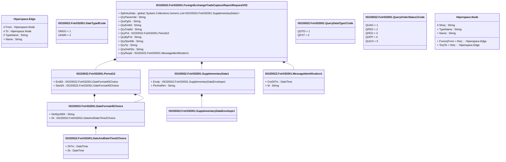

# fxtr.032.001.02

> The tables below contain descriptions of the members of each Element. 
> The first column indicates the type of the member:
> A ‘#’ indicates that the field is a key to the element, and a ‘+’ indicates that the field is a value.
> The ‘*’ column contains a description for the element member.  
> The ‘@’ column contains any properties for the member.
> The ‘=’ column contains calculated values; or in the case of an enum, the serialized value.

---

## View Hiperspace.Edge
edge between nodes

| |Name|Type|*|@|=|
|-|-|-|-|-|-|
|#|From|Hiperspace.Node||||
|#|To|Hiperspace.Node||||
|#|TypeName|String||||
|+|Name|String||||

---

## Value ISO20022.Fxtr032001.DateAndDateTime2Choice

| |Name|Type|*|@|=|
|-|-|-|-|-|-|
|+|DtTm|DateTime||XmlElement()||
|+|Dt|DateTime||XmlElement()||
||Validation|Some(String)||XmlIgnore(), JsonIgnore()|validation(validChoice(DtTm,Dt))|

---

## Value ISO20022.Fxtr032001.DateFormat45Choice

| |Name|Type|*|@|=|
|-|-|-|-|-|-|
|+|NotSpcfdDt|String||XmlElement()||
|+|Dt|ISO20022.Fxtr032001.DateAndDateTime2Choice||XmlElement()||
||Validation|Some(String)||XmlIgnore(), JsonIgnore()|validation(validElement(Dt),validChoice(NotSpcfdDt,Dt))|

---

## Enum ISO20022.Fxtr032001.DateType8Code

| |Name|Type|*|@|=|
|-|-|-|-|-|-|
||ONGO|Int32||XmlEnum("""ONGO""")|1|
||UKWN|Int32||XmlEnum("""UKWN""")|2|

---

## Type ISO20022.Fxtr032001.Document

| |Name|Type|*|@|=|
|-|-|-|-|-|-|
|+|FXTradCaptrRptReq|ISO20022.Fxtr032001.ForeignExchangeTradeCaptureReportRequestV02||XmlElement()||
||Validation|Some(String)||XmlIgnore(), JsonIgnore()|validation(validElement(FXTradCaptrRptReq))|

---

## Aspect ISO20022.Fxtr032001.ForeignExchangeTradeCaptureReportRequestV02

| |Name|Type|*|@|=|
|-|-|-|-|-|-|
|+|SplmtryData|global::System.Collections.Generic.List<ISO20022.Fxtr032001.SupplementaryData1>||XmlElement()||
|+|QryParamVal|String||XmlElement()||
|+|QryPgSz|String||XmlElement()||
|+|QryEndId|String||XmlElement()||
|+|QryTradId|String||XmlElement()||
|+|QryPrd|ISO20022.Fxtr032001.Period12||XmlElement()||
|+|QryByPrd|String||XmlElement()||
|+|QryStartNb|String||XmlElement()||
|+|QryTp|String||XmlElement()||
|+|QryOrdrSts|String||XmlElement()||
|+|QryReqId|ISO20022.Fxtr032001.MessageIdentification1||XmlElement()||
||Validation|Some(String)||XmlIgnore(), JsonIgnore()|validation(validList("""SplmtryData""",SplmtryData),validElement(SplmtryData),validPattern("""QryPgSz""",QryPgSz,"""[0-9]{1,35}"""),validElement(QryPrd),validPattern("""QryStartNb""",QryStartNb,"""[0-9]{1,35}"""),validElement(QryReqId))|

---

## Value ISO20022.Fxtr032001.MessageIdentification1

| |Name|Type|*|@|=|
|-|-|-|-|-|-|
|+|CreDtTm|DateTime||XmlElement()||
|+|Id|String||XmlElement()||
||Validation|Some(String)||XmlIgnore(), JsonIgnore()|""|

---

## Value ISO20022.Fxtr032001.Period12

| |Name|Type|*|@|=|
|-|-|-|-|-|-|
|+|EndDt|ISO20022.Fxtr032001.DateFormat45Choice||XmlElement()||
|+|StartDt|ISO20022.Fxtr032001.DateFormat45Choice||XmlElement()||
||Validation|Some(String)||XmlIgnore(), JsonIgnore()|validation(validElement(EndDt),validElement(StartDt))|

---

## Enum ISO20022.Fxtr032001.QueryDataType1Code

| |Name|Type|*|@|=|
|-|-|-|-|-|-|
||QOTD|Int32||XmlEnum("""QOTD""")|1|
||QFXT|Int32||XmlEnum("""QFXT""")|2|

---

## Enum ISO20022.Fxtr032001.QueryOrderStatus1Code

| |Name|Type|*|@|=|
|-|-|-|-|-|-|
||QUAO|Int32||XmlEnum("""QUAO""")|1|
||QPEO|Int32||XmlEnum("""QPEO""")|2|
||QFEO|Int32||XmlEnum("""QFEO""")|3|
||QOFP|Int32||XmlEnum("""QOFP""")|4|
||QUCO|Int32||XmlEnum("""QUCO""")|5|

---

## Value ISO20022.Fxtr032001.SupplementaryData1

| |Name|Type|*|@|=|
|-|-|-|-|-|-|
|+|Envlp|ISO20022.Fxtr032001.SupplementaryDataEnvelope1||XmlElement()||
|+|PlcAndNm|String||XmlElement()||
||Validation|Some(String)||XmlIgnore(), JsonIgnore()|validation(validElement(Envlp))|

---

## Value ISO20022.Fxtr032001.SupplementaryDataEnvelope1

| |Name|Type|*|@|=|
|-|-|-|-|-|-|
||Validation|Some(String)||XmlIgnore(), JsonIgnore()|""|

---

## View Hiperspace.Node
node in a graph view of data

| |Name|Type|*|@|=|
|-|-|-|-|-|-|
|#|SKey|String||||
|+|TypeName|String||||
|+|Name|String||||
||Froms|Hiperspace.Edge|||From = this|
||Tos|Hiperspace.Edge|||To = this|

