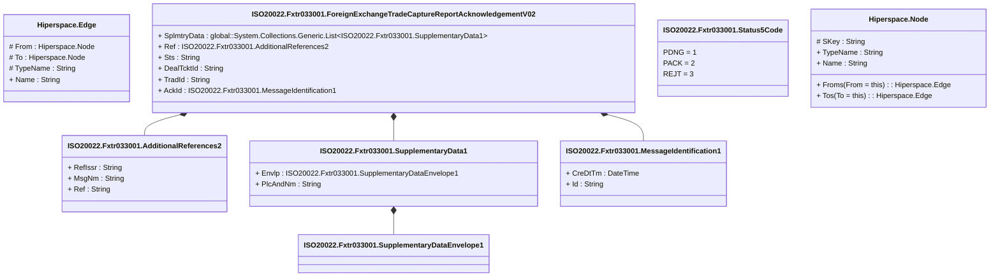

# fxtr.033.001.02

> The tables below contain descriptions of the members of each Element. 
> The first column indicates the type of the member:
> A ‘#’ indicates that the field is a key to the element, and a ‘+’ indicates that the field is a value.
> The ‘*’ column contains a description for the element member.  
> The ‘@’ column contains any properties for the member.
> The ‘=’ column contains calculated values; or in the case of an enum, the serialized value.

---

## View Hiperspace.Edge
edge between nodes

| |Name|Type|*|@|=|
|-|-|-|-|-|-|
|#|From|Hiperspace.Node||||
|#|To|Hiperspace.Node||||
|#|TypeName|String||||
|+|Name|String||||

---

## Value ISO20022.Fxtr033001.AdditionalReferences2

| |Name|Type|*|@|=|
|-|-|-|-|-|-|
|+|RefIssr|String||XmlElement()||
|+|MsgNm|String||XmlElement()||
|+|Ref|String||XmlElement()||
||Validation|Some(String)||XmlIgnore(), JsonIgnore()|""|

---

## Type ISO20022.Fxtr033001.Document

| |Name|Type|*|@|=|
|-|-|-|-|-|-|
|+|FXTradCaptrRptAck|ISO20022.Fxtr033001.ForeignExchangeTradeCaptureReportAcknowledgementV02||XmlElement()||
||Validation|Some(String)||XmlIgnore(), JsonIgnore()|validation(validElement(FXTradCaptrRptAck))|

---

## Aspect ISO20022.Fxtr033001.ForeignExchangeTradeCaptureReportAcknowledgementV02

| |Name|Type|*|@|=|
|-|-|-|-|-|-|
|+|SplmtryData|global::System.Collections.Generic.List<ISO20022.Fxtr033001.SupplementaryData1>||XmlElement()||
|+|Ref|ISO20022.Fxtr033001.AdditionalReferences2||XmlElement()||
|+|Sts|String||XmlElement()||
|+|DealTcktId|String||XmlElement()||
|+|TradId|String||XmlElement()||
|+|AckId|ISO20022.Fxtr033001.MessageIdentification1||XmlElement()||
||Validation|Some(String)||XmlIgnore(), JsonIgnore()|validation(validList("""SplmtryData""",SplmtryData),validElement(SplmtryData),validElement(Ref),validElement(AckId))|

---

## Value ISO20022.Fxtr033001.MessageIdentification1

| |Name|Type|*|@|=|
|-|-|-|-|-|-|
|+|CreDtTm|DateTime||XmlElement()||
|+|Id|String||XmlElement()||
||Validation|Some(String)||XmlIgnore(), JsonIgnore()|""|

---

## Enum ISO20022.Fxtr033001.Status5Code

| |Name|Type|*|@|=|
|-|-|-|-|-|-|
||PDNG|Int32||XmlEnum("""PDNG""")|1|
||PACK|Int32||XmlEnum("""PACK""")|2|
||REJT|Int32||XmlEnum("""REJT""")|3|

---

## Value ISO20022.Fxtr033001.SupplementaryData1

| |Name|Type|*|@|=|
|-|-|-|-|-|-|
|+|Envlp|ISO20022.Fxtr033001.SupplementaryDataEnvelope1||XmlElement()||
|+|PlcAndNm|String||XmlElement()||
||Validation|Some(String)||XmlIgnore(), JsonIgnore()|validation(validElement(Envlp))|

---

## Value ISO20022.Fxtr033001.SupplementaryDataEnvelope1

| |Name|Type|*|@|=|
|-|-|-|-|-|-|
||Validation|Some(String)||XmlIgnore(), JsonIgnore()|""|

---

## View Hiperspace.Node
node in a graph view of data

| |Name|Type|*|@|=|
|-|-|-|-|-|-|
|#|SKey|String||||
|+|TypeName|String||||
|+|Name|String||||
||Froms|Hiperspace.Edge|||From = this|
||Tos|Hiperspace.Edge|||To = this|

