# fxtr.034.001.02

```mermaid
classDiagram
    class Hiperspace.Edge {
        # From  : Hiperspace.Node
        # To  : Hiperspace.Node
        # TypeName  : String
        + Name  : String
    }
    class ISO20022.Fxtr034001.ActiveCurrencyAnd13DecimalAmount {
        + Value  : Decimal
        + Ccy  : String
    }
    class ISO20022.Fxtr034001.ActiveCurrencyAndAmount {
        + Value  : Decimal
        + Ccy  : String
    }
    class ISO20022.Fxtr034001.AgreedRate3 {
        + QtdCcy  : String
        + UnitCcy  : String
        + XchgRate  : Decimal
    }
    class ISO20022.Fxtr034001.AlternateIdentification1 {
        + IdSrc  : ISO20022.Fxtr034001.IdentificationSource1Choice
        + Id  : String
    }
    ISO20022.Fxtr034001.AlternateIdentification1 *-- ISO20022.Fxtr034001.IdentificationSource1Choice
    class ISO20022.Fxtr034001.ClearingMethod1Code {
        NENE = 1
        NEMA = 2
        GRNE = 3
    }
    class ISO20022.Fxtr034001.ConfirmationRequest1Code {
        STAT = 1
        CNRR = 2
        CONF = 3
    }
    class ISO20022.Fxtr034001.DateAndDateTime2Choice {
        + DtTm  : DateTime
        + Dt  : DateTime
    }
    class ISO20022.Fxtr034001.DateFormat45Choice {
        + NotSpcfdDt  : String
        + Dt  : ISO20022.Fxtr034001.DateAndDateTime2Choice
    }
    ISO20022.Fxtr034001.DateFormat45Choice *-- ISO20022.Fxtr034001.DateAndDateTime2Choice
    class ISO20022.Fxtr034001.DateType8Code {
        ONGO = 1
        UKWN = 2
    }
    class ISO20022.Fxtr034001.ForeignExchangeTradeConfirmationRequestV02 {
        + SplmtryData  : global::System.Collections.Generic.List~ISO20022.Fxtr034001.SupplementaryData1~
        + QryTradSts  : String
        + QryStartNb  : String
        + QryPrd  : ISO20022.Fxtr034001.Period12
        + ConfTp  : String
        + TradDtl  : ISO20022.Fxtr034001.Trade9
        + ReqId  : ISO20022.Fxtr034001.MessageIdentification1
        + Hdr  : ISO20022.Fxtr034001.Header23
    }
    ISO20022.Fxtr034001.ForeignExchangeTradeConfirmationRequestV02 *-- ISO20022.Fxtr034001.SupplementaryData1
    ISO20022.Fxtr034001.ForeignExchangeTradeConfirmationRequestV02 *-- ISO20022.Fxtr034001.Period12
    ISO20022.Fxtr034001.ForeignExchangeTradeConfirmationRequestV02 *-- ISO20022.Fxtr034001.Trade9
    ISO20022.Fxtr034001.ForeignExchangeTradeConfirmationRequestV02 *-- ISO20022.Fxtr034001.MessageIdentification1
    ISO20022.Fxtr034001.ForeignExchangeTradeConfirmationRequestV02 *-- ISO20022.Fxtr034001.Header23
    class ISO20022.Fxtr034001.GenericIdentification32 {
        + ShrtNm  : String
        + Issr  : String
        + Tp  : String
        + Id  : String
    }
    class ISO20022.Fxtr034001.Header23 {
        + CreDtTm  : DateTime
        + MsgSeqNb  : Decimal
        + RcptPty  : ISO20022.Fxtr034001.GenericIdentification32
        + InitgPty  : ISO20022.Fxtr034001.GenericIdentification32
        + XchgId  : String
        + FrmtVrsn  : String
    }
    ISO20022.Fxtr034001.Header23 *-- ISO20022.Fxtr034001.GenericIdentification32
    ISO20022.Fxtr034001.Header23 *-- ISO20022.Fxtr034001.GenericIdentification32
    class ISO20022.Fxtr034001.IdentificationSource1Choice {
        + Prtry  : String
        + Dmst  : String
    }
    class ISO20022.Fxtr034001.IdentificationType2Code {
        USDE = 1
        RICC = 2
        CFET = 3
        CDCO = 4
    }
    class ISO20022.Fxtr034001.InstrumentLeg7 {
        + LegSctyId  : ISO20022.Fxtr034001.SecurityIdentification18
        + LegSymb  : String
        + LegCcy  : String
        + LegValDt  : DateTime
        + LegValtnRate  : ISO20022.Fxtr034001.AgreedRate3
        + LegRskAmt  : ISO20022.Fxtr034001.ActiveCurrencyAndAmount
        + LegClctdCtrPtyCcyLastQty  : ISO20022.Fxtr034001.ActiveCurrencyAndAmount
        + LegFwdPts  : Decimal
        + LegOrdrQty  : ISO20022.Fxtr034001.ActiveCurrencyAndAmount
        + LegSttlmCcy  : String
        + LegLastPric  : ISO20022.Fxtr034001.ActiveCurrencyAnd13DecimalAmount
        + LegSttlmDt  : DateTime
        + LegSttlmTp  : String
        + LegSd  : String
    }
    ISO20022.Fxtr034001.InstrumentLeg7 *-- ISO20022.Fxtr034001.SecurityIdentification18
    ISO20022.Fxtr034001.InstrumentLeg7 *-- ISO20022.Fxtr034001.AgreedRate3
    ISO20022.Fxtr034001.InstrumentLeg7 *-- ISO20022.Fxtr034001.ActiveCurrencyAndAmount
    ISO20022.Fxtr034001.InstrumentLeg7 *-- ISO20022.Fxtr034001.ActiveCurrencyAndAmount
    ISO20022.Fxtr034001.InstrumentLeg7 *-- ISO20022.Fxtr034001.ActiveCurrencyAndAmount
    ISO20022.Fxtr034001.InstrumentLeg7 *-- ISO20022.Fxtr034001.ActiveCurrencyAnd13DecimalAmount
    class ISO20022.Fxtr034001.MessageIdentification1 {
        + CreDtTm  : DateTime
        + Id  : String
    }
    class ISO20022.Fxtr034001.PartyType3Code {
        DLIS = 1
        CISS = 2
        ACQR = 3
        ITAG = 4
        ACCP = 5
        MERC = 6
        OPOI = 7
    }
    class ISO20022.Fxtr034001.PartyType4Code {
        TAXH = 1
        CISS = 2
        ACQR = 3
        ITAG = 4
        ACCP = 5
        MERC = 6
    }
    class ISO20022.Fxtr034001.Period12 {
        + EndDt  : ISO20022.Fxtr034001.DateFormat45Choice
        + StartDt  : ISO20022.Fxtr034001.DateFormat45Choice
    }
    ISO20022.Fxtr034001.Period12 *-- ISO20022.Fxtr034001.DateFormat45Choice
    ISO20022.Fxtr034001.Period12 *-- ISO20022.Fxtr034001.DateFormat45Choice
    class ISO20022.Fxtr034001.QueryTradeStatus1Code {
        QRTR = 1
        QNTR = 2
        QETR = 3
        QCIR = 4
        QCTR = 5
        QAST = 6
    }
    class ISO20022.Fxtr034001.SecurityIdentification18 {
        + SctyId  : String
        + SctyIdSrc  : String
    }
    class ISO20022.Fxtr034001.SecurityIdentification38Choice {
        + Cmon  : String
        + CTA  : String
        + Blmbrg  : String
        + TckrSymb  : String
        + RIC  : String
        + AltrnId  : ISO20022.Fxtr034001.AlternateIdentification1
        + ISIN  : String
    }
    ISO20022.Fxtr034001.SecurityIdentification38Choice *-- ISO20022.Fxtr034001.AlternateIdentification1
    class ISO20022.Fxtr034001.SettlementDate8Code {
        WHID = 1
        WISS = 2
        WDIS = 3
        WHIF = 4
        TTWO = 5
        TTRE = 6
        TONE = 7
        TFOR = 8
        TFIV = 9
        TBAT = 10
        SELL = 11
        SAVE = 12
        REGU = 13
        PRVD = 14
        FUTU = 15
        MONT = 16
        CLEA = 17
        CASH = 18
        ENDC = 19
        ASAP = 20
    }
    class ISO20022.Fxtr034001.Side1Code {
        UNDI = 1
        OPPO = 2
        DEFI = 3
        CSHE = 4
        CRSH = 5
        CROS = 6
        SSEX = 7
        SESH = 8
        SEPL = 9
        BUMI = 10
        TWOS = 11
        SELL = 12
        BUYI = 13
    }
    class ISO20022.Fxtr034001.SupplementaryData1 {
        + Envlp  : ISO20022.Fxtr034001.SupplementaryDataEnvelope1
        + PlcAndNm  : String
    }
    ISO20022.Fxtr034001.SupplementaryData1 *-- ISO20022.Fxtr034001.SupplementaryDataEnvelope1
    class ISO20022.Fxtr034001.SupplementaryDataEnvelope1 {
    }
    class ISO20022.Fxtr034001.Trade10 {
        + AssoctdTradRef  : global::System.Collections.Generic.List~String~
        + DltaInd  : String
        + OptnInd  : String
        + FxgDt  : DateTime
        + FxgCcy  : String
        + SctyId  : ISO20022.Fxtr034001.SecurityIdentification18
        + RskAmt  : ISO20022.Fxtr034001.ActiveCurrencyAndAmount
        + ValDt  : DateTime
        + ClctdCtrPtyCcyLastQty  : ISO20022.Fxtr034001.ActiveCurrencyAndAmount
        + FwdPts  : Decimal
        + ValtnRate  : ISO20022.Fxtr034001.AgreedRate3
        + SttlmDt  : DateTime
        + SttlmTp  : String
        + LastQty  : ISO20022.Fxtr034001.ActiveCurrencyAndAmount
        + ExctnPric  : ISO20022.Fxtr034001.ActiveCurrencyAnd13DecimalAmount
    }
    ISO20022.Fxtr034001.Trade10 *-- ISO20022.Fxtr034001.SecurityIdentification18
    ISO20022.Fxtr034001.Trade10 *-- ISO20022.Fxtr034001.ActiveCurrencyAndAmount
    ISO20022.Fxtr034001.Trade10 *-- ISO20022.Fxtr034001.ActiveCurrencyAndAmount
    ISO20022.Fxtr034001.Trade10 *-- ISO20022.Fxtr034001.AgreedRate3
    ISO20022.Fxtr034001.Trade10 *-- ISO20022.Fxtr034001.ActiveCurrencyAndAmount
    ISO20022.Fxtr034001.Trade10 *-- ISO20022.Fxtr034001.ActiveCurrencyAnd13DecimalAmount
    class ISO20022.Fxtr034001.Trade9 {
        + AssoctdTradRef  : global::System.Collections.Generic.List~String~
        + PdctId  : ISO20022.Fxtr034001.SecurityIdentification38Choice
        + SwpLeg  : global::System.Collections.Generic.List~ISO20022.Fxtr034001.InstrumentLeg7~
        + FXDtls  : ISO20022.Fxtr034001.Trade10
        + PlcOfConf  : String
        + Symb  : String
        + ClrMtd  : String
        + TradgMd  : String
        + TradgMtd  : String
        + SttlmCcy  : String
        + TradgCcy  : String
        + FXTradPdct  : String
        + TradDt  : DateTime
        + TradId  : String
    }
    ISO20022.Fxtr034001.Trade9 *-- ISO20022.Fxtr034001.SecurityIdentification38Choice
    ISO20022.Fxtr034001.Trade9 *-- ISO20022.Fxtr034001.InstrumentLeg7
    ISO20022.Fxtr034001.Trade9 *-- ISO20022.Fxtr034001.Trade10
    class ISO20022.Fxtr034001.TradingMethodType1Code {
        ANCL = 1
        TEAU = 2
        QUAU = 3
        ONCT = 4
        NETR = 5
        LIOR = 6
        CUMA = 7
        CERB = 8
        BITR = 9
    }
    class ISO20022.Fxtr034001.TradingModeType1Code {
        ANON = 1
        BILA = 2
        MARC = 3
        AUCT = 4
        NETR = 5
        ORDR = 6
        QUDR = 7
    }
    class ISO20022.Fxtr034001.UnderlyingProductIdentifier1Code {
        SWAP = 1
        SPOT = 2
        NDFO = 3
        FORW = 4
    }
    class Hiperspace.Node {
        # SKey  : String
        + TypeName  : String
        + Name  : String
        + Froms (From = this) : Hiperspace.Edge
        + Tos (To = this) : Hiperspace.Edge
    }
```

> The tables below contain descriptions of the members of each Element. 
> The first column indicates the type of the member:
> A ‘#’ indicates that the field is a key to the element, and a ‘+’ indicates that the field is a value.
> The ‘*’ column contains a description for the element member.  
> The ‘@’ column contains any properties for the member.
> The ‘=’ column contains calculated values; or in the case of an enum, the serialized value.

---

## View Hiperspace.Edge
edge between nodes

| |Name|Type|*|@|=|
|-|-|-|-|-|-|
|#|From|Hiperspace.Node||||
|#|To|Hiperspace.Node||||
|#|TypeName|String||||
|+|Name|String||||

---

## Value ISO20022.Fxtr034001.ActiveCurrencyAnd13DecimalAmount

| |Name|Type|*|@|=|
|-|-|-|-|-|-|
|+|Value|Decimal||XmlElement()||
|+|Ccy|String||XmlAttribute()||
||Validation|Some(String)||XmlIgnore(), JsonIgnore()|validation(validRequired("""Value""",Value),validRequired("""Ccy""",Ccy),validPattern("""Ccy""",Ccy,"""[A-Z]{3,3}"""))|

---

## Value ISO20022.Fxtr034001.ActiveCurrencyAndAmount

| |Name|Type|*|@|=|
|-|-|-|-|-|-|
|+|Value|Decimal||XmlElement()||
|+|Ccy|String||XmlAttribute()||
||Validation|Some(String)||XmlIgnore(), JsonIgnore()|validation(validRequired("""Value""",Value),validRequired("""Ccy""",Ccy),validPattern("""Ccy""",Ccy,"""[A-Z]{3,3}"""))|

---

## Value ISO20022.Fxtr034001.AgreedRate3

| |Name|Type|*|@|=|
|-|-|-|-|-|-|
|+|QtdCcy|String||XmlElement()||
|+|UnitCcy|String||XmlElement()||
|+|XchgRate|Decimal||XmlElement()||
||Validation|Some(String)||XmlIgnore(), JsonIgnore()|validation(validPattern("""QtdCcy""",QtdCcy,"""[A-Z]{3,3}"""),validPattern("""UnitCcy""",UnitCcy,"""[A-Z]{3,3}"""))|

---

## Value ISO20022.Fxtr034001.AlternateIdentification1

| |Name|Type|*|@|=|
|-|-|-|-|-|-|
|+|IdSrc|ISO20022.Fxtr034001.IdentificationSource1Choice||XmlElement()||
|+|Id|String||XmlElement()||
||Validation|Some(String)||XmlIgnore(), JsonIgnore()|validation(validElement(IdSrc))|

---

## Enum ISO20022.Fxtr034001.ClearingMethod1Code

| |Name|Type|*|@|=|
|-|-|-|-|-|-|
||NENE|Int32||XmlEnum("""NENE""")|1|
||NEMA|Int32||XmlEnum("""NEMA""")|2|
||GRNE|Int32||XmlEnum("""GRNE""")|3|

---

## Enum ISO20022.Fxtr034001.ConfirmationRequest1Code

| |Name|Type|*|@|=|
|-|-|-|-|-|-|
||STAT|Int32||XmlEnum("""STAT""")|1|
||CNRR|Int32||XmlEnum("""CNRR""")|2|
||CONF|Int32||XmlEnum("""CONF""")|3|

---

## Value ISO20022.Fxtr034001.DateAndDateTime2Choice

| |Name|Type|*|@|=|
|-|-|-|-|-|-|
|+|DtTm|DateTime||XmlElement()||
|+|Dt|DateTime||XmlElement()||
||Validation|Some(String)||XmlIgnore(), JsonIgnore()|validation(validChoice(DtTm,Dt))|

---

## Value ISO20022.Fxtr034001.DateFormat45Choice

| |Name|Type|*|@|=|
|-|-|-|-|-|-|
|+|NotSpcfdDt|String||XmlElement()||
|+|Dt|ISO20022.Fxtr034001.DateAndDateTime2Choice||XmlElement()||
||Validation|Some(String)||XmlIgnore(), JsonIgnore()|validation(validElement(Dt),validChoice(NotSpcfdDt,Dt))|

---

## Enum ISO20022.Fxtr034001.DateType8Code

| |Name|Type|*|@|=|
|-|-|-|-|-|-|
||ONGO|Int32||XmlEnum("""ONGO""")|1|
||UKWN|Int32||XmlEnum("""UKWN""")|2|

---

## Type ISO20022.Fxtr034001.Document

| |Name|Type|*|@|=|
|-|-|-|-|-|-|
|+|FXTradConfReq|ISO20022.Fxtr034001.ForeignExchangeTradeConfirmationRequestV02||XmlElement()||
||Validation|Some(String)||XmlIgnore(), JsonIgnore()|validation(validElement(FXTradConfReq))|

---

## Aspect ISO20022.Fxtr034001.ForeignExchangeTradeConfirmationRequestV02

| |Name|Type|*|@|=|
|-|-|-|-|-|-|
|+|SplmtryData|global::System.Collections.Generic.List<ISO20022.Fxtr034001.SupplementaryData1>||XmlElement()||
|+|QryTradSts|String||XmlElement()||
|+|QryStartNb|String||XmlElement()||
|+|QryPrd|ISO20022.Fxtr034001.Period12||XmlElement()||
|+|ConfTp|String||XmlElement()||
|+|TradDtl|ISO20022.Fxtr034001.Trade9||XmlElement()||
|+|ReqId|ISO20022.Fxtr034001.MessageIdentification1||XmlElement()||
|+|Hdr|ISO20022.Fxtr034001.Header23||XmlElement()||
||Validation|Some(String)||XmlIgnore(), JsonIgnore()|validation(validList("""SplmtryData""",SplmtryData),validElement(SplmtryData),validPattern("""QryStartNb""",QryStartNb,"""[0-9]{1,35}"""),validElement(QryPrd),validElement(TradDtl),validElement(ReqId),validElement(Hdr))|

---

## Value ISO20022.Fxtr034001.GenericIdentification32

| |Name|Type|*|@|=|
|-|-|-|-|-|-|
|+|ShrtNm|String||XmlElement()||
|+|Issr|String||XmlElement()||
|+|Tp|String||XmlElement()||
|+|Id|String||XmlElement()||
||Validation|Some(String)||XmlIgnore(), JsonIgnore()|""|

---

## Value ISO20022.Fxtr034001.Header23

| |Name|Type|*|@|=|
|-|-|-|-|-|-|
|+|CreDtTm|DateTime||XmlElement()||
|+|MsgSeqNb|Decimal||XmlElement()||
|+|RcptPty|ISO20022.Fxtr034001.GenericIdentification32||XmlElement()||
|+|InitgPty|ISO20022.Fxtr034001.GenericIdentification32||XmlElement()||
|+|XchgId|String||XmlElement()||
|+|FrmtVrsn|String||XmlElement()||
||Validation|Some(String)||XmlIgnore(), JsonIgnore()|validation(validElement(RcptPty),validElement(InitgPty),validPattern("""XchgId""",XchgId,"""[0-9]{1,3}"""))|

---

## Value ISO20022.Fxtr034001.IdentificationSource1Choice

| |Name|Type|*|@|=|
|-|-|-|-|-|-|
|+|Prtry|String||XmlElement()||
|+|Dmst|String||XmlElement()||
||Validation|Some(String)||XmlIgnore(), JsonIgnore()|validation(validPattern("""Dmst""",Dmst,"""[A-Z]{2,2}"""),validChoice(Prtry,Dmst))|

---

## Enum ISO20022.Fxtr034001.IdentificationType2Code

| |Name|Type|*|@|=|
|-|-|-|-|-|-|
||USDE|Int32||XmlEnum("""USDE""")|1|
||RICC|Int32||XmlEnum("""RICC""")|2|
||CFET|Int32||XmlEnum("""CFET""")|3|
||CDCO|Int32||XmlEnum("""CDCO""")|4|

---

## Value ISO20022.Fxtr034001.InstrumentLeg7

| |Name|Type|*|@|=|
|-|-|-|-|-|-|
|+|LegSctyId|ISO20022.Fxtr034001.SecurityIdentification18||XmlElement()||
|+|LegSymb|String||XmlElement()||
|+|LegCcy|String||XmlElement()||
|+|LegValDt|DateTime||XmlElement()||
|+|LegValtnRate|ISO20022.Fxtr034001.AgreedRate3||XmlElement()||
|+|LegRskAmt|ISO20022.Fxtr034001.ActiveCurrencyAndAmount||XmlElement()||
|+|LegClctdCtrPtyCcyLastQty|ISO20022.Fxtr034001.ActiveCurrencyAndAmount||XmlElement()||
|+|LegFwdPts|Decimal||XmlElement()||
|+|LegOrdrQty|ISO20022.Fxtr034001.ActiveCurrencyAndAmount||XmlElement()||
|+|LegSttlmCcy|String||XmlElement()||
|+|LegLastPric|ISO20022.Fxtr034001.ActiveCurrencyAnd13DecimalAmount||XmlElement()||
|+|LegSttlmDt|DateTime||XmlElement()||
|+|LegSttlmTp|String||XmlElement()||
|+|LegSd|String||XmlElement()||
||Validation|Some(String)||XmlIgnore(), JsonIgnore()|validation(validElement(LegSctyId),validPattern("""LegCcy""",LegCcy,"""[A-Z]{3,3}"""),validElement(LegValtnRate),validElement(LegRskAmt),validElement(LegClctdCtrPtyCcyLastQty),validElement(LegOrdrQty),validPattern("""LegSttlmCcy""",LegSttlmCcy,"""[A-Z]{3,3}"""),validElement(LegLastPric))|

---

## Value ISO20022.Fxtr034001.MessageIdentification1

| |Name|Type|*|@|=|
|-|-|-|-|-|-|
|+|CreDtTm|DateTime||XmlElement()||
|+|Id|String||XmlElement()||
||Validation|Some(String)||XmlIgnore(), JsonIgnore()|""|

---

## Enum ISO20022.Fxtr034001.PartyType3Code

| |Name|Type|*|@|=|
|-|-|-|-|-|-|
||DLIS|Int32||XmlEnum("""DLIS""")|1|
||CISS|Int32||XmlEnum("""CISS""")|2|
||ACQR|Int32||XmlEnum("""ACQR""")|3|
||ITAG|Int32||XmlEnum("""ITAG""")|4|
||ACCP|Int32||XmlEnum("""ACCP""")|5|
||MERC|Int32||XmlEnum("""MERC""")|6|
||OPOI|Int32||XmlEnum("""OPOI""")|7|

---

## Enum ISO20022.Fxtr034001.PartyType4Code

| |Name|Type|*|@|=|
|-|-|-|-|-|-|
||TAXH|Int32||XmlEnum("""TAXH""")|1|
||CISS|Int32||XmlEnum("""CISS""")|2|
||ACQR|Int32||XmlEnum("""ACQR""")|3|
||ITAG|Int32||XmlEnum("""ITAG""")|4|
||ACCP|Int32||XmlEnum("""ACCP""")|5|
||MERC|Int32||XmlEnum("""MERC""")|6|

---

## Value ISO20022.Fxtr034001.Period12

| |Name|Type|*|@|=|
|-|-|-|-|-|-|
|+|EndDt|ISO20022.Fxtr034001.DateFormat45Choice||XmlElement()||
|+|StartDt|ISO20022.Fxtr034001.DateFormat45Choice||XmlElement()||
||Validation|Some(String)||XmlIgnore(), JsonIgnore()|validation(validElement(EndDt),validElement(StartDt))|

---

## Enum ISO20022.Fxtr034001.QueryTradeStatus1Code

| |Name|Type|*|@|=|
|-|-|-|-|-|-|
||QRTR|Int32||XmlEnum("""QRTR""")|1|
||QNTR|Int32||XmlEnum("""QNTR""")|2|
||QETR|Int32||XmlEnum("""QETR""")|3|
||QCIR|Int32||XmlEnum("""QCIR""")|4|
||QCTR|Int32||XmlEnum("""QCTR""")|5|
||QAST|Int32||XmlEnum("""QAST""")|6|

---

## Value ISO20022.Fxtr034001.SecurityIdentification18

| |Name|Type|*|@|=|
|-|-|-|-|-|-|
|+|SctyId|String||XmlElement()||
|+|SctyIdSrc|String||XmlElement()||
||Validation|Some(String)||XmlIgnore(), JsonIgnore()|""|

---

## Value ISO20022.Fxtr034001.SecurityIdentification38Choice

| |Name|Type|*|@|=|
|-|-|-|-|-|-|
|+|Cmon|String||XmlElement()||
|+|CTA|String||XmlElement()||
|+|Blmbrg|String||XmlElement()||
|+|TckrSymb|String||XmlElement()||
|+|RIC|String||XmlElement()||
|+|AltrnId|ISO20022.Fxtr034001.AlternateIdentification1||XmlElement()||
|+|ISIN|String||XmlElement()||
||Validation|Some(String)||XmlIgnore(), JsonIgnore()|validation(validPattern("""Blmbrg""",Blmbrg,"""(BBG)[BCDFGHJKLMNPQRSTVWXYZ\d]{8}\d"""),validElement(AltrnId),validPattern("""ISIN""",ISIN,"""[A-Z]{2,2}[A-Z0-9]{9,9}[0-9]{1,1}"""),validChoice(Cmon,CTA,Blmbrg,TckrSymb,RIC,AltrnId,ISIN))|

---

## Enum ISO20022.Fxtr034001.SettlementDate8Code

| |Name|Type|*|@|=|
|-|-|-|-|-|-|
||WHID|Int32||XmlEnum("""WHID""")|1|
||WISS|Int32||XmlEnum("""WISS""")|2|
||WDIS|Int32||XmlEnum("""WDIS""")|3|
||WHIF|Int32||XmlEnum("""WHIF""")|4|
||TTWO|Int32||XmlEnum("""TTWO""")|5|
||TTRE|Int32||XmlEnum("""TTRE""")|6|
||TONE|Int32||XmlEnum("""TONE""")|7|
||TFOR|Int32||XmlEnum("""TFOR""")|8|
||TFIV|Int32||XmlEnum("""TFIV""")|9|
||TBAT|Int32||XmlEnum("""TBAT""")|10|
||SELL|Int32||XmlEnum("""SELL""")|11|
||SAVE|Int32||XmlEnum("""SAVE""")|12|
||REGU|Int32||XmlEnum("""REGU""")|13|
||PRVD|Int32||XmlEnum("""PRVD""")|14|
||FUTU|Int32||XmlEnum("""FUTU""")|15|
||MONT|Int32||XmlEnum("""MONT""")|16|
||CLEA|Int32||XmlEnum("""CLEA""")|17|
||CASH|Int32||XmlEnum("""CASH""")|18|
||ENDC|Int32||XmlEnum("""ENDC""")|19|
||ASAP|Int32||XmlEnum("""ASAP""")|20|

---

## Enum ISO20022.Fxtr034001.Side1Code

| |Name|Type|*|@|=|
|-|-|-|-|-|-|
||UNDI|Int32||XmlEnum("""UNDI""")|1|
||OPPO|Int32||XmlEnum("""OPPO""")|2|
||DEFI|Int32||XmlEnum("""DEFI""")|3|
||CSHE|Int32||XmlEnum("""CSHE""")|4|
||CRSH|Int32||XmlEnum("""CRSH""")|5|
||CROS|Int32||XmlEnum("""CROS""")|6|
||SSEX|Int32||XmlEnum("""SSEX""")|7|
||SESH|Int32||XmlEnum("""SESH""")|8|
||SEPL|Int32||XmlEnum("""SEPL""")|9|
||BUMI|Int32||XmlEnum("""BUMI""")|10|
||TWOS|Int32||XmlEnum("""TWOS""")|11|
||SELL|Int32||XmlEnum("""SELL""")|12|
||BUYI|Int32||XmlEnum("""BUYI""")|13|

---

## Value ISO20022.Fxtr034001.SupplementaryData1

| |Name|Type|*|@|=|
|-|-|-|-|-|-|
|+|Envlp|ISO20022.Fxtr034001.SupplementaryDataEnvelope1||XmlElement()||
|+|PlcAndNm|String||XmlElement()||
||Validation|Some(String)||XmlIgnore(), JsonIgnore()|validation(validElement(Envlp))|

---

## Value ISO20022.Fxtr034001.SupplementaryDataEnvelope1

| |Name|Type|*|@|=|
|-|-|-|-|-|-|
||Validation|Some(String)||XmlIgnore(), JsonIgnore()|""|

---

## Value ISO20022.Fxtr034001.Trade10

| |Name|Type|*|@|=|
|-|-|-|-|-|-|
|+|AssoctdTradRef|global::System.Collections.Generic.List<String>||XmlElement()||
|+|DltaInd|String||XmlElement()||
|+|OptnInd|String||XmlElement()||
|+|FxgDt|DateTime||XmlElement()||
|+|FxgCcy|String||XmlElement()||
|+|SctyId|ISO20022.Fxtr034001.SecurityIdentification18||XmlElement()||
|+|RskAmt|ISO20022.Fxtr034001.ActiveCurrencyAndAmount||XmlElement()||
|+|ValDt|DateTime||XmlElement()||
|+|ClctdCtrPtyCcyLastQty|ISO20022.Fxtr034001.ActiveCurrencyAndAmount||XmlElement()||
|+|FwdPts|Decimal||XmlElement()||
|+|ValtnRate|ISO20022.Fxtr034001.AgreedRate3||XmlElement()||
|+|SttlmDt|DateTime||XmlElement()||
|+|SttlmTp|String||XmlElement()||
|+|LastQty|ISO20022.Fxtr034001.ActiveCurrencyAndAmount||XmlElement()||
|+|ExctnPric|ISO20022.Fxtr034001.ActiveCurrencyAnd13DecimalAmount||XmlElement()||
||Validation|Some(String)||XmlIgnore(), JsonIgnore()|validation(validPattern("""FxgCcy""",FxgCcy,"""[A-Z]{3,3}"""),validElement(SctyId),validElement(RskAmt),validElement(ClctdCtrPtyCcyLastQty),validElement(ValtnRate),validElement(LastQty),validElement(ExctnPric))|

---

## Value ISO20022.Fxtr034001.Trade9

| |Name|Type|*|@|=|
|-|-|-|-|-|-|
|+|AssoctdTradRef|global::System.Collections.Generic.List<String>||XmlElement()||
|+|PdctId|ISO20022.Fxtr034001.SecurityIdentification38Choice||XmlElement()||
|+|SwpLeg|global::System.Collections.Generic.List<ISO20022.Fxtr034001.InstrumentLeg7>||XmlElement()||
|+|FXDtls|ISO20022.Fxtr034001.Trade10||XmlElement()||
|+|PlcOfConf|String||XmlElement()||
|+|Symb|String||XmlElement()||
|+|ClrMtd|String||XmlElement()||
|+|TradgMd|String||XmlElement()||
|+|TradgMtd|String||XmlElement()||
|+|SttlmCcy|String||XmlElement()||
|+|TradgCcy|String||XmlElement()||
|+|FXTradPdct|String||XmlElement()||
|+|TradDt|DateTime||XmlElement()||
|+|TradId|String||XmlElement()||
||Validation|Some(String)||XmlIgnore(), JsonIgnore()|validation(validElement(PdctId),validList("""SwpLeg""",SwpLeg),validElement(SwpLeg),validElement(FXDtls),validPattern("""PlcOfConf""",PlcOfConf,"""[A-Z0-9]{4,4}[A-Z]{2,2}[A-Z0-9]{2,2}([A-Z0-9]{3,3}){0,1}"""),validPattern("""SttlmCcy""",SttlmCcy,"""[A-Z]{3,3}"""),validPattern("""TradgCcy""",TradgCcy,"""[A-Z]{3,3}"""))|

---

## Enum ISO20022.Fxtr034001.TradingMethodType1Code

| |Name|Type|*|@|=|
|-|-|-|-|-|-|
||ANCL|Int32||XmlEnum("""ANCL""")|1|
||TEAU|Int32||XmlEnum("""TEAU""")|2|
||QUAU|Int32||XmlEnum("""QUAU""")|3|
||ONCT|Int32||XmlEnum("""ONCT""")|4|
||NETR|Int32||XmlEnum("""NETR""")|5|
||LIOR|Int32||XmlEnum("""LIOR""")|6|
||CUMA|Int32||XmlEnum("""CUMA""")|7|
||CERB|Int32||XmlEnum("""CERB""")|8|
||BITR|Int32||XmlEnum("""BITR""")|9|

---

## Enum ISO20022.Fxtr034001.TradingModeType1Code

| |Name|Type|*|@|=|
|-|-|-|-|-|-|
||ANON|Int32||XmlEnum("""ANON""")|1|
||BILA|Int32||XmlEnum("""BILA""")|2|
||MARC|Int32||XmlEnum("""MARC""")|3|
||AUCT|Int32||XmlEnum("""AUCT""")|4|
||NETR|Int32||XmlEnum("""NETR""")|5|
||ORDR|Int32||XmlEnum("""ORDR""")|6|
||QUDR|Int32||XmlEnum("""QUDR""")|7|

---

## Enum ISO20022.Fxtr034001.UnderlyingProductIdentifier1Code

| |Name|Type|*|@|=|
|-|-|-|-|-|-|
||SWAP|Int32||XmlEnum("""SWAP""")|1|
||SPOT|Int32||XmlEnum("""SPOT""")|2|
||NDFO|Int32||XmlEnum("""NDFO""")|3|
||FORW|Int32||XmlEnum("""FORW""")|4|

---

## View Hiperspace.Node
node in a graph view of data

| |Name|Type|*|@|=|
|-|-|-|-|-|-|
|#|SKey|String||||
|+|TypeName|String||||
|+|Name|String||||
||Froms|Hiperspace.Edge|||From = this|
||Tos|Hiperspace.Edge|||To = this|

