# fxtr.036.001.02

```mermaid
classDiagram
    class Hiperspace.Edge {
        # From  : Hiperspace.Node
        # To  : Hiperspace.Node
        # TypeName  : String
        + Name  : String
    }
    class ISO20022.Fxtr036001.AccountIdentification26 {
        + Prtry  : ISO20022.Fxtr036001.SimpleIdentificationInformation4
    }
    ISO20022.Fxtr036001.AccountIdentification26 *-- ISO20022.Fxtr036001.SimpleIdentificationInformation4
    class ISO20022.Fxtr036001.AccountIdentification30 {
        + Id  : ISO20022.Fxtr036001.AccountIdentification26
        + AcctTp  : String
    }
    ISO20022.Fxtr036001.AccountIdentification30 *-- ISO20022.Fxtr036001.AccountIdentification26
    class ISO20022.Fxtr036001.AccountInformationType1Code {
        SSCA = 1
        SOCA = 2
        SCIN = 3
        SCIC = 4
        SCAN = 5
        MSAN = 6
        MSBS = 7
        NOCC = 8
        OMSA = 9
        SCAA = 10
        SCAC = 11
        NODC = 12
        MCAD = 13
        MSBN = 14
        MSAA = 15
        MCIN = 16
        MCIC = 17
        MCAN = 18
        MCAA = 19
        IBNC = 20
        IBBD = 21
        IBBC = 22
        FCBN = 23
        FCAN = 24
        FCAA = 25
        DEAC = 26
        CUAC = 27
        CBDC = 28
        CBCC = 29
        CBND = 30
        CBNC = 31
        CBBD = 32
        CBBC = 33
        CMSA = 34
        BIDC = 35
        BICC = 36
        BIND = 37
        BINC = 38
        BIBD = 39
        BIBC = 40
        IBDC = 41
        IBCC = 42
        IBND = 43
    }
    class ISO20022.Fxtr036001.AddressType2Code {
        DLVY = 1
        MLTO = 2
        BIZZ = 3
        HOME = 4
        PBOX = 5
        ADDR = 6
    }
    class ISO20022.Fxtr036001.ForeignExchangeTradeConfirmationRequestCancellationRequestV02 {
        + SplmtryData  : global::System.Collections.Generic.List~ISO20022.Fxtr036001.SupplementaryData1~
        + UndrlygPdctTp  : String
        + TradId  : String
        + CtrPtyRoleId  : ISO20022.Fxtr036001.TradePartyIdentification9
        + TradgSdId  : ISO20022.Fxtr036001.TradePartyIdentification9
        + CxlReqId  : ISO20022.Fxtr036001.MessageIdentification1
        + Hdr  : ISO20022.Fxtr036001.Header23
    }
    ISO20022.Fxtr036001.ForeignExchangeTradeConfirmationRequestCancellationRequestV02 *-- ISO20022.Fxtr036001.SupplementaryData1
    ISO20022.Fxtr036001.ForeignExchangeTradeConfirmationRequestCancellationRequestV02 *-- ISO20022.Fxtr036001.TradePartyIdentification9
    ISO20022.Fxtr036001.ForeignExchangeTradeConfirmationRequestCancellationRequestV02 *-- ISO20022.Fxtr036001.TradePartyIdentification9
    ISO20022.Fxtr036001.ForeignExchangeTradeConfirmationRequestCancellationRequestV02 *-- ISO20022.Fxtr036001.MessageIdentification1
    ISO20022.Fxtr036001.ForeignExchangeTradeConfirmationRequestCancellationRequestV02 *-- ISO20022.Fxtr036001.Header23
    class ISO20022.Fxtr036001.FundIdentification6 {
        + CtdnId  : ISO20022.Fxtr036001.PartyIdentification251Choice
        + AcctIdWthCtdn  : String
        + FndId  : String
    }
    ISO20022.Fxtr036001.FundIdentification6 *-- ISO20022.Fxtr036001.PartyIdentification251Choice
    class ISO20022.Fxtr036001.GenericIdentification32 {
        + ShrtNm  : String
        + Issr  : String
        + Tp  : String
        + Id  : String
    }
    class ISO20022.Fxtr036001.Header23 {
        + CreDtTm  : DateTime
        + MsgSeqNb  : Decimal
        + RcptPty  : ISO20022.Fxtr036001.GenericIdentification32
        + InitgPty  : ISO20022.Fxtr036001.GenericIdentification32
        + XchgId  : String
        + FrmtVrsn  : String
    }
    ISO20022.Fxtr036001.Header23 *-- ISO20022.Fxtr036001.GenericIdentification32
    ISO20022.Fxtr036001.Header23 *-- ISO20022.Fxtr036001.GenericIdentification32
    class ISO20022.Fxtr036001.IdentificationType1Code {
        CFET = 1
        BICO = 2
        BASC = 3
    }
    class ISO20022.Fxtr036001.MessageIdentification1 {
        + CreDtTm  : DateTime
        + Id  : String
    }
    class ISO20022.Fxtr036001.NameAndAddress8 {
        + AltrntvIdr  : global::System.Collections.Generic.List~String~
        + Adr  : ISO20022.Fxtr036001.PostalAddress1
        + Nm  : String
    }
    ISO20022.Fxtr036001.NameAndAddress8 *-- ISO20022.Fxtr036001.PostalAddress1
    class ISO20022.Fxtr036001.OptionParty1Code {
        BYER = 1
        SLLR = 2
    }
    class ISO20022.Fxtr036001.OptionParty3Code {
        TAKE = 1
        MAKE = 2
    }
    class ISO20022.Fxtr036001.PartyIdentification251Choice {
        + AnyBIC  : ISO20022.Fxtr036001.PartyIdentification265
        + NmAndAdr  : ISO20022.Fxtr036001.NameAndAddress8
    }
    ISO20022.Fxtr036001.PartyIdentification251Choice *-- ISO20022.Fxtr036001.PartyIdentification265
    ISO20022.Fxtr036001.PartyIdentification251Choice *-- ISO20022.Fxtr036001.NameAndAddress8
    class ISO20022.Fxtr036001.PartyIdentification265 {
        + AltrntvIdr  : global::System.Collections.Generic.List~String~
        + AnyBIC  : String
    }
    class ISO20022.Fxtr036001.PartyIdentification78 {
        + TradPtyId  : String
        + PtySrc  : String
    }
    class ISO20022.Fxtr036001.PartyIdentification90 {
        + Id  : String
        + IdTp  : String
    }
    class ISO20022.Fxtr036001.PartyIdentificationAndAccount119 {
        + AcctId  : global::System.Collections.Generic.List~ISO20022.Fxtr036001.AccountIdentification30~
        + PtyId  : global::System.Collections.Generic.List~ISO20022.Fxtr036001.PartyIdentification90~
    }
    ISO20022.Fxtr036001.PartyIdentificationAndAccount119 *-- ISO20022.Fxtr036001.AccountIdentification30
    ISO20022.Fxtr036001.PartyIdentificationAndAccount119 *-- ISO20022.Fxtr036001.PartyIdentification90
    class ISO20022.Fxtr036001.PartyIdentificationType1Code {
        FLNF = 1
        FLCN = 2
        FIID = 3
        FICO = 4
        EXVE = 5
        ELCO = 6
        DEPA = 7
        DECN = 8
        CMIN = 9
        CONU = 10
        CMOT = 11
        COIN = 12
        CMID = 13
        CLIN = 14
        BRID = 15
        AUIT = 16
        USNA = 17
        USIT = 18
        TANA = 19
        TRCO = 20
        TACN = 21
        SLNF = 22
        SLCN = 23
        RMID = 24
        POAD = 25
        PONU = 26
        PASS = 27
        OSCO = 28
        NOMM = 29
        METY = 30
        MEOC = 31
        MAMA = 32
        IGBT = 33
        IICS = 34
        INGN = 35
        FXSN = 36
        FXID = 37
    }
    class ISO20022.Fxtr036001.PartyType3Code {
        DLIS = 1
        CISS = 2
        ACQR = 3
        ITAG = 4
        ACCP = 5
        MERC = 6
        OPOI = 7
    }
    class ISO20022.Fxtr036001.PartyType4Code {
        TAXH = 1
        CISS = 2
        ACQR = 3
        ITAG = 4
        ACCP = 5
        MERC = 6
    }
    class ISO20022.Fxtr036001.PostalAddress1 {
        + Ctry  : String
        + CtrySubDvsn  : String
        + TwnNm  : String
        + PstCd  : String
        + BldgNb  : String
        + StrtNm  : String
        + AdrLine  : global::System.Collections.Generic.List~String~
        + AdrTp  : String
    }
    class ISO20022.Fxtr036001.SimpleIdentificationInformation4 {
        + Id  : String
    }
    class ISO20022.Fxtr036001.SupplementaryData1 {
        + Envlp  : ISO20022.Fxtr036001.SupplementaryDataEnvelope1
        + PlcAndNm  : String
    }
    ISO20022.Fxtr036001.SupplementaryData1 *-- ISO20022.Fxtr036001.SupplementaryDataEnvelope1
    class ISO20022.Fxtr036001.SupplementaryDataEnvelope1 {
    }
    class ISO20022.Fxtr036001.TradePartyIdentification9 {
        + SubmitgPty  : ISO20022.Fxtr036001.PartyIdentificationAndAccount119
        + TradPtyId  : ISO20022.Fxtr036001.PartyIdentification78
        + InitrInd  : String
        + BuyrOrSellrInd  : String
        + FndInf  : ISO20022.Fxtr036001.FundIdentification6
    }
    ISO20022.Fxtr036001.TradePartyIdentification9 *-- ISO20022.Fxtr036001.PartyIdentificationAndAccount119
    ISO20022.Fxtr036001.TradePartyIdentification9 *-- ISO20022.Fxtr036001.PartyIdentification78
    ISO20022.Fxtr036001.TradePartyIdentification9 *-- ISO20022.Fxtr036001.FundIdentification6
    class ISO20022.Fxtr036001.UnderlyingProductIdentifier1Code {
        SWAP = 1
        SPOT = 2
        NDFO = 3
        FORW = 4
    }
    class Hiperspace.Node {
        # SKey  : String
        + TypeName  : String
        + Name  : String
        + Froms (From = this) : Hiperspace.Edge
        + Tos (To = this) : Hiperspace.Edge
    }
```

> The tables below contain descriptions of the members of each Element. 
> The first column indicates the type of the member:
> A ‘#’ indicates that the field is a key to the element, and a ‘+’ indicates that the field is a value.
> The ‘*’ column contains a description for the element member.  
> The ‘@’ column contains any properties for the member.
> The ‘=’ column contains calculated values; or in the case of an enum, the serialized value.

---

## View Hiperspace.Edge
edge between nodes

| |Name|Type|*|@|=|
|-|-|-|-|-|-|
|#|From|Hiperspace.Node||||
|#|To|Hiperspace.Node||||
|#|TypeName|String||||
|+|Name|String||||

---

## Value ISO20022.Fxtr036001.AccountIdentification26

| |Name|Type|*|@|=|
|-|-|-|-|-|-|
|+|Prtry|ISO20022.Fxtr036001.SimpleIdentificationInformation4||XmlElement()||
||Validation|Some(String)||XmlIgnore(), JsonIgnore()|validation(validElement(Prtry))|

---

## Value ISO20022.Fxtr036001.AccountIdentification30

| |Name|Type|*|@|=|
|-|-|-|-|-|-|
|+|Id|ISO20022.Fxtr036001.AccountIdentification26||XmlElement()||
|+|AcctTp|String||XmlElement()||
||Validation|Some(String)||XmlIgnore(), JsonIgnore()|validation(validElement(Id))|

---

## Enum ISO20022.Fxtr036001.AccountInformationType1Code

| |Name|Type|*|@|=|
|-|-|-|-|-|-|
||SSCA|Int32||XmlEnum("""SSCA""")|1|
||SOCA|Int32||XmlEnum("""SOCA""")|2|
||SCIN|Int32||XmlEnum("""SCIN""")|3|
||SCIC|Int32||XmlEnum("""SCIC""")|4|
||SCAN|Int32||XmlEnum("""SCAN""")|5|
||MSAN|Int32||XmlEnum("""MSAN""")|6|
||MSBS|Int32||XmlEnum("""MSBS""")|7|
||NOCC|Int32||XmlEnum("""NOCC""")|8|
||OMSA|Int32||XmlEnum("""OMSA""")|9|
||SCAA|Int32||XmlEnum("""SCAA""")|10|
||SCAC|Int32||XmlEnum("""SCAC""")|11|
||NODC|Int32||XmlEnum("""NODC""")|12|
||MCAD|Int32||XmlEnum("""MCAD""")|13|
||MSBN|Int32||XmlEnum("""MSBN""")|14|
||MSAA|Int32||XmlEnum("""MSAA""")|15|
||MCIN|Int32||XmlEnum("""MCIN""")|16|
||MCIC|Int32||XmlEnum("""MCIC""")|17|
||MCAN|Int32||XmlEnum("""MCAN""")|18|
||MCAA|Int32||XmlEnum("""MCAA""")|19|
||IBNC|Int32||XmlEnum("""IBNC""")|20|
||IBBD|Int32||XmlEnum("""IBBD""")|21|
||IBBC|Int32||XmlEnum("""IBBC""")|22|
||FCBN|Int32||XmlEnum("""FCBN""")|23|
||FCAN|Int32||XmlEnum("""FCAN""")|24|
||FCAA|Int32||XmlEnum("""FCAA""")|25|
||DEAC|Int32||XmlEnum("""DEAC""")|26|
||CUAC|Int32||XmlEnum("""CUAC""")|27|
||CBDC|Int32||XmlEnum("""CBDC""")|28|
||CBCC|Int32||XmlEnum("""CBCC""")|29|
||CBND|Int32||XmlEnum("""CBND""")|30|
||CBNC|Int32||XmlEnum("""CBNC""")|31|
||CBBD|Int32||XmlEnum("""CBBD""")|32|
||CBBC|Int32||XmlEnum("""CBBC""")|33|
||CMSA|Int32||XmlEnum("""CMSA""")|34|
||BIDC|Int32||XmlEnum("""BIDC""")|35|
||BICC|Int32||XmlEnum("""BICC""")|36|
||BIND|Int32||XmlEnum("""BIND""")|37|
||BINC|Int32||XmlEnum("""BINC""")|38|
||BIBD|Int32||XmlEnum("""BIBD""")|39|
||BIBC|Int32||XmlEnum("""BIBC""")|40|
||IBDC|Int32||XmlEnum("""IBDC""")|41|
||IBCC|Int32||XmlEnum("""IBCC""")|42|
||IBND|Int32||XmlEnum("""IBND""")|43|

---

## Enum ISO20022.Fxtr036001.AddressType2Code

| |Name|Type|*|@|=|
|-|-|-|-|-|-|
||DLVY|Int32||XmlEnum("""DLVY""")|1|
||MLTO|Int32||XmlEnum("""MLTO""")|2|
||BIZZ|Int32||XmlEnum("""BIZZ""")|3|
||HOME|Int32||XmlEnum("""HOME""")|4|
||PBOX|Int32||XmlEnum("""PBOX""")|5|
||ADDR|Int32||XmlEnum("""ADDR""")|6|

---

## Type ISO20022.Fxtr036001.Document

| |Name|Type|*|@|=|
|-|-|-|-|-|-|
|+|FXTradConfReqCxlReq|ISO20022.Fxtr036001.ForeignExchangeTradeConfirmationRequestCancellationRequestV02||XmlElement()||
||Validation|Some(String)||XmlIgnore(), JsonIgnore()|validation(validElement(FXTradConfReqCxlReq))|

---

## Aspect ISO20022.Fxtr036001.ForeignExchangeTradeConfirmationRequestCancellationRequestV02

| |Name|Type|*|@|=|
|-|-|-|-|-|-|
|+|SplmtryData|global::System.Collections.Generic.List<ISO20022.Fxtr036001.SupplementaryData1>||XmlElement()||
|+|UndrlygPdctTp|String||XmlElement()||
|+|TradId|String||XmlElement()||
|+|CtrPtyRoleId|ISO20022.Fxtr036001.TradePartyIdentification9||XmlElement()||
|+|TradgSdId|ISO20022.Fxtr036001.TradePartyIdentification9||XmlElement()||
|+|CxlReqId|ISO20022.Fxtr036001.MessageIdentification1||XmlElement()||
|+|Hdr|ISO20022.Fxtr036001.Header23||XmlElement()||
||Validation|Some(String)||XmlIgnore(), JsonIgnore()|validation(validList("""SplmtryData""",SplmtryData),validElement(SplmtryData),validElement(CtrPtyRoleId),validElement(TradgSdId),validElement(CxlReqId),validElement(Hdr))|

---

## Value ISO20022.Fxtr036001.FundIdentification6

| |Name|Type|*|@|=|
|-|-|-|-|-|-|
|+|CtdnId|ISO20022.Fxtr036001.PartyIdentification251Choice||XmlElement()||
|+|AcctIdWthCtdn|String||XmlElement()||
|+|FndId|String||XmlElement()||
||Validation|Some(String)||XmlIgnore(), JsonIgnore()|validation(validElement(CtdnId))|

---

## Value ISO20022.Fxtr036001.GenericIdentification32

| |Name|Type|*|@|=|
|-|-|-|-|-|-|
|+|ShrtNm|String||XmlElement()||
|+|Issr|String||XmlElement()||
|+|Tp|String||XmlElement()||
|+|Id|String||XmlElement()||
||Validation|Some(String)||XmlIgnore(), JsonIgnore()|""|

---

## Value ISO20022.Fxtr036001.Header23

| |Name|Type|*|@|=|
|-|-|-|-|-|-|
|+|CreDtTm|DateTime||XmlElement()||
|+|MsgSeqNb|Decimal||XmlElement()||
|+|RcptPty|ISO20022.Fxtr036001.GenericIdentification32||XmlElement()||
|+|InitgPty|ISO20022.Fxtr036001.GenericIdentification32||XmlElement()||
|+|XchgId|String||XmlElement()||
|+|FrmtVrsn|String||XmlElement()||
||Validation|Some(String)||XmlIgnore(), JsonIgnore()|validation(validElement(RcptPty),validElement(InitgPty),validPattern("""XchgId""",XchgId,"""[0-9]{1,3}"""))|

---

## Enum ISO20022.Fxtr036001.IdentificationType1Code

| |Name|Type|*|@|=|
|-|-|-|-|-|-|
||CFET|Int32||XmlEnum("""CFET""")|1|
||BICO|Int32||XmlEnum("""BICO""")|2|
||BASC|Int32||XmlEnum("""BASC""")|3|

---

## Value ISO20022.Fxtr036001.MessageIdentification1

| |Name|Type|*|@|=|
|-|-|-|-|-|-|
|+|CreDtTm|DateTime||XmlElement()||
|+|Id|String||XmlElement()||
||Validation|Some(String)||XmlIgnore(), JsonIgnore()|""|

---

## Value ISO20022.Fxtr036001.NameAndAddress8

| |Name|Type|*|@|=|
|-|-|-|-|-|-|
|+|AltrntvIdr|global::System.Collections.Generic.List<String>||XmlElement()||
|+|Adr|ISO20022.Fxtr036001.PostalAddress1||XmlElement()||
|+|Nm|String||XmlElement()||
||Validation|Some(String)||XmlIgnore(), JsonIgnore()|validation(validListMax("""AltrntvIdr""",AltrntvIdr,10),validElement(Adr))|

---

## Enum ISO20022.Fxtr036001.OptionParty1Code

| |Name|Type|*|@|=|
|-|-|-|-|-|-|
||BYER|Int32||XmlEnum("""BYER""")|1|
||SLLR|Int32||XmlEnum("""SLLR""")|2|

---

## Enum ISO20022.Fxtr036001.OptionParty3Code

| |Name|Type|*|@|=|
|-|-|-|-|-|-|
||TAKE|Int32||XmlEnum("""TAKE""")|1|
||MAKE|Int32||XmlEnum("""MAKE""")|2|

---

## Value ISO20022.Fxtr036001.PartyIdentification251Choice

| |Name|Type|*|@|=|
|-|-|-|-|-|-|
|+|AnyBIC|ISO20022.Fxtr036001.PartyIdentification265||XmlElement()||
|+|NmAndAdr|ISO20022.Fxtr036001.NameAndAddress8||XmlElement()||
||Validation|Some(String)||XmlIgnore(), JsonIgnore()|validation(validElement(AnyBIC),validElement(NmAndAdr),validChoice(AnyBIC,NmAndAdr))|

---

## Value ISO20022.Fxtr036001.PartyIdentification265

| |Name|Type|*|@|=|
|-|-|-|-|-|-|
|+|AltrntvIdr|global::System.Collections.Generic.List<String>||XmlElement()||
|+|AnyBIC|String||XmlElement()||
||Validation|Some(String)||XmlIgnore(), JsonIgnore()|validation(validListMax("""AltrntvIdr""",AltrntvIdr,10),validPattern("""AnyBIC""",AnyBIC,"""[A-Z0-9]{4,4}[A-Z]{2,2}[A-Z0-9]{2,2}([A-Z0-9]{3,3}){0,1}"""))|

---

## Value ISO20022.Fxtr036001.PartyIdentification78

| |Name|Type|*|@|=|
|-|-|-|-|-|-|
|+|TradPtyId|String||XmlElement()||
|+|PtySrc|String||XmlElement()||
||Validation|Some(String)||XmlIgnore(), JsonIgnore()|""|

---

## Value ISO20022.Fxtr036001.PartyIdentification90

| |Name|Type|*|@|=|
|-|-|-|-|-|-|
|+|Id|String||XmlElement()||
|+|IdTp|String||XmlElement()||
||Validation|Some(String)||XmlIgnore(), JsonIgnore()|""|

---

## Value ISO20022.Fxtr036001.PartyIdentificationAndAccount119

| |Name|Type|*|@|=|
|-|-|-|-|-|-|
|+|AcctId|global::System.Collections.Generic.List<ISO20022.Fxtr036001.AccountIdentification30>||XmlElement()||
|+|PtyId|global::System.Collections.Generic.List<ISO20022.Fxtr036001.PartyIdentification90>||XmlElement()||
||Validation|Some(String)||XmlIgnore(), JsonIgnore()|validation(validRequired("""AcctId""",AcctId),validList("""AcctId""",AcctId),validElement(AcctId),validRequired("""PtyId""",PtyId),validList("""PtyId""",PtyId),validElement(PtyId))|

---

## Enum ISO20022.Fxtr036001.PartyIdentificationType1Code

| |Name|Type|*|@|=|
|-|-|-|-|-|-|
||FLNF|Int32||XmlEnum("""FLNF""")|1|
||FLCN|Int32||XmlEnum("""FLCN""")|2|
||FIID|Int32||XmlEnum("""FIID""")|3|
||FICO|Int32||XmlEnum("""FICO""")|4|
||EXVE|Int32||XmlEnum("""EXVE""")|5|
||ELCO|Int32||XmlEnum("""ELCO""")|6|
||DEPA|Int32||XmlEnum("""DEPA""")|7|
||DECN|Int32||XmlEnum("""DECN""")|8|
||CMIN|Int32||XmlEnum("""CMIN""")|9|
||CONU|Int32||XmlEnum("""CONU""")|10|
||CMOT|Int32||XmlEnum("""CMOT""")|11|
||COIN|Int32||XmlEnum("""COIN""")|12|
||CMID|Int32||XmlEnum("""CMID""")|13|
||CLIN|Int32||XmlEnum("""CLIN""")|14|
||BRID|Int32||XmlEnum("""BRID""")|15|
||AUIT|Int32||XmlEnum("""AUIT""")|16|
||USNA|Int32||XmlEnum("""USNA""")|17|
||USIT|Int32||XmlEnum("""USIT""")|18|
||TANA|Int32||XmlEnum("""TANA""")|19|
||TRCO|Int32||XmlEnum("""TRCO""")|20|
||TACN|Int32||XmlEnum("""TACN""")|21|
||SLNF|Int32||XmlEnum("""SLNF""")|22|
||SLCN|Int32||XmlEnum("""SLCN""")|23|
||RMID|Int32||XmlEnum("""RMID""")|24|
||POAD|Int32||XmlEnum("""POAD""")|25|
||PONU|Int32||XmlEnum("""PONU""")|26|
||PASS|Int32||XmlEnum("""PASS""")|27|
||OSCO|Int32||XmlEnum("""OSCO""")|28|
||NOMM|Int32||XmlEnum("""NOMM""")|29|
||METY|Int32||XmlEnum("""METY""")|30|
||MEOC|Int32||XmlEnum("""MEOC""")|31|
||MAMA|Int32||XmlEnum("""MAMA""")|32|
||IGBT|Int32||XmlEnum("""IGBT""")|33|
||IICS|Int32||XmlEnum("""IICS""")|34|
||INGN|Int32||XmlEnum("""INGN""")|35|
||FXSN|Int32||XmlEnum("""FXSN""")|36|
||FXID|Int32||XmlEnum("""FXID""")|37|

---

## Enum ISO20022.Fxtr036001.PartyType3Code

| |Name|Type|*|@|=|
|-|-|-|-|-|-|
||DLIS|Int32||XmlEnum("""DLIS""")|1|
||CISS|Int32||XmlEnum("""CISS""")|2|
||ACQR|Int32||XmlEnum("""ACQR""")|3|
||ITAG|Int32||XmlEnum("""ITAG""")|4|
||ACCP|Int32||XmlEnum("""ACCP""")|5|
||MERC|Int32||XmlEnum("""MERC""")|6|
||OPOI|Int32||XmlEnum("""OPOI""")|7|

---

## Enum ISO20022.Fxtr036001.PartyType4Code

| |Name|Type|*|@|=|
|-|-|-|-|-|-|
||TAXH|Int32||XmlEnum("""TAXH""")|1|
||CISS|Int32||XmlEnum("""CISS""")|2|
||ACQR|Int32||XmlEnum("""ACQR""")|3|
||ITAG|Int32||XmlEnum("""ITAG""")|4|
||ACCP|Int32||XmlEnum("""ACCP""")|5|
||MERC|Int32||XmlEnum("""MERC""")|6|

---

## Value ISO20022.Fxtr036001.PostalAddress1

| |Name|Type|*|@|=|
|-|-|-|-|-|-|
|+|Ctry|String||XmlElement()||
|+|CtrySubDvsn|String||XmlElement()||
|+|TwnNm|String||XmlElement()||
|+|PstCd|String||XmlElement()||
|+|BldgNb|String||XmlElement()||
|+|StrtNm|String||XmlElement()||
|+|AdrLine|global::System.Collections.Generic.List<String>||XmlElement()||
|+|AdrTp|String||XmlElement()||
||Validation|Some(String)||XmlIgnore(), JsonIgnore()|validation(validPattern("""Ctry""",Ctry,"""[A-Z]{2,2}"""),validListMax("""AdrLine""",AdrLine,5))|

---

## Value ISO20022.Fxtr036001.SimpleIdentificationInformation4

| |Name|Type|*|@|=|
|-|-|-|-|-|-|
|+|Id|String||XmlElement()||
||Validation|Some(String)||XmlIgnore(), JsonIgnore()|""|

---

## Value ISO20022.Fxtr036001.SupplementaryData1

| |Name|Type|*|@|=|
|-|-|-|-|-|-|
|+|Envlp|ISO20022.Fxtr036001.SupplementaryDataEnvelope1||XmlElement()||
|+|PlcAndNm|String||XmlElement()||
||Validation|Some(String)||XmlIgnore(), JsonIgnore()|validation(validElement(Envlp))|

---

## Value ISO20022.Fxtr036001.SupplementaryDataEnvelope1

| |Name|Type|*|@|=|
|-|-|-|-|-|-|
||Validation|Some(String)||XmlIgnore(), JsonIgnore()|""|

---

## Value ISO20022.Fxtr036001.TradePartyIdentification9

| |Name|Type|*|@|=|
|-|-|-|-|-|-|
|+|SubmitgPty|ISO20022.Fxtr036001.PartyIdentificationAndAccount119||XmlElement()||
|+|TradPtyId|ISO20022.Fxtr036001.PartyIdentification78||XmlElement()||
|+|InitrInd|String||XmlElement()||
|+|BuyrOrSellrInd|String||XmlElement()||
|+|FndInf|ISO20022.Fxtr036001.FundIdentification6||XmlElement()||
||Validation|Some(String)||XmlIgnore(), JsonIgnore()|validation(validElement(SubmitgPty),validElement(TradPtyId),validElement(FndInf))|

---

## Enum ISO20022.Fxtr036001.UnderlyingProductIdentifier1Code

| |Name|Type|*|@|=|
|-|-|-|-|-|-|
||SWAP|Int32||XmlEnum("""SWAP""")|1|
||SPOT|Int32||XmlEnum("""SPOT""")|2|
||NDFO|Int32||XmlEnum("""NDFO""")|3|
||FORW|Int32||XmlEnum("""FORW""")|4|

---

## View Hiperspace.Node
node in a graph view of data

| |Name|Type|*|@|=|
|-|-|-|-|-|-|
|#|SKey|String||||
|+|TypeName|String||||
|+|Name|String||||
||Froms|Hiperspace.Edge|||From = this|
||Tos|Hiperspace.Edge|||To = this|

