# fxtr.038.001.02

```mermaid
classDiagram
    class Hiperspace.Edge {
        # From  : Hiperspace.Node
        # To  : Hiperspace.Node
        # TypeName  : String
        + Name  : String
    }
    class ISO20022.Fxtr038001.AdditionalInformation5 {
        + Inf  : global::System.Collections.Generic.List~String~
    }
    class ISO20022.Fxtr038001.AffirmStatus1Code {
        UNRE = 1
        RECE = 2
        OUOS = 3
        OUOR = 4
        NOTP = 5
        MISE = 6
        MISM = 7
        COMP = 8
        ATSC = 9
        ATCN = 10
    }
    class ISO20022.Fxtr038001.ForeignExchangeTradeConfirmationStatusAdviceAcknowledgementV02 {
        + SplmtryData  : global::System.Collections.Generic.List~ISO20022.Fxtr038001.SupplementaryData1~
        + AddtlInf  : ISO20022.Fxtr038001.AdditionalInformation5
        + MktId  : ISO20022.Fxtr038001.MarketIdentification88
        + ConfSts  : String
        + AffirmSts  : String
        + TradgMd  : String
        + TradId  : String
        + TradDt  : DateTime
        + ReqId  : ISO20022.Fxtr038001.MessageIdentification1
        + AdvcAckId  : ISO20022.Fxtr038001.MessageIdentification1
    }
    ISO20022.Fxtr038001.ForeignExchangeTradeConfirmationStatusAdviceAcknowledgementV02 *-- ISO20022.Fxtr038001.SupplementaryData1
    ISO20022.Fxtr038001.ForeignExchangeTradeConfirmationStatusAdviceAcknowledgementV02 *-- ISO20022.Fxtr038001.AdditionalInformation5
    ISO20022.Fxtr038001.ForeignExchangeTradeConfirmationStatusAdviceAcknowledgementV02 *-- ISO20022.Fxtr038001.MarketIdentification88
    ISO20022.Fxtr038001.ForeignExchangeTradeConfirmationStatusAdviceAcknowledgementV02 *-- ISO20022.Fxtr038001.MessageIdentification1
    ISO20022.Fxtr038001.ForeignExchangeTradeConfirmationStatusAdviceAcknowledgementV02 *-- ISO20022.Fxtr038001.MessageIdentification1
    class ISO20022.Fxtr038001.GenericIdentification1 {
        + Issr  : String
        + SchmeNm  : String
        + Id  : String
    }
    class ISO20022.Fxtr038001.MarketIdentification1Choice {
        + Desc  : String
        + MktIdrCd  : String
    }
    class ISO20022.Fxtr038001.MarketIdentification88 {
        + Tp  : ISO20022.Fxtr038001.MarketType13Choice
        + Id  : ISO20022.Fxtr038001.MarketIdentification1Choice
    }
    ISO20022.Fxtr038001.MarketIdentification88 *-- ISO20022.Fxtr038001.MarketType13Choice
    ISO20022.Fxtr038001.MarketIdentification88 *-- ISO20022.Fxtr038001.MarketIdentification1Choice
    class ISO20022.Fxtr038001.MarketType13Choice {
        + Prtry  : ISO20022.Fxtr038001.GenericIdentification1
        + Cd  : String
    }
    ISO20022.Fxtr038001.MarketType13Choice *-- ISO20022.Fxtr038001.GenericIdentification1
    class ISO20022.Fxtr038001.MarketType8Code {
        VARI = 1
        EXCH = 2
        SECM = 3
        PRIM = 4
        OTCO = 5
        INBA = 6
        COUN = 7
    }
    class ISO20022.Fxtr038001.MessageIdentification1 {
        + CreDtTm  : DateTime
        + Id  : String
    }
    class ISO20022.Fxtr038001.SupplementaryData1 {
        + Envlp  : ISO20022.Fxtr038001.SupplementaryDataEnvelope1
        + PlcAndNm  : String
    }
    ISO20022.Fxtr038001.SupplementaryData1 *-- ISO20022.Fxtr038001.SupplementaryDataEnvelope1
    class ISO20022.Fxtr038001.SupplementaryDataEnvelope1 {
    }
    class ISO20022.Fxtr038001.TradeConfirmationStatus1Code {
        UNCN = 1
        SNCN = 2
        SNCC = 3
        SCCN = 4
        MISM = 5
        EMCN = 6
        DISA = 7
        CONF = 8
        ALST = 9
    }
    class ISO20022.Fxtr038001.TradingModeType1Code {
        ANON = 1
        BILA = 2
        MARC = 3
        AUCT = 4
        NETR = 5
        ORDR = 6
        QUDR = 7
    }
    class Hiperspace.Node {
        # SKey  : String
        + TypeName  : String
        + Name  : String
        + Froms (From = this) : Hiperspace.Edge
        + Tos (To = this) : Hiperspace.Edge
    }
```

> The tables below contain descriptions of the members of each Element. 
> The first column indicates the type of the member:
> A ‘#’ indicates that the field is a key to the element, and a ‘+’ indicates that the field is a value.
> The ‘*’ column contains a description for the element member.  
> The ‘@’ column contains any properties for the member.
> The ‘=’ column contains calculated values; or in the case of an enum, the serialized value.

---

## View Hiperspace.Edge
edge between nodes

| |Name|Type|*|@|=|
|-|-|-|-|-|-|
|#|From|Hiperspace.Node||||
|#|To|Hiperspace.Node||||
|#|TypeName|String||||
|+|Name|String||||

---

## Value ISO20022.Fxtr038001.AdditionalInformation5

| |Name|Type|*|@|=|
|-|-|-|-|-|-|
|+|Inf|global::System.Collections.Generic.List<String>||XmlElement()||
||Validation|Some(String)||XmlIgnore(), JsonIgnore()|validation(validRequired("""Inf""",Inf))|

---

## Enum ISO20022.Fxtr038001.AffirmStatus1Code

| |Name|Type|*|@|=|
|-|-|-|-|-|-|
||UNRE|Int32||XmlEnum("""UNRE""")|1|
||RECE|Int32||XmlEnum("""RECE""")|2|
||OUOS|Int32||XmlEnum("""OUOS""")|3|
||OUOR|Int32||XmlEnum("""OUOR""")|4|
||NOTP|Int32||XmlEnum("""NOTP""")|5|
||MISE|Int32||XmlEnum("""MISE""")|6|
||MISM|Int32||XmlEnum("""MISM""")|7|
||COMP|Int32||XmlEnum("""COMP""")|8|
||ATSC|Int32||XmlEnum("""ATSC""")|9|
||ATCN|Int32||XmlEnum("""ATCN""")|10|

---

## Type ISO20022.Fxtr038001.Document

| |Name|Type|*|@|=|
|-|-|-|-|-|-|
|+|FXTradConfStsAdvcAck|ISO20022.Fxtr038001.ForeignExchangeTradeConfirmationStatusAdviceAcknowledgementV02||XmlElement()||
||Validation|Some(String)||XmlIgnore(), JsonIgnore()|validation(validElement(FXTradConfStsAdvcAck))|

---

## Aspect ISO20022.Fxtr038001.ForeignExchangeTradeConfirmationStatusAdviceAcknowledgementV02

| |Name|Type|*|@|=|
|-|-|-|-|-|-|
|+|SplmtryData|global::System.Collections.Generic.List<ISO20022.Fxtr038001.SupplementaryData1>||XmlElement()||
|+|AddtlInf|ISO20022.Fxtr038001.AdditionalInformation5||XmlElement()||
|+|MktId|ISO20022.Fxtr038001.MarketIdentification88||XmlElement()||
|+|ConfSts|String||XmlElement()||
|+|AffirmSts|String||XmlElement()||
|+|TradgMd|String||XmlElement()||
|+|TradId|String||XmlElement()||
|+|TradDt|DateTime||XmlElement()||
|+|ReqId|ISO20022.Fxtr038001.MessageIdentification1||XmlElement()||
|+|AdvcAckId|ISO20022.Fxtr038001.MessageIdentification1||XmlElement()||
||Validation|Some(String)||XmlIgnore(), JsonIgnore()|validation(validList("""SplmtryData""",SplmtryData),validElement(SplmtryData),validElement(AddtlInf),validElement(MktId),validElement(ReqId),validElement(AdvcAckId))|

---

## Value ISO20022.Fxtr038001.GenericIdentification1

| |Name|Type|*|@|=|
|-|-|-|-|-|-|
|+|Issr|String||XmlElement()||
|+|SchmeNm|String||XmlElement()||
|+|Id|String||XmlElement()||
||Validation|Some(String)||XmlIgnore(), JsonIgnore()|""|

---

## Value ISO20022.Fxtr038001.MarketIdentification1Choice

| |Name|Type|*|@|=|
|-|-|-|-|-|-|
|+|Desc|String||XmlElement()||
|+|MktIdrCd|String||XmlElement()||
||Validation|Some(String)||XmlIgnore(), JsonIgnore()|validation(validPattern("""MktIdrCd""",MktIdrCd,"""[A-Z0-9]{4,4}"""),validChoice(Desc,MktIdrCd))|

---

## Value ISO20022.Fxtr038001.MarketIdentification88

| |Name|Type|*|@|=|
|-|-|-|-|-|-|
|+|Tp|ISO20022.Fxtr038001.MarketType13Choice||XmlElement()||
|+|Id|ISO20022.Fxtr038001.MarketIdentification1Choice||XmlElement()||
||Validation|Some(String)||XmlIgnore(), JsonIgnore()|validation(validElement(Tp),validElement(Id))|

---

## Value ISO20022.Fxtr038001.MarketType13Choice

| |Name|Type|*|@|=|
|-|-|-|-|-|-|
|+|Prtry|ISO20022.Fxtr038001.GenericIdentification1||XmlElement()||
|+|Cd|String||XmlElement()||
||Validation|Some(String)||XmlIgnore(), JsonIgnore()|validation(validElement(Prtry),validChoice(Prtry,Cd))|

---

## Enum ISO20022.Fxtr038001.MarketType8Code

| |Name|Type|*|@|=|
|-|-|-|-|-|-|
||VARI|Int32||XmlEnum("""VARI""")|1|
||EXCH|Int32||XmlEnum("""EXCH""")|2|
||SECM|Int32||XmlEnum("""SECM""")|3|
||PRIM|Int32||XmlEnum("""PRIM""")|4|
||OTCO|Int32||XmlEnum("""OTCO""")|5|
||INBA|Int32||XmlEnum("""INBA""")|6|
||COUN|Int32||XmlEnum("""COUN""")|7|

---

## Value ISO20022.Fxtr038001.MessageIdentification1

| |Name|Type|*|@|=|
|-|-|-|-|-|-|
|+|CreDtTm|DateTime||XmlElement()||
|+|Id|String||XmlElement()||
||Validation|Some(String)||XmlIgnore(), JsonIgnore()|""|

---

## Value ISO20022.Fxtr038001.SupplementaryData1

| |Name|Type|*|@|=|
|-|-|-|-|-|-|
|+|Envlp|ISO20022.Fxtr038001.SupplementaryDataEnvelope1||XmlElement()||
|+|PlcAndNm|String||XmlElement()||
||Validation|Some(String)||XmlIgnore(), JsonIgnore()|validation(validElement(Envlp))|

---

## Value ISO20022.Fxtr038001.SupplementaryDataEnvelope1

| |Name|Type|*|@|=|
|-|-|-|-|-|-|
||Validation|Some(String)||XmlIgnore(), JsonIgnore()|""|

---

## Enum ISO20022.Fxtr038001.TradeConfirmationStatus1Code

| |Name|Type|*|@|=|
|-|-|-|-|-|-|
||UNCN|Int32||XmlEnum("""UNCN""")|1|
||SNCN|Int32||XmlEnum("""SNCN""")|2|
||SNCC|Int32||XmlEnum("""SNCC""")|3|
||SCCN|Int32||XmlEnum("""SCCN""")|4|
||MISM|Int32||XmlEnum("""MISM""")|5|
||EMCN|Int32||XmlEnum("""EMCN""")|6|
||DISA|Int32||XmlEnum("""DISA""")|7|
||CONF|Int32||XmlEnum("""CONF""")|8|
||ALST|Int32||XmlEnum("""ALST""")|9|

---

## Enum ISO20022.Fxtr038001.TradingModeType1Code

| |Name|Type|*|@|=|
|-|-|-|-|-|-|
||ANON|Int32||XmlEnum("""ANON""")|1|
||BILA|Int32||XmlEnum("""BILA""")|2|
||MARC|Int32||XmlEnum("""MARC""")|3|
||AUCT|Int32||XmlEnum("""AUCT""")|4|
||NETR|Int32||XmlEnum("""NETR""")|5|
||ORDR|Int32||XmlEnum("""ORDR""")|6|
||QUDR|Int32||XmlEnum("""QUDR""")|7|

---

## View Hiperspace.Node
node in a graph view of data

| |Name|Type|*|@|=|
|-|-|-|-|-|-|
|#|SKey|String||||
|+|TypeName|String||||
|+|Name|String||||
||Froms|Hiperspace.Edge|||From = this|
||Tos|Hiperspace.Edge|||To = this|

