# head.002.001.01

```mermaid
classDiagram
    class Head002001.ApplicationSpecifics1 {
        + TtlNbOfDocs  : Decimal
        + Sgntr  : Head002001.SignatureEnvelope
        + SysUsr  : String
        + ValidElement_Sgntr () = validElement(Sgntr)
        + Validation () = validation(ValidElement_Sgntr)
    }
    class Head002001.BusinessFileHeaderV01 {
        + Pyld  : List~Head002001.LaxPayload~
        + PyldDesc  : Head002001.PayloadDescription2
        + ValidList_Pyld () = validList("Pyld",Pyld)
        + ValidElement_Pyld () = validElement(Pyld)
        + ValidElement_PyldDesc () = validElement(PyldDesc)
        + Validation () = validation(ValidList_Pyld,ValidElement_Pyld,ValidElement_PyldDesc)
    }
    class Head002001.LaxPayload {
        + Validation () = ""
    }
    class Head002001.ManifestData2 {
        + NbOfDocs  : Decimal
        + DocTp  : String
        + Validation () = ""
    }
    class Head002001.PayloadData2 {
        + PssblDplctFlg  : String
        + CreDtAndTm  : DateTime
        + PyldIdr  : String
        + Validation () = ""
    }
    class Head002001.PayloadDescription2 {
        + MnfstData  : List~Head002001.ManifestData2~
        + PyldTp  : String
        + ApplSpcfcs  : Head002001.ApplicationSpecifics1
        + PyldData  : Head002001.PayloadData2
        + ValidList_MnfstData () = validList("MnfstData",MnfstData)
        + ValidElement_MnfstData () = validElement(MnfstData)
        + ValidElement_ApplSpcfcs () = validElement(ApplSpcfcs)
        + ValidElement_PyldData () = validElement(PyldData)
        + Validation () = validation(ValidList_MnfstData,ValidElement_MnfstData,ValidElement_ApplSpcfcs,ValidElement_PyldData)
    }
    class Head002001.SignatureEnvelope {
        + Validation () = ""
    }
    class Edge {
        # From  : Node
        # To  : Node
        # TypeName  : String
        + Name  : String
    }
    class Node {
        # SKey  : String
        + TypeName  : String
        + Name  : String
        + Froms (From = this) : Edge
        + Tos (To = this) : Edge
    }
```

> The tables below contain descriptions of the members of each Element. 
> The first column indicates the type of the member:
> A ‘#’ indicates that the field is a key to the element, and a ‘+’ indicates that the field is a value.
> The ‘*’ column contains a description for the element member.  
> The ‘@’ column contains any properties for the member.
> The ‘=’ column contains calculated values; or in the case of an enum, the serialized value.

---

## Value Head002001.ApplicationSpecifics1

| |Name|Type|*|@|=|
|-|-|-|-|-|-|
|+|TtlNbOfDocs|Decimal||XmlElement()||
|+|Sgntr|Head002001.SignatureEnvelope||XmlElement()||
|+|SysUsr|String||XmlElement()||
||ValidElement_Sgntr|Some(String)||XmlIgnore(), JsonIgnore()|validElement(Sgntr)|
||Validation|Some(String)||XmlIgnore(), JsonIgnore()|validation(ValidElement_Sgntr)|

---

## Value Head002001.BusinessFileHeaderV01

| |Name|Type|*|@|=|
|-|-|-|-|-|-|
|+|Pyld|List<Head002001.LaxPayload>||XmlElement()||
|+|PyldDesc|Head002001.PayloadDescription2||XmlElement()||
||ValidList_Pyld|Some(String)||XmlIgnore(), JsonIgnore()|validList("Pyld",Pyld)|
||ValidElement_Pyld|Some(String)||XmlIgnore(), JsonIgnore()|validElement(Pyld)|
||ValidElement_PyldDesc|Some(String)||XmlIgnore(), JsonIgnore()|validElement(PyldDesc)|
||Validation|Some(String)||XmlIgnore(), JsonIgnore()|validation(ValidList_Pyld,ValidElement_Pyld,ValidElement_PyldDesc)|

---

## Value Head002001.LaxPayload

| |Name|Type|*|@|=|
|-|-|-|-|-|-|
||Validation|Some(String)||XmlIgnore(), JsonIgnore()|""|

---

## Value Head002001.ManifestData2

| |Name|Type|*|@|=|
|-|-|-|-|-|-|
|+|NbOfDocs|Decimal||XmlElement()||
|+|DocTp|String||XmlElement()||
||Validation|Some(String)||XmlIgnore(), JsonIgnore()|""|

---

## Value Head002001.PayloadData2

| |Name|Type|*|@|=|
|-|-|-|-|-|-|
|+|PssblDplctFlg|String||XmlElement()||
|+|CreDtAndTm|DateTime||XmlElement()||
|+|PyldIdr|String||XmlElement()||
||Validation|Some(String)||XmlIgnore(), JsonIgnore()|""|

---

## Value Head002001.PayloadDescription2

| |Name|Type|*|@|=|
|-|-|-|-|-|-|
|+|MnfstData|List<Head002001.ManifestData2>||XmlElement()||
|+|PyldTp|String||XmlElement()||
|+|ApplSpcfcs|Head002001.ApplicationSpecifics1||XmlElement()||
|+|PyldData|Head002001.PayloadData2||XmlElement()||
||ValidList_MnfstData|Some(String)||XmlIgnore(), JsonIgnore()|validList("MnfstData",MnfstData)|
||ValidElement_MnfstData|Some(String)||XmlIgnore(), JsonIgnore()|validElement(MnfstData)|
||ValidElement_ApplSpcfcs|Some(String)||XmlIgnore(), JsonIgnore()|validElement(ApplSpcfcs)|
||ValidElement_PyldData|Some(String)||XmlIgnore(), JsonIgnore()|validElement(PyldData)|
||Validation|Some(String)||XmlIgnore(), JsonIgnore()|validation(ValidList_MnfstData,ValidElement_MnfstData,ValidElement_ApplSpcfcs,ValidElement_PyldData)|

---

## Value Head002001.SignatureEnvelope

| |Name|Type|*|@|=|
|-|-|-|-|-|-|
||Validation|Some(String)||XmlIgnore(), JsonIgnore()|""|

---

## View Edge
edge between nodes

| |Name|Type|*|@|=|
|-|-|-|-|-|-|
|#|From|Node||||
|#|To|Node||||
|#|TypeName|String||||
|+|Name|String||||

---

## View Node
node in a graph view of data

| |Name|Type|*|@|=|
|-|-|-|-|-|-|
|#|SKey|String||||
|+|TypeName|String||||
|+|Name|String||||
||Froms|Edge|||From = this|
||Tos|Edge|||To = this|

