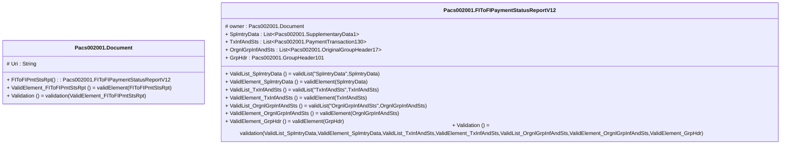

# pacs.002.001.12-physical

> The tables below contain descriptions of the members of each Element. 
> The first column indicates the type of the member:
> A ‘#’ indicates that the field is a key to the element, and a ‘+’ indicates that the field is a value.
> The ‘*’ column contains a description for the element member.  
> The ‘@’ column contains any properties for the member.
> The ‘=’ column contains calculated values; or in the case of an enum, the serialized value.

---

## EntityImpl Pacs002001.Document

| |Name|Type|*|@|=|
|-|-|-|-|-|-|
|#|Uri|String||XmlIgnore(), JsonIgnore()||
|+|FIToFIPmtStsRpt|Pacs002001.FIToFIPaymentStatusReportV12||XmlElement()||
||ValidElement_FIToFIPmtStsRpt|Some(String)||XmlIgnore(), JsonIgnore()|validElement(FIToFIPmtStsRpt)|
||Validation|Some(String)||XmlIgnore(), JsonIgnore()|validation(ValidElement_FIToFIPmtStsRpt)|

---

## AspectImpl Pacs002001.FIToFIPaymentStatusReportV12

| |Name|Type|*|@|=|
|-|-|-|-|-|-|
|#|owner|Pacs002001.Document||||
|+|SplmtryData|List<Pacs002001.SupplementaryData1>||XmlElement()||
|+|TxInfAndSts|List<Pacs002001.PaymentTransaction130>||XmlElement()||
|+|OrgnlGrpInfAndSts|List<Pacs002001.OriginalGroupHeader17>||XmlElement()||
|+|GrpHdr|Pacs002001.GroupHeader101||XmlElement()||
||ValidList_SplmtryData|Some(String)||XmlIgnore(), JsonIgnore()|validList("SplmtryData",SplmtryData)|
||ValidElement_SplmtryData|Some(String)||XmlIgnore(), JsonIgnore()|validElement(SplmtryData)|
||ValidList_TxInfAndSts|Some(String)||XmlIgnore(), JsonIgnore()|validList("TxInfAndSts",TxInfAndSts)|
||ValidElement_TxInfAndSts|Some(String)||XmlIgnore(), JsonIgnore()|validElement(TxInfAndSts)|
||ValidList_OrgnlGrpInfAndSts|Some(String)||XmlIgnore(), JsonIgnore()|validList("OrgnlGrpInfAndSts",OrgnlGrpInfAndSts)|
||ValidElement_OrgnlGrpInfAndSts|Some(String)||XmlIgnore(), JsonIgnore()|validElement(OrgnlGrpInfAndSts)|
||ValidElement_GrpHdr|Some(String)||XmlIgnore(), JsonIgnore()|validElement(GrpHdr)|
||Validation|Some(String)||XmlIgnore(), JsonIgnore()|validation(ValidList_SplmtryData,ValidElement_SplmtryData,ValidList_TxInfAndSts,ValidElement_TxInfAndSts,ValidList_OrgnlGrpInfAndSts,ValidElement_OrgnlGrpInfAndSts,ValidElement_GrpHdr)|

