# pacs.002.001.15-physical

```mermaid
classDiagram
    class ISO20022.Pacs002001.Document {
        # Uri  : String
        + FIToFIPmtStsRpt () : ISO20022.Pacs002001.FIToFIPaymentStatusReportV15
        + Validation () = validation(validElement(FIToFIPmtStsRpt))
    }
    class ISO20022.Pacs002001.FIToFIPaymentStatusReportV15 {
        # owner  : ISO20022.Pacs002001.Document
        + SplmtryData  : List~ISO20022.Pacs002001.SupplementaryData1~
        + TxInfAndSts  : List~ISO20022.Pacs002001.PaymentTransaction164~
        + OrgnlGrpInfAndSts  : List~ISO20022.Pacs002001.OriginalGroupHeader22~
        + GrpHdr  : ISO20022.Pacs002001.GroupHeader120
        + Validation () = validation(validList("""SplmtryData""",SplmtryData),validElement(SplmtryData),validList("""TxInfAndSts""",TxInfAndSts),validElement(TxInfAndSts),validList("""OrgnlGrpInfAndSts""",OrgnlGrpInfAndSts),validElement(OrgnlGrpInfAndSts),validElement(GrpHdr))
    }
```

> The tables below contain descriptions of the members of each Element. 
> The first column indicates the type of the member:
> A ‘#’ indicates that the field is a key to the element, and a ‘+’ indicates that the field is a value.
> The ‘*’ column contains a description for the element member.  
> The ‘@’ column contains any properties for the member.
> The ‘=’ column contains calculated values; or in the case of an enum, the serialized value.

---

## EntityImpl ISO20022.Pacs002001.Document

| |Name|Type|*|@|=|
|-|-|-|-|-|-|
|#|Uri|String||XmlIgnore(), JsonIgnore()||
|+|FIToFIPmtStsRpt|ISO20022.Pacs002001.FIToFIPaymentStatusReportV15||XmlElement()||
||Validation|Some(String)||XmlIgnore(), JsonIgnore()|validation(validElement(FIToFIPmtStsRpt))|

---

## AspectImpl ISO20022.Pacs002001.FIToFIPaymentStatusReportV15

| |Name|Type|*|@|=|
|-|-|-|-|-|-|
|#|owner|ISO20022.Pacs002001.Document||||
|+|SplmtryData|List<ISO20022.Pacs002001.SupplementaryData1>||XmlElement()||
|+|TxInfAndSts|List<ISO20022.Pacs002001.PaymentTransaction164>||XmlElement()||
|+|OrgnlGrpInfAndSts|List<ISO20022.Pacs002001.OriginalGroupHeader22>||XmlElement()||
|+|GrpHdr|ISO20022.Pacs002001.GroupHeader120||XmlElement()||
||Validation|Some(String)||XmlIgnore(), JsonIgnore()|validation(validList("""SplmtryData""",SplmtryData),validElement(SplmtryData),validList("""TxInfAndSts""",TxInfAndSts),validElement(TxInfAndSts),validList("""OrgnlGrpInfAndSts""",OrgnlGrpInfAndSts),validElement(OrgnlGrpInfAndSts),validElement(GrpHdr))|

