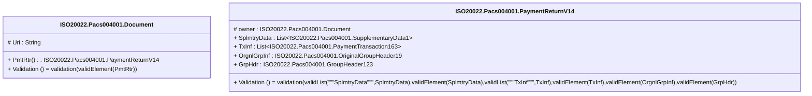

# pacs.004.001.14-physical

> The tables below contain descriptions of the members of each Element. 
> The first column indicates the type of the member:
> A ‘#’ indicates that the field is a key to the element, and a ‘+’ indicates that the field is a value.
> The ‘*’ column contains a description for the element member.  
> The ‘@’ column contains any properties for the member.
> The ‘=’ column contains calculated values; or in the case of an enum, the serialized value.

---

## EntityImpl ISO20022.Pacs004001.Document

| |Name|Type|*|@|=|
|-|-|-|-|-|-|
|#|Uri|String||XmlIgnore(), JsonIgnore()||
|+|PmtRtr|ISO20022.Pacs004001.PaymentReturnV14||XmlElement()||
||Validation|Some(String)||XmlIgnore(), JsonIgnore()|validation(validElement(PmtRtr))|

---

## AspectImpl ISO20022.Pacs004001.PaymentReturnV14

| |Name|Type|*|@|=|
|-|-|-|-|-|-|
|#|owner|ISO20022.Pacs004001.Document||||
|+|SplmtryData|List<ISO20022.Pacs004001.SupplementaryData1>||XmlElement()||
|+|TxInf|List<ISO20022.Pacs004001.PaymentTransaction163>||XmlElement()||
|+|OrgnlGrpInf|ISO20022.Pacs004001.OriginalGroupHeader19||XmlElement()||
|+|GrpHdr|ISO20022.Pacs004001.GroupHeader123||XmlElement()||
||Validation|Some(String)||XmlIgnore(), JsonIgnore()|validation(validList("""SplmtryData""",SplmtryData),validElement(SplmtryData),validList("""TxInf""",TxInf),validElement(TxInf),validElement(OrgnlGrpInf),validElement(GrpHdr))|

