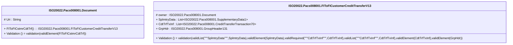

# pacs.008.001.13-physical

> The tables below contain descriptions of the members of each Element. 
> The first column indicates the type of the member:
> A ‘#’ indicates that the field is a key to the element, and a ‘+’ indicates that the field is a value.
> The ‘*’ column contains a description for the element member.  
> The ‘@’ column contains any properties for the member.
> The ‘=’ column contains calculated values; or in the case of an enum, the serialized value.

---

## EntityImpl ISO20022.Pacs008001.Document

| |Name|Type|*|@|=|
|-|-|-|-|-|-|
|#|Uri|String||XmlIgnore(), JsonIgnore()||
|+|FIToFICstmrCdtTrf|ISO20022.Pacs008001.FIToFICustomerCreditTransferV13||XmlElement()||
||Validation|Some(String)||XmlIgnore(), JsonIgnore()|validation(validElement(FIToFICstmrCdtTrf))|

---

## AspectImpl ISO20022.Pacs008001.FIToFICustomerCreditTransferV13

| |Name|Type|*|@|=|
|-|-|-|-|-|-|
|#|owner|ISO20022.Pacs008001.Document||||
|+|SplmtryData|List<ISO20022.Pacs008001.SupplementaryData1>||XmlElement()||
|+|CdtTrfTxInf|List<ISO20022.Pacs008001.CreditTransferTransaction70>||XmlElement()||
|+|GrpHdr|ISO20022.Pacs008001.GroupHeader131||XmlElement()||
||Validation|Some(String)||XmlIgnore(), JsonIgnore()|validation(validList("""SplmtryData""",SplmtryData),validElement(SplmtryData),validRequired("""CdtTrfTxInf""",CdtTrfTxInf),validList("""CdtTrfTxInf""",CdtTrfTxInf),validElement(CdtTrfTxInf),validElement(GrpHdr))|

