# pacs.010.001.06

```mermaid
classDiagram
    class Hiperspace.Edge {
        # From  : Hiperspace.Node
        # To  : Hiperspace.Node
        # TypeName  : String
        + Name  : String
    }
    class ISO20022.Pacs010001.AccountIdentification4Choice {
        + Othr  : ISO20022.Pacs010001.GenericAccountIdentification1
        + IBAN  : String
    }
    ISO20022.Pacs010001.AccountIdentification4Choice *-- ISO20022.Pacs010001.GenericAccountIdentification1
    class ISO20022.Pacs010001.AccountSchemeName1Choice {
        + Prtry  : String
        + Cd  : String
    }
    class ISO20022.Pacs010001.ActiveCurrencyAndAmount {
        + Value  : Decimal
        + Ccy  : String
    }
    class ISO20022.Pacs010001.AddressType2Code {
        DLVY = 1
        MLTO = 2
        BIZZ = 3
        HOME = 4
        PBOX = 5
        ADDR = 6
    }
    class ISO20022.Pacs010001.AddressType3Choice {
        + Prtry  : ISO20022.Pacs010001.GenericIdentification30
        + Cd  : String
    }
    ISO20022.Pacs010001.AddressType3Choice *-- ISO20022.Pacs010001.GenericIdentification30
    class ISO20022.Pacs010001.BranchAndFinancialInstitutionIdentification8 {
        + BrnchId  : ISO20022.Pacs010001.BranchData5
        + FinInstnId  : ISO20022.Pacs010001.FinancialInstitutionIdentification23
    }
    ISO20022.Pacs010001.BranchAndFinancialInstitutionIdentification8 *-- ISO20022.Pacs010001.BranchData5
    ISO20022.Pacs010001.BranchAndFinancialInstitutionIdentification8 *-- ISO20022.Pacs010001.FinancialInstitutionIdentification23
    class ISO20022.Pacs010001.BranchData5 {
        + PstlAdr  : ISO20022.Pacs010001.PostalAddress27
        + Nm  : String
        + LEI  : String
        + Id  : String
    }
    ISO20022.Pacs010001.BranchData5 *-- ISO20022.Pacs010001.PostalAddress27
    class ISO20022.Pacs010001.CashAccount40 {
        + Prxy  : ISO20022.Pacs010001.ProxyAccountIdentification1
        + Nm  : String
        + Ccy  : String
        + Tp  : ISO20022.Pacs010001.CashAccountType2Choice
        + Id  : ISO20022.Pacs010001.AccountIdentification4Choice
    }
    ISO20022.Pacs010001.CashAccount40 *-- ISO20022.Pacs010001.ProxyAccountIdentification1
    ISO20022.Pacs010001.CashAccount40 *-- ISO20022.Pacs010001.CashAccountType2Choice
    ISO20022.Pacs010001.CashAccount40 *-- ISO20022.Pacs010001.AccountIdentification4Choice
    class ISO20022.Pacs010001.CashAccountType2Choice {
        + Prtry  : String
        + Cd  : String
    }
    class ISO20022.Pacs010001.CategoryPurpose1Choice {
        + Prtry  : String
        + Cd  : String
    }
    class ISO20022.Pacs010001.ClearingChannel2Code {
        BOOK = 1
        MPNS = 2
        RTNS = 3
        RTGS = 4
    }
    class ISO20022.Pacs010001.ClearingSystemIdentification2Choice {
        + Prtry  : String
        + Cd  : String
    }
    class ISO20022.Pacs010001.ClearingSystemMemberIdentification2 {
        + MmbId  : String
        + ClrSysId  : ISO20022.Pacs010001.ClearingSystemIdentification2Choice
    }
    ISO20022.Pacs010001.ClearingSystemMemberIdentification2 *-- ISO20022.Pacs010001.ClearingSystemIdentification2Choice
    class ISO20022.Pacs010001.CreditTransferTransaction66 {
        + SplmtryData  : global::System.Collections.Generic.List~ISO20022.Pacs010001.SupplementaryData1~
        + DrctDbtTxInf  : global::System.Collections.Generic.List~ISO20022.Pacs010001.DirectDebitTransactionInformation33~
        + InstrForCdtrAgt  : global::System.Collections.Generic.List~ISO20022.Pacs010001.InstructionForCreditorAgent3~
        + UltmtCdtr  : ISO20022.Pacs010001.BranchAndFinancialInstitutionIdentification8
        + CdtrAcct  : ISO20022.Pacs010001.CashAccount40
        + Cdtr  : ISO20022.Pacs010001.BranchAndFinancialInstitutionIdentification8
        + CdtrAgtAcct  : ISO20022.Pacs010001.CashAccount40
        + CdtrAgt  : ISO20022.Pacs010001.BranchAndFinancialInstitutionIdentification8
        + IntrmyAgt3Acct  : ISO20022.Pacs010001.CashAccount40
        + IntrmyAgt3  : ISO20022.Pacs010001.BranchAndFinancialInstitutionIdentification8
        + IntrmyAgt2Acct  : ISO20022.Pacs010001.CashAccount40
        + IntrmyAgt2  : ISO20022.Pacs010001.BranchAndFinancialInstitutionIdentification8
        + IntrmyAgt1Acct  : ISO20022.Pacs010001.CashAccount40
        + IntrmyAgt1  : ISO20022.Pacs010001.BranchAndFinancialInstitutionIdentification8
        + InstdAgt  : ISO20022.Pacs010001.BranchAndFinancialInstitutionIdentification8
        + InstgAgt  : ISO20022.Pacs010001.BranchAndFinancialInstitutionIdentification8
        + SttlmTmIndctn  : ISO20022.Pacs010001.SettlementDateTimeIndication1
        + IntrBkSttlmDt  : DateTime
        + TtlIntrBkSttlmAmt  : ISO20022.Pacs010001.ActiveCurrencyAndAmount
        + PmtTpInf  : ISO20022.Pacs010001.PaymentTypeInformation28
        + BtchBookg  : String
        + CdtId  : String
    }
    ISO20022.Pacs010001.CreditTransferTransaction66 *-- ISO20022.Pacs010001.SupplementaryData1
    ISO20022.Pacs010001.CreditTransferTransaction66 *-- ISO20022.Pacs010001.DirectDebitTransactionInformation33
    ISO20022.Pacs010001.CreditTransferTransaction66 *-- ISO20022.Pacs010001.InstructionForCreditorAgent3
    ISO20022.Pacs010001.CreditTransferTransaction66 *-- ISO20022.Pacs010001.BranchAndFinancialInstitutionIdentification8
    ISO20022.Pacs010001.CreditTransferTransaction66 *-- ISO20022.Pacs010001.CashAccount40
    ISO20022.Pacs010001.CreditTransferTransaction66 *-- ISO20022.Pacs010001.BranchAndFinancialInstitutionIdentification8
    ISO20022.Pacs010001.CreditTransferTransaction66 *-- ISO20022.Pacs010001.CashAccount40
    ISO20022.Pacs010001.CreditTransferTransaction66 *-- ISO20022.Pacs010001.BranchAndFinancialInstitutionIdentification8
    ISO20022.Pacs010001.CreditTransferTransaction66 *-- ISO20022.Pacs010001.CashAccount40
    ISO20022.Pacs010001.CreditTransferTransaction66 *-- ISO20022.Pacs010001.BranchAndFinancialInstitutionIdentification8
    ISO20022.Pacs010001.CreditTransferTransaction66 *-- ISO20022.Pacs010001.CashAccount40
    ISO20022.Pacs010001.CreditTransferTransaction66 *-- ISO20022.Pacs010001.BranchAndFinancialInstitutionIdentification8
    ISO20022.Pacs010001.CreditTransferTransaction66 *-- ISO20022.Pacs010001.CashAccount40
    ISO20022.Pacs010001.CreditTransferTransaction66 *-- ISO20022.Pacs010001.BranchAndFinancialInstitutionIdentification8
    ISO20022.Pacs010001.CreditTransferTransaction66 *-- ISO20022.Pacs010001.BranchAndFinancialInstitutionIdentification8
    ISO20022.Pacs010001.CreditTransferTransaction66 *-- ISO20022.Pacs010001.BranchAndFinancialInstitutionIdentification8
    ISO20022.Pacs010001.CreditTransferTransaction66 *-- ISO20022.Pacs010001.SettlementDateTimeIndication1
    ISO20022.Pacs010001.CreditTransferTransaction66 *-- ISO20022.Pacs010001.ActiveCurrencyAndAmount
    ISO20022.Pacs010001.CreditTransferTransaction66 *-- ISO20022.Pacs010001.PaymentTypeInformation28
    class ISO20022.Pacs010001.DirectDebitTransactionInformation33 {
        + RmtInf  : ISO20022.Pacs010001.RemittanceInformation2
        + Purp  : ISO20022.Pacs010001.Purpose2Choice
        + InstrForDbtrAgt  : String
        + DbtrAgtAcct  : ISO20022.Pacs010001.CashAccount40
        + DbtrAgt  : ISO20022.Pacs010001.BranchAndFinancialInstitutionIdentification8
        + DbtrAcct  : ISO20022.Pacs010001.CashAccount40
        + Dbtr  : ISO20022.Pacs010001.BranchAndFinancialInstitutionIdentification8
        + UltmtDbtr  : ISO20022.Pacs010001.BranchAndFinancialInstitutionIdentification8
        + SttlmTmReq  : ISO20022.Pacs010001.SettlementTimeRequest2
        + SttlmTmIndctn  : ISO20022.Pacs010001.SettlementDateTimeIndication1
        + SttlmPrty  : String
        + IntrBkSttlmDt  : DateTime
        + IntrBkSttlmAmt  : ISO20022.Pacs010001.ActiveCurrencyAndAmount
        + PmtTpInf  : ISO20022.Pacs010001.PaymentTypeInformation28
        + PmtId  : ISO20022.Pacs010001.PaymentIdentification13
    }
    ISO20022.Pacs010001.DirectDebitTransactionInformation33 *-- ISO20022.Pacs010001.RemittanceInformation2
    ISO20022.Pacs010001.DirectDebitTransactionInformation33 *-- ISO20022.Pacs010001.Purpose2Choice
    ISO20022.Pacs010001.DirectDebitTransactionInformation33 *-- ISO20022.Pacs010001.CashAccount40
    ISO20022.Pacs010001.DirectDebitTransactionInformation33 *-- ISO20022.Pacs010001.BranchAndFinancialInstitutionIdentification8
    ISO20022.Pacs010001.DirectDebitTransactionInformation33 *-- ISO20022.Pacs010001.CashAccount40
    ISO20022.Pacs010001.DirectDebitTransactionInformation33 *-- ISO20022.Pacs010001.BranchAndFinancialInstitutionIdentification8
    ISO20022.Pacs010001.DirectDebitTransactionInformation33 *-- ISO20022.Pacs010001.BranchAndFinancialInstitutionIdentification8
    ISO20022.Pacs010001.DirectDebitTransactionInformation33 *-- ISO20022.Pacs010001.SettlementTimeRequest2
    ISO20022.Pacs010001.DirectDebitTransactionInformation33 *-- ISO20022.Pacs010001.SettlementDateTimeIndication1
    ISO20022.Pacs010001.DirectDebitTransactionInformation33 *-- ISO20022.Pacs010001.ActiveCurrencyAndAmount
    ISO20022.Pacs010001.DirectDebitTransactionInformation33 *-- ISO20022.Pacs010001.PaymentTypeInformation28
    ISO20022.Pacs010001.DirectDebitTransactionInformation33 *-- ISO20022.Pacs010001.PaymentIdentification13
    class ISO20022.Pacs010001.FinancialIdentificationSchemeName1Choice {
        + Prtry  : String
        + Cd  : String
    }
    class ISO20022.Pacs010001.FinancialInstitutionDirectDebitV06 {
        + SplmtryData  : global::System.Collections.Generic.List~ISO20022.Pacs010001.SupplementaryData1~
        + CdtInstr  : global::System.Collections.Generic.List~ISO20022.Pacs010001.CreditTransferTransaction66~
        + GrpHdr  : ISO20022.Pacs010001.GroupHeader119
    }
    ISO20022.Pacs010001.FinancialInstitutionDirectDebitV06 *-- ISO20022.Pacs010001.SupplementaryData1
    ISO20022.Pacs010001.FinancialInstitutionDirectDebitV06 *-- ISO20022.Pacs010001.CreditTransferTransaction66
    ISO20022.Pacs010001.FinancialInstitutionDirectDebitV06 *-- ISO20022.Pacs010001.GroupHeader119
    class ISO20022.Pacs010001.FinancialInstitutionIdentification23 {
        + Othr  : ISO20022.Pacs010001.GenericFinancialIdentification1
        + PstlAdr  : ISO20022.Pacs010001.PostalAddress27
        + Nm  : String
        + LEI  : String
        + ClrSysMmbId  : ISO20022.Pacs010001.ClearingSystemMemberIdentification2
        + BICFI  : String
    }
    ISO20022.Pacs010001.FinancialInstitutionIdentification23 *-- ISO20022.Pacs010001.GenericFinancialIdentification1
    ISO20022.Pacs010001.FinancialInstitutionIdentification23 *-- ISO20022.Pacs010001.PostalAddress27
    ISO20022.Pacs010001.FinancialInstitutionIdentification23 *-- ISO20022.Pacs010001.ClearingSystemMemberIdentification2
    class ISO20022.Pacs010001.GenericAccountIdentification1 {
        + Issr  : String
        + SchmeNm  : ISO20022.Pacs010001.AccountSchemeName1Choice
        + Id  : String
    }
    ISO20022.Pacs010001.GenericAccountIdentification1 *-- ISO20022.Pacs010001.AccountSchemeName1Choice
    class ISO20022.Pacs010001.GenericFinancialIdentification1 {
        + Issr  : String
        + SchmeNm  : ISO20022.Pacs010001.FinancialIdentificationSchemeName1Choice
        + Id  : String
    }
    ISO20022.Pacs010001.GenericFinancialIdentification1 *-- ISO20022.Pacs010001.FinancialIdentificationSchemeName1Choice
    class ISO20022.Pacs010001.GenericIdentification30 {
        + SchmeNm  : String
        + Issr  : String
        + Id  : String
    }
    class ISO20022.Pacs010001.GroupHeader119 {
        + InstdAgt  : ISO20022.Pacs010001.BranchAndFinancialInstitutionIdentification8
        + InstgAgt  : ISO20022.Pacs010001.BranchAndFinancialInstitutionIdentification8
        + CtrlSum  : Decimal
        + NbOfTxs  : String
        + CreDtTm  : DateTime
        + MsgId  : String
    }
    ISO20022.Pacs010001.GroupHeader119 *-- ISO20022.Pacs010001.BranchAndFinancialInstitutionIdentification8
    ISO20022.Pacs010001.GroupHeader119 *-- ISO20022.Pacs010001.BranchAndFinancialInstitutionIdentification8
    class ISO20022.Pacs010001.InstructionForCreditorAgent3 {
        + InstrInf  : String
        + Cd  : String
    }
    class ISO20022.Pacs010001.LocalInstrument2Choice {
        + Prtry  : String
        + Cd  : String
    }
    class ISO20022.Pacs010001.PaymentIdentification13 {
        + ClrSysRef  : String
        + UETR  : String
        + TxId  : String
        + EndToEndId  : String
        + InstrId  : String
    }
    class ISO20022.Pacs010001.PaymentTypeInformation28 {
        + CtgyPurp  : ISO20022.Pacs010001.CategoryPurpose1Choice
        + LclInstrm  : ISO20022.Pacs010001.LocalInstrument2Choice
        + SvcLvl  : global::System.Collections.Generic.List~ISO20022.Pacs010001.ServiceLevel8Choice~
        + ClrChanl  : String
        + InstrPrty  : String
    }
    ISO20022.Pacs010001.PaymentTypeInformation28 *-- ISO20022.Pacs010001.CategoryPurpose1Choice
    ISO20022.Pacs010001.PaymentTypeInformation28 *-- ISO20022.Pacs010001.LocalInstrument2Choice
    ISO20022.Pacs010001.PaymentTypeInformation28 *-- ISO20022.Pacs010001.ServiceLevel8Choice
    class ISO20022.Pacs010001.PostalAddress27 {
        + AdrLine  : global::System.Collections.Generic.List~String~
        + Ctry  : String
        + CtrySubDvsn  : String
        + DstrctNm  : String
        + TwnLctnNm  : String
        + TwnNm  : String
        + PstCd  : String
        + Room  : String
        + PstBx  : String
        + UnitNb  : String
        + Flr  : String
        + BldgNm  : String
        + BldgNb  : String
        + StrtNm  : String
        + SubDept  : String
        + Dept  : String
        + CareOf  : String
        + AdrTp  : ISO20022.Pacs010001.AddressType3Choice
    }
    ISO20022.Pacs010001.PostalAddress27 *-- ISO20022.Pacs010001.AddressType3Choice
    class ISO20022.Pacs010001.Priority2Code {
        NORM = 1
        HIGH = 2
    }
    class ISO20022.Pacs010001.Priority3Code {
        NORM = 1
        HIGH = 2
        URGT = 3
    }
    class ISO20022.Pacs010001.ProxyAccountIdentification1 {
        + Id  : String
        + Tp  : ISO20022.Pacs010001.ProxyAccountType1Choice
    }
    ISO20022.Pacs010001.ProxyAccountIdentification1 *-- ISO20022.Pacs010001.ProxyAccountType1Choice
    class ISO20022.Pacs010001.ProxyAccountType1Choice {
        + Prtry  : String
        + Cd  : String
    }
    class ISO20022.Pacs010001.Purpose2Choice {
        + Prtry  : String
        + Cd  : String
    }
    class ISO20022.Pacs010001.RemittanceInformation2 {
        + Ustrd  : global::System.Collections.Generic.List~String~
    }
    class ISO20022.Pacs010001.ServiceLevel8Choice {
        + Prtry  : String
        + Cd  : String
    }
    class ISO20022.Pacs010001.SettlementDateTimeIndication1 {
        + CdtDtTm  : DateTime
        + DbtDtTm  : DateTime
    }
    class ISO20022.Pacs010001.SettlementTimeRequest2 {
        + RjctTm  : DateTime
        + FrTm  : DateTime
        + TillTm  : DateTime
        + CLSTm  : DateTime
    }
    class ISO20022.Pacs010001.SupplementaryData1 {
        + Envlp  : ISO20022.Pacs010001.SupplementaryDataEnvelope1
        + PlcAndNm  : String
    }
    ISO20022.Pacs010001.SupplementaryData1 *-- ISO20022.Pacs010001.SupplementaryDataEnvelope1
    class ISO20022.Pacs010001.SupplementaryDataEnvelope1 {
    }
    class Hiperspace.Node {
        # SKey  : String
        + TypeName  : String
        + Name  : String
        + Froms (From = this) : Hiperspace.Edge
        + Tos (To = this) : Hiperspace.Edge
    }
```

> The tables below contain descriptions of the members of each Element. 
> The first column indicates the type of the member:
> A ‘#’ indicates that the field is a key to the element, and a ‘+’ indicates that the field is a value.
> The ‘*’ column contains a description for the element member.  
> The ‘@’ column contains any properties for the member.
> The ‘=’ column contains calculated values; or in the case of an enum, the serialized value.

---

## View Hiperspace.Edge
edge between nodes

| |Name|Type|*|@|=|
|-|-|-|-|-|-|
|#|From|Hiperspace.Node||||
|#|To|Hiperspace.Node||||
|#|TypeName|String||||
|+|Name|String||||

---

## Value ISO20022.Pacs010001.AccountIdentification4Choice

| |Name|Type|*|@|=|
|-|-|-|-|-|-|
|+|Othr|ISO20022.Pacs010001.GenericAccountIdentification1||XmlElement()||
|+|IBAN|String||XmlElement()||
||Validation|Some(String)||XmlIgnore(), JsonIgnore()|validation(validElement(Othr),validPattern("""IBAN""",IBAN,"""[A-Z]{2,2}[0-9]{2,2}[a-zA-Z0-9]{1,30}"""),validChoice(Othr,IBAN))|

---

## Value ISO20022.Pacs010001.AccountSchemeName1Choice

| |Name|Type|*|@|=|
|-|-|-|-|-|-|
|+|Prtry|String||XmlElement()||
|+|Cd|String||XmlElement()||
||Validation|Some(String)||XmlIgnore(), JsonIgnore()|validation(validChoice(Prtry,Cd))|

---

## Value ISO20022.Pacs010001.ActiveCurrencyAndAmount

| |Name|Type|*|@|=|
|-|-|-|-|-|-|
|+|Value|Decimal||XmlElement()||
|+|Ccy|String||XmlAttribute()||
||Validation|Some(String)||XmlIgnore(), JsonIgnore()|validation(validRequired("""Value""",Value),validRequired("""Ccy""",Ccy),validPattern("""Ccy""",Ccy,"""[A-Z]{3,3}"""))|

---

## Enum ISO20022.Pacs010001.AddressType2Code

| |Name|Type|*|@|=|
|-|-|-|-|-|-|
||DLVY|Int32||XmlEnum("""DLVY""")|1|
||MLTO|Int32||XmlEnum("""MLTO""")|2|
||BIZZ|Int32||XmlEnum("""BIZZ""")|3|
||HOME|Int32||XmlEnum("""HOME""")|4|
||PBOX|Int32||XmlEnum("""PBOX""")|5|
||ADDR|Int32||XmlEnum("""ADDR""")|6|

---

## Value ISO20022.Pacs010001.AddressType3Choice

| |Name|Type|*|@|=|
|-|-|-|-|-|-|
|+|Prtry|ISO20022.Pacs010001.GenericIdentification30||XmlElement()||
|+|Cd|String||XmlElement()||
||Validation|Some(String)||XmlIgnore(), JsonIgnore()|validation(validElement(Prtry),validChoice(Prtry,Cd))|

---

## Value ISO20022.Pacs010001.BranchAndFinancialInstitutionIdentification8

| |Name|Type|*|@|=|
|-|-|-|-|-|-|
|+|BrnchId|ISO20022.Pacs010001.BranchData5||XmlElement()||
|+|FinInstnId|ISO20022.Pacs010001.FinancialInstitutionIdentification23||XmlElement()||
||Validation|Some(String)||XmlIgnore(), JsonIgnore()|validation(validElement(BrnchId),validElement(FinInstnId))|

---

## Value ISO20022.Pacs010001.BranchData5

| |Name|Type|*|@|=|
|-|-|-|-|-|-|
|+|PstlAdr|ISO20022.Pacs010001.PostalAddress27||XmlElement()||
|+|Nm|String||XmlElement()||
|+|LEI|String||XmlElement()||
|+|Id|String||XmlElement()||
||Validation|Some(String)||XmlIgnore(), JsonIgnore()|validation(validElement(PstlAdr),validPattern("""LEI""",LEI,"""[A-Z0-9]{18,18}[0-9]{2,2}"""))|

---

## Value ISO20022.Pacs010001.CashAccount40

| |Name|Type|*|@|=|
|-|-|-|-|-|-|
|+|Prxy|ISO20022.Pacs010001.ProxyAccountIdentification1||XmlElement()||
|+|Nm|String||XmlElement()||
|+|Ccy|String||XmlElement()||
|+|Tp|ISO20022.Pacs010001.CashAccountType2Choice||XmlElement()||
|+|Id|ISO20022.Pacs010001.AccountIdentification4Choice||XmlElement()||
||Validation|Some(String)||XmlIgnore(), JsonIgnore()|validation(validElement(Prxy),validPattern("""Ccy""",Ccy,"""[A-Z]{3,3}"""),validElement(Tp),validElement(Id))|

---

## Value ISO20022.Pacs010001.CashAccountType2Choice

| |Name|Type|*|@|=|
|-|-|-|-|-|-|
|+|Prtry|String||XmlElement()||
|+|Cd|String||XmlElement()||
||Validation|Some(String)||XmlIgnore(), JsonIgnore()|validation(validChoice(Prtry,Cd))|

---

## Value ISO20022.Pacs010001.CategoryPurpose1Choice

| |Name|Type|*|@|=|
|-|-|-|-|-|-|
|+|Prtry|String||XmlElement()||
|+|Cd|String||XmlElement()||
||Validation|Some(String)||XmlIgnore(), JsonIgnore()|validation(validChoice(Prtry,Cd))|

---

## Enum ISO20022.Pacs010001.ClearingChannel2Code

| |Name|Type|*|@|=|
|-|-|-|-|-|-|
||BOOK|Int32||XmlEnum("""BOOK""")|1|
||MPNS|Int32||XmlEnum("""MPNS""")|2|
||RTNS|Int32||XmlEnum("""RTNS""")|3|
||RTGS|Int32||XmlEnum("""RTGS""")|4|

---

## Value ISO20022.Pacs010001.ClearingSystemIdentification2Choice

| |Name|Type|*|@|=|
|-|-|-|-|-|-|
|+|Prtry|String||XmlElement()||
|+|Cd|String||XmlElement()||
||Validation|Some(String)||XmlIgnore(), JsonIgnore()|validation(validChoice(Prtry,Cd))|

---

## Value ISO20022.Pacs010001.ClearingSystemMemberIdentification2

| |Name|Type|*|@|=|
|-|-|-|-|-|-|
|+|MmbId|String||XmlElement()||
|+|ClrSysId|ISO20022.Pacs010001.ClearingSystemIdentification2Choice||XmlElement()||
||Validation|Some(String)||XmlIgnore(), JsonIgnore()|validation(validElement(ClrSysId))|

---

## Value ISO20022.Pacs010001.CreditTransferTransaction66

| |Name|Type|*|@|=|
|-|-|-|-|-|-|
|+|SplmtryData|global::System.Collections.Generic.List<ISO20022.Pacs010001.SupplementaryData1>||XmlElement()||
|+|DrctDbtTxInf|global::System.Collections.Generic.List<ISO20022.Pacs010001.DirectDebitTransactionInformation33>||XmlElement()||
|+|InstrForCdtrAgt|global::System.Collections.Generic.List<ISO20022.Pacs010001.InstructionForCreditorAgent3>||XmlElement()||
|+|UltmtCdtr|ISO20022.Pacs010001.BranchAndFinancialInstitutionIdentification8||XmlElement()||
|+|CdtrAcct|ISO20022.Pacs010001.CashAccount40||XmlElement()||
|+|Cdtr|ISO20022.Pacs010001.BranchAndFinancialInstitutionIdentification8||XmlElement()||
|+|CdtrAgtAcct|ISO20022.Pacs010001.CashAccount40||XmlElement()||
|+|CdtrAgt|ISO20022.Pacs010001.BranchAndFinancialInstitutionIdentification8||XmlElement()||
|+|IntrmyAgt3Acct|ISO20022.Pacs010001.CashAccount40||XmlElement()||
|+|IntrmyAgt3|ISO20022.Pacs010001.BranchAndFinancialInstitutionIdentification8||XmlElement()||
|+|IntrmyAgt2Acct|ISO20022.Pacs010001.CashAccount40||XmlElement()||
|+|IntrmyAgt2|ISO20022.Pacs010001.BranchAndFinancialInstitutionIdentification8||XmlElement()||
|+|IntrmyAgt1Acct|ISO20022.Pacs010001.CashAccount40||XmlElement()||
|+|IntrmyAgt1|ISO20022.Pacs010001.BranchAndFinancialInstitutionIdentification8||XmlElement()||
|+|InstdAgt|ISO20022.Pacs010001.BranchAndFinancialInstitutionIdentification8||XmlElement()||
|+|InstgAgt|ISO20022.Pacs010001.BranchAndFinancialInstitutionIdentification8||XmlElement()||
|+|SttlmTmIndctn|ISO20022.Pacs010001.SettlementDateTimeIndication1||XmlElement()||
|+|IntrBkSttlmDt|DateTime||XmlElement()||
|+|TtlIntrBkSttlmAmt|ISO20022.Pacs010001.ActiveCurrencyAndAmount||XmlElement()||
|+|PmtTpInf|ISO20022.Pacs010001.PaymentTypeInformation28||XmlElement()||
|+|BtchBookg|String||XmlElement()||
|+|CdtId|String||XmlElement()||
||Validation|Some(String)||XmlIgnore(), JsonIgnore()|validation(validList("""SplmtryData""",SplmtryData),validElement(SplmtryData),validRequired("""DrctDbtTxInf""",DrctDbtTxInf),validList("""DrctDbtTxInf""",DrctDbtTxInf),validElement(DrctDbtTxInf),validList("""InstrForCdtrAgt""",InstrForCdtrAgt),validElement(InstrForCdtrAgt),validElement(UltmtCdtr),validElement(CdtrAcct),validElement(Cdtr),validElement(CdtrAgtAcct),validElement(CdtrAgt),validElement(IntrmyAgt3Acct),validElement(IntrmyAgt3),validElement(IntrmyAgt2Acct),validElement(IntrmyAgt2),validElement(IntrmyAgt1Acct),validElement(IntrmyAgt1),validElement(InstdAgt),validElement(InstgAgt),validElement(SttlmTmIndctn),validElement(TtlIntrBkSttlmAmt),validElement(PmtTpInf))|

---

## Value ISO20022.Pacs010001.DirectDebitTransactionInformation33

| |Name|Type|*|@|=|
|-|-|-|-|-|-|
|+|RmtInf|ISO20022.Pacs010001.RemittanceInformation2||XmlElement()||
|+|Purp|ISO20022.Pacs010001.Purpose2Choice||XmlElement()||
|+|InstrForDbtrAgt|String||XmlElement()||
|+|DbtrAgtAcct|ISO20022.Pacs010001.CashAccount40||XmlElement()||
|+|DbtrAgt|ISO20022.Pacs010001.BranchAndFinancialInstitutionIdentification8||XmlElement()||
|+|DbtrAcct|ISO20022.Pacs010001.CashAccount40||XmlElement()||
|+|Dbtr|ISO20022.Pacs010001.BranchAndFinancialInstitutionIdentification8||XmlElement()||
|+|UltmtDbtr|ISO20022.Pacs010001.BranchAndFinancialInstitutionIdentification8||XmlElement()||
|+|SttlmTmReq|ISO20022.Pacs010001.SettlementTimeRequest2||XmlElement()||
|+|SttlmTmIndctn|ISO20022.Pacs010001.SettlementDateTimeIndication1||XmlElement()||
|+|SttlmPrty|String||XmlElement()||
|+|IntrBkSttlmDt|DateTime||XmlElement()||
|+|IntrBkSttlmAmt|ISO20022.Pacs010001.ActiveCurrencyAndAmount||XmlElement()||
|+|PmtTpInf|ISO20022.Pacs010001.PaymentTypeInformation28||XmlElement()||
|+|PmtId|ISO20022.Pacs010001.PaymentIdentification13||XmlElement()||
||Validation|Some(String)||XmlIgnore(), JsonIgnore()|validation(validElement(RmtInf),validElement(Purp),validElement(DbtrAgtAcct),validElement(DbtrAgt),validElement(DbtrAcct),validElement(Dbtr),validElement(UltmtDbtr),validElement(SttlmTmReq),validElement(SttlmTmIndctn),validElement(IntrBkSttlmAmt),validElement(PmtTpInf),validElement(PmtId))|

---

## Type ISO20022.Pacs010001.Document

| |Name|Type|*|@|=|
|-|-|-|-|-|-|
|+|FIDrctDbt|ISO20022.Pacs010001.FinancialInstitutionDirectDebitV06||XmlElement()||
||Validation|Some(String)||XmlIgnore(), JsonIgnore()|validation(validElement(FIDrctDbt))|

---

## Value ISO20022.Pacs010001.FinancialIdentificationSchemeName1Choice

| |Name|Type|*|@|=|
|-|-|-|-|-|-|
|+|Prtry|String||XmlElement()||
|+|Cd|String||XmlElement()||
||Validation|Some(String)||XmlIgnore(), JsonIgnore()|validation(validChoice(Prtry,Cd))|

---

## Aspect ISO20022.Pacs010001.FinancialInstitutionDirectDebitV06

| |Name|Type|*|@|=|
|-|-|-|-|-|-|
|+|SplmtryData|global::System.Collections.Generic.List<ISO20022.Pacs010001.SupplementaryData1>||XmlElement()||
|+|CdtInstr|global::System.Collections.Generic.List<ISO20022.Pacs010001.CreditTransferTransaction66>||XmlElement()||
|+|GrpHdr|ISO20022.Pacs010001.GroupHeader119||XmlElement()||
||Validation|Some(String)||XmlIgnore(), JsonIgnore()|validation(validList("""SplmtryData""",SplmtryData),validElement(SplmtryData),validRequired("""CdtInstr""",CdtInstr),validList("""CdtInstr""",CdtInstr),validElement(CdtInstr),validElement(GrpHdr))|

---

## Value ISO20022.Pacs010001.FinancialInstitutionIdentification23

| |Name|Type|*|@|=|
|-|-|-|-|-|-|
|+|Othr|ISO20022.Pacs010001.GenericFinancialIdentification1||XmlElement()||
|+|PstlAdr|ISO20022.Pacs010001.PostalAddress27||XmlElement()||
|+|Nm|String||XmlElement()||
|+|LEI|String||XmlElement()||
|+|ClrSysMmbId|ISO20022.Pacs010001.ClearingSystemMemberIdentification2||XmlElement()||
|+|BICFI|String||XmlElement()||
||Validation|Some(String)||XmlIgnore(), JsonIgnore()|validation(validElement(Othr),validElement(PstlAdr),validPattern("""LEI""",LEI,"""[A-Z0-9]{18,18}[0-9]{2,2}"""),validElement(ClrSysMmbId),validPattern("""BICFI""",BICFI,"""[A-Z0-9]{4,4}[A-Z]{2,2}[A-Z0-9]{2,2}([A-Z0-9]{3,3}){0,1}"""))|

---

## Value ISO20022.Pacs010001.GenericAccountIdentification1

| |Name|Type|*|@|=|
|-|-|-|-|-|-|
|+|Issr|String||XmlElement()||
|+|SchmeNm|ISO20022.Pacs010001.AccountSchemeName1Choice||XmlElement()||
|+|Id|String||XmlElement()||
||Validation|Some(String)||XmlIgnore(), JsonIgnore()|validation(validElement(SchmeNm))|

---

## Value ISO20022.Pacs010001.GenericFinancialIdentification1

| |Name|Type|*|@|=|
|-|-|-|-|-|-|
|+|Issr|String||XmlElement()||
|+|SchmeNm|ISO20022.Pacs010001.FinancialIdentificationSchemeName1Choice||XmlElement()||
|+|Id|String||XmlElement()||
||Validation|Some(String)||XmlIgnore(), JsonIgnore()|validation(validElement(SchmeNm))|

---

## Value ISO20022.Pacs010001.GenericIdentification30

| |Name|Type|*|@|=|
|-|-|-|-|-|-|
|+|SchmeNm|String||XmlElement()||
|+|Issr|String||XmlElement()||
|+|Id|String||XmlElement()||
||Validation|Some(String)||XmlIgnore(), JsonIgnore()|validation(validPattern("""Id""",Id,"""[a-zA-Z0-9]{4}"""))|

---

## Value ISO20022.Pacs010001.GroupHeader119

| |Name|Type|*|@|=|
|-|-|-|-|-|-|
|+|InstdAgt|ISO20022.Pacs010001.BranchAndFinancialInstitutionIdentification8||XmlElement()||
|+|InstgAgt|ISO20022.Pacs010001.BranchAndFinancialInstitutionIdentification8||XmlElement()||
|+|CtrlSum|Decimal||XmlElement()||
|+|NbOfTxs|String||XmlElement()||
|+|CreDtTm|DateTime||XmlElement()||
|+|MsgId|String||XmlElement()||
||Validation|Some(String)||XmlIgnore(), JsonIgnore()|validation(validElement(InstdAgt),validElement(InstgAgt),validPattern("""NbOfTxs""",NbOfTxs,"""[0-9]{1,15}"""))|

---

## Value ISO20022.Pacs010001.InstructionForCreditorAgent3

| |Name|Type|*|@|=|
|-|-|-|-|-|-|
|+|InstrInf|String||XmlElement()||
|+|Cd|String||XmlElement()||
||Validation|Some(String)||XmlIgnore(), JsonIgnore()|""|

---

## Value ISO20022.Pacs010001.LocalInstrument2Choice

| |Name|Type|*|@|=|
|-|-|-|-|-|-|
|+|Prtry|String||XmlElement()||
|+|Cd|String||XmlElement()||
||Validation|Some(String)||XmlIgnore(), JsonIgnore()|validation(validChoice(Prtry,Cd))|

---

## Value ISO20022.Pacs010001.PaymentIdentification13

| |Name|Type|*|@|=|
|-|-|-|-|-|-|
|+|ClrSysRef|String||XmlElement()||
|+|UETR|String||XmlElement()||
|+|TxId|String||XmlElement()||
|+|EndToEndId|String||XmlElement()||
|+|InstrId|String||XmlElement()||
||Validation|Some(String)||XmlIgnore(), JsonIgnore()|validation(validPattern("""UETR""",UETR,"""[a-f0-9]{8}-[a-f0-9]{4}-4[a-f0-9]{3}-[89ab][a-f0-9]{3}-[a-f0-9]{12}"""))|

---

## Value ISO20022.Pacs010001.PaymentTypeInformation28

| |Name|Type|*|@|=|
|-|-|-|-|-|-|
|+|CtgyPurp|ISO20022.Pacs010001.CategoryPurpose1Choice||XmlElement()||
|+|LclInstrm|ISO20022.Pacs010001.LocalInstrument2Choice||XmlElement()||
|+|SvcLvl|global::System.Collections.Generic.List<ISO20022.Pacs010001.ServiceLevel8Choice>||XmlElement()||
|+|ClrChanl|String||XmlElement()||
|+|InstrPrty|String||XmlElement()||
||Validation|Some(String)||XmlIgnore(), JsonIgnore()|validation(validElement(CtgyPurp),validElement(LclInstrm),validList("""SvcLvl""",SvcLvl),validElement(SvcLvl))|

---

## Value ISO20022.Pacs010001.PostalAddress27

| |Name|Type|*|@|=|
|-|-|-|-|-|-|
|+|AdrLine|global::System.Collections.Generic.List<String>||XmlElement()||
|+|Ctry|String||XmlElement()||
|+|CtrySubDvsn|String||XmlElement()||
|+|DstrctNm|String||XmlElement()||
|+|TwnLctnNm|String||XmlElement()||
|+|TwnNm|String||XmlElement()||
|+|PstCd|String||XmlElement()||
|+|Room|String||XmlElement()||
|+|PstBx|String||XmlElement()||
|+|UnitNb|String||XmlElement()||
|+|Flr|String||XmlElement()||
|+|BldgNm|String||XmlElement()||
|+|BldgNb|String||XmlElement()||
|+|StrtNm|String||XmlElement()||
|+|SubDept|String||XmlElement()||
|+|Dept|String||XmlElement()||
|+|CareOf|String||XmlElement()||
|+|AdrTp|ISO20022.Pacs010001.AddressType3Choice||XmlElement()||
||Validation|Some(String)||XmlIgnore(), JsonIgnore()|validation(validListMax("""AdrLine""",AdrLine,7),validPattern("""Ctry""",Ctry,"""[A-Z]{2,2}"""),validElement(AdrTp))|

---

## Enum ISO20022.Pacs010001.Priority2Code

| |Name|Type|*|@|=|
|-|-|-|-|-|-|
||NORM|Int32||XmlEnum("""NORM""")|1|
||HIGH|Int32||XmlEnum("""HIGH""")|2|

---

## Enum ISO20022.Pacs010001.Priority3Code

| |Name|Type|*|@|=|
|-|-|-|-|-|-|
||NORM|Int32||XmlEnum("""NORM""")|1|
||HIGH|Int32||XmlEnum("""HIGH""")|2|
||URGT|Int32||XmlEnum("""URGT""")|3|

---

## Value ISO20022.Pacs010001.ProxyAccountIdentification1

| |Name|Type|*|@|=|
|-|-|-|-|-|-|
|+|Id|String||XmlElement()||
|+|Tp|ISO20022.Pacs010001.ProxyAccountType1Choice||XmlElement()||
||Validation|Some(String)||XmlIgnore(), JsonIgnore()|validation(validElement(Tp))|

---

## Value ISO20022.Pacs010001.ProxyAccountType1Choice

| |Name|Type|*|@|=|
|-|-|-|-|-|-|
|+|Prtry|String||XmlElement()||
|+|Cd|String||XmlElement()||
||Validation|Some(String)||XmlIgnore(), JsonIgnore()|validation(validChoice(Prtry,Cd))|

---

## Value ISO20022.Pacs010001.Purpose2Choice

| |Name|Type|*|@|=|
|-|-|-|-|-|-|
|+|Prtry|String||XmlElement()||
|+|Cd|String||XmlElement()||
||Validation|Some(String)||XmlIgnore(), JsonIgnore()|validation(validChoice(Prtry,Cd))|

---

## Value ISO20022.Pacs010001.RemittanceInformation2

| |Name|Type|*|@|=|
|-|-|-|-|-|-|
|+|Ustrd|global::System.Collections.Generic.List<String>||XmlElement()||
||Validation|Some(String)||XmlIgnore(), JsonIgnore()|""|

---

## Value ISO20022.Pacs010001.ServiceLevel8Choice

| |Name|Type|*|@|=|
|-|-|-|-|-|-|
|+|Prtry|String||XmlElement()||
|+|Cd|String||XmlElement()||
||Validation|Some(String)||XmlIgnore(), JsonIgnore()|validation(validChoice(Prtry,Cd))|

---

## Value ISO20022.Pacs010001.SettlementDateTimeIndication1

| |Name|Type|*|@|=|
|-|-|-|-|-|-|
|+|CdtDtTm|DateTime||XmlElement()||
|+|DbtDtTm|DateTime||XmlElement()||
||Validation|Some(String)||XmlIgnore(), JsonIgnore()|""|

---

## Value ISO20022.Pacs010001.SettlementTimeRequest2

| |Name|Type|*|@|=|
|-|-|-|-|-|-|
|+|RjctTm|DateTime||XmlElement()||
|+|FrTm|DateTime||XmlElement()||
|+|TillTm|DateTime||XmlElement()||
|+|CLSTm|DateTime||XmlElement()||
||Validation|Some(String)||XmlIgnore(), JsonIgnore()|""|

---

## Value ISO20022.Pacs010001.SupplementaryData1

| |Name|Type|*|@|=|
|-|-|-|-|-|-|
|+|Envlp|ISO20022.Pacs010001.SupplementaryDataEnvelope1||XmlElement()||
|+|PlcAndNm|String||XmlElement()||
||Validation|Some(String)||XmlIgnore(), JsonIgnore()|validation(validElement(Envlp))|

---

## Value ISO20022.Pacs010001.SupplementaryDataEnvelope1

| |Name|Type|*|@|=|
|-|-|-|-|-|-|
||Validation|Some(String)||XmlIgnore(), JsonIgnore()|""|

---

## View Hiperspace.Node
node in a graph view of data

| |Name|Type|*|@|=|
|-|-|-|-|-|-|
|#|SKey|String||||
|+|TypeName|String||||
|+|Name|String||||
||Froms|Hiperspace.Edge|||From = this|
||Tos|Hiperspace.Edge|||To = this|

