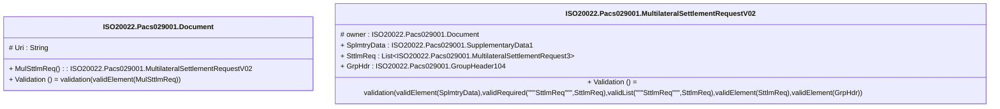

# pacs.029.001.02-physical

> The tables below contain descriptions of the members of each Element. 
> The first column indicates the type of the member:
> A ‘#’ indicates that the field is a key to the element, and a ‘+’ indicates that the field is a value.
> The ‘*’ column contains a description for the element member.  
> The ‘@’ column contains any properties for the member.
> The ‘=’ column contains calculated values; or in the case of an enum, the serialized value.

---

## EntityImpl ISO20022.Pacs029001.Document

| |Name|Type|*|@|=|
|-|-|-|-|-|-|
|#|Uri|String||XmlIgnore(), JsonIgnore()||
|+|MulSttlmReq|ISO20022.Pacs029001.MultilateralSettlementRequestV02||XmlElement()||
||Validation|Some(String)||XmlIgnore(), JsonIgnore()|validation(validElement(MulSttlmReq))|

---

## AspectImpl ISO20022.Pacs029001.MultilateralSettlementRequestV02

| |Name|Type|*|@|=|
|-|-|-|-|-|-|
|#|owner|ISO20022.Pacs029001.Document||||
|+|SplmtryData|ISO20022.Pacs029001.SupplementaryData1||XmlElement()||
|+|SttlmReq|List<ISO20022.Pacs029001.MultilateralSettlementRequest3>||XmlElement()||
|+|GrpHdr|ISO20022.Pacs029001.GroupHeader104||XmlElement()||
||Validation|Some(String)||XmlIgnore(), JsonIgnore()|validation(validElement(SplmtryData),validRequired("""SttlmReq""",SttlmReq),validList("""SttlmReq""",SttlmReq),validElement(SttlmReq),validElement(GrpHdr))|

