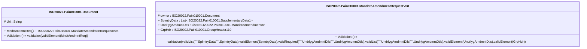

# pain.010.001.08-physical

> The tables below contain descriptions of the members of each Element. 
> The first column indicates the type of the member:
> A ‘#’ indicates that the field is a key to the element, and a ‘+’ indicates that the field is a value.
> The ‘*’ column contains a description for the element member.  
> The ‘@’ column contains any properties for the member.
> The ‘=’ column contains calculated values; or in the case of an enum, the serialized value.

---

## EntityImpl ISO20022.Pain010001.Document

| |Name|Type|*|@|=|
|-|-|-|-|-|-|
|#|Uri|String||XmlIgnore(), JsonIgnore()||
|+|MndtAmdmntReq|ISO20022.Pain010001.MandateAmendmentRequestV08||XmlElement()||
||Validation|Some(String)||XmlIgnore(), JsonIgnore()|validation(validElement(MndtAmdmntReq))|

---

## AspectImpl ISO20022.Pain010001.MandateAmendmentRequestV08

| |Name|Type|*|@|=|
|-|-|-|-|-|-|
|#|owner|ISO20022.Pain010001.Document||||
|+|SplmtryData|List<ISO20022.Pain010001.SupplementaryData1>||XmlElement()||
|+|UndrlygAmdmntDtls|List<ISO20022.Pain010001.MandateAmendment8>||XmlElement()||
|+|GrpHdr|ISO20022.Pain010001.GroupHeader110||XmlElement()||
||Validation|Some(String)||XmlIgnore(), JsonIgnore()|validation(validList("""SplmtryData""",SplmtryData),validElement(SplmtryData),validRequired("""UndrlygAmdmntDtls""",UndrlygAmdmntDtls),validList("""UndrlygAmdmntDtls""",UndrlygAmdmntDtls),validElement(UndrlygAmdmntDtls),validElement(GrpHdr))|

