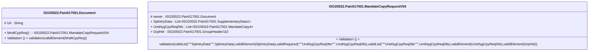

# pain.017.001.04-physical

> The tables below contain descriptions of the members of each Element. 
> The first column indicates the type of the member:
> A ‘#’ indicates that the field is a key to the element, and a ‘+’ indicates that the field is a value.
> The ‘*’ column contains a description for the element member.  
> The ‘@’ column contains any properties for the member.
> The ‘=’ column contains calculated values; or in the case of an enum, the serialized value.

---

## EntityImpl ISO20022.Pain017001.Document

| |Name|Type|*|@|=|
|-|-|-|-|-|-|
|#|Uri|String||XmlIgnore(), JsonIgnore()||
|+|MndtCpyReq|ISO20022.Pain017001.MandateCopyRequestV04||XmlElement()||
||Validation|Some(String)||XmlIgnore(), JsonIgnore()|validation(validElement(MndtCpyReq))|

---

## AspectImpl ISO20022.Pain017001.MandateCopyRequestV04

| |Name|Type|*|@|=|
|-|-|-|-|-|-|
|#|owner|ISO20022.Pain017001.Document||||
|+|SplmtryData|List<ISO20022.Pain017001.SupplementaryData1>||XmlElement()||
|+|UndrlygCpyReqDtls|List<ISO20022.Pain017001.MandateCopy4>||XmlElement()||
|+|GrpHdr|ISO20022.Pain017001.GroupHeader110||XmlElement()||
||Validation|Some(String)||XmlIgnore(), JsonIgnore()|validation(validList("""SplmtryData""",SplmtryData),validElement(SplmtryData),validRequired("""UndrlygCpyReqDtls""",UndrlygCpyReqDtls),validList("""UndrlygCpyReqDtls""",UndrlygCpyReqDtls),validElement(UndrlygCpyReqDtls),validElement(GrpHdr))|

