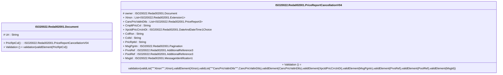

# reda.002.001.04-physical

> The tables below contain descriptions of the members of each Element. 
> The first column indicates the type of the member:
> A ‘#’ indicates that the field is a key to the element, and a ‘+’ indicates that the field is a value.
> The ‘*’ column contains a description for the element member.  
> The ‘@’ column contains any properties for the member.
> The ‘=’ column contains calculated values; or in the case of an enum, the serialized value.

---

## EntityImpl ISO20022.Reda002001.Document

| |Name|Type|*|@|=|
|-|-|-|-|-|-|
|#|Uri|String||XmlIgnore(), JsonIgnore()||
|+|PricRptCxl|ISO20022.Reda002001.PriceReportCancellationV04||XmlElement()||
||Validation|Some(String)||XmlIgnore(), JsonIgnore()|validation(validElement(PricRptCxl))|

---

## AspectImpl ISO20022.Reda002001.PriceReportCancellationV04

| |Name|Type|*|@|=|
|-|-|-|-|-|-|
|#|owner|ISO20022.Reda002001.Document||||
|+|Xtnsn|List<ISO20022.Reda002001.Extension1>||XmlElement()||
|+|CancPricValtnDtls|List<ISO20022.Reda002001.PriceReport3>||XmlElement()||
|+|CmpltPricCxl|String||XmlElement()||
|+|XpctdPricCrrctnDt|ISO20022.Reda002001.DateAndDateTime1Choice||XmlElement()||
|+|CxlRsn|String||XmlElement()||
|+|CxlId|String||XmlElement()||
|+|PricRptId|String||XmlElement()||
|+|MsgPgntn|ISO20022.Reda002001.Pagination||XmlElement()||
|+|PrvsRef|ISO20022.Reda002001.AdditionalReference3||XmlElement()||
|+|PoolRef|ISO20022.Reda002001.AdditionalReference3||XmlElement()||
|+|MsgId|ISO20022.Reda002001.MessageIdentification1||XmlElement()||
||Validation|Some(String)||XmlIgnore(), JsonIgnore()|validation(validList("""Xtnsn""",Xtnsn),validElement(Xtnsn),validList("""CancPricValtnDtls""",CancPricValtnDtls),validElement(CancPricValtnDtls),validElement(XpctdPricCrrctnDt),validElement(MsgPgntn),validElement(PrvsRef),validElement(PoolRef),validElement(MsgId))|

