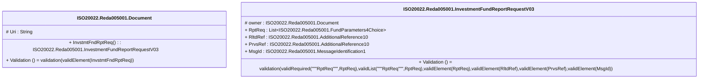

# reda.005.001.03-physical

> The tables below contain descriptions of the members of each Element. 
> The first column indicates the type of the member:
> A ‘#’ indicates that the field is a key to the element, and a ‘+’ indicates that the field is a value.
> The ‘*’ column contains a description for the element member.  
> The ‘@’ column contains any properties for the member.
> The ‘=’ column contains calculated values; or in the case of an enum, the serialized value.

---

## EntityImpl ISO20022.Reda005001.Document

| |Name|Type|*|@|=|
|-|-|-|-|-|-|
|#|Uri|String||XmlIgnore(), JsonIgnore()||
|+|InvstmtFndRptReq|ISO20022.Reda005001.InvestmentFundReportRequestV03||XmlElement()||
||Validation|Some(String)||XmlIgnore(), JsonIgnore()|validation(validElement(InvstmtFndRptReq))|

---

## AspectImpl ISO20022.Reda005001.InvestmentFundReportRequestV03

| |Name|Type|*|@|=|
|-|-|-|-|-|-|
|#|owner|ISO20022.Reda005001.Document||||
|+|RptReq|List<ISO20022.Reda005001.FundParameters4Choice>||XmlElement()||
|+|RltdRef|ISO20022.Reda005001.AdditionalReference10||XmlElement()||
|+|PrvsRef|ISO20022.Reda005001.AdditionalReference10||XmlElement()||
|+|MsgId|ISO20022.Reda005001.MessageIdentification1||XmlElement()||
||Validation|Some(String)||XmlIgnore(), JsonIgnore()|validation(validRequired("""RptReq""",RptReq),validList("""RptReq""",RptReq),validElement(RptReq),validElement(RltdRef),validElement(PrvsRef),validElement(MsgId))|

