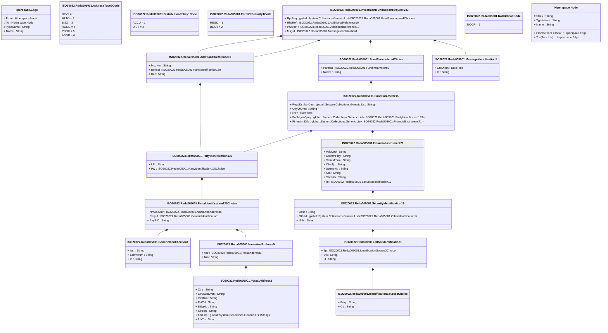

# reda.005.001.03

> The tables below contain descriptions of the members of each Element. 
> The first column indicates the type of the member:
> A ‘#’ indicates that the field is a key to the element, and a ‘+’ indicates that the field is a value.
> The ‘*’ column contains a description for the element member.  
> The ‘@’ column contains any properties for the member.
> The ‘=’ column contains calculated values; or in the case of an enum, the serialized value.

---

## View Hiperspace.Edge
edge between nodes

| |Name|Type|*|@|=|
|-|-|-|-|-|-|
|#|From|Hiperspace.Node||||
|#|To|Hiperspace.Node||||
|#|TypeName|String||||
|+|Name|String||||

---

## Value ISO20022.Reda005001.AdditionalReference10

| |Name|Type|*|@|=|
|-|-|-|-|-|-|
|+|MsgNm|String||XmlElement()||
|+|RefIssr|ISO20022.Reda005001.PartyIdentification139||XmlElement()||
|+|Ref|String||XmlElement()||
||Validation|Some(String)||XmlIgnore(), JsonIgnore()|validation(validElement(RefIssr))|

---

## Enum ISO20022.Reda005001.AddressType2Code

| |Name|Type|*|@|=|
|-|-|-|-|-|-|
||DLVY|Int32||XmlEnum("""DLVY""")|1|
||MLTO|Int32||XmlEnum("""MLTO""")|2|
||BIZZ|Int32||XmlEnum("""BIZZ""")|3|
||HOME|Int32||XmlEnum("""HOME""")|4|
||PBOX|Int32||XmlEnum("""PBOX""")|5|
||ADDR|Int32||XmlEnum("""ADDR""")|6|

---

## Enum ISO20022.Reda005001.DistributionPolicy1Code

| |Name|Type|*|@|=|
|-|-|-|-|-|-|
||ACCU|Int32||XmlEnum("""ACCU""")|1|
||DIST|Int32||XmlEnum("""DIST""")|2|

---

## Type ISO20022.Reda005001.Document

| |Name|Type|*|@|=|
|-|-|-|-|-|-|
|+|InvstmtFndRptReq|ISO20022.Reda005001.InvestmentFundReportRequestV03||XmlElement()||
||Validation|Some(String)||XmlIgnore(), JsonIgnore()|validation(validElement(InvstmtFndRptReq))|

---

## Value ISO20022.Reda005001.FinancialInstrument71

| |Name|Type|*|@|=|
|-|-|-|-|-|-|
|+|PdctGrp|String||XmlElement()||
|+|DstrbtnPlcy|String||XmlElement()||
|+|SctiesForm|String||XmlElement()||
|+|ClssTp|String||XmlElement()||
|+|SplmtryId|String||XmlElement()||
|+|Nm|String||XmlElement()||
|+|ShrtNm|String||XmlElement()||
|+|Id|ISO20022.Reda005001.SecurityIdentification19||XmlElement()||
||Validation|Some(String)||XmlIgnore(), JsonIgnore()|validation(validElement(Id))|

---

## Enum ISO20022.Reda005001.FormOfSecurity1Code

| |Name|Type|*|@|=|
|-|-|-|-|-|-|
||REGD|Int32||XmlEnum("""REGD""")|1|
||BEAR|Int32||XmlEnum("""BEAR""")|2|

---

## Value ISO20022.Reda005001.FundParameters4Choice

| |Name|Type|*|@|=|
|-|-|-|-|-|-|
|+|Params|ISO20022.Reda005001.FundParameters5||XmlElement()||
|+|NoCrit|String||XmlElement()||
||Validation|Some(String)||XmlIgnore(), JsonIgnore()|validation(validElement(Params),validChoice(Params,NoCrit))|

---

## Value ISO20022.Reda005001.FundParameters5

| |Name|Type|*|@|=|
|-|-|-|-|-|-|
|+|RegdDstrbtnCtry|global::System.Collections.Generic.List<String>||XmlElement()||
|+|CtryOfDmcl|String||XmlElement()||
|+|DtFr|DateTime||XmlElement()||
|+|FndMgmtCpny|global::System.Collections.Generic.List<ISO20022.Reda005001.PartyIdentification139>||XmlElement()||
|+|FinInstrmDtls|global::System.Collections.Generic.List<ISO20022.Reda005001.FinancialInstrument71>||XmlElement()||
||Validation|Some(String)||XmlIgnore(), JsonIgnore()|validation(validPattern("""RegdDstrbtnCtry""",RegdDstrbtnCtry,"""[A-Z]{2,2}"""),validPattern("""CtryOfDmcl""",CtryOfDmcl,"""[A-Z]{2,2}"""),validList("""FndMgmtCpny""",FndMgmtCpny),validElement(FndMgmtCpny),validList("""FinInstrmDtls""",FinInstrmDtls),validElement(FinInstrmDtls))|

---

## Value ISO20022.Reda005001.GenericIdentification1

| |Name|Type|*|@|=|
|-|-|-|-|-|-|
|+|Issr|String||XmlElement()||
|+|SchmeNm|String||XmlElement()||
|+|Id|String||XmlElement()||
||Validation|Some(String)||XmlIgnore(), JsonIgnore()|""|

---

## Value ISO20022.Reda005001.IdentificationSource3Choice

| |Name|Type|*|@|=|
|-|-|-|-|-|-|
|+|Prtry|String||XmlElement()||
|+|Cd|String||XmlElement()||
||Validation|Some(String)||XmlIgnore(), JsonIgnore()|validation(validChoice(Prtry,Cd))|

---

## Aspect ISO20022.Reda005001.InvestmentFundReportRequestV03

| |Name|Type|*|@|=|
|-|-|-|-|-|-|
|+|RptReq|global::System.Collections.Generic.List<ISO20022.Reda005001.FundParameters4Choice>||XmlElement()||
|+|RltdRef|ISO20022.Reda005001.AdditionalReference10||XmlElement()||
|+|PrvsRef|ISO20022.Reda005001.AdditionalReference10||XmlElement()||
|+|MsgId|ISO20022.Reda005001.MessageIdentification1||XmlElement()||
||Validation|Some(String)||XmlIgnore(), JsonIgnore()|validation(validRequired("""RptReq""",RptReq),validList("""RptReq""",RptReq),validElement(RptReq),validElement(RltdRef),validElement(PrvsRef),validElement(MsgId))|

---

## Value ISO20022.Reda005001.MessageIdentification1

| |Name|Type|*|@|=|
|-|-|-|-|-|-|
|+|CreDtTm|DateTime||XmlElement()||
|+|Id|String||XmlElement()||
||Validation|Some(String)||XmlIgnore(), JsonIgnore()|""|

---

## Value ISO20022.Reda005001.NameAndAddress5

| |Name|Type|*|@|=|
|-|-|-|-|-|-|
|+|Adr|ISO20022.Reda005001.PostalAddress1||XmlElement()||
|+|Nm|String||XmlElement()||
||Validation|Some(String)||XmlIgnore(), JsonIgnore()|validation(validElement(Adr))|

---

## Enum ISO20022.Reda005001.NoCriteria1Code

| |Name|Type|*|@|=|
|-|-|-|-|-|-|
||NOCR|Int32||XmlEnum("""NOCR""")|1|

---

## Value ISO20022.Reda005001.OtherIdentification1

| |Name|Type|*|@|=|
|-|-|-|-|-|-|
|+|Tp|ISO20022.Reda005001.IdentificationSource3Choice||XmlElement()||
|+|Sfx|String||XmlElement()||
|+|Id|String||XmlElement()||
||Validation|Some(String)||XmlIgnore(), JsonIgnore()|validation(validElement(Tp))|

---

## Value ISO20022.Reda005001.PartyIdentification125Choice

| |Name|Type|*|@|=|
|-|-|-|-|-|-|
|+|NmAndAdr|ISO20022.Reda005001.NameAndAddress5||XmlElement()||
|+|PrtryId|ISO20022.Reda005001.GenericIdentification1||XmlElement()||
|+|AnyBIC|String||XmlElement()||
||Validation|Some(String)||XmlIgnore(), JsonIgnore()|validation(validElement(NmAndAdr),validElement(PrtryId),validPattern("""AnyBIC""",AnyBIC,"""[A-Z0-9]{4,4}[A-Z]{2,2}[A-Z0-9]{2,2}([A-Z0-9]{3,3}){0,1}"""),validChoice(NmAndAdr,PrtryId,AnyBIC))|

---

## Value ISO20022.Reda005001.PartyIdentification139

| |Name|Type|*|@|=|
|-|-|-|-|-|-|
|+|LEI|String||XmlElement()||
|+|Pty|ISO20022.Reda005001.PartyIdentification125Choice||XmlElement()||
||Validation|Some(String)||XmlIgnore(), JsonIgnore()|validation(validPattern("""LEI""",LEI,"""[A-Z0-9]{18,18}[0-9]{2,2}"""),validElement(Pty))|

---

## Value ISO20022.Reda005001.PostalAddress1

| |Name|Type|*|@|=|
|-|-|-|-|-|-|
|+|Ctry|String||XmlElement()||
|+|CtrySubDvsn|String||XmlElement()||
|+|TwnNm|String||XmlElement()||
|+|PstCd|String||XmlElement()||
|+|BldgNb|String||XmlElement()||
|+|StrtNm|String||XmlElement()||
|+|AdrLine|global::System.Collections.Generic.List<String>||XmlElement()||
|+|AdrTp|String||XmlElement()||
||Validation|Some(String)||XmlIgnore(), JsonIgnore()|validation(validPattern("""Ctry""",Ctry,"""[A-Z]{2,2}"""),validListMax("""AdrLine""",AdrLine,5))|

---

## Value ISO20022.Reda005001.SecurityIdentification19

| |Name|Type|*|@|=|
|-|-|-|-|-|-|
|+|Desc|String||XmlElement()||
|+|OthrId|global::System.Collections.Generic.List<ISO20022.Reda005001.OtherIdentification1>||XmlElement()||
|+|ISIN|String||XmlElement()||
||Validation|Some(String)||XmlIgnore(), JsonIgnore()|validation(validList("""OthrId""",OthrId),validElement(OthrId),validPattern("""ISIN""",ISIN,"""[A-Z]{2,2}[A-Z0-9]{9,9}[0-9]{1,1}"""))|

---

## View Hiperspace.Node
node in a graph view of data

| |Name|Type|*|@|=|
|-|-|-|-|-|-|
|#|SKey|String||||
|+|TypeName|String||||
|+|Name|String||||
||Froms|Hiperspace.Edge|||From = this|
||Tos|Hiperspace.Edge|||To = this|

