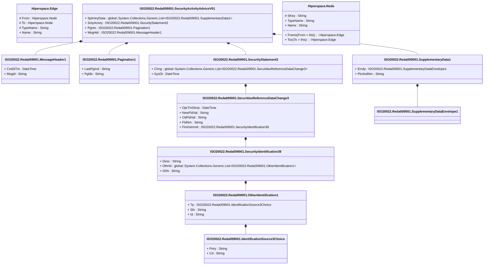

# reda.009.001.01

> The tables below contain descriptions of the members of each Element. 
> The first column indicates the type of the member:
> A ‘#’ indicates that the field is a key to the element, and a ‘+’ indicates that the field is a value.
> The ‘*’ column contains a description for the element member.  
> The ‘@’ column contains any properties for the member.
> The ‘=’ column contains calculated values; or in the case of an enum, the serialized value.

---

## View Hiperspace.Edge
edge between nodes

| |Name|Type|*|@|=|
|-|-|-|-|-|-|
|#|From|Hiperspace.Node||||
|#|To|Hiperspace.Node||||
|#|TypeName|String||||
|+|Name|String||||

---

## Type ISO20022.Reda009001.Document

| |Name|Type|*|@|=|
|-|-|-|-|-|-|
|+|SctyActvtyAdvc|ISO20022.Reda009001.SecurityActivityAdviceV01||XmlElement()||
||Validation|Some(String)||XmlIgnore(), JsonIgnore()|validation(validElement(SctyActvtyAdvc))|

---

## Value ISO20022.Reda009001.IdentificationSource3Choice

| |Name|Type|*|@|=|
|-|-|-|-|-|-|
|+|Prtry|String||XmlElement()||
|+|Cd|String||XmlElement()||
||Validation|Some(String)||XmlIgnore(), JsonIgnore()|validation(validChoice(Prtry,Cd))|

---

## Value ISO20022.Reda009001.MessageHeader1

| |Name|Type|*|@|=|
|-|-|-|-|-|-|
|+|CreDtTm|DateTime||XmlElement()||
|+|MsgId|String||XmlElement()||
||Validation|Some(String)||XmlIgnore(), JsonIgnore()|""|

---

## Value ISO20022.Reda009001.OtherIdentification1

| |Name|Type|*|@|=|
|-|-|-|-|-|-|
|+|Tp|ISO20022.Reda009001.IdentificationSource3Choice||XmlElement()||
|+|Sfx|String||XmlElement()||
|+|Id|String||XmlElement()||
||Validation|Some(String)||XmlIgnore(), JsonIgnore()|validation(validElement(Tp))|

---

## Value ISO20022.Reda009001.Pagination1

| |Name|Type|*|@|=|
|-|-|-|-|-|-|
|+|LastPgInd|String||XmlElement()||
|+|PgNb|String||XmlElement()||
||Validation|Some(String)||XmlIgnore(), JsonIgnore()|validation(validPattern("""PgNb""",PgNb,"""[0-9]{1,5}"""))|

---

## Value ISO20022.Reda009001.SecuritiesReferenceDataChange3

| |Name|Type|*|@|=|
|-|-|-|-|-|-|
|+|OprTmStmp|DateTime||XmlElement()||
|+|NewFldVal|String||XmlElement()||
|+|OdFldVal|String||XmlElement()||
|+|FldNm|String||XmlElement()||
|+|FinInstrmId|ISO20022.Reda009001.SecurityIdentification39||XmlElement()||
||Validation|Some(String)||XmlIgnore(), JsonIgnore()|validation(validElement(FinInstrmId))|

---

## Aspect ISO20022.Reda009001.SecurityActivityAdviceV01

| |Name|Type|*|@|=|
|-|-|-|-|-|-|
|+|SplmtryData|global::System.Collections.Generic.List<ISO20022.Reda009001.SupplementaryData1>||XmlElement()||
|+|SctyActvty|ISO20022.Reda009001.SecurityStatement3||XmlElement()||
|+|Pgntn|ISO20022.Reda009001.Pagination1||XmlElement()||
|+|MsgHdr|ISO20022.Reda009001.MessageHeader1||XmlElement()||
||Validation|Some(String)||XmlIgnore(), JsonIgnore()|validation(validList("""SplmtryData""",SplmtryData),validElement(SplmtryData),validElement(SctyActvty),validElement(Pgntn),validElement(MsgHdr))|

---

## Value ISO20022.Reda009001.SecurityIdentification39

| |Name|Type|*|@|=|
|-|-|-|-|-|-|
|+|Desc|String||XmlElement()||
|+|OthrId|global::System.Collections.Generic.List<ISO20022.Reda009001.OtherIdentification1>||XmlElement()||
|+|ISIN|String||XmlElement()||
||Validation|Some(String)||XmlIgnore(), JsonIgnore()|validation(validList("""OthrId""",OthrId),validElement(OthrId),validPattern("""ISIN""",ISIN,"""[A-Z]{2,2}[A-Z0-9]{9,9}[0-9]{1,1}"""))|

---

## Value ISO20022.Reda009001.SecurityStatement3

| |Name|Type|*|@|=|
|-|-|-|-|-|-|
|+|Chng|global::System.Collections.Generic.List<ISO20022.Reda009001.SecuritiesReferenceDataChange3>||XmlElement()||
|+|SysDt|DateTime||XmlElement()||
||Validation|Some(String)||XmlIgnore(), JsonIgnore()|validation(validList("""Chng""",Chng),validElement(Chng))|

---

## Value ISO20022.Reda009001.SupplementaryData1

| |Name|Type|*|@|=|
|-|-|-|-|-|-|
|+|Envlp|ISO20022.Reda009001.SupplementaryDataEnvelope1||XmlElement()||
|+|PlcAndNm|String||XmlElement()||
||Validation|Some(String)||XmlIgnore(), JsonIgnore()|validation(validElement(Envlp))|

---

## Value ISO20022.Reda009001.SupplementaryDataEnvelope1

| |Name|Type|*|@|=|
|-|-|-|-|-|-|
||Validation|Some(String)||XmlIgnore(), JsonIgnore()|""|

---

## View Hiperspace.Node
node in a graph view of data

| |Name|Type|*|@|=|
|-|-|-|-|-|-|
|#|SKey|String||||
|+|TypeName|String||||
|+|Name|String||||
||Froms|Hiperspace.Edge|||From = this|
||Tos|Hiperspace.Edge|||To = this|

