# reda.010.001.01

```mermaid
classDiagram
    class Hiperspace.Edge {
        # From  : Hiperspace.Node
        # To  : Hiperspace.Node
        # TypeName  : String
        + Name  : String
    }
    class ISO20022.Reda010001.AddressType2Code {
        DLVY = 1
        MLTO = 2
        BIZZ = 3
        HOME = 4
        PBOX = 5
        ADDR = 6
    }
    class ISO20022.Reda010001.DatePeriod2 {
        + ToDt  : DateTime
        + FrDt  : DateTime
    }
    class ISO20022.Reda010001.DatePeriodSearch1Choice {
        + NEQDt  : DateTime
        + EQDt  : DateTime
        + FrToDt  : ISO20022.Reda010001.DatePeriod2
        + ToDt  : DateTime
        + FrDt  : DateTime
    }
    ISO20022.Reda010001.DatePeriodSearch1Choice *-- ISO20022.Reda010001.DatePeriod2
    class ISO20022.Reda010001.GenericIdentification1 {
        + Issr  : String
        + SchmeNm  : String
        + Id  : String
    }
    class ISO20022.Reda010001.GenericIdentification30 {
        + SchmeNm  : String
        + Issr  : String
        + Id  : String
    }
    class ISO20022.Reda010001.GenericIdentification36 {
        + SchmeNm  : String
        + Issr  : String
        + Id  : String
    }
    class ISO20022.Reda010001.IdentificationSource3Choice {
        + Prtry  : String
        + Cd  : String
    }
    class ISO20022.Reda010001.MessageHeader1 {
        + CreDtTm  : DateTime
        + MsgId  : String
    }
    class ISO20022.Reda010001.NameAndAddress5 {
        + Adr  : ISO20022.Reda010001.PostalAddress1
        + Nm  : String
    }
    ISO20022.Reda010001.NameAndAddress5 *-- ISO20022.Reda010001.PostalAddress1
    class ISO20022.Reda010001.OtherIdentification1 {
        + Tp  : ISO20022.Reda010001.IdentificationSource3Choice
        + Sfx  : String
        + Id  : String
    }
    ISO20022.Reda010001.OtherIdentification1 *-- ISO20022.Reda010001.IdentificationSource3Choice
    class ISO20022.Reda010001.PartyIdentification120Choice {
        + NmAndAdr  : ISO20022.Reda010001.NameAndAddress5
        + PrtryId  : ISO20022.Reda010001.GenericIdentification36
        + AnyBIC  : String
    }
    ISO20022.Reda010001.PartyIdentification120Choice *-- ISO20022.Reda010001.NameAndAddress5
    ISO20022.Reda010001.PartyIdentification120Choice *-- ISO20022.Reda010001.GenericIdentification36
    class ISO20022.Reda010001.PartyIdentification136 {
        + LEI  : String
        + Id  : ISO20022.Reda010001.PartyIdentification120Choice
    }
    ISO20022.Reda010001.PartyIdentification136 *-- ISO20022.Reda010001.PartyIdentification120Choice
    class ISO20022.Reda010001.PostalAddress1 {
        + Ctry  : String
        + CtrySubDvsn  : String
        + TwnNm  : String
        + PstCd  : String
        + BldgNb  : String
        + StrtNm  : String
        + AdrLine  : global::System.Collections.Generic.List~String~
        + AdrTp  : String
    }
    class ISO20022.Reda010001.SecuritiesReturnCriteria1 {
        + DevtgSttlmUnit  : String
        + MinMltplQty  : String
        + MinDnmtn  : String
        + SctiesQtyTp  : String
        + CSD  : String
        + TechIssrCSD  : String
        + IssrCSD  : String
        + InvstrCSD  : String
        + SctySts  : String
        + CtryOfIsse  : String
        + IsseCcy  : String
        + IsseDt  : String
        + MtrtyDt  : String
        + ClssfctnFinInstrm  : String
        + ISOSctyShrtNm  : String
        + ISOSctyLngNm  : String
        + FinInstrmId  : String
    }
    class ISO20022.Reda010001.SecuritiesSearchCriteria4 {
        + CSD  : ISO20022.Reda010001.SystemPartyIdentification2Choice
        + TechIssrCSD  : ISO20022.Reda010001.SystemPartyIdentification2Choice
        + IssrCSD  : ISO20022.Reda010001.SystemPartyIdentification2Choice
        + InvstrCSD  : ISO20022.Reda010001.SystemPartyIdentification2Choice
        + MntngCSD  : ISO20022.Reda010001.SystemPartyIdentification2Choice
        + SctySts  : ISO20022.Reda010001.SecurityStatus3Choice
        + CtryOfIsse  : String
        + IsseCcy  : String
        + IsseDt  : ISO20022.Reda010001.DatePeriodSearch1Choice
        + MtrtyDt  : ISO20022.Reda010001.DatePeriodSearch1Choice
        + ClssfctnFinInstrm  : String
        + FinInstrmId  : ISO20022.Reda010001.SecurityIdentification39
    }
    ISO20022.Reda010001.SecuritiesSearchCriteria4 *-- ISO20022.Reda010001.SystemPartyIdentification2Choice
    ISO20022.Reda010001.SecuritiesSearchCriteria4 *-- ISO20022.Reda010001.SystemPartyIdentification2Choice
    ISO20022.Reda010001.SecuritiesSearchCriteria4 *-- ISO20022.Reda010001.SystemPartyIdentification2Choice
    ISO20022.Reda010001.SecuritiesSearchCriteria4 *-- ISO20022.Reda010001.SystemPartyIdentification2Choice
    ISO20022.Reda010001.SecuritiesSearchCriteria4 *-- ISO20022.Reda010001.SystemPartyIdentification2Choice
    ISO20022.Reda010001.SecuritiesSearchCriteria4 *-- ISO20022.Reda010001.SecurityStatus3Choice
    ISO20022.Reda010001.SecuritiesSearchCriteria4 *-- ISO20022.Reda010001.DatePeriodSearch1Choice
    ISO20022.Reda010001.SecuritiesSearchCriteria4 *-- ISO20022.Reda010001.DatePeriodSearch1Choice
    ISO20022.Reda010001.SecuritiesSearchCriteria4 *-- ISO20022.Reda010001.SecurityIdentification39
    class ISO20022.Reda010001.SecurityIdentification39 {
        + Desc  : String
        + OthrId  : global::System.Collections.Generic.List~ISO20022.Reda010001.OtherIdentification1~
        + ISIN  : String
    }
    ISO20022.Reda010001.SecurityIdentification39 *-- ISO20022.Reda010001.OtherIdentification1
    class ISO20022.Reda010001.SecurityQueryV01 {
        + SplmtryData  : global::System.Collections.Generic.List~ISO20022.Reda010001.SupplementaryData1~
        + SmlSetRtrCrit  : ISO20022.Reda010001.SecuritiesReturnCriteria1
        + SchCrit  : ISO20022.Reda010001.SecuritiesSearchCriteria4
        + ReqTp  : ISO20022.Reda010001.GenericIdentification1
        + MsgHdr  : ISO20022.Reda010001.MessageHeader1
    }
    ISO20022.Reda010001.SecurityQueryV01 *-- ISO20022.Reda010001.SupplementaryData1
    ISO20022.Reda010001.SecurityQueryV01 *-- ISO20022.Reda010001.SecuritiesReturnCriteria1
    ISO20022.Reda010001.SecurityQueryV01 *-- ISO20022.Reda010001.SecuritiesSearchCriteria4
    ISO20022.Reda010001.SecurityQueryV01 *-- ISO20022.Reda010001.GenericIdentification1
    ISO20022.Reda010001.SecurityQueryV01 *-- ISO20022.Reda010001.MessageHeader1
    class ISO20022.Reda010001.SecurityStatus2Code {
        SUSP = 1
        INAC = 2
        ACTV = 3
    }
    class ISO20022.Reda010001.SecurityStatus3Choice {
        + Prtry  : ISO20022.Reda010001.GenericIdentification30
        + Cd  : String
    }
    ISO20022.Reda010001.SecurityStatus3Choice *-- ISO20022.Reda010001.GenericIdentification30
    class ISO20022.Reda010001.SupplementaryData1 {
        + Envlp  : ISO20022.Reda010001.SupplementaryDataEnvelope1
        + PlcAndNm  : String
    }
    ISO20022.Reda010001.SupplementaryData1 *-- ISO20022.Reda010001.SupplementaryDataEnvelope1
    class ISO20022.Reda010001.SupplementaryDataEnvelope1 {
    }
    class ISO20022.Reda010001.SystemPartyIdentification2Choice {
        + CmbndId  : ISO20022.Reda010001.SystemPartyIdentification8
        + OrgId  : ISO20022.Reda010001.PartyIdentification136
    }
    ISO20022.Reda010001.SystemPartyIdentification2Choice *-- ISO20022.Reda010001.SystemPartyIdentification8
    ISO20022.Reda010001.SystemPartyIdentification2Choice *-- ISO20022.Reda010001.PartyIdentification136
    class ISO20022.Reda010001.SystemPartyIdentification8 {
        + RspnsblPtyId  : ISO20022.Reda010001.PartyIdentification136
        + Id  : ISO20022.Reda010001.PartyIdentification136
    }
    ISO20022.Reda010001.SystemPartyIdentification8 *-- ISO20022.Reda010001.PartyIdentification136
    ISO20022.Reda010001.SystemPartyIdentification8 *-- ISO20022.Reda010001.PartyIdentification136
    class Hiperspace.Node {
        # SKey  : String
        + TypeName  : String
        + Name  : String
        + Froms (From = this) : Hiperspace.Edge
        + Tos (To = this) : Hiperspace.Edge
    }
```

> The tables below contain descriptions of the members of each Element. 
> The first column indicates the type of the member:
> A ‘#’ indicates that the field is a key to the element, and a ‘+’ indicates that the field is a value.
> The ‘*’ column contains a description for the element member.  
> The ‘@’ column contains any properties for the member.
> The ‘=’ column contains calculated values; or in the case of an enum, the serialized value.

---

## View Hiperspace.Edge
edge between nodes

| |Name|Type|*|@|=|
|-|-|-|-|-|-|
|#|From|Hiperspace.Node||||
|#|To|Hiperspace.Node||||
|#|TypeName|String||||
|+|Name|String||||

---

## Enum ISO20022.Reda010001.AddressType2Code

| |Name|Type|*|@|=|
|-|-|-|-|-|-|
||DLVY|Int32||XmlEnum("""DLVY""")|1|
||MLTO|Int32||XmlEnum("""MLTO""")|2|
||BIZZ|Int32||XmlEnum("""BIZZ""")|3|
||HOME|Int32||XmlEnum("""HOME""")|4|
||PBOX|Int32||XmlEnum("""PBOX""")|5|
||ADDR|Int32||XmlEnum("""ADDR""")|6|

---

## Value ISO20022.Reda010001.DatePeriod2

| |Name|Type|*|@|=|
|-|-|-|-|-|-|
|+|ToDt|DateTime||XmlElement()||
|+|FrDt|DateTime||XmlElement()||
||Validation|Some(String)||XmlIgnore(), JsonIgnore()|""|

---

## Value ISO20022.Reda010001.DatePeriodSearch1Choice

| |Name|Type|*|@|=|
|-|-|-|-|-|-|
|+|NEQDt|DateTime||XmlElement()||
|+|EQDt|DateTime||XmlElement()||
|+|FrToDt|ISO20022.Reda010001.DatePeriod2||XmlElement()||
|+|ToDt|DateTime||XmlElement()||
|+|FrDt|DateTime||XmlElement()||
||Validation|Some(String)||XmlIgnore(), JsonIgnore()|validation(validElement(FrToDt),validChoice(NEQDt,EQDt,FrToDt,ToDt,FrDt))|

---

## Type ISO20022.Reda010001.Document

| |Name|Type|*|@|=|
|-|-|-|-|-|-|
|+|SctyQry|ISO20022.Reda010001.SecurityQueryV01||XmlElement()||
||Validation|Some(String)||XmlIgnore(), JsonIgnore()|validation(validElement(SctyQry))|

---

## Value ISO20022.Reda010001.GenericIdentification1

| |Name|Type|*|@|=|
|-|-|-|-|-|-|
|+|Issr|String||XmlElement()||
|+|SchmeNm|String||XmlElement()||
|+|Id|String||XmlElement()||
||Validation|Some(String)||XmlIgnore(), JsonIgnore()|""|

---

## Value ISO20022.Reda010001.GenericIdentification30

| |Name|Type|*|@|=|
|-|-|-|-|-|-|
|+|SchmeNm|String||XmlElement()||
|+|Issr|String||XmlElement()||
|+|Id|String||XmlElement()||
||Validation|Some(String)||XmlIgnore(), JsonIgnore()|validation(validPattern("""Id""",Id,"""[a-zA-Z0-9]{4}"""))|

---

## Value ISO20022.Reda010001.GenericIdentification36

| |Name|Type|*|@|=|
|-|-|-|-|-|-|
|+|SchmeNm|String||XmlElement()||
|+|Issr|String||XmlElement()||
|+|Id|String||XmlElement()||
||Validation|Some(String)||XmlIgnore(), JsonIgnore()|""|

---

## Value ISO20022.Reda010001.IdentificationSource3Choice

| |Name|Type|*|@|=|
|-|-|-|-|-|-|
|+|Prtry|String||XmlElement()||
|+|Cd|String||XmlElement()||
||Validation|Some(String)||XmlIgnore(), JsonIgnore()|validation(validChoice(Prtry,Cd))|

---

## Value ISO20022.Reda010001.MessageHeader1

| |Name|Type|*|@|=|
|-|-|-|-|-|-|
|+|CreDtTm|DateTime||XmlElement()||
|+|MsgId|String||XmlElement()||
||Validation|Some(String)||XmlIgnore(), JsonIgnore()|""|

---

## Value ISO20022.Reda010001.NameAndAddress5

| |Name|Type|*|@|=|
|-|-|-|-|-|-|
|+|Adr|ISO20022.Reda010001.PostalAddress1||XmlElement()||
|+|Nm|String||XmlElement()||
||Validation|Some(String)||XmlIgnore(), JsonIgnore()|validation(validElement(Adr))|

---

## Value ISO20022.Reda010001.OtherIdentification1

| |Name|Type|*|@|=|
|-|-|-|-|-|-|
|+|Tp|ISO20022.Reda010001.IdentificationSource3Choice||XmlElement()||
|+|Sfx|String||XmlElement()||
|+|Id|String||XmlElement()||
||Validation|Some(String)||XmlIgnore(), JsonIgnore()|validation(validElement(Tp))|

---

## Value ISO20022.Reda010001.PartyIdentification120Choice

| |Name|Type|*|@|=|
|-|-|-|-|-|-|
|+|NmAndAdr|ISO20022.Reda010001.NameAndAddress5||XmlElement()||
|+|PrtryId|ISO20022.Reda010001.GenericIdentification36||XmlElement()||
|+|AnyBIC|String||XmlElement()||
||Validation|Some(String)||XmlIgnore(), JsonIgnore()|validation(validElement(NmAndAdr),validElement(PrtryId),validPattern("""AnyBIC""",AnyBIC,"""[A-Z0-9]{4,4}[A-Z]{2,2}[A-Z0-9]{2,2}([A-Z0-9]{3,3}){0,1}"""),validChoice(NmAndAdr,PrtryId,AnyBIC))|

---

## Value ISO20022.Reda010001.PartyIdentification136

| |Name|Type|*|@|=|
|-|-|-|-|-|-|
|+|LEI|String||XmlElement()||
|+|Id|ISO20022.Reda010001.PartyIdentification120Choice||XmlElement()||
||Validation|Some(String)||XmlIgnore(), JsonIgnore()|validation(validPattern("""LEI""",LEI,"""[A-Z0-9]{18,18}[0-9]{2,2}"""),validElement(Id))|

---

## Value ISO20022.Reda010001.PostalAddress1

| |Name|Type|*|@|=|
|-|-|-|-|-|-|
|+|Ctry|String||XmlElement()||
|+|CtrySubDvsn|String||XmlElement()||
|+|TwnNm|String||XmlElement()||
|+|PstCd|String||XmlElement()||
|+|BldgNb|String||XmlElement()||
|+|StrtNm|String||XmlElement()||
|+|AdrLine|global::System.Collections.Generic.List<String>||XmlElement()||
|+|AdrTp|String||XmlElement()||
||Validation|Some(String)||XmlIgnore(), JsonIgnore()|validation(validPattern("""Ctry""",Ctry,"""[A-Z]{2,2}"""),validListMax("""AdrLine""",AdrLine,5))|

---

## Value ISO20022.Reda010001.SecuritiesReturnCriteria1

| |Name|Type|*|@|=|
|-|-|-|-|-|-|
|+|DevtgSttlmUnit|String||XmlElement()||
|+|MinMltplQty|String||XmlElement()||
|+|MinDnmtn|String||XmlElement()||
|+|SctiesQtyTp|String||XmlElement()||
|+|CSD|String||XmlElement()||
|+|TechIssrCSD|String||XmlElement()||
|+|IssrCSD|String||XmlElement()||
|+|InvstrCSD|String||XmlElement()||
|+|SctySts|String||XmlElement()||
|+|CtryOfIsse|String||XmlElement()||
|+|IsseCcy|String||XmlElement()||
|+|IsseDt|String||XmlElement()||
|+|MtrtyDt|String||XmlElement()||
|+|ClssfctnFinInstrm|String||XmlElement()||
|+|ISOSctyShrtNm|String||XmlElement()||
|+|ISOSctyLngNm|String||XmlElement()||
|+|FinInstrmId|String||XmlElement()||
||Validation|Some(String)||XmlIgnore(), JsonIgnore()|""|

---

## Value ISO20022.Reda010001.SecuritiesSearchCriteria4

| |Name|Type|*|@|=|
|-|-|-|-|-|-|
|+|CSD|ISO20022.Reda010001.SystemPartyIdentification2Choice||XmlElement()||
|+|TechIssrCSD|ISO20022.Reda010001.SystemPartyIdentification2Choice||XmlElement()||
|+|IssrCSD|ISO20022.Reda010001.SystemPartyIdentification2Choice||XmlElement()||
|+|InvstrCSD|ISO20022.Reda010001.SystemPartyIdentification2Choice||XmlElement()||
|+|MntngCSD|ISO20022.Reda010001.SystemPartyIdentification2Choice||XmlElement()||
|+|SctySts|ISO20022.Reda010001.SecurityStatus3Choice||XmlElement()||
|+|CtryOfIsse|String||XmlElement()||
|+|IsseCcy|String||XmlElement()||
|+|IsseDt|ISO20022.Reda010001.DatePeriodSearch1Choice||XmlElement()||
|+|MtrtyDt|ISO20022.Reda010001.DatePeriodSearch1Choice||XmlElement()||
|+|ClssfctnFinInstrm|String||XmlElement()||
|+|FinInstrmId|ISO20022.Reda010001.SecurityIdentification39||XmlElement()||
||Validation|Some(String)||XmlIgnore(), JsonIgnore()|validation(validElement(CSD),validElement(TechIssrCSD),validElement(IssrCSD),validElement(InvstrCSD),validElement(MntngCSD),validElement(SctySts),validPattern("""CtryOfIsse""",CtryOfIsse,"""[A-Z]{2,2}"""),validPattern("""IsseCcy""",IsseCcy,"""[A-Z]{3,3}"""),validElement(IsseDt),validElement(MtrtyDt),validPattern("""ClssfctnFinInstrm""",ClssfctnFinInstrm,"""[A-Z]{6,6}"""),validElement(FinInstrmId))|

---

## Value ISO20022.Reda010001.SecurityIdentification39

| |Name|Type|*|@|=|
|-|-|-|-|-|-|
|+|Desc|String||XmlElement()||
|+|OthrId|global::System.Collections.Generic.List<ISO20022.Reda010001.OtherIdentification1>||XmlElement()||
|+|ISIN|String||XmlElement()||
||Validation|Some(String)||XmlIgnore(), JsonIgnore()|validation(validList("""OthrId""",OthrId),validElement(OthrId),validPattern("""ISIN""",ISIN,"""[A-Z]{2,2}[A-Z0-9]{9,9}[0-9]{1,1}"""))|

---

## Aspect ISO20022.Reda010001.SecurityQueryV01

| |Name|Type|*|@|=|
|-|-|-|-|-|-|
|+|SplmtryData|global::System.Collections.Generic.List<ISO20022.Reda010001.SupplementaryData1>||XmlElement()||
|+|SmlSetRtrCrit|ISO20022.Reda010001.SecuritiesReturnCriteria1||XmlElement()||
|+|SchCrit|ISO20022.Reda010001.SecuritiesSearchCriteria4||XmlElement()||
|+|ReqTp|ISO20022.Reda010001.GenericIdentification1||XmlElement()||
|+|MsgHdr|ISO20022.Reda010001.MessageHeader1||XmlElement()||
||Validation|Some(String)||XmlIgnore(), JsonIgnore()|validation(validList("""SplmtryData""",SplmtryData),validElement(SplmtryData),validElement(SmlSetRtrCrit),validElement(SchCrit),validElement(ReqTp),validElement(MsgHdr))|

---

## Enum ISO20022.Reda010001.SecurityStatus2Code

| |Name|Type|*|@|=|
|-|-|-|-|-|-|
||SUSP|Int32||XmlEnum("""SUSP""")|1|
||INAC|Int32||XmlEnum("""INAC""")|2|
||ACTV|Int32||XmlEnum("""ACTV""")|3|

---

## Value ISO20022.Reda010001.SecurityStatus3Choice

| |Name|Type|*|@|=|
|-|-|-|-|-|-|
|+|Prtry|ISO20022.Reda010001.GenericIdentification30||XmlElement()||
|+|Cd|String||XmlElement()||
||Validation|Some(String)||XmlIgnore(), JsonIgnore()|validation(validElement(Prtry),validChoice(Prtry,Cd))|

---

## Value ISO20022.Reda010001.SupplementaryData1

| |Name|Type|*|@|=|
|-|-|-|-|-|-|
|+|Envlp|ISO20022.Reda010001.SupplementaryDataEnvelope1||XmlElement()||
|+|PlcAndNm|String||XmlElement()||
||Validation|Some(String)||XmlIgnore(), JsonIgnore()|validation(validElement(Envlp))|

---

## Value ISO20022.Reda010001.SupplementaryDataEnvelope1

| |Name|Type|*|@|=|
|-|-|-|-|-|-|
||Validation|Some(String)||XmlIgnore(), JsonIgnore()|""|

---

## Value ISO20022.Reda010001.SystemPartyIdentification2Choice

| |Name|Type|*|@|=|
|-|-|-|-|-|-|
|+|CmbndId|ISO20022.Reda010001.SystemPartyIdentification8||XmlElement()||
|+|OrgId|ISO20022.Reda010001.PartyIdentification136||XmlElement()||
||Validation|Some(String)||XmlIgnore(), JsonIgnore()|validation(validElement(CmbndId),validElement(OrgId),validChoice(CmbndId,OrgId))|

---

## Value ISO20022.Reda010001.SystemPartyIdentification8

| |Name|Type|*|@|=|
|-|-|-|-|-|-|
|+|RspnsblPtyId|ISO20022.Reda010001.PartyIdentification136||XmlElement()||
|+|Id|ISO20022.Reda010001.PartyIdentification136||XmlElement()||
||Validation|Some(String)||XmlIgnore(), JsonIgnore()|validation(validElement(RspnsblPtyId),validElement(Id))|

---

## View Hiperspace.Node
node in a graph view of data

| |Name|Type|*|@|=|
|-|-|-|-|-|-|
|#|SKey|String||||
|+|TypeName|String||||
|+|Name|String||||
||Froms|Hiperspace.Edge|||From = this|
||Tos|Hiperspace.Edge|||To = this|

