# reda.014.001.02

```mermaid
classDiagram
    class Hiperspace.Edge {
        # From  : Hiperspace.Node
        # To  : Hiperspace.Node
        # TypeName  : String
        + Name  : String
    }
    class ISO20022.Reda014001.AddressType2Code {
        DLVY = 1
        MLTO = 2
        BIZZ = 3
        HOME = 4
        PBOX = 5
        ADDR = 6
    }
    class ISO20022.Reda014001.AddressType3Choice {
        + Prtry  : ISO20022.Reda014001.GenericIdentification30
        + Cd  : String
    }
    ISO20022.Reda014001.AddressType3Choice *-- ISO20022.Reda014001.GenericIdentification30
    class ISO20022.Reda014001.Contact14 {
        + VldTo  : DateTime
        + VldFr  : DateTime
        + PrefrdMtd  : String
        + Othr  : global::System.Collections.Generic.List~ISO20022.Reda014001.OtherContact1~
        + Dept  : String
        + Rspnsblty  : String
        + JobTitl  : String
        + EmailPurp  : String
        + EmailAdr  : String
        + URLAdr  : String
        + FaxNb  : String
        + MobNb  : String
        + PhneNb  : String
        + Nm  : String
        + NmPrfx  : String
    }
    ISO20022.Reda014001.Contact14 *-- ISO20022.Reda014001.OtherContact1
    class ISO20022.Reda014001.GenericIdentification30 {
        + SchmeNm  : String
        + Issr  : String
        + Id  : String
    }
    class ISO20022.Reda014001.GenericIdentification36 {
        + SchmeNm  : String
        + Issr  : String
        + Id  : String
    }
    class ISO20022.Reda014001.LockStatus1Code {
        ULCK = 1
        LOCK = 2
    }
    class ISO20022.Reda014001.MarketSpecificAttribute1 {
        + Val  : String
        + Nm  : String
    }
    class ISO20022.Reda014001.MessageHeader1 {
        + CreDtTm  : DateTime
        + MsgId  : String
    }
    class ISO20022.Reda014001.NameAndAddress5 {
        + Adr  : ISO20022.Reda014001.PostalAddress1
        + Nm  : String
    }
    ISO20022.Reda014001.NameAndAddress5 *-- ISO20022.Reda014001.PostalAddress1
    class ISO20022.Reda014001.NamePrefix2Code {
        MIKS = 1
        MIST = 2
        MISS = 3
        MADM = 4
        DOCT = 5
    }
    class ISO20022.Reda014001.OtherContact1 {
        + Id  : String
        + ChanlTp  : String
    }
    class ISO20022.Reda014001.PartyCreationRequestV02 {
        + SplmtryData  : global::System.Collections.Generic.List~ISO20022.Reda014001.SupplementaryData1~
        + Pty  : ISO20022.Reda014001.SystemParty7
        + MsgHdr  : ISO20022.Reda014001.MessageHeader1
    }
    ISO20022.Reda014001.PartyCreationRequestV02 *-- ISO20022.Reda014001.SupplementaryData1
    ISO20022.Reda014001.PartyCreationRequestV02 *-- ISO20022.Reda014001.SystemParty7
    ISO20022.Reda014001.PartyCreationRequestV02 *-- ISO20022.Reda014001.MessageHeader1
    class ISO20022.Reda014001.PartyIdentification120Choice {
        + NmAndAdr  : ISO20022.Reda014001.NameAndAddress5
        + PrtryId  : ISO20022.Reda014001.GenericIdentification36
        + AnyBIC  : String
    }
    ISO20022.Reda014001.PartyIdentification120Choice *-- ISO20022.Reda014001.NameAndAddress5
    ISO20022.Reda014001.PartyIdentification120Choice *-- ISO20022.Reda014001.GenericIdentification36
    class ISO20022.Reda014001.PartyIdentification136 {
        + LEI  : String
        + Id  : ISO20022.Reda014001.PartyIdentification120Choice
    }
    ISO20022.Reda014001.PartyIdentification136 *-- ISO20022.Reda014001.PartyIdentification120Choice
    class ISO20022.Reda014001.PartyLockStatus1 {
        + LckRsn  : global::System.Collections.Generic.List~String~
        + Sts  : String
        + VldFr  : DateTime
    }
    class ISO20022.Reda014001.PartyName4 {
        + ShrtNm  : String
        + Nm  : String
        + VldFr  : DateTime
    }
    class ISO20022.Reda014001.PostalAddress1 {
        + Ctry  : String
        + CtrySubDvsn  : String
        + TwnNm  : String
        + PstCd  : String
        + BldgNb  : String
        + StrtNm  : String
        + AdrLine  : global::System.Collections.Generic.List~String~
        + AdrTp  : String
    }
    class ISO20022.Reda014001.PostalAddress28 {
        + VldFr  : DateTime
        + AdrLine  : global::System.Collections.Generic.List~String~
        + Ctry  : String
        + CtrySubDvsn  : String
        + DstrctNm  : String
        + TwnLctnNm  : String
        + TwnNm  : String
        + PstCd  : String
        + Room  : String
        + PstBx  : String
        + UnitNb  : String
        + Flr  : String
        + BldgNm  : String
        + BldgNb  : String
        + StrtNm  : String
        + SubDept  : String
        + Dept  : String
        + CareOf  : String
        + AdrTp  : ISO20022.Reda014001.AddressType3Choice
    }
    ISO20022.Reda014001.PostalAddress28 *-- ISO20022.Reda014001.AddressType3Choice
    class ISO20022.Reda014001.PreferredContactMethod2Code {
        PHON = 1
        ONLI = 2
        CELL = 3
        LETT = 4
        FAXX = 5
        MAIL = 6
    }
    class ISO20022.Reda014001.ResidenceType1Code {
        MXED = 1
        FRGN = 2
        DMST = 3
    }
    class ISO20022.Reda014001.SupplementaryData1 {
        + Envlp  : ISO20022.Reda014001.SupplementaryDataEnvelope1
        + PlcAndNm  : String
    }
    ISO20022.Reda014001.SupplementaryData1 *-- ISO20022.Reda014001.SupplementaryDataEnvelope1
    class ISO20022.Reda014001.SupplementaryDataEnvelope1 {
    }
    class ISO20022.Reda014001.SystemParty7 {
        + Rstrctn  : global::System.Collections.Generic.List~ISO20022.Reda014001.SystemRestriction1~
        + LckSts  : ISO20022.Reda014001.PartyLockStatus1
        + ResTp  : String
        + Nm  : ISO20022.Reda014001.PartyName4
        + MktSpcfcAttr  : global::System.Collections.Generic.List~ISO20022.Reda014001.MarketSpecificAttribute1~
        + TechAdr  : global::System.Collections.Generic.List~ISO20022.Reda014001.TechnicalIdentification2Choice~
        + Tp  : ISO20022.Reda014001.SystemPartyType1Choice
        + ClsgDt  : DateTime
        + OpngDt  : DateTime
        + CtctDtls  : global::System.Collections.Generic.List~ISO20022.Reda014001.Contact14~
        + Adr  : global::System.Collections.Generic.List~ISO20022.Reda014001.PostalAddress28~
        + PtyId  : ISO20022.Reda014001.SystemPartyIdentification9
    }
    ISO20022.Reda014001.SystemParty7 *-- ISO20022.Reda014001.SystemRestriction1
    ISO20022.Reda014001.SystemParty7 *-- ISO20022.Reda014001.PartyLockStatus1
    ISO20022.Reda014001.SystemParty7 *-- ISO20022.Reda014001.PartyName4
    ISO20022.Reda014001.SystemParty7 *-- ISO20022.Reda014001.MarketSpecificAttribute1
    ISO20022.Reda014001.SystemParty7 *-- ISO20022.Reda014001.TechnicalIdentification2Choice
    ISO20022.Reda014001.SystemParty7 *-- ISO20022.Reda014001.SystemPartyType1Choice
    ISO20022.Reda014001.SystemParty7 *-- ISO20022.Reda014001.Contact14
    ISO20022.Reda014001.SystemParty7 *-- ISO20022.Reda014001.PostalAddress28
    ISO20022.Reda014001.SystemParty7 *-- ISO20022.Reda014001.SystemPartyIdentification9
    class ISO20022.Reda014001.SystemPartyIdentification9 {
        + VldFr  : DateTime
        + RspnsblPtyId  : ISO20022.Reda014001.PartyIdentification136
        + Id  : ISO20022.Reda014001.PartyIdentification136
    }
    ISO20022.Reda014001.SystemPartyIdentification9 *-- ISO20022.Reda014001.PartyIdentification136
    ISO20022.Reda014001.SystemPartyIdentification9 *-- ISO20022.Reda014001.PartyIdentification136
    class ISO20022.Reda014001.SystemPartyType1Choice {
        + Prtry  : String
        + Cd  : String
    }
    class ISO20022.Reda014001.SystemRestriction1 {
        + Tp  : String
        + VldTo  : DateTime
        + VldFr  : DateTime
    }
    class ISO20022.Reda014001.TechnicalIdentification2Choice {
        + TechAdr  : String
        + BICFI  : String
    }
    class Hiperspace.Node {
        # SKey  : String
        + TypeName  : String
        + Name  : String
        + Froms (From = this) : Hiperspace.Edge
        + Tos (To = this) : Hiperspace.Edge
    }
```

> The tables below contain descriptions of the members of each Element. 
> The first column indicates the type of the member:
> A ‘#’ indicates that the field is a key to the element, and a ‘+’ indicates that the field is a value.
> The ‘*’ column contains a description for the element member.  
> The ‘@’ column contains any properties for the member.
> The ‘=’ column contains calculated values; or in the case of an enum, the serialized value.

---

## View Hiperspace.Edge
edge between nodes

| |Name|Type|*|@|=|
|-|-|-|-|-|-|
|#|From|Hiperspace.Node||||
|#|To|Hiperspace.Node||||
|#|TypeName|String||||
|+|Name|String||||

---

## Enum ISO20022.Reda014001.AddressType2Code

| |Name|Type|*|@|=|
|-|-|-|-|-|-|
||DLVY|Int32||XmlEnum("""DLVY""")|1|
||MLTO|Int32||XmlEnum("""MLTO""")|2|
||BIZZ|Int32||XmlEnum("""BIZZ""")|3|
||HOME|Int32||XmlEnum("""HOME""")|4|
||PBOX|Int32||XmlEnum("""PBOX""")|5|
||ADDR|Int32||XmlEnum("""ADDR""")|6|

---

## Value ISO20022.Reda014001.AddressType3Choice

| |Name|Type|*|@|=|
|-|-|-|-|-|-|
|+|Prtry|ISO20022.Reda014001.GenericIdentification30||XmlElement()||
|+|Cd|String||XmlElement()||
||Validation|Some(String)||XmlIgnore(), JsonIgnore()|validation(validElement(Prtry),validChoice(Prtry,Cd))|

---

## Value ISO20022.Reda014001.Contact14

| |Name|Type|*|@|=|
|-|-|-|-|-|-|
|+|VldTo|DateTime||XmlElement()||
|+|VldFr|DateTime||XmlElement()||
|+|PrefrdMtd|String||XmlElement()||
|+|Othr|global::System.Collections.Generic.List<ISO20022.Reda014001.OtherContact1>||XmlElement()||
|+|Dept|String||XmlElement()||
|+|Rspnsblty|String||XmlElement()||
|+|JobTitl|String||XmlElement()||
|+|EmailPurp|String||XmlElement()||
|+|EmailAdr|String||XmlElement()||
|+|URLAdr|String||XmlElement()||
|+|FaxNb|String||XmlElement()||
|+|MobNb|String||XmlElement()||
|+|PhneNb|String||XmlElement()||
|+|Nm|String||XmlElement()||
|+|NmPrfx|String||XmlElement()||
||Validation|Some(String)||XmlIgnore(), JsonIgnore()|validation(validList("""Othr""",Othr),validElement(Othr),validPattern("""FaxNb""",FaxNb,"""\+[0-9]{1,3}-[0-9()+\-]{1,30}"""),validPattern("""MobNb""",MobNb,"""\+[0-9]{1,3}-[0-9()+\-]{1,30}"""),validPattern("""PhneNb""",PhneNb,"""\+[0-9]{1,3}-[0-9()+\-]{1,30}"""))|

---

## Type ISO20022.Reda014001.Document

| |Name|Type|*|@|=|
|-|-|-|-|-|-|
|+|PtyCreReq|ISO20022.Reda014001.PartyCreationRequestV02||XmlElement()||
||Validation|Some(String)||XmlIgnore(), JsonIgnore()|validation(validElement(PtyCreReq))|

---

## Value ISO20022.Reda014001.GenericIdentification30

| |Name|Type|*|@|=|
|-|-|-|-|-|-|
|+|SchmeNm|String||XmlElement()||
|+|Issr|String||XmlElement()||
|+|Id|String||XmlElement()||
||Validation|Some(String)||XmlIgnore(), JsonIgnore()|validation(validPattern("""Id""",Id,"""[a-zA-Z0-9]{4}"""))|

---

## Value ISO20022.Reda014001.GenericIdentification36

| |Name|Type|*|@|=|
|-|-|-|-|-|-|
|+|SchmeNm|String||XmlElement()||
|+|Issr|String||XmlElement()||
|+|Id|String||XmlElement()||
||Validation|Some(String)||XmlIgnore(), JsonIgnore()|""|

---

## Enum ISO20022.Reda014001.LockStatus1Code

| |Name|Type|*|@|=|
|-|-|-|-|-|-|
||ULCK|Int32||XmlEnum("""ULCK""")|1|
||LOCK|Int32||XmlEnum("""LOCK""")|2|

---

## Value ISO20022.Reda014001.MarketSpecificAttribute1

| |Name|Type|*|@|=|
|-|-|-|-|-|-|
|+|Val|String||XmlElement()||
|+|Nm|String||XmlElement()||
||Validation|Some(String)||XmlIgnore(), JsonIgnore()|""|

---

## Value ISO20022.Reda014001.MessageHeader1

| |Name|Type|*|@|=|
|-|-|-|-|-|-|
|+|CreDtTm|DateTime||XmlElement()||
|+|MsgId|String||XmlElement()||
||Validation|Some(String)||XmlIgnore(), JsonIgnore()|""|

---

## Value ISO20022.Reda014001.NameAndAddress5

| |Name|Type|*|@|=|
|-|-|-|-|-|-|
|+|Adr|ISO20022.Reda014001.PostalAddress1||XmlElement()||
|+|Nm|String||XmlElement()||
||Validation|Some(String)||XmlIgnore(), JsonIgnore()|validation(validElement(Adr))|

---

## Enum ISO20022.Reda014001.NamePrefix2Code

| |Name|Type|*|@|=|
|-|-|-|-|-|-|
||MIKS|Int32||XmlEnum("""MIKS""")|1|
||MIST|Int32||XmlEnum("""MIST""")|2|
||MISS|Int32||XmlEnum("""MISS""")|3|
||MADM|Int32||XmlEnum("""MADM""")|4|
||DOCT|Int32||XmlEnum("""DOCT""")|5|

---

## Value ISO20022.Reda014001.OtherContact1

| |Name|Type|*|@|=|
|-|-|-|-|-|-|
|+|Id|String||XmlElement()||
|+|ChanlTp|String||XmlElement()||
||Validation|Some(String)||XmlIgnore(), JsonIgnore()|""|

---

## Aspect ISO20022.Reda014001.PartyCreationRequestV02

| |Name|Type|*|@|=|
|-|-|-|-|-|-|
|+|SplmtryData|global::System.Collections.Generic.List<ISO20022.Reda014001.SupplementaryData1>||XmlElement()||
|+|Pty|ISO20022.Reda014001.SystemParty7||XmlElement()||
|+|MsgHdr|ISO20022.Reda014001.MessageHeader1||XmlElement()||
||Validation|Some(String)||XmlIgnore(), JsonIgnore()|validation(validList("""SplmtryData""",SplmtryData),validElement(SplmtryData),validElement(Pty),validElement(MsgHdr))|

---

## Value ISO20022.Reda014001.PartyIdentification120Choice

| |Name|Type|*|@|=|
|-|-|-|-|-|-|
|+|NmAndAdr|ISO20022.Reda014001.NameAndAddress5||XmlElement()||
|+|PrtryId|ISO20022.Reda014001.GenericIdentification36||XmlElement()||
|+|AnyBIC|String||XmlElement()||
||Validation|Some(String)||XmlIgnore(), JsonIgnore()|validation(validElement(NmAndAdr),validElement(PrtryId),validPattern("""AnyBIC""",AnyBIC,"""[A-Z0-9]{4,4}[A-Z]{2,2}[A-Z0-9]{2,2}([A-Z0-9]{3,3}){0,1}"""),validChoice(NmAndAdr,PrtryId,AnyBIC))|

---

## Value ISO20022.Reda014001.PartyIdentification136

| |Name|Type|*|@|=|
|-|-|-|-|-|-|
|+|LEI|String||XmlElement()||
|+|Id|ISO20022.Reda014001.PartyIdentification120Choice||XmlElement()||
||Validation|Some(String)||XmlIgnore(), JsonIgnore()|validation(validPattern("""LEI""",LEI,"""[A-Z0-9]{18,18}[0-9]{2,2}"""),validElement(Id))|

---

## Value ISO20022.Reda014001.PartyLockStatus1

| |Name|Type|*|@|=|
|-|-|-|-|-|-|
|+|LckRsn|global::System.Collections.Generic.List<String>||XmlElement()||
|+|Sts|String||XmlElement()||
|+|VldFr|DateTime||XmlElement()||
||Validation|Some(String)||XmlIgnore(), JsonIgnore()|""|

---

## Value ISO20022.Reda014001.PartyName4

| |Name|Type|*|@|=|
|-|-|-|-|-|-|
|+|ShrtNm|String||XmlElement()||
|+|Nm|String||XmlElement()||
|+|VldFr|DateTime||XmlElement()||
||Validation|Some(String)||XmlIgnore(), JsonIgnore()|""|

---

## Value ISO20022.Reda014001.PostalAddress1

| |Name|Type|*|@|=|
|-|-|-|-|-|-|
|+|Ctry|String||XmlElement()||
|+|CtrySubDvsn|String||XmlElement()||
|+|TwnNm|String||XmlElement()||
|+|PstCd|String||XmlElement()||
|+|BldgNb|String||XmlElement()||
|+|StrtNm|String||XmlElement()||
|+|AdrLine|global::System.Collections.Generic.List<String>||XmlElement()||
|+|AdrTp|String||XmlElement()||
||Validation|Some(String)||XmlIgnore(), JsonIgnore()|validation(validPattern("""Ctry""",Ctry,"""[A-Z]{2,2}"""),validListMax("""AdrLine""",AdrLine,5))|

---

## Value ISO20022.Reda014001.PostalAddress28

| |Name|Type|*|@|=|
|-|-|-|-|-|-|
|+|VldFr|DateTime||XmlElement()||
|+|AdrLine|global::System.Collections.Generic.List<String>||XmlElement()||
|+|Ctry|String||XmlElement()||
|+|CtrySubDvsn|String||XmlElement()||
|+|DstrctNm|String||XmlElement()||
|+|TwnLctnNm|String||XmlElement()||
|+|TwnNm|String||XmlElement()||
|+|PstCd|String||XmlElement()||
|+|Room|String||XmlElement()||
|+|PstBx|String||XmlElement()||
|+|UnitNb|String||XmlElement()||
|+|Flr|String||XmlElement()||
|+|BldgNm|String||XmlElement()||
|+|BldgNb|String||XmlElement()||
|+|StrtNm|String||XmlElement()||
|+|SubDept|String||XmlElement()||
|+|Dept|String||XmlElement()||
|+|CareOf|String||XmlElement()||
|+|AdrTp|ISO20022.Reda014001.AddressType3Choice||XmlElement()||
||Validation|Some(String)||XmlIgnore(), JsonIgnore()|validation(validListMax("""AdrLine""",AdrLine,7),validPattern("""Ctry""",Ctry,"""[A-Z]{2,2}"""),validElement(AdrTp))|

---

## Enum ISO20022.Reda014001.PreferredContactMethod2Code

| |Name|Type|*|@|=|
|-|-|-|-|-|-|
||PHON|Int32||XmlEnum("""PHON""")|1|
||ONLI|Int32||XmlEnum("""ONLI""")|2|
||CELL|Int32||XmlEnum("""CELL""")|3|
||LETT|Int32||XmlEnum("""LETT""")|4|
||FAXX|Int32||XmlEnum("""FAXX""")|5|
||MAIL|Int32||XmlEnum("""MAIL""")|6|

---

## Enum ISO20022.Reda014001.ResidenceType1Code

| |Name|Type|*|@|=|
|-|-|-|-|-|-|
||MXED|Int32||XmlEnum("""MXED""")|1|
||FRGN|Int32||XmlEnum("""FRGN""")|2|
||DMST|Int32||XmlEnum("""DMST""")|3|

---

## Value ISO20022.Reda014001.SupplementaryData1

| |Name|Type|*|@|=|
|-|-|-|-|-|-|
|+|Envlp|ISO20022.Reda014001.SupplementaryDataEnvelope1||XmlElement()||
|+|PlcAndNm|String||XmlElement()||
||Validation|Some(String)||XmlIgnore(), JsonIgnore()|validation(validElement(Envlp))|

---

## Value ISO20022.Reda014001.SupplementaryDataEnvelope1

| |Name|Type|*|@|=|
|-|-|-|-|-|-|
||Validation|Some(String)||XmlIgnore(), JsonIgnore()|""|

---

## Value ISO20022.Reda014001.SystemParty7

| |Name|Type|*|@|=|
|-|-|-|-|-|-|
|+|Rstrctn|global::System.Collections.Generic.List<ISO20022.Reda014001.SystemRestriction1>||XmlElement()||
|+|LckSts|ISO20022.Reda014001.PartyLockStatus1||XmlElement()||
|+|ResTp|String||XmlElement()||
|+|Nm|ISO20022.Reda014001.PartyName4||XmlElement()||
|+|MktSpcfcAttr|global::System.Collections.Generic.List<ISO20022.Reda014001.MarketSpecificAttribute1>||XmlElement()||
|+|TechAdr|global::System.Collections.Generic.List<ISO20022.Reda014001.TechnicalIdentification2Choice>||XmlElement()||
|+|Tp|ISO20022.Reda014001.SystemPartyType1Choice||XmlElement()||
|+|ClsgDt|DateTime||XmlElement()||
|+|OpngDt|DateTime||XmlElement()||
|+|CtctDtls|global::System.Collections.Generic.List<ISO20022.Reda014001.Contact14>||XmlElement()||
|+|Adr|global::System.Collections.Generic.List<ISO20022.Reda014001.PostalAddress28>||XmlElement()||
|+|PtyId|ISO20022.Reda014001.SystemPartyIdentification9||XmlElement()||
||Validation|Some(String)||XmlIgnore(), JsonIgnore()|validation(validList("""Rstrctn""",Rstrctn),validElement(Rstrctn),validElement(LckSts),validElement(Nm),validList("""MktSpcfcAttr""",MktSpcfcAttr),validElement(MktSpcfcAttr),validList("""TechAdr""",TechAdr),validElement(TechAdr),validElement(Tp),validList("""CtctDtls""",CtctDtls),validElement(CtctDtls),validList("""Adr""",Adr),validElement(Adr),validElement(PtyId))|

---

## Value ISO20022.Reda014001.SystemPartyIdentification9

| |Name|Type|*|@|=|
|-|-|-|-|-|-|
|+|VldFr|DateTime||XmlElement()||
|+|RspnsblPtyId|ISO20022.Reda014001.PartyIdentification136||XmlElement()||
|+|Id|ISO20022.Reda014001.PartyIdentification136||XmlElement()||
||Validation|Some(String)||XmlIgnore(), JsonIgnore()|validation(validElement(RspnsblPtyId),validElement(Id))|

---

## Value ISO20022.Reda014001.SystemPartyType1Choice

| |Name|Type|*|@|=|
|-|-|-|-|-|-|
|+|Prtry|String||XmlElement()||
|+|Cd|String||XmlElement()||
||Validation|Some(String)||XmlIgnore(), JsonIgnore()|validation(validChoice(Prtry,Cd))|

---

## Value ISO20022.Reda014001.SystemRestriction1

| |Name|Type|*|@|=|
|-|-|-|-|-|-|
|+|Tp|String||XmlElement()||
|+|VldTo|DateTime||XmlElement()||
|+|VldFr|DateTime||XmlElement()||
||Validation|Some(String)||XmlIgnore(), JsonIgnore()|""|

---

## Value ISO20022.Reda014001.TechnicalIdentification2Choice

| |Name|Type|*|@|=|
|-|-|-|-|-|-|
|+|TechAdr|String||XmlElement()||
|+|BICFI|String||XmlElement()||
||Validation|Some(String)||XmlIgnore(), JsonIgnore()|validation(validPattern("""BICFI""",BICFI,"""[A-Z0-9]{4,4}[A-Z]{2,2}[A-Z0-9]{2,2}([A-Z0-9]{3,3}){0,1}"""),validChoice(TechAdr,BICFI))|

---

## View Hiperspace.Node
node in a graph view of data

| |Name|Type|*|@|=|
|-|-|-|-|-|-|
|#|SKey|String||||
|+|TypeName|String||||
|+|Name|String||||
||Froms|Hiperspace.Edge|||From = this|
||Tos|Hiperspace.Edge|||To = this|

