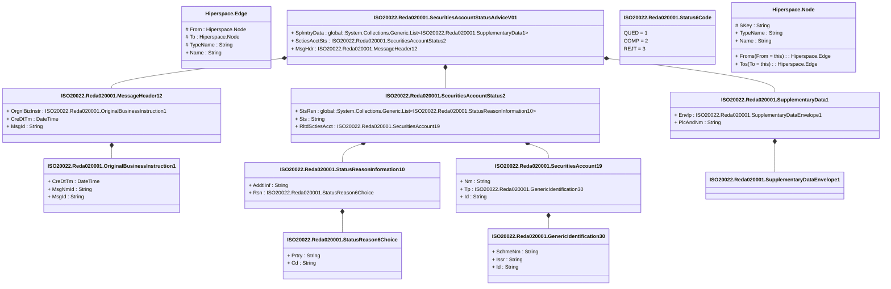

# reda.020.001.01

> The tables below contain descriptions of the members of each Element. 
> The first column indicates the type of the member:
> A ‘#’ indicates that the field is a key to the element, and a ‘+’ indicates that the field is a value.
> The ‘*’ column contains a description for the element member.  
> The ‘@’ column contains any properties for the member.
> The ‘=’ column contains calculated values; or in the case of an enum, the serialized value.

---

## View Hiperspace.Edge
edge between nodes

| |Name|Type|*|@|=|
|-|-|-|-|-|-|
|#|From|Hiperspace.Node||||
|#|To|Hiperspace.Node||||
|#|TypeName|String||||
|+|Name|String||||

---

## Type ISO20022.Reda020001.Document

| |Name|Type|*|@|=|
|-|-|-|-|-|-|
|+|SctiesAcctStsAdvc|ISO20022.Reda020001.SecuritiesAccountStatusAdviceV01||XmlElement()||
||Validation|Some(String)||XmlIgnore(), JsonIgnore()|validation(validElement(SctiesAcctStsAdvc))|

---

## Value ISO20022.Reda020001.GenericIdentification30

| |Name|Type|*|@|=|
|-|-|-|-|-|-|
|+|SchmeNm|String||XmlElement()||
|+|Issr|String||XmlElement()||
|+|Id|String||XmlElement()||
||Validation|Some(String)||XmlIgnore(), JsonIgnore()|validation(validPattern("""Id""",Id,"""[a-zA-Z0-9]{4}"""))|

---

## Value ISO20022.Reda020001.MessageHeader12

| |Name|Type|*|@|=|
|-|-|-|-|-|-|
|+|OrgnlBizInstr|ISO20022.Reda020001.OriginalBusinessInstruction1||XmlElement()||
|+|CreDtTm|DateTime||XmlElement()||
|+|MsgId|String||XmlElement()||
||Validation|Some(String)||XmlIgnore(), JsonIgnore()|validation(validElement(OrgnlBizInstr))|

---

## Value ISO20022.Reda020001.OriginalBusinessInstruction1

| |Name|Type|*|@|=|
|-|-|-|-|-|-|
|+|CreDtTm|DateTime||XmlElement()||
|+|MsgNmId|String||XmlElement()||
|+|MsgId|String||XmlElement()||
||Validation|Some(String)||XmlIgnore(), JsonIgnore()|""|

---

## Value ISO20022.Reda020001.SecuritiesAccount19

| |Name|Type|*|@|=|
|-|-|-|-|-|-|
|+|Nm|String||XmlElement()||
|+|Tp|ISO20022.Reda020001.GenericIdentification30||XmlElement()||
|+|Id|String||XmlElement()||
||Validation|Some(String)||XmlIgnore(), JsonIgnore()|validation(validElement(Tp))|

---

## Value ISO20022.Reda020001.SecuritiesAccountStatus2

| |Name|Type|*|@|=|
|-|-|-|-|-|-|
|+|StsRsn|global::System.Collections.Generic.List<ISO20022.Reda020001.StatusReasonInformation10>||XmlElement()||
|+|Sts|String||XmlElement()||
|+|RltdSctiesAcct|ISO20022.Reda020001.SecuritiesAccount19||XmlElement()||
||Validation|Some(String)||XmlIgnore(), JsonIgnore()|validation(validList("""StsRsn""",StsRsn),validElement(StsRsn),validElement(RltdSctiesAcct))|

---

## Aspect ISO20022.Reda020001.SecuritiesAccountStatusAdviceV01

| |Name|Type|*|@|=|
|-|-|-|-|-|-|
|+|SplmtryData|global::System.Collections.Generic.List<ISO20022.Reda020001.SupplementaryData1>||XmlElement()||
|+|SctiesAcctSts|ISO20022.Reda020001.SecuritiesAccountStatus2||XmlElement()||
|+|MsgHdr|ISO20022.Reda020001.MessageHeader12||XmlElement()||
||Validation|Some(String)||XmlIgnore(), JsonIgnore()|validation(validList("""SplmtryData""",SplmtryData),validElement(SplmtryData),validElement(SctiesAcctSts),validElement(MsgHdr))|

---

## Enum ISO20022.Reda020001.Status6Code

| |Name|Type|*|@|=|
|-|-|-|-|-|-|
||QUED|Int32||XmlEnum("""QUED""")|1|
||COMP|Int32||XmlEnum("""COMP""")|2|
||REJT|Int32||XmlEnum("""REJT""")|3|

---

## Value ISO20022.Reda020001.StatusReason6Choice

| |Name|Type|*|@|=|
|-|-|-|-|-|-|
|+|Prtry|String||XmlElement()||
|+|Cd|String||XmlElement()||
||Validation|Some(String)||XmlIgnore(), JsonIgnore()|validation(validChoice(Prtry,Cd))|

---

## Value ISO20022.Reda020001.StatusReasonInformation10

| |Name|Type|*|@|=|
|-|-|-|-|-|-|
|+|AddtlInf|String||XmlElement()||
|+|Rsn|ISO20022.Reda020001.StatusReason6Choice||XmlElement()||
||Validation|Some(String)||XmlIgnore(), JsonIgnore()|validation(validElement(Rsn))|

---

## Value ISO20022.Reda020001.SupplementaryData1

| |Name|Type|*|@|=|
|-|-|-|-|-|-|
|+|Envlp|ISO20022.Reda020001.SupplementaryDataEnvelope1||XmlElement()||
|+|PlcAndNm|String||XmlElement()||
||Validation|Some(String)||XmlIgnore(), JsonIgnore()|validation(validElement(Envlp))|

---

## Value ISO20022.Reda020001.SupplementaryDataEnvelope1

| |Name|Type|*|@|=|
|-|-|-|-|-|-|
||Validation|Some(String)||XmlIgnore(), JsonIgnore()|""|

---

## View Hiperspace.Node
node in a graph view of data

| |Name|Type|*|@|=|
|-|-|-|-|-|-|
|#|SKey|String||||
|+|TypeName|String||||
|+|Name|String||||
||Froms|Hiperspace.Edge|||From = this|
||Tos|Hiperspace.Edge|||To = this|

