# reda.021.001.01

```mermaid
classDiagram
    class Hiperspace.Edge {
        # From  : Hiperspace.Node
        # To  : Hiperspace.Node
        # TypeName  : String
        + Name  : String
    }
    class ISO20022.Reda021001.AddressType2Code {
        DLVY = 1
        MLTO = 2
        BIZZ = 3
        HOME = 4
        PBOX = 5
        ADDR = 6
    }
    class ISO20022.Reda021001.ErrorHandling3Choice {
        + Prtry  : String
        + Cd  : String
    }
    class ISO20022.Reda021001.ErrorHandling5 {
        + Desc  : String
        + Err  : ISO20022.Reda021001.ErrorHandling3Choice
    }
    ISO20022.Reda021001.ErrorHandling5 *-- ISO20022.Reda021001.ErrorHandling3Choice
    class ISO20022.Reda021001.GenericIdentification1 {
        + Issr  : String
        + SchmeNm  : String
        + Id  : String
    }
    class ISO20022.Reda021001.GenericIdentification30 {
        + SchmeNm  : String
        + Issr  : String
        + Id  : String
    }
    class ISO20022.Reda021001.GenericIdentification36 {
        + SchmeNm  : String
        + Issr  : String
        + Id  : String
    }
    class ISO20022.Reda021001.MarketSpecificAttribute1 {
        + Val  : String
        + Nm  : String
    }
    class ISO20022.Reda021001.MessageHeader3 {
        + QryNm  : String
        + OrgnlBizQry  : ISO20022.Reda021001.OriginalBusinessQuery1
        + ReqTp  : ISO20022.Reda021001.RequestType2Choice
        + CreDtTm  : DateTime
        + MsgId  : String
    }
    ISO20022.Reda021001.MessageHeader3 *-- ISO20022.Reda021001.OriginalBusinessQuery1
    ISO20022.Reda021001.MessageHeader3 *-- ISO20022.Reda021001.RequestType2Choice
    class ISO20022.Reda021001.NameAndAddress5 {
        + Adr  : ISO20022.Reda021001.PostalAddress1
        + Nm  : String
    }
    ISO20022.Reda021001.NameAndAddress5 *-- ISO20022.Reda021001.PostalAddress1
    class ISO20022.Reda021001.OriginalBusinessQuery1 {
        + CreDtTm  : DateTime
        + MsgNmId  : String
        + MsgId  : String
    }
    class ISO20022.Reda021001.Pagination1 {
        + LastPgInd  : String
        + PgNb  : String
    }
    class ISO20022.Reda021001.PartyIdentification120Choice {
        + NmAndAdr  : ISO20022.Reda021001.NameAndAddress5
        + PrtryId  : ISO20022.Reda021001.GenericIdentification36
        + AnyBIC  : String
    }
    ISO20022.Reda021001.PartyIdentification120Choice *-- ISO20022.Reda021001.NameAndAddress5
    ISO20022.Reda021001.PartyIdentification120Choice *-- ISO20022.Reda021001.GenericIdentification36
    class ISO20022.Reda021001.PartyIdentification136 {
        + LEI  : String
        + Id  : ISO20022.Reda021001.PartyIdentification120Choice
    }
    ISO20022.Reda021001.PartyIdentification136 *-- ISO20022.Reda021001.PartyIdentification120Choice
    class ISO20022.Reda021001.PostalAddress1 {
        + Ctry  : String
        + CtrySubDvsn  : String
        + TwnNm  : String
        + PstCd  : String
        + BldgNb  : String
        + StrtNm  : String
        + AdrLine  : global::System.Collections.Generic.List~String~
        + AdrTp  : String
    }
    class ISO20022.Reda021001.RequestType1Code {
        RT05 = 1
        RT04 = 2
        RT03 = 3
        RT02 = 4
        RT01 = 5
    }
    class ISO20022.Reda021001.RequestType2Choice {
        + Prtry  : ISO20022.Reda021001.GenericIdentification1
        + Enqry  : String
        + PmtCtrl  : String
    }
    ISO20022.Reda021001.RequestType2Choice *-- ISO20022.Reda021001.GenericIdentification1
    class ISO20022.Reda021001.RequestType2Code {
        RT15 = 1
        RT14 = 2
        RT13 = 3
        RT12 = 4
        RT11 = 5
    }
    class ISO20022.Reda021001.SecuritiesAccount19 {
        + Nm  : String
        + Tp  : ISO20022.Reda021001.GenericIdentification30
        + Id  : String
    }
    ISO20022.Reda021001.SecuritiesAccount19 *-- ISO20022.Reda021001.GenericIdentification30
    class ISO20022.Reda021001.SecuritiesAccountOrBusinessError3Choice {
        + BizErr  : global::System.Collections.Generic.List~ISO20022.Reda021001.ErrorHandling5~
        + SctiesAcct  : ISO20022.Reda021001.SystemSecuritiesAccount6
    }
    ISO20022.Reda021001.SecuritiesAccountOrBusinessError3Choice *-- ISO20022.Reda021001.ErrorHandling5
    ISO20022.Reda021001.SecuritiesAccountOrBusinessError3Choice *-- ISO20022.Reda021001.SystemSecuritiesAccount6
    class ISO20022.Reda021001.SecuritiesAccountOrOperationalError3Choice {
        + OprlErr  : global::System.Collections.Generic.List~ISO20022.Reda021001.ErrorHandling5~
        + SctiesAcctRpt  : global::System.Collections.Generic.List~ISO20022.Reda021001.SecuritiesAccountReport3~
    }
    ISO20022.Reda021001.SecuritiesAccountOrOperationalError3Choice *-- ISO20022.Reda021001.ErrorHandling5
    ISO20022.Reda021001.SecuritiesAccountOrOperationalError3Choice *-- ISO20022.Reda021001.SecuritiesAccountReport3
    class ISO20022.Reda021001.SecuritiesAccountReport3 {
        + SctiesAcctOrErr  : ISO20022.Reda021001.SecuritiesAccountOrBusinessError3Choice
        + SctiesAcctId  : ISO20022.Reda021001.SecuritiesAccount19
    }
    ISO20022.Reda021001.SecuritiesAccountReport3 *-- ISO20022.Reda021001.SecuritiesAccountOrBusinessError3Choice
    ISO20022.Reda021001.SecuritiesAccountReport3 *-- ISO20022.Reda021001.SecuritiesAccount19
    class ISO20022.Reda021001.SecuritiesAccountReportV01 {
        + SplmtryData  : global::System.Collections.Generic.List~ISO20022.Reda021001.SupplementaryData1~
        + RptOrErr  : ISO20022.Reda021001.SecuritiesAccountOrOperationalError3Choice
        + Pgntn  : ISO20022.Reda021001.Pagination1
        + MsgHdr  : ISO20022.Reda021001.MessageHeader3
    }
    ISO20022.Reda021001.SecuritiesAccountReportV01 *-- ISO20022.Reda021001.SupplementaryData1
    ISO20022.Reda021001.SecuritiesAccountReportV01 *-- ISO20022.Reda021001.SecuritiesAccountOrOperationalError3Choice
    ISO20022.Reda021001.SecuritiesAccountReportV01 *-- ISO20022.Reda021001.Pagination1
    ISO20022.Reda021001.SecuritiesAccountReportV01 *-- ISO20022.Reda021001.MessageHeader3
    class ISO20022.Reda021001.SupplementaryData1 {
        + Envlp  : ISO20022.Reda021001.SupplementaryDataEnvelope1
        + PlcAndNm  : String
    }
    ISO20022.Reda021001.SupplementaryData1 *-- ISO20022.Reda021001.SupplementaryDataEnvelope1
    class ISO20022.Reda021001.SupplementaryDataEnvelope1 {
    }
    class ISO20022.Reda021001.SystemPartyIdentification8 {
        + RspnsblPtyId  : ISO20022.Reda021001.PartyIdentification136
        + Id  : ISO20022.Reda021001.PartyIdentification136
    }
    ISO20022.Reda021001.SystemPartyIdentification8 *-- ISO20022.Reda021001.PartyIdentification136
    ISO20022.Reda021001.SystemPartyIdentification8 *-- ISO20022.Reda021001.PartyIdentification136
    class ISO20022.Reda021001.SystemPartyType1Choice {
        + Prtry  : String
        + Cd  : String
    }
    class ISO20022.Reda021001.SystemRestriction1 {
        + Tp  : String
        + VldTo  : DateTime
        + VldFr  : DateTime
    }
    class ISO20022.Reda021001.SystemSecuritiesAccount6 {
        + PricgSchme  : String
        + EndInvstrFlg  : String
        + Rstrctn  : global::System.Collections.Generic.List~ISO20022.Reda021001.SystemRestriction1~
        + MktSpcfcAttr  : global::System.Collections.Generic.List~ISO20022.Reda021001.MarketSpecificAttribute1~
        + PtyTp  : ISO20022.Reda021001.SystemPartyType1Choice
        + AcctOwnr  : ISO20022.Reda021001.SystemPartyIdentification8
        + Tp  : ISO20022.Reda021001.SystemSecuritiesAccountType1Choice
        + NegPos  : String
        + HldInd  : String
        + ClsgDt  : DateTime
        + OpngDt  : DateTime
    }
    ISO20022.Reda021001.SystemSecuritiesAccount6 *-- ISO20022.Reda021001.SystemRestriction1
    ISO20022.Reda021001.SystemSecuritiesAccount6 *-- ISO20022.Reda021001.MarketSpecificAttribute1
    ISO20022.Reda021001.SystemSecuritiesAccount6 *-- ISO20022.Reda021001.SystemPartyType1Choice
    ISO20022.Reda021001.SystemSecuritiesAccount6 *-- ISO20022.Reda021001.SystemPartyIdentification8
    ISO20022.Reda021001.SystemSecuritiesAccount6 *-- ISO20022.Reda021001.SystemSecuritiesAccountType1Choice
    class ISO20022.Reda021001.SystemSecuritiesAccountType1Choice {
        + Prtry  : ISO20022.Reda021001.GenericIdentification30
        + Cd  : String
    }
    ISO20022.Reda021001.SystemSecuritiesAccountType1Choice *-- ISO20022.Reda021001.GenericIdentification30
    class ISO20022.Reda021001.SystemSecuritiesAccountType1Code {
        ISSA = 1
        CSDO = 2
        TOFF = 3
        ICSA = 4
        CSDM = 5
        CSDP = 6
    }
    class Hiperspace.Node {
        # SKey  : String
        + TypeName  : String
        + Name  : String
        + Froms (From = this) : Hiperspace.Edge
        + Tos (To = this) : Hiperspace.Edge
    }
```

> The tables below contain descriptions of the members of each Element. 
> The first column indicates the type of the member:
> A ‘#’ indicates that the field is a key to the element, and a ‘+’ indicates that the field is a value.
> The ‘*’ column contains a description for the element member.  
> The ‘@’ column contains any properties for the member.
> The ‘=’ column contains calculated values; or in the case of an enum, the serialized value.

---

## View Hiperspace.Edge
edge between nodes

| |Name|Type|*|@|=|
|-|-|-|-|-|-|
|#|From|Hiperspace.Node||||
|#|To|Hiperspace.Node||||
|#|TypeName|String||||
|+|Name|String||||

---

## Enum ISO20022.Reda021001.AddressType2Code

| |Name|Type|*|@|=|
|-|-|-|-|-|-|
||DLVY|Int32||XmlEnum("""DLVY""")|1|
||MLTO|Int32||XmlEnum("""MLTO""")|2|
||BIZZ|Int32||XmlEnum("""BIZZ""")|3|
||HOME|Int32||XmlEnum("""HOME""")|4|
||PBOX|Int32||XmlEnum("""PBOX""")|5|
||ADDR|Int32||XmlEnum("""ADDR""")|6|

---

## Type ISO20022.Reda021001.Document

| |Name|Type|*|@|=|
|-|-|-|-|-|-|
|+|SctiesAcctRpt|ISO20022.Reda021001.SecuritiesAccountReportV01||XmlElement()||
||Validation|Some(String)||XmlIgnore(), JsonIgnore()|validation(validElement(SctiesAcctRpt))|

---

## Value ISO20022.Reda021001.ErrorHandling3Choice

| |Name|Type|*|@|=|
|-|-|-|-|-|-|
|+|Prtry|String||XmlElement()||
|+|Cd|String||XmlElement()||
||Validation|Some(String)||XmlIgnore(), JsonIgnore()|validation(validChoice(Prtry,Cd))|

---

## Value ISO20022.Reda021001.ErrorHandling5

| |Name|Type|*|@|=|
|-|-|-|-|-|-|
|+|Desc|String||XmlElement()||
|+|Err|ISO20022.Reda021001.ErrorHandling3Choice||XmlElement()||
||Validation|Some(String)||XmlIgnore(), JsonIgnore()|validation(validElement(Err))|

---

## Value ISO20022.Reda021001.GenericIdentification1

| |Name|Type|*|@|=|
|-|-|-|-|-|-|
|+|Issr|String||XmlElement()||
|+|SchmeNm|String||XmlElement()||
|+|Id|String||XmlElement()||
||Validation|Some(String)||XmlIgnore(), JsonIgnore()|""|

---

## Value ISO20022.Reda021001.GenericIdentification30

| |Name|Type|*|@|=|
|-|-|-|-|-|-|
|+|SchmeNm|String||XmlElement()||
|+|Issr|String||XmlElement()||
|+|Id|String||XmlElement()||
||Validation|Some(String)||XmlIgnore(), JsonIgnore()|validation(validPattern("""Id""",Id,"""[a-zA-Z0-9]{4}"""))|

---

## Value ISO20022.Reda021001.GenericIdentification36

| |Name|Type|*|@|=|
|-|-|-|-|-|-|
|+|SchmeNm|String||XmlElement()||
|+|Issr|String||XmlElement()||
|+|Id|String||XmlElement()||
||Validation|Some(String)||XmlIgnore(), JsonIgnore()|""|

---

## Value ISO20022.Reda021001.MarketSpecificAttribute1

| |Name|Type|*|@|=|
|-|-|-|-|-|-|
|+|Val|String||XmlElement()||
|+|Nm|String||XmlElement()||
||Validation|Some(String)||XmlIgnore(), JsonIgnore()|""|

---

## Value ISO20022.Reda021001.MessageHeader3

| |Name|Type|*|@|=|
|-|-|-|-|-|-|
|+|QryNm|String||XmlElement()||
|+|OrgnlBizQry|ISO20022.Reda021001.OriginalBusinessQuery1||XmlElement()||
|+|ReqTp|ISO20022.Reda021001.RequestType2Choice||XmlElement()||
|+|CreDtTm|DateTime||XmlElement()||
|+|MsgId|String||XmlElement()||
||Validation|Some(String)||XmlIgnore(), JsonIgnore()|validation(validElement(OrgnlBizQry),validElement(ReqTp))|

---

## Value ISO20022.Reda021001.NameAndAddress5

| |Name|Type|*|@|=|
|-|-|-|-|-|-|
|+|Adr|ISO20022.Reda021001.PostalAddress1||XmlElement()||
|+|Nm|String||XmlElement()||
||Validation|Some(String)||XmlIgnore(), JsonIgnore()|validation(validElement(Adr))|

---

## Value ISO20022.Reda021001.OriginalBusinessQuery1

| |Name|Type|*|@|=|
|-|-|-|-|-|-|
|+|CreDtTm|DateTime||XmlElement()||
|+|MsgNmId|String||XmlElement()||
|+|MsgId|String||XmlElement()||
||Validation|Some(String)||XmlIgnore(), JsonIgnore()|""|

---

## Value ISO20022.Reda021001.Pagination1

| |Name|Type|*|@|=|
|-|-|-|-|-|-|
|+|LastPgInd|String||XmlElement()||
|+|PgNb|String||XmlElement()||
||Validation|Some(String)||XmlIgnore(), JsonIgnore()|validation(validPattern("""PgNb""",PgNb,"""[0-9]{1,5}"""))|

---

## Value ISO20022.Reda021001.PartyIdentification120Choice

| |Name|Type|*|@|=|
|-|-|-|-|-|-|
|+|NmAndAdr|ISO20022.Reda021001.NameAndAddress5||XmlElement()||
|+|PrtryId|ISO20022.Reda021001.GenericIdentification36||XmlElement()||
|+|AnyBIC|String||XmlElement()||
||Validation|Some(String)||XmlIgnore(), JsonIgnore()|validation(validElement(NmAndAdr),validElement(PrtryId),validPattern("""AnyBIC""",AnyBIC,"""[A-Z0-9]{4,4}[A-Z]{2,2}[A-Z0-9]{2,2}([A-Z0-9]{3,3}){0,1}"""),validChoice(NmAndAdr,PrtryId,AnyBIC))|

---

## Value ISO20022.Reda021001.PartyIdentification136

| |Name|Type|*|@|=|
|-|-|-|-|-|-|
|+|LEI|String||XmlElement()||
|+|Id|ISO20022.Reda021001.PartyIdentification120Choice||XmlElement()||
||Validation|Some(String)||XmlIgnore(), JsonIgnore()|validation(validPattern("""LEI""",LEI,"""[A-Z0-9]{18,18}[0-9]{2,2}"""),validElement(Id))|

---

## Value ISO20022.Reda021001.PostalAddress1

| |Name|Type|*|@|=|
|-|-|-|-|-|-|
|+|Ctry|String||XmlElement()||
|+|CtrySubDvsn|String||XmlElement()||
|+|TwnNm|String||XmlElement()||
|+|PstCd|String||XmlElement()||
|+|BldgNb|String||XmlElement()||
|+|StrtNm|String||XmlElement()||
|+|AdrLine|global::System.Collections.Generic.List<String>||XmlElement()||
|+|AdrTp|String||XmlElement()||
||Validation|Some(String)||XmlIgnore(), JsonIgnore()|validation(validPattern("""Ctry""",Ctry,"""[A-Z]{2,2}"""),validListMax("""AdrLine""",AdrLine,5))|

---

## Enum ISO20022.Reda021001.RequestType1Code

| |Name|Type|*|@|=|
|-|-|-|-|-|-|
||RT05|Int32||XmlEnum("""RT05""")|1|
||RT04|Int32||XmlEnum("""RT04""")|2|
||RT03|Int32||XmlEnum("""RT03""")|3|
||RT02|Int32||XmlEnum("""RT02""")|4|
||RT01|Int32||XmlEnum("""RT01""")|5|

---

## Value ISO20022.Reda021001.RequestType2Choice

| |Name|Type|*|@|=|
|-|-|-|-|-|-|
|+|Prtry|ISO20022.Reda021001.GenericIdentification1||XmlElement()||
|+|Enqry|String||XmlElement()||
|+|PmtCtrl|String||XmlElement()||
||Validation|Some(String)||XmlIgnore(), JsonIgnore()|validation(validElement(Prtry),validChoice(Prtry,Enqry,PmtCtrl))|

---

## Enum ISO20022.Reda021001.RequestType2Code

| |Name|Type|*|@|=|
|-|-|-|-|-|-|
||RT15|Int32||XmlEnum("""RT15""")|1|
||RT14|Int32||XmlEnum("""RT14""")|2|
||RT13|Int32||XmlEnum("""RT13""")|3|
||RT12|Int32||XmlEnum("""RT12""")|4|
||RT11|Int32||XmlEnum("""RT11""")|5|

---

## Value ISO20022.Reda021001.SecuritiesAccount19

| |Name|Type|*|@|=|
|-|-|-|-|-|-|
|+|Nm|String||XmlElement()||
|+|Tp|ISO20022.Reda021001.GenericIdentification30||XmlElement()||
|+|Id|String||XmlElement()||
||Validation|Some(String)||XmlIgnore(), JsonIgnore()|validation(validElement(Tp))|

---

## Value ISO20022.Reda021001.SecuritiesAccountOrBusinessError3Choice

| |Name|Type|*|@|=|
|-|-|-|-|-|-|
|+|BizErr|global::System.Collections.Generic.List<ISO20022.Reda021001.ErrorHandling5>||XmlElement()||
|+|SctiesAcct|ISO20022.Reda021001.SystemSecuritiesAccount6||XmlElement()||
||Validation|Some(String)||XmlIgnore(), JsonIgnore()|validation(validRequired("""BizErr""",BizErr),validList("""BizErr""",BizErr),validElement(BizErr),validElement(SctiesAcct),validChoice(BizErr,SctiesAcct))|

---

## Value ISO20022.Reda021001.SecuritiesAccountOrOperationalError3Choice

| |Name|Type|*|@|=|
|-|-|-|-|-|-|
|+|OprlErr|global::System.Collections.Generic.List<ISO20022.Reda021001.ErrorHandling5>||XmlElement()||
|+|SctiesAcctRpt|global::System.Collections.Generic.List<ISO20022.Reda021001.SecuritiesAccountReport3>||XmlElement()||
||Validation|Some(String)||XmlIgnore(), JsonIgnore()|validation(validRequired("""OprlErr""",OprlErr),validList("""OprlErr""",OprlErr),validElement(OprlErr),validRequired("""SctiesAcctRpt""",SctiesAcctRpt),validList("""SctiesAcctRpt""",SctiesAcctRpt),validElement(SctiesAcctRpt),validChoice(OprlErr,SctiesAcctRpt))|

---

## Value ISO20022.Reda021001.SecuritiesAccountReport3

| |Name|Type|*|@|=|
|-|-|-|-|-|-|
|+|SctiesAcctOrErr|ISO20022.Reda021001.SecuritiesAccountOrBusinessError3Choice||XmlElement()||
|+|SctiesAcctId|ISO20022.Reda021001.SecuritiesAccount19||XmlElement()||
||Validation|Some(String)||XmlIgnore(), JsonIgnore()|validation(validElement(SctiesAcctOrErr),validElement(SctiesAcctId))|

---

## Aspect ISO20022.Reda021001.SecuritiesAccountReportV01

| |Name|Type|*|@|=|
|-|-|-|-|-|-|
|+|SplmtryData|global::System.Collections.Generic.List<ISO20022.Reda021001.SupplementaryData1>||XmlElement()||
|+|RptOrErr|ISO20022.Reda021001.SecuritiesAccountOrOperationalError3Choice||XmlElement()||
|+|Pgntn|ISO20022.Reda021001.Pagination1||XmlElement()||
|+|MsgHdr|ISO20022.Reda021001.MessageHeader3||XmlElement()||
||Validation|Some(String)||XmlIgnore(), JsonIgnore()|validation(validList("""SplmtryData""",SplmtryData),validElement(SplmtryData),validElement(RptOrErr),validElement(Pgntn),validElement(MsgHdr))|

---

## Value ISO20022.Reda021001.SupplementaryData1

| |Name|Type|*|@|=|
|-|-|-|-|-|-|
|+|Envlp|ISO20022.Reda021001.SupplementaryDataEnvelope1||XmlElement()||
|+|PlcAndNm|String||XmlElement()||
||Validation|Some(String)||XmlIgnore(), JsonIgnore()|validation(validElement(Envlp))|

---

## Value ISO20022.Reda021001.SupplementaryDataEnvelope1

| |Name|Type|*|@|=|
|-|-|-|-|-|-|
||Validation|Some(String)||XmlIgnore(), JsonIgnore()|""|

---

## Value ISO20022.Reda021001.SystemPartyIdentification8

| |Name|Type|*|@|=|
|-|-|-|-|-|-|
|+|RspnsblPtyId|ISO20022.Reda021001.PartyIdentification136||XmlElement()||
|+|Id|ISO20022.Reda021001.PartyIdentification136||XmlElement()||
||Validation|Some(String)||XmlIgnore(), JsonIgnore()|validation(validElement(RspnsblPtyId),validElement(Id))|

---

## Value ISO20022.Reda021001.SystemPartyType1Choice

| |Name|Type|*|@|=|
|-|-|-|-|-|-|
|+|Prtry|String||XmlElement()||
|+|Cd|String||XmlElement()||
||Validation|Some(String)||XmlIgnore(), JsonIgnore()|validation(validChoice(Prtry,Cd))|

---

## Value ISO20022.Reda021001.SystemRestriction1

| |Name|Type|*|@|=|
|-|-|-|-|-|-|
|+|Tp|String||XmlElement()||
|+|VldTo|DateTime||XmlElement()||
|+|VldFr|DateTime||XmlElement()||
||Validation|Some(String)||XmlIgnore(), JsonIgnore()|""|

---

## Value ISO20022.Reda021001.SystemSecuritiesAccount6

| |Name|Type|*|@|=|
|-|-|-|-|-|-|
|+|PricgSchme|String||XmlElement()||
|+|EndInvstrFlg|String||XmlElement()||
|+|Rstrctn|global::System.Collections.Generic.List<ISO20022.Reda021001.SystemRestriction1>||XmlElement()||
|+|MktSpcfcAttr|global::System.Collections.Generic.List<ISO20022.Reda021001.MarketSpecificAttribute1>||XmlElement()||
|+|PtyTp|ISO20022.Reda021001.SystemPartyType1Choice||XmlElement()||
|+|AcctOwnr|ISO20022.Reda021001.SystemPartyIdentification8||XmlElement()||
|+|Tp|ISO20022.Reda021001.SystemSecuritiesAccountType1Choice||XmlElement()||
|+|NegPos|String||XmlElement()||
|+|HldInd|String||XmlElement()||
|+|ClsgDt|DateTime||XmlElement()||
|+|OpngDt|DateTime||XmlElement()||
||Validation|Some(String)||XmlIgnore(), JsonIgnore()|validation(validPattern("""PricgSchme""",PricgSchme,"""[a-zA-Z0-9]{4}"""),validPattern("""EndInvstrFlg""",EndInvstrFlg,"""[a-zA-Z0-9]{4}"""),validList("""Rstrctn""",Rstrctn),validElement(Rstrctn),validList("""MktSpcfcAttr""",MktSpcfcAttr),validElement(MktSpcfcAttr),validElement(PtyTp),validElement(AcctOwnr),validElement(Tp))|

---

## Value ISO20022.Reda021001.SystemSecuritiesAccountType1Choice

| |Name|Type|*|@|=|
|-|-|-|-|-|-|
|+|Prtry|ISO20022.Reda021001.GenericIdentification30||XmlElement()||
|+|Cd|String||XmlElement()||
||Validation|Some(String)||XmlIgnore(), JsonIgnore()|validation(validElement(Prtry),validChoice(Prtry,Cd))|

---

## Enum ISO20022.Reda021001.SystemSecuritiesAccountType1Code

| |Name|Type|*|@|=|
|-|-|-|-|-|-|
||ISSA|Int32||XmlEnum("""ISSA""")|1|
||CSDO|Int32||XmlEnum("""CSDO""")|2|
||TOFF|Int32||XmlEnum("""TOFF""")|3|
||ICSA|Int32||XmlEnum("""ICSA""")|4|
||CSDM|Int32||XmlEnum("""CSDM""")|5|
||CSDP|Int32||XmlEnum("""CSDP""")|6|

---

## View Hiperspace.Node
node in a graph view of data

| |Name|Type|*|@|=|
|-|-|-|-|-|-|
|#|SKey|String||||
|+|TypeName|String||||
|+|Name|String||||
||Froms|Hiperspace.Edge|||From = this|
||Tos|Hiperspace.Edge|||To = this|

