# reda.023.001.01

```mermaid
classDiagram
    class Hiperspace.Edge {
        # From  : Hiperspace.Node
        # To  : Hiperspace.Node
        # TypeName  : String
        + Name  : String
    }
    class ISO20022.Reda023001.DataModification1Code {
        DELT = 1
        UPDT = 2
        INSE = 3
    }
    class ISO20022.Reda023001.GenericIdentification30 {
        + SchmeNm  : String
        + Issr  : String
        + Id  : String
    }
    class ISO20022.Reda023001.MarketSpecificAttribute1 {
        + Val  : String
        + Nm  : String
    }
    class ISO20022.Reda023001.MessageHeader1 {
        + CreDtTm  : DateTime
        + MsgId  : String
    }
    class ISO20022.Reda023001.SecuritiesAccount19 {
        + Nm  : String
        + Tp  : ISO20022.Reda023001.GenericIdentification30
        + Id  : String
    }
    ISO20022.Reda023001.SecuritiesAccount19 *-- ISO20022.Reda023001.GenericIdentification30
    class ISO20022.Reda023001.SecuritiesAccountModification2 {
        + ReqdMod  : ISO20022.Reda023001.SecuritiesAccountModification2Choice
        + ScpIndctn  : String
    }
    ISO20022.Reda023001.SecuritiesAccountModification2 *-- ISO20022.Reda023001.SecuritiesAccountModification2Choice
    class ISO20022.Reda023001.SecuritiesAccountModification2Choice {
        + MktSpcfcAttr  : ISO20022.Reda023001.MarketSpecificAttribute1
        + SysRstrctn  : ISO20022.Reda023001.SystemRestriction1
        + SysSctiesAcct  : ISO20022.Reda023001.SystemSecuritiesAccount5
    }
    ISO20022.Reda023001.SecuritiesAccountModification2Choice *-- ISO20022.Reda023001.MarketSpecificAttribute1
    ISO20022.Reda023001.SecuritiesAccountModification2Choice *-- ISO20022.Reda023001.SystemRestriction1
    ISO20022.Reda023001.SecuritiesAccountModification2Choice *-- ISO20022.Reda023001.SystemSecuritiesAccount5
    class ISO20022.Reda023001.SecuritiesAccountModificationRequestV01 {
        + SplmtryData  : global::System.Collections.Generic.List~ISO20022.Reda023001.SupplementaryData1~
        + Mod  : global::System.Collections.Generic.List~ISO20022.Reda023001.SecuritiesAccountModification2~
        + AcctId  : ISO20022.Reda023001.SecuritiesAccount19
        + MsgHdr  : ISO20022.Reda023001.MessageHeader1
    }
    ISO20022.Reda023001.SecuritiesAccountModificationRequestV01 *-- ISO20022.Reda023001.SupplementaryData1
    ISO20022.Reda023001.SecuritiesAccountModificationRequestV01 *-- ISO20022.Reda023001.SecuritiesAccountModification2
    ISO20022.Reda023001.SecuritiesAccountModificationRequestV01 *-- ISO20022.Reda023001.SecuritiesAccount19
    ISO20022.Reda023001.SecuritiesAccountModificationRequestV01 *-- ISO20022.Reda023001.MessageHeader1
    class ISO20022.Reda023001.SupplementaryData1 {
        + Envlp  : ISO20022.Reda023001.SupplementaryDataEnvelope1
        + PlcAndNm  : String
    }
    ISO20022.Reda023001.SupplementaryData1 *-- ISO20022.Reda023001.SupplementaryDataEnvelope1
    class ISO20022.Reda023001.SupplementaryDataEnvelope1 {
    }
    class ISO20022.Reda023001.SystemRestriction1 {
        + Tp  : String
        + VldTo  : DateTime
        + VldFr  : DateTime
    }
    class ISO20022.Reda023001.SystemSecuritiesAccount5 {
        + PricgSchme  : String
        + EndInvstrFlg  : String
        + NegPos  : String
        + HldInd  : String
        + ClsgDt  : DateTime
    }
    class Hiperspace.Node {
        # SKey  : String
        + TypeName  : String
        + Name  : String
        + Froms (From = this) : Hiperspace.Edge
        + Tos (To = this) : Hiperspace.Edge
    }
```

> The tables below contain descriptions of the members of each Element. 
> The first column indicates the type of the member:
> A ‘#’ indicates that the field is a key to the element, and a ‘+’ indicates that the field is a value.
> The ‘*’ column contains a description for the element member.  
> The ‘@’ column contains any properties for the member.
> The ‘=’ column contains calculated values; or in the case of an enum, the serialized value.

---

## View Hiperspace.Edge
edge between nodes

| |Name|Type|*|@|=|
|-|-|-|-|-|-|
|#|From|Hiperspace.Node||||
|#|To|Hiperspace.Node||||
|#|TypeName|String||||
|+|Name|String||||

---

## Enum ISO20022.Reda023001.DataModification1Code

| |Name|Type|*|@|=|
|-|-|-|-|-|-|
||DELT|Int32||XmlEnum("""DELT""")|1|
||UPDT|Int32||XmlEnum("""UPDT""")|2|
||INSE|Int32||XmlEnum("""INSE""")|3|

---

## Type ISO20022.Reda023001.Document

| |Name|Type|*|@|=|
|-|-|-|-|-|-|
|+|SctiesAcctModReq|ISO20022.Reda023001.SecuritiesAccountModificationRequestV01||XmlElement()||
||Validation|Some(String)||XmlIgnore(), JsonIgnore()|validation(validElement(SctiesAcctModReq))|

---

## Value ISO20022.Reda023001.GenericIdentification30

| |Name|Type|*|@|=|
|-|-|-|-|-|-|
|+|SchmeNm|String||XmlElement()||
|+|Issr|String||XmlElement()||
|+|Id|String||XmlElement()||
||Validation|Some(String)||XmlIgnore(), JsonIgnore()|validation(validPattern("""Id""",Id,"""[a-zA-Z0-9]{4}"""))|

---

## Value ISO20022.Reda023001.MarketSpecificAttribute1

| |Name|Type|*|@|=|
|-|-|-|-|-|-|
|+|Val|String||XmlElement()||
|+|Nm|String||XmlElement()||
||Validation|Some(String)||XmlIgnore(), JsonIgnore()|""|

---

## Value ISO20022.Reda023001.MessageHeader1

| |Name|Type|*|@|=|
|-|-|-|-|-|-|
|+|CreDtTm|DateTime||XmlElement()||
|+|MsgId|String||XmlElement()||
||Validation|Some(String)||XmlIgnore(), JsonIgnore()|""|

---

## Value ISO20022.Reda023001.SecuritiesAccount19

| |Name|Type|*|@|=|
|-|-|-|-|-|-|
|+|Nm|String||XmlElement()||
|+|Tp|ISO20022.Reda023001.GenericIdentification30||XmlElement()||
|+|Id|String||XmlElement()||
||Validation|Some(String)||XmlIgnore(), JsonIgnore()|validation(validElement(Tp))|

---

## Value ISO20022.Reda023001.SecuritiesAccountModification2

| |Name|Type|*|@|=|
|-|-|-|-|-|-|
|+|ReqdMod|ISO20022.Reda023001.SecuritiesAccountModification2Choice||XmlElement()||
|+|ScpIndctn|String||XmlElement()||
||Validation|Some(String)||XmlIgnore(), JsonIgnore()|validation(validElement(ReqdMod))|

---

## Value ISO20022.Reda023001.SecuritiesAccountModification2Choice

| |Name|Type|*|@|=|
|-|-|-|-|-|-|
|+|MktSpcfcAttr|ISO20022.Reda023001.MarketSpecificAttribute1||XmlElement()||
|+|SysRstrctn|ISO20022.Reda023001.SystemRestriction1||XmlElement()||
|+|SysSctiesAcct|ISO20022.Reda023001.SystemSecuritiesAccount5||XmlElement()||
||Validation|Some(String)||XmlIgnore(), JsonIgnore()|validation(validElement(MktSpcfcAttr),validElement(SysRstrctn),validElement(SysSctiesAcct),validChoice(MktSpcfcAttr,SysRstrctn,SysSctiesAcct))|

---

## Aspect ISO20022.Reda023001.SecuritiesAccountModificationRequestV01

| |Name|Type|*|@|=|
|-|-|-|-|-|-|
|+|SplmtryData|global::System.Collections.Generic.List<ISO20022.Reda023001.SupplementaryData1>||XmlElement()||
|+|Mod|global::System.Collections.Generic.List<ISO20022.Reda023001.SecuritiesAccountModification2>||XmlElement()||
|+|AcctId|ISO20022.Reda023001.SecuritiesAccount19||XmlElement()||
|+|MsgHdr|ISO20022.Reda023001.MessageHeader1||XmlElement()||
||Validation|Some(String)||XmlIgnore(), JsonIgnore()|validation(validList("""SplmtryData""",SplmtryData),validElement(SplmtryData),validRequired("""Mod""",Mod),validList("""Mod""",Mod),validElement(Mod),validElement(AcctId),validElement(MsgHdr))|

---

## Value ISO20022.Reda023001.SupplementaryData1

| |Name|Type|*|@|=|
|-|-|-|-|-|-|
|+|Envlp|ISO20022.Reda023001.SupplementaryDataEnvelope1||XmlElement()||
|+|PlcAndNm|String||XmlElement()||
||Validation|Some(String)||XmlIgnore(), JsonIgnore()|validation(validElement(Envlp))|

---

## Value ISO20022.Reda023001.SupplementaryDataEnvelope1

| |Name|Type|*|@|=|
|-|-|-|-|-|-|
||Validation|Some(String)||XmlIgnore(), JsonIgnore()|""|

---

## Value ISO20022.Reda023001.SystemRestriction1

| |Name|Type|*|@|=|
|-|-|-|-|-|-|
|+|Tp|String||XmlElement()||
|+|VldTo|DateTime||XmlElement()||
|+|VldFr|DateTime||XmlElement()||
||Validation|Some(String)||XmlIgnore(), JsonIgnore()|""|

---

## Value ISO20022.Reda023001.SystemSecuritiesAccount5

| |Name|Type|*|@|=|
|-|-|-|-|-|-|
|+|PricgSchme|String||XmlElement()||
|+|EndInvstrFlg|String||XmlElement()||
|+|NegPos|String||XmlElement()||
|+|HldInd|String||XmlElement()||
|+|ClsgDt|DateTime||XmlElement()||
||Validation|Some(String)||XmlIgnore(), JsonIgnore()|validation(validPattern("""PricgSchme""",PricgSchme,"""[a-zA-Z0-9]{4}"""),validPattern("""EndInvstrFlg""",EndInvstrFlg,"""[a-zA-Z0-9]{4}"""))|

---

## View Hiperspace.Node
node in a graph view of data

| |Name|Type|*|@|=|
|-|-|-|-|-|-|
|#|SKey|String||||
|+|TypeName|String||||
|+|Name|String||||
||Froms|Hiperspace.Edge|||From = this|
||Tos|Hiperspace.Edge|||To = this|

