# reda.024.001.01

```mermaid
classDiagram
    class Hiperspace.Edge {
        # From  : Hiperspace.Node
        # To  : Hiperspace.Node
        # TypeName  : String
        + Name  : String
    }
    class ISO20022.Reda024001.ActiveCurrencyAndAmount {
        + Value  : Decimal
        + Ccy  : String
    }
    class ISO20022.Reda024001.ActiveOrHistoricCurrencyAndAmount {
        + Value  : Decimal
        + Ccy  : String
    }
    class ISO20022.Reda024001.AddressType2Code {
        DLVY = 1
        MLTO = 2
        BIZZ = 3
        HOME = 4
        PBOX = 5
        ADDR = 6
    }
    class ISO20022.Reda024001.AmountOrCoefficientPrice2Choice {
        + Coeff  : Decimal
        + AmtWthCcy  : ISO20022.Reda024001.ActiveOrHistoricCurrencyAndAmount
        + Amt  : Decimal
    }
    ISO20022.Reda024001.AmountOrCoefficientPrice2Choice *-- ISO20022.Reda024001.ActiveOrHistoricCurrencyAndAmount
    class ISO20022.Reda024001.CollateralValue5 {
        + FX  : ISO20022.Reda024001.ForeignExchangeTerms23
        + PoolFctr  : Decimal
        + ClsLkHrcut  : Decimal
        + Hrcut  : Decimal
        + AcrdIntrst  : ISO20022.Reda024001.PriceRateOrAmount6Choice
        + CleanPric  : ISO20022.Reda024001.PriceRateOrAmount6Choice
        + ValtnClsLkPric  : ISO20022.Reda024001.AmountOrCoefficientPrice2Choice
        + ValtnPric  : ISO20022.Reda024001.AmountOrCoefficientPrice2Choice
        + ValtnCcy  : String
        + ValtnDt  : DateTime
        + SctyId  : ISO20022.Reda024001.SecurityIdentification19
    }
    ISO20022.Reda024001.CollateralValue5 *-- ISO20022.Reda024001.ForeignExchangeTerms23
    ISO20022.Reda024001.CollateralValue5 *-- ISO20022.Reda024001.PriceRateOrAmount6Choice
    ISO20022.Reda024001.CollateralValue5 *-- ISO20022.Reda024001.PriceRateOrAmount6Choice
    ISO20022.Reda024001.CollateralValue5 *-- ISO20022.Reda024001.AmountOrCoefficientPrice2Choice
    ISO20022.Reda024001.CollateralValue5 *-- ISO20022.Reda024001.AmountOrCoefficientPrice2Choice
    ISO20022.Reda024001.CollateralValue5 *-- ISO20022.Reda024001.SecurityIdentification19
    class ISO20022.Reda024001.CollateralValueCreationRequestV01 {
        + SplmtryData  : global::System.Collections.Generic.List~ISO20022.Reda024001.SupplementaryData1~
        + PtyId  : ISO20022.Reda024001.SystemPartyIdentification2Choice
        + CollVal  : global::System.Collections.Generic.List~ISO20022.Reda024001.CollateralValue5~
        + MsgHdr  : ISO20022.Reda024001.MessageHeader1
    }
    ISO20022.Reda024001.CollateralValueCreationRequestV01 *-- ISO20022.Reda024001.SupplementaryData1
    ISO20022.Reda024001.CollateralValueCreationRequestV01 *-- ISO20022.Reda024001.SystemPartyIdentification2Choice
    ISO20022.Reda024001.CollateralValueCreationRequestV01 *-- ISO20022.Reda024001.CollateralValue5
    ISO20022.Reda024001.CollateralValueCreationRequestV01 *-- ISO20022.Reda024001.MessageHeader1
    class ISO20022.Reda024001.ForeignExchangeTerms23 {
        + RsltgAmt  : ISO20022.Reda024001.ActiveCurrencyAndAmount
        + XchgRate  : Decimal
        + QtdCcy  : String
        + UnitCcy  : String
    }
    ISO20022.Reda024001.ForeignExchangeTerms23 *-- ISO20022.Reda024001.ActiveCurrencyAndAmount
    class ISO20022.Reda024001.GenericIdentification36 {
        + SchmeNm  : String
        + Issr  : String
        + Id  : String
    }
    class ISO20022.Reda024001.IdentificationSource3Choice {
        + Prtry  : String
        + Cd  : String
    }
    class ISO20022.Reda024001.MessageHeader1 {
        + CreDtTm  : DateTime
        + MsgId  : String
    }
    class ISO20022.Reda024001.NameAndAddress5 {
        + Adr  : ISO20022.Reda024001.PostalAddress1
        + Nm  : String
    }
    ISO20022.Reda024001.NameAndAddress5 *-- ISO20022.Reda024001.PostalAddress1
    class ISO20022.Reda024001.OtherIdentification1 {
        + Tp  : ISO20022.Reda024001.IdentificationSource3Choice
        + Sfx  : String
        + Id  : String
    }
    ISO20022.Reda024001.OtherIdentification1 *-- ISO20022.Reda024001.IdentificationSource3Choice
    class ISO20022.Reda024001.PartyIdentification120Choice {
        + NmAndAdr  : ISO20022.Reda024001.NameAndAddress5
        + PrtryId  : ISO20022.Reda024001.GenericIdentification36
        + AnyBIC  : String
    }
    ISO20022.Reda024001.PartyIdentification120Choice *-- ISO20022.Reda024001.NameAndAddress5
    ISO20022.Reda024001.PartyIdentification120Choice *-- ISO20022.Reda024001.GenericIdentification36
    class ISO20022.Reda024001.PartyIdentification136 {
        + LEI  : String
        + Id  : ISO20022.Reda024001.PartyIdentification120Choice
    }
    ISO20022.Reda024001.PartyIdentification136 *-- ISO20022.Reda024001.PartyIdentification120Choice
    class ISO20022.Reda024001.PostalAddress1 {
        + Ctry  : String
        + CtrySubDvsn  : String
        + TwnNm  : String
        + PstCd  : String
        + BldgNb  : String
        + StrtNm  : String
        + AdrLine  : global::System.Collections.Generic.List~String~
        + AdrTp  : String
    }
    class ISO20022.Reda024001.PriceRateOrAmount6Choice {
        + AmtWthCcy  : ISO20022.Reda024001.ActiveOrHistoricCurrencyAndAmount
        + Amt  : Decimal
        + Rate  : Decimal
    }
    ISO20022.Reda024001.PriceRateOrAmount6Choice *-- ISO20022.Reda024001.ActiveOrHistoricCurrencyAndAmount
    class ISO20022.Reda024001.SecurityIdentification19 {
        + Desc  : String
        + OthrId  : global::System.Collections.Generic.List~ISO20022.Reda024001.OtherIdentification1~
        + ISIN  : String
    }
    ISO20022.Reda024001.SecurityIdentification19 *-- ISO20022.Reda024001.OtherIdentification1
    class ISO20022.Reda024001.SupplementaryData1 {
        + Envlp  : ISO20022.Reda024001.SupplementaryDataEnvelope1
        + PlcAndNm  : String
    }
    ISO20022.Reda024001.SupplementaryData1 *-- ISO20022.Reda024001.SupplementaryDataEnvelope1
    class ISO20022.Reda024001.SupplementaryDataEnvelope1 {
    }
    class ISO20022.Reda024001.SystemPartyIdentification2Choice {
        + CmbndId  : ISO20022.Reda024001.SystemPartyIdentification8
        + OrgId  : ISO20022.Reda024001.PartyIdentification136
    }
    ISO20022.Reda024001.SystemPartyIdentification2Choice *-- ISO20022.Reda024001.SystemPartyIdentification8
    ISO20022.Reda024001.SystemPartyIdentification2Choice *-- ISO20022.Reda024001.PartyIdentification136
    class ISO20022.Reda024001.SystemPartyIdentification8 {
        + RspnsblPtyId  : ISO20022.Reda024001.PartyIdentification136
        + Id  : ISO20022.Reda024001.PartyIdentification136
    }
    ISO20022.Reda024001.SystemPartyIdentification8 *-- ISO20022.Reda024001.PartyIdentification136
    ISO20022.Reda024001.SystemPartyIdentification8 *-- ISO20022.Reda024001.PartyIdentification136
    class Hiperspace.Node {
        # SKey  : String
        + TypeName  : String
        + Name  : String
        + Froms (From = this) : Hiperspace.Edge
        + Tos (To = this) : Hiperspace.Edge
    }
```

> The tables below contain descriptions of the members of each Element. 
> The first column indicates the type of the member:
> A ‘#’ indicates that the field is a key to the element, and a ‘+’ indicates that the field is a value.
> The ‘*’ column contains a description for the element member.  
> The ‘@’ column contains any properties for the member.
> The ‘=’ column contains calculated values; or in the case of an enum, the serialized value.

---

## View Hiperspace.Edge
edge between nodes

| |Name|Type|*|@|=|
|-|-|-|-|-|-|
|#|From|Hiperspace.Node||||
|#|To|Hiperspace.Node||||
|#|TypeName|String||||
|+|Name|String||||

---

## Value ISO20022.Reda024001.ActiveCurrencyAndAmount

| |Name|Type|*|@|=|
|-|-|-|-|-|-|
|+|Value|Decimal||XmlElement()||
|+|Ccy|String||XmlAttribute()||
||Validation|Some(String)||XmlIgnore(), JsonIgnore()|validation(validRequired("""Value""",Value),validRequired("""Ccy""",Ccy),validPattern("""Ccy""",Ccy,"""[A-Z]{3,3}"""))|

---

## Value ISO20022.Reda024001.ActiveOrHistoricCurrencyAndAmount

| |Name|Type|*|@|=|
|-|-|-|-|-|-|
|+|Value|Decimal||XmlElement()||
|+|Ccy|String||XmlAttribute()||
||Validation|Some(String)||XmlIgnore(), JsonIgnore()|validation(validRequired("""Value""",Value),validRequired("""Ccy""",Ccy),validPattern("""Ccy""",Ccy,"""[A-Z]{3,3}"""))|

---

## Enum ISO20022.Reda024001.AddressType2Code

| |Name|Type|*|@|=|
|-|-|-|-|-|-|
||DLVY|Int32||XmlEnum("""DLVY""")|1|
||MLTO|Int32||XmlEnum("""MLTO""")|2|
||BIZZ|Int32||XmlEnum("""BIZZ""")|3|
||HOME|Int32||XmlEnum("""HOME""")|4|
||PBOX|Int32||XmlEnum("""PBOX""")|5|
||ADDR|Int32||XmlEnum("""ADDR""")|6|

---

## Value ISO20022.Reda024001.AmountOrCoefficientPrice2Choice

| |Name|Type|*|@|=|
|-|-|-|-|-|-|
|+|Coeff|Decimal||XmlElement()||
|+|AmtWthCcy|ISO20022.Reda024001.ActiveOrHistoricCurrencyAndAmount||XmlElement()||
|+|Amt|Decimal||XmlElement()||
||Validation|Some(String)||XmlIgnore(), JsonIgnore()|validation(validElement(AmtWthCcy),validChoice(Coeff,AmtWthCcy,Amt))|

---

## Value ISO20022.Reda024001.CollateralValue5

| |Name|Type|*|@|=|
|-|-|-|-|-|-|
|+|FX|ISO20022.Reda024001.ForeignExchangeTerms23||XmlElement()||
|+|PoolFctr|Decimal||XmlElement()||
|+|ClsLkHrcut|Decimal||XmlElement()||
|+|Hrcut|Decimal||XmlElement()||
|+|AcrdIntrst|ISO20022.Reda024001.PriceRateOrAmount6Choice||XmlElement()||
|+|CleanPric|ISO20022.Reda024001.PriceRateOrAmount6Choice||XmlElement()||
|+|ValtnClsLkPric|ISO20022.Reda024001.AmountOrCoefficientPrice2Choice||XmlElement()||
|+|ValtnPric|ISO20022.Reda024001.AmountOrCoefficientPrice2Choice||XmlElement()||
|+|ValtnCcy|String||XmlElement()||
|+|ValtnDt|DateTime||XmlElement()||
|+|SctyId|ISO20022.Reda024001.SecurityIdentification19||XmlElement()||
||Validation|Some(String)||XmlIgnore(), JsonIgnore()|validation(validElement(FX),validElement(AcrdIntrst),validElement(CleanPric),validElement(ValtnClsLkPric),validElement(ValtnPric),validPattern("""ValtnCcy""",ValtnCcy,"""[A-Z]{3,3}"""),validElement(SctyId))|

---

## Aspect ISO20022.Reda024001.CollateralValueCreationRequestV01

| |Name|Type|*|@|=|
|-|-|-|-|-|-|
|+|SplmtryData|global::System.Collections.Generic.List<ISO20022.Reda024001.SupplementaryData1>||XmlElement()||
|+|PtyId|ISO20022.Reda024001.SystemPartyIdentification2Choice||XmlElement()||
|+|CollVal|global::System.Collections.Generic.List<ISO20022.Reda024001.CollateralValue5>||XmlElement()||
|+|MsgHdr|ISO20022.Reda024001.MessageHeader1||XmlElement()||
||Validation|Some(String)||XmlIgnore(), JsonIgnore()|validation(validList("""SplmtryData""",SplmtryData),validElement(SplmtryData),validElement(PtyId),validRequired("""CollVal""",CollVal),validList("""CollVal""",CollVal),validElement(CollVal),validElement(MsgHdr))|

---

## Type ISO20022.Reda024001.Document

| |Name|Type|*|@|=|
|-|-|-|-|-|-|
|+|CollValCreReq|ISO20022.Reda024001.CollateralValueCreationRequestV01||XmlElement()||
||Validation|Some(String)||XmlIgnore(), JsonIgnore()|validation(validElement(CollValCreReq))|

---

## Value ISO20022.Reda024001.ForeignExchangeTerms23

| |Name|Type|*|@|=|
|-|-|-|-|-|-|
|+|RsltgAmt|ISO20022.Reda024001.ActiveCurrencyAndAmount||XmlElement()||
|+|XchgRate|Decimal||XmlElement()||
|+|QtdCcy|String||XmlElement()||
|+|UnitCcy|String||XmlElement()||
||Validation|Some(String)||XmlIgnore(), JsonIgnore()|validation(validElement(RsltgAmt),validPattern("""QtdCcy""",QtdCcy,"""[A-Z]{3,3}"""),validPattern("""UnitCcy""",UnitCcy,"""[A-Z]{3,3}"""))|

---

## Value ISO20022.Reda024001.GenericIdentification36

| |Name|Type|*|@|=|
|-|-|-|-|-|-|
|+|SchmeNm|String||XmlElement()||
|+|Issr|String||XmlElement()||
|+|Id|String||XmlElement()||
||Validation|Some(String)||XmlIgnore(), JsonIgnore()|""|

---

## Value ISO20022.Reda024001.IdentificationSource3Choice

| |Name|Type|*|@|=|
|-|-|-|-|-|-|
|+|Prtry|String||XmlElement()||
|+|Cd|String||XmlElement()||
||Validation|Some(String)||XmlIgnore(), JsonIgnore()|validation(validChoice(Prtry,Cd))|

---

## Value ISO20022.Reda024001.MessageHeader1

| |Name|Type|*|@|=|
|-|-|-|-|-|-|
|+|CreDtTm|DateTime||XmlElement()||
|+|MsgId|String||XmlElement()||
||Validation|Some(String)||XmlIgnore(), JsonIgnore()|""|

---

## Value ISO20022.Reda024001.NameAndAddress5

| |Name|Type|*|@|=|
|-|-|-|-|-|-|
|+|Adr|ISO20022.Reda024001.PostalAddress1||XmlElement()||
|+|Nm|String||XmlElement()||
||Validation|Some(String)||XmlIgnore(), JsonIgnore()|validation(validElement(Adr))|

---

## Value ISO20022.Reda024001.OtherIdentification1

| |Name|Type|*|@|=|
|-|-|-|-|-|-|
|+|Tp|ISO20022.Reda024001.IdentificationSource3Choice||XmlElement()||
|+|Sfx|String||XmlElement()||
|+|Id|String||XmlElement()||
||Validation|Some(String)||XmlIgnore(), JsonIgnore()|validation(validElement(Tp))|

---

## Value ISO20022.Reda024001.PartyIdentification120Choice

| |Name|Type|*|@|=|
|-|-|-|-|-|-|
|+|NmAndAdr|ISO20022.Reda024001.NameAndAddress5||XmlElement()||
|+|PrtryId|ISO20022.Reda024001.GenericIdentification36||XmlElement()||
|+|AnyBIC|String||XmlElement()||
||Validation|Some(String)||XmlIgnore(), JsonIgnore()|validation(validElement(NmAndAdr),validElement(PrtryId),validPattern("""AnyBIC""",AnyBIC,"""[A-Z0-9]{4,4}[A-Z]{2,2}[A-Z0-9]{2,2}([A-Z0-9]{3,3}){0,1}"""),validChoice(NmAndAdr,PrtryId,AnyBIC))|

---

## Value ISO20022.Reda024001.PartyIdentification136

| |Name|Type|*|@|=|
|-|-|-|-|-|-|
|+|LEI|String||XmlElement()||
|+|Id|ISO20022.Reda024001.PartyIdentification120Choice||XmlElement()||
||Validation|Some(String)||XmlIgnore(), JsonIgnore()|validation(validPattern("""LEI""",LEI,"""[A-Z0-9]{18,18}[0-9]{2,2}"""),validElement(Id))|

---

## Value ISO20022.Reda024001.PostalAddress1

| |Name|Type|*|@|=|
|-|-|-|-|-|-|
|+|Ctry|String||XmlElement()||
|+|CtrySubDvsn|String||XmlElement()||
|+|TwnNm|String||XmlElement()||
|+|PstCd|String||XmlElement()||
|+|BldgNb|String||XmlElement()||
|+|StrtNm|String||XmlElement()||
|+|AdrLine|global::System.Collections.Generic.List<String>||XmlElement()||
|+|AdrTp|String||XmlElement()||
||Validation|Some(String)||XmlIgnore(), JsonIgnore()|validation(validPattern("""Ctry""",Ctry,"""[A-Z]{2,2}"""),validListMax("""AdrLine""",AdrLine,5))|

---

## Value ISO20022.Reda024001.PriceRateOrAmount6Choice

| |Name|Type|*|@|=|
|-|-|-|-|-|-|
|+|AmtWthCcy|ISO20022.Reda024001.ActiveOrHistoricCurrencyAndAmount||XmlElement()||
|+|Amt|Decimal||XmlElement()||
|+|Rate|Decimal||XmlElement()||
||Validation|Some(String)||XmlIgnore(), JsonIgnore()|validation(validElement(AmtWthCcy),validChoice(AmtWthCcy,Amt,Rate))|

---

## Value ISO20022.Reda024001.SecurityIdentification19

| |Name|Type|*|@|=|
|-|-|-|-|-|-|
|+|Desc|String||XmlElement()||
|+|OthrId|global::System.Collections.Generic.List<ISO20022.Reda024001.OtherIdentification1>||XmlElement()||
|+|ISIN|String||XmlElement()||
||Validation|Some(String)||XmlIgnore(), JsonIgnore()|validation(validList("""OthrId""",OthrId),validElement(OthrId),validPattern("""ISIN""",ISIN,"""[A-Z]{2,2}[A-Z0-9]{9,9}[0-9]{1,1}"""))|

---

## Value ISO20022.Reda024001.SupplementaryData1

| |Name|Type|*|@|=|
|-|-|-|-|-|-|
|+|Envlp|ISO20022.Reda024001.SupplementaryDataEnvelope1||XmlElement()||
|+|PlcAndNm|String||XmlElement()||
||Validation|Some(String)||XmlIgnore(), JsonIgnore()|validation(validElement(Envlp))|

---

## Value ISO20022.Reda024001.SupplementaryDataEnvelope1

| |Name|Type|*|@|=|
|-|-|-|-|-|-|
||Validation|Some(String)||XmlIgnore(), JsonIgnore()|""|

---

## Value ISO20022.Reda024001.SystemPartyIdentification2Choice

| |Name|Type|*|@|=|
|-|-|-|-|-|-|
|+|CmbndId|ISO20022.Reda024001.SystemPartyIdentification8||XmlElement()||
|+|OrgId|ISO20022.Reda024001.PartyIdentification136||XmlElement()||
||Validation|Some(String)||XmlIgnore(), JsonIgnore()|validation(validElement(CmbndId),validElement(OrgId),validChoice(CmbndId,OrgId))|

---

## Value ISO20022.Reda024001.SystemPartyIdentification8

| |Name|Type|*|@|=|
|-|-|-|-|-|-|
|+|RspnsblPtyId|ISO20022.Reda024001.PartyIdentification136||XmlElement()||
|+|Id|ISO20022.Reda024001.PartyIdentification136||XmlElement()||
||Validation|Some(String)||XmlIgnore(), JsonIgnore()|validation(validElement(RspnsblPtyId),validElement(Id))|

---

## View Hiperspace.Node
node in a graph view of data

| |Name|Type|*|@|=|
|-|-|-|-|-|-|
|#|SKey|String||||
|+|TypeName|String||||
|+|Name|String||||
||Froms|Hiperspace.Edge|||From = this|
||Tos|Hiperspace.Edge|||To = this|

