# reda.028.001.01

```mermaid
classDiagram
    class Hiperspace.Edge {
        # From  : Hiperspace.Node
        # To  : Hiperspace.Node
        # TypeName  : String
        + Name  : String
    }
    class ISO20022.Reda028001.CollateralDataStatusAdviceV01 {
        + SplmtryData  : global::System.Collections.Generic.List~ISO20022.Reda028001.SupplementaryData1~
        + StsRsnAndFinInstrm  : ISO20022.Reda028001.CollateralStatusReason2
        + StsRsn  : ISO20022.Reda028001.CollateralStatusReason1
        + MsgHdr  : ISO20022.Reda028001.MessageHeader12
    }
    ISO20022.Reda028001.CollateralDataStatusAdviceV01 *-- ISO20022.Reda028001.SupplementaryData1
    ISO20022.Reda028001.CollateralDataStatusAdviceV01 *-- ISO20022.Reda028001.CollateralStatusReason2
    ISO20022.Reda028001.CollateralDataStatusAdviceV01 *-- ISO20022.Reda028001.CollateralStatusReason1
    ISO20022.Reda028001.CollateralDataStatusAdviceV01 *-- ISO20022.Reda028001.MessageHeader12
    class ISO20022.Reda028001.CollateralStatusReason1 {
        + Rsn  : global::System.Collections.Generic.List~ISO20022.Reda028001.StatusReasonInformation10~
        + Sts  : String
    }
    ISO20022.Reda028001.CollateralStatusReason1 *-- ISO20022.Reda028001.StatusReasonInformation10
    class ISO20022.Reda028001.CollateralStatusReason2 {
        + ElgbltySetPrfl  : ISO20022.Reda028001.GenericIdentification1
        + Rsn  : global::System.Collections.Generic.List~ISO20022.Reda028001.StatusReasonInformation13~
        + Sts  : String
    }
    ISO20022.Reda028001.CollateralStatusReason2 *-- ISO20022.Reda028001.GenericIdentification1
    ISO20022.Reda028001.CollateralStatusReason2 *-- ISO20022.Reda028001.StatusReasonInformation13
    class ISO20022.Reda028001.GenericIdentification1 {
        + Issr  : String
        + SchmeNm  : String
        + Id  : String
    }
    class ISO20022.Reda028001.IdentificationSource3Choice {
        + Prtry  : String
        + Cd  : String
    }
    class ISO20022.Reda028001.MessageHeader12 {
        + OrgnlBizInstr  : ISO20022.Reda028001.OriginalBusinessInstruction1
        + CreDtTm  : DateTime
        + MsgId  : String
    }
    ISO20022.Reda028001.MessageHeader12 *-- ISO20022.Reda028001.OriginalBusinessInstruction1
    class ISO20022.Reda028001.OriginalBusinessInstruction1 {
        + CreDtTm  : DateTime
        + MsgNmId  : String
        + MsgId  : String
    }
    class ISO20022.Reda028001.OtherIdentification1 {
        + Tp  : ISO20022.Reda028001.IdentificationSource3Choice
        + Sfx  : String
        + Id  : String
    }
    ISO20022.Reda028001.OtherIdentification1 *-- ISO20022.Reda028001.IdentificationSource3Choice
    class ISO20022.Reda028001.SecurityIdentification19 {
        + Desc  : String
        + OthrId  : global::System.Collections.Generic.List~ISO20022.Reda028001.OtherIdentification1~
        + ISIN  : String
    }
    ISO20022.Reda028001.SecurityIdentification19 *-- ISO20022.Reda028001.OtherIdentification1
    class ISO20022.Reda028001.Status10Code {
        PART = 1
        REJT = 2
        QUED = 3
        COMP = 4
    }
    class ISO20022.Reda028001.Status6Code {
        QUED = 1
        COMP = 2
        REJT = 3
    }
    class ISO20022.Reda028001.StatusReason6Choice {
        + Prtry  : String
        + Cd  : String
    }
    class ISO20022.Reda028001.StatusReason7Choice {
        + Prtry  : ISO20022.Reda028001.GenericIdentification1
        + Cd  : String
    }
    ISO20022.Reda028001.StatusReason7Choice *-- ISO20022.Reda028001.GenericIdentification1
    class ISO20022.Reda028001.StatusReasonInformation10 {
        + AddtlInf  : String
        + Rsn  : ISO20022.Reda028001.StatusReason6Choice
    }
    ISO20022.Reda028001.StatusReasonInformation10 *-- ISO20022.Reda028001.StatusReason6Choice
    class ISO20022.Reda028001.StatusReasonInformation13 {
        + AddtlInf  : String
        + FinInstrm  : ISO20022.Reda028001.SecurityIdentification19
        + Rsn  : ISO20022.Reda028001.StatusReason7Choice
    }
    ISO20022.Reda028001.StatusReasonInformation13 *-- ISO20022.Reda028001.SecurityIdentification19
    ISO20022.Reda028001.StatusReasonInformation13 *-- ISO20022.Reda028001.StatusReason7Choice
    class ISO20022.Reda028001.SupplementaryData1 {
        + Envlp  : ISO20022.Reda028001.SupplementaryDataEnvelope1
        + PlcAndNm  : String
    }
    ISO20022.Reda028001.SupplementaryData1 *-- ISO20022.Reda028001.SupplementaryDataEnvelope1
    class ISO20022.Reda028001.SupplementaryDataEnvelope1 {
    }
    class Hiperspace.Node {
        # SKey  : String
        + TypeName  : String
        + Name  : String
        + Froms (From = this) : Hiperspace.Edge
        + Tos (To = this) : Hiperspace.Edge
    }
```

> The tables below contain descriptions of the members of each Element. 
> The first column indicates the type of the member:
> A ‘#’ indicates that the field is a key to the element, and a ‘+’ indicates that the field is a value.
> The ‘*’ column contains a description for the element member.  
> The ‘@’ column contains any properties for the member.
> The ‘=’ column contains calculated values; or in the case of an enum, the serialized value.

---

## View Hiperspace.Edge
edge between nodes

| |Name|Type|*|@|=|
|-|-|-|-|-|-|
|#|From|Hiperspace.Node||||
|#|To|Hiperspace.Node||||
|#|TypeName|String||||
|+|Name|String||||

---

## Aspect ISO20022.Reda028001.CollateralDataStatusAdviceV01

| |Name|Type|*|@|=|
|-|-|-|-|-|-|
|+|SplmtryData|global::System.Collections.Generic.List<ISO20022.Reda028001.SupplementaryData1>||XmlElement()||
|+|StsRsnAndFinInstrm|ISO20022.Reda028001.CollateralStatusReason2||XmlElement()||
|+|StsRsn|ISO20022.Reda028001.CollateralStatusReason1||XmlElement()||
|+|MsgHdr|ISO20022.Reda028001.MessageHeader12||XmlElement()||
||Validation|Some(String)||XmlIgnore(), JsonIgnore()|validation(validList("""SplmtryData""",SplmtryData),validElement(SplmtryData),validElement(StsRsnAndFinInstrm),validElement(StsRsn),validElement(MsgHdr))|

---

## Value ISO20022.Reda028001.CollateralStatusReason1

| |Name|Type|*|@|=|
|-|-|-|-|-|-|
|+|Rsn|global::System.Collections.Generic.List<ISO20022.Reda028001.StatusReasonInformation10>||XmlElement()||
|+|Sts|String||XmlElement()||
||Validation|Some(String)||XmlIgnore(), JsonIgnore()|validation(validList("""Rsn""",Rsn),validElement(Rsn))|

---

## Value ISO20022.Reda028001.CollateralStatusReason2

| |Name|Type|*|@|=|
|-|-|-|-|-|-|
|+|ElgbltySetPrfl|ISO20022.Reda028001.GenericIdentification1||XmlElement()||
|+|Rsn|global::System.Collections.Generic.List<ISO20022.Reda028001.StatusReasonInformation13>||XmlElement()||
|+|Sts|String||XmlElement()||
||Validation|Some(String)||XmlIgnore(), JsonIgnore()|validation(validElement(ElgbltySetPrfl),validList("""Rsn""",Rsn),validElement(Rsn))|

---

## Type ISO20022.Reda028001.Document

| |Name|Type|*|@|=|
|-|-|-|-|-|-|
|+|CollDataStsAdvc|ISO20022.Reda028001.CollateralDataStatusAdviceV01||XmlElement()||
||Validation|Some(String)||XmlIgnore(), JsonIgnore()|validation(validElement(CollDataStsAdvc))|

---

## Value ISO20022.Reda028001.GenericIdentification1

| |Name|Type|*|@|=|
|-|-|-|-|-|-|
|+|Issr|String||XmlElement()||
|+|SchmeNm|String||XmlElement()||
|+|Id|String||XmlElement()||
||Validation|Some(String)||XmlIgnore(), JsonIgnore()|""|

---

## Value ISO20022.Reda028001.IdentificationSource3Choice

| |Name|Type|*|@|=|
|-|-|-|-|-|-|
|+|Prtry|String||XmlElement()||
|+|Cd|String||XmlElement()||
||Validation|Some(String)||XmlIgnore(), JsonIgnore()|validation(validChoice(Prtry,Cd))|

---

## Value ISO20022.Reda028001.MessageHeader12

| |Name|Type|*|@|=|
|-|-|-|-|-|-|
|+|OrgnlBizInstr|ISO20022.Reda028001.OriginalBusinessInstruction1||XmlElement()||
|+|CreDtTm|DateTime||XmlElement()||
|+|MsgId|String||XmlElement()||
||Validation|Some(String)||XmlIgnore(), JsonIgnore()|validation(validElement(OrgnlBizInstr))|

---

## Value ISO20022.Reda028001.OriginalBusinessInstruction1

| |Name|Type|*|@|=|
|-|-|-|-|-|-|
|+|CreDtTm|DateTime||XmlElement()||
|+|MsgNmId|String||XmlElement()||
|+|MsgId|String||XmlElement()||
||Validation|Some(String)||XmlIgnore(), JsonIgnore()|""|

---

## Value ISO20022.Reda028001.OtherIdentification1

| |Name|Type|*|@|=|
|-|-|-|-|-|-|
|+|Tp|ISO20022.Reda028001.IdentificationSource3Choice||XmlElement()||
|+|Sfx|String||XmlElement()||
|+|Id|String||XmlElement()||
||Validation|Some(String)||XmlIgnore(), JsonIgnore()|validation(validElement(Tp))|

---

## Value ISO20022.Reda028001.SecurityIdentification19

| |Name|Type|*|@|=|
|-|-|-|-|-|-|
|+|Desc|String||XmlElement()||
|+|OthrId|global::System.Collections.Generic.List<ISO20022.Reda028001.OtherIdentification1>||XmlElement()||
|+|ISIN|String||XmlElement()||
||Validation|Some(String)||XmlIgnore(), JsonIgnore()|validation(validList("""OthrId""",OthrId),validElement(OthrId),validPattern("""ISIN""",ISIN,"""[A-Z]{2,2}[A-Z0-9]{9,9}[0-9]{1,1}"""))|

---

## Enum ISO20022.Reda028001.Status10Code

| |Name|Type|*|@|=|
|-|-|-|-|-|-|
||PART|Int32||XmlEnum("""PART""")|1|
||REJT|Int32||XmlEnum("""REJT""")|2|
||QUED|Int32||XmlEnum("""QUED""")|3|
||COMP|Int32||XmlEnum("""COMP""")|4|

---

## Enum ISO20022.Reda028001.Status6Code

| |Name|Type|*|@|=|
|-|-|-|-|-|-|
||QUED|Int32||XmlEnum("""QUED""")|1|
||COMP|Int32||XmlEnum("""COMP""")|2|
||REJT|Int32||XmlEnum("""REJT""")|3|

---

## Value ISO20022.Reda028001.StatusReason6Choice

| |Name|Type|*|@|=|
|-|-|-|-|-|-|
|+|Prtry|String||XmlElement()||
|+|Cd|String||XmlElement()||
||Validation|Some(String)||XmlIgnore(), JsonIgnore()|validation(validChoice(Prtry,Cd))|

---

## Value ISO20022.Reda028001.StatusReason7Choice

| |Name|Type|*|@|=|
|-|-|-|-|-|-|
|+|Prtry|ISO20022.Reda028001.GenericIdentification1||XmlElement()||
|+|Cd|String||XmlElement()||
||Validation|Some(String)||XmlIgnore(), JsonIgnore()|validation(validElement(Prtry),validChoice(Prtry,Cd))|

---

## Value ISO20022.Reda028001.StatusReasonInformation10

| |Name|Type|*|@|=|
|-|-|-|-|-|-|
|+|AddtlInf|String||XmlElement()||
|+|Rsn|ISO20022.Reda028001.StatusReason6Choice||XmlElement()||
||Validation|Some(String)||XmlIgnore(), JsonIgnore()|validation(validElement(Rsn))|

---

## Value ISO20022.Reda028001.StatusReasonInformation13

| |Name|Type|*|@|=|
|-|-|-|-|-|-|
|+|AddtlInf|String||XmlElement()||
|+|FinInstrm|ISO20022.Reda028001.SecurityIdentification19||XmlElement()||
|+|Rsn|ISO20022.Reda028001.StatusReason7Choice||XmlElement()||
||Validation|Some(String)||XmlIgnore(), JsonIgnore()|validation(validElement(FinInstrm),validElement(Rsn))|

---

## Value ISO20022.Reda028001.SupplementaryData1

| |Name|Type|*|@|=|
|-|-|-|-|-|-|
|+|Envlp|ISO20022.Reda028001.SupplementaryDataEnvelope1||XmlElement()||
|+|PlcAndNm|String||XmlElement()||
||Validation|Some(String)||XmlIgnore(), JsonIgnore()|validation(validElement(Envlp))|

---

## Value ISO20022.Reda028001.SupplementaryDataEnvelope1

| |Name|Type|*|@|=|
|-|-|-|-|-|-|
||Validation|Some(String)||XmlIgnore(), JsonIgnore()|""|

---

## View Hiperspace.Node
node in a graph view of data

| |Name|Type|*|@|=|
|-|-|-|-|-|-|
|#|SKey|String||||
|+|TypeName|String||||
|+|Name|String||||
||Froms|Hiperspace.Edge|||From = this|
||Tos|Hiperspace.Edge|||To = this|

