# reda.029.001.01

```mermaid
classDiagram
    class Hiperspace.Edge {
        # From  : Hiperspace.Node
        # To  : Hiperspace.Node
        # TypeName  : String
        + Name  : String
    }
    class ISO20022.Reda029001.GenericIdentification30 {
        + SchmeNm  : String
        + Issr  : String
        + Id  : String
    }
    class ISO20022.Reda029001.IdentificationSource3Choice {
        + Prtry  : String
        + Cd  : String
    }
    class ISO20022.Reda029001.MessageHeader12 {
        + OrgnlBizInstr  : ISO20022.Reda029001.OriginalBusinessInstruction1
        + CreDtTm  : DateTime
        + MsgId  : String
    }
    ISO20022.Reda029001.MessageHeader12 *-- ISO20022.Reda029001.OriginalBusinessInstruction1
    class ISO20022.Reda029001.NoReasonCode {
        NORE = 1
    }
    class ISO20022.Reda029001.OriginalBusinessInstruction1 {
        + CreDtTm  : DateTime
        + MsgNmId  : String
        + MsgId  : String
    }
    class ISO20022.Reda029001.OtherIdentification1 {
        + Tp  : ISO20022.Reda029001.IdentificationSource3Choice
        + Sfx  : String
        + Id  : String
    }
    ISO20022.Reda029001.OtherIdentification1 *-- ISO20022.Reda029001.IdentificationSource3Choice
    class ISO20022.Reda029001.ProcessingStatus72Choice {
        + Prtry  : ISO20022.Reda029001.ProprietaryStatusAndReason6
        + Cmpltd  : ISO20022.Reda029001.Reason4
        + Rjctd  : ISO20022.Reda029001.Reason18Choice
        + PdgPrcg  : ISO20022.Reda029001.Reason18Choice
        + AckdAccptd  : ISO20022.Reda029001.Reason4
    }
    ISO20022.Reda029001.ProcessingStatus72Choice *-- ISO20022.Reda029001.ProprietaryStatusAndReason6
    ISO20022.Reda029001.ProcessingStatus72Choice *-- ISO20022.Reda029001.Reason4
    ISO20022.Reda029001.ProcessingStatus72Choice *-- ISO20022.Reda029001.Reason18Choice
    ISO20022.Reda029001.ProcessingStatus72Choice *-- ISO20022.Reda029001.Reason18Choice
    ISO20022.Reda029001.ProcessingStatus72Choice *-- ISO20022.Reda029001.Reason4
    class ISO20022.Reda029001.ProprietaryReason4 {
        + AddtlRsnInf  : String
        + Rsn  : ISO20022.Reda029001.GenericIdentification30
    }
    ISO20022.Reda029001.ProprietaryReason4 *-- ISO20022.Reda029001.GenericIdentification30
    class ISO20022.Reda029001.ProprietaryStatusAndReason6 {
        + PrtryRsn  : global::System.Collections.Generic.List~ISO20022.Reda029001.ProprietaryReason4~
        + PrtrySts  : ISO20022.Reda029001.GenericIdentification30
    }
    ISO20022.Reda029001.ProprietaryStatusAndReason6 *-- ISO20022.Reda029001.ProprietaryReason4
    ISO20022.Reda029001.ProprietaryStatusAndReason6 *-- ISO20022.Reda029001.GenericIdentification30
    class ISO20022.Reda029001.Reason18Choice {
        + NoSpcfdRsn  : String
        + Rsn  : global::System.Collections.Generic.List~ISO20022.Reda029001.ProprietaryReason4~
    }
    ISO20022.Reda029001.Reason18Choice *-- ISO20022.Reda029001.ProprietaryReason4
    class ISO20022.Reda029001.Reason4 {
        + Rsn  : global::System.Collections.Generic.List~ISO20022.Reda029001.ProprietaryReason4~
    }
    ISO20022.Reda029001.Reason4 *-- ISO20022.Reda029001.ProprietaryReason4
    class ISO20022.Reda029001.SecurityIdentification39 {
        + Desc  : String
        + OthrId  : global::System.Collections.Generic.List~ISO20022.Reda029001.OtherIdentification1~
        + ISIN  : String
    }
    ISO20022.Reda029001.SecurityIdentification39 *-- ISO20022.Reda029001.OtherIdentification1
    class ISO20022.Reda029001.SecurityMaintenanceStatusAdviceV01 {
        + SplmtryData  : global::System.Collections.Generic.List~ISO20022.Reda029001.SupplementaryData1~
        + PrcgSts  : ISO20022.Reda029001.ProcessingStatus72Choice
        + FinInstrmId  : ISO20022.Reda029001.SecurityIdentification39
        + MsgHdr  : ISO20022.Reda029001.MessageHeader12
    }
    ISO20022.Reda029001.SecurityMaintenanceStatusAdviceV01 *-- ISO20022.Reda029001.SupplementaryData1
    ISO20022.Reda029001.SecurityMaintenanceStatusAdviceV01 *-- ISO20022.Reda029001.ProcessingStatus72Choice
    ISO20022.Reda029001.SecurityMaintenanceStatusAdviceV01 *-- ISO20022.Reda029001.SecurityIdentification39
    ISO20022.Reda029001.SecurityMaintenanceStatusAdviceV01 *-- ISO20022.Reda029001.MessageHeader12
    class ISO20022.Reda029001.SupplementaryData1 {
        + Envlp  : ISO20022.Reda029001.SupplementaryDataEnvelope1
        + PlcAndNm  : String
    }
    ISO20022.Reda029001.SupplementaryData1 *-- ISO20022.Reda029001.SupplementaryDataEnvelope1
    class ISO20022.Reda029001.SupplementaryDataEnvelope1 {
    }
    class Hiperspace.Node {
        # SKey  : String
        + TypeName  : String
        + Name  : String
        + Froms (From = this) : Hiperspace.Edge
        + Tos (To = this) : Hiperspace.Edge
    }
```

> The tables below contain descriptions of the members of each Element. 
> The first column indicates the type of the member:
> A ‘#’ indicates that the field is a key to the element, and a ‘+’ indicates that the field is a value.
> The ‘*’ column contains a description for the element member.  
> The ‘@’ column contains any properties for the member.
> The ‘=’ column contains calculated values; or in the case of an enum, the serialized value.

---

## View Hiperspace.Edge
edge between nodes

| |Name|Type|*|@|=|
|-|-|-|-|-|-|
|#|From|Hiperspace.Node||||
|#|To|Hiperspace.Node||||
|#|TypeName|String||||
|+|Name|String||||

---

## Type ISO20022.Reda029001.Document

| |Name|Type|*|@|=|
|-|-|-|-|-|-|
|+|SctyMntncStsAdvc|ISO20022.Reda029001.SecurityMaintenanceStatusAdviceV01||XmlElement()||
||Validation|Some(String)||XmlIgnore(), JsonIgnore()|validation(validElement(SctyMntncStsAdvc))|

---

## Value ISO20022.Reda029001.GenericIdentification30

| |Name|Type|*|@|=|
|-|-|-|-|-|-|
|+|SchmeNm|String||XmlElement()||
|+|Issr|String||XmlElement()||
|+|Id|String||XmlElement()||
||Validation|Some(String)||XmlIgnore(), JsonIgnore()|validation(validPattern("""Id""",Id,"""[a-zA-Z0-9]{4}"""))|

---

## Value ISO20022.Reda029001.IdentificationSource3Choice

| |Name|Type|*|@|=|
|-|-|-|-|-|-|
|+|Prtry|String||XmlElement()||
|+|Cd|String||XmlElement()||
||Validation|Some(String)||XmlIgnore(), JsonIgnore()|validation(validChoice(Prtry,Cd))|

---

## Value ISO20022.Reda029001.MessageHeader12

| |Name|Type|*|@|=|
|-|-|-|-|-|-|
|+|OrgnlBizInstr|ISO20022.Reda029001.OriginalBusinessInstruction1||XmlElement()||
|+|CreDtTm|DateTime||XmlElement()||
|+|MsgId|String||XmlElement()||
||Validation|Some(String)||XmlIgnore(), JsonIgnore()|validation(validElement(OrgnlBizInstr))|

---

## Enum ISO20022.Reda029001.NoReasonCode

| |Name|Type|*|@|=|
|-|-|-|-|-|-|
||NORE|Int32||XmlEnum("""NORE""")|1|

---

## Value ISO20022.Reda029001.OriginalBusinessInstruction1

| |Name|Type|*|@|=|
|-|-|-|-|-|-|
|+|CreDtTm|DateTime||XmlElement()||
|+|MsgNmId|String||XmlElement()||
|+|MsgId|String||XmlElement()||
||Validation|Some(String)||XmlIgnore(), JsonIgnore()|""|

---

## Value ISO20022.Reda029001.OtherIdentification1

| |Name|Type|*|@|=|
|-|-|-|-|-|-|
|+|Tp|ISO20022.Reda029001.IdentificationSource3Choice||XmlElement()||
|+|Sfx|String||XmlElement()||
|+|Id|String||XmlElement()||
||Validation|Some(String)||XmlIgnore(), JsonIgnore()|validation(validElement(Tp))|

---

## Value ISO20022.Reda029001.ProcessingStatus72Choice

| |Name|Type|*|@|=|
|-|-|-|-|-|-|
|+|Prtry|ISO20022.Reda029001.ProprietaryStatusAndReason6||XmlElement()||
|+|Cmpltd|ISO20022.Reda029001.Reason4||XmlElement()||
|+|Rjctd|ISO20022.Reda029001.Reason18Choice||XmlElement()||
|+|PdgPrcg|ISO20022.Reda029001.Reason18Choice||XmlElement()||
|+|AckdAccptd|ISO20022.Reda029001.Reason4||XmlElement()||
||Validation|Some(String)||XmlIgnore(), JsonIgnore()|validation(validElement(Prtry),validElement(Cmpltd),validElement(Rjctd),validElement(PdgPrcg),validElement(AckdAccptd),validChoice(Prtry,Cmpltd,Rjctd,PdgPrcg,AckdAccptd))|

---

## Value ISO20022.Reda029001.ProprietaryReason4

| |Name|Type|*|@|=|
|-|-|-|-|-|-|
|+|AddtlRsnInf|String||XmlElement()||
|+|Rsn|ISO20022.Reda029001.GenericIdentification30||XmlElement()||
||Validation|Some(String)||XmlIgnore(), JsonIgnore()|validation(validElement(Rsn))|

---

## Value ISO20022.Reda029001.ProprietaryStatusAndReason6

| |Name|Type|*|@|=|
|-|-|-|-|-|-|
|+|PrtryRsn|global::System.Collections.Generic.List<ISO20022.Reda029001.ProprietaryReason4>||XmlElement()||
|+|PrtrySts|ISO20022.Reda029001.GenericIdentification30||XmlElement()||
||Validation|Some(String)||XmlIgnore(), JsonIgnore()|validation(validList("""PrtryRsn""",PrtryRsn),validElement(PrtryRsn),validElement(PrtrySts))|

---

## Value ISO20022.Reda029001.Reason18Choice

| |Name|Type|*|@|=|
|-|-|-|-|-|-|
|+|NoSpcfdRsn|String||XmlElement()||
|+|Rsn|global::System.Collections.Generic.List<ISO20022.Reda029001.ProprietaryReason4>||XmlElement()||
||Validation|Some(String)||XmlIgnore(), JsonIgnore()|validation(validList("""Rsn""",Rsn),validElement(Rsn),validChoice(NoSpcfdRsn,Rsn))|

---

## Value ISO20022.Reda029001.Reason4

| |Name|Type|*|@|=|
|-|-|-|-|-|-|
|+|Rsn|global::System.Collections.Generic.List<ISO20022.Reda029001.ProprietaryReason4>||XmlElement()||
||Validation|Some(String)||XmlIgnore(), JsonIgnore()|validation(validList("""Rsn""",Rsn),validElement(Rsn))|

---

## Value ISO20022.Reda029001.SecurityIdentification39

| |Name|Type|*|@|=|
|-|-|-|-|-|-|
|+|Desc|String||XmlElement()||
|+|OthrId|global::System.Collections.Generic.List<ISO20022.Reda029001.OtherIdentification1>||XmlElement()||
|+|ISIN|String||XmlElement()||
||Validation|Some(String)||XmlIgnore(), JsonIgnore()|validation(validList("""OthrId""",OthrId),validElement(OthrId),validPattern("""ISIN""",ISIN,"""[A-Z]{2,2}[A-Z0-9]{9,9}[0-9]{1,1}"""))|

---

## Aspect ISO20022.Reda029001.SecurityMaintenanceStatusAdviceV01

| |Name|Type|*|@|=|
|-|-|-|-|-|-|
|+|SplmtryData|global::System.Collections.Generic.List<ISO20022.Reda029001.SupplementaryData1>||XmlElement()||
|+|PrcgSts|ISO20022.Reda029001.ProcessingStatus72Choice||XmlElement()||
|+|FinInstrmId|ISO20022.Reda029001.SecurityIdentification39||XmlElement()||
|+|MsgHdr|ISO20022.Reda029001.MessageHeader12||XmlElement()||
||Validation|Some(String)||XmlIgnore(), JsonIgnore()|validation(validList("""SplmtryData""",SplmtryData),validElement(SplmtryData),validElement(PrcgSts),validElement(FinInstrmId),validElement(MsgHdr))|

---

## Value ISO20022.Reda029001.SupplementaryData1

| |Name|Type|*|@|=|
|-|-|-|-|-|-|
|+|Envlp|ISO20022.Reda029001.SupplementaryDataEnvelope1||XmlElement()||
|+|PlcAndNm|String||XmlElement()||
||Validation|Some(String)||XmlIgnore(), JsonIgnore()|validation(validElement(Envlp))|

---

## Value ISO20022.Reda029001.SupplementaryDataEnvelope1

| |Name|Type|*|@|=|
|-|-|-|-|-|-|
||Validation|Some(String)||XmlIgnore(), JsonIgnore()|""|

---

## View Hiperspace.Node
node in a graph view of data

| |Name|Type|*|@|=|
|-|-|-|-|-|-|
|#|SKey|String||||
|+|TypeName|String||||
|+|Name|String||||
||Froms|Hiperspace.Edge|||From = this|
||Tos|Hiperspace.Edge|||To = this|

