# reda.037.001.01

```mermaid
classDiagram
    class Hiperspace.Edge {
        # From  : Hiperspace.Node
        # To  : Hiperspace.Node
        # TypeName  : String
        + Name  : String
    }
    class ISO20022.Reda037001.AuditTrail1 {
        + ApprvgUsr  : String
        + InstgUsr  : String
        + OprTmStmp  : DateTime
        + NewFldVal  : String
        + OdFldVal  : String
        + FldNm  : String
    }
    class ISO20022.Reda037001.AuditTrailOrBusinessError6Choice {
        + BizErr  : global::System.Collections.Generic.List~ISO20022.Reda037001.ErrorHandling5~
        + AudtTrl  : global::System.Collections.Generic.List~ISO20022.Reda037001.AuditTrail1~
    }
    ISO20022.Reda037001.AuditTrailOrBusinessError6Choice *-- ISO20022.Reda037001.ErrorHandling5
    ISO20022.Reda037001.AuditTrailOrBusinessError6Choice *-- ISO20022.Reda037001.AuditTrail1
    class ISO20022.Reda037001.DatePeriod2 {
        + ToDt  : DateTime
        + FrDt  : DateTime
    }
    class ISO20022.Reda037001.DatePeriodSearch1Choice {
        + NEQDt  : DateTime
        + EQDt  : DateTime
        + FrToDt  : ISO20022.Reda037001.DatePeriod2
        + ToDt  : DateTime
        + FrDt  : DateTime
    }
    ISO20022.Reda037001.DatePeriodSearch1Choice *-- ISO20022.Reda037001.DatePeriod2
    class ISO20022.Reda037001.ErrorHandling3Choice {
        + Prtry  : String
        + Cd  : String
    }
    class ISO20022.Reda037001.ErrorHandling5 {
        + Desc  : String
        + Err  : ISO20022.Reda037001.ErrorHandling3Choice
    }
    ISO20022.Reda037001.ErrorHandling5 *-- ISO20022.Reda037001.ErrorHandling3Choice
    class ISO20022.Reda037001.GenericIdentification30 {
        + SchmeNm  : String
        + Issr  : String
        + Id  : String
    }
    class ISO20022.Reda037001.MessageHeader12 {
        + OrgnlBizInstr  : ISO20022.Reda037001.OriginalBusinessInstruction1
        + CreDtTm  : DateTime
        + MsgId  : String
    }
    ISO20022.Reda037001.MessageHeader12 *-- ISO20022.Reda037001.OriginalBusinessInstruction1
    class ISO20022.Reda037001.OriginalBusinessInstruction1 {
        + CreDtTm  : DateTime
        + MsgNmId  : String
        + MsgId  : String
    }
    class ISO20022.Reda037001.SecuritiesAccount19 {
        + Nm  : String
        + Tp  : ISO20022.Reda037001.GenericIdentification30
        + Id  : String
    }
    ISO20022.Reda037001.SecuritiesAccount19 *-- ISO20022.Reda037001.GenericIdentification30
    class ISO20022.Reda037001.SecuritiesAccountAuditTrailOrOperationalError3Choice {
        + OprlErr  : global::System.Collections.Generic.List~ISO20022.Reda037001.ErrorHandling5~
        + SctiesAcctAudtTrlRpt  : global::System.Collections.Generic.List~ISO20022.Reda037001.SecuritiesAccountAuditTrailReport3~
    }
    ISO20022.Reda037001.SecuritiesAccountAuditTrailOrOperationalError3Choice *-- ISO20022.Reda037001.ErrorHandling5
    ISO20022.Reda037001.SecuritiesAccountAuditTrailOrOperationalError3Choice *-- ISO20022.Reda037001.SecuritiesAccountAuditTrailReport3
    class ISO20022.Reda037001.SecuritiesAccountAuditTrailReport3 {
        + SctiesAcctId  : ISO20022.Reda037001.SecuritiesAccount19
        + DtPrd  : ISO20022.Reda037001.DatePeriodSearch1Choice
        + SctiesAcctAudtTrlOrErr  : ISO20022.Reda037001.AuditTrailOrBusinessError6Choice
    }
    ISO20022.Reda037001.SecuritiesAccountAuditTrailReport3 *-- ISO20022.Reda037001.SecuritiesAccount19
    ISO20022.Reda037001.SecuritiesAccountAuditTrailReport3 *-- ISO20022.Reda037001.DatePeriodSearch1Choice
    ISO20022.Reda037001.SecuritiesAccountAuditTrailReport3 *-- ISO20022.Reda037001.AuditTrailOrBusinessError6Choice
    class ISO20022.Reda037001.SecuritiesAccountAuditTrailReportV01 {
        + SplmtryData  : global::System.Collections.Generic.List~ISO20022.Reda037001.SupplementaryData1~
        + RptOrErr  : ISO20022.Reda037001.SecuritiesAccountAuditTrailOrOperationalError3Choice
        + MsgHdr  : ISO20022.Reda037001.MessageHeader12
    }
    ISO20022.Reda037001.SecuritiesAccountAuditTrailReportV01 *-- ISO20022.Reda037001.SupplementaryData1
    ISO20022.Reda037001.SecuritiesAccountAuditTrailReportV01 *-- ISO20022.Reda037001.SecuritiesAccountAuditTrailOrOperationalError3Choice
    ISO20022.Reda037001.SecuritiesAccountAuditTrailReportV01 *-- ISO20022.Reda037001.MessageHeader12
    class ISO20022.Reda037001.SupplementaryData1 {
        + Envlp  : ISO20022.Reda037001.SupplementaryDataEnvelope1
        + PlcAndNm  : String
    }
    ISO20022.Reda037001.SupplementaryData1 *-- ISO20022.Reda037001.SupplementaryDataEnvelope1
    class ISO20022.Reda037001.SupplementaryDataEnvelope1 {
    }
    class Hiperspace.Node {
        # SKey  : String
        + TypeName  : String
        + Name  : String
        + Froms (From = this) : Hiperspace.Edge
        + Tos (To = this) : Hiperspace.Edge
    }
```

> The tables below contain descriptions of the members of each Element. 
> The first column indicates the type of the member:
> A ‘#’ indicates that the field is a key to the element, and a ‘+’ indicates that the field is a value.
> The ‘*’ column contains a description for the element member.  
> The ‘@’ column contains any properties for the member.
> The ‘=’ column contains calculated values; or in the case of an enum, the serialized value.

---

## View Hiperspace.Edge
edge between nodes

| |Name|Type|*|@|=|
|-|-|-|-|-|-|
|#|From|Hiperspace.Node||||
|#|To|Hiperspace.Node||||
|#|TypeName|String||||
|+|Name|String||||

---

## Value ISO20022.Reda037001.AuditTrail1

| |Name|Type|*|@|=|
|-|-|-|-|-|-|
|+|ApprvgUsr|String||XmlElement()||
|+|InstgUsr|String||XmlElement()||
|+|OprTmStmp|DateTime||XmlElement()||
|+|NewFldVal|String||XmlElement()||
|+|OdFldVal|String||XmlElement()||
|+|FldNm|String||XmlElement()||
||Validation|Some(String)||XmlIgnore(), JsonIgnore()|""|

---

## Value ISO20022.Reda037001.AuditTrailOrBusinessError6Choice

| |Name|Type|*|@|=|
|-|-|-|-|-|-|
|+|BizErr|global::System.Collections.Generic.List<ISO20022.Reda037001.ErrorHandling5>||XmlElement()||
|+|AudtTrl|global::System.Collections.Generic.List<ISO20022.Reda037001.AuditTrail1>||XmlElement()||
||Validation|Some(String)||XmlIgnore(), JsonIgnore()|validation(validRequired("""BizErr""",BizErr),validList("""BizErr""",BizErr),validElement(BizErr),validRequired("""AudtTrl""",AudtTrl),validList("""AudtTrl""",AudtTrl),validElement(AudtTrl),validChoice(BizErr,AudtTrl))|

---

## Value ISO20022.Reda037001.DatePeriod2

| |Name|Type|*|@|=|
|-|-|-|-|-|-|
|+|ToDt|DateTime||XmlElement()||
|+|FrDt|DateTime||XmlElement()||
||Validation|Some(String)||XmlIgnore(), JsonIgnore()|""|

---

## Value ISO20022.Reda037001.DatePeriodSearch1Choice

| |Name|Type|*|@|=|
|-|-|-|-|-|-|
|+|NEQDt|DateTime||XmlElement()||
|+|EQDt|DateTime||XmlElement()||
|+|FrToDt|ISO20022.Reda037001.DatePeriod2||XmlElement()||
|+|ToDt|DateTime||XmlElement()||
|+|FrDt|DateTime||XmlElement()||
||Validation|Some(String)||XmlIgnore(), JsonIgnore()|validation(validElement(FrToDt),validChoice(NEQDt,EQDt,FrToDt,ToDt,FrDt))|

---

## Type ISO20022.Reda037001.Document

| |Name|Type|*|@|=|
|-|-|-|-|-|-|
|+|SctiesAcctAudtTrlRpt|ISO20022.Reda037001.SecuritiesAccountAuditTrailReportV01||XmlElement()||
||Validation|Some(String)||XmlIgnore(), JsonIgnore()|validation(validElement(SctiesAcctAudtTrlRpt))|

---

## Value ISO20022.Reda037001.ErrorHandling3Choice

| |Name|Type|*|@|=|
|-|-|-|-|-|-|
|+|Prtry|String||XmlElement()||
|+|Cd|String||XmlElement()||
||Validation|Some(String)||XmlIgnore(), JsonIgnore()|validation(validChoice(Prtry,Cd))|

---

## Value ISO20022.Reda037001.ErrorHandling5

| |Name|Type|*|@|=|
|-|-|-|-|-|-|
|+|Desc|String||XmlElement()||
|+|Err|ISO20022.Reda037001.ErrorHandling3Choice||XmlElement()||
||Validation|Some(String)||XmlIgnore(), JsonIgnore()|validation(validElement(Err))|

---

## Value ISO20022.Reda037001.GenericIdentification30

| |Name|Type|*|@|=|
|-|-|-|-|-|-|
|+|SchmeNm|String||XmlElement()||
|+|Issr|String||XmlElement()||
|+|Id|String||XmlElement()||
||Validation|Some(String)||XmlIgnore(), JsonIgnore()|validation(validPattern("""Id""",Id,"""[a-zA-Z0-9]{4}"""))|

---

## Value ISO20022.Reda037001.MessageHeader12

| |Name|Type|*|@|=|
|-|-|-|-|-|-|
|+|OrgnlBizInstr|ISO20022.Reda037001.OriginalBusinessInstruction1||XmlElement()||
|+|CreDtTm|DateTime||XmlElement()||
|+|MsgId|String||XmlElement()||
||Validation|Some(String)||XmlIgnore(), JsonIgnore()|validation(validElement(OrgnlBizInstr))|

---

## Value ISO20022.Reda037001.OriginalBusinessInstruction1

| |Name|Type|*|@|=|
|-|-|-|-|-|-|
|+|CreDtTm|DateTime||XmlElement()||
|+|MsgNmId|String||XmlElement()||
|+|MsgId|String||XmlElement()||
||Validation|Some(String)||XmlIgnore(), JsonIgnore()|""|

---

## Value ISO20022.Reda037001.SecuritiesAccount19

| |Name|Type|*|@|=|
|-|-|-|-|-|-|
|+|Nm|String||XmlElement()||
|+|Tp|ISO20022.Reda037001.GenericIdentification30||XmlElement()||
|+|Id|String||XmlElement()||
||Validation|Some(String)||XmlIgnore(), JsonIgnore()|validation(validElement(Tp))|

---

## Value ISO20022.Reda037001.SecuritiesAccountAuditTrailOrOperationalError3Choice

| |Name|Type|*|@|=|
|-|-|-|-|-|-|
|+|OprlErr|global::System.Collections.Generic.List<ISO20022.Reda037001.ErrorHandling5>||XmlElement()||
|+|SctiesAcctAudtTrlRpt|global::System.Collections.Generic.List<ISO20022.Reda037001.SecuritiesAccountAuditTrailReport3>||XmlElement()||
||Validation|Some(String)||XmlIgnore(), JsonIgnore()|validation(validRequired("""OprlErr""",OprlErr),validList("""OprlErr""",OprlErr),validElement(OprlErr),validRequired("""SctiesAcctAudtTrlRpt""",SctiesAcctAudtTrlRpt),validList("""SctiesAcctAudtTrlRpt""",SctiesAcctAudtTrlRpt),validElement(SctiesAcctAudtTrlRpt),validChoice(OprlErr,SctiesAcctAudtTrlRpt))|

---

## Value ISO20022.Reda037001.SecuritiesAccountAuditTrailReport3

| |Name|Type|*|@|=|
|-|-|-|-|-|-|
|+|SctiesAcctId|ISO20022.Reda037001.SecuritiesAccount19||XmlElement()||
|+|DtPrd|ISO20022.Reda037001.DatePeriodSearch1Choice||XmlElement()||
|+|SctiesAcctAudtTrlOrErr|ISO20022.Reda037001.AuditTrailOrBusinessError6Choice||XmlElement()||
||Validation|Some(String)||XmlIgnore(), JsonIgnore()|validation(validElement(SctiesAcctId),validElement(DtPrd),validElement(SctiesAcctAudtTrlOrErr))|

---

## Aspect ISO20022.Reda037001.SecuritiesAccountAuditTrailReportV01

| |Name|Type|*|@|=|
|-|-|-|-|-|-|
|+|SplmtryData|global::System.Collections.Generic.List<ISO20022.Reda037001.SupplementaryData1>||XmlElement()||
|+|RptOrErr|ISO20022.Reda037001.SecuritiesAccountAuditTrailOrOperationalError3Choice||XmlElement()||
|+|MsgHdr|ISO20022.Reda037001.MessageHeader12||XmlElement()||
||Validation|Some(String)||XmlIgnore(), JsonIgnore()|validation(validList("""SplmtryData""",SplmtryData),validElement(SplmtryData),validElement(RptOrErr),validElement(MsgHdr))|

---

## Value ISO20022.Reda037001.SupplementaryData1

| |Name|Type|*|@|=|
|-|-|-|-|-|-|
|+|Envlp|ISO20022.Reda037001.SupplementaryDataEnvelope1||XmlElement()||
|+|PlcAndNm|String||XmlElement()||
||Validation|Some(String)||XmlIgnore(), JsonIgnore()|validation(validElement(Envlp))|

---

## Value ISO20022.Reda037001.SupplementaryDataEnvelope1

| |Name|Type|*|@|=|
|-|-|-|-|-|-|
||Validation|Some(String)||XmlIgnore(), JsonIgnore()|""|

---

## View Hiperspace.Node
node in a graph view of data

| |Name|Type|*|@|=|
|-|-|-|-|-|-|
|#|SKey|String||||
|+|TypeName|String||||
|+|Name|String||||
||Froms|Hiperspace.Edge|||From = this|
||Tos|Hiperspace.Edge|||To = this|

