# reda.041.001.02

```mermaid
classDiagram
    class Hiperspace.Edge {
        # From  : Hiperspace.Node
        # To  : Hiperspace.Node
        # TypeName  : String
        + Name  : String
    }
    class ISO20022.Reda041001.AddressType2Code {
        DLVY = 1
        MLTO = 2
        BIZZ = 3
        HOME = 4
        PBOX = 5
        ADDR = 6
    }
    class ISO20022.Reda041001.AddressType3Choice {
        + Prtry  : ISO20022.Reda041001.GenericIdentification30
        + Cd  : String
    }
    ISO20022.Reda041001.AddressType3Choice *-- ISO20022.Reda041001.GenericIdentification30
    class ISO20022.Reda041001.CodeOrProprietary1Choice {
        + Prtry  : ISO20022.Reda041001.GenericIdentification13
        + Cd  : String
    }
    ISO20022.Reda041001.CodeOrProprietary1Choice *-- ISO20022.Reda041001.GenericIdentification13
    class ISO20022.Reda041001.Contact14 {
        + VldTo  : DateTime
        + VldFr  : DateTime
        + PrefrdMtd  : String
        + Othr  : global::System.Collections.Generic.List~ISO20022.Reda041001.OtherContact1~
        + Dept  : String
        + Rspnsblty  : String
        + JobTitl  : String
        + EmailPurp  : String
        + EmailAdr  : String
        + URLAdr  : String
        + FaxNb  : String
        + MobNb  : String
        + PhneNb  : String
        + Nm  : String
        + NmPrfx  : String
    }
    ISO20022.Reda041001.Contact14 *-- ISO20022.Reda041001.OtherContact1
    class ISO20022.Reda041001.GenericIdentification13 {
        + Issr  : String
        + SchmeNm  : String
        + Id  : String
    }
    class ISO20022.Reda041001.GenericIdentification30 {
        + SchmeNm  : String
        + Issr  : String
        + Id  : String
    }
    class ISO20022.Reda041001.GenericIdentification36 {
        + SchmeNm  : String
        + Issr  : String
        + Id  : String
    }
    class ISO20022.Reda041001.LockStatus1Code {
        ULCK = 1
        LOCK = 2
    }
    class ISO20022.Reda041001.MarketSpecificAttribute1 {
        + Val  : String
        + Nm  : String
    }
    class ISO20022.Reda041001.MessageHeader1 {
        + CreDtTm  : DateTime
        + MsgId  : String
    }
    class ISO20022.Reda041001.NameAndAddress5 {
        + Adr  : ISO20022.Reda041001.PostalAddress1
        + Nm  : String
    }
    ISO20022.Reda041001.NameAndAddress5 *-- ISO20022.Reda041001.PostalAddress1
    class ISO20022.Reda041001.NamePrefix2Code {
        MIKS = 1
        MIST = 2
        MISS = 3
        MADM = 4
        DOCT = 5
    }
    class ISO20022.Reda041001.OtherContact1 {
        + Id  : String
        + ChanlTp  : String
    }
    class ISO20022.Reda041001.PartyActivityAdviceV02 {
        + SplmtryData  : global::System.Collections.Generic.List~ISO20022.Reda041001.SupplementaryData1~
        + PtyActvty  : ISO20022.Reda041001.PartyStatement3
        + MsgHdr  : ISO20022.Reda041001.MessageHeader1
    }
    ISO20022.Reda041001.PartyActivityAdviceV02 *-- ISO20022.Reda041001.SupplementaryData1
    ISO20022.Reda041001.PartyActivityAdviceV02 *-- ISO20022.Reda041001.PartyStatement3
    ISO20022.Reda041001.PartyActivityAdviceV02 *-- ISO20022.Reda041001.MessageHeader1
    class ISO20022.Reda041001.PartyIdentification120Choice {
        + NmAndAdr  : ISO20022.Reda041001.NameAndAddress5
        + PrtryId  : ISO20022.Reda041001.GenericIdentification36
        + AnyBIC  : String
    }
    ISO20022.Reda041001.PartyIdentification120Choice *-- ISO20022.Reda041001.NameAndAddress5
    ISO20022.Reda041001.PartyIdentification120Choice *-- ISO20022.Reda041001.GenericIdentification36
    class ISO20022.Reda041001.PartyIdentification136 {
        + LEI  : String
        + Id  : ISO20022.Reda041001.PartyIdentification120Choice
    }
    ISO20022.Reda041001.PartyIdentification136 *-- ISO20022.Reda041001.PartyIdentification120Choice
    class ISO20022.Reda041001.PartyLockStatus1 {
        + LckRsn  : global::System.Collections.Generic.List~String~
        + Sts  : String
        + VldFr  : DateTime
    }
    class ISO20022.Reda041001.PartyName4 {
        + ShrtNm  : String
        + Nm  : String
        + VldFr  : DateTime
    }
    class ISO20022.Reda041001.PartyReferenceDataChange3 {
        + OprTmStmp  : DateTime
        + Rcrd  : global::System.Collections.Generic.List~ISO20022.Reda041001.UpdateLogPartyRecord2Choice~
        + PtyId  : ISO20022.Reda041001.SystemPartyIdentification8
    }
    ISO20022.Reda041001.PartyReferenceDataChange3 *-- ISO20022.Reda041001.UpdateLogPartyRecord2Choice
    ISO20022.Reda041001.PartyReferenceDataChange3 *-- ISO20022.Reda041001.SystemPartyIdentification8
    class ISO20022.Reda041001.PartyStatement3 {
        + Chng  : global::System.Collections.Generic.List~ISO20022.Reda041001.PartyReferenceDataChange3~
        + SysDt  : DateTime
    }
    ISO20022.Reda041001.PartyStatement3 *-- ISO20022.Reda041001.PartyReferenceDataChange3
    class ISO20022.Reda041001.PostalAddress1 {
        + Ctry  : String
        + CtrySubDvsn  : String
        + TwnNm  : String
        + PstCd  : String
        + BldgNb  : String
        + StrtNm  : String
        + AdrLine  : global::System.Collections.Generic.List~String~
        + AdrTp  : String
    }
    class ISO20022.Reda041001.PostalAddress28 {
        + VldFr  : DateTime
        + AdrLine  : global::System.Collections.Generic.List~String~
        + Ctry  : String
        + CtrySubDvsn  : String
        + DstrctNm  : String
        + TwnLctnNm  : String
        + TwnNm  : String
        + PstCd  : String
        + Room  : String
        + PstBx  : String
        + UnitNb  : String
        + Flr  : String
        + BldgNm  : String
        + BldgNb  : String
        + StrtNm  : String
        + SubDept  : String
        + Dept  : String
        + CareOf  : String
        + AdrTp  : ISO20022.Reda041001.AddressType3Choice
    }
    ISO20022.Reda041001.PostalAddress28 *-- ISO20022.Reda041001.AddressType3Choice
    class ISO20022.Reda041001.PreferredContactMethod2Code {
        PHON = 1
        ONLI = 2
        CELL = 3
        LETT = 4
        FAXX = 5
        MAIL = 6
    }
    class ISO20022.Reda041001.ResidenceType1Code {
        MXED = 1
        FRGN = 2
        DMST = 3
    }
    class ISO20022.Reda041001.Restriction1 {
        + VldUntil  : DateTime
        + VldFr  : DateTime
        + RstrctnTp  : ISO20022.Reda041001.CodeOrProprietary1Choice
    }
    ISO20022.Reda041001.Restriction1 *-- ISO20022.Reda041001.CodeOrProprietary1Choice
    class ISO20022.Reda041001.SupplementaryData1 {
        + Envlp  : ISO20022.Reda041001.SupplementaryDataEnvelope1
        + PlcAndNm  : String
    }
    ISO20022.Reda041001.SupplementaryData1 *-- ISO20022.Reda041001.SupplementaryDataEnvelope1
    class ISO20022.Reda041001.SupplementaryDataEnvelope1 {
    }
    class ISO20022.Reda041001.SystemPartyIdentification8 {
        + RspnsblPtyId  : ISO20022.Reda041001.PartyIdentification136
        + Id  : ISO20022.Reda041001.PartyIdentification136
    }
    ISO20022.Reda041001.SystemPartyIdentification8 *-- ISO20022.Reda041001.PartyIdentification136
    ISO20022.Reda041001.SystemPartyIdentification8 *-- ISO20022.Reda041001.PartyIdentification136
    class ISO20022.Reda041001.SystemPartyType1Choice {
        + Prtry  : String
        + Cd  : String
    }
    class ISO20022.Reda041001.TechnicalIdentification2Choice {
        + TechAdr  : String
        + BICFI  : String
    }
    class ISO20022.Reda041001.UpdateLogAddress2 {
        + New  : ISO20022.Reda041001.PostalAddress28
        + Od  : ISO20022.Reda041001.PostalAddress28
    }
    ISO20022.Reda041001.UpdateLogAddress2 *-- ISO20022.Reda041001.PostalAddress28
    ISO20022.Reda041001.UpdateLogAddress2 *-- ISO20022.Reda041001.PostalAddress28
    class ISO20022.Reda041001.UpdateLogContact2 {
        + New  : ISO20022.Reda041001.Contact14
        + Od  : ISO20022.Reda041001.Contact14
    }
    ISO20022.Reda041001.UpdateLogContact2 *-- ISO20022.Reda041001.Contact14
    ISO20022.Reda041001.UpdateLogContact2 *-- ISO20022.Reda041001.Contact14
    class ISO20022.Reda041001.UpdateLogDate1 {
        + New  : DateTime
        + Od  : DateTime
    }
    class ISO20022.Reda041001.UpdateLogMarketSpecificAttribute1 {
        + New  : ISO20022.Reda041001.MarketSpecificAttribute1
        + Od  : ISO20022.Reda041001.MarketSpecificAttribute1
    }
    ISO20022.Reda041001.UpdateLogMarketSpecificAttribute1 *-- ISO20022.Reda041001.MarketSpecificAttribute1
    ISO20022.Reda041001.UpdateLogMarketSpecificAttribute1 *-- ISO20022.Reda041001.MarketSpecificAttribute1
    class ISO20022.Reda041001.UpdateLogPartyLockStatus1 {
        + New  : ISO20022.Reda041001.PartyLockStatus1
        + Od  : ISO20022.Reda041001.PartyLockStatus1
    }
    ISO20022.Reda041001.UpdateLogPartyLockStatus1 *-- ISO20022.Reda041001.PartyLockStatus1
    ISO20022.Reda041001.UpdateLogPartyLockStatus1 *-- ISO20022.Reda041001.PartyLockStatus1
    class ISO20022.Reda041001.UpdateLogPartyName1 {
        + New  : ISO20022.Reda041001.PartyName4
        + Od  : ISO20022.Reda041001.PartyName4
    }
    ISO20022.Reda041001.UpdateLogPartyName1 *-- ISO20022.Reda041001.PartyName4
    ISO20022.Reda041001.UpdateLogPartyName1 *-- ISO20022.Reda041001.PartyName4
    class ISO20022.Reda041001.UpdateLogPartyRecord2Choice {
        + Othr  : global::System.Collections.Generic.List~ISO20022.Reda041001.UpdateLogProprietary1~
        + Rstrctn  : ISO20022.Reda041001.UpdateLogRestriction1
        + LckSts  : ISO20022.Reda041001.UpdateLogPartyLockStatus1
        + ResTp  : ISO20022.Reda041001.UpdateLogResidenceType1
        + Nm  : ISO20022.Reda041001.UpdateLogPartyName1
        + MktSpcfcAttr  : ISO20022.Reda041001.UpdateLogMarketSpecificAttribute1
        + TechAdr  : ISO20022.Reda041001.UpdateLogTechnicalAddress1
        + Tp  : ISO20022.Reda041001.UpdateLogSystemPartyType1
        + ClsgDt  : ISO20022.Reda041001.UpdateLogDate1
        + OpngDt  : ISO20022.Reda041001.UpdateLogDate1
        + CtctDtls  : ISO20022.Reda041001.UpdateLogContact2
        + Adr  : ISO20022.Reda041001.UpdateLogAddress2
    }
    ISO20022.Reda041001.UpdateLogPartyRecord2Choice *-- ISO20022.Reda041001.UpdateLogProprietary1
    ISO20022.Reda041001.UpdateLogPartyRecord2Choice *-- ISO20022.Reda041001.UpdateLogRestriction1
    ISO20022.Reda041001.UpdateLogPartyRecord2Choice *-- ISO20022.Reda041001.UpdateLogPartyLockStatus1
    ISO20022.Reda041001.UpdateLogPartyRecord2Choice *-- ISO20022.Reda041001.UpdateLogResidenceType1
    ISO20022.Reda041001.UpdateLogPartyRecord2Choice *-- ISO20022.Reda041001.UpdateLogPartyName1
    ISO20022.Reda041001.UpdateLogPartyRecord2Choice *-- ISO20022.Reda041001.UpdateLogMarketSpecificAttribute1
    ISO20022.Reda041001.UpdateLogPartyRecord2Choice *-- ISO20022.Reda041001.UpdateLogTechnicalAddress1
    ISO20022.Reda041001.UpdateLogPartyRecord2Choice *-- ISO20022.Reda041001.UpdateLogSystemPartyType1
    ISO20022.Reda041001.UpdateLogPartyRecord2Choice *-- ISO20022.Reda041001.UpdateLogDate1
    ISO20022.Reda041001.UpdateLogPartyRecord2Choice *-- ISO20022.Reda041001.UpdateLogDate1
    ISO20022.Reda041001.UpdateLogPartyRecord2Choice *-- ISO20022.Reda041001.UpdateLogContact2
    ISO20022.Reda041001.UpdateLogPartyRecord2Choice *-- ISO20022.Reda041001.UpdateLogAddress2
    class ISO20022.Reda041001.UpdateLogProprietary1 {
        + NewFldVal  : String
        + OdFldVal  : String
        + FldNm  : String
    }
    class ISO20022.Reda041001.UpdateLogResidenceType1 {
        + New  : String
        + Od  : String
    }
    class ISO20022.Reda041001.UpdateLogRestriction1 {
        + New  : ISO20022.Reda041001.Restriction1
        + Od  : ISO20022.Reda041001.Restriction1
    }
    ISO20022.Reda041001.UpdateLogRestriction1 *-- ISO20022.Reda041001.Restriction1
    ISO20022.Reda041001.UpdateLogRestriction1 *-- ISO20022.Reda041001.Restriction1
    class ISO20022.Reda041001.UpdateLogSystemPartyType1 {
        + New  : ISO20022.Reda041001.SystemPartyType1Choice
        + Od  : ISO20022.Reda041001.SystemPartyType1Choice
    }
    ISO20022.Reda041001.UpdateLogSystemPartyType1 *-- ISO20022.Reda041001.SystemPartyType1Choice
    ISO20022.Reda041001.UpdateLogSystemPartyType1 *-- ISO20022.Reda041001.SystemPartyType1Choice
    class ISO20022.Reda041001.UpdateLogTechnicalAddress1 {
        + New  : ISO20022.Reda041001.TechnicalIdentification2Choice
        + Od  : ISO20022.Reda041001.TechnicalIdentification2Choice
    }
    ISO20022.Reda041001.UpdateLogTechnicalAddress1 *-- ISO20022.Reda041001.TechnicalIdentification2Choice
    ISO20022.Reda041001.UpdateLogTechnicalAddress1 *-- ISO20022.Reda041001.TechnicalIdentification2Choice
    class Hiperspace.Node {
        # SKey  : String
        + TypeName  : String
        + Name  : String
        + Froms (From = this) : Hiperspace.Edge
        + Tos (To = this) : Hiperspace.Edge
    }
```

> The tables below contain descriptions of the members of each Element. 
> The first column indicates the type of the member:
> A ‘#’ indicates that the field is a key to the element, and a ‘+’ indicates that the field is a value.
> The ‘*’ column contains a description for the element member.  
> The ‘@’ column contains any properties for the member.
> The ‘=’ column contains calculated values; or in the case of an enum, the serialized value.

---

## View Hiperspace.Edge
edge between nodes

| |Name|Type|*|@|=|
|-|-|-|-|-|-|
|#|From|Hiperspace.Node||||
|#|To|Hiperspace.Node||||
|#|TypeName|String||||
|+|Name|String||||

---

## Enum ISO20022.Reda041001.AddressType2Code

| |Name|Type|*|@|=|
|-|-|-|-|-|-|
||DLVY|Int32||XmlEnum("""DLVY""")|1|
||MLTO|Int32||XmlEnum("""MLTO""")|2|
||BIZZ|Int32||XmlEnum("""BIZZ""")|3|
||HOME|Int32||XmlEnum("""HOME""")|4|
||PBOX|Int32||XmlEnum("""PBOX""")|5|
||ADDR|Int32||XmlEnum("""ADDR""")|6|

---

## Value ISO20022.Reda041001.AddressType3Choice

| |Name|Type|*|@|=|
|-|-|-|-|-|-|
|+|Prtry|ISO20022.Reda041001.GenericIdentification30||XmlElement()||
|+|Cd|String||XmlElement()||
||Validation|Some(String)||XmlIgnore(), JsonIgnore()|validation(validElement(Prtry),validChoice(Prtry,Cd))|

---

## Value ISO20022.Reda041001.CodeOrProprietary1Choice

| |Name|Type|*|@|=|
|-|-|-|-|-|-|
|+|Prtry|ISO20022.Reda041001.GenericIdentification13||XmlElement()||
|+|Cd|String||XmlElement()||
||Validation|Some(String)||XmlIgnore(), JsonIgnore()|validation(validElement(Prtry),validChoice(Prtry,Cd))|

---

## Value ISO20022.Reda041001.Contact14

| |Name|Type|*|@|=|
|-|-|-|-|-|-|
|+|VldTo|DateTime||XmlElement()||
|+|VldFr|DateTime||XmlElement()||
|+|PrefrdMtd|String||XmlElement()||
|+|Othr|global::System.Collections.Generic.List<ISO20022.Reda041001.OtherContact1>||XmlElement()||
|+|Dept|String||XmlElement()||
|+|Rspnsblty|String||XmlElement()||
|+|JobTitl|String||XmlElement()||
|+|EmailPurp|String||XmlElement()||
|+|EmailAdr|String||XmlElement()||
|+|URLAdr|String||XmlElement()||
|+|FaxNb|String||XmlElement()||
|+|MobNb|String||XmlElement()||
|+|PhneNb|String||XmlElement()||
|+|Nm|String||XmlElement()||
|+|NmPrfx|String||XmlElement()||
||Validation|Some(String)||XmlIgnore(), JsonIgnore()|validation(validList("""Othr""",Othr),validElement(Othr),validPattern("""FaxNb""",FaxNb,"""\+[0-9]{1,3}-[0-9()+\-]{1,30}"""),validPattern("""MobNb""",MobNb,"""\+[0-9]{1,3}-[0-9()+\-]{1,30}"""),validPattern("""PhneNb""",PhneNb,"""\+[0-9]{1,3}-[0-9()+\-]{1,30}"""))|

---

## Type ISO20022.Reda041001.Document

| |Name|Type|*|@|=|
|-|-|-|-|-|-|
|+|PtyActvtyAdvc|ISO20022.Reda041001.PartyActivityAdviceV02||XmlElement()||
||Validation|Some(String)||XmlIgnore(), JsonIgnore()|validation(validElement(PtyActvtyAdvc))|

---

## Value ISO20022.Reda041001.GenericIdentification13

| |Name|Type|*|@|=|
|-|-|-|-|-|-|
|+|Issr|String||XmlElement()||
|+|SchmeNm|String||XmlElement()||
|+|Id|String||XmlElement()||
||Validation|Some(String)||XmlIgnore(), JsonIgnore()|validation(validPattern("""Id""",Id,"""[a-zA-Z0-9]{1,4}"""))|

---

## Value ISO20022.Reda041001.GenericIdentification30

| |Name|Type|*|@|=|
|-|-|-|-|-|-|
|+|SchmeNm|String||XmlElement()||
|+|Issr|String||XmlElement()||
|+|Id|String||XmlElement()||
||Validation|Some(String)||XmlIgnore(), JsonIgnore()|validation(validPattern("""Id""",Id,"""[a-zA-Z0-9]{4}"""))|

---

## Value ISO20022.Reda041001.GenericIdentification36

| |Name|Type|*|@|=|
|-|-|-|-|-|-|
|+|SchmeNm|String||XmlElement()||
|+|Issr|String||XmlElement()||
|+|Id|String||XmlElement()||
||Validation|Some(String)||XmlIgnore(), JsonIgnore()|""|

---

## Enum ISO20022.Reda041001.LockStatus1Code

| |Name|Type|*|@|=|
|-|-|-|-|-|-|
||ULCK|Int32||XmlEnum("""ULCK""")|1|
||LOCK|Int32||XmlEnum("""LOCK""")|2|

---

## Value ISO20022.Reda041001.MarketSpecificAttribute1

| |Name|Type|*|@|=|
|-|-|-|-|-|-|
|+|Val|String||XmlElement()||
|+|Nm|String||XmlElement()||
||Validation|Some(String)||XmlIgnore(), JsonIgnore()|""|

---

## Value ISO20022.Reda041001.MessageHeader1

| |Name|Type|*|@|=|
|-|-|-|-|-|-|
|+|CreDtTm|DateTime||XmlElement()||
|+|MsgId|String||XmlElement()||
||Validation|Some(String)||XmlIgnore(), JsonIgnore()|""|

---

## Value ISO20022.Reda041001.NameAndAddress5

| |Name|Type|*|@|=|
|-|-|-|-|-|-|
|+|Adr|ISO20022.Reda041001.PostalAddress1||XmlElement()||
|+|Nm|String||XmlElement()||
||Validation|Some(String)||XmlIgnore(), JsonIgnore()|validation(validElement(Adr))|

---

## Enum ISO20022.Reda041001.NamePrefix2Code

| |Name|Type|*|@|=|
|-|-|-|-|-|-|
||MIKS|Int32||XmlEnum("""MIKS""")|1|
||MIST|Int32||XmlEnum("""MIST""")|2|
||MISS|Int32||XmlEnum("""MISS""")|3|
||MADM|Int32||XmlEnum("""MADM""")|4|
||DOCT|Int32||XmlEnum("""DOCT""")|5|

---

## Value ISO20022.Reda041001.OtherContact1

| |Name|Type|*|@|=|
|-|-|-|-|-|-|
|+|Id|String||XmlElement()||
|+|ChanlTp|String||XmlElement()||
||Validation|Some(String)||XmlIgnore(), JsonIgnore()|""|

---

## Aspect ISO20022.Reda041001.PartyActivityAdviceV02

| |Name|Type|*|@|=|
|-|-|-|-|-|-|
|+|SplmtryData|global::System.Collections.Generic.List<ISO20022.Reda041001.SupplementaryData1>||XmlElement()||
|+|PtyActvty|ISO20022.Reda041001.PartyStatement3||XmlElement()||
|+|MsgHdr|ISO20022.Reda041001.MessageHeader1||XmlElement()||
||Validation|Some(String)||XmlIgnore(), JsonIgnore()|validation(validList("""SplmtryData""",SplmtryData),validElement(SplmtryData),validElement(PtyActvty),validElement(MsgHdr))|

---

## Value ISO20022.Reda041001.PartyIdentification120Choice

| |Name|Type|*|@|=|
|-|-|-|-|-|-|
|+|NmAndAdr|ISO20022.Reda041001.NameAndAddress5||XmlElement()||
|+|PrtryId|ISO20022.Reda041001.GenericIdentification36||XmlElement()||
|+|AnyBIC|String||XmlElement()||
||Validation|Some(String)||XmlIgnore(), JsonIgnore()|validation(validElement(NmAndAdr),validElement(PrtryId),validPattern("""AnyBIC""",AnyBIC,"""[A-Z0-9]{4,4}[A-Z]{2,2}[A-Z0-9]{2,2}([A-Z0-9]{3,3}){0,1}"""),validChoice(NmAndAdr,PrtryId,AnyBIC))|

---

## Value ISO20022.Reda041001.PartyIdentification136

| |Name|Type|*|@|=|
|-|-|-|-|-|-|
|+|LEI|String||XmlElement()||
|+|Id|ISO20022.Reda041001.PartyIdentification120Choice||XmlElement()||
||Validation|Some(String)||XmlIgnore(), JsonIgnore()|validation(validPattern("""LEI""",LEI,"""[A-Z0-9]{18,18}[0-9]{2,2}"""),validElement(Id))|

---

## Value ISO20022.Reda041001.PartyLockStatus1

| |Name|Type|*|@|=|
|-|-|-|-|-|-|
|+|LckRsn|global::System.Collections.Generic.List<String>||XmlElement()||
|+|Sts|String||XmlElement()||
|+|VldFr|DateTime||XmlElement()||
||Validation|Some(String)||XmlIgnore(), JsonIgnore()|""|

---

## Value ISO20022.Reda041001.PartyName4

| |Name|Type|*|@|=|
|-|-|-|-|-|-|
|+|ShrtNm|String||XmlElement()||
|+|Nm|String||XmlElement()||
|+|VldFr|DateTime||XmlElement()||
||Validation|Some(String)||XmlIgnore(), JsonIgnore()|""|

---

## Value ISO20022.Reda041001.PartyReferenceDataChange3

| |Name|Type|*|@|=|
|-|-|-|-|-|-|
|+|OprTmStmp|DateTime||XmlElement()||
|+|Rcrd|global::System.Collections.Generic.List<ISO20022.Reda041001.UpdateLogPartyRecord2Choice>||XmlElement()||
|+|PtyId|ISO20022.Reda041001.SystemPartyIdentification8||XmlElement()||
||Validation|Some(String)||XmlIgnore(), JsonIgnore()|validation(validRequired("""Rcrd""",Rcrd),validList("""Rcrd""",Rcrd),validElement(Rcrd),validElement(PtyId))|

---

## Value ISO20022.Reda041001.PartyStatement3

| |Name|Type|*|@|=|
|-|-|-|-|-|-|
|+|Chng|global::System.Collections.Generic.List<ISO20022.Reda041001.PartyReferenceDataChange3>||XmlElement()||
|+|SysDt|DateTime||XmlElement()||
||Validation|Some(String)||XmlIgnore(), JsonIgnore()|validation(validList("""Chng""",Chng),validElement(Chng))|

---

## Value ISO20022.Reda041001.PostalAddress1

| |Name|Type|*|@|=|
|-|-|-|-|-|-|
|+|Ctry|String||XmlElement()||
|+|CtrySubDvsn|String||XmlElement()||
|+|TwnNm|String||XmlElement()||
|+|PstCd|String||XmlElement()||
|+|BldgNb|String||XmlElement()||
|+|StrtNm|String||XmlElement()||
|+|AdrLine|global::System.Collections.Generic.List<String>||XmlElement()||
|+|AdrTp|String||XmlElement()||
||Validation|Some(String)||XmlIgnore(), JsonIgnore()|validation(validPattern("""Ctry""",Ctry,"""[A-Z]{2,2}"""),validListMax("""AdrLine""",AdrLine,5))|

---

## Value ISO20022.Reda041001.PostalAddress28

| |Name|Type|*|@|=|
|-|-|-|-|-|-|
|+|VldFr|DateTime||XmlElement()||
|+|AdrLine|global::System.Collections.Generic.List<String>||XmlElement()||
|+|Ctry|String||XmlElement()||
|+|CtrySubDvsn|String||XmlElement()||
|+|DstrctNm|String||XmlElement()||
|+|TwnLctnNm|String||XmlElement()||
|+|TwnNm|String||XmlElement()||
|+|PstCd|String||XmlElement()||
|+|Room|String||XmlElement()||
|+|PstBx|String||XmlElement()||
|+|UnitNb|String||XmlElement()||
|+|Flr|String||XmlElement()||
|+|BldgNm|String||XmlElement()||
|+|BldgNb|String||XmlElement()||
|+|StrtNm|String||XmlElement()||
|+|SubDept|String||XmlElement()||
|+|Dept|String||XmlElement()||
|+|CareOf|String||XmlElement()||
|+|AdrTp|ISO20022.Reda041001.AddressType3Choice||XmlElement()||
||Validation|Some(String)||XmlIgnore(), JsonIgnore()|validation(validListMax("""AdrLine""",AdrLine,7),validPattern("""Ctry""",Ctry,"""[A-Z]{2,2}"""),validElement(AdrTp))|

---

## Enum ISO20022.Reda041001.PreferredContactMethod2Code

| |Name|Type|*|@|=|
|-|-|-|-|-|-|
||PHON|Int32||XmlEnum("""PHON""")|1|
||ONLI|Int32||XmlEnum("""ONLI""")|2|
||CELL|Int32||XmlEnum("""CELL""")|3|
||LETT|Int32||XmlEnum("""LETT""")|4|
||FAXX|Int32||XmlEnum("""FAXX""")|5|
||MAIL|Int32||XmlEnum("""MAIL""")|6|

---

## Enum ISO20022.Reda041001.ResidenceType1Code

| |Name|Type|*|@|=|
|-|-|-|-|-|-|
||MXED|Int32||XmlEnum("""MXED""")|1|
||FRGN|Int32||XmlEnum("""FRGN""")|2|
||DMST|Int32||XmlEnum("""DMST""")|3|

---

## Value ISO20022.Reda041001.Restriction1

| |Name|Type|*|@|=|
|-|-|-|-|-|-|
|+|VldUntil|DateTime||XmlElement()||
|+|VldFr|DateTime||XmlElement()||
|+|RstrctnTp|ISO20022.Reda041001.CodeOrProprietary1Choice||XmlElement()||
||Validation|Some(String)||XmlIgnore(), JsonIgnore()|validation(validElement(RstrctnTp))|

---

## Value ISO20022.Reda041001.SupplementaryData1

| |Name|Type|*|@|=|
|-|-|-|-|-|-|
|+|Envlp|ISO20022.Reda041001.SupplementaryDataEnvelope1||XmlElement()||
|+|PlcAndNm|String||XmlElement()||
||Validation|Some(String)||XmlIgnore(), JsonIgnore()|validation(validElement(Envlp))|

---

## Value ISO20022.Reda041001.SupplementaryDataEnvelope1

| |Name|Type|*|@|=|
|-|-|-|-|-|-|
||Validation|Some(String)||XmlIgnore(), JsonIgnore()|""|

---

## Value ISO20022.Reda041001.SystemPartyIdentification8

| |Name|Type|*|@|=|
|-|-|-|-|-|-|
|+|RspnsblPtyId|ISO20022.Reda041001.PartyIdentification136||XmlElement()||
|+|Id|ISO20022.Reda041001.PartyIdentification136||XmlElement()||
||Validation|Some(String)||XmlIgnore(), JsonIgnore()|validation(validElement(RspnsblPtyId),validElement(Id))|

---

## Value ISO20022.Reda041001.SystemPartyType1Choice

| |Name|Type|*|@|=|
|-|-|-|-|-|-|
|+|Prtry|String||XmlElement()||
|+|Cd|String||XmlElement()||
||Validation|Some(String)||XmlIgnore(), JsonIgnore()|validation(validChoice(Prtry,Cd))|

---

## Value ISO20022.Reda041001.TechnicalIdentification2Choice

| |Name|Type|*|@|=|
|-|-|-|-|-|-|
|+|TechAdr|String||XmlElement()||
|+|BICFI|String||XmlElement()||
||Validation|Some(String)||XmlIgnore(), JsonIgnore()|validation(validPattern("""BICFI""",BICFI,"""[A-Z0-9]{4,4}[A-Z]{2,2}[A-Z0-9]{2,2}([A-Z0-9]{3,3}){0,1}"""),validChoice(TechAdr,BICFI))|

---

## Value ISO20022.Reda041001.UpdateLogAddress2

| |Name|Type|*|@|=|
|-|-|-|-|-|-|
|+|New|ISO20022.Reda041001.PostalAddress28||XmlElement()||
|+|Od|ISO20022.Reda041001.PostalAddress28||XmlElement()||
||Validation|Some(String)||XmlIgnore(), JsonIgnore()|validation(validElement(New),validElement(Od))|

---

## Value ISO20022.Reda041001.UpdateLogContact2

| |Name|Type|*|@|=|
|-|-|-|-|-|-|
|+|New|ISO20022.Reda041001.Contact14||XmlElement()||
|+|Od|ISO20022.Reda041001.Contact14||XmlElement()||
||Validation|Some(String)||XmlIgnore(), JsonIgnore()|validation(validElement(New),validElement(Od))|

---

## Value ISO20022.Reda041001.UpdateLogDate1

| |Name|Type|*|@|=|
|-|-|-|-|-|-|
|+|New|DateTime||XmlElement()||
|+|Od|DateTime||XmlElement()||
||Validation|Some(String)||XmlIgnore(), JsonIgnore()|""|

---

## Value ISO20022.Reda041001.UpdateLogMarketSpecificAttribute1

| |Name|Type|*|@|=|
|-|-|-|-|-|-|
|+|New|ISO20022.Reda041001.MarketSpecificAttribute1||XmlElement()||
|+|Od|ISO20022.Reda041001.MarketSpecificAttribute1||XmlElement()||
||Validation|Some(String)||XmlIgnore(), JsonIgnore()|validation(validElement(New),validElement(Od))|

---

## Value ISO20022.Reda041001.UpdateLogPartyLockStatus1

| |Name|Type|*|@|=|
|-|-|-|-|-|-|
|+|New|ISO20022.Reda041001.PartyLockStatus1||XmlElement()||
|+|Od|ISO20022.Reda041001.PartyLockStatus1||XmlElement()||
||Validation|Some(String)||XmlIgnore(), JsonIgnore()|validation(validElement(New),validElement(Od))|

---

## Value ISO20022.Reda041001.UpdateLogPartyName1

| |Name|Type|*|@|=|
|-|-|-|-|-|-|
|+|New|ISO20022.Reda041001.PartyName4||XmlElement()||
|+|Od|ISO20022.Reda041001.PartyName4||XmlElement()||
||Validation|Some(String)||XmlIgnore(), JsonIgnore()|validation(validElement(New),validElement(Od))|

---

## Value ISO20022.Reda041001.UpdateLogPartyRecord2Choice

| |Name|Type|*|@|=|
|-|-|-|-|-|-|
|+|Othr|global::System.Collections.Generic.List<ISO20022.Reda041001.UpdateLogProprietary1>||XmlElement()||
|+|Rstrctn|ISO20022.Reda041001.UpdateLogRestriction1||XmlElement()||
|+|LckSts|ISO20022.Reda041001.UpdateLogPartyLockStatus1||XmlElement()||
|+|ResTp|ISO20022.Reda041001.UpdateLogResidenceType1||XmlElement()||
|+|Nm|ISO20022.Reda041001.UpdateLogPartyName1||XmlElement()||
|+|MktSpcfcAttr|ISO20022.Reda041001.UpdateLogMarketSpecificAttribute1||XmlElement()||
|+|TechAdr|ISO20022.Reda041001.UpdateLogTechnicalAddress1||XmlElement()||
|+|Tp|ISO20022.Reda041001.UpdateLogSystemPartyType1||XmlElement()||
|+|ClsgDt|ISO20022.Reda041001.UpdateLogDate1||XmlElement()||
|+|OpngDt|ISO20022.Reda041001.UpdateLogDate1||XmlElement()||
|+|CtctDtls|ISO20022.Reda041001.UpdateLogContact2||XmlElement()||
|+|Adr|ISO20022.Reda041001.UpdateLogAddress2||XmlElement()||
||Validation|Some(String)||XmlIgnore(), JsonIgnore()|validation(validRequired("""Othr""",Othr),validList("""Othr""",Othr),validElement(Othr),validElement(Rstrctn),validElement(LckSts),validElement(ResTp),validElement(Nm),validElement(MktSpcfcAttr),validElement(TechAdr),validElement(Tp),validElement(ClsgDt),validElement(OpngDt),validElement(CtctDtls),validElement(Adr),validChoice(Othr,Rstrctn,LckSts,ResTp,Nm,MktSpcfcAttr,TechAdr,Tp,ClsgDt,OpngDt,CtctDtls,Adr))|

---

## Value ISO20022.Reda041001.UpdateLogProprietary1

| |Name|Type|*|@|=|
|-|-|-|-|-|-|
|+|NewFldVal|String||XmlElement()||
|+|OdFldVal|String||XmlElement()||
|+|FldNm|String||XmlElement()||
||Validation|Some(String)||XmlIgnore(), JsonIgnore()|""|

---

## Value ISO20022.Reda041001.UpdateLogResidenceType1

| |Name|Type|*|@|=|
|-|-|-|-|-|-|
|+|New|String||XmlElement()||
|+|Od|String||XmlElement()||
||Validation|Some(String)||XmlIgnore(), JsonIgnore()|""|

---

## Value ISO20022.Reda041001.UpdateLogRestriction1

| |Name|Type|*|@|=|
|-|-|-|-|-|-|
|+|New|ISO20022.Reda041001.Restriction1||XmlElement()||
|+|Od|ISO20022.Reda041001.Restriction1||XmlElement()||
||Validation|Some(String)||XmlIgnore(), JsonIgnore()|validation(validElement(New),validElement(Od))|

---

## Value ISO20022.Reda041001.UpdateLogSystemPartyType1

| |Name|Type|*|@|=|
|-|-|-|-|-|-|
|+|New|ISO20022.Reda041001.SystemPartyType1Choice||XmlElement()||
|+|Od|ISO20022.Reda041001.SystemPartyType1Choice||XmlElement()||
||Validation|Some(String)||XmlIgnore(), JsonIgnore()|validation(validElement(New),validElement(Od))|

---

## Value ISO20022.Reda041001.UpdateLogTechnicalAddress1

| |Name|Type|*|@|=|
|-|-|-|-|-|-|
|+|New|ISO20022.Reda041001.TechnicalIdentification2Choice||XmlElement()||
|+|Od|ISO20022.Reda041001.TechnicalIdentification2Choice||XmlElement()||
||Validation|Some(String)||XmlIgnore(), JsonIgnore()|validation(validElement(New),validElement(Od))|

---

## View Hiperspace.Node
node in a graph view of data

| |Name|Type|*|@|=|
|-|-|-|-|-|-|
|#|SKey|String||||
|+|TypeName|String||||
|+|Name|String||||
||Froms|Hiperspace.Edge|||From = this|
||Tos|Hiperspace.Edge|||To = this|

