# reda.051.001.01

```mermaid
classDiagram
    class Hiperspace.Edge {
        # From  : Hiperspace.Node
        # To  : Hiperspace.Node
        # TypeName  : String
        + Name  : String
    }
    class ISO20022.Reda051001.AccountIdentification4Choice {
        + Othr  : ISO20022.Reda051001.GenericAccountIdentification1
        + IBAN  : String
    }
    ISO20022.Reda051001.AccountIdentification4Choice *-- ISO20022.Reda051001.GenericAccountIdentification1
    class ISO20022.Reda051001.AccountLink8 {
        + VldFr  : ISO20022.Reda051001.DateAndDateTime2Choice
        + CshAcct  : ISO20022.Reda051001.CashAccount38
        + BlckChainAdrOrWllt  : ISO20022.Reda051001.BlockChainAddressWallet3
        + SctiesAcct  : ISO20022.Reda051001.SecuritiesAccount19
    }
    ISO20022.Reda051001.AccountLink8 *-- ISO20022.Reda051001.DateAndDateTime2Choice
    ISO20022.Reda051001.AccountLink8 *-- ISO20022.Reda051001.CashAccount38
    ISO20022.Reda051001.AccountLink8 *-- ISO20022.Reda051001.BlockChainAddressWallet3
    ISO20022.Reda051001.AccountLink8 *-- ISO20022.Reda051001.SecuritiesAccount19
    class ISO20022.Reda051001.AccountLinkStatus1 {
        + StsRsn  : global::System.Collections.Generic.List~ISO20022.Reda051001.StatusReasonInformation10~
        + Sts  : String
    }
    ISO20022.Reda051001.AccountLinkStatus1 *-- ISO20022.Reda051001.StatusReasonInformation10
    class ISO20022.Reda051001.AccountLinkStatusAdviceV01 {
        + SplmtryData  : global::System.Collections.Generic.List~ISO20022.Reda051001.SupplementaryData1~
        + AcctLkId  : ISO20022.Reda051001.AccountLink8
        + AcctLkSts  : ISO20022.Reda051001.AccountLinkStatus1
        + MsgHdr  : ISO20022.Reda051001.MessageHeader12
    }
    ISO20022.Reda051001.AccountLinkStatusAdviceV01 *-- ISO20022.Reda051001.SupplementaryData1
    ISO20022.Reda051001.AccountLinkStatusAdviceV01 *-- ISO20022.Reda051001.AccountLink8
    ISO20022.Reda051001.AccountLinkStatusAdviceV01 *-- ISO20022.Reda051001.AccountLinkStatus1
    ISO20022.Reda051001.AccountLinkStatusAdviceV01 *-- ISO20022.Reda051001.MessageHeader12
    class ISO20022.Reda051001.AccountSchemeName1Choice {
        + Prtry  : String
        + Cd  : String
    }
    class ISO20022.Reda051001.BlockChainAddressWallet3 {
        + Nm  : String
        + Tp  : ISO20022.Reda051001.GenericIdentification30
        + Id  : String
    }
    ISO20022.Reda051001.BlockChainAddressWallet3 *-- ISO20022.Reda051001.GenericIdentification30
    class ISO20022.Reda051001.CashAccount38 {
        + Prxy  : ISO20022.Reda051001.ProxyAccountIdentification1
        + Nm  : String
        + Ccy  : String
        + Tp  : ISO20022.Reda051001.CashAccountType2Choice
        + Id  : ISO20022.Reda051001.AccountIdentification4Choice
    }
    ISO20022.Reda051001.CashAccount38 *-- ISO20022.Reda051001.ProxyAccountIdentification1
    ISO20022.Reda051001.CashAccount38 *-- ISO20022.Reda051001.CashAccountType2Choice
    ISO20022.Reda051001.CashAccount38 *-- ISO20022.Reda051001.AccountIdentification4Choice
    class ISO20022.Reda051001.CashAccountType2Choice {
        + Prtry  : String
        + Cd  : String
    }
    class ISO20022.Reda051001.DateAndDateTime2Choice {
        + DtTm  : DateTime
        + Dt  : DateTime
    }
    class ISO20022.Reda051001.GenericAccountIdentification1 {
        + Issr  : String
        + SchmeNm  : ISO20022.Reda051001.AccountSchemeName1Choice
        + Id  : String
    }
    ISO20022.Reda051001.GenericAccountIdentification1 *-- ISO20022.Reda051001.AccountSchemeName1Choice
    class ISO20022.Reda051001.GenericIdentification30 {
        + SchmeNm  : String
        + Issr  : String
        + Id  : String
    }
    class ISO20022.Reda051001.MessageHeader12 {
        + OrgnlBizInstr  : ISO20022.Reda051001.OriginalBusinessInstruction1
        + CreDtTm  : DateTime
        + MsgId  : String
    }
    ISO20022.Reda051001.MessageHeader12 *-- ISO20022.Reda051001.OriginalBusinessInstruction1
    class ISO20022.Reda051001.OriginalBusinessInstruction1 {
        + CreDtTm  : DateTime
        + MsgNmId  : String
        + MsgId  : String
    }
    class ISO20022.Reda051001.ProxyAccountIdentification1 {
        + Id  : String
        + Tp  : ISO20022.Reda051001.ProxyAccountType1Choice
    }
    ISO20022.Reda051001.ProxyAccountIdentification1 *-- ISO20022.Reda051001.ProxyAccountType1Choice
    class ISO20022.Reda051001.ProxyAccountType1Choice {
        + Prtry  : String
        + Cd  : String
    }
    class ISO20022.Reda051001.SecuritiesAccount19 {
        + Nm  : String
        + Tp  : ISO20022.Reda051001.GenericIdentification30
        + Id  : String
    }
    ISO20022.Reda051001.SecuritiesAccount19 *-- ISO20022.Reda051001.GenericIdentification30
    class ISO20022.Reda051001.Status6Code {
        QUED = 1
        COMP = 2
        REJT = 3
    }
    class ISO20022.Reda051001.StatusReason6Choice {
        + Prtry  : String
        + Cd  : String
    }
    class ISO20022.Reda051001.StatusReasonInformation10 {
        + AddtlInf  : String
        + Rsn  : ISO20022.Reda051001.StatusReason6Choice
    }
    ISO20022.Reda051001.StatusReasonInformation10 *-- ISO20022.Reda051001.StatusReason6Choice
    class ISO20022.Reda051001.SupplementaryData1 {
        + Envlp  : ISO20022.Reda051001.SupplementaryDataEnvelope1
        + PlcAndNm  : String
    }
    ISO20022.Reda051001.SupplementaryData1 *-- ISO20022.Reda051001.SupplementaryDataEnvelope1
    class ISO20022.Reda051001.SupplementaryDataEnvelope1 {
    }
    class Hiperspace.Node {
        # SKey  : String
        + TypeName  : String
        + Name  : String
        + Froms (From = this) : Hiperspace.Edge
        + Tos (To = this) : Hiperspace.Edge
    }
```

> The tables below contain descriptions of the members of each Element. 
> The first column indicates the type of the member:
> A ‘#’ indicates that the field is a key to the element, and a ‘+’ indicates that the field is a value.
> The ‘*’ column contains a description for the element member.  
> The ‘@’ column contains any properties for the member.
> The ‘=’ column contains calculated values; or in the case of an enum, the serialized value.

---

## View Hiperspace.Edge
edge between nodes

| |Name|Type|*|@|=|
|-|-|-|-|-|-|
|#|From|Hiperspace.Node||||
|#|To|Hiperspace.Node||||
|#|TypeName|String||||
|+|Name|String||||

---

## Value ISO20022.Reda051001.AccountIdentification4Choice

| |Name|Type|*|@|=|
|-|-|-|-|-|-|
|+|Othr|ISO20022.Reda051001.GenericAccountIdentification1||XmlElement()||
|+|IBAN|String||XmlElement()||
||Validation|Some(String)||XmlIgnore(), JsonIgnore()|validation(validElement(Othr),validPattern("""IBAN""",IBAN,"""[A-Z]{2,2}[0-9]{2,2}[a-zA-Z0-9]{1,30}"""),validChoice(Othr,IBAN))|

---

## Value ISO20022.Reda051001.AccountLink8

| |Name|Type|*|@|=|
|-|-|-|-|-|-|
|+|VldFr|ISO20022.Reda051001.DateAndDateTime2Choice||XmlElement()||
|+|CshAcct|ISO20022.Reda051001.CashAccount38||XmlElement()||
|+|BlckChainAdrOrWllt|ISO20022.Reda051001.BlockChainAddressWallet3||XmlElement()||
|+|SctiesAcct|ISO20022.Reda051001.SecuritiesAccount19||XmlElement()||
||Validation|Some(String)||XmlIgnore(), JsonIgnore()|validation(validElement(VldFr),validElement(CshAcct),validElement(BlckChainAdrOrWllt),validElement(SctiesAcct))|

---

## Value ISO20022.Reda051001.AccountLinkStatus1

| |Name|Type|*|@|=|
|-|-|-|-|-|-|
|+|StsRsn|global::System.Collections.Generic.List<ISO20022.Reda051001.StatusReasonInformation10>||XmlElement()||
|+|Sts|String||XmlElement()||
||Validation|Some(String)||XmlIgnore(), JsonIgnore()|validation(validList("""StsRsn""",StsRsn),validElement(StsRsn))|

---

## Aspect ISO20022.Reda051001.AccountLinkStatusAdviceV01

| |Name|Type|*|@|=|
|-|-|-|-|-|-|
|+|SplmtryData|global::System.Collections.Generic.List<ISO20022.Reda051001.SupplementaryData1>||XmlElement()||
|+|AcctLkId|ISO20022.Reda051001.AccountLink8||XmlElement()||
|+|AcctLkSts|ISO20022.Reda051001.AccountLinkStatus1||XmlElement()||
|+|MsgHdr|ISO20022.Reda051001.MessageHeader12||XmlElement()||
||Validation|Some(String)||XmlIgnore(), JsonIgnore()|validation(validList("""SplmtryData""",SplmtryData),validElement(SplmtryData),validElement(AcctLkId),validElement(AcctLkSts),validElement(MsgHdr))|

---

## Value ISO20022.Reda051001.AccountSchemeName1Choice

| |Name|Type|*|@|=|
|-|-|-|-|-|-|
|+|Prtry|String||XmlElement()||
|+|Cd|String||XmlElement()||
||Validation|Some(String)||XmlIgnore(), JsonIgnore()|validation(validChoice(Prtry,Cd))|

---

## Value ISO20022.Reda051001.BlockChainAddressWallet3

| |Name|Type|*|@|=|
|-|-|-|-|-|-|
|+|Nm|String||XmlElement()||
|+|Tp|ISO20022.Reda051001.GenericIdentification30||XmlElement()||
|+|Id|String||XmlElement()||
||Validation|Some(String)||XmlIgnore(), JsonIgnore()|validation(validElement(Tp))|

---

## Value ISO20022.Reda051001.CashAccount38

| |Name|Type|*|@|=|
|-|-|-|-|-|-|
|+|Prxy|ISO20022.Reda051001.ProxyAccountIdentification1||XmlElement()||
|+|Nm|String||XmlElement()||
|+|Ccy|String||XmlElement()||
|+|Tp|ISO20022.Reda051001.CashAccountType2Choice||XmlElement()||
|+|Id|ISO20022.Reda051001.AccountIdentification4Choice||XmlElement()||
||Validation|Some(String)||XmlIgnore(), JsonIgnore()|validation(validElement(Prxy),validPattern("""Ccy""",Ccy,"""[A-Z]{3,3}"""),validElement(Tp),validElement(Id))|

---

## Value ISO20022.Reda051001.CashAccountType2Choice

| |Name|Type|*|@|=|
|-|-|-|-|-|-|
|+|Prtry|String||XmlElement()||
|+|Cd|String||XmlElement()||
||Validation|Some(String)||XmlIgnore(), JsonIgnore()|validation(validChoice(Prtry,Cd))|

---

## Value ISO20022.Reda051001.DateAndDateTime2Choice

| |Name|Type|*|@|=|
|-|-|-|-|-|-|
|+|DtTm|DateTime||XmlElement()||
|+|Dt|DateTime||XmlElement()||
||Validation|Some(String)||XmlIgnore(), JsonIgnore()|validation(validChoice(DtTm,Dt))|

---

## Type ISO20022.Reda051001.Document

| |Name|Type|*|@|=|
|-|-|-|-|-|-|
|+|AcctLkStsAdvc|ISO20022.Reda051001.AccountLinkStatusAdviceV01||XmlElement()||
||Validation|Some(String)||XmlIgnore(), JsonIgnore()|validation(validElement(AcctLkStsAdvc))|

---

## Value ISO20022.Reda051001.GenericAccountIdentification1

| |Name|Type|*|@|=|
|-|-|-|-|-|-|
|+|Issr|String||XmlElement()||
|+|SchmeNm|ISO20022.Reda051001.AccountSchemeName1Choice||XmlElement()||
|+|Id|String||XmlElement()||
||Validation|Some(String)||XmlIgnore(), JsonIgnore()|validation(validElement(SchmeNm))|

---

## Value ISO20022.Reda051001.GenericIdentification30

| |Name|Type|*|@|=|
|-|-|-|-|-|-|
|+|SchmeNm|String||XmlElement()||
|+|Issr|String||XmlElement()||
|+|Id|String||XmlElement()||
||Validation|Some(String)||XmlIgnore(), JsonIgnore()|validation(validPattern("""Id""",Id,"""[a-zA-Z0-9]{4}"""))|

---

## Value ISO20022.Reda051001.MessageHeader12

| |Name|Type|*|@|=|
|-|-|-|-|-|-|
|+|OrgnlBizInstr|ISO20022.Reda051001.OriginalBusinessInstruction1||XmlElement()||
|+|CreDtTm|DateTime||XmlElement()||
|+|MsgId|String||XmlElement()||
||Validation|Some(String)||XmlIgnore(), JsonIgnore()|validation(validElement(OrgnlBizInstr))|

---

## Value ISO20022.Reda051001.OriginalBusinessInstruction1

| |Name|Type|*|@|=|
|-|-|-|-|-|-|
|+|CreDtTm|DateTime||XmlElement()||
|+|MsgNmId|String||XmlElement()||
|+|MsgId|String||XmlElement()||
||Validation|Some(String)||XmlIgnore(), JsonIgnore()|""|

---

## Value ISO20022.Reda051001.ProxyAccountIdentification1

| |Name|Type|*|@|=|
|-|-|-|-|-|-|
|+|Id|String||XmlElement()||
|+|Tp|ISO20022.Reda051001.ProxyAccountType1Choice||XmlElement()||
||Validation|Some(String)||XmlIgnore(), JsonIgnore()|validation(validElement(Tp))|

---

## Value ISO20022.Reda051001.ProxyAccountType1Choice

| |Name|Type|*|@|=|
|-|-|-|-|-|-|
|+|Prtry|String||XmlElement()||
|+|Cd|String||XmlElement()||
||Validation|Some(String)||XmlIgnore(), JsonIgnore()|validation(validChoice(Prtry,Cd))|

---

## Value ISO20022.Reda051001.SecuritiesAccount19

| |Name|Type|*|@|=|
|-|-|-|-|-|-|
|+|Nm|String||XmlElement()||
|+|Tp|ISO20022.Reda051001.GenericIdentification30||XmlElement()||
|+|Id|String||XmlElement()||
||Validation|Some(String)||XmlIgnore(), JsonIgnore()|validation(validElement(Tp))|

---

## Enum ISO20022.Reda051001.Status6Code

| |Name|Type|*|@|=|
|-|-|-|-|-|-|
||QUED|Int32||XmlEnum("""QUED""")|1|
||COMP|Int32||XmlEnum("""COMP""")|2|
||REJT|Int32||XmlEnum("""REJT""")|3|

---

## Value ISO20022.Reda051001.StatusReason6Choice

| |Name|Type|*|@|=|
|-|-|-|-|-|-|
|+|Prtry|String||XmlElement()||
|+|Cd|String||XmlElement()||
||Validation|Some(String)||XmlIgnore(), JsonIgnore()|validation(validChoice(Prtry,Cd))|

---

## Value ISO20022.Reda051001.StatusReasonInformation10

| |Name|Type|*|@|=|
|-|-|-|-|-|-|
|+|AddtlInf|String||XmlElement()||
|+|Rsn|ISO20022.Reda051001.StatusReason6Choice||XmlElement()||
||Validation|Some(String)||XmlIgnore(), JsonIgnore()|validation(validElement(Rsn))|

---

## Value ISO20022.Reda051001.SupplementaryData1

| |Name|Type|*|@|=|
|-|-|-|-|-|-|
|+|Envlp|ISO20022.Reda051001.SupplementaryDataEnvelope1||XmlElement()||
|+|PlcAndNm|String||XmlElement()||
||Validation|Some(String)||XmlIgnore(), JsonIgnore()|validation(validElement(Envlp))|

---

## Value ISO20022.Reda051001.SupplementaryDataEnvelope1

| |Name|Type|*|@|=|
|-|-|-|-|-|-|
||Validation|Some(String)||XmlIgnore(), JsonIgnore()|""|

---

## View Hiperspace.Node
node in a graph view of data

| |Name|Type|*|@|=|
|-|-|-|-|-|-|
|#|SKey|String||||
|+|TypeName|String||||
|+|Name|String||||
||Froms|Hiperspace.Edge|||From = this|
||Tos|Hiperspace.Edge|||To = this|

