# reda.056.001.01

```mermaid
classDiagram
    class Hiperspace.Edge {
        # From  : Hiperspace.Node
        # To  : Hiperspace.Node
        # TypeName  : String
        + Name  : String
    }
    class ISO20022.Reda056001.AccountIdentification26 {
        + Prtry  : ISO20022.Reda056001.SimpleIdentificationInformation4
    }
    ISO20022.Reda056001.AccountIdentification26 *-- ISO20022.Reda056001.SimpleIdentificationInformation4
    class ISO20022.Reda056001.AddressType2Code {
        DLVY = 1
        MLTO = 2
        BIZZ = 3
        HOME = 4
        PBOX = 5
        ADDR = 6
    }
    class ISO20022.Reda056001.CashParties24 {
        + Intrmy2  : ISO20022.Reda056001.PartyIdentificationAndAccount97
        + Intrmy  : ISO20022.Reda056001.PartyIdentificationAndAccount97
        + CdtrAgt  : ISO20022.Reda056001.PartyIdentificationAndAccount97
        + Cdtr  : ISO20022.Reda056001.PartyIdentificationAndAccount96
    }
    ISO20022.Reda056001.CashParties24 *-- ISO20022.Reda056001.PartyIdentificationAndAccount97
    ISO20022.Reda056001.CashParties24 *-- ISO20022.Reda056001.PartyIdentificationAndAccount97
    ISO20022.Reda056001.CashParties24 *-- ISO20022.Reda056001.PartyIdentificationAndAccount97
    ISO20022.Reda056001.CashParties24 *-- ISO20022.Reda056001.PartyIdentificationAndAccount96
    class ISO20022.Reda056001.ClassificationType1Choice {
        + AltrnClssfctn  : ISO20022.Reda056001.GenericIdentification1
        + ClssfctnFinInstrm  : String
    }
    ISO20022.Reda056001.ClassificationType1Choice *-- ISO20022.Reda056001.GenericIdentification1
    class ISO20022.Reda056001.EffectiveDate1 {
        + FctvDtParam  : String
        + FctvDt  : DateTime
    }
    class ISO20022.Reda056001.GenericIdentification1 {
        + Issr  : String
        + SchmeNm  : String
        + Id  : String
    }
    class ISO20022.Reda056001.GenericIdentification30 {
        + SchmeNm  : String
        + Issr  : String
        + Id  : String
    }
    class ISO20022.Reda056001.GenericIdentification36 {
        + SchmeNm  : String
        + Issr  : String
        + Id  : String
    }
    class ISO20022.Reda056001.GenericIdentification49 {
        + IdTp  : String
        + Id  : String
    }
    class ISO20022.Reda056001.MarketIdentification87 {
        + SttlmPurp  : ISO20022.Reda056001.Purpose3Choice
        + ClssfctnTp  : ISO20022.Reda056001.ClassificationType1Choice
        + Ctry  : String
    }
    ISO20022.Reda056001.MarketIdentification87 *-- ISO20022.Reda056001.Purpose3Choice
    ISO20022.Reda056001.MarketIdentification87 *-- ISO20022.Reda056001.ClassificationType1Choice
    class ISO20022.Reda056001.MarketIdentificationOrCashPurpose1Choice {
        + CshSSIPurp  : global::System.Collections.Generic.List~String~
        + SttlmInstrMktId  : ISO20022.Reda056001.MarketIdentification87
    }
    ISO20022.Reda056001.MarketIdentificationOrCashPurpose1Choice *-- ISO20022.Reda056001.MarketIdentification87
    class ISO20022.Reda056001.NameAndAddress5 {
        + Adr  : ISO20022.Reda056001.PostalAddress1
        + Nm  : String
    }
    ISO20022.Reda056001.NameAndAddress5 *-- ISO20022.Reda056001.PostalAddress1
    class ISO20022.Reda056001.NameAndAddress8 {
        + AltrntvIdr  : global::System.Collections.Generic.List~String~
        + Adr  : ISO20022.Reda056001.PostalAddress1
        + Nm  : String
    }
    ISO20022.Reda056001.NameAndAddress8 *-- ISO20022.Reda056001.PostalAddress1
    class ISO20022.Reda056001.PartyIdentification44 {
        + AltrntvIdr  : global::System.Collections.Generic.List~String~
        + AnyBIC  : String
    }
    class ISO20022.Reda056001.PartyIdentification62 {
        + NmAndAdr  : ISO20022.Reda056001.NameAndAddress5
        + PrtryId  : ISO20022.Reda056001.GenericIdentification1
        + BICFI  : String
    }
    ISO20022.Reda056001.PartyIdentification62 *-- ISO20022.Reda056001.NameAndAddress5
    ISO20022.Reda056001.PartyIdentification62 *-- ISO20022.Reda056001.GenericIdentification1
    class ISO20022.Reda056001.PartyIdentification63 {
        + PrcgId  : String
        + PtyId  : ISO20022.Reda056001.PartyIdentification75Choice
    }
    ISO20022.Reda056001.PartyIdentification63 *-- ISO20022.Reda056001.PartyIdentification75Choice
    class ISO20022.Reda056001.PartyIdentification64 {
        + NmAndAdr  : ISO20022.Reda056001.NameAndAddress5
        + PrtryId  : ISO20022.Reda056001.GenericIdentification1
        + AnyBIC  : String
    }
    ISO20022.Reda056001.PartyIdentification64 *-- ISO20022.Reda056001.NameAndAddress5
    ISO20022.Reda056001.PartyIdentification64 *-- ISO20022.Reda056001.GenericIdentification1
    class ISO20022.Reda056001.PartyIdentification71Choice {
        + NmAndAdr  : ISO20022.Reda056001.NameAndAddress5
        + PrtryId  : ISO20022.Reda056001.GenericIdentification36
        + AnyBIC  : String
    }
    ISO20022.Reda056001.PartyIdentification71Choice *-- ISO20022.Reda056001.NameAndAddress5
    ISO20022.Reda056001.PartyIdentification71Choice *-- ISO20022.Reda056001.GenericIdentification36
    class ISO20022.Reda056001.PartyIdentification75Choice {
        + Ctry  : String
        + NmAndAdr  : ISO20022.Reda056001.NameAndAddress5
        + AnyBIC  : String
    }
    ISO20022.Reda056001.PartyIdentification75Choice *-- ISO20022.Reda056001.NameAndAddress5
    class ISO20022.Reda056001.PartyIdentification99Choice {
        + AnyBIC  : ISO20022.Reda056001.PartyIdentification44
        + NmAndAdr  : ISO20022.Reda056001.NameAndAddress8
    }
    ISO20022.Reda056001.PartyIdentification99Choice *-- ISO20022.Reda056001.PartyIdentification44
    ISO20022.Reda056001.PartyIdentification99Choice *-- ISO20022.Reda056001.NameAndAddress8
    class ISO20022.Reda056001.PartyIdentificationAndAccount95 {
        + PrcgId  : String
        + AcctId  : ISO20022.Reda056001.SecuritiesAccount22
        + PtyId  : ISO20022.Reda056001.PartyIdentification71Choice
    }
    ISO20022.Reda056001.PartyIdentificationAndAccount95 *-- ISO20022.Reda056001.SecuritiesAccount22
    ISO20022.Reda056001.PartyIdentificationAndAccount95 *-- ISO20022.Reda056001.PartyIdentification71Choice
    class ISO20022.Reda056001.PartyIdentificationAndAccount96 {
        + AcctId  : ISO20022.Reda056001.AccountIdentification26
        + PtyId  : ISO20022.Reda056001.PartyIdentification64
    }
    ISO20022.Reda056001.PartyIdentificationAndAccount96 *-- ISO20022.Reda056001.AccountIdentification26
    ISO20022.Reda056001.PartyIdentificationAndAccount96 *-- ISO20022.Reda056001.PartyIdentification64
    class ISO20022.Reda056001.PartyIdentificationAndAccount97 {
        + AcctId  : ISO20022.Reda056001.AccountIdentification26
        + PtyId  : ISO20022.Reda056001.PartyIdentification62
    }
    ISO20022.Reda056001.PartyIdentificationAndAccount97 *-- ISO20022.Reda056001.AccountIdentification26
    ISO20022.Reda056001.PartyIdentificationAndAccount97 *-- ISO20022.Reda056001.PartyIdentification62
    class ISO20022.Reda056001.PostalAddress1 {
        + Ctry  : String
        + CtrySubDvsn  : String
        + TwnNm  : String
        + PstCd  : String
        + BldgNb  : String
        + StrtNm  : String
        + AdrLine  : global::System.Collections.Generic.List~String~
        + AdrTp  : String
    }
    class ISO20022.Reda056001.Purpose3Choice {
        + Prtry  : ISO20022.Reda056001.GenericIdentification1
        + SctiesPurpCd  : String
    }
    ISO20022.Reda056001.Purpose3Choice *-- ISO20022.Reda056001.GenericIdentification1
    class ISO20022.Reda056001.SecuritiesAccount22 {
        + Nm  : String
        + Tp  : ISO20022.Reda056001.GenericIdentification30
        + Id  : String
    }
    ISO20022.Reda056001.SecuritiesAccount22 *-- ISO20022.Reda056001.GenericIdentification30
    class ISO20022.Reda056001.SecuritiesOrCash1Choice {
        + CshPtiesDtls  : ISO20022.Reda056001.CashParties24
        + SctiesDtls  : ISO20022.Reda056001.SettlementParties35
    }
    ISO20022.Reda056001.SecuritiesOrCash1Choice *-- ISO20022.Reda056001.CashParties24
    ISO20022.Reda056001.SecuritiesOrCash1Choice *-- ISO20022.Reda056001.SettlementParties35
    class ISO20022.Reda056001.SettlementParties32 {
        + Pty5  : ISO20022.Reda056001.PartyIdentificationAndAccount95
        + Pty4  : ISO20022.Reda056001.PartyIdentificationAndAccount95
        + Pty3  : ISO20022.Reda056001.PartyIdentificationAndAccount95
        + Pty2  : ISO20022.Reda056001.PartyIdentificationAndAccount95
        + Pty1  : ISO20022.Reda056001.PartyIdentificationAndAccount95
        + Dpstry  : ISO20022.Reda056001.PartyIdentification63
    }
    ISO20022.Reda056001.SettlementParties32 *-- ISO20022.Reda056001.PartyIdentificationAndAccount95
    ISO20022.Reda056001.SettlementParties32 *-- ISO20022.Reda056001.PartyIdentificationAndAccount95
    ISO20022.Reda056001.SettlementParties32 *-- ISO20022.Reda056001.PartyIdentificationAndAccount95
    ISO20022.Reda056001.SettlementParties32 *-- ISO20022.Reda056001.PartyIdentificationAndAccount95
    ISO20022.Reda056001.SettlementParties32 *-- ISO20022.Reda056001.PartyIdentificationAndAccount95
    ISO20022.Reda056001.SettlementParties32 *-- ISO20022.Reda056001.PartyIdentification63
    class ISO20022.Reda056001.SettlementParties35 {
        + RegnDtls  : ISO20022.Reda056001.PartyIdentification99Choice
        + LclMktId  : global::System.Collections.Generic.List~ISO20022.Reda056001.GenericIdentification49~
        + StgSttlmPties  : ISO20022.Reda056001.SettlementParties32
    }
    ISO20022.Reda056001.SettlementParties35 *-- ISO20022.Reda056001.PartyIdentification99Choice
    ISO20022.Reda056001.SettlementParties35 *-- ISO20022.Reda056001.GenericIdentification49
    ISO20022.Reda056001.SettlementParties35 *-- ISO20022.Reda056001.SettlementParties32
    class ISO20022.Reda056001.SimpleIdentificationInformation4 {
        + Id  : String
    }
    class ISO20022.Reda056001.StandingSettlementInstructionV01 {
        + SplmtryData  : global::System.Collections.Generic.List~ISO20022.Reda056001.SupplementaryData1~
        + SttlmDtls  : ISO20022.Reda056001.SecuritiesOrCash1Choice
        + SttlmCcy  : String
        + MktId  : ISO20022.Reda056001.MarketIdentificationOrCashPurpose1Choice
        + AcctId  : global::System.Collections.Generic.List~ISO20022.Reda056001.AccountIdentification26~
        + FctvDtDtls  : ISO20022.Reda056001.EffectiveDate1
        + MsgRefId  : String
    }
    ISO20022.Reda056001.StandingSettlementInstructionV01 *-- ISO20022.Reda056001.SupplementaryData1
    ISO20022.Reda056001.StandingSettlementInstructionV01 *-- ISO20022.Reda056001.SecuritiesOrCash1Choice
    ISO20022.Reda056001.StandingSettlementInstructionV01 *-- ISO20022.Reda056001.MarketIdentificationOrCashPurpose1Choice
    ISO20022.Reda056001.StandingSettlementInstructionV01 *-- ISO20022.Reda056001.AccountIdentification26
    ISO20022.Reda056001.StandingSettlementInstructionV01 *-- ISO20022.Reda056001.EffectiveDate1
    class ISO20022.Reda056001.SupplementaryData1 {
        + Envlp  : ISO20022.Reda056001.SupplementaryDataEnvelope1
        + PlcAndNm  : String
    }
    ISO20022.Reda056001.SupplementaryData1 *-- ISO20022.Reda056001.SupplementaryDataEnvelope1
    class ISO20022.Reda056001.SupplementaryDataEnvelope1 {
    }
    class Hiperspace.Node {
        # SKey  : String
        + TypeName  : String
        + Name  : String
        + Froms (From = this) : Hiperspace.Edge
        + Tos (To = this) : Hiperspace.Edge
    }
```

> The tables below contain descriptions of the members of each Element. 
> The first column indicates the type of the member:
> A ‘#’ indicates that the field is a key to the element, and a ‘+’ indicates that the field is a value.
> The ‘*’ column contains a description for the element member.  
> The ‘@’ column contains any properties for the member.
> The ‘=’ column contains calculated values; or in the case of an enum, the serialized value.

---

## View Hiperspace.Edge
edge between nodes

| |Name|Type|*|@|=|
|-|-|-|-|-|-|
|#|From|Hiperspace.Node||||
|#|To|Hiperspace.Node||||
|#|TypeName|String||||
|+|Name|String||||

---

## Value ISO20022.Reda056001.AccountIdentification26

| |Name|Type|*|@|=|
|-|-|-|-|-|-|
|+|Prtry|ISO20022.Reda056001.SimpleIdentificationInformation4||XmlElement()||
||Validation|Some(String)||XmlIgnore(), JsonIgnore()|validation(validElement(Prtry))|

---

## Enum ISO20022.Reda056001.AddressType2Code

| |Name|Type|*|@|=|
|-|-|-|-|-|-|
||DLVY|Int32||XmlEnum("""DLVY""")|1|
||MLTO|Int32||XmlEnum("""MLTO""")|2|
||BIZZ|Int32||XmlEnum("""BIZZ""")|3|
||HOME|Int32||XmlEnum("""HOME""")|4|
||PBOX|Int32||XmlEnum("""PBOX""")|5|
||ADDR|Int32||XmlEnum("""ADDR""")|6|

---

## Value ISO20022.Reda056001.CashParties24

| |Name|Type|*|@|=|
|-|-|-|-|-|-|
|+|Intrmy2|ISO20022.Reda056001.PartyIdentificationAndAccount97||XmlElement()||
|+|Intrmy|ISO20022.Reda056001.PartyIdentificationAndAccount97||XmlElement()||
|+|CdtrAgt|ISO20022.Reda056001.PartyIdentificationAndAccount97||XmlElement()||
|+|Cdtr|ISO20022.Reda056001.PartyIdentificationAndAccount96||XmlElement()||
||Validation|Some(String)||XmlIgnore(), JsonIgnore()|validation(validElement(Intrmy2),validElement(Intrmy),validElement(CdtrAgt),validElement(Cdtr))|

---

## Value ISO20022.Reda056001.ClassificationType1Choice

| |Name|Type|*|@|=|
|-|-|-|-|-|-|
|+|AltrnClssfctn|ISO20022.Reda056001.GenericIdentification1||XmlElement()||
|+|ClssfctnFinInstrm|String||XmlElement()||
||Validation|Some(String)||XmlIgnore(), JsonIgnore()|validation(validElement(AltrnClssfctn),validPattern("""ClssfctnFinInstrm""",ClssfctnFinInstrm,"""[A-Z]{6,6}"""),validChoice(AltrnClssfctn,ClssfctnFinInstrm))|

---

## Type ISO20022.Reda056001.Document

| |Name|Type|*|@|=|
|-|-|-|-|-|-|
|+|StgSttlmInstr|ISO20022.Reda056001.StandingSettlementInstructionV01||XmlElement()||
||Validation|Some(String)||XmlIgnore(), JsonIgnore()|validation(validElement(StgSttlmInstr))|

---

## Value ISO20022.Reda056001.EffectiveDate1

| |Name|Type|*|@|=|
|-|-|-|-|-|-|
|+|FctvDtParam|String||XmlElement()||
|+|FctvDt|DateTime||XmlElement()||
||Validation|Some(String)||XmlIgnore(), JsonIgnore()|""|

---

## Value ISO20022.Reda056001.GenericIdentification1

| |Name|Type|*|@|=|
|-|-|-|-|-|-|
|+|Issr|String||XmlElement()||
|+|SchmeNm|String||XmlElement()||
|+|Id|String||XmlElement()||
||Validation|Some(String)||XmlIgnore(), JsonIgnore()|""|

---

## Value ISO20022.Reda056001.GenericIdentification30

| |Name|Type|*|@|=|
|-|-|-|-|-|-|
|+|SchmeNm|String||XmlElement()||
|+|Issr|String||XmlElement()||
|+|Id|String||XmlElement()||
||Validation|Some(String)||XmlIgnore(), JsonIgnore()|validation(validPattern("""Id""",Id,"""[a-zA-Z0-9]{4}"""))|

---

## Value ISO20022.Reda056001.GenericIdentification36

| |Name|Type|*|@|=|
|-|-|-|-|-|-|
|+|SchmeNm|String||XmlElement()||
|+|Issr|String||XmlElement()||
|+|Id|String||XmlElement()||
||Validation|Some(String)||XmlIgnore(), JsonIgnore()|""|

---

## Value ISO20022.Reda056001.GenericIdentification49

| |Name|Type|*|@|=|
|-|-|-|-|-|-|
|+|IdTp|String||XmlElement()||
|+|Id|String||XmlElement()||
||Validation|Some(String)||XmlIgnore(), JsonIgnore()|""|

---

## Value ISO20022.Reda056001.MarketIdentification87

| |Name|Type|*|@|=|
|-|-|-|-|-|-|
|+|SttlmPurp|ISO20022.Reda056001.Purpose3Choice||XmlElement()||
|+|ClssfctnTp|ISO20022.Reda056001.ClassificationType1Choice||XmlElement()||
|+|Ctry|String||XmlElement()||
||Validation|Some(String)||XmlIgnore(), JsonIgnore()|validation(validElement(SttlmPurp),validElement(ClssfctnTp),validPattern("""Ctry""",Ctry,"""[A-Z]{2,2}"""))|

---

## Value ISO20022.Reda056001.MarketIdentificationOrCashPurpose1Choice

| |Name|Type|*|@|=|
|-|-|-|-|-|-|
|+|CshSSIPurp|global::System.Collections.Generic.List<String>||XmlElement()||
|+|SttlmInstrMktId|ISO20022.Reda056001.MarketIdentification87||XmlElement()||
||Validation|Some(String)||XmlIgnore(), JsonIgnore()|validation(validRequired("""CshSSIPurp""",CshSSIPurp),validElement(SttlmInstrMktId),validChoice(CshSSIPurp,SttlmInstrMktId))|

---

## Value ISO20022.Reda056001.NameAndAddress5

| |Name|Type|*|@|=|
|-|-|-|-|-|-|
|+|Adr|ISO20022.Reda056001.PostalAddress1||XmlElement()||
|+|Nm|String||XmlElement()||
||Validation|Some(String)||XmlIgnore(), JsonIgnore()|validation(validElement(Adr))|

---

## Value ISO20022.Reda056001.NameAndAddress8

| |Name|Type|*|@|=|
|-|-|-|-|-|-|
|+|AltrntvIdr|global::System.Collections.Generic.List<String>||XmlElement()||
|+|Adr|ISO20022.Reda056001.PostalAddress1||XmlElement()||
|+|Nm|String||XmlElement()||
||Validation|Some(String)||XmlIgnore(), JsonIgnore()|validation(validListMax("""AltrntvIdr""",AltrntvIdr,10),validElement(Adr))|

---

## Value ISO20022.Reda056001.PartyIdentification44

| |Name|Type|*|@|=|
|-|-|-|-|-|-|
|+|AltrntvIdr|global::System.Collections.Generic.List<String>||XmlElement()||
|+|AnyBIC|String||XmlElement()||
||Validation|Some(String)||XmlIgnore(), JsonIgnore()|validation(validListMax("""AltrntvIdr""",AltrntvIdr,10),validPattern("""AnyBIC""",AnyBIC,"""[A-Z]{6,6}[A-Z2-9][A-NP-Z0-9]([A-Z0-9]{3,3}){0,1}"""))|

---

## Value ISO20022.Reda056001.PartyIdentification62

| |Name|Type|*|@|=|
|-|-|-|-|-|-|
|+|NmAndAdr|ISO20022.Reda056001.NameAndAddress5||XmlElement()||
|+|PrtryId|ISO20022.Reda056001.GenericIdentification1||XmlElement()||
|+|BICFI|String||XmlElement()||
||Validation|Some(String)||XmlIgnore(), JsonIgnore()|validation(validElement(NmAndAdr),validElement(PrtryId),validPattern("""BICFI""",BICFI,"""[A-Z]{6,6}[A-Z2-9][A-NP-Z0-9]([A-Z0-9]{3,3}){0,1}"""))|

---

## Value ISO20022.Reda056001.PartyIdentification63

| |Name|Type|*|@|=|
|-|-|-|-|-|-|
|+|PrcgId|String||XmlElement()||
|+|PtyId|ISO20022.Reda056001.PartyIdentification75Choice||XmlElement()||
||Validation|Some(String)||XmlIgnore(), JsonIgnore()|validation(validElement(PtyId))|

---

## Value ISO20022.Reda056001.PartyIdentification64

| |Name|Type|*|@|=|
|-|-|-|-|-|-|
|+|NmAndAdr|ISO20022.Reda056001.NameAndAddress5||XmlElement()||
|+|PrtryId|ISO20022.Reda056001.GenericIdentification1||XmlElement()||
|+|AnyBIC|String||XmlElement()||
||Validation|Some(String)||XmlIgnore(), JsonIgnore()|validation(validElement(NmAndAdr),validElement(PrtryId),validPattern("""AnyBIC""",AnyBIC,"""[A-Z]{6,6}[A-Z2-9][A-NP-Z0-9]([A-Z0-9]{3,3}){0,1}"""))|

---

## Value ISO20022.Reda056001.PartyIdentification71Choice

| |Name|Type|*|@|=|
|-|-|-|-|-|-|
|+|NmAndAdr|ISO20022.Reda056001.NameAndAddress5||XmlElement()||
|+|PrtryId|ISO20022.Reda056001.GenericIdentification36||XmlElement()||
|+|AnyBIC|String||XmlElement()||
||Validation|Some(String)||XmlIgnore(), JsonIgnore()|validation(validElement(NmAndAdr),validElement(PrtryId),validPattern("""AnyBIC""",AnyBIC,"""[A-Z]{6,6}[A-Z2-9][A-NP-Z0-9]([A-Z0-9]{3,3}){0,1}"""),validChoice(NmAndAdr,PrtryId,AnyBIC))|

---

## Value ISO20022.Reda056001.PartyIdentification75Choice

| |Name|Type|*|@|=|
|-|-|-|-|-|-|
|+|Ctry|String||XmlElement()||
|+|NmAndAdr|ISO20022.Reda056001.NameAndAddress5||XmlElement()||
|+|AnyBIC|String||XmlElement()||
||Validation|Some(String)||XmlIgnore(), JsonIgnore()|validation(validPattern("""Ctry""",Ctry,"""[A-Z]{2,2}"""),validElement(NmAndAdr),validPattern("""AnyBIC""",AnyBIC,"""[A-Z]{6,6}[A-Z2-9][A-NP-Z0-9]([A-Z0-9]{3,3}){0,1}"""),validChoice(Ctry,NmAndAdr,AnyBIC))|

---

## Value ISO20022.Reda056001.PartyIdentification99Choice

| |Name|Type|*|@|=|
|-|-|-|-|-|-|
|+|AnyBIC|ISO20022.Reda056001.PartyIdentification44||XmlElement()||
|+|NmAndAdr|ISO20022.Reda056001.NameAndAddress8||XmlElement()||
||Validation|Some(String)||XmlIgnore(), JsonIgnore()|validation(validElement(AnyBIC),validElement(NmAndAdr),validChoice(AnyBIC,NmAndAdr))|

---

## Value ISO20022.Reda056001.PartyIdentificationAndAccount95

| |Name|Type|*|@|=|
|-|-|-|-|-|-|
|+|PrcgId|String||XmlElement()||
|+|AcctId|ISO20022.Reda056001.SecuritiesAccount22||XmlElement()||
|+|PtyId|ISO20022.Reda056001.PartyIdentification71Choice||XmlElement()||
||Validation|Some(String)||XmlIgnore(), JsonIgnore()|validation(validElement(AcctId),validElement(PtyId))|

---

## Value ISO20022.Reda056001.PartyIdentificationAndAccount96

| |Name|Type|*|@|=|
|-|-|-|-|-|-|
|+|AcctId|ISO20022.Reda056001.AccountIdentification26||XmlElement()||
|+|PtyId|ISO20022.Reda056001.PartyIdentification64||XmlElement()||
||Validation|Some(String)||XmlIgnore(), JsonIgnore()|validation(validElement(AcctId),validElement(PtyId))|

---

## Value ISO20022.Reda056001.PartyIdentificationAndAccount97

| |Name|Type|*|@|=|
|-|-|-|-|-|-|
|+|AcctId|ISO20022.Reda056001.AccountIdentification26||XmlElement()||
|+|PtyId|ISO20022.Reda056001.PartyIdentification62||XmlElement()||
||Validation|Some(String)||XmlIgnore(), JsonIgnore()|validation(validElement(AcctId),validElement(PtyId))|

---

## Value ISO20022.Reda056001.PostalAddress1

| |Name|Type|*|@|=|
|-|-|-|-|-|-|
|+|Ctry|String||XmlElement()||
|+|CtrySubDvsn|String||XmlElement()||
|+|TwnNm|String||XmlElement()||
|+|PstCd|String||XmlElement()||
|+|BldgNb|String||XmlElement()||
|+|StrtNm|String||XmlElement()||
|+|AdrLine|global::System.Collections.Generic.List<String>||XmlElement()||
|+|AdrTp|String||XmlElement()||
||Validation|Some(String)||XmlIgnore(), JsonIgnore()|validation(validPattern("""Ctry""",Ctry,"""[A-Z]{2,2}"""),validListMax("""AdrLine""",AdrLine,5))|

---

## Value ISO20022.Reda056001.Purpose3Choice

| |Name|Type|*|@|=|
|-|-|-|-|-|-|
|+|Prtry|ISO20022.Reda056001.GenericIdentification1||XmlElement()||
|+|SctiesPurpCd|String||XmlElement()||
||Validation|Some(String)||XmlIgnore(), JsonIgnore()|validation(validElement(Prtry),validChoice(Prtry,SctiesPurpCd))|

---

## Value ISO20022.Reda056001.SecuritiesAccount22

| |Name|Type|*|@|=|
|-|-|-|-|-|-|
|+|Nm|String||XmlElement()||
|+|Tp|ISO20022.Reda056001.GenericIdentification30||XmlElement()||
|+|Id|String||XmlElement()||
||Validation|Some(String)||XmlIgnore(), JsonIgnore()|validation(validElement(Tp))|

---

## Value ISO20022.Reda056001.SecuritiesOrCash1Choice

| |Name|Type|*|@|=|
|-|-|-|-|-|-|
|+|CshPtiesDtls|ISO20022.Reda056001.CashParties24||XmlElement()||
|+|SctiesDtls|ISO20022.Reda056001.SettlementParties35||XmlElement()||
||Validation|Some(String)||XmlIgnore(), JsonIgnore()|validation(validElement(CshPtiesDtls),validElement(SctiesDtls),validChoice(CshPtiesDtls,SctiesDtls))|

---

## Value ISO20022.Reda056001.SettlementParties32

| |Name|Type|*|@|=|
|-|-|-|-|-|-|
|+|Pty5|ISO20022.Reda056001.PartyIdentificationAndAccount95||XmlElement()||
|+|Pty4|ISO20022.Reda056001.PartyIdentificationAndAccount95||XmlElement()||
|+|Pty3|ISO20022.Reda056001.PartyIdentificationAndAccount95||XmlElement()||
|+|Pty2|ISO20022.Reda056001.PartyIdentificationAndAccount95||XmlElement()||
|+|Pty1|ISO20022.Reda056001.PartyIdentificationAndAccount95||XmlElement()||
|+|Dpstry|ISO20022.Reda056001.PartyIdentification63||XmlElement()||
||Validation|Some(String)||XmlIgnore(), JsonIgnore()|validation(validElement(Pty5),validElement(Pty4),validElement(Pty3),validElement(Pty2),validElement(Pty1),validElement(Dpstry))|

---

## Value ISO20022.Reda056001.SettlementParties35

| |Name|Type|*|@|=|
|-|-|-|-|-|-|
|+|RegnDtls|ISO20022.Reda056001.PartyIdentification99Choice||XmlElement()||
|+|LclMktId|global::System.Collections.Generic.List<ISO20022.Reda056001.GenericIdentification49>||XmlElement()||
|+|StgSttlmPties|ISO20022.Reda056001.SettlementParties32||XmlElement()||
||Validation|Some(String)||XmlIgnore(), JsonIgnore()|validation(validElement(RegnDtls),validList("""LclMktId""",LclMktId),validElement(LclMktId),validElement(StgSttlmPties))|

---

## Value ISO20022.Reda056001.SimpleIdentificationInformation4

| |Name|Type|*|@|=|
|-|-|-|-|-|-|
|+|Id|String||XmlElement()||
||Validation|Some(String)||XmlIgnore(), JsonIgnore()|""|

---

## Aspect ISO20022.Reda056001.StandingSettlementInstructionV01

| |Name|Type|*|@|=|
|-|-|-|-|-|-|
|+|SplmtryData|global::System.Collections.Generic.List<ISO20022.Reda056001.SupplementaryData1>||XmlElement()||
|+|SttlmDtls|ISO20022.Reda056001.SecuritiesOrCash1Choice||XmlElement()||
|+|SttlmCcy|String||XmlElement()||
|+|MktId|ISO20022.Reda056001.MarketIdentificationOrCashPurpose1Choice||XmlElement()||
|+|AcctId|global::System.Collections.Generic.List<ISO20022.Reda056001.AccountIdentification26>||XmlElement()||
|+|FctvDtDtls|ISO20022.Reda056001.EffectiveDate1||XmlElement()||
|+|MsgRefId|String||XmlElement()||
||Validation|Some(String)||XmlIgnore(), JsonIgnore()|validation(validList("""SplmtryData""",SplmtryData),validElement(SplmtryData),validElement(SttlmDtls),validPattern("""SttlmCcy""",SttlmCcy,"""[A-Z]{3,3}"""),validElement(MktId),validRequired("""AcctId""",AcctId),validList("""AcctId""",AcctId),validElement(AcctId),validElement(FctvDtDtls))|

---

## Value ISO20022.Reda056001.SupplementaryData1

| |Name|Type|*|@|=|
|-|-|-|-|-|-|
|+|Envlp|ISO20022.Reda056001.SupplementaryDataEnvelope1||XmlElement()||
|+|PlcAndNm|String||XmlElement()||
||Validation|Some(String)||XmlIgnore(), JsonIgnore()|validation(validElement(Envlp))|

---

## Value ISO20022.Reda056001.SupplementaryDataEnvelope1

| |Name|Type|*|@|=|
|-|-|-|-|-|-|
||Validation|Some(String)||XmlIgnore(), JsonIgnore()|""|

---

## View Hiperspace.Node
node in a graph view of data

| |Name|Type|*|@|=|
|-|-|-|-|-|-|
|#|SKey|String||||
|+|TypeName|String||||
|+|Name|String||||
||Froms|Hiperspace.Edge|||From = this|
||Tos|Hiperspace.Edge|||To = this|

