# reda.058.001.01

```mermaid
classDiagram
    class Hiperspace.Edge {
        # From  : Hiperspace.Node
        # To  : Hiperspace.Node
        # TypeName  : String
        + Name  : String
    }
    class ISO20022.Reda058001.AcceptedReason7Choice {
        + Prtry  : ISO20022.Reda058001.GenericIdentification36
        + Cd  : String
    }
    ISO20022.Reda058001.AcceptedReason7Choice *-- ISO20022.Reda058001.GenericIdentification36
    class ISO20022.Reda058001.AcceptedReason8Choice {
        + Rsn  : ISO20022.Reda058001.AcceptedReason7Choice
        + NoSpcfdRsn  : String
    }
    ISO20022.Reda058001.AcceptedReason8Choice *-- ISO20022.Reda058001.AcceptedReason7Choice
    class ISO20022.Reda058001.AcceptedStatusReason7 {
        + AddtlRsnInf  : String
        + Rsn  : ISO20022.Reda058001.AcceptedReason8Choice
    }
    ISO20022.Reda058001.AcceptedStatusReason7 *-- ISO20022.Reda058001.AcceptedReason8Choice
    class ISO20022.Reda058001.AccountIdentification26 {
        + Prtry  : ISO20022.Reda058001.SimpleIdentificationInformation4
    }
    ISO20022.Reda058001.AccountIdentification26 *-- ISO20022.Reda058001.SimpleIdentificationInformation4
    class ISO20022.Reda058001.AddressType2Code {
        DLVY = 1
        MLTO = 2
        BIZZ = 3
        HOME = 4
        PBOX = 5
        ADDR = 6
    }
    class ISO20022.Reda058001.ClassificationType1Choice {
        + AltrnClssfctn  : ISO20022.Reda058001.GenericIdentification1
        + ClssfctnFinInstrm  : String
    }
    ISO20022.Reda058001.ClassificationType1Choice *-- ISO20022.Reda058001.GenericIdentification1
    class ISO20022.Reda058001.EffectiveDate1 {
        + FctvDtParam  : String
        + FctvDt  : DateTime
    }
    class ISO20022.Reda058001.GenericIdentification1 {
        + Issr  : String
        + SchmeNm  : String
        + Id  : String
    }
    class ISO20022.Reda058001.GenericIdentification36 {
        + SchmeNm  : String
        + Issr  : String
        + Id  : String
    }
    class ISO20022.Reda058001.MarketIdentification87 {
        + SttlmPurp  : ISO20022.Reda058001.Purpose3Choice
        + ClssfctnTp  : ISO20022.Reda058001.ClassificationType1Choice
        + Ctry  : String
    }
    ISO20022.Reda058001.MarketIdentification87 *-- ISO20022.Reda058001.Purpose3Choice
    ISO20022.Reda058001.MarketIdentification87 *-- ISO20022.Reda058001.ClassificationType1Choice
    class ISO20022.Reda058001.MarketIdentificationOrCashPurpose1Choice {
        + CshSSIPurp  : global::System.Collections.Generic.List~String~
        + SttlmInstrMktId  : ISO20022.Reda058001.MarketIdentification87
    }
    ISO20022.Reda058001.MarketIdentificationOrCashPurpose1Choice *-- ISO20022.Reda058001.MarketIdentification87
    class ISO20022.Reda058001.NameAndAddress5 {
        + Adr  : ISO20022.Reda058001.PostalAddress1
        + Nm  : String
    }
    ISO20022.Reda058001.NameAndAddress5 *-- ISO20022.Reda058001.PostalAddress1
    class ISO20022.Reda058001.NoReasonCode {
        NORE = 1
    }
    class ISO20022.Reda058001.PartyIdentification63 {
        + PrcgId  : String
        + PtyId  : ISO20022.Reda058001.PartyIdentification75Choice
    }
    ISO20022.Reda058001.PartyIdentification63 *-- ISO20022.Reda058001.PartyIdentification75Choice
    class ISO20022.Reda058001.PartyIdentification75Choice {
        + Ctry  : String
        + NmAndAdr  : ISO20022.Reda058001.NameAndAddress5
        + AnyBIC  : String
    }
    ISO20022.Reda058001.PartyIdentification75Choice *-- ISO20022.Reda058001.NameAndAddress5
    class ISO20022.Reda058001.PartyOrCurrency1Choice {
        + SttlmCcy  : String
        + Dpstry  : ISO20022.Reda058001.PartyIdentification63
    }
    ISO20022.Reda058001.PartyOrCurrency1Choice *-- ISO20022.Reda058001.PartyIdentification63
    class ISO20022.Reda058001.PendingProcessingReason8Choice {
        + Prtry  : ISO20022.Reda058001.GenericIdentification36
        + Cd  : String
    }
    ISO20022.Reda058001.PendingProcessingReason8Choice *-- ISO20022.Reda058001.GenericIdentification36
    class ISO20022.Reda058001.PendingProcessingReason9Choice {
        + Rsn  : global::System.Collections.Generic.List~ISO20022.Reda058001.PendingProcessingReason8Choice~
        + NoSpcfdRsn  : String
    }
    ISO20022.Reda058001.PendingProcessingReason9Choice *-- ISO20022.Reda058001.PendingProcessingReason8Choice
    class ISO20022.Reda058001.PendingProcessingStatusReason1 {
        + AddtlRsnInf  : String
        + Rsn  : ISO20022.Reda058001.PendingProcessingReason9Choice
    }
    ISO20022.Reda058001.PendingProcessingStatusReason1 *-- ISO20022.Reda058001.PendingProcessingReason9Choice
    class ISO20022.Reda058001.PostalAddress1 {
        + Ctry  : String
        + CtrySubDvsn  : String
        + TwnNm  : String
        + PstCd  : String
        + BldgNb  : String
        + StrtNm  : String
        + AdrLine  : global::System.Collections.Generic.List~String~
        + AdrTp  : String
    }
    class ISO20022.Reda058001.ProcessingStatus43Choice {
        + PrtrySts  : ISO20022.Reda058001.ProprietaryStatusAndReason5
        + Rjctd  : ISO20022.Reda058001.RejectedStatusReason12
        + PdgPrcg  : ISO20022.Reda058001.PendingProcessingStatusReason1
        + Accptd  : ISO20022.Reda058001.AcceptedStatusReason7
        + Rcvd  : ISO20022.Reda058001.ReceivedStatusReason1
    }
    ISO20022.Reda058001.ProcessingStatus43Choice *-- ISO20022.Reda058001.ProprietaryStatusAndReason5
    ISO20022.Reda058001.ProcessingStatus43Choice *-- ISO20022.Reda058001.RejectedStatusReason12
    ISO20022.Reda058001.ProcessingStatus43Choice *-- ISO20022.Reda058001.PendingProcessingStatusReason1
    ISO20022.Reda058001.ProcessingStatus43Choice *-- ISO20022.Reda058001.AcceptedStatusReason7
    ISO20022.Reda058001.ProcessingStatus43Choice *-- ISO20022.Reda058001.ReceivedStatusReason1
    class ISO20022.Reda058001.ProprietaryReason1Choice {
        + Rsn  : global::System.Collections.Generic.List~ISO20022.Reda058001.GenericIdentification36~
        + NoSpcfdRsn  : String
    }
    ISO20022.Reda058001.ProprietaryReason1Choice *-- ISO20022.Reda058001.GenericIdentification36
    class ISO20022.Reda058001.ProprietaryStatusAndReason5 {
        + AddtlRsnInf  : String
        + Rsn  : ISO20022.Reda058001.ProprietaryReason1Choice
        + Sts  : ISO20022.Reda058001.GenericIdentification36
    }
    ISO20022.Reda058001.ProprietaryStatusAndReason5 *-- ISO20022.Reda058001.ProprietaryReason1Choice
    ISO20022.Reda058001.ProprietaryStatusAndReason5 *-- ISO20022.Reda058001.GenericIdentification36
    class ISO20022.Reda058001.Purpose3Choice {
        + Prtry  : ISO20022.Reda058001.GenericIdentification1
        + SctiesPurpCd  : String
    }
    ISO20022.Reda058001.Purpose3Choice *-- ISO20022.Reda058001.GenericIdentification1
    class ISO20022.Reda058001.ReceivedReason1Choice {
        + Rsn  : ISO20022.Reda058001.ReceivedReason2Choice
        + NoSpcfdRsn  : String
    }
    ISO20022.Reda058001.ReceivedReason1Choice *-- ISO20022.Reda058001.ReceivedReason2Choice
    class ISO20022.Reda058001.ReceivedReason2Choice {
        + Prtry  : ISO20022.Reda058001.GenericIdentification36
        + Cd  : String
    }
    ISO20022.Reda058001.ReceivedReason2Choice *-- ISO20022.Reda058001.GenericIdentification36
    class ISO20022.Reda058001.ReceivedStatusReason1 {
        + AddtlRsnInf  : String
        + Rsn  : ISO20022.Reda058001.ReceivedReason1Choice
    }
    ISO20022.Reda058001.ReceivedStatusReason1 *-- ISO20022.Reda058001.ReceivedReason1Choice
    class ISO20022.Reda058001.RejectedReason7Choice {
        + Prtry  : ISO20022.Reda058001.GenericIdentification36
        + Cd  : String
    }
    ISO20022.Reda058001.RejectedReason7Choice *-- ISO20022.Reda058001.GenericIdentification36
    class ISO20022.Reda058001.RejectedReason8Choice {
        + Rsn  : global::System.Collections.Generic.List~ISO20022.Reda058001.RejectedReason7Choice~
        + NoSpcfdRsn  : String
    }
    ISO20022.Reda058001.RejectedReason8Choice *-- ISO20022.Reda058001.RejectedReason7Choice
    class ISO20022.Reda058001.RejectedStatusReason12 {
        + AddtlRsnInf  : String
        + Rsn  : ISO20022.Reda058001.RejectedReason8Choice
    }
    ISO20022.Reda058001.RejectedStatusReason12 *-- ISO20022.Reda058001.RejectedReason8Choice
    class ISO20022.Reda058001.SimpleIdentificationInformation4 {
        + Id  : String
    }
    class ISO20022.Reda058001.StandingSettlementInstructionStatusAdviceV01 {
        + SplmtryData  : global::System.Collections.Generic.List~ISO20022.Reda058001.SupplementaryData1~
        + PrcgSts  : ISO20022.Reda058001.ProcessingStatus43Choice
        + RltdMsgRef  : String
        + SttlmDtls  : ISO20022.Reda058001.PartyOrCurrency1Choice
        + MktId  : ISO20022.Reda058001.MarketIdentificationOrCashPurpose1Choice
        + AcctId  : global::System.Collections.Generic.List~ISO20022.Reda058001.AccountIdentification26~
        + FctvDtDtls  : ISO20022.Reda058001.EffectiveDate1
    }
    ISO20022.Reda058001.StandingSettlementInstructionStatusAdviceV01 *-- ISO20022.Reda058001.SupplementaryData1
    ISO20022.Reda058001.StandingSettlementInstructionStatusAdviceV01 *-- ISO20022.Reda058001.ProcessingStatus43Choice
    ISO20022.Reda058001.StandingSettlementInstructionStatusAdviceV01 *-- ISO20022.Reda058001.PartyOrCurrency1Choice
    ISO20022.Reda058001.StandingSettlementInstructionStatusAdviceV01 *-- ISO20022.Reda058001.MarketIdentificationOrCashPurpose1Choice
    ISO20022.Reda058001.StandingSettlementInstructionStatusAdviceV01 *-- ISO20022.Reda058001.AccountIdentification26
    ISO20022.Reda058001.StandingSettlementInstructionStatusAdviceV01 *-- ISO20022.Reda058001.EffectiveDate1
    class ISO20022.Reda058001.SupplementaryData1 {
        + Envlp  : ISO20022.Reda058001.SupplementaryDataEnvelope1
        + PlcAndNm  : String
    }
    ISO20022.Reda058001.SupplementaryData1 *-- ISO20022.Reda058001.SupplementaryDataEnvelope1
    class ISO20022.Reda058001.SupplementaryDataEnvelope1 {
    }
    class Hiperspace.Node {
        # SKey  : String
        + TypeName  : String
        + Name  : String
        + Froms (From = this) : Hiperspace.Edge
        + Tos (To = this) : Hiperspace.Edge
    }
```

> The tables below contain descriptions of the members of each Element. 
> The first column indicates the type of the member:
> A ‘#’ indicates that the field is a key to the element, and a ‘+’ indicates that the field is a value.
> The ‘*’ column contains a description for the element member.  
> The ‘@’ column contains any properties for the member.
> The ‘=’ column contains calculated values; or in the case of an enum, the serialized value.

---

## View Hiperspace.Edge
edge between nodes

| |Name|Type|*|@|=|
|-|-|-|-|-|-|
|#|From|Hiperspace.Node||||
|#|To|Hiperspace.Node||||
|#|TypeName|String||||
|+|Name|String||||

---

## Value ISO20022.Reda058001.AcceptedReason7Choice

| |Name|Type|*|@|=|
|-|-|-|-|-|-|
|+|Prtry|ISO20022.Reda058001.GenericIdentification36||XmlElement()||
|+|Cd|String||XmlElement()||
||Validation|Some(String)||XmlIgnore(), JsonIgnore()|validation(validElement(Prtry),validChoice(Prtry,Cd))|

---

## Value ISO20022.Reda058001.AcceptedReason8Choice

| |Name|Type|*|@|=|
|-|-|-|-|-|-|
|+|Rsn|ISO20022.Reda058001.AcceptedReason7Choice||XmlElement()||
|+|NoSpcfdRsn|String||XmlElement()||
||Validation|Some(String)||XmlIgnore(), JsonIgnore()|validation(validElement(Rsn),validChoice(Rsn,NoSpcfdRsn))|

---

## Value ISO20022.Reda058001.AcceptedStatusReason7

| |Name|Type|*|@|=|
|-|-|-|-|-|-|
|+|AddtlRsnInf|String||XmlElement()||
|+|Rsn|ISO20022.Reda058001.AcceptedReason8Choice||XmlElement()||
||Validation|Some(String)||XmlIgnore(), JsonIgnore()|validation(validElement(Rsn))|

---

## Value ISO20022.Reda058001.AccountIdentification26

| |Name|Type|*|@|=|
|-|-|-|-|-|-|
|+|Prtry|ISO20022.Reda058001.SimpleIdentificationInformation4||XmlElement()||
||Validation|Some(String)||XmlIgnore(), JsonIgnore()|validation(validElement(Prtry))|

---

## Enum ISO20022.Reda058001.AddressType2Code

| |Name|Type|*|@|=|
|-|-|-|-|-|-|
||DLVY|Int32||XmlEnum("""DLVY""")|1|
||MLTO|Int32||XmlEnum("""MLTO""")|2|
||BIZZ|Int32||XmlEnum("""BIZZ""")|3|
||HOME|Int32||XmlEnum("""HOME""")|4|
||PBOX|Int32||XmlEnum("""PBOX""")|5|
||ADDR|Int32||XmlEnum("""ADDR""")|6|

---

## Value ISO20022.Reda058001.ClassificationType1Choice

| |Name|Type|*|@|=|
|-|-|-|-|-|-|
|+|AltrnClssfctn|ISO20022.Reda058001.GenericIdentification1||XmlElement()||
|+|ClssfctnFinInstrm|String||XmlElement()||
||Validation|Some(String)||XmlIgnore(), JsonIgnore()|validation(validElement(AltrnClssfctn),validPattern("""ClssfctnFinInstrm""",ClssfctnFinInstrm,"""[A-Z]{6,6}"""),validChoice(AltrnClssfctn,ClssfctnFinInstrm))|

---

## Type ISO20022.Reda058001.Document

| |Name|Type|*|@|=|
|-|-|-|-|-|-|
|+|StgSttlmInstrStsAdvc|ISO20022.Reda058001.StandingSettlementInstructionStatusAdviceV01||XmlElement()||
||Validation|Some(String)||XmlIgnore(), JsonIgnore()|validation(validElement(StgSttlmInstrStsAdvc))|

---

## Value ISO20022.Reda058001.EffectiveDate1

| |Name|Type|*|@|=|
|-|-|-|-|-|-|
|+|FctvDtParam|String||XmlElement()||
|+|FctvDt|DateTime||XmlElement()||
||Validation|Some(String)||XmlIgnore(), JsonIgnore()|""|

---

## Value ISO20022.Reda058001.GenericIdentification1

| |Name|Type|*|@|=|
|-|-|-|-|-|-|
|+|Issr|String||XmlElement()||
|+|SchmeNm|String||XmlElement()||
|+|Id|String||XmlElement()||
||Validation|Some(String)||XmlIgnore(), JsonIgnore()|""|

---

## Value ISO20022.Reda058001.GenericIdentification36

| |Name|Type|*|@|=|
|-|-|-|-|-|-|
|+|SchmeNm|String||XmlElement()||
|+|Issr|String||XmlElement()||
|+|Id|String||XmlElement()||
||Validation|Some(String)||XmlIgnore(), JsonIgnore()|""|

---

## Value ISO20022.Reda058001.MarketIdentification87

| |Name|Type|*|@|=|
|-|-|-|-|-|-|
|+|SttlmPurp|ISO20022.Reda058001.Purpose3Choice||XmlElement()||
|+|ClssfctnTp|ISO20022.Reda058001.ClassificationType1Choice||XmlElement()||
|+|Ctry|String||XmlElement()||
||Validation|Some(String)||XmlIgnore(), JsonIgnore()|validation(validElement(SttlmPurp),validElement(ClssfctnTp),validPattern("""Ctry""",Ctry,"""[A-Z]{2,2}"""))|

---

## Value ISO20022.Reda058001.MarketIdentificationOrCashPurpose1Choice

| |Name|Type|*|@|=|
|-|-|-|-|-|-|
|+|CshSSIPurp|global::System.Collections.Generic.List<String>||XmlElement()||
|+|SttlmInstrMktId|ISO20022.Reda058001.MarketIdentification87||XmlElement()||
||Validation|Some(String)||XmlIgnore(), JsonIgnore()|validation(validRequired("""CshSSIPurp""",CshSSIPurp),validElement(SttlmInstrMktId),validChoice(CshSSIPurp,SttlmInstrMktId))|

---

## Value ISO20022.Reda058001.NameAndAddress5

| |Name|Type|*|@|=|
|-|-|-|-|-|-|
|+|Adr|ISO20022.Reda058001.PostalAddress1||XmlElement()||
|+|Nm|String||XmlElement()||
||Validation|Some(String)||XmlIgnore(), JsonIgnore()|validation(validElement(Adr))|

---

## Enum ISO20022.Reda058001.NoReasonCode

| |Name|Type|*|@|=|
|-|-|-|-|-|-|
||NORE|Int32||XmlEnum("""NORE""")|1|

---

## Value ISO20022.Reda058001.PartyIdentification63

| |Name|Type|*|@|=|
|-|-|-|-|-|-|
|+|PrcgId|String||XmlElement()||
|+|PtyId|ISO20022.Reda058001.PartyIdentification75Choice||XmlElement()||
||Validation|Some(String)||XmlIgnore(), JsonIgnore()|validation(validElement(PtyId))|

---

## Value ISO20022.Reda058001.PartyIdentification75Choice

| |Name|Type|*|@|=|
|-|-|-|-|-|-|
|+|Ctry|String||XmlElement()||
|+|NmAndAdr|ISO20022.Reda058001.NameAndAddress5||XmlElement()||
|+|AnyBIC|String||XmlElement()||
||Validation|Some(String)||XmlIgnore(), JsonIgnore()|validation(validPattern("""Ctry""",Ctry,"""[A-Z]{2,2}"""),validElement(NmAndAdr),validPattern("""AnyBIC""",AnyBIC,"""[A-Z]{6,6}[A-Z2-9][A-NP-Z0-9]([A-Z0-9]{3,3}){0,1}"""),validChoice(Ctry,NmAndAdr,AnyBIC))|

---

## Value ISO20022.Reda058001.PartyOrCurrency1Choice

| |Name|Type|*|@|=|
|-|-|-|-|-|-|
|+|SttlmCcy|String||XmlElement()||
|+|Dpstry|ISO20022.Reda058001.PartyIdentification63||XmlElement()||
||Validation|Some(String)||XmlIgnore(), JsonIgnore()|validation(validPattern("""SttlmCcy""",SttlmCcy,"""[A-Z]{3,3}"""),validElement(Dpstry),validChoice(SttlmCcy,Dpstry))|

---

## Value ISO20022.Reda058001.PendingProcessingReason8Choice

| |Name|Type|*|@|=|
|-|-|-|-|-|-|
|+|Prtry|ISO20022.Reda058001.GenericIdentification36||XmlElement()||
|+|Cd|String||XmlElement()||
||Validation|Some(String)||XmlIgnore(), JsonIgnore()|validation(validElement(Prtry),validChoice(Prtry,Cd))|

---

## Value ISO20022.Reda058001.PendingProcessingReason9Choice

| |Name|Type|*|@|=|
|-|-|-|-|-|-|
|+|Rsn|global::System.Collections.Generic.List<ISO20022.Reda058001.PendingProcessingReason8Choice>||XmlElement()||
|+|NoSpcfdRsn|String||XmlElement()||
||Validation|Some(String)||XmlIgnore(), JsonIgnore()|validation(validRequired("""Rsn""",Rsn),validList("""Rsn""",Rsn),validElement(Rsn),validChoice(Rsn,NoSpcfdRsn))|

---

## Value ISO20022.Reda058001.PendingProcessingStatusReason1

| |Name|Type|*|@|=|
|-|-|-|-|-|-|
|+|AddtlRsnInf|String||XmlElement()||
|+|Rsn|ISO20022.Reda058001.PendingProcessingReason9Choice||XmlElement()||
||Validation|Some(String)||XmlIgnore(), JsonIgnore()|validation(validElement(Rsn))|

---

## Value ISO20022.Reda058001.PostalAddress1

| |Name|Type|*|@|=|
|-|-|-|-|-|-|
|+|Ctry|String||XmlElement()||
|+|CtrySubDvsn|String||XmlElement()||
|+|TwnNm|String||XmlElement()||
|+|PstCd|String||XmlElement()||
|+|BldgNb|String||XmlElement()||
|+|StrtNm|String||XmlElement()||
|+|AdrLine|global::System.Collections.Generic.List<String>||XmlElement()||
|+|AdrTp|String||XmlElement()||
||Validation|Some(String)||XmlIgnore(), JsonIgnore()|validation(validPattern("""Ctry""",Ctry,"""[A-Z]{2,2}"""),validListMax("""AdrLine""",AdrLine,5))|

---

## Value ISO20022.Reda058001.ProcessingStatus43Choice

| |Name|Type|*|@|=|
|-|-|-|-|-|-|
|+|PrtrySts|ISO20022.Reda058001.ProprietaryStatusAndReason5||XmlElement()||
|+|Rjctd|ISO20022.Reda058001.RejectedStatusReason12||XmlElement()||
|+|PdgPrcg|ISO20022.Reda058001.PendingProcessingStatusReason1||XmlElement()||
|+|Accptd|ISO20022.Reda058001.AcceptedStatusReason7||XmlElement()||
|+|Rcvd|ISO20022.Reda058001.ReceivedStatusReason1||XmlElement()||
||Validation|Some(String)||XmlIgnore(), JsonIgnore()|validation(validElement(PrtrySts),validElement(Rjctd),validElement(PdgPrcg),validElement(Accptd),validElement(Rcvd),validChoice(PrtrySts,Rjctd,PdgPrcg,Accptd,Rcvd))|

---

## Value ISO20022.Reda058001.ProprietaryReason1Choice

| |Name|Type|*|@|=|
|-|-|-|-|-|-|
|+|Rsn|global::System.Collections.Generic.List<ISO20022.Reda058001.GenericIdentification36>||XmlElement()||
|+|NoSpcfdRsn|String||XmlElement()||
||Validation|Some(String)||XmlIgnore(), JsonIgnore()|validation(validRequired("""Rsn""",Rsn),validList("""Rsn""",Rsn),validElement(Rsn),validChoice(Rsn,NoSpcfdRsn))|

---

## Value ISO20022.Reda058001.ProprietaryStatusAndReason5

| |Name|Type|*|@|=|
|-|-|-|-|-|-|
|+|AddtlRsnInf|String||XmlElement()||
|+|Rsn|ISO20022.Reda058001.ProprietaryReason1Choice||XmlElement()||
|+|Sts|ISO20022.Reda058001.GenericIdentification36||XmlElement()||
||Validation|Some(String)||XmlIgnore(), JsonIgnore()|validation(validElement(Rsn),validElement(Sts))|

---

## Value ISO20022.Reda058001.Purpose3Choice

| |Name|Type|*|@|=|
|-|-|-|-|-|-|
|+|Prtry|ISO20022.Reda058001.GenericIdentification1||XmlElement()||
|+|SctiesPurpCd|String||XmlElement()||
||Validation|Some(String)||XmlIgnore(), JsonIgnore()|validation(validElement(Prtry),validChoice(Prtry,SctiesPurpCd))|

---

## Value ISO20022.Reda058001.ReceivedReason1Choice

| |Name|Type|*|@|=|
|-|-|-|-|-|-|
|+|Rsn|ISO20022.Reda058001.ReceivedReason2Choice||XmlElement()||
|+|NoSpcfdRsn|String||XmlElement()||
||Validation|Some(String)||XmlIgnore(), JsonIgnore()|validation(validElement(Rsn),validChoice(Rsn,NoSpcfdRsn))|

---

## Value ISO20022.Reda058001.ReceivedReason2Choice

| |Name|Type|*|@|=|
|-|-|-|-|-|-|
|+|Prtry|ISO20022.Reda058001.GenericIdentification36||XmlElement()||
|+|Cd|String||XmlElement()||
||Validation|Some(String)||XmlIgnore(), JsonIgnore()|validation(validElement(Prtry),validChoice(Prtry,Cd))|

---

## Value ISO20022.Reda058001.ReceivedStatusReason1

| |Name|Type|*|@|=|
|-|-|-|-|-|-|
|+|AddtlRsnInf|String||XmlElement()||
|+|Rsn|ISO20022.Reda058001.ReceivedReason1Choice||XmlElement()||
||Validation|Some(String)||XmlIgnore(), JsonIgnore()|validation(validElement(Rsn))|

---

## Value ISO20022.Reda058001.RejectedReason7Choice

| |Name|Type|*|@|=|
|-|-|-|-|-|-|
|+|Prtry|ISO20022.Reda058001.GenericIdentification36||XmlElement()||
|+|Cd|String||XmlElement()||
||Validation|Some(String)||XmlIgnore(), JsonIgnore()|validation(validElement(Prtry),validChoice(Prtry,Cd))|

---

## Value ISO20022.Reda058001.RejectedReason8Choice

| |Name|Type|*|@|=|
|-|-|-|-|-|-|
|+|Rsn|global::System.Collections.Generic.List<ISO20022.Reda058001.RejectedReason7Choice>||XmlElement()||
|+|NoSpcfdRsn|String||XmlElement()||
||Validation|Some(String)||XmlIgnore(), JsonIgnore()|validation(validRequired("""Rsn""",Rsn),validList("""Rsn""",Rsn),validElement(Rsn),validChoice(Rsn,NoSpcfdRsn))|

---

## Value ISO20022.Reda058001.RejectedStatusReason12

| |Name|Type|*|@|=|
|-|-|-|-|-|-|
|+|AddtlRsnInf|String||XmlElement()||
|+|Rsn|ISO20022.Reda058001.RejectedReason8Choice||XmlElement()||
||Validation|Some(String)||XmlIgnore(), JsonIgnore()|validation(validElement(Rsn))|

---

## Value ISO20022.Reda058001.SimpleIdentificationInformation4

| |Name|Type|*|@|=|
|-|-|-|-|-|-|
|+|Id|String||XmlElement()||
||Validation|Some(String)||XmlIgnore(), JsonIgnore()|""|

---

## Aspect ISO20022.Reda058001.StandingSettlementInstructionStatusAdviceV01

| |Name|Type|*|@|=|
|-|-|-|-|-|-|
|+|SplmtryData|global::System.Collections.Generic.List<ISO20022.Reda058001.SupplementaryData1>||XmlElement()||
|+|PrcgSts|ISO20022.Reda058001.ProcessingStatus43Choice||XmlElement()||
|+|RltdMsgRef|String||XmlElement()||
|+|SttlmDtls|ISO20022.Reda058001.PartyOrCurrency1Choice||XmlElement()||
|+|MktId|ISO20022.Reda058001.MarketIdentificationOrCashPurpose1Choice||XmlElement()||
|+|AcctId|global::System.Collections.Generic.List<ISO20022.Reda058001.AccountIdentification26>||XmlElement()||
|+|FctvDtDtls|ISO20022.Reda058001.EffectiveDate1||XmlElement()||
||Validation|Some(String)||XmlIgnore(), JsonIgnore()|validation(validList("""SplmtryData""",SplmtryData),validElement(SplmtryData),validElement(PrcgSts),validElement(SttlmDtls),validElement(MktId),validRequired("""AcctId""",AcctId),validList("""AcctId""",AcctId),validElement(AcctId),validElement(FctvDtDtls))|

---

## Value ISO20022.Reda058001.SupplementaryData1

| |Name|Type|*|@|=|
|-|-|-|-|-|-|
|+|Envlp|ISO20022.Reda058001.SupplementaryDataEnvelope1||XmlElement()||
|+|PlcAndNm|String||XmlElement()||
||Validation|Some(String)||XmlIgnore(), JsonIgnore()|validation(validElement(Envlp))|

---

## Value ISO20022.Reda058001.SupplementaryDataEnvelope1

| |Name|Type|*|@|=|
|-|-|-|-|-|-|
||Validation|Some(String)||XmlIgnore(), JsonIgnore()|""|

---

## View Hiperspace.Node
node in a graph view of data

| |Name|Type|*|@|=|
|-|-|-|-|-|-|
|#|SKey|String||||
|+|TypeName|String||||
|+|Name|String||||
||Froms|Hiperspace.Edge|||From = this|
||Tos|Hiperspace.Edge|||To = this|

